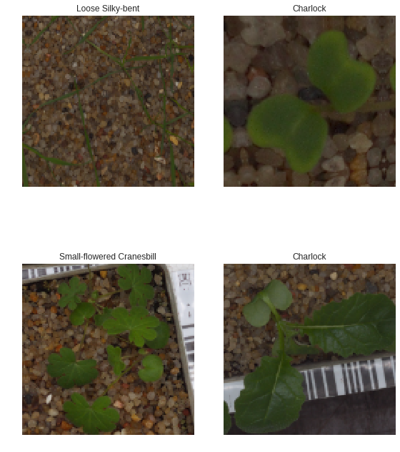
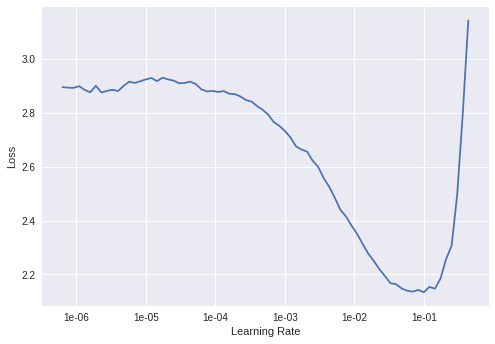
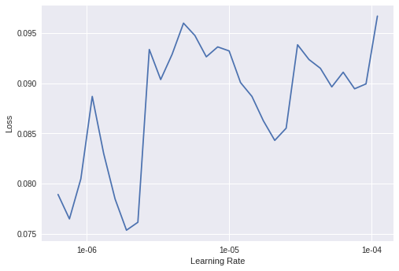
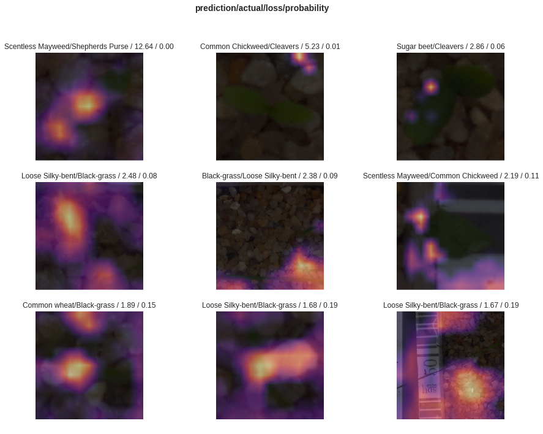
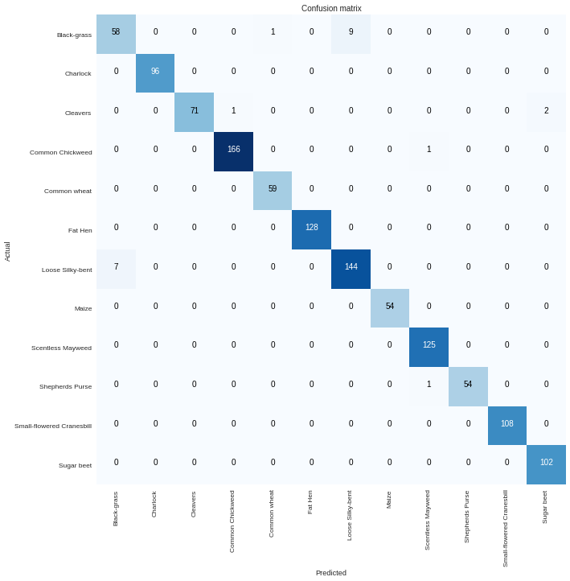

<h1>Table of Contents<span class="tocSkip"></span></h1>
<div class="toc"><ul class="toc-item"><li><span><a href="#下载数据集" data-toc-modified-id="下载数据集-1"><span class="toc-item-num">1&nbsp;&nbsp;</span>下载数据集</a></span><ul class="toc-item"><li><ul class="toc-item"><li><ul class="toc-item"><li><span><a href="#获取kaggle.json" data-toc-modified-id="获取kaggle.json-1.0.0.1"><span class="toc-item-num">1.0.0.1&nbsp;&nbsp;</span>获取kaggle.json</a></span></li><li><span><a href="#确认上传成功" data-toc-modified-id="确认上传成功-1.0.0.2"><span class="toc-item-num">1.0.0.2&nbsp;&nbsp;</span>确认上传成功</a></span></li><li><span><a href="#安装Kaggle-API" data-toc-modified-id="安装Kaggle-API-1.0.0.3"><span class="toc-item-num">1.0.0.3&nbsp;&nbsp;</span>安装Kaggle API</a></span></li><li><span><a href="#制备文件夹和内容" data-toc-modified-id="制备文件夹和内容-1.0.0.4"><span class="toc-item-num">1.0.0.4&nbsp;&nbsp;</span>制备文件夹和内容</a></span></li><li><span><a href="#查看数据集" data-toc-modified-id="查看数据集-1.0.0.5"><span class="toc-item-num">1.0.0.5&nbsp;&nbsp;</span>查看数据集</a></span></li><li><span><a href="#前往官网获取下载API" data-toc-modified-id="前往官网获取下载API-1.0.0.6"><span class="toc-item-num">1.0.0.6&nbsp;&nbsp;</span>前往官网获取下载API</a></span></li><li><span><a href="#unzip数据（无输出打印）" data-toc-modified-id="unzip数据（无输出打印）-1.0.0.7"><span class="toc-item-num">1.0.0.7&nbsp;&nbsp;</span>unzip数据（无输出打印）</a></span></li></ul></li></ul></li></ul></li><li><span><a href="#链接Google-Drive" data-toc-modified-id="链接Google-Drive-2"><span class="toc-item-num">2&nbsp;&nbsp;</span>链接Google Drive</a></span></li><li><span><a href="#获取最新的libraries" data-toc-modified-id="获取最新的libraries-3"><span class="toc-item-num">3&nbsp;&nbsp;</span>获取最新的libraries</a></span><ul class="toc-item"><li><ul class="toc-item"><li><ul class="toc-item"><li><span><a href="#用as-fv的好处" data-toc-modified-id="用as-fv的好处-3.0.0.1"><span class="toc-item-num">3.0.0.1&nbsp;&nbsp;</span>用<code>as fv</code>的好处</a></span></li></ul></li></ul></li></ul></li><li><span><a href="#创建工作路径" data-toc-modified-id="创建工作路径-4"><span class="toc-item-num">4&nbsp;&nbsp;</span>创建工作路径</a></span></li><li><span><a href="#清理空间" data-toc-modified-id="清理空间-5"><span class="toc-item-num">5&nbsp;&nbsp;</span>清理空间</a></span></li><li><span><a href="#构建Databunch，不同图片大小" data-toc-modified-id="构建Databunch，不同图片大小-6"><span class="toc-item-num">6&nbsp;&nbsp;</span>构建Databunch，不同图片大小</a></span><ul class="toc-item"><li><ul class="toc-item"><li><ul class="toc-item"><li><span><a href="#确保验证数据不变" data-toc-modified-id="确保验证数据不变-6.0.0.1"><span class="toc-item-num">6.0.0.1&nbsp;&nbsp;</span>确保验证数据不变</a></span></li><li><span><a href="#创建DataBunch" data-toc-modified-id="创建DataBunch-6.0.0.2"><span class="toc-item-num">6.0.0.2&nbsp;&nbsp;</span>创建DataBunch</a></span></li><li><span><a href="#查看数据" data-toc-modified-id="查看数据-6.0.0.3"><span class="toc-item-num">6.0.0.3&nbsp;&nbsp;</span>查看数据</a></span></li></ul></li></ul></li></ul></li><li><span><a href="#Res152,-128/224/324" data-toc-modified-id="Res152,-128/224/324-7"><span class="toc-item-num">7&nbsp;&nbsp;</span>Res152, 128/224/324</a></span><ul class="toc-item"><li><span><a href="#封冻训练" data-toc-modified-id="封冻训练-7.1"><span class="toc-item-num">7.1&nbsp;&nbsp;</span>封冻训练</a></span><ul class="toc-item"><li><ul class="toc-item"><li><span><a href="#使用坡度最大学习率" data-toc-modified-id="使用坡度最大学习率-7.1.0.1"><span class="toc-item-num">7.1.0.1&nbsp;&nbsp;</span>使用坡度最大学习率</a></span></li><li><span><a href="#使用坡度次之学习率" data-toc-modified-id="使用坡度次之学习率-7.1.0.2"><span class="toc-item-num">7.1.0.2&nbsp;&nbsp;</span>使用坡度次之学习率</a></span></li></ul></li></ul></li><li><span><a href="#解冻，继续训练" data-toc-modified-id="解冻，继续训练-7.2"><span class="toc-item-num">7.2&nbsp;&nbsp;</span>解冻，继续训练</a></span><ul class="toc-item"><li><ul class="toc-item"><li><span><a href="#解冻，看学习率" data-toc-modified-id="解冻，看学习率-7.2.0.1"><span class="toc-item-num">7.2.0.1&nbsp;&nbsp;</span>解冻，看学习率</a></span></li><li><span><a href="#解冻，选择学习率，训练" data-toc-modified-id="解冻，选择学习率，训练-7.2.0.2"><span class="toc-item-num">7.2.0.2&nbsp;&nbsp;</span>解冻，选择学习率，训练</a></span></li><li><span><a href="#解冻，选择另一段学习率，训练" data-toc-modified-id="解冻，选择另一段学习率，训练-7.2.0.3"><span class="toc-item-num">7.2.0.3&nbsp;&nbsp;</span>解冻，选择另一段学习率，训练</a></span></li><li><span><a href="#解冻，选择另一段学习率，训练" data-toc-modified-id="解冻，选择另一段学习率，训练-7.2.0.4"><span class="toc-item-num">7.2.0.4&nbsp;&nbsp;</span>解冻，选择另一段学习率，训练</a></span></li></ul></li></ul></li></ul></li><li><span><a href="#解读" data-toc-modified-id="解读-8"><span class="toc-item-num">8&nbsp;&nbsp;</span>解读</a></span><ul class="toc-item"><li><ul class="toc-item"><li><ul class="toc-item"><li><span><a href="#加载解读模型" data-toc-modified-id="加载解读模型-8.0.0.1"><span class="toc-item-num">8.0.0.1&nbsp;&nbsp;</span>加载解读模型</a></span></li><li><span><a href="#启用分类解读器，最高损失值" data-toc-modified-id="启用分类解读器，最高损失值-8.0.0.2"><span class="toc-item-num">8.0.0.2&nbsp;&nbsp;</span>启用分类解读器，最高损失值</a></span></li><li><span><a href="#最高损失值图片" data-toc-modified-id="最高损失值图片-8.0.0.3"><span class="toc-item-num">8.0.0.3&nbsp;&nbsp;</span>最高损失值图片</a></span></li><li><span><a href="#如何画confusion-matrix" data-toc-modified-id="如何画confusion-matrix-8.0.0.4"><span class="toc-item-num">8.0.0.4&nbsp;&nbsp;</span>如何画confusion matrix</a></span></li><li><span><a href="#将confusion-matrix最严重的例子简单展示" data-toc-modified-id="将confusion-matrix最严重的例子简单展示-8.0.0.5"><span class="toc-item-num">8.0.0.5&nbsp;&nbsp;</span>将confusion matrix最严重的例子简单展示</a></span></li></ul></li></ul></li></ul></li><li><span><a href="#生成结果并上传" data-toc-modified-id="生成结果并上传-9"><span class="toc-item-num">9&nbsp;&nbsp;</span>生成结果并上传</a></span></li><li><span><a href="#目前成绩" data-toc-modified-id="目前成绩-10"><span class="toc-item-num">10&nbsp;&nbsp;</span>目前成绩</a></span></li></ul></div>

Thanks to [kharbanda](https://www.kaggle.com/kharbanda) for sharing the [original kernel](https://www.kaggle.com/kharbanda/fast-ai-v1/) 

# 下载数据集

#### 获取kaggle.json


```python
# go to Kaggle account, create new api token, save kaggle.json locally
# Run this cell and upload the kaggle.json file downloaded
from google.colab import files
files.upload()
```


     <input type="file" id="files-739e61b1-30fe-47c1-816f-d5395e607663" name="files[]" multiple disabled />
     <output id="result-739e61b1-30fe-47c1-816f-d5395e607663">
      Upload widget is only available when the cell has been executed in the
      current browser session. Please rerun this cell to enable.
      </output>
      <script src="/nbextensions/google.colab/files.js"></script> 


    Saving kaggle.json to kaggle.json


    {'kaggle.json': b'{"username":"danielliao","key":"df498051b0d2948166a06d7d7ad5cf42"}'}


#### 确认上传成功


```python
# Let's make sure the kaggle.json file is present.
!ls -lha kaggle.json
```

    -rw-r--r-- 1 root root 66 Mar 17 21:40 kaggle.json


#### 安装Kaggle API


```python
# Next, install the Kaggle API client.
!pip install -q kaggle
```

#### 制备文件夹和内容


```python
# The Kaggle API client expects this file to be in ~/.kaggle,
# so move it there.
!mkdir -p ~/.kaggle
!cp kaggle.json ~/.kaggle/

# This permissions change avoids a warning on Kaggle tool startup.
!chmod 600 ~/.kaggle/kaggle.json
```

#### 查看数据集
不全，没关系


```python
# List available datasets.
!kaggle datasets list
```

    ref                                                          title                                                size  lastUpdated          downloadCount  
    -----------------------------------------------------------  --------------------------------------------------  -----  -------------------  -------------  
    ronitf/heart-disease-uci                                     Heart Disease UCI                                     3KB  2018-06-25 11:33:56          16670  
    karangadiya/fifa19                                           FIFA 19 complete player dataset                       2MB  2018-12-21 03:52:59          14329  
    fivethirtyeight/fivethirtyeight-comic-characters-dataset     FiveThirtyEight Comic Characters Dataset            577KB  2019-02-01 15:02:23           1621  
    russellyates88/suicide-rates-overview-1985-to-2016           Suicide Rates Overview 1985 to 2016                 396KB  2018-12-01 19:18:25          12423  
    bigquery/crypto-ethereum-classic                             Ethereum Classic Blockchain                          69GB  2019-03-04 14:57:33              0  
    lava18/google-play-store-apps                                Google Play Store Apps                                2MB  2019-02-03 13:55:47          42701  
    iarunava/cell-images-for-detecting-malaria                   Malaria Cell Images Dataset                         337MB  2018-12-05 05:40:21           2862  
    anokas/kuzushiji                                             Kuzushiji-MNIST                                     318MB  2018-12-17 01:19:31            613  
    jessicali9530/stanford-dogs-dataset                          Stanford Dogs Dataset                               735MB  2019-02-13 05:45:25           1278  
    mohansacharya/graduate-admissions                            Graduate Admissions                                   9KB  2018-12-28 10:07:14          13763  
    cityofLA/los-angeles-parking-citations                       Los Angeles Parking Citations                       253MB  2019-03-16 22:17:02           2321  
    mdhrumil/top-5000-youtube-channels-data-from-socialblade     Top 5000 Youtube channels data from Socialblade.    128KB  2018-09-09 14:05:54           5121  
    noriuk/us-education-datasets-unification-project             U.S. Education Datasets: Unification Project         85MB  2019-03-02 18:41:52           2134  
    vjchoudhary7/customer-segmentation-tutorial-in-python        Mall Customer Segmentation Data                       2KB  2018-08-11 07:23:02           4553  
    safegraph/visit-patterns-by-census-block-group               Consumer & Visitor Insights For Neighborhoods        66MB  2018-12-19 21:31:50            825  
    jessicali9530/celeba-dataset                                 CelebFaces Attributes (CelebA) Dataset                1GB  2018-06-01 20:08:48           5104  
    rmisra/news-headlines-dataset-for-sarcasm-detection          News Headlines Dataset For Sarcasm Detection          2MB  2018-06-09 22:14:56           1831  
    pavansanagapati/urban-sound-classification                   Urban Sound Classification                            6GB  2018-06-16 13:44:36           1780  
    safegraph/census-block-group-american-community-survey-data  Census Block Group American Community Survey Data     2GB  2018-12-22 00:29:56            480  
    jutrera/stanford-car-dataset-by-classes-folder               Stanford Car Dataset by classes folder                2GB  2018-07-02 07:35:45           2193  


#### 前往官网获取下载API
https://www.kaggle.com/c/plant-seedlings-classification


```python
# Copy the stackoverflow data set locally.
# !kaggle datasets download -d stackoverflow/stack-overflow-2018-developer-survey
# go to https://www.kaggle.com/c/plant-seedlings-classification/data copy the API for downloading
! kaggle competitions download -c plant-seedlings-classification
```

    Downloading sample_submission.csv.zip to /content
      0% 0.00/5.13k [00:00<?, ?B/s]
    100% 5.13k/5.13k [00:00<00:00, 10.1MB/s]
    Downloading test.zip to /content
     94% 81.0M/86.0M [00:01<00:00, 52.1MB/s]
    100% 86.0M/86.0M [00:01<00:00, 65.9MB/s]
    Downloading train.zip to /content
     99% 1.59G/1.60G [00:14<00:00, 86.5MB/s]
    100% 1.60G/1.60G [00:15<00:00, 114MB/s] 


#### unzip数据（无输出打印）


```python
!unzip train.zip; # 仍旧全部打印了
```

    Archive:  train.zip
       creating: train/
       creating: train/Fat Hen/
      inflating: train/Fat Hen/5bdfa3a44.png  
      inflating: train/Fat Hen/a86b9c0cd.png  
      inflating: train/Fat Hen/f3f6559bf.png  
      inflating: train/Fat Hen/946b48f62.png  
      inflating: train/Fat Hen/4d7fd4020.png  
      inflating: train/Fat Hen/2509e5bc5.png  
      inflating: train/Fat Hen/e2462573b.png  
      inflating: train/Fat Hen/7e98e4aa6.png  
      inflating: train/Fat Hen/075cb6666.png  
      inflating: train/Fat Hen/b43d0a350.png  
      inflating: train/Fat Hen/afac20b21.png  
      inflating: train/Fat Hen/4d2efbb45.png  
      inflating: train/Fat Hen/f0923dcd6.png  
      inflating: train/Fat Hen/180f41d53.png  
      inflating: train/Fat Hen/bfdeafadd.png  
      inflating: train/Fat Hen/ac6625b0f.png  
      inflating: train/Fat Hen/ba5c8f87f.png  
      inflating: train/Fat Hen/e7d278e0e.png  
      inflating: train/Fat Hen/efaab2370.png  
      inflating: train/Fat Hen/9d4722e74.png  
      inflating: train/Fat Hen/4e2f543a2.png  
      inflating: train/Fat Hen/53c6c6221.png  
      inflating: train/Fat Hen/3ffc2f66d.png  
      inflating: train/Fat Hen/7bb3a73ca.png  
      inflating: train/Fat Hen/510f3ba19.png  
      inflating: train/Fat Hen/c3a35fbde.png  
      inflating: train/Fat Hen/c3aa41593.png  
      inflating: train/Fat Hen/a5c5b9386.png  
      inflating: train/Fat Hen/214f2dbcb.png  
      inflating: train/Fat Hen/60f67d18f.png  
      inflating: train/Fat Hen/bd70765e4.png  
      inflating: train/Fat Hen/268e72cee.png  
      inflating: train/Fat Hen/a7e5ce252.png  
      inflating: train/Fat Hen/52e6df585.png  
      inflating: train/Fat Hen/e0308226e.png  
      inflating: train/Fat Hen/109e25d2a.png  
      inflating: train/Fat Hen/207d4e9ce.png  
      inflating: train/Fat Hen/eace614b4.png  
      inflating: train/Fat Hen/9961b2091.png  
      inflating: train/Fat Hen/5ca463797.png  
      inflating: train/Fat Hen/c96ca4b01.png  
      inflating: train/Fat Hen/5aa1ee0b1.png  
      inflating: train/Fat Hen/9812f690c.png  
      inflating: train/Fat Hen/db673dc46.png  
      inflating: train/Fat Hen/ea775ab85.png  
      inflating: train/Fat Hen/3b6a97588.png  
      inflating: train/Fat Hen/134db7c0e.png  
      inflating: train/Fat Hen/854fdbe6a.png  
      inflating: train/Fat Hen/aaf5833f8.png  
      inflating: train/Fat Hen/65d2f9cc0.png  
      inflating: train/Fat Hen/4a44a00eb.png  
     extracting: train/Fat Hen/9168bde0c.png  
      inflating: train/Fat Hen/302f8959d.png  
      inflating: train/Fat Hen/b3e1dda94.png  
      inflating: train/Fat Hen/8a748cf8b.png  
      inflating: train/Fat Hen/cf149b185.png  
      inflating: train/Fat Hen/1d9743b35.png  
      inflating: train/Fat Hen/496ca82ae.png  
      inflating: train/Fat Hen/ad58587fb.png  
      inflating: train/Fat Hen/7abe4427d.png  
      inflating: train/Fat Hen/3cafef989.png  
      inflating: train/Fat Hen/c17447438.png  
      inflating: train/Fat Hen/9dc631eaa.png  
      inflating: train/Fat Hen/9d25b73be.png  
      inflating: train/Fat Hen/6e54ab8b9.png  
      inflating: train/Fat Hen/7b0bd3d8d.png  
      inflating: train/Fat Hen/5f6ad629d.png  
      inflating: train/Fat Hen/3dbdd9fe7.png  
      inflating: train/Fat Hen/994001cab.png  
      inflating: train/Fat Hen/9a8531ba0.png  
      inflating: train/Fat Hen/13d56e652.png  
      inflating: train/Fat Hen/92954f77f.png  
      inflating: train/Fat Hen/7e4b6625f.png  
      inflating: train/Fat Hen/5e2cfbee3.png  
      inflating: train/Fat Hen/f052e1db1.png  
      inflating: train/Fat Hen/ba9dc6742.png  
      inflating: train/Fat Hen/bdf58ae69.png  
      inflating: train/Fat Hen/cbdb42238.png  
      inflating: train/Fat Hen/ce49ecca3.png  
      inflating: train/Fat Hen/fa57ed595.png  
      inflating: train/Fat Hen/ed22ec740.png  
      inflating: train/Fat Hen/b88da8e21.png  
      inflating: train/Fat Hen/bf17c8991.png  
      inflating: train/Fat Hen/e34aec452.png  
      inflating: train/Fat Hen/40321aa58.png  
      inflating: train/Fat Hen/7894abcbb.png  
      inflating: train/Fat Hen/d2434e784.png  
      inflating: train/Fat Hen/52bcf3283.png  
      inflating: train/Fat Hen/d233d03bb.png  
      inflating: train/Fat Hen/5dc10869f.png  
      inflating: train/Fat Hen/11e40532a.png  
      inflating: train/Fat Hen/997fc29b0.png  
      inflating: train/Fat Hen/3c18b504d.png  
      inflating: train/Fat Hen/6e735b605.png  
      inflating: train/Fat Hen/40721b002.png  
      inflating: train/Fat Hen/d199b75a6.png  
      inflating: train/Fat Hen/94ff7314b.png  
      inflating: train/Fat Hen/ec81b8667.png  
      inflating: train/Fat Hen/19c84bc7c.png  
      inflating: train/Fat Hen/e5e1f6d81.png  
      inflating: train/Fat Hen/d47349f62.png  
      inflating: train/Fat Hen/25ff4825d.png  
      inflating: train/Fat Hen/3d2f3ad0f.png  
      inflating: train/Fat Hen/c75a48496.png  
      inflating: train/Fat Hen/7026b68e9.png  
      inflating: train/Fat Hen/e27bb5522.png  
      inflating: train/Fat Hen/35ae5f914.png  
      inflating: train/Fat Hen/10553b4e8.png  
      inflating: train/Fat Hen/a1a3e2515.png  
      inflating: train/Fat Hen/cca9e1864.png  
      inflating: train/Fat Hen/88ea1ed2a.png  
      inflating: train/Fat Hen/61fd68900.png  
      inflating: train/Fat Hen/5357849ba.png  
      inflating: train/Fat Hen/b8e176ae8.png  
      inflating: train/Fat Hen/ccb763490.png  
      inflating: train/Fat Hen/2d6ffd537.png  
      inflating: train/Fat Hen/a5aa3564a.png  
      inflating: train/Fat Hen/6f099ece0.png  
      inflating: train/Fat Hen/2b16fb022.png  
      inflating: train/Fat Hen/23a4cbe43.png  
      inflating: train/Fat Hen/44db98326.png  
      inflating: train/Fat Hen/6f7c00476.png  
      inflating: train/Fat Hen/d09f9b311.png  
      inflating: train/Fat Hen/6ac7f6411.png  
      inflating: train/Fat Hen/01396e759.png  
      inflating: train/Fat Hen/0d5ece722.png  
      inflating: train/Fat Hen/fdc1eedc6.png  
      inflating: train/Fat Hen/07d939b1e.png  
      inflating: train/Fat Hen/f0e75e3bf.png  
      inflating: train/Fat Hen/020ac5b06.png  
      inflating: train/Fat Hen/34eb21afb.png  
      inflating: train/Fat Hen/5281f6020.png  
      inflating: train/Fat Hen/bfaab608c.png  
      inflating: train/Fat Hen/9708f9c0e.png  
     extracting: train/Fat Hen/c5a0bd47e.png  
      inflating: train/Fat Hen/629185134.png  
      inflating: train/Fat Hen/ce0d8c3b2.png  
      inflating: train/Fat Hen/f36b25868.png  
      inflating: train/Fat Hen/01437202b.png  
      inflating: train/Fat Hen/df9ce5e1f.png  
      inflating: train/Fat Hen/f605d4fb8.png  
      inflating: train/Fat Hen/fdfb296da.png  
      inflating: train/Fat Hen/f33cee49e.png  
      inflating: train/Fat Hen/f59177ec7.png  
      inflating: train/Fat Hen/840018e57.png  
      inflating: train/Fat Hen/e805aa0a2.png  
      inflating: train/Fat Hen/8e0c81139.png  
      inflating: train/Fat Hen/803474779.png  
      inflating: train/Fat Hen/655471b48.png  
      inflating: train/Fat Hen/f4cdd6b9e.png  
      inflating: train/Fat Hen/5a1183fff.png  
      inflating: train/Fat Hen/22d4656ff.png  
      inflating: train/Fat Hen/61d4251ca.png  
      inflating: train/Fat Hen/009004da3.png  
      inflating: train/Fat Hen/64034603a.png  
      inflating: train/Fat Hen/184f64b26.png  
      inflating: train/Fat Hen/46fa84dad.png  
     extracting: train/Fat Hen/85e6fa66d.png  
      inflating: train/Fat Hen/59b1f956d.png  
      inflating: train/Fat Hen/dff210db9.png  
      inflating: train/Fat Hen/817eefb90.png  
      inflating: train/Fat Hen/3c51bc884.png  
      inflating: train/Fat Hen/70f84707a.png  
      inflating: train/Fat Hen/4979cba5a.png  
      inflating: train/Fat Hen/d870ecd2c.png  
      inflating: train/Fat Hen/caca90aca.png  
      inflating: train/Fat Hen/2719ff172.png  
      inflating: train/Fat Hen/2160ec61c.png  
      inflating: train/Fat Hen/85a848757.png  
      inflating: train/Fat Hen/11e284489.png  
      inflating: train/Fat Hen/c4152caea.png  
      inflating: train/Fat Hen/f2b9bb477.png  
      inflating: train/Fat Hen/64f46676b.png  
      inflating: train/Fat Hen/1688c9a5f.png  
      inflating: train/Fat Hen/79933186c.png  
      inflating: train/Fat Hen/2b17dc2ba.png  
      inflating: train/Fat Hen/7637818c7.png  
      inflating: train/Fat Hen/0157c4199.png  
      inflating: train/Fat Hen/c679a9396.png  
      inflating: train/Fat Hen/3d07c273b.png  
      inflating: train/Fat Hen/f44059ad0.png  
      inflating: train/Fat Hen/45c197012.png  
      inflating: train/Fat Hen/fe2ad3d8c.png  
      inflating: train/Fat Hen/a7fef768d.png  
      inflating: train/Fat Hen/1e9c7a82f.png  
      inflating: train/Fat Hen/a258e82f2.png  
      inflating: train/Fat Hen/2a56e7fec.png  
      inflating: train/Fat Hen/9297b85f6.png  
      inflating: train/Fat Hen/c926ade1d.png  
      inflating: train/Fat Hen/52e82d773.png  
      inflating: train/Fat Hen/2dea1d8a6.png  
      inflating: train/Fat Hen/a5ca3b845.png  
      inflating: train/Fat Hen/bd4003440.png  
      inflating: train/Fat Hen/b07391323.png  
      inflating: train/Fat Hen/5f24e1079.png  
      inflating: train/Fat Hen/4f0092891.png  
      inflating: train/Fat Hen/5c2f52e61.png  
      inflating: train/Fat Hen/5a4dfea94.png  
      inflating: train/Fat Hen/f0dbc5e1e.png  
      inflating: train/Fat Hen/2f1633635.png  
      inflating: train/Fat Hen/765502bd2.png  
      inflating: train/Fat Hen/3b244dc9d.png  
      inflating: train/Fat Hen/42912adf2.png  
      inflating: train/Fat Hen/685091401.png  
      inflating: train/Fat Hen/bdc98dfaf.png  
      inflating: train/Fat Hen/8f56f8b0e.png  
      inflating: train/Fat Hen/8f6b56be9.png  
      inflating: train/Fat Hen/9064640e8.png  
      inflating: train/Fat Hen/165407507.png  
      inflating: train/Fat Hen/886db2427.png  
      inflating: train/Fat Hen/72103b235.png  
      inflating: train/Fat Hen/d569925d7.png  
      inflating: train/Fat Hen/d3e5f8c5e.png  
      inflating: train/Fat Hen/3c2e5c7ad.png  
      inflating: train/Fat Hen/d87eb38df.png  
      inflating: train/Fat Hen/1df9e7301.png  
      inflating: train/Fat Hen/3c5e42c9a.png  
      inflating: train/Fat Hen/1fb586773.png  
      inflating: train/Fat Hen/55fef4910.png  
      inflating: train/Fat Hen/67d48e1b4.png  
      inflating: train/Fat Hen/d10feb105.png  
      inflating: train/Fat Hen/c206f4602.png  
      inflating: train/Fat Hen/1c4f59d14.png  
      inflating: train/Fat Hen/f09c51a67.png  
      inflating: train/Fat Hen/14f7687d1.png  
      inflating: train/Fat Hen/2df7f8513.png  
      inflating: train/Fat Hen/e6befd0af.png  
      inflating: train/Fat Hen/4a320f8be.png  
      inflating: train/Fat Hen/19fc23481.png  
      inflating: train/Fat Hen/62f3abbd1.png  
      inflating: train/Fat Hen/3572c1951.png  
      inflating: train/Fat Hen/67659c7df.png  
      inflating: train/Fat Hen/5f6634fa4.png  
      inflating: train/Fat Hen/84097b0b7.png  
      inflating: train/Fat Hen/8a8b1f0fd.png  
      inflating: train/Fat Hen/bd8a05057.png  
      inflating: train/Fat Hen/bcb9e211a.png  
      inflating: train/Fat Hen/a140930c0.png  
      inflating: train/Fat Hen/0486762e1.png  
      inflating: train/Fat Hen/79cec7209.png  
      inflating: train/Fat Hen/9f2435711.png  
      inflating: train/Fat Hen/1eb0d7c5f.png  
      inflating: train/Fat Hen/75739ff4d.png  
      inflating: train/Fat Hen/00268e97d.png  
      inflating: train/Fat Hen/c99df077e.png  
      inflating: train/Fat Hen/e777e1303.png  
      inflating: train/Fat Hen/420e17575.png  
      inflating: train/Fat Hen/4f1566bb4.png  
      inflating: train/Fat Hen/95f035f39.png  
      inflating: train/Fat Hen/5f2ad45c4.png  
      inflating: train/Fat Hen/6b6061001.png  
      inflating: train/Fat Hen/d402cc5ca.png  
      inflating: train/Fat Hen/b4e738f6b.png  
      inflating: train/Fat Hen/73600b4ed.png  
      inflating: train/Fat Hen/0f335c7a7.png  
      inflating: train/Fat Hen/4c832853a.png  
      inflating: train/Fat Hen/0dfbbc7fe.png  
      inflating: train/Fat Hen/c315f4c96.png  
      inflating: train/Fat Hen/9e59fcd81.png  
      inflating: train/Fat Hen/81af6efb2.png  
      inflating: train/Fat Hen/8cb53bccc.png  
      inflating: train/Fat Hen/5298e390e.png  
      inflating: train/Fat Hen/1bcdf1f95.png  
      inflating: train/Fat Hen/be71f0cc0.png  
      inflating: train/Fat Hen/67e5eeea7.png  
      inflating: train/Fat Hen/c41bd998c.png  
      inflating: train/Fat Hen/bf37d581c.png  
      inflating: train/Fat Hen/427bbd2fb.png  
      inflating: train/Fat Hen/10a61c74f.png  
      inflating: train/Fat Hen/326c83b87.png  
      inflating: train/Fat Hen/df17b3ba5.png  
      inflating: train/Fat Hen/9e8727146.png  
      inflating: train/Fat Hen/bc10332f0.png  
      inflating: train/Fat Hen/91bc7d91c.png  
      inflating: train/Fat Hen/c44243e23.png  
      inflating: train/Fat Hen/d210b0125.png  
      inflating: train/Fat Hen/61f732692.png  
      inflating: train/Fat Hen/86536f469.png  
      inflating: train/Fat Hen/88e4077c5.png  
      inflating: train/Fat Hen/7085a144b.png  
      inflating: train/Fat Hen/0eeb0c7c1.png  
      inflating: train/Fat Hen/c1d528ca2.png  
      inflating: train/Fat Hen/c9e6722d4.png  
      inflating: train/Fat Hen/fea20eec7.png  
      inflating: train/Fat Hen/33c6627d2.png  
      inflating: train/Fat Hen/295ddd0b8.png  
      inflating: train/Fat Hen/b59aec1e1.png  
      inflating: train/Fat Hen/ef1f257d9.png  
      inflating: train/Fat Hen/38cc62ed1.png  
      inflating: train/Fat Hen/1797f5460.png  
      inflating: train/Fat Hen/661a6866f.png  
      inflating: train/Fat Hen/a3e1e7ffd.png  
      inflating: train/Fat Hen/1a5354a5b.png  
      inflating: train/Fat Hen/aa4c94174.png  
      inflating: train/Fat Hen/91a5d8724.png  
      inflating: train/Fat Hen/cc590cddc.png  
      inflating: train/Fat Hen/9d2684128.png  
      inflating: train/Fat Hen/f18419d0c.png  
      inflating: train/Fat Hen/5f5015641.png  
      inflating: train/Fat Hen/9284ed9c9.png  
      inflating: train/Fat Hen/4c835827d.png  
      inflating: train/Fat Hen/8eed146cd.png  
      inflating: train/Fat Hen/bd3b1cb2e.png  
      inflating: train/Fat Hen/d6a104d24.png  
      inflating: train/Fat Hen/1bdf63082.png  
      inflating: train/Fat Hen/cd16fe7e4.png  
      inflating: train/Fat Hen/c734bade3.png  
      inflating: train/Fat Hen/7678bf0c5.png  
      inflating: train/Fat Hen/302a3a8ba.png  
      inflating: train/Fat Hen/d6576bc79.png  
      inflating: train/Fat Hen/beb11008f.png  
      inflating: train/Fat Hen/ac50d45a7.png  
      inflating: train/Fat Hen/e5e1416a2.png  
      inflating: train/Fat Hen/2760cb984.png  
      inflating: train/Fat Hen/5d9dd8926.png  
      inflating: train/Fat Hen/81db6f8a2.png  
      inflating: train/Fat Hen/56ee7f90f.png  
      inflating: train/Fat Hen/ea7e6ec7f.png  
      inflating: train/Fat Hen/ff9f29145.png  
      inflating: train/Fat Hen/4058dd2cd.png  
      inflating: train/Fat Hen/f86c14eaf.png  
      inflating: train/Fat Hen/e8c85738d.png  
      inflating: train/Fat Hen/216b1daa0.png  
      inflating: train/Fat Hen/6cfecf7c5.png  
      inflating: train/Fat Hen/26220c5b7.png  
      inflating: train/Fat Hen/a1971cff3.png  
      inflating: train/Fat Hen/cbf4c5ad2.png  
      inflating: train/Fat Hen/ea6e91be6.png  
      inflating: train/Fat Hen/5c3a4a6ed.png  
      inflating: train/Fat Hen/28fad5a34.png  
      inflating: train/Fat Hen/f180203df.png  
      inflating: train/Fat Hen/7195021a5.png  
      inflating: train/Fat Hen/b0398be3d.png  
      inflating: train/Fat Hen/d1d6c2904.png  
      inflating: train/Fat Hen/c740aa55a.png  
      inflating: train/Fat Hen/2d34a64af.png  
      inflating: train/Fat Hen/fe23b8530.png  
      inflating: train/Fat Hen/3fe21a3d4.png  
      inflating: train/Fat Hen/370b70617.png  
      inflating: train/Fat Hen/ac502b28e.png  
      inflating: train/Fat Hen/e7fbf693d.png  
      inflating: train/Fat Hen/a57f8af28.png  
      inflating: train/Fat Hen/5cc2862dc.png  
      inflating: train/Fat Hen/370af1cdd.png  
      inflating: train/Fat Hen/f348e35e9.png  
      inflating: train/Fat Hen/0c5368b03.png  
      inflating: train/Fat Hen/b4e6ee3d2.png  
      inflating: train/Fat Hen/704b0fe2c.png  
      inflating: train/Fat Hen/23525c578.png  
      inflating: train/Fat Hen/07636139b.png  
      inflating: train/Fat Hen/03100eb7e.png  
      inflating: train/Fat Hen/614b0792a.png  
      inflating: train/Fat Hen/91c33cc1c.png  
      inflating: train/Fat Hen/4f2f35ea4.png  
      inflating: train/Fat Hen/077190c7a.png  
      inflating: train/Fat Hen/08fe5538d.png  
      inflating: train/Fat Hen/ac88a6662.png  
      inflating: train/Fat Hen/4570becfb.png  
      inflating: train/Fat Hen/6dc0cf03c.png  
      inflating: train/Fat Hen/b039fd244.png  
      inflating: train/Fat Hen/8b3943e1e.png  
      inflating: train/Fat Hen/e4541fd1c.png  
      inflating: train/Fat Hen/02a67d111.png  
      inflating: train/Fat Hen/0c03386a9.png  
      inflating: train/Fat Hen/f1b52dd6f.png  
      inflating: train/Fat Hen/1266ac5cb.png  
      inflating: train/Fat Hen/58028a2fb.png  
      inflating: train/Fat Hen/e3279d465.png  
      inflating: train/Fat Hen/2c25bee0b.png  
      inflating: train/Fat Hen/ad5ee2832.png  
      inflating: train/Fat Hen/2918206b5.png  
      inflating: train/Fat Hen/19bd579f5.png  
      inflating: train/Fat Hen/fee90e281.png  
      inflating: train/Fat Hen/35083f3c2.png  
      inflating: train/Fat Hen/a4d7cddff.png  
      inflating: train/Fat Hen/c8e77995b.png  
      inflating: train/Fat Hen/bbee46239.png  
      inflating: train/Fat Hen/4374a9eef.png  
      inflating: train/Fat Hen/9f4788348.png  
      inflating: train/Fat Hen/77fcd0e5d.png  
      inflating: train/Fat Hen/842f5555e.png  
      inflating: train/Fat Hen/fbd995178.png  
      inflating: train/Fat Hen/a74864d83.png  
      inflating: train/Fat Hen/91e05c100.png  
      inflating: train/Fat Hen/e0cab89f3.png  
      inflating: train/Fat Hen/83be0f22d.png  
      inflating: train/Fat Hen/52c144a42.png  
      inflating: train/Fat Hen/3ae60f149.png  
      inflating: train/Fat Hen/a309725cd.png  
      inflating: train/Fat Hen/d0c3b7610.png  
      inflating: train/Fat Hen/27d310b2a.png  
      inflating: train/Fat Hen/d2e16e332.png  
      inflating: train/Fat Hen/6644e24c8.png  
      inflating: train/Fat Hen/34cec646b.png  
      inflating: train/Fat Hen/a02a0c284.png  
      inflating: train/Fat Hen/066395555.png  
      inflating: train/Fat Hen/eb6811993.png  
     extracting: train/Fat Hen/4b5f2e2a0.png  
      inflating: train/Fat Hen/d99fa0e0b.png  
      inflating: train/Fat Hen/cb698f0ea.png  
      inflating: train/Fat Hen/bbcc5bbb2.png  
      inflating: train/Fat Hen/6e6b9a20f.png  
      inflating: train/Fat Hen/a7d5da828.png  
      inflating: train/Fat Hen/beafe5bb1.png  
      inflating: train/Fat Hen/0a1480ed8.png  
      inflating: train/Fat Hen/524942b65.png  
      inflating: train/Fat Hen/c8ce795f0.png  
      inflating: train/Fat Hen/008f1b92d.png  
      inflating: train/Fat Hen/ccc42874e.png  
      inflating: train/Fat Hen/5e72c6e8f.png  
      inflating: train/Fat Hen/7ce630c2a.png  
      inflating: train/Fat Hen/bcbbdd3bd.png  
      inflating: train/Fat Hen/2eb6d7f8e.png  
      inflating: train/Fat Hen/43633755b.png  
      inflating: train/Fat Hen/952f0a5fa.png  
      inflating: train/Fat Hen/e9f00ae2c.png  
      inflating: train/Fat Hen/bbcb520e8.png  
      inflating: train/Fat Hen/143e09ce6.png  
      inflating: train/Fat Hen/e973ac6bc.png  
      inflating: train/Fat Hen/b4fd78671.png  
      inflating: train/Fat Hen/c068b9fb7.png  
      inflating: train/Fat Hen/df62f1c7d.png  
      inflating: train/Fat Hen/565d13821.png  
      inflating: train/Fat Hen/6d9dafb55.png  
      inflating: train/Fat Hen/83f907552.png  
      inflating: train/Fat Hen/c386194a6.png  
      inflating: train/Fat Hen/b2f74bf81.png  
      inflating: train/Fat Hen/158ac618f.png  
      inflating: train/Fat Hen/dbb008ffc.png  
      inflating: train/Fat Hen/e00ed0e9e.png  
      inflating: train/Fat Hen/100ef76fb.png  
      inflating: train/Fat Hen/57914613f.png  
      inflating: train/Fat Hen/d614cd719.png  
      inflating: train/Fat Hen/211c3f24f.png  
      inflating: train/Fat Hen/8611e1c13.png  
      inflating: train/Fat Hen/d674d9e99.png  
      inflating: train/Fat Hen/ef1303b4a.png  
      inflating: train/Fat Hen/ea5ac32c1.png  
      inflating: train/Fat Hen/98cf53a24.png  
      inflating: train/Fat Hen/7f731311e.png  
      inflating: train/Fat Hen/2412cb19b.png  
      inflating: train/Fat Hen/193f4c946.png  
      inflating: train/Fat Hen/0e4df9f15.png  
      inflating: train/Fat Hen/ff202577d.png  
      inflating: train/Fat Hen/ea239a8cd.png  
      inflating: train/Fat Hen/22cd06b64.png  
      inflating: train/Fat Hen/b89d9f403.png  
      inflating: train/Fat Hen/35655c594.png  
      inflating: train/Fat Hen/160dacec0.png  
      inflating: train/Fat Hen/aa0f9c454.png  
      inflating: train/Fat Hen/a7547b978.png  
      inflating: train/Fat Hen/038850f48.png  
      inflating: train/Fat Hen/2f80532a2.png  
      inflating: train/Fat Hen/786319e1b.png  
      inflating: train/Fat Hen/ec7cde707.png  
      inflating: train/Fat Hen/e74f35d5d.png  
      inflating: train/Fat Hen/1012b652c.png  
      inflating: train/Fat Hen/fbd8e91d3.png  
      inflating: train/Fat Hen/190b948d5.png  
      inflating: train/Fat Hen/5f1fd3c70.png  
      inflating: train/Fat Hen/e1783ecc3.png  
      inflating: train/Fat Hen/149dbba5f.png  
      inflating: train/Fat Hen/5aae43c81.png  
      inflating: train/Fat Hen/c354695d7.png  
      inflating: train/Fat Hen/0a4ab470e.png  
      inflating: train/Fat Hen/c1350e0ae.png  
      inflating: train/Fat Hen/2cab73c25.png  
      inflating: train/Fat Hen/e6b756e98.png  
      inflating: train/Fat Hen/3ac434ccd.png  
      inflating: train/Fat Hen/b8e3dd9ae.png  
      inflating: train/Fat Hen/cc40c32ed.png  
      inflating: train/Fat Hen/8689b3765.png  
      inflating: train/Fat Hen/56d88c09d.png  
      inflating: train/Fat Hen/c4b7cf7f5.png  
      inflating: train/Fat Hen/6b175ade7.png  
       creating: train/Small-flowered Cranesbill/
      inflating: train/Small-flowered Cranesbill/2e1dc6e23.png  
      inflating: train/Small-flowered Cranesbill/2acee6217.png  
      inflating: train/Small-flowered Cranesbill/70aa9e547.png  
      inflating: train/Small-flowered Cranesbill/a17451743.png  
      inflating: train/Small-flowered Cranesbill/9ca3c5573.png  
      inflating: train/Small-flowered Cranesbill/7d89d7a87.png  
      inflating: train/Small-flowered Cranesbill/e29577320.png  
      inflating: train/Small-flowered Cranesbill/cd47ff628.png  
      inflating: train/Small-flowered Cranesbill/8dc954c08.png  
      inflating: train/Small-flowered Cranesbill/5dbc8a7d9.png  
      inflating: train/Small-flowered Cranesbill/33c5d5c61.png  
      inflating: train/Small-flowered Cranesbill/21f880735.png  
      inflating: train/Small-flowered Cranesbill/79cc6a8e8.png  
      inflating: train/Small-flowered Cranesbill/acbf61855.png  
      inflating: train/Small-flowered Cranesbill/f467bd532.png  
      inflating: train/Small-flowered Cranesbill/cf60b7687.png  
      inflating: train/Small-flowered Cranesbill/688b5551d.png  
      inflating: train/Small-flowered Cranesbill/29ed37400.png  
      inflating: train/Small-flowered Cranesbill/b48d3c6cd.png  
      inflating: train/Small-flowered Cranesbill/7adff29ac.png  
      inflating: train/Small-flowered Cranesbill/882227162.png  
      inflating: train/Small-flowered Cranesbill/db360e6d2.png  
      inflating: train/Small-flowered Cranesbill/00d030ea0.png  
      inflating: train/Small-flowered Cranesbill/e909c5348.png  
      inflating: train/Small-flowered Cranesbill/869c32954.png  
      inflating: train/Small-flowered Cranesbill/6c03f3f02.png  
      inflating: train/Small-flowered Cranesbill/5d1f49b75.png  
      inflating: train/Small-flowered Cranesbill/b5454be5c.png  
      inflating: train/Small-flowered Cranesbill/4a2f80f95.png  
      inflating: train/Small-flowered Cranesbill/bf60251b5.png  
      inflating: train/Small-flowered Cranesbill/d492da1ba.png  
      inflating: train/Small-flowered Cranesbill/06a64ac47.png  
      inflating: train/Small-flowered Cranesbill/42db489c6.png  
      inflating: train/Small-flowered Cranesbill/ec87dcbbf.png  
      inflating: train/Small-flowered Cranesbill/4430933ca.png  
      inflating: train/Small-flowered Cranesbill/9dd370e79.png  
      inflating: train/Small-flowered Cranesbill/1a73adfd9.png  
      inflating: train/Small-flowered Cranesbill/498878207.png  
      inflating: train/Small-flowered Cranesbill/63ede4ce5.png  
      inflating: train/Small-flowered Cranesbill/81550ffb9.png  
      inflating: train/Small-flowered Cranesbill/3b27d30a3.png  
      inflating: train/Small-flowered Cranesbill/29c3df915.png  
      inflating: train/Small-flowered Cranesbill/28f8c7f43.png  
      inflating: train/Small-flowered Cranesbill/3c6f4fe90.png  
      inflating: train/Small-flowered Cranesbill/6b950f5f0.png  
      inflating: train/Small-flowered Cranesbill/1b71148aa.png  
      inflating: train/Small-flowered Cranesbill/12ba9357a.png  
      inflating: train/Small-flowered Cranesbill/55f1cad85.png  
      inflating: train/Small-flowered Cranesbill/d03c0b230.png  
      inflating: train/Small-flowered Cranesbill/fae94cdba.png  
      inflating: train/Small-flowered Cranesbill/8e1a744c8.png  
      inflating: train/Small-flowered Cranesbill/c7344c2e3.png  
      inflating: train/Small-flowered Cranesbill/749f91a6f.png  
      inflating: train/Small-flowered Cranesbill/ceaf23106.png  
      inflating: train/Small-flowered Cranesbill/2ab0c21fb.png  
      inflating: train/Small-flowered Cranesbill/75107b8b4.png  
      inflating: train/Small-flowered Cranesbill/50a132243.png  
      inflating: train/Small-flowered Cranesbill/a1f60fe38.png  
      inflating: train/Small-flowered Cranesbill/d52d13ac9.png  
      inflating: train/Small-flowered Cranesbill/7d4bd6fe6.png  
      inflating: train/Small-flowered Cranesbill/d21bfbaa7.png  
      inflating: train/Small-flowered Cranesbill/47c9b5639.png  
      inflating: train/Small-flowered Cranesbill/984f52a86.png  
      inflating: train/Small-flowered Cranesbill/a7864d8f3.png  
      inflating: train/Small-flowered Cranesbill/635dc514d.png  
      inflating: train/Small-flowered Cranesbill/e8a99d459.png  
      inflating: train/Small-flowered Cranesbill/8023cf2e2.png  
      inflating: train/Small-flowered Cranesbill/01e18fd1a.png  
      inflating: train/Small-flowered Cranesbill/b4cf2660d.png  
      inflating: train/Small-flowered Cranesbill/276bb8993.png  
      inflating: train/Small-flowered Cranesbill/34a7bd232.png  
      inflating: train/Small-flowered Cranesbill/04559c69c.png  
      inflating: train/Small-flowered Cranesbill/79158945e.png  
      inflating: train/Small-flowered Cranesbill/c046b4f90.png  
      inflating: train/Small-flowered Cranesbill/86a747d04.png  
      inflating: train/Small-flowered Cranesbill/137126847.png  
      inflating: train/Small-flowered Cranesbill/cae4dac21.png  
      inflating: train/Small-flowered Cranesbill/6749e8eec.png  
      inflating: train/Small-flowered Cranesbill/23125a26e.png  
      inflating: train/Small-flowered Cranesbill/8d3505642.png  
      inflating: train/Small-flowered Cranesbill/c2922dd4b.png  
      inflating: train/Small-flowered Cranesbill/b53ebbdc8.png  
      inflating: train/Small-flowered Cranesbill/c97427ee2.png  
      inflating: train/Small-flowered Cranesbill/a11144563.png  
      inflating: train/Small-flowered Cranesbill/4507d5e15.png  
      inflating: train/Small-flowered Cranesbill/d7314844c.png  
      inflating: train/Small-flowered Cranesbill/3cdca6a6c.png  
      inflating: train/Small-flowered Cranesbill/3ad4ad205.png  
      inflating: train/Small-flowered Cranesbill/e19c8b666.png  
      inflating: train/Small-flowered Cranesbill/0e7f05ec0.png  
      inflating: train/Small-flowered Cranesbill/6793f76c0.png  
      inflating: train/Small-flowered Cranesbill/6efe11b4b.png  
      inflating: train/Small-flowered Cranesbill/f57d6d212.png  
      inflating: train/Small-flowered Cranesbill/655b9fa57.png  
      inflating: train/Small-flowered Cranesbill/909da3410.png  
      inflating: train/Small-flowered Cranesbill/90246ebf3.png  
      inflating: train/Small-flowered Cranesbill/8f463eb5c.png  
      inflating: train/Small-flowered Cranesbill/b1878d0bc.png  
      inflating: train/Small-flowered Cranesbill/abf3ee5df.png  
      inflating: train/Small-flowered Cranesbill/09d34fe5b.png  
      inflating: train/Small-flowered Cranesbill/8668f7d12.png  
      inflating: train/Small-flowered Cranesbill/0d85a4e16.png  
      inflating: train/Small-flowered Cranesbill/f253f407d.png  
      inflating: train/Small-flowered Cranesbill/a092428cd.png  
      inflating: train/Small-flowered Cranesbill/e787fda09.png  
      inflating: train/Small-flowered Cranesbill/055922489.png  
      inflating: train/Small-flowered Cranesbill/d394d353a.png  
      inflating: train/Small-flowered Cranesbill/72243ee0c.png  
      inflating: train/Small-flowered Cranesbill/9f87371b2.png  
      inflating: train/Small-flowered Cranesbill/28da4b5c3.png  
      inflating: train/Small-flowered Cranesbill/d9f79c9ce.png  
      inflating: train/Small-flowered Cranesbill/4a786b0d4.png  
      inflating: train/Small-flowered Cranesbill/88e24e307.png  
      inflating: train/Small-flowered Cranesbill/e0ed50f3a.png  
      inflating: train/Small-flowered Cranesbill/13729b12c.png  
      inflating: train/Small-flowered Cranesbill/e682d2f54.png  
      inflating: train/Small-flowered Cranesbill/9b569f4c2.png  
      inflating: train/Small-flowered Cranesbill/91cd35be2.png  
      inflating: train/Small-flowered Cranesbill/a1ab74926.png  
      inflating: train/Small-flowered Cranesbill/ccf00806f.png  
      inflating: train/Small-flowered Cranesbill/76b2d6bf8.png  
      inflating: train/Small-flowered Cranesbill/c3eb8fe23.png  
      inflating: train/Small-flowered Cranesbill/8788bc3cb.png  
      inflating: train/Small-flowered Cranesbill/d0300ef58.png  
      inflating: train/Small-flowered Cranesbill/1476d787e.png  
      inflating: train/Small-flowered Cranesbill/3e2d7bdea.png  
      inflating: train/Small-flowered Cranesbill/6118042fe.png  
      inflating: train/Small-flowered Cranesbill/8032a7f05.png  
      inflating: train/Small-flowered Cranesbill/f1196e55f.png  
      inflating: train/Small-flowered Cranesbill/46b54b502.png  
      inflating: train/Small-flowered Cranesbill/847ca1669.png  
      inflating: train/Small-flowered Cranesbill/7405aee1b.png  
      inflating: train/Small-flowered Cranesbill/c5eba9d04.png  
      inflating: train/Small-flowered Cranesbill/6f29a7ddb.png  
      inflating: train/Small-flowered Cranesbill/922f5f1d1.png  
      inflating: train/Small-flowered Cranesbill/b94448246.png  
      inflating: train/Small-flowered Cranesbill/75ae1bb94.png  
      inflating: train/Small-flowered Cranesbill/400479897.png  
      inflating: train/Small-flowered Cranesbill/5a4584b98.png  
      inflating: train/Small-flowered Cranesbill/1c41c5fd4.png  
      inflating: train/Small-flowered Cranesbill/75ac0573e.png  
      inflating: train/Small-flowered Cranesbill/9ab1673ae.png  
      inflating: train/Small-flowered Cranesbill/2f83f3ebd.png  
      inflating: train/Small-flowered Cranesbill/f43489876.png  
      inflating: train/Small-flowered Cranesbill/a134e87e9.png  
      inflating: train/Small-flowered Cranesbill/8e9cdb545.png  
      inflating: train/Small-flowered Cranesbill/fb60fbf1a.png  
      inflating: train/Small-flowered Cranesbill/97aee87ec.png  
      inflating: train/Small-flowered Cranesbill/517aa9aec.png  
      inflating: train/Small-flowered Cranesbill/a1db4ec9e.png  
      inflating: train/Small-flowered Cranesbill/55c8528fe.png  
      inflating: train/Small-flowered Cranesbill/3b0100994.png  
      inflating: train/Small-flowered Cranesbill/801c3e668.png  
      inflating: train/Small-flowered Cranesbill/0f2dbf503.png  
      inflating: train/Small-flowered Cranesbill/301edf06a.png  
      inflating: train/Small-flowered Cranesbill/dc7dd83eb.png  
      inflating: train/Small-flowered Cranesbill/b1d3ecd6c.png  
      inflating: train/Small-flowered Cranesbill/4c8af2ed3.png  
      inflating: train/Small-flowered Cranesbill/bd1e9e013.png  
      inflating: train/Small-flowered Cranesbill/e1be6ab61.png  
      inflating: train/Small-flowered Cranesbill/524b4014b.png  
      inflating: train/Small-flowered Cranesbill/42d2369a7.png  
      inflating: train/Small-flowered Cranesbill/2e03bc81d.png  
      inflating: train/Small-flowered Cranesbill/4731cb066.png  
      inflating: train/Small-flowered Cranesbill/e5c038840.png  
      inflating: train/Small-flowered Cranesbill/7c3ca61ff.png  
      inflating: train/Small-flowered Cranesbill/605478787.png  
      inflating: train/Small-flowered Cranesbill/f46902555.png  
      inflating: train/Small-flowered Cranesbill/3810c2e11.png  
      inflating: train/Small-flowered Cranesbill/6c7043cc5.png  
      inflating: train/Small-flowered Cranesbill/c2143cbb6.png  
      inflating: train/Small-flowered Cranesbill/876391c4f.png  
      inflating: train/Small-flowered Cranesbill/9fe156262.png  
      inflating: train/Small-flowered Cranesbill/da462b870.png  
      inflating: train/Small-flowered Cranesbill/ebbadc4c2.png  
      inflating: train/Small-flowered Cranesbill/fb4522b41.png  
      inflating: train/Small-flowered Cranesbill/af181cd9c.png  
      inflating: train/Small-flowered Cranesbill/58e22d25a.png  
      inflating: train/Small-flowered Cranesbill/6d1b9bb16.png  
      inflating: train/Small-flowered Cranesbill/feea57708.png  
      inflating: train/Small-flowered Cranesbill/071907a13.png  
      inflating: train/Small-flowered Cranesbill/d1476bc9f.png  
      inflating: train/Small-flowered Cranesbill/68ac98ab6.png  
      inflating: train/Small-flowered Cranesbill/2bf465881.png  
      inflating: train/Small-flowered Cranesbill/2bfbed251.png  
      inflating: train/Small-flowered Cranesbill/5b7582e22.png  
      inflating: train/Small-flowered Cranesbill/b5785cf1a.png  
      inflating: train/Small-flowered Cranesbill/ca507e99a.png  
      inflating: train/Small-flowered Cranesbill/38080b297.png  
      inflating: train/Small-flowered Cranesbill/0a2ff1911.png  
      inflating: train/Small-flowered Cranesbill/3d04b2a31.png  
      inflating: train/Small-flowered Cranesbill/5fa533084.png  
      inflating: train/Small-flowered Cranesbill/28277f807.png  
      inflating: train/Small-flowered Cranesbill/b8ac37dcd.png  
      inflating: train/Small-flowered Cranesbill/6226031d8.png  
      inflating: train/Small-flowered Cranesbill/188dcbe7b.png  
      inflating: train/Small-flowered Cranesbill/87cafd4dc.png  
      inflating: train/Small-flowered Cranesbill/499180403.png  
      inflating: train/Small-flowered Cranesbill/92888379a.png  
      inflating: train/Small-flowered Cranesbill/525ba66d4.png  
      inflating: train/Small-flowered Cranesbill/8e0da1b17.png  
      inflating: train/Small-flowered Cranesbill/90e1ab9bd.png  
      inflating: train/Small-flowered Cranesbill/db3847e4e.png  
      inflating: train/Small-flowered Cranesbill/ba08ca84c.png  
      inflating: train/Small-flowered Cranesbill/85f1d46e7.png  
      inflating: train/Small-flowered Cranesbill/c77195c15.png  
      inflating: train/Small-flowered Cranesbill/149f18d8c.png  
      inflating: train/Small-flowered Cranesbill/db3085018.png  
      inflating: train/Small-flowered Cranesbill/e82c4271a.png  
      inflating: train/Small-flowered Cranesbill/17c80c4fd.png  
      inflating: train/Small-flowered Cranesbill/5861480ff.png  
      inflating: train/Small-flowered Cranesbill/65d04573e.png  
      inflating: train/Small-flowered Cranesbill/cbd4362a2.png  
      inflating: train/Small-flowered Cranesbill/efbf3750d.png  
      inflating: train/Small-flowered Cranesbill/532679a1a.png  
      inflating: train/Small-flowered Cranesbill/2fa64903c.png  
      inflating: train/Small-flowered Cranesbill/acbd8f766.png  
      inflating: train/Small-flowered Cranesbill/c6ffe3328.png  
      inflating: train/Small-flowered Cranesbill/96bdc048d.png  
      inflating: train/Small-flowered Cranesbill/39070241e.png  
      inflating: train/Small-flowered Cranesbill/e0a816c0b.png  
      inflating: train/Small-flowered Cranesbill/0958bdb64.png  
      inflating: train/Small-flowered Cranesbill/4bc35381d.png  
      inflating: train/Small-flowered Cranesbill/26c48a815.png  
      inflating: train/Small-flowered Cranesbill/4f0970770.png  
      inflating: train/Small-flowered Cranesbill/e910500a6.png  
      inflating: train/Small-flowered Cranesbill/82e3f3c74.png  
      inflating: train/Small-flowered Cranesbill/77add63eb.png  
      inflating: train/Small-flowered Cranesbill/87429079a.png  
      inflating: train/Small-flowered Cranesbill/91fa6a4e8.png  
      inflating: train/Small-flowered Cranesbill/cbe03c877.png  
      inflating: train/Small-flowered Cranesbill/8fd09f9a8.png  
      inflating: train/Small-flowered Cranesbill/64787c7cb.png  
      inflating: train/Small-flowered Cranesbill/4b62b3e51.png  
      inflating: train/Small-flowered Cranesbill/464dc6968.png  
      inflating: train/Small-flowered Cranesbill/aeacc554f.png  
      inflating: train/Small-flowered Cranesbill/3b3ace0ee.png  
      inflating: train/Small-flowered Cranesbill/782fcd40d.png  
      inflating: train/Small-flowered Cranesbill/8692526d1.png  
      inflating: train/Small-flowered Cranesbill/33253201f.png  
      inflating: train/Small-flowered Cranesbill/b7a85bf77.png  
      inflating: train/Small-flowered Cranesbill/0cae486ac.png  
      inflating: train/Small-flowered Cranesbill/3aebd50f0.png  
      inflating: train/Small-flowered Cranesbill/78757ce29.png  
      inflating: train/Small-flowered Cranesbill/143596072.png  
      inflating: train/Small-flowered Cranesbill/c203f8b60.png  
      inflating: train/Small-flowered Cranesbill/0268ecbe2.png  
      inflating: train/Small-flowered Cranesbill/5b0a87abf.png  
      inflating: train/Small-flowered Cranesbill/cf9ef8c5e.png  
      inflating: train/Small-flowered Cranesbill/1ea090972.png  
      inflating: train/Small-flowered Cranesbill/cd4bcc457.png  
      inflating: train/Small-flowered Cranesbill/fbecbb3b7.png  
      inflating: train/Small-flowered Cranesbill/fe623537a.png  
      inflating: train/Small-flowered Cranesbill/2ed82c948.png  
      inflating: train/Small-flowered Cranesbill/6e37cdeef.png  
      inflating: train/Small-flowered Cranesbill/49aa0022d.png  
      inflating: train/Small-flowered Cranesbill/8ee5d6835.png  
      inflating: train/Small-flowered Cranesbill/968f9d619.png  
      inflating: train/Small-flowered Cranesbill/2fa8935f8.png  
      inflating: train/Small-flowered Cranesbill/d50e5c7e4.png  
      inflating: train/Small-flowered Cranesbill/cb6988242.png  
      inflating: train/Small-flowered Cranesbill/b4b94663f.png  
      inflating: train/Small-flowered Cranesbill/4501821c3.png  
      inflating: train/Small-flowered Cranesbill/cb65d8e94.png  
      inflating: train/Small-flowered Cranesbill/78730a816.png  
      inflating: train/Small-flowered Cranesbill/436e5809f.png  
      inflating: train/Small-flowered Cranesbill/d3e90a2e9.png  
      inflating: train/Small-flowered Cranesbill/ad8b28544.png  
      inflating: train/Small-flowered Cranesbill/3431fcef9.png  
      inflating: train/Small-flowered Cranesbill/46c4aeda2.png  
      inflating: train/Small-flowered Cranesbill/ac4df2b40.png  
      inflating: train/Small-flowered Cranesbill/487599b7f.png  
      inflating: train/Small-flowered Cranesbill/19f14f508.png  
      inflating: train/Small-flowered Cranesbill/076b550b6.png  
      inflating: train/Small-flowered Cranesbill/afee78134.png  
      inflating: train/Small-flowered Cranesbill/3fb70e8c5.png  
      inflating: train/Small-flowered Cranesbill/bc924a3ff.png  
      inflating: train/Small-flowered Cranesbill/e70d986b6.png  
      inflating: train/Small-flowered Cranesbill/0b26e2d09.png  
      inflating: train/Small-flowered Cranesbill/762fc13b0.png  
      inflating: train/Small-flowered Cranesbill/76e00aac1.png  
      inflating: train/Small-flowered Cranesbill/4656b881d.png  
      inflating: train/Small-flowered Cranesbill/375e964fd.png  
      inflating: train/Small-flowered Cranesbill/003402ea0.png  
      inflating: train/Small-flowered Cranesbill/91611749b.png  
      inflating: train/Small-flowered Cranesbill/6c7e1ebc2.png  
      inflating: train/Small-flowered Cranesbill/9fb65eb5d.png  
      inflating: train/Small-flowered Cranesbill/89825ecdc.png  
      inflating: train/Small-flowered Cranesbill/982e2f7be.png  
      inflating: train/Small-flowered Cranesbill/a666b103c.png  
      inflating: train/Small-flowered Cranesbill/8674eacd1.png  
      inflating: train/Small-flowered Cranesbill/f71a65a08.png  
      inflating: train/Small-flowered Cranesbill/85f33fcee.png  
      inflating: train/Small-flowered Cranesbill/1188ef167.png  
      inflating: train/Small-flowered Cranesbill/1f14ed265.png  
      inflating: train/Small-flowered Cranesbill/8d4967856.png  
      inflating: train/Small-flowered Cranesbill/4be536f13.png  
      inflating: train/Small-flowered Cranesbill/29926ea63.png  
      inflating: train/Small-flowered Cranesbill/27d658aea.png  
      inflating: train/Small-flowered Cranesbill/73e994e5e.png  
      inflating: train/Small-flowered Cranesbill/21f0b515d.png  
      inflating: train/Small-flowered Cranesbill/3670df417.png  
      inflating: train/Small-flowered Cranesbill/30e7d6783.png  
      inflating: train/Small-flowered Cranesbill/d6e8dd4ac.png  
      inflating: train/Small-flowered Cranesbill/a0b1ab201.png  
      inflating: train/Small-flowered Cranesbill/fb894c60f.png  
      inflating: train/Small-flowered Cranesbill/e54767587.png  
      inflating: train/Small-flowered Cranesbill/465bff6eb.png  
      inflating: train/Small-flowered Cranesbill/ea257f436.png  
      inflating: train/Small-flowered Cranesbill/eb8f098fa.png  
      inflating: train/Small-flowered Cranesbill/2a1966ff8.png  
      inflating: train/Small-flowered Cranesbill/c2f642125.png  
      inflating: train/Small-flowered Cranesbill/f12648089.png  
      inflating: train/Small-flowered Cranesbill/b8b6da469.png  
      inflating: train/Small-flowered Cranesbill/66689513f.png  
      inflating: train/Small-flowered Cranesbill/5a2274460.png  
      inflating: train/Small-flowered Cranesbill/9ecd81c53.png  
      inflating: train/Small-flowered Cranesbill/af8a6280c.png  
      inflating: train/Small-flowered Cranesbill/84cf76362.png  
      inflating: train/Small-flowered Cranesbill/858547ab8.png  
      inflating: train/Small-flowered Cranesbill/51b943178.png  
      inflating: train/Small-flowered Cranesbill/35e257ee6.png  
      inflating: train/Small-flowered Cranesbill/c38a4c31e.png  
      inflating: train/Small-flowered Cranesbill/fb73e5716.png  
      inflating: train/Small-flowered Cranesbill/66a4be0df.png  
      inflating: train/Small-flowered Cranesbill/e02e72548.png  
      inflating: train/Small-flowered Cranesbill/cb15fb345.png  
      inflating: train/Small-flowered Cranesbill/05e5b5cb6.png  
      inflating: train/Small-flowered Cranesbill/b13a3aa91.png  
      inflating: train/Small-flowered Cranesbill/27d971fd0.png  
      inflating: train/Small-flowered Cranesbill/a38a45d9e.png  
      inflating: train/Small-flowered Cranesbill/691b35920.png  
      inflating: train/Small-flowered Cranesbill/13b87795c.png  
      inflating: train/Small-flowered Cranesbill/f2f975384.png  
      inflating: train/Small-flowered Cranesbill/bfd134e4e.png  
      inflating: train/Small-flowered Cranesbill/9e6f71239.png  
      inflating: train/Small-flowered Cranesbill/5da2c0d45.png  
      inflating: train/Small-flowered Cranesbill/317c8d232.png  
      inflating: train/Small-flowered Cranesbill/29acf70e6.png  
      inflating: train/Small-flowered Cranesbill/d6515ed79.png  
      inflating: train/Small-flowered Cranesbill/1da91c4c6.png  
      inflating: train/Small-flowered Cranesbill/b53a00a5a.png  
      inflating: train/Small-flowered Cranesbill/085debc4e.png  
      inflating: train/Small-flowered Cranesbill/f6fa5e429.png  
      inflating: train/Small-flowered Cranesbill/845a0ec2c.png  
      inflating: train/Small-flowered Cranesbill/1816ac2d6.png  
      inflating: train/Small-flowered Cranesbill/34cdf6c71.png  
      inflating: train/Small-flowered Cranesbill/985e72cfb.png  
      inflating: train/Small-flowered Cranesbill/10496e1d7.png  
      inflating: train/Small-flowered Cranesbill/ece5a62ad.png  
      inflating: train/Small-flowered Cranesbill/a40e87bcf.png  
      inflating: train/Small-flowered Cranesbill/789711110.png  
      inflating: train/Small-flowered Cranesbill/6b666de44.png  
      inflating: train/Small-flowered Cranesbill/d9ff280f1.png  
      inflating: train/Small-flowered Cranesbill/7be34ad47.png  
      inflating: train/Small-flowered Cranesbill/ea39d1bf1.png  
      inflating: train/Small-flowered Cranesbill/ae9b5d027.png  
      inflating: train/Small-flowered Cranesbill/c423a70c3.png  
      inflating: train/Small-flowered Cranesbill/9f4b3c440.png  
      inflating: train/Small-flowered Cranesbill/460ac5645.png  
      inflating: train/Small-flowered Cranesbill/7e8c89d30.png  
      inflating: train/Small-flowered Cranesbill/816965c05.png  
      inflating: train/Small-flowered Cranesbill/6d7fa83ff.png  
      inflating: train/Small-flowered Cranesbill/f263c0f9f.png  
      inflating: train/Small-flowered Cranesbill/c9fa2e553.png  
      inflating: train/Small-flowered Cranesbill/665a286fb.png  
      inflating: train/Small-flowered Cranesbill/62e0225ab.png  
      inflating: train/Small-flowered Cranesbill/89d260299.png  
      inflating: train/Small-flowered Cranesbill/b168dd77c.png  
      inflating: train/Small-flowered Cranesbill/16ecc632f.png  
      inflating: train/Small-flowered Cranesbill/464e4863b.png  
      inflating: train/Small-flowered Cranesbill/d8e9efd02.png  
      inflating: train/Small-flowered Cranesbill/967163f07.png  
      inflating: train/Small-flowered Cranesbill/4ef7552f4.png  
      inflating: train/Small-flowered Cranesbill/f012e8350.png  
      inflating: train/Small-flowered Cranesbill/3f9dd7d18.png  
      inflating: train/Small-flowered Cranesbill/21cb65ed2.png  
      inflating: train/Small-flowered Cranesbill/6f0082a09.png  
      inflating: train/Small-flowered Cranesbill/108976349.png  
      inflating: train/Small-flowered Cranesbill/a06803452.png  
      inflating: train/Small-flowered Cranesbill/741dc05da.png  
      inflating: train/Small-flowered Cranesbill/43ffe7711.png  
      inflating: train/Small-flowered Cranesbill/5178de55d.png  
      inflating: train/Small-flowered Cranesbill/ec4ad48f5.png  
      inflating: train/Small-flowered Cranesbill/e50666c1f.png  
      inflating: train/Small-flowered Cranesbill/6c7938a6c.png  
      inflating: train/Small-flowered Cranesbill/79cc9641b.png  
      inflating: train/Small-flowered Cranesbill/fad7f81b7.png  
      inflating: train/Small-flowered Cranesbill/aa6bc0612.png  
      inflating: train/Small-flowered Cranesbill/de6fa0b6c.png  
      inflating: train/Small-flowered Cranesbill/00cc58829.png  
      inflating: train/Small-flowered Cranesbill/c74732b65.png  
      inflating: train/Small-flowered Cranesbill/663848c02.png  
      inflating: train/Small-flowered Cranesbill/d1edb5e45.png  
      inflating: train/Small-flowered Cranesbill/98371ada7.png  
      inflating: train/Small-flowered Cranesbill/d4887c996.png  
      inflating: train/Small-flowered Cranesbill/7129784a9.png  
      inflating: train/Small-flowered Cranesbill/1de219f93.png  
      inflating: train/Small-flowered Cranesbill/1b89f07b8.png  
      inflating: train/Small-flowered Cranesbill/420457fe9.png  
      inflating: train/Small-flowered Cranesbill/5e977067e.png  
      inflating: train/Small-flowered Cranesbill/ae69bd33e.png  
      inflating: train/Small-flowered Cranesbill/84e69eaf0.png  
      inflating: train/Small-flowered Cranesbill/fc0a3eeb0.png  
      inflating: train/Small-flowered Cranesbill/f8d9d8885.png  
      inflating: train/Small-flowered Cranesbill/939d7da03.png  
      inflating: train/Small-flowered Cranesbill/33fa4d48a.png  
      inflating: train/Small-flowered Cranesbill/2d70e8f87.png  
      inflating: train/Small-flowered Cranesbill/87e65b6d9.png  
      inflating: train/Small-flowered Cranesbill/eea92edcc.png  
      inflating: train/Small-flowered Cranesbill/d7ecdaabe.png  
      inflating: train/Small-flowered Cranesbill/51846ad2b.png  
      inflating: train/Small-flowered Cranesbill/0df57701f.png  
      inflating: train/Small-flowered Cranesbill/5e5e9be4e.png  
      inflating: train/Small-flowered Cranesbill/2d2397456.png  
      inflating: train/Small-flowered Cranesbill/63e8b0fad.png  
      inflating: train/Small-flowered Cranesbill/39f6f70e2.png  
      inflating: train/Small-flowered Cranesbill/c629f1db5.png  
      inflating: train/Small-flowered Cranesbill/9096d82dc.png  
      inflating: train/Small-flowered Cranesbill/db0262690.png  
      inflating: train/Small-flowered Cranesbill/3993a9c5c.png  
      inflating: train/Small-flowered Cranesbill/4aace5bc4.png  
      inflating: train/Small-flowered Cranesbill/4a99a5aac.png  
      inflating: train/Small-flowered Cranesbill/47aa8024a.png  
      inflating: train/Small-flowered Cranesbill/b95a6d369.png  
      inflating: train/Small-flowered Cranesbill/4c21d89be.png  
      inflating: train/Small-flowered Cranesbill/273fdc7f5.png  
      inflating: train/Small-flowered Cranesbill/05598e057.png  
      inflating: train/Small-flowered Cranesbill/e11916073.png  
      inflating: train/Small-flowered Cranesbill/b14b1357f.png  
      inflating: train/Small-flowered Cranesbill/1f916d537.png  
      inflating: train/Small-flowered Cranesbill/523dae399.png  
      inflating: train/Small-flowered Cranesbill/a95fe2665.png  
      inflating: train/Small-flowered Cranesbill/81bc7934b.png  
      inflating: train/Small-flowered Cranesbill/a4f26b005.png  
      inflating: train/Small-flowered Cranesbill/ef72fb02b.png  
      inflating: train/Small-flowered Cranesbill/9eed2c8f4.png  
      inflating: train/Small-flowered Cranesbill/24df8bcfe.png  
      inflating: train/Small-flowered Cranesbill/2ed7d6a89.png  
      inflating: train/Small-flowered Cranesbill/84b27cfd6.png  
      inflating: train/Small-flowered Cranesbill/19ae90c5c.png  
      inflating: train/Small-flowered Cranesbill/f60a53bf4.png  
      inflating: train/Small-flowered Cranesbill/7a07efc0c.png  
      inflating: train/Small-flowered Cranesbill/018c28574.png  
      inflating: train/Small-flowered Cranesbill/726ae59a2.png  
      inflating: train/Small-flowered Cranesbill/18a460203.png  
      inflating: train/Small-flowered Cranesbill/6af7caae2.png  
      inflating: train/Small-flowered Cranesbill/00e049fe8.png  
      inflating: train/Small-flowered Cranesbill/758271672.png  
      inflating: train/Small-flowered Cranesbill/a3d92fb5a.png  
      inflating: train/Small-flowered Cranesbill/b0de6838e.png  
      inflating: train/Small-flowered Cranesbill/e4fd7e115.png  
      inflating: train/Small-flowered Cranesbill/2db36f1a0.png  
      inflating: train/Small-flowered Cranesbill/475f43d71.png  
      inflating: train/Small-flowered Cranesbill/32c2487ad.png  
      inflating: train/Small-flowered Cranesbill/0ff5ac7e1.png  
      inflating: train/Small-flowered Cranesbill/a6358bb36.png  
      inflating: train/Small-flowered Cranesbill/9bd832240.png  
      inflating: train/Small-flowered Cranesbill/931fb856a.png  
      inflating: train/Small-flowered Cranesbill/b20d166dc.png  
      inflating: train/Small-flowered Cranesbill/028329f45.png  
      inflating: train/Small-flowered Cranesbill/25a9d7da2.png  
      inflating: train/Small-flowered Cranesbill/3008533bc.png  
      inflating: train/Small-flowered Cranesbill/65311995c.png  
      inflating: train/Small-flowered Cranesbill/4daedff7d.png  
      inflating: train/Small-flowered Cranesbill/c3510d0cc.png  
      inflating: train/Small-flowered Cranesbill/027f505f5.png  
      inflating: train/Small-flowered Cranesbill/0dc692377.png  
      inflating: train/Small-flowered Cranesbill/f2d762192.png  
      inflating: train/Small-flowered Cranesbill/6751cef57.png  
      inflating: train/Small-flowered Cranesbill/ff07b2015.png  
      inflating: train/Small-flowered Cranesbill/1a2132c16.png  
      inflating: train/Small-flowered Cranesbill/914aa19ae.png  
      inflating: train/Small-flowered Cranesbill/611b0a0ef.png  
      inflating: train/Small-flowered Cranesbill/643b99d1d.png  
      inflating: train/Small-flowered Cranesbill/de59a590a.png  
      inflating: train/Small-flowered Cranesbill/840ca8a36.png  
      inflating: train/Small-flowered Cranesbill/b9a3e820f.png  
      inflating: train/Small-flowered Cranesbill/2b03e0abc.png  
      inflating: train/Small-flowered Cranesbill/a6c5ada78.png  
      inflating: train/Small-flowered Cranesbill/b9d09d85e.png  
      inflating: train/Small-flowered Cranesbill/167cf0978.png  
      inflating: train/Small-flowered Cranesbill/baff578af.png  
      inflating: train/Small-flowered Cranesbill/aa080431d.png  
      inflating: train/Small-flowered Cranesbill/09be59300.png  
      inflating: train/Small-flowered Cranesbill/a2ce7fbfe.png  
      inflating: train/Small-flowered Cranesbill/1b7110883.png  
      inflating: train/Small-flowered Cranesbill/74d9ab3c6.png  
      inflating: train/Small-flowered Cranesbill/344329c57.png  
      inflating: train/Small-flowered Cranesbill/ecf58ad3a.png  
      inflating: train/Small-flowered Cranesbill/3ce10885f.png  
      inflating: train/Small-flowered Cranesbill/f67796f86.png  
      inflating: train/Small-flowered Cranesbill/81d8fc031.png  
      inflating: train/Small-flowered Cranesbill/6c713c23b.png  
      inflating: train/Small-flowered Cranesbill/cae73f57f.png  
      inflating: train/Small-flowered Cranesbill/22429fb19.png  
       creating: train/Cleavers/
      inflating: train/Cleavers/655d1ffdd.png  
      inflating: train/Cleavers/d90adada5.png  
      inflating: train/Cleavers/e96ebe7f6.png  
      inflating: train/Cleavers/491286e9c.png  
      inflating: train/Cleavers/bf07fe75d.png  
      inflating: train/Cleavers/d8597aa6a.png  
      inflating: train/Cleavers/d20d68489.png  
      inflating: train/Cleavers/005b4a3e3.png  
      inflating: train/Cleavers/5778852ed.png  
      inflating: train/Cleavers/9e966d9db.png  
      inflating: train/Cleavers/bd2fa36aa.png  
      inflating: train/Cleavers/41da62977.png  
      inflating: train/Cleavers/99c858d54.png  
      inflating: train/Cleavers/c3b79748e.png  
      inflating: train/Cleavers/c4dfaf0ee.png  
      inflating: train/Cleavers/8cf59e291.png  
      inflating: train/Cleavers/a96e704e7.png  
      inflating: train/Cleavers/01605ed73.png  
      inflating: train/Cleavers/be41914d8.png  
      inflating: train/Cleavers/67afc84df.png  
      inflating: train/Cleavers/1d0b4527d.png  
      inflating: train/Cleavers/7da3bda82.png  
      inflating: train/Cleavers/a9b4417a7.png  
      inflating: train/Cleavers/7da015f0a.png  
      inflating: train/Cleavers/8cc66b39e.png  
      inflating: train/Cleavers/c0c1567ab.png  
      inflating: train/Cleavers/6820df17f.png  
      inflating: train/Cleavers/124f732d8.png  
      inflating: train/Cleavers/bd4f2a692.png  
      inflating: train/Cleavers/f185a1d75.png  
      inflating: train/Cleavers/a26d6a898.png  
      inflating: train/Cleavers/1bc5bea6c.png  
      inflating: train/Cleavers/d17e2cfa1.png  
      inflating: train/Cleavers/591daf862.png  
      inflating: train/Cleavers/cc8f45811.png  
      inflating: train/Cleavers/09da4f213.png  
      inflating: train/Cleavers/98937154f.png  
      inflating: train/Cleavers/a562c2b14.png  
      inflating: train/Cleavers/2baa68b6e.png  
      inflating: train/Cleavers/f5a58ab42.png  
      inflating: train/Cleavers/06f447848.png  
      inflating: train/Cleavers/868da1d55.png  
      inflating: train/Cleavers/c5f01dc34.png  
      inflating: train/Cleavers/d55caa949.png  
      inflating: train/Cleavers/9e899d1ee.png  
      inflating: train/Cleavers/c9576e39e.png  
      inflating: train/Cleavers/4444af894.png  
      inflating: train/Cleavers/8a112bfb4.png  
      inflating: train/Cleavers/7e8212b65.png  
      inflating: train/Cleavers/fc26df0cf.png  
      inflating: train/Cleavers/ebe7c4208.png  
      inflating: train/Cleavers/44047de36.png  
      inflating: train/Cleavers/98ad03ef1.png  
      inflating: train/Cleavers/0bcf29af7.png  
      inflating: train/Cleavers/4613b263e.png  
      inflating: train/Cleavers/794b914bf.png  
      inflating: train/Cleavers/cf285e97d.png  
      inflating: train/Cleavers/58b68b1ea.png  
      inflating: train/Cleavers/8035a175e.png  
      inflating: train/Cleavers/ef4a36963.png  
      inflating: train/Cleavers/899877fe1.png  
      inflating: train/Cleavers/6e0fa9bcc.png  
      inflating: train/Cleavers/1e0caafd3.png  
      inflating: train/Cleavers/0a33283c7.png  
      inflating: train/Cleavers/db735ff97.png  
      inflating: train/Cleavers/2e97487c4.png  
      inflating: train/Cleavers/c977c4903.png  
      inflating: train/Cleavers/7cef265e7.png  
      inflating: train/Cleavers/da38229c7.png  
      inflating: train/Cleavers/853b1a32e.png  
      inflating: train/Cleavers/10a18e8d1.png  
      inflating: train/Cleavers/198653e67.png  
      inflating: train/Cleavers/9d763f383.png  
      inflating: train/Cleavers/c0784c573.png  
      inflating: train/Cleavers/c6c56d45c.png  
      inflating: train/Cleavers/c33c988c1.png  
      inflating: train/Cleavers/a714fbc63.png  
      inflating: train/Cleavers/b6220c08e.png  
      inflating: train/Cleavers/1e510607e.png  
      inflating: train/Cleavers/1b28a0668.png  
      inflating: train/Cleavers/00df90ed6.png  
      inflating: train/Cleavers/7b49d39c2.png  
      inflating: train/Cleavers/1ef8ef4af.png  
      inflating: train/Cleavers/3a4e50c40.png  
      inflating: train/Cleavers/368707311.png  
      inflating: train/Cleavers/4c7552a5c.png  
      inflating: train/Cleavers/0756fd41e.png  
      inflating: train/Cleavers/0ac0f0a66.png  
      inflating: train/Cleavers/136d5af0b.png  
      inflating: train/Cleavers/d96c1e585.png  
      inflating: train/Cleavers/581c0ecb3.png  
      inflating: train/Cleavers/a07efb1e0.png  
      inflating: train/Cleavers/c9a021a1a.png  
      inflating: train/Cleavers/4e01a3eab.png  
      inflating: train/Cleavers/aa2c378e7.png  
      inflating: train/Cleavers/c9e078b54.png  
      inflating: train/Cleavers/dbb42229b.png  
      inflating: train/Cleavers/2261906cf.png  
      inflating: train/Cleavers/3ccb22924.png  
      inflating: train/Cleavers/15f41649c.png  
      inflating: train/Cleavers/c4a974463.png  
      inflating: train/Cleavers/78dde1704.png  
      inflating: train/Cleavers/20964b9b7.png  
      inflating: train/Cleavers/3f5b465c6.png  
      inflating: train/Cleavers/feecf1be6.png  
      inflating: train/Cleavers/a3b9a33dd.png  
      inflating: train/Cleavers/9b35827fa.png  
      inflating: train/Cleavers/c806aa45d.png  
      inflating: train/Cleavers/364a60044.png  
      inflating: train/Cleavers/294d28c60.png  
      inflating: train/Cleavers/95a10dd51.png  
      inflating: train/Cleavers/3fc47de35.png  
      inflating: train/Cleavers/ee5cc2c19.png  
      inflating: train/Cleavers/5543b3415.png  
      inflating: train/Cleavers/e39dd6305.png  
      inflating: train/Cleavers/34648ed0b.png  
      inflating: train/Cleavers/bc66f9116.png  
      inflating: train/Cleavers/ed3e7e5a7.png  
      inflating: train/Cleavers/1a4fe0d36.png  
      inflating: train/Cleavers/f5608b615.png  
      inflating: train/Cleavers/c7b4ce2e3.png  
      inflating: train/Cleavers/9c337ab7a.png  
      inflating: train/Cleavers/d8f23e930.png  
      inflating: train/Cleavers/82a9322ea.png  
      inflating: train/Cleavers/58be08e22.png  
      inflating: train/Cleavers/1e33a3dce.png  
      inflating: train/Cleavers/34f210a03.png  
      inflating: train/Cleavers/1896061bc.png  
      inflating: train/Cleavers/d9739baa6.png  
      inflating: train/Cleavers/8c0e41a93.png  
      inflating: train/Cleavers/495602403.png  
      inflating: train/Cleavers/33c1f167f.png  
      inflating: train/Cleavers/16e0482dd.png  
      inflating: train/Cleavers/eb2b0d2f6.png  
      inflating: train/Cleavers/b07aeb162.png  
      inflating: train/Cleavers/94fa687c1.png  
      inflating: train/Cleavers/11c5eb5b6.png  
      inflating: train/Cleavers/952540220.png  
      inflating: train/Cleavers/c3f4b326a.png  
      inflating: train/Cleavers/8ee3f0b6f.png  
      inflating: train/Cleavers/5439f9f36.png  
      inflating: train/Cleavers/07ac7bc07.png  
      inflating: train/Cleavers/8df9991b8.png  
      inflating: train/Cleavers/03bee43c0.png  
      inflating: train/Cleavers/9214c2997.png  
      inflating: train/Cleavers/9b8ed8471.png  
      inflating: train/Cleavers/becdd9442.png  
      inflating: train/Cleavers/f1810d3fa.png  
      inflating: train/Cleavers/9e250b25f.png  
      inflating: train/Cleavers/cb3f058b9.png  
      inflating: train/Cleavers/595d40614.png  
      inflating: train/Cleavers/df341f2d4.png  
      inflating: train/Cleavers/3d9ea1649.png  
      inflating: train/Cleavers/b15ca8e4a.png  
      inflating: train/Cleavers/bd6681c02.png  
      inflating: train/Cleavers/88218400c.png  
      inflating: train/Cleavers/d99ddf94b.png  
      inflating: train/Cleavers/0522ec53b.png  
      inflating: train/Cleavers/a4cfc9036.png  
      inflating: train/Cleavers/2f38351b7.png  
      inflating: train/Cleavers/8c73a6f46.png  
      inflating: train/Cleavers/666fa4f1a.png  
      inflating: train/Cleavers/68a24bc47.png  
      inflating: train/Cleavers/252585ad8.png  
      inflating: train/Cleavers/6c10be2a7.png  
      inflating: train/Cleavers/5b5a7214a.png  
      inflating: train/Cleavers/36e0d8ca6.png  
      inflating: train/Cleavers/5aaaf0ea0.png  
      inflating: train/Cleavers/2297085a0.png  
      inflating: train/Cleavers/153f94019.png  
      inflating: train/Cleavers/5d2b820a9.png  
      inflating: train/Cleavers/0920492fd.png  
      inflating: train/Cleavers/ead01d4a3.png  
      inflating: train/Cleavers/c336c8da6.png  
      inflating: train/Cleavers/609c74407.png  
      inflating: train/Cleavers/2a1d10e06.png  
      inflating: train/Cleavers/8baf67453.png  
      inflating: train/Cleavers/323f03521.png  
      inflating: train/Cleavers/61287f47a.png  
      inflating: train/Cleavers/94f82e916.png  
      inflating: train/Cleavers/398cc8af9.png  
      inflating: train/Cleavers/f4248cc7f.png  
      inflating: train/Cleavers/0ac327873.png  
      inflating: train/Cleavers/944e50e37.png  
      inflating: train/Cleavers/1e5041183.png  
      inflating: train/Cleavers/7a9efaf6c.png  
      inflating: train/Cleavers/fd2683ed1.png  
      inflating: train/Cleavers/cd17d9cd6.png  
      inflating: train/Cleavers/77e4bee70.png  
      inflating: train/Cleavers/265a7f826.png  
      inflating: train/Cleavers/7f3369186.png  
      inflating: train/Cleavers/c30be2849.png  
      inflating: train/Cleavers/7e501d74c.png  
      inflating: train/Cleavers/a3085c4c8.png  
      inflating: train/Cleavers/750c447e0.png  
      inflating: train/Cleavers/e63ef7169.png  
      inflating: train/Cleavers/2c5c4d127.png  
      inflating: train/Cleavers/a06109e80.png  
      inflating: train/Cleavers/a51e6f301.png  
      inflating: train/Cleavers/500a7b5b3.png  
      inflating: train/Cleavers/6cead585f.png  
      inflating: train/Cleavers/0bdee2052.png  
      inflating: train/Cleavers/f9f3c4595.png  
      inflating: train/Cleavers/8c26d810d.png  
      inflating: train/Cleavers/1c801fa69.png  
      inflating: train/Cleavers/fd5074d77.png  
      inflating: train/Cleavers/b0a1ac210.png  
      inflating: train/Cleavers/c5f57467a.png  
      inflating: train/Cleavers/7b257e388.png  
      inflating: train/Cleavers/ba79cdbcb.png  
      inflating: train/Cleavers/75371625f.png  
      inflating: train/Cleavers/a5b126385.png  
      inflating: train/Cleavers/420f3654f.png  
      inflating: train/Cleavers/3232000bf.png  
      inflating: train/Cleavers/1526846f7.png  
      inflating: train/Cleavers/2e547d792.png  
      inflating: train/Cleavers/d81f07b0b.png  
      inflating: train/Cleavers/37a3c8675.png  
      inflating: train/Cleavers/4b9125e90.png  
      inflating: train/Cleavers/00aa8d5a4.png  
      inflating: train/Cleavers/0515bc601.png  
      inflating: train/Cleavers/7b9729321.png  
      inflating: train/Cleavers/1ffcc6d2c.png  
      inflating: train/Cleavers/f607ea0bf.png  
      inflating: train/Cleavers/db4d4f5a7.png  
      inflating: train/Cleavers/b022e53c3.png  
      inflating: train/Cleavers/491b8502a.png  
      inflating: train/Cleavers/f2d50dae3.png  
      inflating: train/Cleavers/a20cd3ec2.png  
      inflating: train/Cleavers/2559137f2.png  
      inflating: train/Cleavers/6acdb8e68.png  
      inflating: train/Cleavers/e923f523a.png  
      inflating: train/Cleavers/1c43f8251.png  
      inflating: train/Cleavers/857304342.png  
      inflating: train/Cleavers/8aa470d03.png  
      inflating: train/Cleavers/5010487f2.png  
      inflating: train/Cleavers/184e9eb16.png  
      inflating: train/Cleavers/33d0d3358.png  
      inflating: train/Cleavers/1af15c939.png  
      inflating: train/Cleavers/0f557bb1a.png  
      inflating: train/Cleavers/ea343a58f.png  
      inflating: train/Cleavers/15917308c.png  
      inflating: train/Cleavers/3c2e76718.png  
      inflating: train/Cleavers/e8398d543.png  
      inflating: train/Cleavers/4449f17c5.png  
      inflating: train/Cleavers/6bcc0c252.png  
      inflating: train/Cleavers/44ef950c3.png  
      inflating: train/Cleavers/eed8f31b8.png  
      inflating: train/Cleavers/83abc465e.png  
      inflating: train/Cleavers/0bec204c7.png  
      inflating: train/Cleavers/413a96d3d.png  
      inflating: train/Cleavers/360f883f6.png  
      inflating: train/Cleavers/ee1cd35fa.png  
      inflating: train/Cleavers/4620b59f7.png  
      inflating: train/Cleavers/0dbfac958.png  
      inflating: train/Cleavers/3516267fc.png  
      inflating: train/Cleavers/68a3d6b27.png  
      inflating: train/Cleavers/7fa1a92ca.png  
      inflating: train/Cleavers/502eee444.png  
      inflating: train/Cleavers/d3a7492ff.png  
      inflating: train/Cleavers/11760cf9f.png  
      inflating: train/Cleavers/4301f9c21.png  
      inflating: train/Cleavers/796b61337.png  
      inflating: train/Cleavers/7e9b71110.png  
      inflating: train/Cleavers/6cd9902c0.png  
      inflating: train/Cleavers/42645d809.png  
      inflating: train/Cleavers/85b23f3e6.png  
      inflating: train/Cleavers/565a81e32.png  
      inflating: train/Cleavers/fd2400d5f.png  
      inflating: train/Cleavers/6895ae7c9.png  
      inflating: train/Cleavers/e2d1c8a71.png  
      inflating: train/Cleavers/863b1dbd4.png  
      inflating: train/Cleavers/9b941ac1b.png  
      inflating: train/Cleavers/0a1e622bc.png  
      inflating: train/Cleavers/5abac7fbf.png  
      inflating: train/Cleavers/d4803dca4.png  
      inflating: train/Cleavers/6a4ef17c2.png  
      inflating: train/Cleavers/299190b08.png  
      inflating: train/Cleavers/2e47c7233.png  
      inflating: train/Cleavers/871ec43cc.png  
      inflating: train/Cleavers/30418535b.png  
      inflating: train/Cleavers/abb763143.png  
      inflating: train/Cleavers/d4552e3f6.png  
      inflating: train/Cleavers/cc2ffb750.png  
      inflating: train/Cleavers/0b44c3a6c.png  
      inflating: train/Cleavers/f60e82a03.png  
      inflating: train/Cleavers/fab297bc9.png  
       creating: train/Black-grass/
      inflating: train/Black-grass/42336b187.png  
      inflating: train/Black-grass/f423f84da.png  
      inflating: train/Black-grass/4cf922aea.png  
      inflating: train/Black-grass/fc1001932.png  
      inflating: train/Black-grass/2ee4dad8c.png  
      inflating: train/Black-grass/d8afd58f3.png  
      inflating: train/Black-grass/82e0d98d2.png  
      inflating: train/Black-grass/dde665ea5.png  
      inflating: train/Black-grass/25daae389.png  
      inflating: train/Black-grass/0050f38b3.png  
      inflating: train/Black-grass/f4b7ddbce.png  
      inflating: train/Black-grass/31f2766cb.png  
      inflating: train/Black-grass/4a7e7eba8.png  
      inflating: train/Black-grass/5e21fa6f1.png  
      inflating: train/Black-grass/53ab7a3da.png  
      inflating: train/Black-grass/1576ce9fd.png  
      inflating: train/Black-grass/34a672a63.png  
      inflating: train/Black-grass/cbeb36bc6.png  
      inflating: train/Black-grass/e5f50d22a.png  
      inflating: train/Black-grass/c3b38d028.png  
      inflating: train/Black-grass/a1cb5a321.png  
      inflating: train/Black-grass/6172f64fd.png  
      inflating: train/Black-grass/498269666.png  
      inflating: train/Black-grass/1276dffba.png  
      inflating: train/Black-grass/75ef53b3b.png  
      inflating: train/Black-grass/983663c56.png  
      inflating: train/Black-grass/6104de96e.png  
      inflating: train/Black-grass/5212d8564.png  
      inflating: train/Black-grass/aa5bb06a1.png  
      inflating: train/Black-grass/f007dfa26.png  
      inflating: train/Black-grass/93f68d1a9.png  
      inflating: train/Black-grass/84e43f2ff.png  
      inflating: train/Black-grass/bc68a27f9.png  
      inflating: train/Black-grass/ed4b42936.png  
      inflating: train/Black-grass/a47cfeec4.png  
     extracting: train/Black-grass/dd091a2a9.png  
      inflating: train/Black-grass/ea85eb4a1.png  
      inflating: train/Black-grass/765a69082.png  
      inflating: train/Black-grass/90ea1e327.png  
      inflating: train/Black-grass/d441eeda3.png  
      inflating: train/Black-grass/495cebacf.png  
      inflating: train/Black-grass/37d85d833.png  
      inflating: train/Black-grass/c39541d9a.png  
      inflating: train/Black-grass/a20b64ac6.png  
      inflating: train/Black-grass/16c69a6d8.png  
      inflating: train/Black-grass/7f84c8699.png  
      inflating: train/Black-grass/078eae073.png  
      inflating: train/Black-grass/b024eeb75.png  
      inflating: train/Black-grass/840a7ed59.png  
      inflating: train/Black-grass/d090d6b25.png  
      inflating: train/Black-grass/bab8eb04a.png  
      inflating: train/Black-grass/3b7d1fe82.png  
      inflating: train/Black-grass/40bf7be90.png  
      inflating: train/Black-grass/7050b0b8a.png  
      inflating: train/Black-grass/0e91f92a1.png  
      inflating: train/Black-grass/3de7650a2.png  
      inflating: train/Black-grass/1af1eddd3.png  
      inflating: train/Black-grass/afaade548.png  
      inflating: train/Black-grass/d3e69adad.png  
      inflating: train/Black-grass/2ed589264.png  
      inflating: train/Black-grass/e4af651a3.png  
      inflating: train/Black-grass/31958c132.png  
      inflating: train/Black-grass/a0baf5f7b.png  
      inflating: train/Black-grass/c1ab59648.png  
      inflating: train/Black-grass/e62aa6d6e.png  
      inflating: train/Black-grass/1a125880e.png  
      inflating: train/Black-grass/4e1cb1e27.png  
      inflating: train/Black-grass/cc90c662f.png  
      inflating: train/Black-grass/550dfcb36.png  
      inflating: train/Black-grass/5d358beb9.png  
      inflating: train/Black-grass/470608aba.png  
      inflating: train/Black-grass/5e4d1ee0d.png  
      inflating: train/Black-grass/cd8031a0c.png  
      inflating: train/Black-grass/0ace21089.png  
      inflating: train/Black-grass/9443199bb.png  
      inflating: train/Black-grass/f0a7c51a2.png  
      inflating: train/Black-grass/a03bc7b24.png  
      inflating: train/Black-grass/a08892355.png  
      inflating: train/Black-grass/2aa60045d.png  
      inflating: train/Black-grass/0d28c429b.png  
      inflating: train/Black-grass/4f48eb987.png  
      inflating: train/Black-grass/8dd397cd9.png  
      inflating: train/Black-grass/f39ddbe0a.png  
      inflating: train/Black-grass/163e571a6.png  
      inflating: train/Black-grass/2269e0a1e.png  
      inflating: train/Black-grass/0260cffa8.png  
      inflating: train/Black-grass/5a8b75712.png  
      inflating: train/Black-grass/72fd52505.png  
      inflating: train/Black-grass/ed0bc2794.png  
      inflating: train/Black-grass/70bfa70ff.png  
      inflating: train/Black-grass/7b72b398d.png  
      inflating: train/Black-grass/9052e3e7f.png  
      inflating: train/Black-grass/ecd14321d.png  
      inflating: train/Black-grass/bac2710a2.png  
      inflating: train/Black-grass/0d4f74f4a.png  
      inflating: train/Black-grass/6aabdeb45.png  
      inflating: train/Black-grass/b561b3bc2.png  
      inflating: train/Black-grass/b790f7be5.png  
      inflating: train/Black-grass/89f06ca64.png  
      inflating: train/Black-grass/7e1bf9449.png  
      inflating: train/Black-grass/a5f23b59f.png  
      inflating: train/Black-grass/c025e2886.png  
      inflating: train/Black-grass/1d39b8f30.png  
      inflating: train/Black-grass/28a707630.png  
      inflating: train/Black-grass/455546801.png  
      inflating: train/Black-grass/20d4fab57.png  
      inflating: train/Black-grass/ab787fb46.png  
      inflating: train/Black-grass/eac39cfa8.png  
      inflating: train/Black-grass/ae8f69724.png  
      inflating: train/Black-grass/d0ad9c78b.png  
      inflating: train/Black-grass/ed540beb6.png  
      inflating: train/Black-grass/bf5662989.png  
      inflating: train/Black-grass/c9f6ffa0c.png  
      inflating: train/Black-grass/87dd8ebac.png  
      inflating: train/Black-grass/97cbef805.png  
      inflating: train/Black-grass/2f6bc240a.png  
      inflating: train/Black-grass/a87fd277c.png  
      inflating: train/Black-grass/a6f939a8b.png  
      inflating: train/Black-grass/a8cdae28a.png  
      inflating: train/Black-grass/0183fdf68.png  
      inflating: train/Black-grass/5c405ae2d.png  
      inflating: train/Black-grass/0be707615.png  
      inflating: train/Black-grass/3a8c485bc.png  
      inflating: train/Black-grass/da4f48653.png  
      inflating: train/Black-grass/2f0ae1b34.png  
      inflating: train/Black-grass/b937353c0.png  
      inflating: train/Black-grass/39e9bf4c7.png  
      inflating: train/Black-grass/ac47ebc4d.png  
      inflating: train/Black-grass/e7d7e6351.png  
      inflating: train/Black-grass/429a48df1.png  
      inflating: train/Black-grass/f20bf670a.png  
      inflating: train/Black-grass/4cd2a07dd.png  
      inflating: train/Black-grass/e47987eab.png  
      inflating: train/Black-grass/3dc08a0f7.png  
      inflating: train/Black-grass/075d004bc.png  
      inflating: train/Black-grass/0bb75ded8.png  
      inflating: train/Black-grass/05eedce4d.png  
      inflating: train/Black-grass/fab809601.png  
      inflating: train/Black-grass/594485a0c.png  
      inflating: train/Black-grass/4f0dcbcc3.png  
      inflating: train/Black-grass/a7d2b005e.png  
      inflating: train/Black-grass/ab479d343.png  
      inflating: train/Black-grass/b4b8b1507.png  
      inflating: train/Black-grass/6e027ec7d.png  
      inflating: train/Black-grass/42af989bc.png  
      inflating: train/Black-grass/7fa6dbe11.png  
      inflating: train/Black-grass/dca86daba.png  
      inflating: train/Black-grass/a37d61200.png  
      inflating: train/Black-grass/e67dbce63.png  
      inflating: train/Black-grass/32d97b170.png  
      inflating: train/Black-grass/3e9ef1999.png  
      inflating: train/Black-grass/957b8523c.png  
      inflating: train/Black-grass/891c720f8.png  
      inflating: train/Black-grass/cfbe062b3.png  
      inflating: train/Black-grass/0fe440ed5.png  
      inflating: train/Black-grass/db337c4e7.png  
      inflating: train/Black-grass/e2b2a20b2.png  
      inflating: train/Black-grass/54c6dbde4.png  
      inflating: train/Black-grass/d622ca3d2.png  
      inflating: train/Black-grass/86dfe670c.png  
      inflating: train/Black-grass/92e5fcce4.png  
      inflating: train/Black-grass/6b9ebf8cc.png  
      inflating: train/Black-grass/7b71d3e65.png  
      inflating: train/Black-grass/3002e5d9d.png  
      inflating: train/Black-grass/ac56bd408.png  
      inflating: train/Black-grass/418808d19.png  
      inflating: train/Black-grass/461feacba.png  
      inflating: train/Black-grass/ed17d766b.png  
      inflating: train/Black-grass/c999c3095.png  
      inflating: train/Black-grass/c8884407d.png  
      inflating: train/Black-grass/675a6956e.png  
      inflating: train/Black-grass/b504c071f.png  
      inflating: train/Black-grass/22be204a3.png  
      inflating: train/Black-grass/c0cbaa32c.png  
      inflating: train/Black-grass/f5ca3d442.png  
      inflating: train/Black-grass/adc5443dc.png  
      inflating: train/Black-grass/686132594.png  
      inflating: train/Black-grass/d112c9c28.png  
      inflating: train/Black-grass/279ac215b.png  
      inflating: train/Black-grass/1e49633e0.png  
      inflating: train/Black-grass/6afa7c717.png  
      inflating: train/Black-grass/9e99f6a34.png  
      inflating: train/Black-grass/332f68a21.png  
      inflating: train/Black-grass/448a59eac.png  
      inflating: train/Black-grass/775735fb9.png  
      inflating: train/Black-grass/0b228a6b8.png  
      inflating: train/Black-grass/df2e6e002.png  
      inflating: train/Black-grass/6182bd48c.png  
      inflating: train/Black-grass/d6036a0f4.png  
      inflating: train/Black-grass/595e77ddf.png  
      inflating: train/Black-grass/0c67c3fc3.png  
      inflating: train/Black-grass/88fceea2f.png  
      inflating: train/Black-grass/af1b91028.png  
      inflating: train/Black-grass/3b7266ac3.png  
      inflating: train/Black-grass/3f268bcf8.png  
      inflating: train/Black-grass/d3c72d4c3.png  
      inflating: train/Black-grass/91a175741.png  
      inflating: train/Black-grass/af3e2c6da.png  
      inflating: train/Black-grass/b9dfffe2a.png  
      inflating: train/Black-grass/5db29d0b5.png  
      inflating: train/Black-grass/da5082ce2.png  
      inflating: train/Black-grass/3ff68fa8a.png  
      inflating: train/Black-grass/9959fb099.png  
      inflating: train/Black-grass/26103af9c.png  
      inflating: train/Black-grass/e0380dff9.png  
      inflating: train/Black-grass/c1a625098.png  
      inflating: train/Black-grass/b9e36fa79.png  
      inflating: train/Black-grass/850a09a6b.png  
      inflating: train/Black-grass/355cad34c.png  
      inflating: train/Black-grass/ebd2350df.png  
      inflating: train/Black-grass/f84089a55.png  
      inflating: train/Black-grass/963dbc831.png  
      inflating: train/Black-grass/13a7f553a.png  
      inflating: train/Black-grass/14719a83e.png  
      inflating: train/Black-grass/71f6e3227.png  
      inflating: train/Black-grass/c66bab8b6.png  
      inflating: train/Black-grass/129c51855.png  
      inflating: train/Black-grass/20b2cbaed.png  
      inflating: train/Black-grass/5296a06e6.png  
      inflating: train/Black-grass/77629b9e3.png  
      inflating: train/Black-grass/0b3e7a7a9.png  
      inflating: train/Black-grass/e5a6e8ebc.png  
      inflating: train/Black-grass/a8ab1ff26.png  
      inflating: train/Black-grass/5a1295fb4.png  
      inflating: train/Black-grass/0dad57e7f.png  
      inflating: train/Black-grass/f47390401.png  
      inflating: train/Black-grass/a0405de4d.png  
      inflating: train/Black-grass/163c13912.png  
      inflating: train/Black-grass/898ecfa78.png  
      inflating: train/Black-grass/4a3b96198.png  
      inflating: train/Black-grass/5e65dbdd7.png  
      inflating: train/Black-grass/7f37cd4e4.png  
      inflating: train/Black-grass/d3ff1a639.png  
      inflating: train/Black-grass/54b2dac6e.png  
      inflating: train/Black-grass/dcbd3fa08.png  
      inflating: train/Black-grass/082314602.png  
      inflating: train/Black-grass/befaed3e4.png  
      inflating: train/Black-grass/48141d6a7.png  
      inflating: train/Black-grass/6e193f1bb.png  
      inflating: train/Black-grass/173cec485.png  
      inflating: train/Black-grass/228d8ad5c.png  
      inflating: train/Black-grass/ea498dd9c.png  
      inflating: train/Black-grass/fb487c5a4.png  
      inflating: train/Black-grass/8029e3396.png  
      inflating: train/Black-grass/69ad6773e.png  
      inflating: train/Black-grass/3fb361e79.png  
      inflating: train/Black-grass/a8de8a80a.png  
      inflating: train/Black-grass/260c4eed3.png  
      inflating: train/Black-grass/9b1c42272.png  
      inflating: train/Black-grass/807f9b257.png  
      inflating: train/Black-grass/a53088ca0.png  
      inflating: train/Black-grass/ade525bad.png  
      inflating: train/Black-grass/a26cb8017.png  
      inflating: train/Black-grass/fef14b865.png  
      inflating: train/Black-grass/daa7d4620.png  
      inflating: train/Black-grass/6a19547c5.png  
      inflating: train/Black-grass/c11422bb2.png  
      inflating: train/Black-grass/b26a7a6ed.png  
      inflating: train/Black-grass/0d1a9985f.png  
      inflating: train/Black-grass/abe0f4751.png  
      inflating: train/Black-grass/f7f671785.png  
      inflating: train/Black-grass/f82d13d23.png  
      inflating: train/Black-grass/9e2bfa93d.png  
       creating: train/Sugar beet/
      inflating: train/Sugar beet/0f07c34e6.png  
      inflating: train/Sugar beet/8ded4af95.png  
      inflating: train/Sugar beet/c6b426814.png  
      inflating: train/Sugar beet/92be2b26d.png  
      inflating: train/Sugar beet/3b5b81454.png  
      inflating: train/Sugar beet/fc441208c.png  
      inflating: train/Sugar beet/bd5d6e03f.png  
      inflating: train/Sugar beet/e053702bb.png  
      inflating: train/Sugar beet/0f17ed2f7.png  
      inflating: train/Sugar beet/b4190fe96.png  
      inflating: train/Sugar beet/d41b1916c.png  
     extracting: train/Sugar beet/108770d27.png  
      inflating: train/Sugar beet/6724b064e.png  
      inflating: train/Sugar beet/11d370bcc.png  
      inflating: train/Sugar beet/1f12ab6b7.png  
      inflating: train/Sugar beet/8479c6a25.png  
      inflating: train/Sugar beet/a6805e809.png  
      inflating: train/Sugar beet/c3d57ab11.png  
      inflating: train/Sugar beet/89dd2e861.png  
      inflating: train/Sugar beet/cbed7333d.png  
      inflating: train/Sugar beet/a012863ce.png  
      inflating: train/Sugar beet/019e2ca3b.png  
      inflating: train/Sugar beet/35bccf6c9.png  
      inflating: train/Sugar beet/2c2a8d5a4.png  
      inflating: train/Sugar beet/436368fcf.png  
      inflating: train/Sugar beet/2efa8dc31.png  
      inflating: train/Sugar beet/e6c1a7bbc.png  
      inflating: train/Sugar beet/8c215ce50.png  
      inflating: train/Sugar beet/4b8daeba3.png  
      inflating: train/Sugar beet/ee7e8f2d9.png  
      inflating: train/Sugar beet/136bbcecf.png  
      inflating: train/Sugar beet/cabb25dd8.png  
      inflating: train/Sugar beet/c2c6d48e0.png  
      inflating: train/Sugar beet/ee24d08ce.png  
      inflating: train/Sugar beet/ffa401155.png  
      inflating: train/Sugar beet/6d579671c.png  
      inflating: train/Sugar beet/0026b7a30.png  
      inflating: train/Sugar beet/3f6425004.png  
      inflating: train/Sugar beet/c3b9a611c.png  
      inflating: train/Sugar beet/f22262822.png  
      inflating: train/Sugar beet/b92458cf6.png  
      inflating: train/Sugar beet/915689d7d.png  
      inflating: train/Sugar beet/7b4682569.png  
      inflating: train/Sugar beet/26eff1e2a.png  
      inflating: train/Sugar beet/13726d79d.png  
      inflating: train/Sugar beet/899e696a1.png  
      inflating: train/Sugar beet/33ddbf2cc.png  
      inflating: train/Sugar beet/924a65aef.png  
      inflating: train/Sugar beet/ea2b5a53e.png  
      inflating: train/Sugar beet/56a7b34cf.png  
      inflating: train/Sugar beet/e0f7fb20b.png  
      inflating: train/Sugar beet/f7ac77334.png  
      inflating: train/Sugar beet/4fd1fe7ac.png  
      inflating: train/Sugar beet/5374f4b77.png  
      inflating: train/Sugar beet/e54889b13.png  
      inflating: train/Sugar beet/dc39e01ec.png  
      inflating: train/Sugar beet/3fc131cb9.png  
      inflating: train/Sugar beet/f506aa640.png  
      inflating: train/Sugar beet/095ba8b9d.png  
      inflating: train/Sugar beet/4c9ea912c.png  
      inflating: train/Sugar beet/979a39f22.png  
      inflating: train/Sugar beet/fed9406b2.png  
      inflating: train/Sugar beet/f2eeeb0a2.png  
      inflating: train/Sugar beet/faaac2544.png  
      inflating: train/Sugar beet/0af59d58a.png  
      inflating: train/Sugar beet/e0348224d.png  
      inflating: train/Sugar beet/5df190ffb.png  
      inflating: train/Sugar beet/86a304fad.png  
      inflating: train/Sugar beet/9031994fc.png  
      inflating: train/Sugar beet/2cb41be46.png  
      inflating: train/Sugar beet/e32175ef7.png  
      inflating: train/Sugar beet/2982d5c21.png  
      inflating: train/Sugar beet/c80847076.png  
      inflating: train/Sugar beet/0b992e297.png  
      inflating: train/Sugar beet/c48b70c02.png  
      inflating: train/Sugar beet/fbec8cc1a.png  
      inflating: train/Sugar beet/978de5160.png  
      inflating: train/Sugar beet/1835ba646.png  
      inflating: train/Sugar beet/8c1f10989.png  
      inflating: train/Sugar beet/29d56fd75.png  
      inflating: train/Sugar beet/7c46a4746.png  
      inflating: train/Sugar beet/ead3ac2e1.png  
      inflating: train/Sugar beet/99926b786.png  
      inflating: train/Sugar beet/22d2590d3.png  
      inflating: train/Sugar beet/3b3c71f04.png  
      inflating: train/Sugar beet/9d13632b9.png  
      inflating: train/Sugar beet/8a977c224.png  
      inflating: train/Sugar beet/92b1a10ee.png  
      inflating: train/Sugar beet/7b04759cc.png  
      inflating: train/Sugar beet/ab90aee48.png  
      inflating: train/Sugar beet/e49429c11.png  
      inflating: train/Sugar beet/05f87cff9.png  
      inflating: train/Sugar beet/60884bb5f.png  
      inflating: train/Sugar beet/5de141dee.png  
      inflating: train/Sugar beet/78654e936.png  
      inflating: train/Sugar beet/e7bed72a5.png  
      inflating: train/Sugar beet/8761bb6e1.png  
      inflating: train/Sugar beet/a77646b15.png  
      inflating: train/Sugar beet/8b4c2df1f.png  
      inflating: train/Sugar beet/449dff6f3.png  
      inflating: train/Sugar beet/218f3938f.png  
      inflating: train/Sugar beet/0ad9c629b.png  
      inflating: train/Sugar beet/ad5397f8a.png  
      inflating: train/Sugar beet/a9daba74c.png  
      inflating: train/Sugar beet/138aec2c1.png  
      inflating: train/Sugar beet/6fe5df5b7.png  
      inflating: train/Sugar beet/28acd4b0b.png  
      inflating: train/Sugar beet/c69dc6f62.png  
      inflating: train/Sugar beet/d173b40c2.png  
      inflating: train/Sugar beet/d4aec4bee.png  
      inflating: train/Sugar beet/494e9a680.png  
      inflating: train/Sugar beet/3112fb5d7.png  
      inflating: train/Sugar beet/d9f471b2d.png  
      inflating: train/Sugar beet/4c443aaf8.png  
      inflating: train/Sugar beet/7c05c4f0e.png  
      inflating: train/Sugar beet/3fde34b6c.png  
      inflating: train/Sugar beet/a8ff2c49e.png  
      inflating: train/Sugar beet/0838d0a77.png  
      inflating: train/Sugar beet/fb57ce659.png  
      inflating: train/Sugar beet/d415a63be.png  
      inflating: train/Sugar beet/ba820bf35.png  
      inflating: train/Sugar beet/4dfe0db2c.png  
      inflating: train/Sugar beet/b44f9e223.png  
      inflating: train/Sugar beet/3e9d61115.png  
      inflating: train/Sugar beet/ab3b58928.png  
      inflating: train/Sugar beet/c5687dbb2.png  
      inflating: train/Sugar beet/00626e3be.png  
      inflating: train/Sugar beet/e81a8dacb.png  
      inflating: train/Sugar beet/999f75899.png  
      inflating: train/Sugar beet/f78fcd305.png  
      inflating: train/Sugar beet/8738994fa.png  
      inflating: train/Sugar beet/b47d8d8f9.png  
      inflating: train/Sugar beet/6d18daabd.png  
      inflating: train/Sugar beet/f171da2ef.png  
      inflating: train/Sugar beet/9ee5dbda4.png  
      inflating: train/Sugar beet/b2b9468af.png  
      inflating: train/Sugar beet/d5d909ed5.png  
      inflating: train/Sugar beet/d558ea002.png  
      inflating: train/Sugar beet/96a82a2a2.png  
      inflating: train/Sugar beet/102be9d35.png  
      inflating: train/Sugar beet/59ca13fa5.png  
      inflating: train/Sugar beet/7dcdd0825.png  
      inflating: train/Sugar beet/7278694d0.png  
      inflating: train/Sugar beet/82b9d0a49.png  
      inflating: train/Sugar beet/42df035bc.png  
      inflating: train/Sugar beet/2d0c2c01e.png  
      inflating: train/Sugar beet/f30abde8b.png  
      inflating: train/Sugar beet/7c572a30a.png  
      inflating: train/Sugar beet/8723bd1e8.png  
      inflating: train/Sugar beet/0f1ac7c29.png  
      inflating: train/Sugar beet/0f8a1f158.png  
      inflating: train/Sugar beet/e832be17c.png  
      inflating: train/Sugar beet/4c81ff749.png  
      inflating: train/Sugar beet/e6217a0c4.png  
      inflating: train/Sugar beet/9a8bb2fff.png  
      inflating: train/Sugar beet/d1da687e9.png  
      inflating: train/Sugar beet/5121d936d.png  
      inflating: train/Sugar beet/819c6ac1d.png  
      inflating: train/Sugar beet/b0264558c.png  
      inflating: train/Sugar beet/1ec9ab1b8.png  
      inflating: train/Sugar beet/6d63eb98f.png  
      inflating: train/Sugar beet/f474da0ca.png  
      inflating: train/Sugar beet/7d72cc9ea.png  
      inflating: train/Sugar beet/ad8a3280e.png  
      inflating: train/Sugar beet/1dd4326a8.png  
      inflating: train/Sugar beet/71b1b6718.png  
      inflating: train/Sugar beet/aa2ab6ee7.png  
      inflating: train/Sugar beet/603618ce8.png  
      inflating: train/Sugar beet/b94efd26f.png  
      inflating: train/Sugar beet/399e9c2a3.png  
      inflating: train/Sugar beet/f40d6554c.png  
      inflating: train/Sugar beet/c6818bcde.png  
      inflating: train/Sugar beet/754cc58bf.png  
      inflating: train/Sugar beet/1347ac5ac.png  
      inflating: train/Sugar beet/48011ba03.png  
      inflating: train/Sugar beet/d97272f23.png  
      inflating: train/Sugar beet/5bb9cb07b.png  
      inflating: train/Sugar beet/8f099d914.png  
      inflating: train/Sugar beet/8784b654a.png  
      inflating: train/Sugar beet/e7c7bab19.png  
      inflating: train/Sugar beet/a63ac9b84.png  
      inflating: train/Sugar beet/5582aca59.png  
      inflating: train/Sugar beet/29bbab238.png  
      inflating: train/Sugar beet/cc285d141.png  
      inflating: train/Sugar beet/67054ec9d.png  
      inflating: train/Sugar beet/d5d014036.png  
      inflating: train/Sugar beet/6a97c84ac.png  
      inflating: train/Sugar beet/92038f3df.png  
      inflating: train/Sugar beet/728642410.png  
      inflating: train/Sugar beet/817abcd36.png  
      inflating: train/Sugar beet/4d7f9c850.png  
      inflating: train/Sugar beet/c833940d5.png  
      inflating: train/Sugar beet/5ffc8607e.png  
      inflating: train/Sugar beet/64e9d6654.png  
      inflating: train/Sugar beet/4839e4577.png  
      inflating: train/Sugar beet/564132c99.png  
      inflating: train/Sugar beet/25d60e020.png  
      inflating: train/Sugar beet/c024ba394.png  
      inflating: train/Sugar beet/702261484.png  
      inflating: train/Sugar beet/d4db82d2c.png  
      inflating: train/Sugar beet/7162a91f1.png  
      inflating: train/Sugar beet/de1da036c.png  
      inflating: train/Sugar beet/1d314afce.png  
      inflating: train/Sugar beet/e4a9bfee6.png  
      inflating: train/Sugar beet/d585fe0c7.png  
      inflating: train/Sugar beet/eadf78247.png  
      inflating: train/Sugar beet/ee9ea960d.png  
      inflating: train/Sugar beet/d63de4d6b.png  
      inflating: train/Sugar beet/759e4b4eb.png  
      inflating: train/Sugar beet/a06757f32.png  
      inflating: train/Sugar beet/73d86199e.png  
      inflating: train/Sugar beet/7801b889c.png  
      inflating: train/Sugar beet/ef286fe28.png  
      inflating: train/Sugar beet/700889031.png  
      inflating: train/Sugar beet/c0341c93d.png  
      inflating: train/Sugar beet/02460681c.png  
      inflating: train/Sugar beet/be337bf4d.png  
      inflating: train/Sugar beet/4e8f9790e.png  
      inflating: train/Sugar beet/94063c53d.png  
      inflating: train/Sugar beet/3109caad6.png  
      inflating: train/Sugar beet/620a4a35a.png  
      inflating: train/Sugar beet/134d1d001.png  
      inflating: train/Sugar beet/4f1a211d3.png  
      inflating: train/Sugar beet/8d59fc1da.png  
      inflating: train/Sugar beet/ea224d23a.png  
      inflating: train/Sugar beet/54f1ef55a.png  
      inflating: train/Sugar beet/01f145914.png  
      inflating: train/Sugar beet/d62099b5b.png  
      inflating: train/Sugar beet/9bdf9ba7d.png  
      inflating: train/Sugar beet/f861c27a9.png  
      inflating: train/Sugar beet/86054cfe8.png  
      inflating: train/Sugar beet/1e44da887.png  
      inflating: train/Sugar beet/17bcc04ba.png  
      inflating: train/Sugar beet/2ed22fddd.png  
      inflating: train/Sugar beet/4204cd689.png  
      inflating: train/Sugar beet/66bd9c1bf.png  
      inflating: train/Sugar beet/34651cf34.png  
      inflating: train/Sugar beet/2933913e4.png  
      inflating: train/Sugar beet/87fce36af.png  
      inflating: train/Sugar beet/06a859dfd.png  
      inflating: train/Sugar beet/88036eac5.png  
      inflating: train/Sugar beet/88bd2a757.png  
      inflating: train/Sugar beet/922f7543d.png  
      inflating: train/Sugar beet/222d5c406.png  
      inflating: train/Sugar beet/2e4cafdc8.png  
      inflating: train/Sugar beet/cd8c55d21.png  
      inflating: train/Sugar beet/089859249.png  
      inflating: train/Sugar beet/f8bf223f3.png  
      inflating: train/Sugar beet/d2b3e12d7.png  
      inflating: train/Sugar beet/58debe1da.png  
      inflating: train/Sugar beet/6085e20a5.png  
      inflating: train/Sugar beet/b3bac1203.png  
      inflating: train/Sugar beet/748fd9df6.png  
      inflating: train/Sugar beet/b41816608.png  
      inflating: train/Sugar beet/f72176e1a.png  
      inflating: train/Sugar beet/b0d647301.png  
      inflating: train/Sugar beet/f1bb1de07.png  
      inflating: train/Sugar beet/eb0418d36.png  
      inflating: train/Sugar beet/cb5ff9c78.png  
      inflating: train/Sugar beet/eb2b13b27.png  
      inflating: train/Sugar beet/85f8f5ae1.png  
      inflating: train/Sugar beet/3041d1470.png  
      inflating: train/Sugar beet/7ba30d202.png  
      inflating: train/Sugar beet/815cd19f5.png  
      inflating: train/Sugar beet/292e00e4d.png  
      inflating: train/Sugar beet/d41a8cb93.png  
      inflating: train/Sugar beet/c4c87351c.png  
      inflating: train/Sugar beet/1fae880b5.png  
      inflating: train/Sugar beet/acf5eabef.png  
      inflating: train/Sugar beet/6d99bec4e.png  
      inflating: train/Sugar beet/4f63858d7.png  
      inflating: train/Sugar beet/e9ed80cf3.png  
      inflating: train/Sugar beet/e61d10caf.png  
      inflating: train/Sugar beet/18b3747da.png  
      inflating: train/Sugar beet/cfb3565b9.png  
      inflating: train/Sugar beet/5f69d5659.png  
      inflating: train/Sugar beet/abd486e7b.png  
      inflating: train/Sugar beet/1290426f8.png  
      inflating: train/Sugar beet/568d1a95b.png  
      inflating: train/Sugar beet/57ebf5927.png  
      inflating: train/Sugar beet/8a63b4a57.png  
      inflating: train/Sugar beet/302d3c176.png  
      inflating: train/Sugar beet/4eb03def0.png  
      inflating: train/Sugar beet/18c0f6b8f.png  
      inflating: train/Sugar beet/87f4dcfe7.png  
      inflating: train/Sugar beet/a59405ba8.png  
      inflating: train/Sugar beet/fef5e7066.png  
      inflating: train/Sugar beet/e8870a1b1.png  
      inflating: train/Sugar beet/71d15af49.png  
      inflating: train/Sugar beet/904f0f781.png  
      inflating: train/Sugar beet/96dfb46de.png  
      inflating: train/Sugar beet/f9a842f5f.png  
      inflating: train/Sugar beet/b98d35523.png  
      inflating: train/Sugar beet/29f0864b1.png  
      inflating: train/Sugar beet/1bdfd2206.png  
      inflating: train/Sugar beet/0f30a59c2.png  
      inflating: train/Sugar beet/ed71987ae.png  
      inflating: train/Sugar beet/d42bcf4bd.png  
      inflating: train/Sugar beet/866130efe.png  
      inflating: train/Sugar beet/8fafd3b98.png  
      inflating: train/Sugar beet/b8d4a8a59.png  
      inflating: train/Sugar beet/5780239a1.png  
      inflating: train/Sugar beet/9f70ba1fb.png  
      inflating: train/Sugar beet/d4998deee.png  
      inflating: train/Sugar beet/a9b7af892.png  
      inflating: train/Sugar beet/e4a149c23.png  
      inflating: train/Sugar beet/fc293eacb.png  
      inflating: train/Sugar beet/29a0e6bf9.png  
      inflating: train/Sugar beet/6ed387106.png  
      inflating: train/Sugar beet/3905347ff.png  
      inflating: train/Sugar beet/5255463b3.png  
      inflating: train/Sugar beet/1abf3660d.png  
      inflating: train/Sugar beet/071c8beda.png  
      inflating: train/Sugar beet/98e87074b.png  
      inflating: train/Sugar beet/344371cbf.png  
      inflating: train/Sugar beet/e11ffb03d.png  
      inflating: train/Sugar beet/4e96e4f63.png  
      inflating: train/Sugar beet/823b197a3.png  
      inflating: train/Sugar beet/80ca6a2d4.png  
      inflating: train/Sugar beet/fbb26c002.png  
      inflating: train/Sugar beet/4729baa43.png  
      inflating: train/Sugar beet/e9492ed97.png  
      inflating: train/Sugar beet/9af73f331.png  
      inflating: train/Sugar beet/87c521db5.png  
      inflating: train/Sugar beet/c405c0e38.png  
      inflating: train/Sugar beet/d2c9f9921.png  
      inflating: train/Sugar beet/bbf48c655.png  
      inflating: train/Sugar beet/6bb2545d9.png  
      inflating: train/Sugar beet/da2912b2f.png  
      inflating: train/Sugar beet/5be7ccae6.png  
      inflating: train/Sugar beet/100622e89.png  
      inflating: train/Sugar beet/6835112e5.png  
      inflating: train/Sugar beet/4dcd59e5b.png  
      inflating: train/Sugar beet/60bdea399.png  
      inflating: train/Sugar beet/3217c1887.png  
      inflating: train/Sugar beet/d7b6e4654.png  
      inflating: train/Sugar beet/ea6cc9c1b.png  
      inflating: train/Sugar beet/e947502b4.png  
      inflating: train/Sugar beet/65e78e25b.png  
      inflating: train/Sugar beet/2b51be287.png  
      inflating: train/Sugar beet/594c4d5b0.png  
      inflating: train/Sugar beet/13e1f2dfd.png  
      inflating: train/Sugar beet/31e905346.png  
      inflating: train/Sugar beet/f5e7d66b9.png  
      inflating: train/Sugar beet/905ce5eb9.png  
      inflating: train/Sugar beet/30ff35160.png  
      inflating: train/Sugar beet/9360888bb.png  
      inflating: train/Sugar beet/657ba211d.png  
      inflating: train/Sugar beet/77df9b3f4.png  
      inflating: train/Sugar beet/6cd16cd21.png  
      inflating: train/Sugar beet/201cdcf53.png  
      inflating: train/Sugar beet/10f06d712.png  
      inflating: train/Sugar beet/8129d97cd.png  
      inflating: train/Sugar beet/6090033e9.png  
      inflating: train/Sugar beet/1cd8ef887.png  
      inflating: train/Sugar beet/04c979351.png  
      inflating: train/Sugar beet/84d42e202.png  
      inflating: train/Sugar beet/341823a91.png  
      inflating: train/Sugar beet/9040bcb5b.png  
      inflating: train/Sugar beet/6f0536b55.png  
      inflating: train/Sugar beet/dc351dfa4.png  
      inflating: train/Sugar beet/56426cc09.png  
      inflating: train/Sugar beet/5e10b3707.png  
      inflating: train/Sugar beet/657feb24d.png  
      inflating: train/Sugar beet/21114a782.png  
      inflating: train/Sugar beet/bb719464c.png  
      inflating: train/Sugar beet/99a9b1567.png  
      inflating: train/Sugar beet/3767ec44e.png  
      inflating: train/Sugar beet/6d623072a.png  
      inflating: train/Sugar beet/92eac7565.png  
      inflating: train/Sugar beet/0dfc2684f.png  
      inflating: train/Sugar beet/00acffa82.png  
      inflating: train/Sugar beet/c06e70a77.png  
      inflating: train/Sugar beet/586f43dd2.png  
      inflating: train/Sugar beet/39d5d935a.png  
      inflating: train/Sugar beet/d9f0ac9a7.png  
      inflating: train/Sugar beet/ebcbefdad.png  
      inflating: train/Sugar beet/008753052.png  
      inflating: train/Sugar beet/0cc0786cc.png  
      inflating: train/Sugar beet/303f718cc.png  
      inflating: train/Sugar beet/afe1cdd50.png  
      inflating: train/Sugar beet/12c104178.png  
      inflating: train/Sugar beet/89c1a501a.png  
      inflating: train/Sugar beet/b8418755e.png  
      inflating: train/Sugar beet/6ae5f4197.png  
       creating: train/Shepherds Purse/
      inflating: train/Shepherds Purse/6fe86aa3b.png  
      inflating: train/Shepherds Purse/a2f172e0a.png  
      inflating: train/Shepherds Purse/8159eeb82.png  
      inflating: train/Shepherds Purse/f900b7684.png  
      inflating: train/Shepherds Purse/1b547ac21.png  
      inflating: train/Shepherds Purse/416478ca2.png  
      inflating: train/Shepherds Purse/a73168ffd.png  
      inflating: train/Shepherds Purse/2bf8eac60.png  
      inflating: train/Shepherds Purse/ba3795245.png  
      inflating: train/Shepherds Purse/7d5f8aab4.png  
      inflating: train/Shepherds Purse/354c39125.png  
      inflating: train/Shepherds Purse/9123349c5.png  
      inflating: train/Shepherds Purse/65ab41503.png  
      inflating: train/Shepherds Purse/72b292a3b.png  
      inflating: train/Shepherds Purse/006a4d00d.png  
      inflating: train/Shepherds Purse/ab3a8d4d6.png  
      inflating: train/Shepherds Purse/1022cc155.png  
      inflating: train/Shepherds Purse/d4f0adef4.png  
      inflating: train/Shepherds Purse/7fe0c99d5.png  
      inflating: train/Shepherds Purse/65241684b.png  
      inflating: train/Shepherds Purse/cc25cd1ad.png  
      inflating: train/Shepherds Purse/52e1bd10e.png  
      inflating: train/Shepherds Purse/bfedca16c.png  
      inflating: train/Shepherds Purse/1ea4479e9.png  
      inflating: train/Shepherds Purse/995a8bd85.png  
      inflating: train/Shepherds Purse/df376f5c7.png  
      inflating: train/Shepherds Purse/0b1df6f5a.png  
      inflating: train/Shepherds Purse/42de1a9d5.png  
      inflating: train/Shepherds Purse/3827a969f.png  
      inflating: train/Shepherds Purse/9ac112817.png  
      inflating: train/Shepherds Purse/846e1f63b.png  
      inflating: train/Shepherds Purse/d308ef21b.png  
      inflating: train/Shepherds Purse/07f867aa5.png  
      inflating: train/Shepherds Purse/50ef0e765.png  
      inflating: train/Shepherds Purse/500bc803a.png  
      inflating: train/Shepherds Purse/0ca928305.png  
      inflating: train/Shepherds Purse/be99eac09.png  
      inflating: train/Shepherds Purse/5fec8215c.png  
      inflating: train/Shepherds Purse/1cf4ed969.png  
      inflating: train/Shepherds Purse/e724165c5.png  
      inflating: train/Shepherds Purse/fd0d400b6.png  
      inflating: train/Shepherds Purse/98431cfc6.png  
      inflating: train/Shepherds Purse/d9f0623e1.png  
      inflating: train/Shepherds Purse/53a5c74cd.png  
      inflating: train/Shepherds Purse/a27721a9b.png  
      inflating: train/Shepherds Purse/cd3e9d61c.png  
      inflating: train/Shepherds Purse/3fd1a2e97.png  
      inflating: train/Shepherds Purse/b54f52362.png  
      inflating: train/Shepherds Purse/fbc21a114.png  
      inflating: train/Shepherds Purse/4e3c115a4.png  
      inflating: train/Shepherds Purse/e19023937.png  
      inflating: train/Shepherds Purse/3f6c41870.png  
      inflating: train/Shepherds Purse/810110db6.png  
      inflating: train/Shepherds Purse/70aedd14d.png  
      inflating: train/Shepherds Purse/f428f843f.png  
      inflating: train/Shepherds Purse/2a3704b9a.png  
      inflating: train/Shepherds Purse/1a067ec6e.png  
      inflating: train/Shepherds Purse/143203030.png  
      inflating: train/Shepherds Purse/bbeb86100.png  
      inflating: train/Shepherds Purse/46028d2d1.png  
      inflating: train/Shepherds Purse/74bb3f0c1.png  
      inflating: train/Shepherds Purse/8e3462539.png  
      inflating: train/Shepherds Purse/de457c61d.png  
      inflating: train/Shepherds Purse/c43abfa03.png  
      inflating: train/Shepherds Purse/0ddeaa6e7.png  
      inflating: train/Shepherds Purse/132d3d6e7.png  
      inflating: train/Shepherds Purse/57c4a1666.png  
      inflating: train/Shepherds Purse/4eebeadb6.png  
      inflating: train/Shepherds Purse/1c6a48d4f.png  
      inflating: train/Shepherds Purse/0e93f4d05.png  
      inflating: train/Shepherds Purse/20533da92.png  
      inflating: train/Shepherds Purse/6fe09ced5.png  
      inflating: train/Shepherds Purse/63555c98b.png  
      inflating: train/Shepherds Purse/0bef4ae08.png  
      inflating: train/Shepherds Purse/631cac357.png  
      inflating: train/Shepherds Purse/ed2fe7bb9.png  
      inflating: train/Shepherds Purse/e0bc6c676.png  
      inflating: train/Shepherds Purse/ff46c64b4.png  
      inflating: train/Shepherds Purse/f90b0ca05.png  
      inflating: train/Shepherds Purse/05ea7f987.png  
      inflating: train/Shepherds Purse/fdd0a59e3.png  
      inflating: train/Shepherds Purse/7a1c3e5b8.png  
      inflating: train/Shepherds Purse/c16206dca.png  
      inflating: train/Shepherds Purse/688da98a7.png  
      inflating: train/Shepherds Purse/905aee3f2.png  
      inflating: train/Shepherds Purse/b30a50916.png  
      inflating: train/Shepherds Purse/718cee59f.png  
      inflating: train/Shepherds Purse/14db20a90.png  
      inflating: train/Shepherds Purse/f00311fd8.png  
      inflating: train/Shepherds Purse/dbb602af5.png  
      inflating: train/Shepherds Purse/18bec843e.png  
      inflating: train/Shepherds Purse/ecca0b65c.png  
      inflating: train/Shepherds Purse/5f87b1a93.png  
      inflating: train/Shepherds Purse/8f72e841a.png  
      inflating: train/Shepherds Purse/3f408c295.png  
      inflating: train/Shepherds Purse/b085af335.png  
      inflating: train/Shepherds Purse/3d32f86f4.png  
      inflating: train/Shepherds Purse/670b97558.png  
      inflating: train/Shepherds Purse/74fd5da5b.png  
      inflating: train/Shepherds Purse/f2fb09190.png  
      inflating: train/Shepherds Purse/bd1e1acdd.png  
      inflating: train/Shepherds Purse/df362ae68.png  
      inflating: train/Shepherds Purse/7492af3d3.png  
      inflating: train/Shepherds Purse/f927e469b.png  
      inflating: train/Shepherds Purse/9308e84bc.png  
      inflating: train/Shepherds Purse/e53eefec4.png  
      inflating: train/Shepherds Purse/77686f343.png  
      inflating: train/Shepherds Purse/a59d03b99.png  
      inflating: train/Shepherds Purse/eb9bd2f4a.png  
      inflating: train/Shepherds Purse/93d6a65a2.png  
      inflating: train/Shepherds Purse/adb2d81e7.png  
      inflating: train/Shepherds Purse/b886d79e6.png  
      inflating: train/Shepherds Purse/8a3902c95.png  
      inflating: train/Shepherds Purse/de0e770b2.png  
      inflating: train/Shepherds Purse/eae41be4f.png  
      inflating: train/Shepherds Purse/ffb54800c.png  
      inflating: train/Shepherds Purse/917af97ab.png  
      inflating: train/Shepherds Purse/5f125eee7.png  
      inflating: train/Shepherds Purse/d33d10a18.png  
      inflating: train/Shepherds Purse/cf5ec9251.png  
      inflating: train/Shepherds Purse/950c3e930.png  
      inflating: train/Shepherds Purse/72f3f9101.png  
      inflating: train/Shepherds Purse/6fe76b379.png  
      inflating: train/Shepherds Purse/dca1ac479.png  
      inflating: train/Shepherds Purse/b5bc245d4.png  
      inflating: train/Shepherds Purse/500bd1f17.png  
      inflating: train/Shepherds Purse/33ea3207a.png  
      inflating: train/Shepherds Purse/a13743637.png  
      inflating: train/Shepherds Purse/cd616827b.png  
      inflating: train/Shepherds Purse/e3d414b44.png  
      inflating: train/Shepherds Purse/f38565506.png  
      inflating: train/Shepherds Purse/9db0aa841.png  
      inflating: train/Shepherds Purse/da6621ac8.png  
      inflating: train/Shepherds Purse/276fd5f88.png  
      inflating: train/Shepherds Purse/6ce2cfd88.png  
      inflating: train/Shepherds Purse/682d79dee.png  
      inflating: train/Shepherds Purse/63b3aba11.png  
      inflating: train/Shepherds Purse/aee19a2d1.png  
      inflating: train/Shepherds Purse/4f1efce37.png  
      inflating: train/Shepherds Purse/ee4100782.png  
      inflating: train/Shepherds Purse/de81a9d77.png  
      inflating: train/Shepherds Purse/87d1a75df.png  
      inflating: train/Shepherds Purse/270bc051c.png  
      inflating: train/Shepherds Purse/2a5b49dc8.png  
      inflating: train/Shepherds Purse/5a3e2360a.png  
      inflating: train/Shepherds Purse/33010c8cb.png  
      inflating: train/Shepherds Purse/02afc3d7a.png  
      inflating: train/Shepherds Purse/150ab985f.png  
      inflating: train/Shepherds Purse/7a9a62dac.png  
      inflating: train/Shepherds Purse/bcaf2f2dc.png  
      inflating: train/Shepherds Purse/fe2bf1883.png  
      inflating: train/Shepherds Purse/3a98ad207.png  
      inflating: train/Shepherds Purse/e9b5f28cd.png  
      inflating: train/Shepherds Purse/557c7a2aa.png  
      inflating: train/Shepherds Purse/953ced7c6.png  
      inflating: train/Shepherds Purse/847872e08.png  
      inflating: train/Shepherds Purse/3e0ccc451.png  
      inflating: train/Shepherds Purse/d26e5c8fc.png  
      inflating: train/Shepherds Purse/94adb2c3b.png  
      inflating: train/Shepherds Purse/19fb8b2cc.png  
      inflating: train/Shepherds Purse/a0ec33869.png  
      inflating: train/Shepherds Purse/589fb760c.png  
      inflating: train/Shepherds Purse/867bd5d63.png  
      inflating: train/Shepherds Purse/60ee96ab9.png  
      inflating: train/Shepherds Purse/c7a718917.png  
      inflating: train/Shepherds Purse/9451dd4d2.png  
      inflating: train/Shepherds Purse/5ec0b1607.png  
      inflating: train/Shepherds Purse/bea1ec909.png  
      inflating: train/Shepherds Purse/cc2c012f7.png  
      inflating: train/Shepherds Purse/04e064c46.png  
      inflating: train/Shepherds Purse/896a23ea3.png  
      inflating: train/Shepherds Purse/28a237418.png  
      inflating: train/Shepherds Purse/42556bc41.png  
      inflating: train/Shepherds Purse/bb8144729.png  
      inflating: train/Shepherds Purse/0ad0ef03e.png  
      inflating: train/Shepherds Purse/21cfeb62a.png  
      inflating: train/Shepherds Purse/f35608a5c.png  
      inflating: train/Shepherds Purse/5512ca7ba.png  
      inflating: train/Shepherds Purse/afb08d410.png  
      inflating: train/Shepherds Purse/465fc11b5.png  
      inflating: train/Shepherds Purse/840fdb281.png  
      inflating: train/Shepherds Purse/bbb2fe0b4.png  
      inflating: train/Shepherds Purse/f981da6df.png  
      inflating: train/Shepherds Purse/d62879538.png  
      inflating: train/Shepherds Purse/9617b5025.png  
      inflating: train/Shepherds Purse/74be44aef.png  
      inflating: train/Shepherds Purse/5f731b96c.png  
      inflating: train/Shepherds Purse/46c449cdf.png  
      inflating: train/Shepherds Purse/c819c3429.png  
      inflating: train/Shepherds Purse/04fafa0d3.png  
      inflating: train/Shepherds Purse/a4ae6ec8b.png  
      inflating: train/Shepherds Purse/6346a5813.png  
      inflating: train/Shepherds Purse/657606617.png  
      inflating: train/Shepherds Purse/a538401ce.png  
      inflating: train/Shepherds Purse/aad81b27b.png  
      inflating: train/Shepherds Purse/759bf2b19.png  
      inflating: train/Shepherds Purse/8bfd7bba7.png  
      inflating: train/Shepherds Purse/57fe6d08a.png  
      inflating: train/Shepherds Purse/f0127f70d.png  
      inflating: train/Shepherds Purse/fe0f1b30d.png  
     extracting: train/Shepherds Purse/8e1efae9e.png  
      inflating: train/Shepherds Purse/e9eb110ce.png  
      inflating: train/Shepherds Purse/52f0b365d.png  
      inflating: train/Shepherds Purse/d30a460b4.png  
      inflating: train/Shepherds Purse/1c95a2c57.png  
      inflating: train/Shepherds Purse/f19c334fe.png  
      inflating: train/Shepherds Purse/00dd0d16a.png  
      inflating: train/Shepherds Purse/638b6a858.png  
      inflating: train/Shepherds Purse/c9457398b.png  
      inflating: train/Shepherds Purse/4e74df4b6.png  
      inflating: train/Shepherds Purse/01aef64d2.png  
      inflating: train/Shepherds Purse/8d9512864.png  
      inflating: train/Shepherds Purse/f4dc7d0ad.png  
      inflating: train/Shepherds Purse/15ca828c8.png  
      inflating: train/Shepherds Purse/ba4b5df66.png  
      inflating: train/Shepherds Purse/debcefa3f.png  
      inflating: train/Shepherds Purse/e41f1b997.png  
      inflating: train/Shepherds Purse/3e34f0e4d.png  
      inflating: train/Shepherds Purse/85c77d977.png  
      inflating: train/Shepherds Purse/56cfc17ec.png  
      inflating: train/Shepherds Purse/31abca20c.png  
      inflating: train/Shepherds Purse/b41bee0f3.png  
      inflating: train/Shepherds Purse/2926b17c0.png  
      inflating: train/Shepherds Purse/fe3bcb925.png  
      inflating: train/Shepherds Purse/97bfbdcf0.png  
      inflating: train/Shepherds Purse/95e89ddd3.png  
      inflating: train/Shepherds Purse/179cedc9e.png  
      inflating: train/Shepherds Purse/b3e5c949e.png  
      inflating: train/Shepherds Purse/75d522cd3.png  
      inflating: train/Shepherds Purse/6d92a3538.png  
      inflating: train/Shepherds Purse/8056c3590.png  
       creating: train/Charlock/
      inflating: train/Charlock/b8421d027.png  
      inflating: train/Charlock/abe5f09d9.png  
      inflating: train/Charlock/420c6475c.png  
      inflating: train/Charlock/3ba14a843.png  
      inflating: train/Charlock/b525a32bc.png  
      inflating: train/Charlock/e262e89e9.png  
      inflating: train/Charlock/0e51b1876.png  
      inflating: train/Charlock/34dab243e.png  
      inflating: train/Charlock/13d67633c.png  
      inflating: train/Charlock/6d8b4041a.png  
      inflating: train/Charlock/6535bc073.png  
      inflating: train/Charlock/f67425c37.png  
      inflating: train/Charlock/207c8f749.png  
      inflating: train/Charlock/1fe41c75c.png  
      inflating: train/Charlock/47c2398c9.png  
      inflating: train/Charlock/447c52f72.png  
      inflating: train/Charlock/63a15c42c.png  
      inflating: train/Charlock/6e31a4a1b.png  
      inflating: train/Charlock/71472bf20.png  
      inflating: train/Charlock/82b303659.png  
      inflating: train/Charlock/e23998a9b.png  
      inflating: train/Charlock/6ccccc87f.png  
      inflating: train/Charlock/85f558e39.png  
      inflating: train/Charlock/c911db696.png  
      inflating: train/Charlock/d5798e4cd.png  
      inflating: train/Charlock/1da9ac0ba.png  
      inflating: train/Charlock/ce5473300.png  
      inflating: train/Charlock/b3b28cf8e.png  
      inflating: train/Charlock/e5d2875b4.png  
      inflating: train/Charlock/1dfeec485.png  
      inflating: train/Charlock/c0e365810.png  
      inflating: train/Charlock/a04a7dda2.png  
      inflating: train/Charlock/c1b1e4f9d.png  
      inflating: train/Charlock/8c9c6b343.png  
      inflating: train/Charlock/d0641b545.png  
      inflating: train/Charlock/c0aac7fc2.png  
      inflating: train/Charlock/3217ef372.png  
      inflating: train/Charlock/bac8b25d8.png  
      inflating: train/Charlock/6ea9a8d71.png  
      inflating: train/Charlock/be27e52a5.png  
      inflating: train/Charlock/303cfad91.png  
      inflating: train/Charlock/df7d711a9.png  
      inflating: train/Charlock/32fc83278.png  
      inflating: train/Charlock/ad5acca39.png  
      inflating: train/Charlock/10b7d4de4.png  
      inflating: train/Charlock/7066f950c.png  
      inflating: train/Charlock/d903a2a6d.png  
      inflating: train/Charlock/42868a82d.png  
      inflating: train/Charlock/9df7399d3.png  
      inflating: train/Charlock/97907da1a.png  
      inflating: train/Charlock/c97f86135.png  
      inflating: train/Charlock/c19bc586d.png  
      inflating: train/Charlock/9a3903864.png  
      inflating: train/Charlock/de1dc1b00.png  
      inflating: train/Charlock/ee4a02bf9.png  
      inflating: train/Charlock/350a133fe.png  
      inflating: train/Charlock/09f038ce4.png  
      inflating: train/Charlock/f39a873f8.png  
      inflating: train/Charlock/c45aa7507.png  
      inflating: train/Charlock/34842c4a1.png  
      inflating: train/Charlock/c0ae1e074.png  
      inflating: train/Charlock/512f3e717.png  
      inflating: train/Charlock/5e5644439.png  
      inflating: train/Charlock/946b7baea.png  
      inflating: train/Charlock/a8e7520de.png  
      inflating: train/Charlock/100f53f2a.png  
      inflating: train/Charlock/0537577cd.png  
      inflating: train/Charlock/7b4d1832b.png  
      inflating: train/Charlock/c2a1c8163.png  
      inflating: train/Charlock/ae813adcd.png  
      inflating: train/Charlock/a501dcf4b.png  
      inflating: train/Charlock/c39fea9e3.png  
      inflating: train/Charlock/3e3cb2246.png  
      inflating: train/Charlock/88c2c6f8a.png  
      inflating: train/Charlock/4c19db861.png  
      inflating: train/Charlock/a89ee4eb7.png  
      inflating: train/Charlock/12c18399b.png  
      inflating: train/Charlock/167202290.png  
      inflating: train/Charlock/49a8c3409.png  
      inflating: train/Charlock/1a92d7c2a.png  
      inflating: train/Charlock/e260cb2db.png  
      inflating: train/Charlock/83ac9fba2.png  
      inflating: train/Charlock/88c5a0b11.png  
      inflating: train/Charlock/8df0f80e9.png  
      inflating: train/Charlock/25cab77ab.png  
      inflating: train/Charlock/ffe349114.png  
      inflating: train/Charlock/55d410aca.png  
      inflating: train/Charlock/0b2fba287.png  
      inflating: train/Charlock/c9a504525.png  
      inflating: train/Charlock/78a4d13c5.png  
      inflating: train/Charlock/92209cbd5.png  
      inflating: train/Charlock/b7b28f840.png  
      inflating: train/Charlock/a48a9b71d.png  
      inflating: train/Charlock/caa43063c.png  
      inflating: train/Charlock/4bbc8083f.png  
      inflating: train/Charlock/7f251fb9d.png  
      inflating: train/Charlock/8de73f114.png  
      inflating: train/Charlock/1e808df13.png  
      inflating: train/Charlock/ca8f0f871.png  
      inflating: train/Charlock/8705afe70.png  
      inflating: train/Charlock/ba2e2326d.png  
      inflating: train/Charlock/d8690d738.png  
      inflating: train/Charlock/abb06eb1e.png  
      inflating: train/Charlock/de2cf9517.png  
      inflating: train/Charlock/137c4e78e.png  
      inflating: train/Charlock/a880d32f3.png  
      inflating: train/Charlock/6dd8febb5.png  
      inflating: train/Charlock/5f331f09c.png  
      inflating: train/Charlock/1aae936b7.png  
      inflating: train/Charlock/75dcfc459.png  
      inflating: train/Charlock/6aae02cb3.png  
      inflating: train/Charlock/04098447d.png  
      inflating: train/Charlock/5ca18ec83.png  
      inflating: train/Charlock/8b3f0fba7.png  
      inflating: train/Charlock/f81c60e7b.png  
      inflating: train/Charlock/b87ad78b7.png  
      inflating: train/Charlock/f7edd4688.png  
      inflating: train/Charlock/137d1ed87.png  
      inflating: train/Charlock/75e838f3e.png  
      inflating: train/Charlock/cdbf55495.png  
      inflating: train/Charlock/eeee9e96c.png  
      inflating: train/Charlock/88c8cbb35.png  
      inflating: train/Charlock/fc0a2a9b8.png  
      inflating: train/Charlock/d37702684.png  
      inflating: train/Charlock/5a6794cb7.png  
      inflating: train/Charlock/e795c53c9.png  
      inflating: train/Charlock/b182916bb.png  
      inflating: train/Charlock/bec896ebd.png  
      inflating: train/Charlock/6fb06e7ea.png  
      inflating: train/Charlock/ec205ced8.png  
      inflating: train/Charlock/c7ac56c83.png  
      inflating: train/Charlock/0cf0581b1.png  
      inflating: train/Charlock/bfab71be4.png  
      inflating: train/Charlock/f5672ef15.png  
      inflating: train/Charlock/5c75eae98.png  
      inflating: train/Charlock/0e1627696.png  
      inflating: train/Charlock/5e2a94fb3.png  
      inflating: train/Charlock/7b28fc70e.png  
      inflating: train/Charlock/2fd604008.png  
      inflating: train/Charlock/f0ced8a62.png  
      inflating: train/Charlock/a96c1356b.png  
      inflating: train/Charlock/3e2cf6dc3.png  
      inflating: train/Charlock/084a9cb18.png  
      inflating: train/Charlock/cb142c018.png  
      inflating: train/Charlock/e6918f541.png  
      inflating: train/Charlock/5283b8c96.png  
      inflating: train/Charlock/270209308.png  
      inflating: train/Charlock/7603e9dc8.png  
      inflating: train/Charlock/d8bd75282.png  
      inflating: train/Charlock/69734d263.png  
      inflating: train/Charlock/92184e2d6.png  
      inflating: train/Charlock/2097eebd0.png  
      inflating: train/Charlock/143f07e0d.png  
      inflating: train/Charlock/99a661104.png  
      inflating: train/Charlock/10d884885.png  
      inflating: train/Charlock/307dcba5f.png  
      inflating: train/Charlock/8dd1dbca2.png  
      inflating: train/Charlock/1d9676402.png  
      inflating: train/Charlock/65ea4e47c.png  
      inflating: train/Charlock/e28fd1de4.png  
      inflating: train/Charlock/66815e7fd.png  
      inflating: train/Charlock/afba2f2ad.png  
      inflating: train/Charlock/42203bff1.png  
      inflating: train/Charlock/8194b5c6a.png  
      inflating: train/Charlock/d2f07f3af.png  
      inflating: train/Charlock/6a3339ef1.png  
      inflating: train/Charlock/692e2c6f0.png  
      inflating: train/Charlock/30a669574.png  
      inflating: train/Charlock/eda5cd97f.png  
      inflating: train/Charlock/ba2cfd858.png  
      inflating: train/Charlock/0edcd02cd.png  
      inflating: train/Charlock/e80aaab6b.png  
      inflating: train/Charlock/de0e95661.png  
      inflating: train/Charlock/d8da05d11.png  
      inflating: train/Charlock/7be37a159.png  
      inflating: train/Charlock/6a84bdf5f.png  
      inflating: train/Charlock/3d957e19d.png  
      inflating: train/Charlock/9d7f4d92c.png  
      inflating: train/Charlock/c07c67078.png  
      inflating: train/Charlock/85637dbdc.png  
      inflating: train/Charlock/3ac96f88f.png  
      inflating: train/Charlock/c842c829b.png  
      inflating: train/Charlock/b53281833.png  
      inflating: train/Charlock/36fad6f5d.png  
      inflating: train/Charlock/b1b089347.png  
      inflating: train/Charlock/20b955bc3.png  
      inflating: train/Charlock/e84b5ba79.png  
      inflating: train/Charlock/ddf0958d2.png  
      inflating: train/Charlock/fd5021432.png  
      inflating: train/Charlock/0a7e1ca41.png  
      inflating: train/Charlock/410598462.png  
      inflating: train/Charlock/0c4a435c7.png  
      inflating: train/Charlock/02c95e601.png  
      inflating: train/Charlock/db96c0bab.png  
      inflating: train/Charlock/022179d65.png  
      inflating: train/Charlock/6e891673a.png  
      inflating: train/Charlock/3c75e7d79.png  
      inflating: train/Charlock/0b3167af8.png  
      inflating: train/Charlock/ca1aaeb27.png  
      inflating: train/Charlock/503bc583a.png  
      inflating: train/Charlock/9c55fa55a.png  
      inflating: train/Charlock/48ca70ed5.png  
      inflating: train/Charlock/73ddcfa90.png  
      inflating: train/Charlock/ec84cacfe.png  
      inflating: train/Charlock/2d9af457e.png  
      inflating: train/Charlock/c291766ce.png  
      inflating: train/Charlock/1f6df012f.png  
      inflating: train/Charlock/1b534df5b.png  
      inflating: train/Charlock/5ecc28145.png  
      inflating: train/Charlock/961517fac.png  
      inflating: train/Charlock/671b2d4eb.png  
      inflating: train/Charlock/157ade042.png  
      inflating: train/Charlock/0d5f555a3.png  
      inflating: train/Charlock/90faa7ccd.png  
      inflating: train/Charlock/846db9b8a.png  
      inflating: train/Charlock/168982d9c.png  
      inflating: train/Charlock/67e37de9b.png  
      inflating: train/Charlock/adc0ca647.png  
      inflating: train/Charlock/34ada5879.png  
      inflating: train/Charlock/9ae330eda.png  
      inflating: train/Charlock/7ed1aa0b2.png  
      inflating: train/Charlock/8d16914a3.png  
      inflating: train/Charlock/81be6d02f.png  
      inflating: train/Charlock/fc584691c.png  
      inflating: train/Charlock/43b607981.png  
      inflating: train/Charlock/bacbdf153.png  
      inflating: train/Charlock/638267ce4.png  
      inflating: train/Charlock/7249f8ad5.png  
      inflating: train/Charlock/08fcc43a7.png  
      inflating: train/Charlock/78fc2ef58.png  
      inflating: train/Charlock/ea31723d5.png  
      inflating: train/Charlock/69ee68f42.png  
      inflating: train/Charlock/145635854.png  
      inflating: train/Charlock/6a0d339e2.png  
      inflating: train/Charlock/ae5116f62.png  
      inflating: train/Charlock/7427b0007.png  
      inflating: train/Charlock/730875fd4.png  
      inflating: train/Charlock/d633facf4.png  
      inflating: train/Charlock/67af4b8ca.png  
      inflating: train/Charlock/0dba71eba.png  
      inflating: train/Charlock/df586ac63.png  
      inflating: train/Charlock/7a766307c.png  
      inflating: train/Charlock/1fb63feb5.png  
      inflating: train/Charlock/7cfc5943e.png  
      inflating: train/Charlock/e5868b452.png  
      inflating: train/Charlock/35e06a98d.png  
      inflating: train/Charlock/c397b8d1a.png  
      inflating: train/Charlock/3d32fbf63.png  
      inflating: train/Charlock/63a3d8fa0.png  
      inflating: train/Charlock/66e9a00b7.png  
      inflating: train/Charlock/3b2ae0151.png  
      inflating: train/Charlock/d31803377.png  
      inflating: train/Charlock/d9de67550.png  
      inflating: train/Charlock/ec615729c.png  
      inflating: train/Charlock/562ff38ac.png  
      inflating: train/Charlock/17fa6cd9c.png  
      inflating: train/Charlock/a7a3c2a2f.png  
      inflating: train/Charlock/5d820b1cb.png  
      inflating: train/Charlock/eeee1a97b.png  
      inflating: train/Charlock/fd3e62689.png  
      inflating: train/Charlock/b207ff8b2.png  
      inflating: train/Charlock/72f587775.png  
      inflating: train/Charlock/f9a6d5127.png  
      inflating: train/Charlock/d04eff450.png  
      inflating: train/Charlock/fca3c13ca.png  
      inflating: train/Charlock/57b972eb5.png  
      inflating: train/Charlock/9ffcb543c.png  
      inflating: train/Charlock/523c4c9dd.png  
      inflating: train/Charlock/ee111c2ae.png  
      inflating: train/Charlock/a7f1b995f.png  
      inflating: train/Charlock/74dc2a5ae.png  
      inflating: train/Charlock/a51f29e7d.png  
      inflating: train/Charlock/6b0964b5e.png  
      inflating: train/Charlock/c61d3ee3c.png  
      inflating: train/Charlock/f193af8d4.png  
      inflating: train/Charlock/f0a9c3b66.png  
      inflating: train/Charlock/1639ed813.png  
      inflating: train/Charlock/6a23010e3.png  
      inflating: train/Charlock/2f75f171e.png  
      inflating: train/Charlock/9cdf5eb74.png  
      inflating: train/Charlock/d1b362c43.png  
      inflating: train/Charlock/cf04964e6.png  
      inflating: train/Charlock/dccc5c0a7.png  
      inflating: train/Charlock/dc20df305.png  
      inflating: train/Charlock/d733b32d8.png  
      inflating: train/Charlock/1b8281227.png  
      inflating: train/Charlock/8194f9c87.png  
      inflating: train/Charlock/b10562f56.png  
      inflating: train/Charlock/95d959662.png  
      inflating: train/Charlock/79e819019.png  
      inflating: train/Charlock/bde26ebbb.png  
      inflating: train/Charlock/84281dd7c.png  
      inflating: train/Charlock/40ae56209.png  
      inflating: train/Charlock/dfb3d9a79.png  
      inflating: train/Charlock/c8b44af53.png  
      inflating: train/Charlock/a6e31acae.png  
      inflating: train/Charlock/4e4234576.png  
      inflating: train/Charlock/dd021836c.png  
      inflating: train/Charlock/ead0df392.png  
      inflating: train/Charlock/f1f9ab9b0.png  
      inflating: train/Charlock/90981bf00.png  
      inflating: train/Charlock/412966c74.png  
      inflating: train/Charlock/8cc7a03c6.png  
      inflating: train/Charlock/a5470a35a.png  
      inflating: train/Charlock/e71a5f489.png  
      inflating: train/Charlock/3b8b3e7be.png  
      inflating: train/Charlock/6ed6398a3.png  
      inflating: train/Charlock/bef36ff4f.png  
      inflating: train/Charlock/c5cca5955.png  
      inflating: train/Charlock/4cf7fd2d0.png  
      inflating: train/Charlock/ddcc7d9bf.png  
      inflating: train/Charlock/b5b065c02.png  
      inflating: train/Charlock/89b84d6e9.png  
      inflating: train/Charlock/fc3e15a2e.png  
      inflating: train/Charlock/c836af21e.png  
      inflating: train/Charlock/04142acb9.png  
      inflating: train/Charlock/6a773e6f5.png  
      inflating: train/Charlock/6fa73fdf6.png  
      inflating: train/Charlock/b50f12de9.png  
      inflating: train/Charlock/f11e74453.png  
      inflating: train/Charlock/d5f629eb0.png  
      inflating: train/Charlock/da2aa8585.png  
      inflating: train/Charlock/6266112a8.png  
      inflating: train/Charlock/89b586174.png  
      inflating: train/Charlock/87168f1c7.png  
      inflating: train/Charlock/60d99c56c.png  
      inflating: train/Charlock/363fbba0d.png  
      inflating: train/Charlock/c6368b901.png  
      inflating: train/Charlock/ea0751e51.png  
      inflating: train/Charlock/0fa930fa9.png  
      inflating: train/Charlock/5883bf7ce.png  
      inflating: train/Charlock/23bf27e1f.png  
      inflating: train/Charlock/f5eec02cf.png  
      inflating: train/Charlock/921ef57b0.png  
      inflating: train/Charlock/4537042f3.png  
      inflating: train/Charlock/efdd9e2ea.png  
      inflating: train/Charlock/ae66022e7.png  
      inflating: train/Charlock/7f6d9ef11.png  
      inflating: train/Charlock/526a7944e.png  
      inflating: train/Charlock/5841a3656.png  
      inflating: train/Charlock/903fff84f.png  
      inflating: train/Charlock/781470a54.png  
      inflating: train/Charlock/566cd15f1.png  
      inflating: train/Charlock/385a498a1.png  
      inflating: train/Charlock/ddb90e66a.png  
      inflating: train/Charlock/982f40990.png  
      inflating: train/Charlock/6c64e78b5.png  
      inflating: train/Charlock/4e0cef11d.png  
      inflating: train/Charlock/c9601d3ab.png  
      inflating: train/Charlock/299c79409.png  
      inflating: train/Charlock/84e4249ae.png  
      inflating: train/Charlock/9f24b0c83.png  
      inflating: train/Charlock/d5b30d4d2.png  
      inflating: train/Charlock/819cf3a32.png  
      inflating: train/Charlock/8f4d248bd.png  
      inflating: train/Charlock/51b461a5e.png  
      inflating: train/Charlock/78c15e337.png  
      inflating: train/Charlock/a1f862ba9.png  
      inflating: train/Charlock/bdc8e6025.png  
      inflating: train/Charlock/476068dcb.png  
      inflating: train/Charlock/11185184a.png  
      inflating: train/Charlock/9b419387b.png  
      inflating: train/Charlock/b10fcd298.png  
      inflating: train/Charlock/99f80eb00.png  
      inflating: train/Charlock/5db43df54.png  
      inflating: train/Charlock/75ae3b231.png  
      inflating: train/Charlock/f340a3378.png  
      inflating: train/Charlock/8b35222d0.png  
      inflating: train/Charlock/fe98d5e24.png  
      inflating: train/Charlock/ed260e354.png  
      inflating: train/Charlock/a30113dfc.png  
      inflating: train/Charlock/654bb174e.png  
      inflating: train/Charlock/0f951d51e.png  
      inflating: train/Charlock/1716acd53.png  
      inflating: train/Charlock/d3228543a.png  
      inflating: train/Charlock/a631f152b.png  
      inflating: train/Charlock/17199b5a7.png  
      inflating: train/Charlock/1876d091f.png  
      inflating: train/Charlock/704e5bf0a.png  
      inflating: train/Charlock/5b8301d7f.png  
      inflating: train/Charlock/eb9d116cf.png  
      inflating: train/Charlock/d9d4e0305.png  
      inflating: train/Charlock/3981b625f.png  
      inflating: train/Charlock/ae00ed5e0.png  
      inflating: train/Charlock/200589bf2.png  
      inflating: train/Charlock/1b31ec656.png  
      inflating: train/Charlock/16d4e0dd3.png  
      inflating: train/Charlock/94af3e45a.png  
      inflating: train/Charlock/7d16f8f00.png  
      inflating: train/Charlock/ec48facfa.png  
       creating: train/Loose Silky-bent/
      inflating: train/Loose Silky-bent/8c796e67b.png  
      inflating: train/Loose Silky-bent/f9a8a0e39.png  
      inflating: train/Loose Silky-bent/60633ad65.png  
      inflating: train/Loose Silky-bent/9cf880bda.png  
      inflating: train/Loose Silky-bent/a60d26781.png  
      inflating: train/Loose Silky-bent/9589aea99.png  
      inflating: train/Loose Silky-bent/1db16c185.png  
      inflating: train/Loose Silky-bent/b9c2cd1c5.png  
      inflating: train/Loose Silky-bent/6a6b4d0ad.png  
      inflating: train/Loose Silky-bent/dee2a5307.png  
      inflating: train/Loose Silky-bent/72a81627f.png  
      inflating: train/Loose Silky-bent/281f52467.png  
      inflating: train/Loose Silky-bent/4d1241f40.png  
      inflating: train/Loose Silky-bent/830455097.png  
      inflating: train/Loose Silky-bent/b468e967c.png  
      inflating: train/Loose Silky-bent/17d3e7e2c.png  
      inflating: train/Loose Silky-bent/978ca7607.png  
      inflating: train/Loose Silky-bent/3dbdb27b4.png  
      inflating: train/Loose Silky-bent/fe23251ed.png  
      inflating: train/Loose Silky-bent/7d5f89994.png  
      inflating: train/Loose Silky-bent/77dc3df93.png  
      inflating: train/Loose Silky-bent/ac8027304.png  
      inflating: train/Loose Silky-bent/e70f5f158.png  
      inflating: train/Loose Silky-bent/e89b48837.png  
      inflating: train/Loose Silky-bent/dc623538a.png  
      inflating: train/Loose Silky-bent/c35d5c3c3.png  
      inflating: train/Loose Silky-bent/d36c7675c.png  
      inflating: train/Loose Silky-bent/5fa5b108a.png  
      inflating: train/Loose Silky-bent/278d7ff5d.png  
      inflating: train/Loose Silky-bent/cdc38fb13.png  
      inflating: train/Loose Silky-bent/86516aeee.png  
      inflating: train/Loose Silky-bent/9f1e7cc01.png  
      inflating: train/Loose Silky-bent/9c46a8faf.png  
      inflating: train/Loose Silky-bent/323963103.png  
      inflating: train/Loose Silky-bent/0e2983c97.png  
      inflating: train/Loose Silky-bent/bd7ea42d4.png  
      inflating: train/Loose Silky-bent/26ec4cf7d.png  
      inflating: train/Loose Silky-bent/52949d529.png  
      inflating: train/Loose Silky-bent/3f130d295.png  
      inflating: train/Loose Silky-bent/cffbd81fb.png  
      inflating: train/Loose Silky-bent/d4e30eb20.png  
      inflating: train/Loose Silky-bent/581941d43.png  
      inflating: train/Loose Silky-bent/d734ed06a.png  
      inflating: train/Loose Silky-bent/621c601f1.png  
      inflating: train/Loose Silky-bent/f099e9a3c.png  
      inflating: train/Loose Silky-bent/f9d597956.png  
      inflating: train/Loose Silky-bent/88aa00385.png  
      inflating: train/Loose Silky-bent/80cf1232d.png  
      inflating: train/Loose Silky-bent/4da43b2ae.png  
      inflating: train/Loose Silky-bent/b40d772a4.png  
      inflating: train/Loose Silky-bent/7861c340d.png  
      inflating: train/Loose Silky-bent/9aac949ec.png  
      inflating: train/Loose Silky-bent/93d283bce.png  
      inflating: train/Loose Silky-bent/73a9fb9aa.png  
      inflating: train/Loose Silky-bent/14bea63ea.png  
      inflating: train/Loose Silky-bent/ae1c97a42.png  
      inflating: train/Loose Silky-bent/9030f88a0.png  
      inflating: train/Loose Silky-bent/f6439330f.png  
      inflating: train/Loose Silky-bent/bcc2bbc1d.png  
      inflating: train/Loose Silky-bent/abe1fdd5c.png  
      inflating: train/Loose Silky-bent/33709e412.png  
      inflating: train/Loose Silky-bent/0c27150b6.png  
      inflating: train/Loose Silky-bent/d64d0d197.png  
      inflating: train/Loose Silky-bent/351a76eaf.png  
      inflating: train/Loose Silky-bent/5db7b4179.png  
      inflating: train/Loose Silky-bent/176578292.png  
      inflating: train/Loose Silky-bent/3f8342a84.png  
      inflating: train/Loose Silky-bent/3459d1d3f.png  
      inflating: train/Loose Silky-bent/d1a8e6b41.png  
      inflating: train/Loose Silky-bent/46d1f9c49.png  
      inflating: train/Loose Silky-bent/0f47f8a00.png  
      inflating: train/Loose Silky-bent/cc5e3a6b0.png  
      inflating: train/Loose Silky-bent/7720c60d0.png  
      inflating: train/Loose Silky-bent/595d95e1f.png  
      inflating: train/Loose Silky-bent/37b0e4e91.png  
      inflating: train/Loose Silky-bent/7d4cbdef9.png  
      inflating: train/Loose Silky-bent/e984f580b.png  
      inflating: train/Loose Silky-bent/0822463cb.png  
      inflating: train/Loose Silky-bent/7890b9f6a.png  
      inflating: train/Loose Silky-bent/cc3f7e692.png  
      inflating: train/Loose Silky-bent/27b301a16.png  
      inflating: train/Loose Silky-bent/b0aee48c3.png  
      inflating: train/Loose Silky-bent/8521a1b1a.png  
      inflating: train/Loose Silky-bent/a34a04820.png  
      inflating: train/Loose Silky-bent/b5585594a.png  
      inflating: train/Loose Silky-bent/7c1dbc5e1.png  
      inflating: train/Loose Silky-bent/72579dc61.png  
      inflating: train/Loose Silky-bent/5b94989ce.png  
      inflating: train/Loose Silky-bent/997ffd9ae.png  
      inflating: train/Loose Silky-bent/b396ce363.png  
      inflating: train/Loose Silky-bent/cc4f96146.png  
      inflating: train/Loose Silky-bent/6850ccd12.png  
      inflating: train/Loose Silky-bent/58e87687a.png  
      inflating: train/Loose Silky-bent/ad648af69.png  
      inflating: train/Loose Silky-bent/b7c642fb5.png  
      inflating: train/Loose Silky-bent/5f29a86e2.png  
      inflating: train/Loose Silky-bent/25c91550e.png  
      inflating: train/Loose Silky-bent/5b5ad325a.png  
      inflating: train/Loose Silky-bent/7d36fb3eb.png  
      inflating: train/Loose Silky-bent/4a0df8be4.png  
      inflating: train/Loose Silky-bent/f4a2acf34.png  
      inflating: train/Loose Silky-bent/217c20421.png  
      inflating: train/Loose Silky-bent/4ad784313.png  
      inflating: train/Loose Silky-bent/04a16ff3b.png  
      inflating: train/Loose Silky-bent/b3b03d5b6.png  
      inflating: train/Loose Silky-bent/52f42c8a5.png  
      inflating: train/Loose Silky-bent/e31c8a1c7.png  
      inflating: train/Loose Silky-bent/fdf2e6159.png  
      inflating: train/Loose Silky-bent/b39cf3ed0.png  
      inflating: train/Loose Silky-bent/5a9e89ee1.png  
      inflating: train/Loose Silky-bent/5e5d9f92f.png  
      inflating: train/Loose Silky-bent/780b7ab63.png  
      inflating: train/Loose Silky-bent/a9600a185.png  
      inflating: train/Loose Silky-bent/863e7ae9b.png  
      inflating: train/Loose Silky-bent/1266e39c7.png  
      inflating: train/Loose Silky-bent/c932d467d.png  
      inflating: train/Loose Silky-bent/5ded4ca05.png  
      inflating: train/Loose Silky-bent/46db35467.png  
      inflating: train/Loose Silky-bent/bee138256.png  
      inflating: train/Loose Silky-bent/40a8eb603.png  
      inflating: train/Loose Silky-bent/e311f2112.png  
      inflating: train/Loose Silky-bent/a5e621f3f.png  
      inflating: train/Loose Silky-bent/13c51b503.png  
      inflating: train/Loose Silky-bent/c4b6392d0.png  
      inflating: train/Loose Silky-bent/f6a86d328.png  
      inflating: train/Loose Silky-bent/a3fe95411.png  
      inflating: train/Loose Silky-bent/230461e8b.png  
      inflating: train/Loose Silky-bent/501d5f235.png  
      inflating: train/Loose Silky-bent/c14ba6a17.png  
      inflating: train/Loose Silky-bent/14a9e3564.png  
      inflating: train/Loose Silky-bent/d41f0cd9c.png  
      inflating: train/Loose Silky-bent/fe2016da9.png  
      inflating: train/Loose Silky-bent/d37099c79.png  
      inflating: train/Loose Silky-bent/5deb3574c.png  
      inflating: train/Loose Silky-bent/41e86ec95.png  
      inflating: train/Loose Silky-bent/ab47c78db.png  
      inflating: train/Loose Silky-bent/273a79f87.png  
      inflating: train/Loose Silky-bent/39e081b5f.png  
      inflating: train/Loose Silky-bent/93d9858f0.png  
      inflating: train/Loose Silky-bent/4749f4ce1.png  
      inflating: train/Loose Silky-bent/5f3a942e4.png  
      inflating: train/Loose Silky-bent/1caa729b0.png  
      inflating: train/Loose Silky-bent/0962f70a2.png  
      inflating: train/Loose Silky-bent/d6e1e93a8.png  
      inflating: train/Loose Silky-bent/61a45cb4d.png  
      inflating: train/Loose Silky-bent/96def553d.png  
      inflating: train/Loose Silky-bent/8759db7d3.png  
      inflating: train/Loose Silky-bent/4a82673d7.png  
      inflating: train/Loose Silky-bent/15b5a4c2c.png  
      inflating: train/Loose Silky-bent/4bbc1a820.png  
      inflating: train/Loose Silky-bent/20f5b6513.png  
      inflating: train/Loose Silky-bent/02b15993e.png  
      inflating: train/Loose Silky-bent/af355776d.png  
      inflating: train/Loose Silky-bent/065757bb0.png  
      inflating: train/Loose Silky-bent/4c28a9000.png  
      inflating: train/Loose Silky-bent/68085b562.png  
      inflating: train/Loose Silky-bent/80f4097f5.png  
      inflating: train/Loose Silky-bent/267ced076.png  
      inflating: train/Loose Silky-bent/4fb56230e.png  
      inflating: train/Loose Silky-bent/4239dbbcd.png  
      inflating: train/Loose Silky-bent/9495b8cda.png  
      inflating: train/Loose Silky-bent/8742a85f0.png  
      inflating: train/Loose Silky-bent/1b4404d36.png  
      inflating: train/Loose Silky-bent/006eac3d9.png  
      inflating: train/Loose Silky-bent/299fcd56d.png  
      inflating: train/Loose Silky-bent/1eddf5d80.png  
      inflating: train/Loose Silky-bent/df28839c9.png  
      inflating: train/Loose Silky-bent/0cf9eb4ab.png  
      inflating: train/Loose Silky-bent/6d78ef24f.png  
      inflating: train/Loose Silky-bent/efd3b6718.png  
      inflating: train/Loose Silky-bent/5dbd18569.png  
      inflating: train/Loose Silky-bent/6bf6d3f24.png  
      inflating: train/Loose Silky-bent/da09ecea8.png  
      inflating: train/Loose Silky-bent/b49c19b6a.png  
      inflating: train/Loose Silky-bent/2220076ca.png  
      inflating: train/Loose Silky-bent/c1af927f2.png  
      inflating: train/Loose Silky-bent/333f36618.png  
      inflating: train/Loose Silky-bent/620fdcc9b.png  
      inflating: train/Loose Silky-bent/fc2b27fff.png  
      inflating: train/Loose Silky-bent/9a2b47af1.png  
      inflating: train/Loose Silky-bent/611680af6.png  
      inflating: train/Loose Silky-bent/a954a2f55.png  
      inflating: train/Loose Silky-bent/db5bc3276.png  
      inflating: train/Loose Silky-bent/107afc1c0.png  
      inflating: train/Loose Silky-bent/378507a71.png  
      inflating: train/Loose Silky-bent/b735abe17.png  
      inflating: train/Loose Silky-bent/0bc960ef0.png  
      inflating: train/Loose Silky-bent/16ca17775.png  
      inflating: train/Loose Silky-bent/2240f47fd.png  
      inflating: train/Loose Silky-bent/93f8327c5.png  
      inflating: train/Loose Silky-bent/8fab11dfb.png  
      inflating: train/Loose Silky-bent/b2b62db50.png  
      inflating: train/Loose Silky-bent/2e69d1685.png  
      inflating: train/Loose Silky-bent/86f407dd7.png  
      inflating: train/Loose Silky-bent/113b4a298.png  
      inflating: train/Loose Silky-bent/d30fdc9aa.png  
      inflating: train/Loose Silky-bent/e9e0e6feb.png  
      inflating: train/Loose Silky-bent/dbe5c4ab1.png  
      inflating: train/Loose Silky-bent/3f13f9bae.png  
      inflating: train/Loose Silky-bent/47f57446f.png  
      inflating: train/Loose Silky-bent/eda07616f.png  
      inflating: train/Loose Silky-bent/e913e5ca6.png  
      inflating: train/Loose Silky-bent/0bcf22873.png  
      inflating: train/Loose Silky-bent/b83843fd5.png  
      inflating: train/Loose Silky-bent/4c0447f59.png  
      inflating: train/Loose Silky-bent/549a41c42.png  
      inflating: train/Loose Silky-bent/e9c9b0bac.png  
      inflating: train/Loose Silky-bent/430dac673.png  
      inflating: train/Loose Silky-bent/ddf6295e6.png  
      inflating: train/Loose Silky-bent/9bf1450b6.png  
      inflating: train/Loose Silky-bent/a8085a6fc.png  
      inflating: train/Loose Silky-bent/d62f8f844.png  
      inflating: train/Loose Silky-bent/ca34fdafb.png  
      inflating: train/Loose Silky-bent/8935e4b49.png  
      inflating: train/Loose Silky-bent/8a53a8d6f.png  
      inflating: train/Loose Silky-bent/209691da0.png  
      inflating: train/Loose Silky-bent/8fb04526c.png  
      inflating: train/Loose Silky-bent/6b006cb85.png  
      inflating: train/Loose Silky-bent/86761b812.png  
      inflating: train/Loose Silky-bent/424cd33c0.png  
      inflating: train/Loose Silky-bent/f2b027c00.png  
      inflating: train/Loose Silky-bent/d25c7447d.png  
      inflating: train/Loose Silky-bent/8e8904d72.png  
      inflating: train/Loose Silky-bent/6ec8464dd.png  
      inflating: train/Loose Silky-bent/d94aa2cfc.png  
      inflating: train/Loose Silky-bent/b6c7bb164.png  
      inflating: train/Loose Silky-bent/f5c98860a.png  
      inflating: train/Loose Silky-bent/0865fb4d3.png  
      inflating: train/Loose Silky-bent/d89fa34ab.png  
      inflating: train/Loose Silky-bent/c6f54e816.png  
      inflating: train/Loose Silky-bent/2e4ca7f12.png  
      inflating: train/Loose Silky-bent/4bc5d1c38.png  
      inflating: train/Loose Silky-bent/6bbc3e3dd.png  
      inflating: train/Loose Silky-bent/5bd4637e1.png  
      inflating: train/Loose Silky-bent/3cc7097d1.png  
      inflating: train/Loose Silky-bent/58d70ef74.png  
      inflating: train/Loose Silky-bent/054ed75f8.png  
      inflating: train/Loose Silky-bent/f75f5a9d1.png  
      inflating: train/Loose Silky-bent/bdd598dec.png  
      inflating: train/Loose Silky-bent/77b27933d.png  
      inflating: train/Loose Silky-bent/a2bdb69e0.png  
      inflating: train/Loose Silky-bent/4d2719b52.png  
      inflating: train/Loose Silky-bent/06bbb09fb.png  
      inflating: train/Loose Silky-bent/6e04be655.png  
      inflating: train/Loose Silky-bent/c421f4454.png  
      inflating: train/Loose Silky-bent/b01d0bbea.png  
      inflating: train/Loose Silky-bent/30df8fb8d.png  
      inflating: train/Loose Silky-bent/298d541a6.png  
      inflating: train/Loose Silky-bent/d6c2bcfe8.png  
      inflating: train/Loose Silky-bent/1d11a167c.png  
      inflating: train/Loose Silky-bent/ff1f224a5.png  
      inflating: train/Loose Silky-bent/ee23cb68c.png  
      inflating: train/Loose Silky-bent/658956a0b.png  
      inflating: train/Loose Silky-bent/f83bb45eb.png  
      inflating: train/Loose Silky-bent/6530d3c24.png  
      inflating: train/Loose Silky-bent/463ec2b22.png  
      inflating: train/Loose Silky-bent/fd0430c6e.png  
      inflating: train/Loose Silky-bent/0cc00364e.png  
      inflating: train/Loose Silky-bent/5425cd169.png  
      inflating: train/Loose Silky-bent/ab66b14f0.png  
      inflating: train/Loose Silky-bent/da007048a.png  
      inflating: train/Loose Silky-bent/746275a76.png  
      inflating: train/Loose Silky-bent/4387157f1.png  
      inflating: train/Loose Silky-bent/4d6cf6289.png  
      inflating: train/Loose Silky-bent/f1a620ad7.png  
      inflating: train/Loose Silky-bent/c167ddff0.png  
      inflating: train/Loose Silky-bent/4481bff7c.png  
      inflating: train/Loose Silky-bent/559dae100.png  
      inflating: train/Loose Silky-bent/0367e0199.png  
      inflating: train/Loose Silky-bent/80d615a4a.png  
      inflating: train/Loose Silky-bent/e5fef8fc7.png  
      inflating: train/Loose Silky-bent/17b2de877.png  
      inflating: train/Loose Silky-bent/a89d6d72f.png  
      inflating: train/Loose Silky-bent/d4d65f637.png  
      inflating: train/Loose Silky-bent/96345de76.png  
      inflating: train/Loose Silky-bent/685074d33.png  
      inflating: train/Loose Silky-bent/623b479d5.png  
      inflating: train/Loose Silky-bent/dd4251469.png  
      inflating: train/Loose Silky-bent/ed443bd4c.png  
      inflating: train/Loose Silky-bent/874893994.png  
      inflating: train/Loose Silky-bent/4e4f34aeb.png  
      inflating: train/Loose Silky-bent/4075e8be5.png  
      inflating: train/Loose Silky-bent/b6466cc30.png  
      inflating: train/Loose Silky-bent/89aa6c641.png  
      inflating: train/Loose Silky-bent/c334c6791.png  
      inflating: train/Loose Silky-bent/217b3e661.png  
      inflating: train/Loose Silky-bent/d0228efc3.png  
      inflating: train/Loose Silky-bent/f3166a830.png  
      inflating: train/Loose Silky-bent/d7954bb16.png  
      inflating: train/Loose Silky-bent/e0c207a01.png  
      inflating: train/Loose Silky-bent/d09db3735.png  
      inflating: train/Loose Silky-bent/6202edcfd.png  
      inflating: train/Loose Silky-bent/4c800c3db.png  
      inflating: train/Loose Silky-bent/3b5cbd2cb.png  
      inflating: train/Loose Silky-bent/44f0c7749.png  
      inflating: train/Loose Silky-bent/70ea37ffc.png  
      inflating: train/Loose Silky-bent/d260a6bc4.png  
      inflating: train/Loose Silky-bent/b7e5943b5.png  
      inflating: train/Loose Silky-bent/ce70bc8a7.png  
      inflating: train/Loose Silky-bent/8f12e398f.png  
      inflating: train/Loose Silky-bent/6ad2ae242.png  
      inflating: train/Loose Silky-bent/b2f98cf38.png  
      inflating: train/Loose Silky-bent/5ca0fcfba.png  
      inflating: train/Loose Silky-bent/fe621cd95.png  
      inflating: train/Loose Silky-bent/481d8400d.png  
      inflating: train/Loose Silky-bent/973d6c568.png  
      inflating: train/Loose Silky-bent/46ae3ab32.png  
      inflating: train/Loose Silky-bent/ffbc907bc.png  
      inflating: train/Loose Silky-bent/95b1c779f.png  
      inflating: train/Loose Silky-bent/8f1f0f8e6.png  
      inflating: train/Loose Silky-bent/0f96904f8.png  
      inflating: train/Loose Silky-bent/6f9567a5b.png  
      inflating: train/Loose Silky-bent/4fd64a851.png  
      inflating: train/Loose Silky-bent/6c9de038f.png  
      inflating: train/Loose Silky-bent/25b804889.png  
      inflating: train/Loose Silky-bent/c5688e1f8.png  
      inflating: train/Loose Silky-bent/01ad79c2e.png  
      inflating: train/Loose Silky-bent/ffccdc58a.png  
      inflating: train/Loose Silky-bent/2b85ff393.png  
      inflating: train/Loose Silky-bent/a20b31b68.png  
      inflating: train/Loose Silky-bent/08fa31aa6.png  
      inflating: train/Loose Silky-bent/f2a87f91f.png  
      inflating: train/Loose Silky-bent/b67fe9b5f.png  
      inflating: train/Loose Silky-bent/bb63894a1.png  
      inflating: train/Loose Silky-bent/95273b4a1.png  
      inflating: train/Loose Silky-bent/6aa8cc9d9.png  
      inflating: train/Loose Silky-bent/c611dbbd0.png  
      inflating: train/Loose Silky-bent/b8301c724.png  
      inflating: train/Loose Silky-bent/9046f0356.png  
      inflating: train/Loose Silky-bent/9d1161173.png  
      inflating: train/Loose Silky-bent/05067feb7.png  
      inflating: train/Loose Silky-bent/ee72ab40b.png  
      inflating: train/Loose Silky-bent/c5b5a2f6f.png  
      inflating: train/Loose Silky-bent/8c22f7d82.png  
      inflating: train/Loose Silky-bent/5684aa726.png  
      inflating: train/Loose Silky-bent/01897adc9.png  
      inflating: train/Loose Silky-bent/92835e424.png  
      inflating: train/Loose Silky-bent/f5602e151.png  
      inflating: train/Loose Silky-bent/5089f984e.png  
      inflating: train/Loose Silky-bent/ea5f902eb.png  
      inflating: train/Loose Silky-bent/7a237e6bb.png  
      inflating: train/Loose Silky-bent/811e2b508.png  
      inflating: train/Loose Silky-bent/57df08978.png  
      inflating: train/Loose Silky-bent/843adc7e9.png  
      inflating: train/Loose Silky-bent/482a936fc.png  
      inflating: train/Loose Silky-bent/9bfa9d719.png  
      inflating: train/Loose Silky-bent/a49930f40.png  
      inflating: train/Loose Silky-bent/0140dfc02.png  
      inflating: train/Loose Silky-bent/452d301a7.png  
      inflating: train/Loose Silky-bent/834903369.png  
      inflating: train/Loose Silky-bent/07ca815ef.png  
      inflating: train/Loose Silky-bent/181fb1703.png  
      inflating: train/Loose Silky-bent/8cf31d387.png  
      inflating: train/Loose Silky-bent/eeddd27da.png  
      inflating: train/Loose Silky-bent/4bf7c65dd.png  
      inflating: train/Loose Silky-bent/b3184549e.png  
      inflating: train/Loose Silky-bent/65c207aa6.png  
      inflating: train/Loose Silky-bent/a4204df25.png  
      inflating: train/Loose Silky-bent/f6a02772a.png  
      inflating: train/Loose Silky-bent/d7fe62bae.png  
      inflating: train/Loose Silky-bent/3e2609d6a.png  
      inflating: train/Loose Silky-bent/433e4a3ff.png  
      inflating: train/Loose Silky-bent/972c2c8f7.png  
      inflating: train/Loose Silky-bent/0a7723f3b.png  
      inflating: train/Loose Silky-bent/e60e41d92.png  
      inflating: train/Loose Silky-bent/df27638ee.png  
      inflating: train/Loose Silky-bent/6347090c6.png  
      inflating: train/Loose Silky-bent/af48352aa.png  
      inflating: train/Loose Silky-bent/3fb49152c.png  
      inflating: train/Loose Silky-bent/a4dcf7616.png  
      inflating: train/Loose Silky-bent/8f803c74c.png  
      inflating: train/Loose Silky-bent/75902535c.png  
      inflating: train/Loose Silky-bent/dcdd20842.png  
      inflating: train/Loose Silky-bent/cd74f8747.png  
      inflating: train/Loose Silky-bent/8e5f8c5e7.png  
      inflating: train/Loose Silky-bent/667950000.png  
      inflating: train/Loose Silky-bent/a7467a0ae.png  
      inflating: train/Loose Silky-bent/e513efb9a.png  
      inflating: train/Loose Silky-bent/d9061cf70.png  
      inflating: train/Loose Silky-bent/4b7940ed6.png  
      inflating: train/Loose Silky-bent/3fe014d30.png  
      inflating: train/Loose Silky-bent/69a3ef92d.png  
      inflating: train/Loose Silky-bent/009d8d799.png  
      inflating: train/Loose Silky-bent/5bb2ae820.png  
      inflating: train/Loose Silky-bent/df615189b.png  
      inflating: train/Loose Silky-bent/f284e84bc.png  
      inflating: train/Loose Silky-bent/eafe89ea6.png  
      inflating: train/Loose Silky-bent/58b8aa1f3.png  
      inflating: train/Loose Silky-bent/1f154441a.png  
      inflating: train/Loose Silky-bent/d766d9692.png  
      inflating: train/Loose Silky-bent/1804ef033.png  
      inflating: train/Loose Silky-bent/4a660a07c.png  
      inflating: train/Loose Silky-bent/7ebd4f913.png  
      inflating: train/Loose Silky-bent/ee4a45967.png  
      inflating: train/Loose Silky-bent/73f67dafe.png  
      inflating: train/Loose Silky-bent/1656d2df4.png  
      inflating: train/Loose Silky-bent/15b1ea490.png  
      inflating: train/Loose Silky-bent/7a8370ede.png  
      inflating: train/Loose Silky-bent/b0b2c3bdd.png  
      inflating: train/Loose Silky-bent/465a268eb.png  
      inflating: train/Loose Silky-bent/7b48abef4.png  
      inflating: train/Loose Silky-bent/a17554c02.png  
      inflating: train/Loose Silky-bent/ac6377773.png  
      inflating: train/Loose Silky-bent/7324d3cc4.png  
      inflating: train/Loose Silky-bent/8844e8224.png  
      inflating: train/Loose Silky-bent/6d2f11b51.png  
      inflating: train/Loose Silky-bent/d1d87fa3e.png  
      inflating: train/Loose Silky-bent/fced10d82.png  
      inflating: train/Loose Silky-bent/46ebc27d5.png  
      inflating: train/Loose Silky-bent/6c4d469c8.png  
      inflating: train/Loose Silky-bent/93806ccdb.png  
      inflating: train/Loose Silky-bent/43645a24d.png  
      inflating: train/Loose Silky-bent/63d2782fc.png  
      inflating: train/Loose Silky-bent/f770f10e4.png  
      inflating: train/Loose Silky-bent/e1063a052.png  
      inflating: train/Loose Silky-bent/e8258bf4a.png  
      inflating: train/Loose Silky-bent/29b0930d2.png  
      inflating: train/Loose Silky-bent/f9aca9f1f.png  
      inflating: train/Loose Silky-bent/53366d2eb.png  
      inflating: train/Loose Silky-bent/6f112750f.png  
      inflating: train/Loose Silky-bent/6325fd82b.png  
      inflating: train/Loose Silky-bent/a43014876.png  
      inflating: train/Loose Silky-bent/d31724b7f.png  
      inflating: train/Loose Silky-bent/953a9aefd.png  
      inflating: train/Loose Silky-bent/4eb1a1b05.png  
      inflating: train/Loose Silky-bent/0012f11c4.png  
      inflating: train/Loose Silky-bent/36c96eb0f.png  
      inflating: train/Loose Silky-bent/f992263d7.png  
      inflating: train/Loose Silky-bent/97e8ebbbe.png  
      inflating: train/Loose Silky-bent/9c05edbce.png  
      inflating: train/Loose Silky-bent/1dc7d9cc4.png  
      inflating: train/Loose Silky-bent/87ab65336.png  
      inflating: train/Loose Silky-bent/178b92275.png  
      inflating: train/Loose Silky-bent/f3d10b887.png  
      inflating: train/Loose Silky-bent/9b7799b3c.png  
      inflating: train/Loose Silky-bent/970834d96.png  
      inflating: train/Loose Silky-bent/a905c1080.png  
      inflating: train/Loose Silky-bent/230282373.png  
      inflating: train/Loose Silky-bent/d681d1b9b.png  
      inflating: train/Loose Silky-bent/8ee4c4f97.png  
      inflating: train/Loose Silky-bent/50792a0df.png  
      inflating: train/Loose Silky-bent/080cea66f.png  
      inflating: train/Loose Silky-bent/6210b8de1.png  
      inflating: train/Loose Silky-bent/43a753822.png  
      inflating: train/Loose Silky-bent/c629a95e2.png  
      inflating: train/Loose Silky-bent/180a7bc07.png  
      inflating: train/Loose Silky-bent/74425d617.png  
      inflating: train/Loose Silky-bent/322d8de2d.png  
      inflating: train/Loose Silky-bent/730b45269.png  
      inflating: train/Loose Silky-bent/48e5bd4e8.png  
      inflating: train/Loose Silky-bent/34b65beb4.png  
      inflating: train/Loose Silky-bent/10250b3ac.png  
      inflating: train/Loose Silky-bent/d4bda0d92.png  
      inflating: train/Loose Silky-bent/c09b10389.png  
      inflating: train/Loose Silky-bent/650dd0e5a.png  
      inflating: train/Loose Silky-bent/f40d45ecd.png  
      inflating: train/Loose Silky-bent/a719f6d93.png  
      inflating: train/Loose Silky-bent/1f57bde3c.png  
      inflating: train/Loose Silky-bent/38156c37f.png  
      inflating: train/Loose Silky-bent/0f9d5c657.png  
      inflating: train/Loose Silky-bent/5f6ba8739.png  
      inflating: train/Loose Silky-bent/6ca0979d0.png  
      inflating: train/Loose Silky-bent/77b0abed9.png  
      inflating: train/Loose Silky-bent/fa99ad032.png  
      inflating: train/Loose Silky-bent/9289f58fd.png  
      inflating: train/Loose Silky-bent/56ac466ec.png  
      inflating: train/Loose Silky-bent/eca81d5e8.png  
      inflating: train/Loose Silky-bent/759d40ddf.png  
      inflating: train/Loose Silky-bent/3c46bd512.png  
      inflating: train/Loose Silky-bent/e55c8ded3.png  
      inflating: train/Loose Silky-bent/19c867cbf.png  
      inflating: train/Loose Silky-bent/bc3fc4221.png  
      inflating: train/Loose Silky-bent/6d0ad6911.png  
      inflating: train/Loose Silky-bent/25c3965e9.png  
      inflating: train/Loose Silky-bent/5fda67f10.png  
      inflating: train/Loose Silky-bent/7a6ab6192.png  
      inflating: train/Loose Silky-bent/b81690ccf.png  
      inflating: train/Loose Silky-bent/5d3b1db09.png  
      inflating: train/Loose Silky-bent/c1d37bdb2.png  
      inflating: train/Loose Silky-bent/280af96c0.png  
      inflating: train/Loose Silky-bent/881498f15.png  
      inflating: train/Loose Silky-bent/1f5b705c0.png  
      inflating: train/Loose Silky-bent/2399027ab.png  
      inflating: train/Loose Silky-bent/2a62cd782.png  
      inflating: train/Loose Silky-bent/fe944dee4.png  
      inflating: train/Loose Silky-bent/e9ef76a8d.png  
      inflating: train/Loose Silky-bent/543887ef6.png  
      inflating: train/Loose Silky-bent/b0cebe0d0.png  
      inflating: train/Loose Silky-bent/629d857bf.png  
      inflating: train/Loose Silky-bent/e4e781114.png  
      inflating: train/Loose Silky-bent/0b1651517.png  
      inflating: train/Loose Silky-bent/397583358.png  
      inflating: train/Loose Silky-bent/c18683c6b.png  
      inflating: train/Loose Silky-bent/1a6a98258.png  
      inflating: train/Loose Silky-bent/6af4dbc15.png  
      inflating: train/Loose Silky-bent/798eeca3b.png  
      inflating: train/Loose Silky-bent/1c0f5cdf6.png  
      inflating: train/Loose Silky-bent/8ab06ae81.png  
      inflating: train/Loose Silky-bent/09f47b868.png  
      inflating: train/Loose Silky-bent/e5140f585.png  
      inflating: train/Loose Silky-bent/79860d6ef.png  
      inflating: train/Loose Silky-bent/77291b3ad.png  
      inflating: train/Loose Silky-bent/a96276a20.png  
      inflating: train/Loose Silky-bent/5a60a6eb4.png  
      inflating: train/Loose Silky-bent/2e6952708.png  
      inflating: train/Loose Silky-bent/3d9f8222d.png  
      inflating: train/Loose Silky-bent/9dee801a8.png  
      inflating: train/Loose Silky-bent/74012c9fe.png  
      inflating: train/Loose Silky-bent/066868de0.png  
      inflating: train/Loose Silky-bent/f89f44126.png  
      inflating: train/Loose Silky-bent/ae0dc5708.png  
      inflating: train/Loose Silky-bent/ff771d06e.png  
      inflating: train/Loose Silky-bent/a5429dac9.png  
      inflating: train/Loose Silky-bent/858541bfd.png  
      inflating: train/Loose Silky-bent/fdb42d1ce.png  
      inflating: train/Loose Silky-bent/b983cb52d.png  
      inflating: train/Loose Silky-bent/e616fd2f3.png  
      inflating: train/Loose Silky-bent/ca57fa675.png  
      inflating: train/Loose Silky-bent/943edde10.png  
      inflating: train/Loose Silky-bent/2424d70aa.png  
      inflating: train/Loose Silky-bent/58258e061.png  
      inflating: train/Loose Silky-bent/1f7a21bce.png  
      inflating: train/Loose Silky-bent/d211c4f89.png  
      inflating: train/Loose Silky-bent/fbe2de7e7.png  
      inflating: train/Loose Silky-bent/69505e138.png  
      inflating: train/Loose Silky-bent/7dafa389c.png  
      inflating: train/Loose Silky-bent/dbcc62b36.png  
      inflating: train/Loose Silky-bent/3cac767c2.png  
      inflating: train/Loose Silky-bent/82bf95b2c.png  
      inflating: train/Loose Silky-bent/413a7e4be.png  
      inflating: train/Loose Silky-bent/00442de98.png  
      inflating: train/Loose Silky-bent/21f99c5c2.png  
      inflating: train/Loose Silky-bent/240ad1daf.png  
      inflating: train/Loose Silky-bent/3dd3fc94d.png  
      inflating: train/Loose Silky-bent/897db9248.png  
      inflating: train/Loose Silky-bent/e7d948ade.png  
      inflating: train/Loose Silky-bent/6033b17af.png  
      inflating: train/Loose Silky-bent/a5bb0ae6a.png  
      inflating: train/Loose Silky-bent/82e4a193e.png  
      inflating: train/Loose Silky-bent/f6ab6c208.png  
      inflating: train/Loose Silky-bent/91c7359d1.png  
      inflating: train/Loose Silky-bent/e51811621.png  
      inflating: train/Loose Silky-bent/51cbc9929.png  
      inflating: train/Loose Silky-bent/64a4abfca.png  
      inflating: train/Loose Silky-bent/57d839cf9.png  
      inflating: train/Loose Silky-bent/af2465f9e.png  
      inflating: train/Loose Silky-bent/8dcfdf361.png  
      inflating: train/Loose Silky-bent/73fd71a9d.png  
      inflating: train/Loose Silky-bent/980937153.png  
      inflating: train/Loose Silky-bent/d106fca01.png  
      inflating: train/Loose Silky-bent/386f3eb28.png  
      inflating: train/Loose Silky-bent/eaebb4472.png  
      inflating: train/Loose Silky-bent/698877cd3.png  
      inflating: train/Loose Silky-bent/d5f5108df.png  
      inflating: train/Loose Silky-bent/98fe7c3ae.png  
      inflating: train/Loose Silky-bent/2773b77ab.png  
      inflating: train/Loose Silky-bent/d160d5d69.png  
      inflating: train/Loose Silky-bent/6604aadc8.png  
      inflating: train/Loose Silky-bent/3dcfb94a9.png  
      inflating: train/Loose Silky-bent/86dfb25ea.png  
      inflating: train/Loose Silky-bent/224274f93.png  
      inflating: train/Loose Silky-bent/7b4598d18.png  
      inflating: train/Loose Silky-bent/5012867e0.png  
      inflating: train/Loose Silky-bent/cb8ebfa74.png  
      inflating: train/Loose Silky-bent/9e2523c37.png  
      inflating: train/Loose Silky-bent/3d109d1b0.png  
      inflating: train/Loose Silky-bent/6483c1720.png  
      inflating: train/Loose Silky-bent/de8b3b16b.png  
      inflating: train/Loose Silky-bent/5c0097147.png  
      inflating: train/Loose Silky-bent/5c44bf540.png  
      inflating: train/Loose Silky-bent/77ea88509.png  
      inflating: train/Loose Silky-bent/1f8562553.png  
      inflating: train/Loose Silky-bent/8bfc50c8e.png  
      inflating: train/Loose Silky-bent/a6c5cd3b8.png  
      inflating: train/Loose Silky-bent/0db2f82ee.png  
      inflating: train/Loose Silky-bent/48ed4a318.png  
      inflating: train/Loose Silky-bent/b3f997421.png  
      inflating: train/Loose Silky-bent/d1653b4c3.png  
      inflating: train/Loose Silky-bent/e26600777.png  
      inflating: train/Loose Silky-bent/9774bec4b.png  
      inflating: train/Loose Silky-bent/aa7620ab1.png  
      inflating: train/Loose Silky-bent/20df07699.png  
      inflating: train/Loose Silky-bent/5a141b349.png  
      inflating: train/Loose Silky-bent/c0f87cf17.png  
      inflating: train/Loose Silky-bent/b204c0ea0.png  
      inflating: train/Loose Silky-bent/624288db1.png  
      inflating: train/Loose Silky-bent/3a39e5bc5.png  
      inflating: train/Loose Silky-bent/30512e18a.png  
      inflating: train/Loose Silky-bent/de82f96f1.png  
      inflating: train/Loose Silky-bent/c30c4c58e.png  
      inflating: train/Loose Silky-bent/32c19240b.png  
      inflating: train/Loose Silky-bent/14469febc.png  
      inflating: train/Loose Silky-bent/96504ba69.png  
      inflating: train/Loose Silky-bent/4f5d80c92.png  
      inflating: train/Loose Silky-bent/bc72693f3.png  
      inflating: train/Loose Silky-bent/c21fd1c63.png  
      inflating: train/Loose Silky-bent/88a48f427.png  
      inflating: train/Loose Silky-bent/15fa7044b.png  
      inflating: train/Loose Silky-bent/3affdd752.png  
      inflating: train/Loose Silky-bent/330630db5.png  
      inflating: train/Loose Silky-bent/54f9d6792.png  
      inflating: train/Loose Silky-bent/c513114b7.png  
      inflating: train/Loose Silky-bent/e0f5afd45.png  
      inflating: train/Loose Silky-bent/3fd2b83fc.png  
      inflating: train/Loose Silky-bent/1fcfb8677.png  
      inflating: train/Loose Silky-bent/79506c07d.png  
      inflating: train/Loose Silky-bent/d4715e76f.png  
      inflating: train/Loose Silky-bent/b5f074be0.png  
      inflating: train/Loose Silky-bent/870cbbd42.png  
      inflating: train/Loose Silky-bent/b4aeeab74.png  
      inflating: train/Loose Silky-bent/bc20079b6.png  
      inflating: train/Loose Silky-bent/b32f49c26.png  
      inflating: train/Loose Silky-bent/accab3c58.png  
      inflating: train/Loose Silky-bent/58f28c75f.png  
      inflating: train/Loose Silky-bent/0d96cc35d.png  
      inflating: train/Loose Silky-bent/9dc674d5d.png  
      inflating: train/Loose Silky-bent/2aab840e1.png  
      inflating: train/Loose Silky-bent/db5a0970c.png  
      inflating: train/Loose Silky-bent/d22fac46d.png  
      inflating: train/Loose Silky-bent/50badc5fe.png  
      inflating: train/Loose Silky-bent/3599550ec.png  
      inflating: train/Loose Silky-bent/73a56527d.png  
      inflating: train/Loose Silky-bent/26f6c56c0.png  
      inflating: train/Loose Silky-bent/f76dc25a9.png  
      inflating: train/Loose Silky-bent/a1210bea8.png  
      inflating: train/Loose Silky-bent/30f633411.png  
      inflating: train/Loose Silky-bent/7c8202c53.png  
      inflating: train/Loose Silky-bent/c5bb1b336.png  
      inflating: train/Loose Silky-bent/c05473022.png  
      inflating: train/Loose Silky-bent/5cb45767e.png  
      inflating: train/Loose Silky-bent/79cc28175.png  
      inflating: train/Loose Silky-bent/5c6fb9849.png  
      inflating: train/Loose Silky-bent/f25b51762.png  
      inflating: train/Loose Silky-bent/57d19be1b.png  
      inflating: train/Loose Silky-bent/c6cf972b8.png  
      inflating: train/Loose Silky-bent/4d3517fc8.png  
      inflating: train/Loose Silky-bent/be4702751.png  
      inflating: train/Loose Silky-bent/49febdc76.png  
      inflating: train/Loose Silky-bent/4609dd9e5.png  
      inflating: train/Loose Silky-bent/b6c2e77db.png  
      inflating: train/Loose Silky-bent/bcf82b0f4.png  
      inflating: train/Loose Silky-bent/dfbdda5d7.png  
      inflating: train/Loose Silky-bent/af36b12f3.png  
      inflating: train/Loose Silky-bent/c3b34e88c.png  
      inflating: train/Loose Silky-bent/d3bc96906.png  
      inflating: train/Loose Silky-bent/5b45f1ab3.png  
      inflating: train/Loose Silky-bent/875ef92d7.png  
      inflating: train/Loose Silky-bent/17309f0c2.png  
      inflating: train/Loose Silky-bent/9306b0731.png  
      inflating: train/Loose Silky-bent/cc6eb9e5e.png  
      inflating: train/Loose Silky-bent/34634ddc3.png  
      inflating: train/Loose Silky-bent/698ce4468.png  
      inflating: train/Loose Silky-bent/c646f63c7.png  
      inflating: train/Loose Silky-bent/c88c61e2b.png  
       creating: train/Scentless Mayweed/
      inflating: train/Scentless Mayweed/e61b6ff29.png  
      inflating: train/Scentless Mayweed/b05d99d59.png  
      inflating: train/Scentless Mayweed/ee04c6528.png  
      inflating: train/Scentless Mayweed/1ea84cfc7.png  
      inflating: train/Scentless Mayweed/192bf26cb.png  
      inflating: train/Scentless Mayweed/b931ffcc2.png  
      inflating: train/Scentless Mayweed/8edb4ab22.png  
      inflating: train/Scentless Mayweed/3362b3eae.png  
      inflating: train/Scentless Mayweed/07bed57ea.png  
      inflating: train/Scentless Mayweed/299bd761f.png  
      inflating: train/Scentless Mayweed/898a9fd7e.png  
      inflating: train/Scentless Mayweed/d9ae7cf9d.png  
      inflating: train/Scentless Mayweed/17bf55e51.png  
      inflating: train/Scentless Mayweed/8d2e6cf31.png  
      inflating: train/Scentless Mayweed/c6e95a334.png  
      inflating: train/Scentless Mayweed/8f2534b22.png  
      inflating: train/Scentless Mayweed/731cd4d26.png  
      inflating: train/Scentless Mayweed/ddf258405.png  
      inflating: train/Scentless Mayweed/a5976876c.png  
      inflating: train/Scentless Mayweed/e1d303581.png  
      inflating: train/Scentless Mayweed/1968974c8.png  
      inflating: train/Scentless Mayweed/d748c7307.png  
      inflating: train/Scentless Mayweed/078d42d74.png  
      inflating: train/Scentless Mayweed/e9935ccc7.png  
      inflating: train/Scentless Mayweed/2f2e95f3a.png  
      inflating: train/Scentless Mayweed/6956b6e58.png  
      inflating: train/Scentless Mayweed/1ed148332.png  
      inflating: train/Scentless Mayweed/ba28e9c09.png  
      inflating: train/Scentless Mayweed/5b3fe64c3.png  
      inflating: train/Scentless Mayweed/271f14517.png  
      inflating: train/Scentless Mayweed/e4f5d3cf6.png  
      inflating: train/Scentless Mayweed/425efb679.png  
      inflating: train/Scentless Mayweed/1300c3cd9.png  
      inflating: train/Scentless Mayweed/690595798.png  
      inflating: train/Scentless Mayweed/f2e756037.png  
      inflating: train/Scentless Mayweed/866893cf2.png  
      inflating: train/Scentless Mayweed/f20fced05.png  
      inflating: train/Scentless Mayweed/060f69cd9.png  
      inflating: train/Scentless Mayweed/fa51a663c.png  
      inflating: train/Scentless Mayweed/1c5665dde.png  
      inflating: train/Scentless Mayweed/9524b09c2.png  
      inflating: train/Scentless Mayweed/6c2cef408.png  
      inflating: train/Scentless Mayweed/726c2bcb1.png  
     extracting: train/Scentless Mayweed/872673b5f.png  
      inflating: train/Scentless Mayweed/bc656f071.png  
      inflating: train/Scentless Mayweed/fa55f4be4.png  
      inflating: train/Scentless Mayweed/51e71ddde.png  
      inflating: train/Scentless Mayweed/5186c72ca.png  
      inflating: train/Scentless Mayweed/45d74776a.png  
      inflating: train/Scentless Mayweed/b0e6ba84f.png  
      inflating: train/Scentless Mayweed/8b227f1b2.png  
      inflating: train/Scentless Mayweed/65148b580.png  
      inflating: train/Scentless Mayweed/bbd2ce539.png  
      inflating: train/Scentless Mayweed/6f9829b56.png  
      inflating: train/Scentless Mayweed/97ea07cab.png  
      inflating: train/Scentless Mayweed/b62d20d32.png  
      inflating: train/Scentless Mayweed/8bf8cb21a.png  
      inflating: train/Scentless Mayweed/ba30944b9.png  
      inflating: train/Scentless Mayweed/b7f695669.png  
      inflating: train/Scentless Mayweed/b9fb44d3e.png  
      inflating: train/Scentless Mayweed/72824c328.png  
      inflating: train/Scentless Mayweed/2e2bb8089.png  
      inflating: train/Scentless Mayweed/b7b392448.png  
     extracting: train/Scentless Mayweed/6d119dc1b.png  
      inflating: train/Scentless Mayweed/8ccb53e12.png  
      inflating: train/Scentless Mayweed/d554d9ad6.png  
      inflating: train/Scentless Mayweed/59cb79559.png  
      inflating: train/Scentless Mayweed/87c6cf4ed.png  
      inflating: train/Scentless Mayweed/0bccfe309.png  
      inflating: train/Scentless Mayweed/767558fe0.png  
      inflating: train/Scentless Mayweed/5423cd5b5.png  
      inflating: train/Scentless Mayweed/734fc97ac.png  
      inflating: train/Scentless Mayweed/948251df3.png  
      inflating: train/Scentless Mayweed/a5b0c23ea.png  
      inflating: train/Scentless Mayweed/6901b24e7.png  
      inflating: train/Scentless Mayweed/5b7eb7b82.png  
      inflating: train/Scentless Mayweed/c53eb8d52.png  
      inflating: train/Scentless Mayweed/278256e68.png  
      inflating: train/Scentless Mayweed/809f6f322.png  
      inflating: train/Scentless Mayweed/d48058bb8.png  
      inflating: train/Scentless Mayweed/1ffabce72.png  
      inflating: train/Scentless Mayweed/c013688a9.png  
      inflating: train/Scentless Mayweed/406f54018.png  
      inflating: train/Scentless Mayweed/eb48a3979.png  
      inflating: train/Scentless Mayweed/10c61689b.png  
      inflating: train/Scentless Mayweed/a1eced3b5.png  
      inflating: train/Scentless Mayweed/aeff0bf8c.png  
      inflating: train/Scentless Mayweed/fb95e0cfa.png  
      inflating: train/Scentless Mayweed/b95608a3e.png  
      inflating: train/Scentless Mayweed/6334e8b6d.png  
      inflating: train/Scentless Mayweed/e3b88c3c0.png  
      inflating: train/Scentless Mayweed/efdb1fd72.png  
      inflating: train/Scentless Mayweed/e5bb2e2cf.png  
      inflating: train/Scentless Mayweed/195397e91.png  
      inflating: train/Scentless Mayweed/f8c96bd65.png  
      inflating: train/Scentless Mayweed/dafec933b.png  
     extracting: train/Scentless Mayweed/549c186a8.png  
      inflating: train/Scentless Mayweed/a5545b963.png  
      inflating: train/Scentless Mayweed/1c0322399.png  
      inflating: train/Scentless Mayweed/8fed2b599.png  
      inflating: train/Scentless Mayweed/a0dbc4a62.png  
      inflating: train/Scentless Mayweed/a0a13a1fe.png  
      inflating: train/Scentless Mayweed/1247e28dc.png  
      inflating: train/Scentless Mayweed/2c28f05a9.png  
      inflating: train/Scentless Mayweed/3bf4f0c04.png  
      inflating: train/Scentless Mayweed/724363df7.png  
      inflating: train/Scentless Mayweed/a62fc0648.png  
      inflating: train/Scentless Mayweed/c0810829c.png  
     extracting: train/Scentless Mayweed/0e4c95d3a.png  
      inflating: train/Scentless Mayweed/6df9e4b85.png  
      inflating: train/Scentless Mayweed/2b5ec01e6.png  
     extracting: train/Scentless Mayweed/7b95f2701.png  
     extracting: train/Scentless Mayweed/69ed658dd.png  
      inflating: train/Scentless Mayweed/3e7f883f3.png  
      inflating: train/Scentless Mayweed/5906bcd76.png  
      inflating: train/Scentless Mayweed/2cbb15881.png  
      inflating: train/Scentless Mayweed/6ae097017.png  
      inflating: train/Scentless Mayweed/061592f02.png  
      inflating: train/Scentless Mayweed/b0885ca26.png  
      inflating: train/Scentless Mayweed/edd5b2b13.png  
      inflating: train/Scentless Mayweed/8ff65b054.png  
      inflating: train/Scentless Mayweed/6d0662339.png  
      inflating: train/Scentless Mayweed/5c0a9c9c2.png  
      inflating: train/Scentless Mayweed/ec6e6cfdb.png  
      inflating: train/Scentless Mayweed/64fb55b43.png  
      inflating: train/Scentless Mayweed/b8c3b0f4b.png  
      inflating: train/Scentless Mayweed/4277f2371.png  
      inflating: train/Scentless Mayweed/18dbd6d8c.png  
      inflating: train/Scentless Mayweed/afa4576dc.png  
      inflating: train/Scentless Mayweed/368fb9035.png  
     extracting: train/Scentless Mayweed/01e90ef62.png  
      inflating: train/Scentless Mayweed/5e6b8c2a1.png  
      inflating: train/Scentless Mayweed/d898c90db.png  
      inflating: train/Scentless Mayweed/f76772c24.png  
      inflating: train/Scentless Mayweed/c895464a5.png  
      inflating: train/Scentless Mayweed/5c79ed488.png  
      inflating: train/Scentless Mayweed/7d1f27d5c.png  
      inflating: train/Scentless Mayweed/9c6d64872.png  
      inflating: train/Scentless Mayweed/0e2b8c097.png  
      inflating: train/Scentless Mayweed/75632b096.png  
      inflating: train/Scentless Mayweed/3a4f03cad.png  
      inflating: train/Scentless Mayweed/8d65bde6a.png  
      inflating: train/Scentless Mayweed/7d18ff4c6.png  
      inflating: train/Scentless Mayweed/618922851.png  
      inflating: train/Scentless Mayweed/8ea94061e.png  
      inflating: train/Scentless Mayweed/015215883.png  
      inflating: train/Scentless Mayweed/163de1bde.png  
      inflating: train/Scentless Mayweed/9985f08e7.png  
      inflating: train/Scentless Mayweed/273dc0a1c.png  
      inflating: train/Scentless Mayweed/2bb431697.png  
      inflating: train/Scentless Mayweed/40eea04f4.png  
      inflating: train/Scentless Mayweed/6398c3458.png  
      inflating: train/Scentless Mayweed/2ab910bdf.png  
      inflating: train/Scentless Mayweed/0e978005a.png  
      inflating: train/Scentless Mayweed/fa32e1e7f.png  
      inflating: train/Scentless Mayweed/a029e78bb.png  
      inflating: train/Scentless Mayweed/0dd73ae6a.png  
      inflating: train/Scentless Mayweed/a4daf7050.png  
      inflating: train/Scentless Mayweed/356088e4b.png  
      inflating: train/Scentless Mayweed/fa440ea1b.png  
      inflating: train/Scentless Mayweed/517c2f5ab.png  
      inflating: train/Scentless Mayweed/24e93bc82.png  
      inflating: train/Scentless Mayweed/11256441a.png  
      inflating: train/Scentless Mayweed/c13cfa6ca.png  
      inflating: train/Scentless Mayweed/a035386ae.png  
      inflating: train/Scentless Mayweed/c2c5708be.png  
      inflating: train/Scentless Mayweed/9e6395cd2.png  
      inflating: train/Scentless Mayweed/df6448756.png  
      inflating: train/Scentless Mayweed/b3ab2acea.png  
      inflating: train/Scentless Mayweed/2a17238d0.png  
      inflating: train/Scentless Mayweed/f7bbaeed3.png  
      inflating: train/Scentless Mayweed/79eb0958f.png  
      inflating: train/Scentless Mayweed/e63e4f653.png  
      inflating: train/Scentless Mayweed/f12c028d0.png  
      inflating: train/Scentless Mayweed/2a6edb04e.png  
      inflating: train/Scentless Mayweed/025155400.png  
      inflating: train/Scentless Mayweed/da9acbb63.png  
      inflating: train/Scentless Mayweed/576951fce.png  
      inflating: train/Scentless Mayweed/b4383df28.png  
      inflating: train/Scentless Mayweed/eef749129.png  
      inflating: train/Scentless Mayweed/586524a24.png  
      inflating: train/Scentless Mayweed/313242291.png  
      inflating: train/Scentless Mayweed/c87695e0e.png  
      inflating: train/Scentless Mayweed/2c6d58f91.png  
      inflating: train/Scentless Mayweed/7863544c8.png  
     extracting: train/Scentless Mayweed/0f9e58b1a.png  
      inflating: train/Scentless Mayweed/66b33c098.png  
      inflating: train/Scentless Mayweed/20f9f0a0c.png  
      inflating: train/Scentless Mayweed/3f7434daa.png  
      inflating: train/Scentless Mayweed/818952af9.png  
      inflating: train/Scentless Mayweed/c8c89b850.png  
      inflating: train/Scentless Mayweed/5e58beff8.png  
      inflating: train/Scentless Mayweed/65532d3bd.png  
      inflating: train/Scentless Mayweed/911a91de2.png  
      inflating: train/Scentless Mayweed/d9a8c6ed5.png  
      inflating: train/Scentless Mayweed/b349deff8.png  
      inflating: train/Scentless Mayweed/3059893a2.png  
      inflating: train/Scentless Mayweed/7cde4ff67.png  
      inflating: train/Scentless Mayweed/7864499c6.png  
      inflating: train/Scentless Mayweed/163ffa4d7.png  
      inflating: train/Scentless Mayweed/9b32813c0.png  
      inflating: train/Scentless Mayweed/7f9735492.png  
      inflating: train/Scentless Mayweed/ccda21dc0.png  
      inflating: train/Scentless Mayweed/3c69e3279.png  
      inflating: train/Scentless Mayweed/2de4ec934.png  
      inflating: train/Scentless Mayweed/8d18b1983.png  
      inflating: train/Scentless Mayweed/fb1ba1eb6.png  
      inflating: train/Scentless Mayweed/a591343fd.png  
      inflating: train/Scentless Mayweed/31bfdd75e.png  
      inflating: train/Scentless Mayweed/303b50030.png  
      inflating: train/Scentless Mayweed/51a00928f.png  
      inflating: train/Scentless Mayweed/dd1e759c0.png  
      inflating: train/Scentless Mayweed/f8abf5974.png  
      inflating: train/Scentless Mayweed/4b910467f.png  
      inflating: train/Scentless Mayweed/b72f89405.png  
      inflating: train/Scentless Mayweed/1f29d1c75.png  
      inflating: train/Scentless Mayweed/69da83055.png  
     extracting: train/Scentless Mayweed/3d44bca16.png  
      inflating: train/Scentless Mayweed/7f3b7d37e.png  
      inflating: train/Scentless Mayweed/50549436d.png  
      inflating: train/Scentless Mayweed/7d3b1def6.png  
      inflating: train/Scentless Mayweed/4358bc332.png  
      inflating: train/Scentless Mayweed/a390479c5.png  
      inflating: train/Scentless Mayweed/a75b742cd.png  
      inflating: train/Scentless Mayweed/8e6c73968.png  
      inflating: train/Scentless Mayweed/05ceff7d1.png  
      inflating: train/Scentless Mayweed/1ea513913.png  
      inflating: train/Scentless Mayweed/deb23c029.png  
      inflating: train/Scentless Mayweed/fdc682350.png  
      inflating: train/Scentless Mayweed/61974ff26.png  
      inflating: train/Scentless Mayweed/9151d1f37.png  
      inflating: train/Scentless Mayweed/62d1b63f3.png  
      inflating: train/Scentless Mayweed/a74ecf401.png  
      inflating: train/Scentless Mayweed/7917df3ec.png  
      inflating: train/Scentless Mayweed/88b1699ea.png  
      inflating: train/Scentless Mayweed/a5f531177.png  
      inflating: train/Scentless Mayweed/b5a8e95f3.png  
      inflating: train/Scentless Mayweed/fa57f2070.png  
      inflating: train/Scentless Mayweed/21fcc7b8b.png  
      inflating: train/Scentless Mayweed/47ca1a63c.png  
      inflating: train/Scentless Mayweed/d8dd45bb1.png  
      inflating: train/Scentless Mayweed/0372b48e1.png  
      inflating: train/Scentless Mayweed/b50e33f38.png  
      inflating: train/Scentless Mayweed/1a570b7db.png  
      inflating: train/Scentless Mayweed/478505edb.png  
      inflating: train/Scentless Mayweed/28e427bed.png  
      inflating: train/Scentless Mayweed/66f70d982.png  
      inflating: train/Scentless Mayweed/a29a89017.png  
      inflating: train/Scentless Mayweed/66d94aa80.png  
      inflating: train/Scentless Mayweed/991bc45af.png  
      inflating: train/Scentless Mayweed/3fe4205e0.png  
      inflating: train/Scentless Mayweed/379781ae4.png  
      inflating: train/Scentless Mayweed/534691880.png  
      inflating: train/Scentless Mayweed/da762a730.png  
      inflating: train/Scentless Mayweed/d30507567.png  
      inflating: train/Scentless Mayweed/083a8c7d2.png  
      inflating: train/Scentless Mayweed/63bbcaafe.png  
      inflating: train/Scentless Mayweed/fc3c746c3.png  
      inflating: train/Scentless Mayweed/9d63dc050.png  
      inflating: train/Scentless Mayweed/22e662983.png  
      inflating: train/Scentless Mayweed/8fdd4fc59.png  
      inflating: train/Scentless Mayweed/d1f4f2cd7.png  
      inflating: train/Scentless Mayweed/523edb175.png  
      inflating: train/Scentless Mayweed/763ce5af0.png  
      inflating: train/Scentless Mayweed/e5dd11bac.png  
      inflating: train/Scentless Mayweed/96c6d3af6.png  
      inflating: train/Scentless Mayweed/275152b11.png  
      inflating: train/Scentless Mayweed/7ff4c69a1.png  
      inflating: train/Scentless Mayweed/9b5bc7b68.png  
      inflating: train/Scentless Mayweed/8334bb575.png  
      inflating: train/Scentless Mayweed/ce3bee65a.png  
      inflating: train/Scentless Mayweed/4487c184f.png  
      inflating: train/Scentless Mayweed/7b1d526d2.png  
      inflating: train/Scentless Mayweed/6f6b0c523.png  
      inflating: train/Scentless Mayweed/06efbd2bf.png  
      inflating: train/Scentless Mayweed/0b4517fcf.png  
      inflating: train/Scentless Mayweed/525f70f91.png  
      inflating: train/Scentless Mayweed/c4732c9bf.png  
      inflating: train/Scentless Mayweed/69af17ea5.png  
      inflating: train/Scentless Mayweed/3456b7270.png  
      inflating: train/Scentless Mayweed/ece245e91.png  
      inflating: train/Scentless Mayweed/0ae9acf83.png  
      inflating: train/Scentless Mayweed/3fb764193.png  
      inflating: train/Scentless Mayweed/fafcf1ece.png  
      inflating: train/Scentless Mayweed/09653e8fa.png  
      inflating: train/Scentless Mayweed/936334172.png  
      inflating: train/Scentless Mayweed/fdc37b24c.png  
      inflating: train/Scentless Mayweed/43442896c.png  
      inflating: train/Scentless Mayweed/b901006cb.png  
      inflating: train/Scentless Mayweed/fbfe32278.png  
      inflating: train/Scentless Mayweed/3655d2892.png  
      inflating: train/Scentless Mayweed/1ae3fa200.png  
      inflating: train/Scentless Mayweed/4408bae35.png  
      inflating: train/Scentless Mayweed/9469abe24.png  
      inflating: train/Scentless Mayweed/bd745fff9.png  
      inflating: train/Scentless Mayweed/b5ce957cf.png  
      inflating: train/Scentless Mayweed/c609814b6.png  
      inflating: train/Scentless Mayweed/ae73ac763.png  
      inflating: train/Scentless Mayweed/22b53d9e5.png  
      inflating: train/Scentless Mayweed/9ab3b61db.png  
      inflating: train/Scentless Mayweed/f52937aa1.png  
     extracting: train/Scentless Mayweed/8c1d546d9.png  
      inflating: train/Scentless Mayweed/d512071bd.png  
      inflating: train/Scentless Mayweed/ed9a20b24.png  
      inflating: train/Scentless Mayweed/d0af40a2d.png  
     extracting: train/Scentless Mayweed/493210bcc.png  
      inflating: train/Scentless Mayweed/67cd81694.png  
      inflating: train/Scentless Mayweed/32dd5e36d.png  
      inflating: train/Scentless Mayweed/a06111202.png  
      inflating: train/Scentless Mayweed/fd0ca2322.png  
      inflating: train/Scentless Mayweed/6256740a1.png  
      inflating: train/Scentless Mayweed/a82d370cd.png  
      inflating: train/Scentless Mayweed/cd9bc8c1f.png  
      inflating: train/Scentless Mayweed/fbeecf2d0.png  
      inflating: train/Scentless Mayweed/78d0fe480.png  
      inflating: train/Scentless Mayweed/b8664f705.png  
      inflating: train/Scentless Mayweed/6908c743e.png  
      inflating: train/Scentless Mayweed/03ee6340f.png  
      inflating: train/Scentless Mayweed/41c73ed49.png  
      inflating: train/Scentless Mayweed/b5e1f76d3.png  
      inflating: train/Scentless Mayweed/2a3777469.png  
      inflating: train/Scentless Mayweed/493815dcf.png  
      inflating: train/Scentless Mayweed/72d1abef3.png  
     extracting: train/Scentless Mayweed/f3f60c384.png  
     extracting: train/Scentless Mayweed/18387e60f.png  
      inflating: train/Scentless Mayweed/61a79f4a1.png  
      inflating: train/Scentless Mayweed/d9a052c2a.png  
      inflating: train/Scentless Mayweed/f7458fedd.png  
      inflating: train/Scentless Mayweed/4ae592695.png  
      inflating: train/Scentless Mayweed/3585db717.png  
      inflating: train/Scentless Mayweed/37573d77c.png  
      inflating: train/Scentless Mayweed/9694fa686.png  
      inflating: train/Scentless Mayweed/2befc73e1.png  
      inflating: train/Scentless Mayweed/3adc567c4.png  
      inflating: train/Scentless Mayweed/5542d13dd.png  
      inflating: train/Scentless Mayweed/620457a5f.png  
      inflating: train/Scentless Mayweed/e07e7b55b.png  
      inflating: train/Scentless Mayweed/1c6e51b29.png  
      inflating: train/Scentless Mayweed/a3290e2dc.png  
      inflating: train/Scentless Mayweed/01358344b.png  
      inflating: train/Scentless Mayweed/2e4ae28f4.png  
      inflating: train/Scentless Mayweed/8bc379617.png  
      inflating: train/Scentless Mayweed/ef6841bdb.png  
     extracting: train/Scentless Mayweed/126d55392.png  
      inflating: train/Scentless Mayweed/a5effc842.png  
      inflating: train/Scentless Mayweed/0a2bcaf43.png  
      inflating: train/Scentless Mayweed/2a5938731.png  
      inflating: train/Scentless Mayweed/68f032e5b.png  
      inflating: train/Scentless Mayweed/6d80eac2a.png  
      inflating: train/Scentless Mayweed/f86cff347.png  
      inflating: train/Scentless Mayweed/78cbf0faf.png  
      inflating: train/Scentless Mayweed/f616c6831.png  
      inflating: train/Scentless Mayweed/4ae939d7d.png  
      inflating: train/Scentless Mayweed/628b08c82.png  
      inflating: train/Scentless Mayweed/7dcb6bd4e.png  
      inflating: train/Scentless Mayweed/82a15579e.png  
      inflating: train/Scentless Mayweed/198f88ef2.png  
      inflating: train/Scentless Mayweed/ae64f6530.png  
      inflating: train/Scentless Mayweed/395ff5971.png  
      inflating: train/Scentless Mayweed/04f89976a.png  
      inflating: train/Scentless Mayweed/5fa64f7ab.png  
      inflating: train/Scentless Mayweed/0efb0719f.png  
      inflating: train/Scentless Mayweed/1ea60c734.png  
      inflating: train/Scentless Mayweed/4205830a0.png  
      inflating: train/Scentless Mayweed/92e4b5803.png  
      inflating: train/Scentless Mayweed/657eccef3.png  
      inflating: train/Scentless Mayweed/319667b0f.png  
      inflating: train/Scentless Mayweed/1750dd2c8.png  
      inflating: train/Scentless Mayweed/e850905dd.png  
      inflating: train/Scentless Mayweed/9f76f53bd.png  
      inflating: train/Scentless Mayweed/89960b2fb.png  
      inflating: train/Scentless Mayweed/d76c8b573.png  
      inflating: train/Scentless Mayweed/ac997b063.png  
      inflating: train/Scentless Mayweed/3ab04bdf0.png  
      inflating: train/Scentless Mayweed/8f63f6073.png  
      inflating: train/Scentless Mayweed/ba1bc108d.png  
      inflating: train/Scentless Mayweed/0919cf5f1.png  
      inflating: train/Scentless Mayweed/d53f66132.png  
      inflating: train/Scentless Mayweed/607bb6891.png  
     extracting: train/Scentless Mayweed/77c4b1d27.png  
      inflating: train/Scentless Mayweed/cba4db693.png  
     extracting: train/Scentless Mayweed/2fe0fea3e.png  
      inflating: train/Scentless Mayweed/35ebfa716.png  
      inflating: train/Scentless Mayweed/9a9058dd6.png  
     extracting: train/Scentless Mayweed/af5cd5756.png  
      inflating: train/Scentless Mayweed/6cb03c2ec.png  
      inflating: train/Scentless Mayweed/447b46d12.png  
      inflating: train/Scentless Mayweed/99f32c27f.png  
      inflating: train/Scentless Mayweed/3418f9acf.png  
      inflating: train/Scentless Mayweed/54f414890.png  
      inflating: train/Scentless Mayweed/44e7a9365.png  
      inflating: train/Scentless Mayweed/553e69068.png  
      inflating: train/Scentless Mayweed/ad6b8c74c.png  
      inflating: train/Scentless Mayweed/789f292b3.png  
      inflating: train/Scentless Mayweed/577c79af0.png  
      inflating: train/Scentless Mayweed/dbd132843.png  
      inflating: train/Scentless Mayweed/94ba133c0.png  
      inflating: train/Scentless Mayweed/d5785bd03.png  
      inflating: train/Scentless Mayweed/8e69ea8a0.png  
      inflating: train/Scentless Mayweed/a74f659c5.png  
      inflating: train/Scentless Mayweed/acd879423.png  
      inflating: train/Scentless Mayweed/10c34a660.png  
      inflating: train/Scentless Mayweed/0258481da.png  
      inflating: train/Scentless Mayweed/05f76f20c.png  
      inflating: train/Scentless Mayweed/aa4b8d708.png  
      inflating: train/Scentless Mayweed/599f49480.png  
      inflating: train/Scentless Mayweed/304fb9580.png  
      inflating: train/Scentless Mayweed/e08d10fe1.png  
      inflating: train/Scentless Mayweed/0438cc647.png  
      inflating: train/Scentless Mayweed/5c9defa0f.png  
      inflating: train/Scentless Mayweed/da97861ed.png  
      inflating: train/Scentless Mayweed/5add1370e.png  
      inflating: train/Scentless Mayweed/8842741cb.png  
      inflating: train/Scentless Mayweed/a0044fa37.png  
      inflating: train/Scentless Mayweed/49a407787.png  
      inflating: train/Scentless Mayweed/b75110745.png  
      inflating: train/Scentless Mayweed/ddb46795d.png  
      inflating: train/Scentless Mayweed/2f7452cdd.png  
      inflating: train/Scentless Mayweed/dbe72b0cd.png  
      inflating: train/Scentless Mayweed/0eaa11631.png  
      inflating: train/Scentless Mayweed/03a92ad22.png  
      inflating: train/Scentless Mayweed/2e25a0433.png  
      inflating: train/Scentless Mayweed/a7ee2d8a4.png  
      inflating: train/Scentless Mayweed/8c742310c.png  
      inflating: train/Scentless Mayweed/388071819.png  
      inflating: train/Scentless Mayweed/b15980d50.png  
      inflating: train/Scentless Mayweed/689c2b218.png  
      inflating: train/Scentless Mayweed/e9dea2c74.png  
      inflating: train/Scentless Mayweed/51adc8b21.png  
      inflating: train/Scentless Mayweed/3b87c72b8.png  
      inflating: train/Scentless Mayweed/99ec6cf98.png  
      inflating: train/Scentless Mayweed/7ab5ba33e.png  
      inflating: train/Scentless Mayweed/4d2960a00.png  
      inflating: train/Scentless Mayweed/7790dac42.png  
      inflating: train/Scentless Mayweed/3f6ec61f6.png  
      inflating: train/Scentless Mayweed/737fe1702.png  
      inflating: train/Scentless Mayweed/98317755c.png  
      inflating: train/Scentless Mayweed/84d2e187d.png  
      inflating: train/Scentless Mayweed/a8d82b05a.png  
      inflating: train/Scentless Mayweed/557340b87.png  
      inflating: train/Scentless Mayweed/2fe02f029.png  
      inflating: train/Scentless Mayweed/870b828ff.png  
      inflating: train/Scentless Mayweed/0d5b79c3c.png  
      inflating: train/Scentless Mayweed/f0c068cc9.png  
      inflating: train/Scentless Mayweed/6c404cca3.png  
      inflating: train/Scentless Mayweed/133553324.png  
      inflating: train/Scentless Mayweed/2bdd11146.png  
      inflating: train/Scentless Mayweed/3a64d0130.png  
      inflating: train/Scentless Mayweed/5ff65344b.png  
      inflating: train/Scentless Mayweed/02ae4e8a3.png  
      inflating: train/Scentless Mayweed/10fc19a04.png  
      inflating: train/Scentless Mayweed/9dc4c048e.png  
      inflating: train/Scentless Mayweed/6af99dc3d.png  
      inflating: train/Scentless Mayweed/8c496e84a.png  
      inflating: train/Scentless Mayweed/2c2da55ca.png  
      inflating: train/Scentless Mayweed/15a668fa4.png  
      inflating: train/Scentless Mayweed/03906fdd7.png  
      inflating: train/Scentless Mayweed/1fb56ac4d.png  
      inflating: train/Scentless Mayweed/6132624ad.png  
      inflating: train/Scentless Mayweed/a80860b81.png  
      inflating: train/Scentless Mayweed/f0fcd1a29.png  
     extracting: train/Scentless Mayweed/0d58d5433.png  
      inflating: train/Scentless Mayweed/c4cfb9893.png  
      inflating: train/Scentless Mayweed/1ab17251b.png  
     extracting: train/Scentless Mayweed/de1097101.png  
      inflating: train/Scentless Mayweed/9f04c1af6.png  
      inflating: train/Scentless Mayweed/137f5ea2f.png  
      inflating: train/Scentless Mayweed/237bcb5cb.png  
      inflating: train/Scentless Mayweed/a1b632391.png  
      inflating: train/Scentless Mayweed/152cc15e0.png  
      inflating: train/Scentless Mayweed/9e0ef139f.png  
      inflating: train/Scentless Mayweed/12752c388.png  
      inflating: train/Scentless Mayweed/883119ddc.png  
      inflating: train/Scentless Mayweed/29b4e98c4.png  
      inflating: train/Scentless Mayweed/f83626ff7.png  
      inflating: train/Scentless Mayweed/ef23c4d59.png  
      inflating: train/Scentless Mayweed/d1e775b97.png  
      inflating: train/Scentless Mayweed/9b40fd5b4.png  
      inflating: train/Scentless Mayweed/bf5217e5b.png  
      inflating: train/Scentless Mayweed/64176476e.png  
      inflating: train/Scentless Mayweed/712b2a926.png  
      inflating: train/Scentless Mayweed/7d69c71e1.png  
      inflating: train/Scentless Mayweed/4076ae5ce.png  
      inflating: train/Scentless Mayweed/202651138.png  
      inflating: train/Scentless Mayweed/856ab3606.png  
      inflating: train/Scentless Mayweed/bb82cef14.png  
      inflating: train/Scentless Mayweed/7fdcb7bcf.png  
      inflating: train/Scentless Mayweed/38ddbde70.png  
      inflating: train/Scentless Mayweed/b7b9ee150.png  
      inflating: train/Scentless Mayweed/f44371b31.png  
      inflating: train/Scentless Mayweed/a5ccc5275.png  
      inflating: train/Scentless Mayweed/0dc27b35d.png  
      inflating: train/Scentless Mayweed/0cbef3166.png  
      inflating: train/Scentless Mayweed/df62ac910.png  
      inflating: train/Scentless Mayweed/6a45a19ec.png  
      inflating: train/Scentless Mayweed/a8f2c9322.png  
      inflating: train/Scentless Mayweed/a88a52491.png  
      inflating: train/Scentless Mayweed/84e4410c2.png  
      inflating: train/Scentless Mayweed/d318c0f8d.png  
      inflating: train/Scentless Mayweed/4646a4ae6.png  
      inflating: train/Scentless Mayweed/371ab36bf.png  
      inflating: train/Scentless Mayweed/b75a19e14.png  
      inflating: train/Scentless Mayweed/0e6d5af38.png  
      inflating: train/Scentless Mayweed/1c9b1eb8b.png  
      inflating: train/Scentless Mayweed/de67fb3e7.png  
      inflating: train/Scentless Mayweed/086894274.png  
      inflating: train/Scentless Mayweed/bf1ef2197.png  
      inflating: train/Scentless Mayweed/61730c6aa.png  
      inflating: train/Scentless Mayweed/5822cf4d1.png  
      inflating: train/Scentless Mayweed/140c4d852.png  
      inflating: train/Scentless Mayweed/2f998af91.png  
      inflating: train/Scentless Mayweed/32bcfcf02.png  
      inflating: train/Scentless Mayweed/04dff1857.png  
      inflating: train/Scentless Mayweed/727fe56ac.png  
      inflating: train/Scentless Mayweed/c24269f00.png  
      inflating: train/Scentless Mayweed/6540c684a.png  
       creating: train/Maize/
      inflating: train/Maize/0086c28b2.png  
      inflating: train/Maize/a30702538.png  
      inflating: train/Maize/270e121c0.png  
      inflating: train/Maize/eefba9376.png  
      inflating: train/Maize/388317d6c.png  
      inflating: train/Maize/280c7b4d2.png  
      inflating: train/Maize/107bd7230.png  
      inflating: train/Maize/8c70f6c91.png  
      inflating: train/Maize/00a18f05e.png  
      inflating: train/Maize/084d21b80.png  
      inflating: train/Maize/c621da984.png  
      inflating: train/Maize/907817b91.png  
      inflating: train/Maize/266211c3c.png  
      inflating: train/Maize/5112e0b90.png  
      inflating: train/Maize/9d588ace5.png  
      inflating: train/Maize/bb9f796ce.png  
      inflating: train/Maize/fbd09f3a5.png  
      inflating: train/Maize/4ef677ce4.png  
      inflating: train/Maize/9fc63a912.png  
      inflating: train/Maize/4e04b01b7.png  
     extracting: train/Maize/59f972ef4.png  
      inflating: train/Maize/2d9adb800.png  
      inflating: train/Maize/44d562432.png  
      inflating: train/Maize/b0df48778.png  
      inflating: train/Maize/a53a61390.png  
      inflating: train/Maize/5b94fab70.png  
      inflating: train/Maize/f30971a76.png  
      inflating: train/Maize/814e74c21.png  
      inflating: train/Maize/67c3663a8.png  
      inflating: train/Maize/5622305e8.png  
      inflating: train/Maize/5d641d627.png  
      inflating: train/Maize/5675e608c.png  
      inflating: train/Maize/f60369038.png  
      inflating: train/Maize/3ef465952.png  
      inflating: train/Maize/91a9d5b9d.png  
      inflating: train/Maize/a76555ad2.png  
      inflating: train/Maize/ac3de5925.png  
      inflating: train/Maize/798852825.png  
      inflating: train/Maize/cd2b68ba2.png  
      inflating: train/Maize/d99129a77.png  
      inflating: train/Maize/822d1163b.png  
      inflating: train/Maize/648ddc558.png  
      inflating: train/Maize/0cd0d9b8c.png  
      inflating: train/Maize/77a5a4b51.png  
      inflating: train/Maize/4ae8bc1c6.png  
      inflating: train/Maize/f3b0496dd.png  
      inflating: train/Maize/61c7d55b0.png  
      inflating: train/Maize/7446f241c.png  
      inflating: train/Maize/a37e7b7db.png  
      inflating: train/Maize/5885bb41b.png  
      inflating: train/Maize/f5e10e5ec.png  
      inflating: train/Maize/8439a7dad.png  
      inflating: train/Maize/8c6fba454.png  
      inflating: train/Maize/66e90b455.png  
      inflating: train/Maize/5a7d10c3d.png  
      inflating: train/Maize/362eee504.png  
      inflating: train/Maize/b496ed692.png  
      inflating: train/Maize/97da6a579.png  
      inflating: train/Maize/50c80a5e4.png  
      inflating: train/Maize/8d2004e7a.png  
      inflating: train/Maize/3ad5d809c.png  
      inflating: train/Maize/f98add892.png  
      inflating: train/Maize/e66d87ad7.png  
      inflating: train/Maize/34c035273.png  
      inflating: train/Maize/e30accd2f.png  
      inflating: train/Maize/6e9ff31e7.png  
      inflating: train/Maize/6d54412c3.png  
      inflating: train/Maize/3213aec10.png  
      inflating: train/Maize/f135a739f.png  
      inflating: train/Maize/f2c22a1bf.png  
      inflating: train/Maize/365ff4533.png  
      inflating: train/Maize/70b85477d.png  
      inflating: train/Maize/642e055ee.png  
      inflating: train/Maize/988113525.png  
      inflating: train/Maize/4f6b0dc39.png  
      inflating: train/Maize/bede27c87.png  
      inflating: train/Maize/749646c56.png  
      inflating: train/Maize/2e08d8597.png  
      inflating: train/Maize/84ba8107f.png  
      inflating: train/Maize/fd1ef540c.png  
      inflating: train/Maize/d3963a326.png  
     extracting: train/Maize/5363a9f84.png  
      inflating: train/Maize/4ba437481.png  
      inflating: train/Maize/8caddf555.png  
      inflating: train/Maize/9d1e59e00.png  
      inflating: train/Maize/f5231714b.png  
      inflating: train/Maize/16511dd22.png  
      inflating: train/Maize/8cd93b279.png  
      inflating: train/Maize/b62a6a471.png  
      inflating: train/Maize/ce76cb1e5.png  
      inflating: train/Maize/85ae913c3.png  
      inflating: train/Maize/d3cf21397.png  
      inflating: train/Maize/b273efc22.png  
      inflating: train/Maize/12025fcc1.png  
      inflating: train/Maize/a353bdbd9.png  
     extracting: train/Maize/1898398b8.png  
      inflating: train/Maize/11323514a.png  
      inflating: train/Maize/3ac5a3def.png  
      inflating: train/Maize/bf22827fb.png  
      inflating: train/Maize/55083690a.png  
      inflating: train/Maize/87a3254c9.png  
      inflating: train/Maize/7389aea72.png  
      inflating: train/Maize/85c25b5a2.png  
      inflating: train/Maize/96d476790.png  
      inflating: train/Maize/1b1ab91eb.png  
      inflating: train/Maize/25c87a3cc.png  
      inflating: train/Maize/919e154c2.png  
      inflating: train/Maize/e6d8ba41c.png  
      inflating: train/Maize/e364ace75.png  
      inflating: train/Maize/5d6e3b183.png  
      inflating: train/Maize/c08835318.png  
      inflating: train/Maize/27a1dbcdc.png  
      inflating: train/Maize/3cb4f2c65.png  
      inflating: train/Maize/c6dc512e9.png  
      inflating: train/Maize/6495c3f49.png  
      inflating: train/Maize/64a6f6f65.png  
      inflating: train/Maize/21acedc9b.png  
      inflating: train/Maize/2b968a9e0.png  
      inflating: train/Maize/c05a8d7e1.png  
      inflating: train/Maize/65ba0f497.png  
      inflating: train/Maize/65b4ebc41.png  
      inflating: train/Maize/489da47a5.png  
      inflating: train/Maize/e17f5daf0.png  
      inflating: train/Maize/8bfe6860d.png  
      inflating: train/Maize/d8ae9a82b.png  
      inflating: train/Maize/fdde1498f.png  
      inflating: train/Maize/fbed08a0e.png  
     extracting: train/Maize/0419f5bbc.png  
     extracting: train/Maize/fdebe4158.png  
      inflating: train/Maize/5dfa39111.png  
      inflating: train/Maize/905f9f385.png  
      inflating: train/Maize/cc3674663.png  
      inflating: train/Maize/2d8376136.png  
      inflating: train/Maize/7f23a2f31.png  
      inflating: train/Maize/66a87d834.png  
      inflating: train/Maize/06e1ee6e1.png  
      inflating: train/Maize/a4e71c6c3.png  
      inflating: train/Maize/c6fabfb59.png  
      inflating: train/Maize/0184ec53f.png  
      inflating: train/Maize/665b921f2.png  
      inflating: train/Maize/b72a19852.png  
     extracting: train/Maize/16e38d4af.png  
      inflating: train/Maize/606d5c83f.png  
      inflating: train/Maize/0150b5b7e.png  
      inflating: train/Maize/cccbcc365.png  
      inflating: train/Maize/5c7abc049.png  
      inflating: train/Maize/006196e1c.png  
      inflating: train/Maize/fb6bcaf52.png  
      inflating: train/Maize/23775190c.png  
      inflating: train/Maize/80fa83273.png  
      inflating: train/Maize/dc7a7bdeb.png  
      inflating: train/Maize/f34429b11.png  
      inflating: train/Maize/5251d7bbf.png  
      inflating: train/Maize/5150527da.png  
      inflating: train/Maize/8c71f9b84.png  
      inflating: train/Maize/0bdaf1d8f.png  
      inflating: train/Maize/982130e94.png  
      inflating: train/Maize/37156c661.png  
      inflating: train/Maize/edd80f8a8.png  
      inflating: train/Maize/31d92d77d.png  
      inflating: train/Maize/a5c2eec2d.png  
      inflating: train/Maize/115808876.png  
      inflating: train/Maize/2187ec5fa.png  
      inflating: train/Maize/92c06eaca.png  
      inflating: train/Maize/44a9a599d.png  
      inflating: train/Maize/5c826024a.png  
      inflating: train/Maize/3b6bc2e4c.png  
      inflating: train/Maize/4a1929689.png  
      inflating: train/Maize/f9ceba607.png  
      inflating: train/Maize/c9b1820d0.png  
      inflating: train/Maize/5453bff0b.png  
      inflating: train/Maize/23a60f63f.png  
      inflating: train/Maize/2b7549816.png  
      inflating: train/Maize/4b825327e.png  
      inflating: train/Maize/fb6328acb.png  
      inflating: train/Maize/030e7f9ef.png  
      inflating: train/Maize/e45f92ca7.png  
      inflating: train/Maize/49e58b605.png  
      inflating: train/Maize/649b7af36.png  
      inflating: train/Maize/7736aedff.png  
      inflating: train/Maize/1d8e6686f.png  
      inflating: train/Maize/69f06fcbc.png  
      inflating: train/Maize/62a1614a2.png  
      inflating: train/Maize/e43323e28.png  
      inflating: train/Maize/87bbc41eb.png  
      inflating: train/Maize/a47bdd663.png  
      inflating: train/Maize/9d3514473.png  
      inflating: train/Maize/19f880311.png  
      inflating: train/Maize/0f16cf10a.png  
      inflating: train/Maize/fc02b8466.png  
      inflating: train/Maize/194d34152.png  
      inflating: train/Maize/a6e44df4f.png  
      inflating: train/Maize/269a34bb9.png  
      inflating: train/Maize/18a235096.png  
      inflating: train/Maize/11dc03905.png  
      inflating: train/Maize/a1d7080b1.png  
      inflating: train/Maize/30d126c24.png  
      inflating: train/Maize/3a6d4d007.png  
      inflating: train/Maize/eba973942.png  
      inflating: train/Maize/cf7b09a39.png  
      inflating: train/Maize/b8b2658d9.png  
      inflating: train/Maize/b9ffd31a7.png  
      inflating: train/Maize/4b5aa18ad.png  
      inflating: train/Maize/fc68c0525.png  
      inflating: train/Maize/8a257f6f6.png  
      inflating: train/Maize/051ea51d0.png  
     extracting: train/Maize/01642cae8.png  
      inflating: train/Maize/abadd72ab.png  
      inflating: train/Maize/5fdb1dccf.png  
      inflating: train/Maize/f4dd93492.png  
      inflating: train/Maize/6219b36db.png  
      inflating: train/Maize/18b6755a1.png  
      inflating: train/Maize/30f76315b.png  
      inflating: train/Maize/2bc5905e2.png  
      inflating: train/Maize/c5bcc4cb3.png  
     extracting: train/Maize/af014d45e.png  
      inflating: train/Maize/9977e50bc.png  
      inflating: train/Maize/cdcb0f735.png  
      inflating: train/Maize/3cf92e356.png  
      inflating: train/Maize/ff4b55219.png  
      inflating: train/Maize/1d21b25f9.png  
       creating: train/Common Chickweed/
      inflating: train/Common Chickweed/34455bf75.png  
      inflating: train/Common Chickweed/151a67732.png  
      inflating: train/Common Chickweed/78836bb95.png  
      inflating: train/Common Chickweed/985eb4e09.png  
      inflating: train/Common Chickweed/1e21aff50.png  
      inflating: train/Common Chickweed/18757e215.png  
      inflating: train/Common Chickweed/10c956c81.png  
      inflating: train/Common Chickweed/085df38fb.png  
      inflating: train/Common Chickweed/518787d0b.png  
      inflating: train/Common Chickweed/990f7310e.png  
      inflating: train/Common Chickweed/672d71ed0.png  
      inflating: train/Common Chickweed/ef9e034f0.png  
      inflating: train/Common Chickweed/326192149.png  
      inflating: train/Common Chickweed/4adc3cf32.png  
      inflating: train/Common Chickweed/6e64646e7.png  
      inflating: train/Common Chickweed/caae3c376.png  
      inflating: train/Common Chickweed/146feb316.png  
      inflating: train/Common Chickweed/22f1fd645.png  
      inflating: train/Common Chickweed/b9f4cec11.png  
      inflating: train/Common Chickweed/0907487ed.png  
      inflating: train/Common Chickweed/5713630ed.png  
      inflating: train/Common Chickweed/4b33a6880.png  
      inflating: train/Common Chickweed/4cc8e1334.png  
      inflating: train/Common Chickweed/6ab3f3bf8.png  
      inflating: train/Common Chickweed/036eca712.png  
      inflating: train/Common Chickweed/c6cf113bc.png  
      inflating: train/Common Chickweed/dfa83c1d5.png  
      inflating: train/Common Chickweed/05675900a.png  
      inflating: train/Common Chickweed/82525f45c.png  
      inflating: train/Common Chickweed/7ec5a6226.png  
      inflating: train/Common Chickweed/3f5dfb308.png  
      inflating: train/Common Chickweed/b4bf76e9f.png  
      inflating: train/Common Chickweed/0a8227413.png  
      inflating: train/Common Chickweed/4426efc94.png  
      inflating: train/Common Chickweed/dfc7cb278.png  
      inflating: train/Common Chickweed/0965e0741.png  
      inflating: train/Common Chickweed/d7c27119a.png  
      inflating: train/Common Chickweed/ad2df5fa3.png  
      inflating: train/Common Chickweed/66c7f42fb.png  
      inflating: train/Common Chickweed/eac94830d.png  
      inflating: train/Common Chickweed/ddbd81175.png  
      inflating: train/Common Chickweed/2625375c8.png  
      inflating: train/Common Chickweed/ee30999d4.png  
      inflating: train/Common Chickweed/1efb03a94.png  
      inflating: train/Common Chickweed/0f872f09e.png  
      inflating: train/Common Chickweed/51122ffd7.png  
      inflating: train/Common Chickweed/eebe14887.png  
      inflating: train/Common Chickweed/cffd34ae2.png  
      inflating: train/Common Chickweed/3e85b8e5c.png  
      inflating: train/Common Chickweed/b8e6c7b66.png  
      inflating: train/Common Chickweed/16f17c7d1.png  
      inflating: train/Common Chickweed/520224ad0.png  
      inflating: train/Common Chickweed/56a3e134b.png  
      inflating: train/Common Chickweed/4dad46a5a.png  
      inflating: train/Common Chickweed/169afb6aa.png  
      inflating: train/Common Chickweed/85942cd42.png  
      inflating: train/Common Chickweed/fcceab9ee.png  
      inflating: train/Common Chickweed/a5b9d84a3.png  
      inflating: train/Common Chickweed/793d8f855.png  
      inflating: train/Common Chickweed/8a66600c0.png  
      inflating: train/Common Chickweed/f1ed58cdb.png  
      inflating: train/Common Chickweed/c9d5d691e.png  
      inflating: train/Common Chickweed/db4775157.png  
      inflating: train/Common Chickweed/bcf088ff7.png  
      inflating: train/Common Chickweed/24a0d8df6.png  
      inflating: train/Common Chickweed/306e7dbd9.png  
      inflating: train/Common Chickweed/6b392ca91.png  
      inflating: train/Common Chickweed/532228e34.png  
      inflating: train/Common Chickweed/486885e8d.png  
      inflating: train/Common Chickweed/41140fa6a.png  
      inflating: train/Common Chickweed/2241265bb.png  
      inflating: train/Common Chickweed/6abbe7528.png  
      inflating: train/Common Chickweed/672982f1f.png  
      inflating: train/Common Chickweed/61e613144.png  
      inflating: train/Common Chickweed/7723b22fe.png  
      inflating: train/Common Chickweed/98f407d78.png  
      inflating: train/Common Chickweed/b116fabdd.png  
      inflating: train/Common Chickweed/0f390ed98.png  
      inflating: train/Common Chickweed/6a7ea6097.png  
      inflating: train/Common Chickweed/983aed879.png  
      inflating: train/Common Chickweed/15ff4b029.png  
      inflating: train/Common Chickweed/e44eed3d0.png  
      inflating: train/Common Chickweed/5fc9fac58.png  
      inflating: train/Common Chickweed/f18f2ca04.png  
      inflating: train/Common Chickweed/43e643775.png  
      inflating: train/Common Chickweed/02ad544a4.png  
      inflating: train/Common Chickweed/77b53a29c.png  
      inflating: train/Common Chickweed/b53c5ac08.png  
      inflating: train/Common Chickweed/00b6eee9f.png  
      inflating: train/Common Chickweed/168b7d0ec.png  
      inflating: train/Common Chickweed/2d131b7e6.png  
      inflating: train/Common Chickweed/c908a478e.png  
      inflating: train/Common Chickweed/bd4565df5.png  
      inflating: train/Common Chickweed/cba7f2307.png  
      inflating: train/Common Chickweed/e7aca715c.png  
      inflating: train/Common Chickweed/27d08b6f9.png  
      inflating: train/Common Chickweed/5139b104e.png  
      inflating: train/Common Chickweed/1b32b40d8.png  
      inflating: train/Common Chickweed/a6d54c45c.png  
      inflating: train/Common Chickweed/04526c399.png  
      inflating: train/Common Chickweed/3cc8e571f.png  
      inflating: train/Common Chickweed/e3f88fcde.png  
      inflating: train/Common Chickweed/dc467ebaa.png  
      inflating: train/Common Chickweed/23686333f.png  
      inflating: train/Common Chickweed/f956911a6.png  
      inflating: train/Common Chickweed/7b177457d.png  
      inflating: train/Common Chickweed/f69475d12.png  
      inflating: train/Common Chickweed/50659ebe2.png  
      inflating: train/Common Chickweed/137dad5ef.png  
      inflating: train/Common Chickweed/b0b543038.png  
      inflating: train/Common Chickweed/77990844c.png  
      inflating: train/Common Chickweed/4f9359d80.png  
      inflating: train/Common Chickweed/f84bd627e.png  
      inflating: train/Common Chickweed/9ad3aa199.png  
      inflating: train/Common Chickweed/8422af10c.png  
      inflating: train/Common Chickweed/2caa226b8.png  
      inflating: train/Common Chickweed/e686b7cb2.png  
      inflating: train/Common Chickweed/8a2539acf.png  
      inflating: train/Common Chickweed/56f69db16.png  
      inflating: train/Common Chickweed/9204a01d8.png  
      inflating: train/Common Chickweed/ae7415e25.png  
      inflating: train/Common Chickweed/6cc932059.png  
      inflating: train/Common Chickweed/019c3bbea.png  
      inflating: train/Common Chickweed/e64ffaebb.png  
      inflating: train/Common Chickweed/e33673091.png  
      inflating: train/Common Chickweed/c2c1a8787.png  
      inflating: train/Common Chickweed/7b1018f5f.png  
      inflating: train/Common Chickweed/4284d5831.png  
      inflating: train/Common Chickweed/c2f4c85d1.png  
      inflating: train/Common Chickweed/2aa88416e.png  
      inflating: train/Common Chickweed/0573b0ff7.png  
      inflating: train/Common Chickweed/27a78683b.png  
      inflating: train/Common Chickweed/5324a9ab2.png  
      inflating: train/Common Chickweed/21535707f.png  
      inflating: train/Common Chickweed/dd76f845f.png  
      inflating: train/Common Chickweed/9fb44806e.png  
      inflating: train/Common Chickweed/a9e03b3a1.png  
      inflating: train/Common Chickweed/57c3c7b86.png  
      inflating: train/Common Chickweed/ffdddcf4e.png  
      inflating: train/Common Chickweed/58f366d30.png  
      inflating: train/Common Chickweed/2de5e6eaf.png  
      inflating: train/Common Chickweed/301114e3e.png  
      inflating: train/Common Chickweed/264e8b9b5.png  
      inflating: train/Common Chickweed/930ebfb48.png  
      inflating: train/Common Chickweed/993fcfaa4.png  
      inflating: train/Common Chickweed/dd575058e.png  
      inflating: train/Common Chickweed/3f84b7aae.png  
      inflating: train/Common Chickweed/bf77ce974.png  
      inflating: train/Common Chickweed/adf3032af.png  
      inflating: train/Common Chickweed/28285eb94.png  
      inflating: train/Common Chickweed/01eef6041.png  
      inflating: train/Common Chickweed/b953bb136.png  
      inflating: train/Common Chickweed/09a6108ae.png  
      inflating: train/Common Chickweed/af98e2c11.png  
      inflating: train/Common Chickweed/c5ddfa4a2.png  
      inflating: train/Common Chickweed/d1dd866ee.png  
      inflating: train/Common Chickweed/bf0667924.png  
      inflating: train/Common Chickweed/2e5123448.png  
      inflating: train/Common Chickweed/88314d63e.png  
      inflating: train/Common Chickweed/7acfcf6cf.png  
      inflating: train/Common Chickweed/8349ffb69.png  
      inflating: train/Common Chickweed/4d8c841b3.png  
      inflating: train/Common Chickweed/1df8e3b62.png  
      inflating: train/Common Chickweed/f1f8a7190.png  
      inflating: train/Common Chickweed/1bb666d37.png  
      inflating: train/Common Chickweed/fe03224a0.png  
      inflating: train/Common Chickweed/6504263bb.png  
      inflating: train/Common Chickweed/9c721a7dc.png  
      inflating: train/Common Chickweed/017a3000a.png  
      inflating: train/Common Chickweed/6d993edb1.png  
      inflating: train/Common Chickweed/fd08aae02.png  
      inflating: train/Common Chickweed/ff934fcc7.png  
      inflating: train/Common Chickweed/5c62f507e.png  
      inflating: train/Common Chickweed/880cabce7.png  
      inflating: train/Common Chickweed/ac85f848f.png  
      inflating: train/Common Chickweed/29cc438e4.png  
      inflating: train/Common Chickweed/eaeb6ab45.png  
      inflating: train/Common Chickweed/8e5447e81.png  
      inflating: train/Common Chickweed/16033c75c.png  
      inflating: train/Common Chickweed/e1c89faa5.png  
      inflating: train/Common Chickweed/4c4b75233.png  
      inflating: train/Common Chickweed/611fc426b.png  
      inflating: train/Common Chickweed/2e4aad6ec.png  
      inflating: train/Common Chickweed/7e3aa91d2.png  
      inflating: train/Common Chickweed/cae5588d0.png  
      inflating: train/Common Chickweed/3847a86c2.png  
      inflating: train/Common Chickweed/d643fc811.png  
      inflating: train/Common Chickweed/cae00a248.png  
      inflating: train/Common Chickweed/495d1a520.png  
      inflating: train/Common Chickweed/a855cbc06.png  
      inflating: train/Common Chickweed/f47065e0a.png  
      inflating: train/Common Chickweed/c88a5b482.png  
      inflating: train/Common Chickweed/16b1530ce.png  
      inflating: train/Common Chickweed/8d2429f5b.png  
      inflating: train/Common Chickweed/6c2a49621.png  
      inflating: train/Common Chickweed/27f0e13ae.png  
      inflating: train/Common Chickweed/b35eaa0a1.png  
      inflating: train/Common Chickweed/128d62bc2.png  
      inflating: train/Common Chickweed/efd04a634.png  
      inflating: train/Common Chickweed/21ace47d3.png  
      inflating: train/Common Chickweed/c9aea5d7b.png  
      inflating: train/Common Chickweed/b40d58c8e.png  
      inflating: train/Common Chickweed/593e2f0e9.png  
      inflating: train/Common Chickweed/186660f3e.png  
      inflating: train/Common Chickweed/50b0d5abf.png  
      inflating: train/Common Chickweed/9ca3fd969.png  
      inflating: train/Common Chickweed/b2b8055ad.png  
      inflating: train/Common Chickweed/c41644ed6.png  
      inflating: train/Common Chickweed/5ea01515a.png  
      inflating: train/Common Chickweed/4f89e332f.png  
      inflating: train/Common Chickweed/8d7b4ca96.png  
      inflating: train/Common Chickweed/58aeb692f.png  
      inflating: train/Common Chickweed/c7d7cbd73.png  
      inflating: train/Common Chickweed/09202a9a6.png  
      inflating: train/Common Chickweed/0b91b1f50.png  
      inflating: train/Common Chickweed/c67da9c32.png  
      inflating: train/Common Chickweed/57eaf2687.png  
      inflating: train/Common Chickweed/22e7c17b2.png  
      inflating: train/Common Chickweed/2d4fc5fe9.png  
      inflating: train/Common Chickweed/5687df8c6.png  
      inflating: train/Common Chickweed/d958d346f.png  
      inflating: train/Common Chickweed/7b4e40d34.png  
      inflating: train/Common Chickweed/d194fd113.png  
      inflating: train/Common Chickweed/64923f954.png  
      inflating: train/Common Chickweed/14b7eab5d.png  
      inflating: train/Common Chickweed/a8045aea3.png  
      inflating: train/Common Chickweed/61a3a0f94.png  
      inflating: train/Common Chickweed/5b4414b1e.png  
      inflating: train/Common Chickweed/d07da6faf.png  
      inflating: train/Common Chickweed/2bf2f5ff0.png  
      inflating: train/Common Chickweed/f2806a6a2.png  
      inflating: train/Common Chickweed/5ace4b78d.png  
      inflating: train/Common Chickweed/15f6bed07.png  
      inflating: train/Common Chickweed/0a26afdf8.png  
      inflating: train/Common Chickweed/46b9f0a87.png  
      inflating: train/Common Chickweed/7a597f825.png  
      inflating: train/Common Chickweed/29d790068.png  
      inflating: train/Common Chickweed/7a7c2d6f8.png  
      inflating: train/Common Chickweed/d018c5d19.png  
      inflating: train/Common Chickweed/7b5ff3a68.png  
      inflating: train/Common Chickweed/5fe2a641d.png  
      inflating: train/Common Chickweed/dc18969ae.png  
      inflating: train/Common Chickweed/4d6cbfb1e.png  
      inflating: train/Common Chickweed/3740d90d5.png  
      inflating: train/Common Chickweed/a85a62939.png  
      inflating: train/Common Chickweed/5c82a988b.png  
      inflating: train/Common Chickweed/a2478ca57.png  
      inflating: train/Common Chickweed/a8968f15a.png  
      inflating: train/Common Chickweed/af005febb.png  
      inflating: train/Common Chickweed/c0b85294c.png  
      inflating: train/Common Chickweed/839fad8be.png  
      inflating: train/Common Chickweed/d14306ba9.png  
      inflating: train/Common Chickweed/afeabc763.png  
      inflating: train/Common Chickweed/974108721.png  
      inflating: train/Common Chickweed/d07b7062b.png  
      inflating: train/Common Chickweed/9ca2edaab.png  
      inflating: train/Common Chickweed/2071d617e.png  
      inflating: train/Common Chickweed/92bd3b2b7.png  
      inflating: train/Common Chickweed/f71a0f489.png  
      inflating: train/Common Chickweed/ffc02550b.png  
      inflating: train/Common Chickweed/36f392b83.png  
      inflating: train/Common Chickweed/d920f1441.png  
      inflating: train/Common Chickweed/4e65c6702.png  
      inflating: train/Common Chickweed/3ee3ef6a3.png  
      inflating: train/Common Chickweed/646556430.png  
      inflating: train/Common Chickweed/0cc84e7b2.png  
      inflating: train/Common Chickweed/8594bb8c9.png  
      inflating: train/Common Chickweed/054a3e47e.png  
      inflating: train/Common Chickweed/149f0527e.png  
      inflating: train/Common Chickweed/5b4b5f5ca.png  
      inflating: train/Common Chickweed/5a044c06b.png  
      inflating: train/Common Chickweed/19a44418c.png  
      inflating: train/Common Chickweed/53585f37d.png  
      inflating: train/Common Chickweed/c16801386.png  
      inflating: train/Common Chickweed/18b1f733a.png  
      inflating: train/Common Chickweed/f3521cf79.png  
      inflating: train/Common Chickweed/cb199a0d6.png  
      inflating: train/Common Chickweed/bd4304980.png  
      inflating: train/Common Chickweed/774bf7020.png  
      inflating: train/Common Chickweed/062f0fec6.png  
      inflating: train/Common Chickweed/04b597a3f.png  
      inflating: train/Common Chickweed/09d0908b0.png  
      inflating: train/Common Chickweed/1d00f7fab.png  
      inflating: train/Common Chickweed/b9c8f7046.png  
      inflating: train/Common Chickweed/bf9f74bd3.png  
      inflating: train/Common Chickweed/acca2b10d.png  
      inflating: train/Common Chickweed/70083d11f.png  
      inflating: train/Common Chickweed/841b56a7c.png  
      inflating: train/Common Chickweed/92e13ce8b.png  
      inflating: train/Common Chickweed/5cd0ccfc1.png  
      inflating: train/Common Chickweed/a38aa2204.png  
      inflating: train/Common Chickweed/b4e188202.png  
      inflating: train/Common Chickweed/c2ab91ad2.png  
      inflating: train/Common Chickweed/422cf9f7d.png  
      inflating: train/Common Chickweed/beda08ba5.png  
      inflating: train/Common Chickweed/9c383ae53.png  
      inflating: train/Common Chickweed/ab3d174fc.png  
      inflating: train/Common Chickweed/88e1e3d2b.png  
      inflating: train/Common Chickweed/533a926b2.png  
      inflating: train/Common Chickweed/d13abd726.png  
      inflating: train/Common Chickweed/3cf9ae5a3.png  
      inflating: train/Common Chickweed/76deb2f76.png  
      inflating: train/Common Chickweed/430ef0660.png  
      inflating: train/Common Chickweed/7c933aa92.png  
      inflating: train/Common Chickweed/8d6288d95.png  
      inflating: train/Common Chickweed/67ea1b535.png  
      inflating: train/Common Chickweed/ef255fde9.png  
      inflating: train/Common Chickweed/09f58b32a.png  
      inflating: train/Common Chickweed/c6f9ba1cd.png  
      inflating: train/Common Chickweed/40c5757c0.png  
      inflating: train/Common Chickweed/072fc34f1.png  
      inflating: train/Common Chickweed/58b405634.png  
      inflating: train/Common Chickweed/fcfb8df3d.png  
      inflating: train/Common Chickweed/a669c101f.png  
      inflating: train/Common Chickweed/5f2d126eb.png  
      inflating: train/Common Chickweed/2a6305dc1.png  
      inflating: train/Common Chickweed/a98a9b092.png  
      inflating: train/Common Chickweed/e231ad747.png  
      inflating: train/Common Chickweed/e18f7124b.png  
      inflating: train/Common Chickweed/29c8ca750.png  
      inflating: train/Common Chickweed/e9ba4c313.png  
      inflating: train/Common Chickweed/0331a0d41.png  
      inflating: train/Common Chickweed/70d2d710d.png  
      inflating: train/Common Chickweed/a9e3465f8.png  
      inflating: train/Common Chickweed/57731eb29.png  
      inflating: train/Common Chickweed/37b291dab.png  
      inflating: train/Common Chickweed/f50c8181a.png  
      inflating: train/Common Chickweed/41e3d1276.png  
      inflating: train/Common Chickweed/f7b86986a.png  
      inflating: train/Common Chickweed/aa28f442c.png  
      inflating: train/Common Chickweed/852fd9b8a.png  
      inflating: train/Common Chickweed/63bb36f63.png  
      inflating: train/Common Chickweed/4c7ef6d25.png  
      inflating: train/Common Chickweed/0593874ae.png  
      inflating: train/Common Chickweed/5ba9f6698.png  
      inflating: train/Common Chickweed/15cbad146.png  
      inflating: train/Common Chickweed/7c867adb0.png  
      inflating: train/Common Chickweed/bfa5d2e2f.png  
      inflating: train/Common Chickweed/1c05c26a1.png  
      inflating: train/Common Chickweed/4a1121f7d.png  
      inflating: train/Common Chickweed/6b6df19b2.png  
      inflating: train/Common Chickweed/5dcac8cb4.png  
      inflating: train/Common Chickweed/4e726de0b.png  
      inflating: train/Common Chickweed/436ac575f.png  
      inflating: train/Common Chickweed/c0fd4e4aa.png  
      inflating: train/Common Chickweed/0ffbcb790.png  
      inflating: train/Common Chickweed/97ab5baf0.png  
      inflating: train/Common Chickweed/91d294b43.png  
      inflating: train/Common Chickweed/2f60156c7.png  
      inflating: train/Common Chickweed/eddaf3d47.png  
      inflating: train/Common Chickweed/ed0299f6d.png  
      inflating: train/Common Chickweed/f9b43d3c6.png  
      inflating: train/Common Chickweed/cb5e1b823.png  
      inflating: train/Common Chickweed/aac309dc5.png  
      inflating: train/Common Chickweed/e768d348e.png  
      inflating: train/Common Chickweed/517dd299e.png  
      inflating: train/Common Chickweed/48bc50005.png  
      inflating: train/Common Chickweed/a42ddba4f.png  
      inflating: train/Common Chickweed/6afe50f7c.png  
      inflating: train/Common Chickweed/aa8778e2d.png  
      inflating: train/Common Chickweed/0118f1f70.png  
      inflating: train/Common Chickweed/45204fe38.png  
      inflating: train/Common Chickweed/0a2d20538.png  
      inflating: train/Common Chickweed/2e795ccf1.png  
      inflating: train/Common Chickweed/687fdd0f0.png  
      inflating: train/Common Chickweed/bb7ac7386.png  
     extracting: train/Common Chickweed/2d4a05fa0.png  
      inflating: train/Common Chickweed/0ff3c628c.png  
      inflating: train/Common Chickweed/6283e8862.png  
      inflating: train/Common Chickweed/1a5c28e0a.png  
      inflating: train/Common Chickweed/bbfa8d1c9.png  
      inflating: train/Common Chickweed/c7e585163.png  
      inflating: train/Common Chickweed/6dcb4a699.png  
      inflating: train/Common Chickweed/ce0fb7c25.png  
      inflating: train/Common Chickweed/63bbfb907.png  
      inflating: train/Common Chickweed/f17e5a3c3.png  
      inflating: train/Common Chickweed/14486549c.png  
      inflating: train/Common Chickweed/1a4f7a1e1.png  
      inflating: train/Common Chickweed/4d7682775.png  
      inflating: train/Common Chickweed/4db7bbfbf.png  
      inflating: train/Common Chickweed/5629b467c.png  
      inflating: train/Common Chickweed/965f8a9c2.png  
      inflating: train/Common Chickweed/8b5f42788.png  
      inflating: train/Common Chickweed/879f9bc26.png  
      inflating: train/Common Chickweed/d021a9611.png  
      inflating: train/Common Chickweed/37c20876e.png  
      inflating: train/Common Chickweed/f1258d04a.png  
      inflating: train/Common Chickweed/9b3f2f7a1.png  
      inflating: train/Common Chickweed/b176751f4.png  
      inflating: train/Common Chickweed/1007fd84f.png  
      inflating: train/Common Chickweed/8d1805187.png  
      inflating: train/Common Chickweed/f1f82a44c.png  
      inflating: train/Common Chickweed/40274f484.png  
      inflating: train/Common Chickweed/aa83de6bb.png  
      inflating: train/Common Chickweed/3ea21cf79.png  
      inflating: train/Common Chickweed/5f128ee9b.png  
      inflating: train/Common Chickweed/7175e9d7d.png  
      inflating: train/Common Chickweed/2b7768772.png  
      inflating: train/Common Chickweed/8ebf898d1.png  
     extracting: train/Common Chickweed/654f701ad.png  
      inflating: train/Common Chickweed/3f018d6bd.png  
      inflating: train/Common Chickweed/a47105ef4.png  
      inflating: train/Common Chickweed/fa468d955.png  
      inflating: train/Common Chickweed/0366e36eb.png  
      inflating: train/Common Chickweed/63e5b3269.png  
      inflating: train/Common Chickweed/838c25c16.png  
      inflating: train/Common Chickweed/63625a31d.png  
      inflating: train/Common Chickweed/36a913120.png  
      inflating: train/Common Chickweed/125c2316a.png  
      inflating: train/Common Chickweed/bf351fa53.png  
      inflating: train/Common Chickweed/7a2d25120.png  
      inflating: train/Common Chickweed/ab6338bd1.png  
      inflating: train/Common Chickweed/9253be20b.png  
      inflating: train/Common Chickweed/ea395710d.png  
      inflating: train/Common Chickweed/2e025ece6.png  
      inflating: train/Common Chickweed/16c5adff0.png  
      inflating: train/Common Chickweed/f1d313b52.png  
      inflating: train/Common Chickweed/30a166665.png  
      inflating: train/Common Chickweed/7dd728ef8.png  
      inflating: train/Common Chickweed/1599e5ec9.png  
      inflating: train/Common Chickweed/5e0f7d75d.png  
      inflating: train/Common Chickweed/8530528b4.png  
      inflating: train/Common Chickweed/f63b0be0d.png  
      inflating: train/Common Chickweed/4825503ed.png  
      inflating: train/Common Chickweed/1265c4a42.png  
      inflating: train/Common Chickweed/2f963cc5b.png  
      inflating: train/Common Chickweed/cc2a8c766.png  
      inflating: train/Common Chickweed/9902103a5.png  
      inflating: train/Common Chickweed/e1b642054.png  
      inflating: train/Common Chickweed/b25c85290.png  
      inflating: train/Common Chickweed/47b316d8f.png  
      inflating: train/Common Chickweed/5790e7b05.png  
      inflating: train/Common Chickweed/f41055895.png  
      inflating: train/Common Chickweed/70031d587.png  
      inflating: train/Common Chickweed/66f599454.png  
      inflating: train/Common Chickweed/e977a6aa7.png  
      inflating: train/Common Chickweed/feb7699d0.png  
      inflating: train/Common Chickweed/4861b377f.png  
      inflating: train/Common Chickweed/c23f79208.png  
      inflating: train/Common Chickweed/892382b05.png  
      inflating: train/Common Chickweed/763b0b8cd.png  
      inflating: train/Common Chickweed/07e651912.png  
      inflating: train/Common Chickweed/61cb94bb2.png  
      inflating: train/Common Chickweed/cf6e5d506.png  
     extracting: train/Common Chickweed/d6f625574.png  
      inflating: train/Common Chickweed/d88a609d1.png  
      inflating: train/Common Chickweed/99c59a981.png  
      inflating: train/Common Chickweed/ac0b860c4.png  
      inflating: train/Common Chickweed/82561432a.png  
     extracting: train/Common Chickweed/410876711.png  
      inflating: train/Common Chickweed/9011a592f.png  
      inflating: train/Common Chickweed/39c7819ff.png  
      inflating: train/Common Chickweed/cb64ce021.png  
      inflating: train/Common Chickweed/54a3a899b.png  
      inflating: train/Common Chickweed/e1f62327d.png  
      inflating: train/Common Chickweed/8575a6820.png  
      inflating: train/Common Chickweed/1a459e1de.png  
      inflating: train/Common Chickweed/9435b2c58.png  
      inflating: train/Common Chickweed/05a56fcc4.png  
      inflating: train/Common Chickweed/9b09003fa.png  
      inflating: train/Common Chickweed/c27253052.png  
      inflating: train/Common Chickweed/be325b3b9.png  
      inflating: train/Common Chickweed/31b2aa8b5.png  
      inflating: train/Common Chickweed/d9d1602c7.png  
      inflating: train/Common Chickweed/1640f4ae3.png  
      inflating: train/Common Chickweed/bb824511b.png  
      inflating: train/Common Chickweed/e32fdd03a.png  
      inflating: train/Common Chickweed/7da7bd2e3.png  
      inflating: train/Common Chickweed/709ff44b4.png  
      inflating: train/Common Chickweed/dd3f63ce0.png  
      inflating: train/Common Chickweed/a194c0dd6.png  
      inflating: train/Common Chickweed/38fb092f0.png  
      inflating: train/Common Chickweed/a6c251d63.png  
      inflating: train/Common Chickweed/a88bd5aef.png  
      inflating: train/Common Chickweed/7178d1aa1.png  
      inflating: train/Common Chickweed/bb52da32b.png  
      inflating: train/Common Chickweed/21689ecb6.png  
      inflating: train/Common Chickweed/eb6b7fe4c.png  
      inflating: train/Common Chickweed/8a22b4f1f.png  
      inflating: train/Common Chickweed/891a5fdca.png  
      inflating: train/Common Chickweed/5ef4bcfa9.png  
      inflating: train/Common Chickweed/d690ebc8b.png  
      inflating: train/Common Chickweed/75742ed25.png  
      inflating: train/Common Chickweed/60fc956cf.png  
      inflating: train/Common Chickweed/a04f38d7e.png  
      inflating: train/Common Chickweed/2424bfd5a.png  
      inflating: train/Common Chickweed/feafa22cc.png  
      inflating: train/Common Chickweed/f1530c3e3.png  
      inflating: train/Common Chickweed/ebce04afd.png  
      inflating: train/Common Chickweed/7cb13f366.png  
      inflating: train/Common Chickweed/63ac8cb8b.png  
      inflating: train/Common Chickweed/b61695466.png  
      inflating: train/Common Chickweed/6f6c3d6aa.png  
      inflating: train/Common Chickweed/0e261908b.png  
      inflating: train/Common Chickweed/e7792c058.png  
      inflating: train/Common Chickweed/289e929b2.png  
      inflating: train/Common Chickweed/145b9d73c.png  
      inflating: train/Common Chickweed/fb78383ae.png  
      inflating: train/Common Chickweed/10a42d01f.png  
      inflating: train/Common Chickweed/c2e069515.png  
      inflating: train/Common Chickweed/a0c39c1dd.png  
      inflating: train/Common Chickweed/3a2a3ddb9.png  
      inflating: train/Common Chickweed/78604fc59.png  
      inflating: train/Common Chickweed/98b18ed7a.png  
      inflating: train/Common Chickweed/e2e49c76e.png  
      inflating: train/Common Chickweed/7b0586012.png  
      inflating: train/Common Chickweed/57664aa6b.png  
      inflating: train/Common Chickweed/4e334d9c0.png  
      inflating: train/Common Chickweed/fe801c9c0.png  
      inflating: train/Common Chickweed/d4a084033.png  
      inflating: train/Common Chickweed/00d33935c.png  
      inflating: train/Common Chickweed/ee1935fb6.png  
      inflating: train/Common Chickweed/d0bd8f934.png  
      inflating: train/Common Chickweed/fe7373785.png  
      inflating: train/Common Chickweed/f3e74582f.png  
      inflating: train/Common Chickweed/62351b320.png  
      inflating: train/Common Chickweed/378a40743.png  
      inflating: train/Common Chickweed/4d9ece5a7.png  
      inflating: train/Common Chickweed/ea3e13899.png  
      inflating: train/Common Chickweed/c5535e3b8.png  
      inflating: train/Common Chickweed/0c7fc717a.png  
      inflating: train/Common Chickweed/20a04ea79.png  
      inflating: train/Common Chickweed/35e31b2b5.png  
      inflating: train/Common Chickweed/c2b5f56d8.png  
      inflating: train/Common Chickweed/2133c16c5.png  
      inflating: train/Common Chickweed/cfda6ed03.png  
      inflating: train/Common Chickweed/ce19a867c.png  
      inflating: train/Common Chickweed/35f374f74.png  
      inflating: train/Common Chickweed/bfb59c16f.png  
      inflating: train/Common Chickweed/ea5034835.png  
      inflating: train/Common Chickweed/1a81a6532.png  
      inflating: train/Common Chickweed/0c25871d9.png  
      inflating: train/Common Chickweed/1120761ef.png  
      inflating: train/Common Chickweed/d22156fb3.png  
      inflating: train/Common Chickweed/ab9a60c53.png  
      inflating: train/Common Chickweed/94613db53.png  
      inflating: train/Common Chickweed/604fddba7.png  
      inflating: train/Common Chickweed/786df0a52.png  
      inflating: train/Common Chickweed/a23bbb5c9.png  
      inflating: train/Common Chickweed/89fe8aa9d.png  
      inflating: train/Common Chickweed/aba570b21.png  
      inflating: train/Common Chickweed/32077f532.png  
      inflating: train/Common Chickweed/20d3a67d3.png  
      inflating: train/Common Chickweed/0c07d7246.png  
      inflating: train/Common Chickweed/4f3fb3fa7.png  
      inflating: train/Common Chickweed/6232a5fcb.png  
      inflating: train/Common Chickweed/1b76d1681.png  
      inflating: train/Common Chickweed/846dfcd48.png  
      inflating: train/Common Chickweed/b962fdcfc.png  
      inflating: train/Common Chickweed/88823573a.png  
      inflating: train/Common Chickweed/e00df1f35.png  
      inflating: train/Common Chickweed/387ad12e8.png  
      inflating: train/Common Chickweed/8384040ba.png  
      inflating: train/Common Chickweed/f394b73f6.png  
      inflating: train/Common Chickweed/d974f1537.png  
      inflating: train/Common Chickweed/9ea59b076.png  
      inflating: train/Common Chickweed/0a1c68ef9.png  
      inflating: train/Common Chickweed/19f62aae6.png  
      inflating: train/Common Chickweed/cbd1cffdb.png  
      inflating: train/Common Chickweed/7efcaa68a.png  
      inflating: train/Common Chickweed/3a8202693.png  
      inflating: train/Common Chickweed/142c503e1.png  
      inflating: train/Common Chickweed/d7cf2db87.png  
      inflating: train/Common Chickweed/168fed6c3.png  
      inflating: train/Common Chickweed/23316b4b0.png  
      inflating: train/Common Chickweed/00ba5f88a.png  
      inflating: train/Common Chickweed/fefaeec6d.png  
      inflating: train/Common Chickweed/a3e3b178c.png  
      inflating: train/Common Chickweed/7e6037c88.png  
      inflating: train/Common Chickweed/0704bc02b.png  
      inflating: train/Common Chickweed/937319dc7.png  
      inflating: train/Common Chickweed/bddde0312.png  
      inflating: train/Common Chickweed/68d61152a.png  
      inflating: train/Common Chickweed/4e34f35c1.png  
      inflating: train/Common Chickweed/096eb593d.png  
      inflating: train/Common Chickweed/654021d0e.png  
      inflating: train/Common Chickweed/1c1cce1e6.png  
      inflating: train/Common Chickweed/eb47d3894.png  
      inflating: train/Common Chickweed/0f44cf2af.png  
      inflating: train/Common Chickweed/fe1092cd5.png  
      inflating: train/Common Chickweed/108dfd224.png  
      inflating: train/Common Chickweed/06e9bbeba.png  
      inflating: train/Common Chickweed/037295da4.png  
      inflating: train/Common Chickweed/06c42cf3f.png  
      inflating: train/Common Chickweed/4e1e4b61e.png  
      inflating: train/Common Chickweed/04baa9ae6.png  
      inflating: train/Common Chickweed/310656b36.png  
      inflating: train/Common Chickweed/3777e7b53.png  
      inflating: train/Common Chickweed/08cdaa9ed.png  
      inflating: train/Common Chickweed/303835197.png  
      inflating: train/Common Chickweed/8060d0736.png  
      inflating: train/Common Chickweed/37cea3ddd.png  
      inflating: train/Common Chickweed/7e2d89904.png  
      inflating: train/Common Chickweed/808d8b604.png  
      inflating: train/Common Chickweed/d397d1c9c.png  
      inflating: train/Common Chickweed/a96438dae.png  
      inflating: train/Common Chickweed/9d1b4794a.png  
      inflating: train/Common Chickweed/bc92f8149.png  
      inflating: train/Common Chickweed/3ab7ac054.png  
      inflating: train/Common Chickweed/ad5906a2f.png  
      inflating: train/Common Chickweed/bc8889926.png  
      inflating: train/Common Chickweed/8b9cc2752.png  
      inflating: train/Common Chickweed/b48e67073.png  
      inflating: train/Common Chickweed/02beb950e.png  
      inflating: train/Common Chickweed/5f39564f3.png  
      inflating: train/Common Chickweed/e8cef28fa.png  
      inflating: train/Common Chickweed/0bc00be9f.png  
      inflating: train/Common Chickweed/17bd14c74.png  
      inflating: train/Common Chickweed/7d7675873.png  
      inflating: train/Common Chickweed/024b144e3.png  
      inflating: train/Common Chickweed/440d51444.png  
       creating: train/Common wheat/
      inflating: train/Common wheat/75d126b6e.png  
      inflating: train/Common wheat/8d664b2b6.png  
      inflating: train/Common wheat/01a2ae45e.png  
      inflating: train/Common wheat/39f8f1c54.png  
      inflating: train/Common wheat/2e7881f74.png  
      inflating: train/Common wheat/f48b02a74.png  
      inflating: train/Common wheat/c01e07e65.png  
      inflating: train/Common wheat/854146480.png  
      inflating: train/Common wheat/cf0197941.png  
      inflating: train/Common wheat/096ec46ec.png  
      inflating: train/Common wheat/64761ee87.png  
      inflating: train/Common wheat/d174ffbad.png  
      inflating: train/Common wheat/b2f6f2618.png  
      inflating: train/Common wheat/9933db289.png  
      inflating: train/Common wheat/138581771.png  
      inflating: train/Common wheat/2163a30d4.png  
      inflating: train/Common wheat/ed7f60848.png  
      inflating: train/Common wheat/2eb324e28.png  
      inflating: train/Common wheat/5689a8503.png  
      inflating: train/Common wheat/990636602.png  
      inflating: train/Common wheat/a1c72af26.png  
      inflating: train/Common wheat/98756045d.png  
      inflating: train/Common wheat/861e7b81e.png  
      inflating: train/Common wheat/a04fbc0cd.png  
      inflating: train/Common wheat/33870e597.png  
      inflating: train/Common wheat/6646c37a8.png  
      inflating: train/Common wheat/4929747f1.png  
      inflating: train/Common wheat/470263795.png  
      inflating: train/Common wheat/94cf3c22d.png  
      inflating: train/Common wheat/d068da45d.png  
      inflating: train/Common wheat/c8af8bb05.png  
      inflating: train/Common wheat/f77095d24.png  
      inflating: train/Common wheat/43795dcec.png  
      inflating: train/Common wheat/11b88da7c.png  
      inflating: train/Common wheat/d21231f1d.png  
      inflating: train/Common wheat/c48e223f7.png  
      inflating: train/Common wheat/8d2bb104d.png  
      inflating: train/Common wheat/f83183d25.png  
      inflating: train/Common wheat/30c632d2a.png  
      inflating: train/Common wheat/5926abc69.png  
      inflating: train/Common wheat/9509c1ad7.png  
      inflating: train/Common wheat/42098546c.png  
      inflating: train/Common wheat/62368871d.png  
      inflating: train/Common wheat/18fe42109.png  
      inflating: train/Common wheat/44c6a7f4c.png  
      inflating: train/Common wheat/73eaf7247.png  
      inflating: train/Common wheat/0a4a26651.png  
      inflating: train/Common wheat/3dc5876a5.png  
      inflating: train/Common wheat/d95c8b624.png  
      inflating: train/Common wheat/42646d53e.png  
      inflating: train/Common wheat/898f2827c.png  
      inflating: train/Common wheat/1a5243aa7.png  
      inflating: train/Common wheat/68c176337.png  
      inflating: train/Common wheat/9bcfd14d6.png  
      inflating: train/Common wheat/6e083d6ff.png  
      inflating: train/Common wheat/792c9887d.png  
      inflating: train/Common wheat/a6d688d93.png  
      inflating: train/Common wheat/b8525b55d.png  
      inflating: train/Common wheat/6d428b06d.png  
      inflating: train/Common wheat/71c7dd2a2.png  
      inflating: train/Common wheat/a65244218.png  
      inflating: train/Common wheat/df584ca28.png  
      inflating: train/Common wheat/629176d9d.png  
      inflating: train/Common wheat/8211489bf.png  
      inflating: train/Common wheat/2c4813e68.png  
      inflating: train/Common wheat/a413c7490.png  
      inflating: train/Common wheat/fc03ee09b.png  
      inflating: train/Common wheat/9c8cf72ed.png  
      inflating: train/Common wheat/1a6add1b0.png  
      inflating: train/Common wheat/4fddf78f3.png  
      inflating: train/Common wheat/c7b35625d.png  
      inflating: train/Common wheat/9b3ec2b81.png  
      inflating: train/Common wheat/602b2a010.png  
      inflating: train/Common wheat/9efa077b7.png  
      inflating: train/Common wheat/a53419433.png  
      inflating: train/Common wheat/c97e74bd0.png  
      inflating: train/Common wheat/5386db683.png  
      inflating: train/Common wheat/158e0e65d.png  
      inflating: train/Common wheat/3bd84db2c.png  
      inflating: train/Common wheat/eed3033a3.png  
      inflating: train/Common wheat/6327092cc.png  
      inflating: train/Common wheat/ec0d252e7.png  
      inflating: train/Common wheat/e475abfde.png  
      inflating: train/Common wheat/143774101.png  
      inflating: train/Common wheat/f28fbdf77.png  
      inflating: train/Common wheat/0ec23ca76.png  
      inflating: train/Common wheat/79f70b2d7.png  
      inflating: train/Common wheat/9eb9a2afa.png  
      inflating: train/Common wheat/c9115289b.png  
      inflating: train/Common wheat/7d9f34d96.png  
      inflating: train/Common wheat/fc387c3ba.png  
      inflating: train/Common wheat/e73947cd6.png  
      inflating: train/Common wheat/b3166a9b3.png  
      inflating: train/Common wheat/be161df32.png  
      inflating: train/Common wheat/ac8a31903.png  
      inflating: train/Common wheat/a40bd448a.png  
      inflating: train/Common wheat/d42042a90.png  
      inflating: train/Common wheat/a86689d83.png  
      inflating: train/Common wheat/628294daf.png  
      inflating: train/Common wheat/585041992.png  
      inflating: train/Common wheat/725b54918.png  
      inflating: train/Common wheat/8b6ab9181.png  
      inflating: train/Common wheat/f3743e142.png  
      inflating: train/Common wheat/d9e6014ea.png  
      inflating: train/Common wheat/96183ee02.png  
      inflating: train/Common wheat/4954fcb0d.png  
      inflating: train/Common wheat/a1f2c5550.png  
      inflating: train/Common wheat/04468fad4.png  
      inflating: train/Common wheat/6dfb9a152.png  
      inflating: train/Common wheat/21f36bdf0.png  
      inflating: train/Common wheat/c643a424f.png  
      inflating: train/Common wheat/a300eb8b2.png  
      inflating: train/Common wheat/3e23bc37c.png  
      inflating: train/Common wheat/4a56f32c6.png  
      inflating: train/Common wheat/9dde1db08.png  
      inflating: train/Common wheat/9d99ab3f3.png  
      inflating: train/Common wheat/060e8f499.png  
      inflating: train/Common wheat/427c3fabc.png  
      inflating: train/Common wheat/91f32c678.png  
      inflating: train/Common wheat/a25f5ccb5.png  
      inflating: train/Common wheat/17c9616c8.png  
      inflating: train/Common wheat/3a40ee68b.png  
      inflating: train/Common wheat/3bb7f71ae.png  
      inflating: train/Common wheat/77e9ac562.png  
      inflating: train/Common wheat/4a65b156c.png  
      inflating: train/Common wheat/dd79d08bb.png  
      inflating: train/Common wheat/975d39600.png  
      inflating: train/Common wheat/fc95f5ed2.png  
      inflating: train/Common wheat/ebdd5e41a.png  
      inflating: train/Common wheat/22893299b.png  
      inflating: train/Common wheat/d1e4fc2b4.png  
      inflating: train/Common wheat/23c21923f.png  
      inflating: train/Common wheat/12e0ffb23.png  
     extracting: train/Common wheat/aea5d6bb9.png  
      inflating: train/Common wheat/0382d0faf.png  
      inflating: train/Common wheat/7d6424a0c.png  
      inflating: train/Common wheat/106bfb13a.png  
      inflating: train/Common wheat/d14f74215.png  
      inflating: train/Common wheat/554ec08a6.png  
      inflating: train/Common wheat/0ff464e3e.png  
      inflating: train/Common wheat/4003af513.png  
      inflating: train/Common wheat/fe8affe51.png  
      inflating: train/Common wheat/b2dbd97fe.png  
      inflating: train/Common wheat/aa7edaf4c.png  
      inflating: train/Common wheat/926be1c1b.png  
      inflating: train/Common wheat/5a8ba1976.png  
      inflating: train/Common wheat/94cb20fd9.png  
      inflating: train/Common wheat/136134853.png  
      inflating: train/Common wheat/aabd29f32.png  
      inflating: train/Common wheat/108bf8703.png  
      inflating: train/Common wheat/c48b788a4.png  
      inflating: train/Common wheat/012db0f43.png  
      inflating: train/Common wheat/5089de64b.png  
      inflating: train/Common wheat/b6454a013.png  
      inflating: train/Common wheat/77292d8e9.png  
      inflating: train/Common wheat/1a9a859c9.png  
      inflating: train/Common wheat/a5c14c01a.png  
      inflating: train/Common wheat/1d80baed6.png  
      inflating: train/Common wheat/ca5707e7b.png  
      inflating: train/Common wheat/cac003231.png  
      inflating: train/Common wheat/78e98a1ea.png  
      inflating: train/Common wheat/0df5ee8a2.png  
      inflating: train/Common wheat/297e193dc.png  
      inflating: train/Common wheat/2f45d4b13.png  
      inflating: train/Common wheat/caf1f8700.png  
      inflating: train/Common wheat/7afa50d94.png  
      inflating: train/Common wheat/ac564c384.png  
      inflating: train/Common wheat/d9e0c6708.png  
      inflating: train/Common wheat/b398cfd9b.png  
      inflating: train/Common wheat/6e070b7cd.png  
      inflating: train/Common wheat/ee3810dd9.png  
      inflating: train/Common wheat/ccc61dee9.png  
      inflating: train/Common wheat/df389ab82.png  
      inflating: train/Common wheat/cb0bc5c02.png  
      inflating: train/Common wheat/a6d21535a.png  
      inflating: train/Common wheat/4836fe8a1.png  
      inflating: train/Common wheat/5bc3608c2.png  
      inflating: train/Common wheat/3620378ef.png  
      inflating: train/Common wheat/f08107bad.png  
      inflating: train/Common wheat/e244e2544.png  
      inflating: train/Common wheat/2d59da822.png  
      inflating: train/Common wheat/fd0e54fc5.png  
      inflating: train/Common wheat/60f3aa0df.png  
      inflating: train/Common wheat/93b577009.png  
      inflating: train/Common wheat/188bdc00d.png  
      inflating: train/Common wheat/835da3f0f.png  
      inflating: train/Common wheat/14d8b012c.png  
      inflating: train/Common wheat/bad392832.png  
      inflating: train/Common wheat/d0237f972.png  
      inflating: train/Common wheat/166de2ae2.png  
      inflating: train/Common wheat/6cb186ea3.png  
      inflating: train/Common wheat/80a57b11f.png  
     extracting: train/Common wheat/ca6c95ade.png  
      inflating: train/Common wheat/597d0557e.png  
      inflating: train/Common wheat/72cccd8cc.png  
      inflating: train/Common wheat/6abbc4d24.png  
      inflating: train/Common wheat/eb08e6794.png  
      inflating: train/Common wheat/126c8b947.png  
      inflating: train/Common wheat/373a8d06b.png  
      inflating: train/Common wheat/a8409b0a0.png  
      inflating: train/Common wheat/9026da493.png  
      inflating: train/Common wheat/22ad759f1.png  
      inflating: train/Common wheat/b3817bd71.png  
      inflating: train/Common wheat/c9562464a.png  
      inflating: train/Common wheat/1478bcfcd.png  
      inflating: train/Common wheat/c6a4e9525.png  
      inflating: train/Common wheat/b032c75ba.png  
      inflating: train/Common wheat/7d87648c2.png  
      inflating: train/Common wheat/528ef22fe.png  
      inflating: train/Common wheat/48d7b23ca.png  
      inflating: train/Common wheat/4fe8caddb.png  
      inflating: train/Common wheat/872174e0f.png  
     extracting: train/Common wheat/a9bda6650.png  
      inflating: train/Common wheat/6cea44433.png  
      inflating: train/Common wheat/2c4412af8.png  
      inflating: train/Common wheat/ab414e606.png  
      inflating: train/Common wheat/ab8a5145f.png  
      inflating: train/Common wheat/200457edd.png  
      inflating: train/Common wheat/0975602f4.png  
      inflating: train/Common wheat/1e3f2459f.png  
      inflating: train/Common wheat/828b49c19.png  


```python
!unzip test.zip;
```

    Archive:  test.zip
       creating: test/
      inflating: test/c0461776c.png      
      inflating: test/4bbfd1e05.png      
      inflating: test/1d0cbd819.png      
      inflating: test/93079d970.png      
      inflating: test/856f2910a.png      
      inflating: test/976e4e079.png      
      inflating: test/b31292706.png      
      inflating: test/29bab7cad.png      
      inflating: test/37297a64c.png      
      inflating: test/f2dc546ca.png      
      inflating: test/b6a3f7876.png      
      inflating: test/8874bba69.png      
      inflating: test/1459e96a0.png      
      inflating: test/9a3f20121.png      
      inflating: test/5315c2dca.png      
      inflating: test/b7a7f6390.png      
      inflating: test/20e562fd5.png      
      inflating: test/e3f50adfc.png      
      inflating: test/6ba4ef411.png      
      inflating: test/acdb75e00.png      
      inflating: test/e0ec5b6a1.png      
      inflating: test/219fd68d5.png      
      inflating: test/41f1c3cdb.png      
      inflating: test/8c98a6e9b.png      
      inflating: test/1bf9b94a6.png      
      inflating: test/cadab6616.png      
      inflating: test/17d5e5ac4.png      
      inflating: test/aee6fa3df.png      
      inflating: test/7e9cf1c46.png      
      inflating: test/19618ad6a.png      
      inflating: test/48231e475.png      
      inflating: test/1c52ea820.png      
      inflating: test/3b73c3b61.png      
      inflating: test/33448fe39.png      
      inflating: test/19b51843a.png      
      inflating: test/4e1190d78.png      
      inflating: test/0c45ace27.png      
      inflating: test/851c90831.png      
      inflating: test/d93c7ab6d.png      
      inflating: test/279df95f2.png      
      inflating: test/534e74d83.png      
      inflating: test/ace8761dd.png      
      inflating: test/7615e52d3.png      
      inflating: test/71b232519.png      
      inflating: test/c7ae30f3a.png      
      inflating: test/fd87b36ae.png      
      inflating: test/7f46a71db.png      
      inflating: test/a276c65f7.png      
      inflating: test/d84d37a61.png      
      inflating: test/3d67c434b.png      
      inflating: test/1f5e5554e.png      
      inflating: test/c6c8d4ba0.png      
      inflating: test/0ad9e7dfb.png      
      inflating: test/1f3f44563.png      
      inflating: test/bffc08672.png      
      inflating: test/e82017baa.png      
      inflating: test/cd5f0db1c.png      
      inflating: test/6680836dd.png      
      inflating: test/35a90f8d0.png      
      inflating: test/65d08b894.png      
      inflating: test/3f826b318.png      
      inflating: test/fd253a74e.png      
      inflating: test/12625488b.png      
      inflating: test/22fbf13d6.png      
      inflating: test/502dff972.png      
      inflating: test/66ab0e8d0.png      
      inflating: test/b341d0aab.png      
      inflating: test/ef9676433.png      
      inflating: test/466bb6d3b.png      
      inflating: test/8585f9718.png      
      inflating: test/3efa1f66c.png      
      inflating: test/7c85b0265.png      
      inflating: test/3e9f41817.png      
      inflating: test/d2fd9df40.png      
      inflating: test/54c8bb900.png      
      inflating: test/4e69d100a.png      
      inflating: test/e52493d0b.png      
      inflating: test/32c86784b.png      
      inflating: test/e9cd91682.png      
      inflating: test/187668bde.png      
      inflating: test/edfdb4aeb.png      
      inflating: test/0bf7bfb05.png      
      inflating: test/0751c0bbc.png      
      inflating: test/4c8005bbc.png      
      inflating: test/cfb18d262.png      
      inflating: test/780defa2e.png      
      inflating: test/86c309150.png      
      inflating: test/c64370a72.png      
      inflating: test/dfb1d9012.png      
      inflating: test/9d3cb4745.png      
      inflating: test/406ecb5c5.png      
      inflating: test/6b9d6f8c9.png      
      inflating: test/bf3924a57.png      
      inflating: test/c0f5d9ac8.png      
      inflating: test/8e3ed0a25.png      
      inflating: test/0ebf8f2f4.png      
      inflating: test/26e7ae885.png      
      inflating: test/9fab816f2.png      
      inflating: test/4b032563b.png      
      inflating: test/c069fc3fa.png      
      inflating: test/37714071b.png      
      inflating: test/550a8b7e6.png      
      inflating: test/963544aa0.png      
      inflating: test/03566743d.png      
      inflating: test/3fbd0fc6a.png      
      inflating: test/ae90f2827.png      
      inflating: test/cf46d09c5.png      
      inflating: test/2693e5c65.png      
      inflating: test/3dd52bd2a.png      
      inflating: test/122913909.png      
      inflating: test/f9f35cbd4.png      
      inflating: test/a0f37c726.png      
      inflating: test/8cfd98117.png      
      inflating: test/4ac29bbf0.png      
      inflating: test/2bd74d2da.png      
      inflating: test/20ea96bcc.png      
      inflating: test/664194d19.png      
      inflating: test/cec5bf198.png      
      inflating: test/cb76a7766.png      
      inflating: test/64fe8beb9.png      
      inflating: test/0e8492cb1.png      
      inflating: test/c7eb96871.png      
      inflating: test/a5db42f7d.png      
      inflating: test/0ee4ad224.png      
      inflating: test/e15fce4f2.png      
      inflating: test/bb64660b7.png      
      inflating: test/043449b0b.png      
      inflating: test/c5078bac5.png      
      inflating: test/c75a82234.png      
      inflating: test/b215531dd.png      
      inflating: test/beebe5f4e.png      
      inflating: test/0caeda5df.png      
      inflating: test/bd72d4d8a.png      
      inflating: test/23bc8ec4f.png      
      inflating: test/41e07778c.png      
      inflating: test/24c94a6ca.png      
      inflating: test/e19673dc9.png      
      inflating: test/f1e87cba7.png      
      inflating: test/a800caead.png      
      inflating: test/74d810f87.png      
      inflating: test/e1809cef2.png      
      inflating: test/71f5323c5.png      
      inflating: test/e7077322d.png      
      inflating: test/3eda9cbb6.png      
      inflating: test/17a78fb44.png      
      inflating: test/866be78b0.png      
      inflating: test/7b52585da.png      
      inflating: test/8c9953903.png      
      inflating: test/b3d6fdb80.png      
      inflating: test/33748968f.png      
      inflating: test/00ef713a8.png      
      inflating: test/c10ccbd82.png      
      inflating: test/6df8e31ea.png      
      inflating: test/52dc7a4d6.png      
      inflating: test/c6b76307d.png      
      inflating: test/cf90fc52d.png      
      inflating: test/59358cd44.png      
      inflating: test/800a8c17e.png      
      inflating: test/07e62f903.png      
      inflating: test/824f5d4e5.png      
      inflating: test/1cfd91582.png      
      inflating: test/0c4199daa.png      
      inflating: test/a890ac088.png      
      inflating: test/1be0713da.png      
      inflating: test/76555b064.png      
      inflating: test/429211ee6.png      
      inflating: test/1d321253f.png      
      inflating: test/2b55a2da2.png      
      inflating: test/539961189.png      
      inflating: test/53e6e9000.png      
      inflating: test/e73e308be.png      
      inflating: test/a19c3faca.png      
      inflating: test/fb022edf9.png      
      inflating: test/a8b431a3e.png      
      inflating: test/16357b436.png      
      inflating: test/0c27cf05f.png      
      inflating: test/f33e9d918.png      
      inflating: test/d89db156f.png      
      inflating: test/0fb233ad6.png      
      inflating: test/8a30b2de3.png      
      inflating: test/19fdf19fb.png      
      inflating: test/e98e5d1d5.png      
      inflating: test/5dcad9a53.png      
      inflating: test/2f0004a7f.png      
      inflating: test/6be169e41.png      
      inflating: test/adb7a032c.png      
      inflating: test/809eb0b82.png      
      inflating: test/60fea2ef6.png      
      inflating: test/e5881dd33.png      
      inflating: test/f9b6bfb00.png      
      inflating: test/b03397525.png      
      inflating: test/5a38ac566.png      
      inflating: test/a8388a37f.png      
      inflating: test/53ceb4657.png      
      inflating: test/96ecad7a1.png      
      inflating: test/7691014a1.png      
      inflating: test/2126dc71b.png      
      inflating: test/ce42adffb.png      
      inflating: test/6edb96d45.png      
      inflating: test/8e29abce1.png      
      inflating: test/0d31e6602.png      
      inflating: test/8d6acbe9b.png      
      inflating: test/d6d31dcbe.png      
      inflating: test/d5f7dd60a.png      
      inflating: test/35cf9fa01.png      
      inflating: test/76dbd1054.png      
      inflating: test/a1e0a6c02.png      
      inflating: test/d515398fd.png      
      inflating: test/177d7e2a4.png      
      inflating: test/02cfeb38d.png      
      inflating: test/c0bc3997b.png      
      inflating: test/5bdcfa329.png      
      inflating: test/63c07d340.png      
      inflating: test/fa9f3a8f9.png      
      inflating: test/f1f7c833f.png      
      inflating: test/0086a6340.png      
      inflating: test/8e2e5604e.png      
      inflating: test/c26ccf73c.png      
      inflating: test/36839d5e9.png      
      inflating: test/523e5505c.png      
      inflating: test/8104422bb.png      
      inflating: test/410e6f702.png      
      inflating: test/6da892be6.png      
      inflating: test/78750e0ff.png      
      inflating: test/98d819587.png      
      inflating: test/60f0bc617.png      
      inflating: test/2d992d1fb.png      
      inflating: test/e5368474f.png      
      inflating: test/0f6cbe5e8.png      
      inflating: test/9b9911f20.png      
      inflating: test/97844bfd5.png      
      inflating: test/4c7838de4.png      
      inflating: test/b2706e2b3.png      
      inflating: test/a9d2eab61.png      
      inflating: test/8d6991365.png      
      inflating: test/4bbf1f6ea.png      
      inflating: test/df521c0c0.png      
      inflating: test/f4e7733d4.png      
      inflating: test/cc3d2a59a.png      
      inflating: test/9cce7328c.png      
      inflating: test/4e9d3765f.png      
      inflating: test/e9d48d664.png      
      inflating: test/a0b393945.png      
      inflating: test/2ff5cb348.png      
      inflating: test/966ae5ad9.png      
      inflating: test/590f5aea6.png      
      inflating: test/eec1079a1.png      
      inflating: test/1376f3b63.png      
      inflating: test/506347cfe.png      
      inflating: test/f4caf74f9.png      
      inflating: test/3abb502fb.png      
      inflating: test/ffc6f8527.png      
      inflating: test/808578ed5.png      
      inflating: test/dc55449b2.png      
      inflating: test/fea1d13d6.png      
      inflating: test/8cf909eb3.png      
      inflating: test/50de8a115.png      
      inflating: test/71e73a8a0.png      
      inflating: test/06d12f6fa.png      
      inflating: test/6a41bf95b.png      
      inflating: test/e921021a8.png      
      inflating: test/74fd477eb.png      
      inflating: test/05341a8a6.png      
      inflating: test/fadc6adbc.png      
      inflating: test/7696badea.png      
      inflating: test/808cf55c6.png      
      inflating: test/dd9f36df7.png      
      inflating: test/03a2ee656.png      
      inflating: test/5ca2687a4.png      
      inflating: test/ef3e232ad.png      
      inflating: test/ef65533d5.png      
      inflating: test/e721c6ac8.png      
      inflating: test/aaf4da98f.png      
      inflating: test/e15472085.png      
      inflating: test/fc3e58836.png      
      inflating: test/6908fb540.png      
      inflating: test/ec08a5d56.png      
      inflating: test/711b46fba.png      
      inflating: test/116b136de.png      
      inflating: test/d6c8c3c48.png      
      inflating: test/3ebbe9ca4.png      
      inflating: test/f66ae4070.png      
      inflating: test/78c5fba1d.png      
      inflating: test/e4a76885b.png      
      inflating: test/22e79540f.png      
      inflating: test/bfab3e3d0.png      
      inflating: test/5296835a0.png      
      inflating: test/ab35453cb.png      
      inflating: test/a8c8a1db0.png      
      inflating: test/e1abb4ff9.png      
      inflating: test/be341dbdc.png      
      inflating: test/73260a4ee.png      
      inflating: test/91e469b4a.png      
      inflating: test/f593c9cf0.png      
      inflating: test/20f983a71.png      
      inflating: test/fba8fc78a.png      
      inflating: test/592cc5b89.png      
      inflating: test/148bbda66.png      
      inflating: test/0c5f6c493.png      
      inflating: test/3bbef3ecb.png      
      inflating: test/8a8d6c712.png      
      inflating: test/25a4c427e.png      
      inflating: test/dd5ec63d9.png      
      inflating: test/24dbc3b21.png      
      inflating: test/b944a49ca.png      
      inflating: test/1821eb11a.png      
      inflating: test/55fed435f.png      
      inflating: test/2dd5cfba9.png      
      inflating: test/721be0a4a.png      
      inflating: test/2f246d688.png      
      inflating: test/8ab8a958b.png      
      inflating: test/42e7ed442.png      
      inflating: test/1f290e016.png      
      inflating: test/8a4d3a1b1.png      
      inflating: test/03e322a29.png      
      inflating: test/003d61042.png      
      inflating: test/958bb9e96.png      
      inflating: test/a85b48a95.png      
      inflating: test/f4021df6c.png      
      inflating: test/97b2f0a10.png      
      inflating: test/456d507c0.png      
      inflating: test/8170d33c1.png      
      inflating: test/754b1adf8.png      
      inflating: test/80e299ae9.png      
      inflating: test/35ebe165c.png      
      inflating: test/5ee9d0a5b.png      
      inflating: test/5bd71f445.png      
      inflating: test/4f44ca525.png      
      inflating: test/bebcaab66.png      
      inflating: test/fa5fd1384.png      
      inflating: test/7b21ba6ba.png      
      inflating: test/8916793ce.png      
      inflating: test/8a32d0bfa.png      
      inflating: test/618de3d7a.png      
      inflating: test/60ee66ddd.png      
      inflating: test/5f04aed97.png      
      inflating: test/c0d9e170b.png      
      inflating: test/270b939cf.png      
      inflating: test/59e1cea8d.png      
      inflating: test/92292055d.png      
      inflating: test/5817b766d.png      
      inflating: test/258b1183c.png      
      inflating: test/d8f4923f8.png      
      inflating: test/5eb9c26a6.png      
      inflating: test/a169b71e7.png      
      inflating: test/974959ec1.png      
      inflating: test/6049234e6.png      
      inflating: test/699d3c707.png      
      inflating: test/0a64e3e6c.png      
      inflating: test/9d79a1f0c.png      
      inflating: test/a254d71f6.png      
      inflating: test/b4c3df835.png      
      inflating: test/b7ad92859.png      
      inflating: test/ede6b84b4.png      
      inflating: test/96f14d90c.png      
      inflating: test/1c680883c.png      
      inflating: test/8303b27ed.png      
      inflating: test/55920f07f.png      
      inflating: test/cb496f36e.png      
      inflating: test/1e095a7e1.png      
      inflating: test/38c054379.png      
      inflating: test/79e5ea8fa.png      
      inflating: test/25fa8d109.png      
      inflating: test/67e185673.png      
      inflating: test/fea3da57c.png      
      inflating: test/37c3108d6.png      
      inflating: test/4ea7493d5.png      
      inflating: test/cf3a8b2fd.png      
      inflating: test/770a265f5.png      
      inflating: test/2df78338c.png      
      inflating: test/589e643b8.png      
      inflating: test/a35fd6fbb.png      
      inflating: test/bea23d9f8.png      
      inflating: test/3526b05cc.png      
      inflating: test/b130a0632.png      
      inflating: test/69d1669f8.png      
      inflating: test/e6f1211a2.png      
      inflating: test/7a38416be.png      
      inflating: test/444473900.png      
      inflating: test/61dd2cdc5.png      
      inflating: test/bb20fce02.png      
      inflating: test/1b6a6494d.png      
      inflating: test/f351ce097.png      
      inflating: test/659412b1a.png      
      inflating: test/aad8375e0.png      
      inflating: test/00d090cde.png      
      inflating: test/bdde957ec.png      
      inflating: test/39c8fde99.png      
      inflating: test/47b7d8e17.png      
      inflating: test/33317fc2a.png      
      inflating: test/835dc5447.png      
      inflating: test/cbba27d89.png      
      inflating: test/86f08e6d1.png      
      inflating: test/29ce426a1.png      
      inflating: test/ef74dbcad.png      
      inflating: test/486e59179.png      
      inflating: test/c10db7ae2.png      
      inflating: test/abf8b0772.png      
      inflating: test/32b42c120.png      
      inflating: test/98062cd87.png      
      inflating: test/085974290.png      
      inflating: test/3d65168c2.png      
      inflating: test/5b63dcc21.png      
      inflating: test/24d78df74.png      
      inflating: test/d488a4fe1.png      
      inflating: test/c88ebfb47.png      
      inflating: test/8cf2e3e6c.png      
      inflating: test/1364b297a.png      
      inflating: test/1694a70e4.png      
      inflating: test/c7b07431e.png      
      inflating: test/fe29629fb.png      
      inflating: test/d14aa43f3.png      
      inflating: test/dcd7ff249.png      
      inflating: test/721b2c47a.png      
      inflating: test/86676d627.png      
      inflating: test/521b27a17.png      
      inflating: test/026716f9b.png      
      inflating: test/39b740f7e.png      
      inflating: test/8faadb6a8.png      
      inflating: test/5b3beec58.png      
      inflating: test/1623fb9e1.png      
      inflating: test/b3e08b037.png      
      inflating: test/90d119d25.png      
      inflating: test/e478c452c.png      
      inflating: test/cc74feadc.png      
      inflating: test/da9ef7858.png      
      inflating: test/c50335991.png      
      inflating: test/675ec1b0b.png      
      inflating: test/6db684fff.png      
      inflating: test/ac3193f78.png      
      inflating: test/48d97c645.png      
      inflating: test/b47691c08.png      
      inflating: test/7beb2766f.png      
      inflating: test/7f31c7f42.png      
      inflating: test/4287d810c.png      
      inflating: test/8b27bfd2b.png      
      inflating: test/59b2c6f2b.png      
      inflating: test/1312065a5.png      
      inflating: test/c7051c902.png      
      inflating: test/7fdb7202d.png      
      inflating: test/56112b92c.png      
      inflating: test/f8318faf1.png      
      inflating: test/4a337a4a9.png      
      inflating: test/7d3045fc3.png      
      inflating: test/90b595f12.png      
      inflating: test/e5064f6be.png      
      inflating: test/756dd5070.png      
      inflating: test/d2f0f326e.png      
      inflating: test/fdea6b119.png      
      inflating: test/af45e222a.png      
      inflating: test/338c7e907.png      
      inflating: test/01291174f.png      
      inflating: test/a060c1cf8.png      
      inflating: test/d9c50616e.png      
      inflating: test/bb1d1bfd3.png      
      inflating: test/59c6a9f95.png      
      inflating: test/dabe3e5be.png      
      inflating: test/8b043093d.png      
      inflating: test/a7bd7cadb.png      
      inflating: test/3185294c8.png      
      inflating: test/a8de7c1b7.png      
      inflating: test/75cb95e91.png      
      inflating: test/59f62ad1d.png      
      inflating: test/2d5058a59.png      
      inflating: test/c74c5b7fc.png      
      inflating: test/1758a1baf.png      
      inflating: test/6b721f68e.png      
      inflating: test/bf66b9cd2.png      
      inflating: test/17529c555.png      
      inflating: test/8ece6efec.png      
      inflating: test/8db450ce3.png      
      inflating: test/b29339405.png      
      inflating: test/1926e82fd.png      
      inflating: test/e5e3dccff.png      
      inflating: test/65e97117e.png      
      inflating: test/a3b375b34.png      
      inflating: test/39d569be4.png      
      inflating: test/9643fc5f4.png      
      inflating: test/88ac6df54.png      
      inflating: test/5a6bf96f6.png      
      inflating: test/9c777333d.png      
      inflating: test/606647f64.png      
      inflating: test/55251925f.png      
      inflating: test/391dcd7fd.png      
      inflating: test/d668409ff.png      
      inflating: test/5bbc0a255.png      
      inflating: test/668c1007c.png      
      inflating: test/cae684f8f.png      
      inflating: test/f9ea23fb5.png      
      inflating: test/9c0c5b731.png      
      inflating: test/aa7d098d1.png      
      inflating: test/099b961ec.png      
      inflating: test/79d93bc96.png      
      inflating: test/37e545a60.png      
      inflating: test/23e480e64.png      
      inflating: test/71334c634.png      
      inflating: test/8dbb8e1b9.png      
      inflating: test/6d6eb3830.png      
      inflating: test/a85fc8c9a.png      
      inflating: test/ef02b4ee7.png      
      inflating: test/9c8b08a24.png      
      inflating: test/a2c89c367.png      
      inflating: test/8311740de.png      
      inflating: test/d0cdc768f.png      
      inflating: test/9aa5587fe.png      
      inflating: test/592473c83.png      
      inflating: test/99569b224.png      
      inflating: test/b39c71707.png      
      inflating: test/239bdf640.png      
      inflating: test/e14afa235.png      
      inflating: test/d41d87796.png      
      inflating: test/7d4cd07ad.png      
      inflating: test/a2d25b4f3.png      
      inflating: test/fc6f686fb.png      
      inflating: test/e5297b675.png      
      inflating: test/6bce55e05.png      
      inflating: test/c35efa095.png      
      inflating: test/67ce3eaa6.png      
      inflating: test/4823c3ffa.png      
      inflating: test/b0acaff4a.png      
      inflating: test/3f64c2c1b.png      
      inflating: test/728eabae1.png      
      inflating: test/1fefb54b7.png      
      inflating: test/a83820a2c.png      
      inflating: test/406162ef9.png      
      inflating: test/7cabd68cc.png      
      inflating: test/65e262a6d.png      
      inflating: test/615d2b0a9.png      
      inflating: test/f48916a8c.png      
      inflating: test/e783f5a4f.png      
      inflating: test/785a73ab8.png      
      inflating: test/79fba50db.png      
      inflating: test/36d62bf36.png      
      inflating: test/3a909ead8.png      
      inflating: test/4c5ab9b68.png      
      inflating: test/c06e7c748.png      
      inflating: test/fbf88b6be.png      
      inflating: test/00c47e980.png      
      inflating: test/1541bdb2e.png      
      inflating: test/32a8c8a1d.png      
      inflating: test/b1cd2a91e.png      
      inflating: test/61b044411.png      
      inflating: test/855955aaf.png      
      inflating: test/ce3d280eb.png      
      inflating: test/7506c0c02.png      
      inflating: test/bb1c84bbc.png      
      inflating: test/31fcdc161.png      
      inflating: test/99036c51d.png      
      inflating: test/77ccb8b2a.png      
      inflating: test/03ef36742.png      
      inflating: test/c8f50f0c3.png      
      inflating: test/a1da8be3c.png      
      inflating: test/9326bda1b.png      
      inflating: test/071cb3ece.png      
      inflating: test/cbe761896.png      
      inflating: test/f85ed9b6d.png      
      inflating: test/cd6adba97.png      
      inflating: test/df11d56a7.png      
      inflating: test/e901b0f28.png      
      inflating: test/2ea664465.png      
      inflating: test/0437393b1.png      
      inflating: test/3da774107.png      
      inflating: test/8bc0261c9.png      
      inflating: test/b5c7fd009.png      
      inflating: test/2a5064f19.png      
      inflating: test/d350a25fa.png      
      inflating: test/377283a21.png      
      inflating: test/7f9e9565d.png      
      inflating: test/ff65bc002.png      
      inflating: test/0625f063b.png      
      inflating: test/36ed4f215.png      
      inflating: test/862b8e7a0.png      
      inflating: test/c60e91e07.png      
      inflating: test/ab0f67743.png      
      inflating: test/d0152bd7c.png      
      inflating: test/56a01b835.png      
      inflating: test/54b3afd58.png      
      inflating: test/a4b61a4ea.png      
      inflating: test/a55d26a4c.png      
      inflating: test/e80a259c5.png      
      inflating: test/3edf5e9ef.png      
      inflating: test/e1a0e3202.png      
      inflating: test/4b155fb07.png      
      inflating: test/dce2f6612.png      
      inflating: test/c5e88cd42.png      
      inflating: test/8301b0547.png      
      inflating: test/5bc6595f6.png      
      inflating: test/241e6935a.png      
      inflating: test/08d591441.png      
      inflating: test/14bb43eee.png      
      inflating: test/65489944f.png      
      inflating: test/e19ad6ac9.png      
      inflating: test/653193c1a.png      
      inflating: test/205df1df3.png      
      inflating: test/4bcdaa5e2.png      
      inflating: test/4392d93cf.png      
      inflating: test/837ac0270.png      
      inflating: test/9c32a797e.png      
      inflating: test/b573b7a56.png      
      inflating: test/fda0b5c38.png      
      inflating: test/a935ca110.png      
      inflating: test/b7192c70f.png      
      inflating: test/c1ecff98b.png      
      inflating: test/25cf6eb73.png      
      inflating: test/34dd57ca9.png      
      inflating: test/f3fcfff1b.png      
      inflating: test/d2f422ccb.png      
      inflating: test/007b3da8b.png      
      inflating: test/46c14fde2.png      
      inflating: test/c2de6020a.png      
      inflating: test/5b3000b9a.png      
      inflating: test/dc4cd56a3.png      
      inflating: test/bb7621cb3.png      
      inflating: test/d09d24c58.png      
      inflating: test/1b490196c.png      
      inflating: test/060450d79.png      
      inflating: test/e471f1d3a.png      
      inflating: test/fe9e87b78.png      
      inflating: test/5e6a237f2.png      
      inflating: test/897e5a8de.png      
      inflating: test/558aa7deb.png      
      inflating: test/d102e1a15.png      
      inflating: test/a38b8a581.png      
      inflating: test/11d3f68ff.png      
      inflating: test/cfd8165e9.png      
      inflating: test/19e58cc5e.png      
      inflating: test/74068643d.png      
      inflating: test/d7017f701.png      
      inflating: test/5af1d74ee.png      
      inflating: test/fda39e16f.png      
      inflating: test/da713c465.png      
      inflating: test/87608f7aa.png      
      inflating: test/5883b423d.png      
      inflating: test/1dc7c45df.png      
      inflating: test/8ca6140ca.png      
      inflating: test/30ad31220.png      
      inflating: test/8e4eaeec0.png      
      inflating: test/98da6ef4e.png      
      inflating: test/d01873fdd.png      
      inflating: test/8f523520c.png      
      inflating: test/da4ed3a28.png      
      inflating: test/f4ad9d950.png      
      inflating: test/647689543.png      
      inflating: test/85431c075.png      
      inflating: test/3827436f3.png      
      inflating: test/604dd663f.png      
      inflating: test/eaf0815e2.png      
      inflating: test/78b1bf91a.png      
      inflating: test/165681fd9.png      
      inflating: test/f23faf9c1.png      
      inflating: test/82b5f4d33.png      
      inflating: test/892e9d6c6.png      
      inflating: test/caa2fbd79.png      
      inflating: test/b828443ff.png      
      inflating: test/248436078.png      
      inflating: test/5ca0205f9.png      
      inflating: test/fea355851.png      
      inflating: test/f25996db8.png      
      inflating: test/223e4af09.png      
      inflating: test/060f1dc84.png      
      inflating: test/6c874918c.png      
      inflating: test/df7cb5f87.png      
      inflating: test/a8da9c08d.png      
      inflating: test/ef7a5651d.png      
      inflating: test/3d38a87bc.png      
      inflating: test/1191ba346.png      
      inflating: test/b6f3d8b5d.png      
      inflating: test/43ede9de9.png      
      inflating: test/2d9c798f9.png      
      inflating: test/24d36c52c.png      
      inflating: test/172f9b10b.png      
      inflating: test/16fd2e01a.png      
      inflating: test/0ae6668fa.png      
      inflating: test/a74bf916d.png      
      inflating: test/6a47821f9.png      
      inflating: test/0dba99002.png      
      inflating: test/f445fe6fb.png      
      inflating: test/fd925f542.png      
      inflating: test/fef2ade8c.png      
      inflating: test/a3d0031fd.png      
      inflating: test/599c82eea.png      
      inflating: test/f6d250856.png      
      inflating: test/b62dca166.png      
      inflating: test/4e18ab737.png      
      inflating: test/a006a475c.png      
      inflating: test/d6d80a321.png      
      inflating: test/3281183f9.png      
      inflating: test/a544fc46d.png      
      inflating: test/eef131644.png      
      inflating: test/b687160f5.png      
      inflating: test/20817c846.png      
      inflating: test/d563be369.png      
      inflating: test/9b4800b42.png      
      inflating: test/13b9fa92d.png      
      inflating: test/ac75d3326.png      
      inflating: test/3f92d8039.png      
      inflating: test/abc331628.png      
      inflating: test/26852751a.png      
      inflating: test/04814f36d.png      
      inflating: test/39858776a.png      
      inflating: test/b4f7c9214.png      
      inflating: test/2e86f1085.png      
      inflating: test/c832e4302.png      
      inflating: test/4049a6ea6.png      
      inflating: test/87f627bf9.png      
      inflating: test/88d8a4508.png      
      inflating: test/1d48b7564.png      
      inflating: test/de0b79659.png      
      inflating: test/8e6ec1ca6.png      
      inflating: test/0d117d910.png      
      inflating: test/b30ab4659.png      
      inflating: test/55a852f40.png      
      inflating: test/0021e90e4.png      
      inflating: test/969a851be.png      
      inflating: test/4f83143e1.png      
      inflating: test/6edc76e7c.png      
      inflating: test/126a71ce0.png      
      inflating: test/93d76fd5d.png      
      inflating: test/a93f940d6.png      
      inflating: test/f4234cf4f.png      
      inflating: test/780bd2a2c.png      
      inflating: test/6982a9d30.png      
      inflating: test/2406d6c99.png      
      inflating: test/29f49cd0b.png      
      inflating: test/d17f48d3b.png      
      inflating: test/995c7ab1e.png      
      inflating: test/c5e419015.png      
      inflating: test/ad12382d4.png      
      inflating: test/24a058589.png      
      inflating: test/47f9e5d91.png      
      inflating: test/2a667e099.png      
      inflating: test/827279bad.png      
      inflating: test/d3331e071.png      
      inflating: test/44e8b8833.png      
      inflating: test/c85ef220d.png      
      inflating: test/948cdb277.png      
      inflating: test/5c3cd7ea2.png      
      inflating: test/1d56351b2.png      
      inflating: test/5779fe8b4.png      
      inflating: test/a2b703e21.png      
      inflating: test/b9062c1c8.png      
      inflating: test/7d22abf91.png      
      inflating: test/9df3275da.png      
      inflating: test/6dd095129.png      
      inflating: test/c63da993b.png      
      inflating: test/f0ffa00bd.png      
      inflating: test/8b9144917.png      
      inflating: test/063363305.png      
      inflating: test/48ef6a2ff.png      
      inflating: test/9516e56c4.png      
      inflating: test/e4d5ec761.png      
      inflating: test/490c4f9c8.png      
      inflating: test/599691cd9.png      
      inflating: test/752101fdf.png      
      inflating: test/b026bf8ca.png      
      inflating: test/9baf94467.png      
      inflating: test/a74d475c2.png      
      inflating: test/3fbf1a417.png      
      inflating: test/52a87abe5.png      
      inflating: test/686dc7ec8.png      
      inflating: test/8455169fe.png      
      inflating: test/288564c76.png      
      inflating: test/0c51bf229.png      
      inflating: test/ce15eee52.png      
      inflating: test/3eebd36c6.png      
      inflating: test/be2499cf4.png      
      inflating: test/593896f83.png      
      inflating: test/e96e57a90.png      
      inflating: test/c4ed8ed38.png      
      inflating: test/446f7da01.png      
      inflating: test/b145ba9d4.png      
      inflating: test/b98327bf4.png      
      inflating: test/bd789d151.png      
      inflating: test/e84464f5a.png      
      inflating: test/afcf6abd5.png      
      inflating: test/79dafec17.png      
      inflating: test/ba3ce6b3e.png      
      inflating: test/0911d3dee.png      
      inflating: test/0885e7690.png      
      inflating: test/aecfaed64.png      
      inflating: test/089ad62a7.png      
      inflating: test/31f3dd81f.png      
      inflating: test/afa446484.png      
      inflating: test/115f93ecc.png      
      inflating: test/da5255450.png      
      inflating: test/d689256be.png      
      inflating: test/dabea05f4.png      
      inflating: test/d09275360.png      
      inflating: test/16467a950.png      
      inflating: test/da231c97f.png      
      inflating: test/632156793.png      
      inflating: test/953496deb.png      
      inflating: test/e88bf0db9.png      
      inflating: test/efe19dc32.png      


```python
!unzip sample_submission.csv.zip
```

    Archive:  sample_submission.csv.zip
      inflating: sample_submission.csv   


# 链接Google Drive
提取和存入模型


```python
# bring gdrive under content directory

from google.colab import drive
drive.mount('/content/gdrive', force_remount=True)
root_dir = "/content/gdrive/My Drive/"
my_plants = root_dir + "res152/"

```

    Mounted at /content/gdrive


# 获取最新的libraries


```python
!curl https://course.fast.ai/setup/colab | bash
```

      % Total    % Received % Xferd  Average Speed   Time    Time     Time  Current
                                     Dload  Upload   Total   Spent    Left  Speed
    100   321  100   321    0     0   1621      0 --:--:-- --:--:-- --:--:--  1629
    Updating fastai...
    featuretools 0.4.1 has requirement pandas>=0.23.0, but you'll have pandas 0.22.0 which is incompatible.
    albumentations 0.1.12 has requirement imgaug<0.2.7,>=0.2.5, but you'll have imgaug 0.2.8 which is incompatible.
    Done.


```python
# 如果影响了后续的代码，在更新不迟
# 如果修正不多，可以试试
!pip install pandas>=0.23.0
!pip install imgaug==0.2.6
```

    Collecting imgaug==0.2.6
    [?25l  Downloading https://files.pythonhosted.org/packages/ad/2e/748dbb7bb52ec8667098bae9b585f448569ae520031932687761165419a2/imgaug-0.2.6.tar.gz (631kB)
        100% |████████████████████████████████| 634kB 20.4MB/s 
    [?25hRequirement already satisfied: scipy in /usr/local/lib/python3.6/dist-packages (from imgaug==0.2.6) (1.1.0)
    Requirement already satisfied: scikit-image>=0.11.0 in /usr/local/lib/python3.6/dist-packages (from imgaug==0.2.6) (0.13.1)
    Requirement already satisfied: numpy>=1.7.0 in /usr/local/lib/python3.6/dist-packages (from imgaug==0.2.6) (1.16.2)
    Requirement already satisfied: six in /usr/local/lib/python3.6/dist-packages (from imgaug==0.2.6) (1.11.0)
    Requirement already satisfied: PyWavelets>=0.4.0 in /usr/local/lib/python3.6/dist-packages (from scikit-image>=0.11.0->imgaug==0.2.6) (1.0.2)
    Requirement already satisfied: networkx>=1.8 in /usr/local/lib/python3.6/dist-packages (from scikit-image>=0.11.0->imgaug==0.2.6) (2.2)
    Requirement already satisfied: matplotlib>=1.3.1 in /usr/local/lib/python3.6/dist-packages (from scikit-image>=0.11.0->imgaug==0.2.6) (3.0.3)
    Requirement already satisfied: pillow>=2.1.0 in /usr/local/lib/python3.6/dist-packages (from scikit-image>=0.11.0->imgaug==0.2.6) (4.1.1)
    Requirement already satisfied: decorator>=4.3.0 in /usr/local/lib/python3.6/dist-packages (from networkx>=1.8->scikit-image>=0.11.0->imgaug==0.2.6) (4.3.2)
    Requirement already satisfied: python-dateutil>=2.1 in /usr/local/lib/python3.6/dist-packages (from matplotlib>=1.3.1->scikit-image>=0.11.0->imgaug==0.2.6) (2.5.3)
    Requirement already satisfied: cycler>=0.10 in /usr/local/lib/python3.6/dist-packages (from matplotlib>=1.3.1->scikit-image>=0.11.0->imgaug==0.2.6) (0.10.0)
    Requirement already satisfied: kiwisolver>=1.0.1 in /usr/local/lib/python3.6/dist-packages (from matplotlib>=1.3.1->scikit-image>=0.11.0->imgaug==0.2.6) (1.0.1)
    Requirement already satisfied: pyparsing!=2.0.4,!=2.1.2,!=2.1.6,>=2.0.1 in /usr/local/lib/python3.6/dist-packages (from matplotlib>=1.3.1->scikit-image>=0.11.0->imgaug==0.2.6) (2.3.1)
    Requirement already satisfied: olefile in /usr/local/lib/python3.6/dist-packages (from pillow>=2.1.0->scikit-image>=0.11.0->imgaug==0.2.6) (0.46)
    Requirement already satisfied: setuptools in /usr/local/lib/python3.6/dist-packages (from kiwisolver>=1.0.1->matplotlib>=1.3.1->scikit-image>=0.11.0->imgaug==0.2.6) (40.8.0)
    Building wheels for collected packages: imgaug
      Building wheel for imgaug (setup.py) ... [?25ldone
    [?25h  Stored in directory: /root/.cache/pip/wheels/97/ec/48/0d25896c417b715af6236dbcef8f0bed136a1a5e52972fc6d0
    Successfully built imgaug
    Installing collected packages: imgaug
      Found existing installation: imgaug 0.2.8
        Uninstalling imgaug-0.2.8:
          Successfully uninstalled imgaug-0.2.8
    Successfully installed imgaug-0.2.6


#### 用`as fv`的好处


```python
import fastai.vision as fv # why use fv? fv的好处
```


```python
fv.__version__
```


    '1.0.49'


# 创建工作路径


```python
!pwd
# open files, go to content, open to see dataset
```

    /content


```python
path_data = fv.Path('/content/'); path_data.ls()
```


    [PosixPath('/content/.config'),
     PosixPath('/content/train'),
     PosixPath('/content/kaggle.json'),
     PosixPath('/content/models'),
     PosixPath('/content/gdrive'),
     PosixPath('/content/data'),
     PosixPath('/content/=0.23.0'),
     PosixPath('/content/res152-128-unf-1e63e6-10.csv'),
     PosixPath('/content/res152-128-1e31e2-10.csv'),
     PosixPath('/content/sample_submission.csv'),
     PosixPath('/content/res152-128-unf-7e63e5-10.csv'),
     PosixPath('/content/test')]


```python
path_train = path_data/'train'; path_train.ls()
```


    [PosixPath('/content/train/Loose Silky-bent'),
     PosixPath('/content/train/Sugar beet'),
     PosixPath('/content/train/Fat Hen'),
     PosixPath('/content/train/Shepherds Purse'),
     PosixPath('/content/train/Cleavers'),
     PosixPath('/content/train/Charlock'),
     PosixPath('/content/train/Black-grass'),
     PosixPath('/content/train/Small-flowered Cranesbill'),
     PosixPath('/content/train/Common Chickweed'),
     PosixPath('/content/train/Scentless Mayweed'),
     PosixPath('/content/train/Maize'),
     PosixPath('/content/train/Common wheat')]


# 清理空间


```python
# learn.destroy() 
# learn = None
# fv.gc.collect()
!nvidia-smi # 检测GPU RAM的占用
# 用runtime, manage sessions, 来查看GPU内存使用情况
```

    Sun Mar 17 22:40:35 2019       
    +-----------------------------------------------------------------------------+
    | NVIDIA-SMI 418.43       Driver Version: 410.79       CUDA Version: 10.0     |
    |-------------------------------+----------------------+----------------------+
    | GPU  Name        Persistence-M| Bus-Id        Disp.A | Volatile Uncorr. ECC |
    | Fan  Temp  Perf  Pwr:Usage/Cap|         Memory-Usage | GPU-Util  Compute M. |
    |===============================+======================+======================|
    |   0  Tesla K80           Off  | 00000000:00:04.0 Off |                    0 |
    | N/A   32C    P8    30W / 149W |     11MiB / 11441MiB |      0%      Default |
    +-------------------------------+----------------------+----------------------+
                                                                                   
    +-----------------------------------------------------------------------------+
    | Processes:                                                       GPU Memory |
    |  GPU       PID   Type   Process name                             Usage      |
    |=============================================================================|
    |  No running processes found                                                 |
    +-----------------------------------------------------------------------------+


```python
# !pwd
!rm sample_submission.csv.zip
!rm train.zip
!rm test.zip
```

# 构建Databunch，不同图片大小

#### 确保验证数据不变


```python
fv.np.random.seed(1)
```

#### 创建DataBunch


```python
data = fv.ImageDataBunch.from_folder(path_train,
                                  test='/content/test', 
                                  ds_tfms=fv.get_transforms(),
                                  valid_pct=0.25,
                                  size=128, # 224， 324
                                  bs=32, # 16， 8
                                  num_workers=0)
data.normalize(fv.imagenet_stats)
data
```


    ImageDataBunch;
    
    Train: LabelList (3563 items)
    x: ImageList
    Image (3, 128, 128),Image (3, 128, 128),Image (3, 128, 128),Image (3, 128, 128),Image (3, 128, 128)
    y: CategoryList
    Loose Silky-bent,Loose Silky-bent,Loose Silky-bent,Loose Silky-bent,Loose Silky-bent
    Path: /content/train;
    
    Valid: LabelList (1187 items)
    x: ImageList
    Image (3, 128, 128),Image (3, 128, 128),Image (3, 128, 128),Image (3, 128, 128),Image (3, 128, 128)
    y: CategoryList
    Shepherds Purse,Small-flowered Cranesbill,Small-flowered Cranesbill,Shepherds Purse,Common wheat
    Path: /content/train;
    
    Test: LabelList (794 items)
    x: ImageList
    Image (3, 128, 128),Image (3, 128, 128),Image (3, 128, 128),Image (3, 128, 128),Image (3, 128, 128)
    y: EmptyLabelList
    ,,,,
    Path: /content/train


#### 查看数据


```python
data.show_batch(rows=2, figsize=(8,10))
```





# Res152, 128/224/324


```python
learn = fv.cnn_learner(data, # 128 seed 1
                      fv.models.resnet152, # 从最小开始
                      metrics=fv.error_rate,
                      model_dir=my_plants)
```

## 封冻训练


```python
learn.lr_find() 
learn.recorder.plot()
```


    LR Finder is complete, type {learner_name}.recorder.plot() to see the graph.





#### 使用坡度最大学习率


```python
learn.fit_one_cycle(10, max_lr=slice(1e-3,1e-2))
learn.save('res152-128-1e31e2-10')
```


Total time: 27:06 <p><table border="1" class="dataframe">
  <thead>
    <tr style="text-align: left;">
      <th>epoch</th>
      <th>train_loss</th>
      <th>valid_loss</th>
      <th>error_rate</th>
      <th>time</th>
    </tr>
  </thead>
  <tbody>
    <tr>
      <td>0</td>
      <td>1.082151</td>
      <td>0.621959</td>
      <td>0.201348</td>
      <td>02:45</td>
    </tr>
    <tr>
      <td>1</td>
      <td>0.653651</td>
      <td>0.717300</td>
      <td>0.160067</td>
      <td>02:42</td>
    </tr>
    <tr>
      <td>2</td>
      <td>0.554411</td>
      <td>0.555239</td>
      <td>0.164280</td>
      <td>02:42</td>
    </tr>
    <tr>
      <td>3</td>
      <td>0.512339</td>
      <td>0.447163</td>
      <td>0.117102</td>
      <td>02:41</td>
    </tr>
    <tr>
      <td>4</td>
      <td>0.385518</td>
      <td>0.471205</td>
      <td>0.124684</td>
      <td>02:42</td>
    </tr>
    <tr>
      <td>5</td>
      <td>0.305373</td>
      <td>0.555017</td>
      <td>0.123842</td>
      <td>02:42</td>
    </tr>
    <tr>
      <td>6</td>
      <td>0.227068</td>
      <td>0.288046</td>
      <td>0.069924</td>
      <td>02:42</td>
    </tr>
    <tr>
      <td>7</td>
      <td>0.169745</td>
      <td>0.251157</td>
      <td>0.056445</td>
      <td>02:41</td>
    </tr>
    <tr>
      <td>8</td>
      <td>0.139523</td>
      <td>0.335486</td>
      <td>0.063184</td>
      <td>02:42</td>
    </tr>
    <tr>
      <td>9</td>
      <td>0.114080</td>
      <td>0.180483</td>
      <td>0.050548</td>
      <td>02:41</td>
    </tr>
  </tbody>
</table>


#### 使用坡度次之学习率


```python
learn = fv.cnn_learner(data, # 128 seed 1
                      fv.models.resnet152, # 从最小开始
                      metrics=fv.error_rate,
                      model_dir=my_plants)
learn.fit_one_cycle(10, max_lr=slice(1e-2,1e-1))
learn.save('res152-128-1e21e1-10')
```


Total time: 27:00 <p><table border="1" class="dataframe">
  <thead>
    <tr style="text-align: left;">
      <th>epoch</th>
      <th>train_loss</th>
      <th>valid_loss</th>
      <th>error_rate</th>
      <th>time</th>
    </tr>
  </thead>
  <tbody>
    <tr>
      <td>0</td>
      <td>0.961040</td>
      <td>2.076878</td>
      <td>0.401011</td>
      <td>02:43</td>
    </tr>
    <tr>
      <td>1</td>
      <td>1.872037</td>
      <td>27.301828</td>
      <td>0.734625</td>
      <td>02:41</td>
    </tr>
    <tr>
      <td>2</td>
      <td>3.334303</td>
      <td>108.581833</td>
      <td>0.604044</td>
      <td>02:42</td>
    </tr>
    <tr>
      <td>3</td>
      <td>3.039423</td>
      <td>124.278076</td>
      <td>0.339511</td>
      <td>02:41</td>
    </tr>
    <tr>
      <td>4</td>
      <td>1.982395</td>
      <td>20.811649</td>
      <td>0.309183</td>
      <td>02:42</td>
    </tr>
    <tr>
      <td>5</td>
      <td>1.386823</td>
      <td>1.308845</td>
      <td>0.243471</td>
      <td>02:41</td>
    </tr>
    <tr>
      <td>6</td>
      <td>0.880806</td>
      <td>11.341908</td>
      <td>0.140691</td>
      <td>02:42</td>
    </tr>
    <tr>
      <td>7</td>
      <td>0.507614</td>
      <td>13.785966</td>
      <td>0.128896</td>
      <td>02:41</td>
    </tr>
    <tr>
      <td>8</td>
      <td>0.355626</td>
      <td>0.446960</td>
      <td>0.085931</td>
      <td>02:42</td>
    </tr>
    <tr>
      <td>9</td>
      <td>0.279536</td>
      <td>1.840383</td>
      <td>0.080876</td>
      <td>02:41</td>
    </tr>
  </tbody>
</table>


## 解冻，继续训练

#### 解冻，看学习率


```python
learn.load('res152-128-1e31e2-10')
learn.unfreeze()
learn.lr_find() 
learn.recorder.plot()
```


    LR Finder is complete, type {learner_name}.recorder.plot() to see the graph.





#### 解冻，选择学习率，训练


```python
learn.load('res152-128-1e31e2-10')
learn.unfreeze()
learn.fit_one_cycle(10, max_lr=slice(1e-6,3e-6))
learn.save('res152-128-unf-1e63e6-10')
```


Total time: 30:50 <p><table border="1" class="dataframe">
  <thead>
    <tr style="text-align: left;">
      <th>epoch</th>
      <th>train_loss</th>
      <th>valid_loss</th>
      <th>error_rate</th>
      <th>time</th>
    </tr>
  </thead>
  <tbody>
    <tr>
      <td>0</td>
      <td>0.106344</td>
      <td>0.262639</td>
      <td>0.053917</td>
      <td>03:05</td>
    </tr>
    <tr>
      <td>1</td>
      <td>0.113487</td>
      <td>0.224764</td>
      <td>0.053917</td>
      <td>03:05</td>
    </tr>
    <tr>
      <td>2</td>
      <td>0.099240</td>
      <td>0.405467</td>
      <td>0.060657</td>
      <td>03:04</td>
    </tr>
    <tr>
      <td>3</td>
      <td>0.086677</td>
      <td>0.291421</td>
      <td>0.057287</td>
      <td>03:04</td>
    </tr>
    <tr>
      <td>4</td>
      <td>0.090478</td>
      <td>0.317468</td>
      <td>0.052233</td>
      <td>03:04</td>
    </tr>
    <tr>
      <td>5</td>
      <td>0.088226</td>
      <td>0.168106</td>
      <td>0.048863</td>
      <td>03:04</td>
    </tr>
    <tr>
      <td>6</td>
      <td>0.097883</td>
      <td>0.237690</td>
      <td>0.056445</td>
      <td>03:05</td>
    </tr>
    <tr>
      <td>7</td>
      <td>0.074943</td>
      <td>0.207009</td>
      <td>0.049705</td>
      <td>03:05</td>
    </tr>
    <tr>
      <td>8</td>
      <td>0.088398</td>
      <td>0.267041</td>
      <td>0.051390</td>
      <td>03:05</td>
    </tr>
    <tr>
      <td>9</td>
      <td>0.097349</td>
      <td>0.248280</td>
      <td>0.050548</td>
      <td>03:05</td>
    </tr>
  </tbody>
</table>


#### 解冻，选择另一段学习率，训练


```python
learn.load('res152-128-1e31e2-10')
learn.unfreeze()
learn.fit_one_cycle(10, max_lr=slice(7e-6,3e-5))
learn.save('res152-128-unf-7e63e5-10')
```


Total time: 30:56 <p><table border="1" class="dataframe">
  <thead>
    <tr style="text-align: left;">
      <th>epoch</th>
      <th>train_loss</th>
      <th>valid_loss</th>
      <th>error_rate</th>
      <th>time</th>
    </tr>
  </thead>
  <tbody>
    <tr>
      <td>0</td>
      <td>0.102248</td>
      <td>0.203958</td>
      <td>0.053075</td>
      <td>03:07</td>
    </tr>
    <tr>
      <td>1</td>
      <td>0.118565</td>
      <td>0.240658</td>
      <td>0.054760</td>
      <td>03:05</td>
    </tr>
    <tr>
      <td>2</td>
      <td>0.110330</td>
      <td>0.211036</td>
      <td>0.048863</td>
      <td>03:05</td>
    </tr>
    <tr>
      <td>3</td>
      <td>0.119553</td>
      <td>0.211603</td>
      <td>0.055602</td>
      <td>03:05</td>
    </tr>
    <tr>
      <td>4</td>
      <td>0.112811</td>
      <td>0.279712</td>
      <td>0.057287</td>
      <td>03:05</td>
    </tr>
    <tr>
      <td>5</td>
      <td>0.078235</td>
      <td>0.366933</td>
      <td>0.055602</td>
      <td>03:05</td>
    </tr>
    <tr>
      <td>6</td>
      <td>0.057303</td>
      <td>0.190494</td>
      <td>0.050548</td>
      <td>03:05</td>
    </tr>
    <tr>
      <td>7</td>
      <td>0.047234</td>
      <td>0.259020</td>
      <td>0.050548</td>
      <td>03:05</td>
    </tr>
    <tr>
      <td>8</td>
      <td>0.054005</td>
      <td>0.361095</td>
      <td>0.051390</td>
      <td>03:05</td>
    </tr>
    <tr>
      <td>9</td>
      <td>0.036065</td>
      <td>0.352812</td>
      <td>0.051390</td>
      <td>03:05</td>
    </tr>
  </tbody>
</table>


#### 解冻，选择另一段学习率，训练


```python
learn.load('res152-128-1e31e2-10')
learn.unfreeze()
learn.fit_one_cycle(10, max_lr=slice(1e-7,7e-7))
learn.save('res152-128-unf-1e77e7-10')
```


Total time: 31:01 <p><table border="1" class="dataframe">
  <thead>
    <tr style="text-align: left;">
      <th>epoch</th>
      <th>train_loss</th>
      <th>valid_loss</th>
      <th>error_rate</th>
      <th>time</th>
    </tr>
  </thead>
  <tbody>
    <tr>
      <td>0</td>
      <td>0.099552</td>
      <td>0.217129</td>
      <td>0.058972</td>
      <td>03:06</td>
    </tr>
    <tr>
      <td>1</td>
      <td>0.094547</td>
      <td>0.330062</td>
      <td>0.056445</td>
      <td>03:05</td>
    </tr>
    <tr>
      <td>2</td>
      <td>0.105279</td>
      <td>0.251631</td>
      <td>0.048863</td>
      <td>03:06</td>
    </tr>
    <tr>
      <td>3</td>
      <td>0.100239</td>
      <td>0.276608</td>
      <td>0.052233</td>
      <td>03:05</td>
    </tr>
    <tr>
      <td>4</td>
      <td>0.096031</td>
      <td>0.265573</td>
      <td>0.055602</td>
      <td>03:06</td>
    </tr>
    <tr>
      <td>5</td>
      <td>0.101151</td>
      <td>0.235149</td>
      <td>0.050548</td>
      <td>03:05</td>
    </tr>
    <tr>
      <td>6</td>
      <td>0.095731</td>
      <td>0.238069</td>
      <td>0.049705</td>
      <td>03:05</td>
    </tr>
    <tr>
      <td>7</td>
      <td>0.091654</td>
      <td>0.212880</td>
      <td>0.048863</td>
      <td>03:06</td>
    </tr>
    <tr>
      <td>8</td>
      <td>0.086385</td>
      <td>0.346748</td>
      <td>0.056445</td>
      <td>03:07</td>
    </tr>
    <tr>
      <td>9</td>
      <td>0.089743</td>
      <td>0.275649</td>
      <td>0.053075</td>
      <td>03:06</td>
    </tr>
  </tbody>
</table>


# 解读

#### 加载解读模型


```python
learn.load('res152-324-unf-5e75e6-8') 
```


    Learner(data=ImageDataBunch;
    
    Train: LabelList (3563 items)
    x: ImageList
    Image (3, 324, 324),Image (3, 324, 324),Image (3, 324, 324),Image (3, 324, 324),Image (3, 324, 324)
    y: CategoryList
    Loose Silky-bent,Loose Silky-bent,Loose Silky-bent,Loose Silky-bent,Loose Silky-bent
    Path: /content/train;
    
    Valid: LabelList (1187 items)
    x: ImageList
    Image (3, 324, 324),Image (3, 324, 324),Image (3, 324, 324),Image (3, 324, 324),Image (3, 324, 324)
    y: CategoryList
    Scentless Mayweed,Charlock,Black-grass,Scentless Mayweed,Common Chickweed
    Path: /content/train;
    
    Test: LabelList (794 items)
    x: ImageList
    Image (3, 324, 324),Image (3, 324, 324),Image (3, 324, 324),Image (3, 324, 324),Image (3, 324, 324)
    y: EmptyLabelList
    ,,,,
    Path: /content/train, model=Sequential(
      (0): Sequential(
        (0): Conv2d(3, 64, kernel_size=(7, 7), stride=(2, 2), padding=(3, 3), bias=False)
        (1): BatchNorm2d(64, eps=1e-05, momentum=0.1, affine=True, track_running_stats=True)
        (2): ReLU(inplace)
        (3): MaxPool2d(kernel_size=3, stride=2, padding=1, dilation=1, ceil_mode=False)
        (4): Sequential(
          (0): Bottleneck(
            (conv1): Conv2d(64, 64, kernel_size=(1, 1), stride=(1, 1), bias=False)
            (bn1): BatchNorm2d(64, eps=1e-05, momentum=0.1, affine=True, track_running_stats=True)
            (conv2): Conv2d(64, 64, kernel_size=(3, 3), stride=(1, 1), padding=(1, 1), bias=False)
            (bn2): BatchNorm2d(64, eps=1e-05, momentum=0.1, affine=True, track_running_stats=True)
            (conv3): Conv2d(64, 256, kernel_size=(1, 1), stride=(1, 1), bias=False)
            (bn3): BatchNorm2d(256, eps=1e-05, momentum=0.1, affine=True, track_running_stats=True)
            (relu): ReLU(inplace)
            (downsample): Sequential(
              (0): Conv2d(64, 256, kernel_size=(1, 1), stride=(1, 1), bias=False)
              (1): BatchNorm2d(256, eps=1e-05, momentum=0.1, affine=True, track_running_stats=True)
            )
          )
          (1): Bottleneck(
            (conv1): Conv2d(256, 64, kernel_size=(1, 1), stride=(1, 1), bias=False)
            (bn1): BatchNorm2d(64, eps=1e-05, momentum=0.1, affine=True, track_running_stats=True)
            (conv2): Conv2d(64, 64, kernel_size=(3, 3), stride=(1, 1), padding=(1, 1), bias=False)
            (bn2): BatchNorm2d(64, eps=1e-05, momentum=0.1, affine=True, track_running_stats=True)
            (conv3): Conv2d(64, 256, kernel_size=(1, 1), stride=(1, 1), bias=False)
            (bn3): BatchNorm2d(256, eps=1e-05, momentum=0.1, affine=True, track_running_stats=True)
            (relu): ReLU(inplace)
          )
          (2): Bottleneck(
            (conv1): Conv2d(256, 64, kernel_size=(1, 1), stride=(1, 1), bias=False)
            (bn1): BatchNorm2d(64, eps=1e-05, momentum=0.1, affine=True, track_running_stats=True)
            (conv2): Conv2d(64, 64, kernel_size=(3, 3), stride=(1, 1), padding=(1, 1), bias=False)
            (bn2): BatchNorm2d(64, eps=1e-05, momentum=0.1, affine=True, track_running_stats=True)
            (conv3): Conv2d(64, 256, kernel_size=(1, 1), stride=(1, 1), bias=False)
            (bn3): BatchNorm2d(256, eps=1e-05, momentum=0.1, affine=True, track_running_stats=True)
            (relu): ReLU(inplace)
          )
        )
        (5): Sequential(
          (0): Bottleneck(
            (conv1): Conv2d(256, 128, kernel_size=(1, 1), stride=(1, 1), bias=False)
            (bn1): BatchNorm2d(128, eps=1e-05, momentum=0.1, affine=True, track_running_stats=True)
            (conv2): Conv2d(128, 128, kernel_size=(3, 3), stride=(2, 2), padding=(1, 1), bias=False)
            (bn2): BatchNorm2d(128, eps=1e-05, momentum=0.1, affine=True, track_running_stats=True)
            (conv3): Conv2d(128, 512, kernel_size=(1, 1), stride=(1, 1), bias=False)
            (bn3): BatchNorm2d(512, eps=1e-05, momentum=0.1, affine=True, track_running_stats=True)
            (relu): ReLU(inplace)
            (downsample): Sequential(
              (0): Conv2d(256, 512, kernel_size=(1, 1), stride=(2, 2), bias=False)
              (1): BatchNorm2d(512, eps=1e-05, momentum=0.1, affine=True, track_running_stats=True)
            )
          )
          (1): Bottleneck(
            (conv1): Conv2d(512, 128, kernel_size=(1, 1), stride=(1, 1), bias=False)
            (bn1): BatchNorm2d(128, eps=1e-05, momentum=0.1, affine=True, track_running_stats=True)
            (conv2): Conv2d(128, 128, kernel_size=(3, 3), stride=(1, 1), padding=(1, 1), bias=False)
            (bn2): BatchNorm2d(128, eps=1e-05, momentum=0.1, affine=True, track_running_stats=True)
            (conv3): Conv2d(128, 512, kernel_size=(1, 1), stride=(1, 1), bias=False)
            (bn3): BatchNorm2d(512, eps=1e-05, momentum=0.1, affine=True, track_running_stats=True)
            (relu): ReLU(inplace)
          )
          (2): Bottleneck(
            (conv1): Conv2d(512, 128, kernel_size=(1, 1), stride=(1, 1), bias=False)
            (bn1): BatchNorm2d(128, eps=1e-05, momentum=0.1, affine=True, track_running_stats=True)
            (conv2): Conv2d(128, 128, kernel_size=(3, 3), stride=(1, 1), padding=(1, 1), bias=False)
            (bn2): BatchNorm2d(128, eps=1e-05, momentum=0.1, affine=True, track_running_stats=True)
            (conv3): Conv2d(128, 512, kernel_size=(1, 1), stride=(1, 1), bias=False)
            (bn3): BatchNorm2d(512, eps=1e-05, momentum=0.1, affine=True, track_running_stats=True)
            (relu): ReLU(inplace)
          )
          (3): Bottleneck(
            (conv1): Conv2d(512, 128, kernel_size=(1, 1), stride=(1, 1), bias=False)
            (bn1): BatchNorm2d(128, eps=1e-05, momentum=0.1, affine=True, track_running_stats=True)
            (conv2): Conv2d(128, 128, kernel_size=(3, 3), stride=(1, 1), padding=(1, 1), bias=False)
            (bn2): BatchNorm2d(128, eps=1e-05, momentum=0.1, affine=True, track_running_stats=True)
            (conv3): Conv2d(128, 512, kernel_size=(1, 1), stride=(1, 1), bias=False)
            (bn3): BatchNorm2d(512, eps=1e-05, momentum=0.1, affine=True, track_running_stats=True)
            (relu): ReLU(inplace)
          )
          (4): Bottleneck(
            (conv1): Conv2d(512, 128, kernel_size=(1, 1), stride=(1, 1), bias=False)
            (bn1): BatchNorm2d(128, eps=1e-05, momentum=0.1, affine=True, track_running_stats=True)
            (conv2): Conv2d(128, 128, kernel_size=(3, 3), stride=(1, 1), padding=(1, 1), bias=False)
            (bn2): BatchNorm2d(128, eps=1e-05, momentum=0.1, affine=True, track_running_stats=True)
            (conv3): Conv2d(128, 512, kernel_size=(1, 1), stride=(1, 1), bias=False)
            (bn3): BatchNorm2d(512, eps=1e-05, momentum=0.1, affine=True, track_running_stats=True)
            (relu): ReLU(inplace)
          )
          (5): Bottleneck(
            (conv1): Conv2d(512, 128, kernel_size=(1, 1), stride=(1, 1), bias=False)
            (bn1): BatchNorm2d(128, eps=1e-05, momentum=0.1, affine=True, track_running_stats=True)
            (conv2): Conv2d(128, 128, kernel_size=(3, 3), stride=(1, 1), padding=(1, 1), bias=False)
            (bn2): BatchNorm2d(128, eps=1e-05, momentum=0.1, affine=True, track_running_stats=True)
            (conv3): Conv2d(128, 512, kernel_size=(1, 1), stride=(1, 1), bias=False)
            (bn3): BatchNorm2d(512, eps=1e-05, momentum=0.1, affine=True, track_running_stats=True)
            (relu): ReLU(inplace)
          )
          (6): Bottleneck(
            (conv1): Conv2d(512, 128, kernel_size=(1, 1), stride=(1, 1), bias=False)
            (bn1): BatchNorm2d(128, eps=1e-05, momentum=0.1, affine=True, track_running_stats=True)
            (conv2): Conv2d(128, 128, kernel_size=(3, 3), stride=(1, 1), padding=(1, 1), bias=False)
            (bn2): BatchNorm2d(128, eps=1e-05, momentum=0.1, affine=True, track_running_stats=True)
            (conv3): Conv2d(128, 512, kernel_size=(1, 1), stride=(1, 1), bias=False)
            (bn3): BatchNorm2d(512, eps=1e-05, momentum=0.1, affine=True, track_running_stats=True)
            (relu): ReLU(inplace)
          )
          (7): Bottleneck(
            (conv1): Conv2d(512, 128, kernel_size=(1, 1), stride=(1, 1), bias=False)
            (bn1): BatchNorm2d(128, eps=1e-05, momentum=0.1, affine=True, track_running_stats=True)
            (conv2): Conv2d(128, 128, kernel_size=(3, 3), stride=(1, 1), padding=(1, 1), bias=False)
            (bn2): BatchNorm2d(128, eps=1e-05, momentum=0.1, affine=True, track_running_stats=True)
            (conv3): Conv2d(128, 512, kernel_size=(1, 1), stride=(1, 1), bias=False)
            (bn3): BatchNorm2d(512, eps=1e-05, momentum=0.1, affine=True, track_running_stats=True)
            (relu): ReLU(inplace)
          )
        )
        (6): Sequential(
          (0): Bottleneck(
            (conv1): Conv2d(512, 256, kernel_size=(1, 1), stride=(1, 1), bias=False)
            (bn1): BatchNorm2d(256, eps=1e-05, momentum=0.1, affine=True, track_running_stats=True)
            (conv2): Conv2d(256, 256, kernel_size=(3, 3), stride=(2, 2), padding=(1, 1), bias=False)
            (bn2): BatchNorm2d(256, eps=1e-05, momentum=0.1, affine=True, track_running_stats=True)
            (conv3): Conv2d(256, 1024, kernel_size=(1, 1), stride=(1, 1), bias=False)
            (bn3): BatchNorm2d(1024, eps=1e-05, momentum=0.1, affine=True, track_running_stats=True)
            (relu): ReLU(inplace)
            (downsample): Sequential(
              (0): Conv2d(512, 1024, kernel_size=(1, 1), stride=(2, 2), bias=False)
              (1): BatchNorm2d(1024, eps=1e-05, momentum=0.1, affine=True, track_running_stats=True)
            )
          )
          (1): Bottleneck(
            (conv1): Conv2d(1024, 256, kernel_size=(1, 1), stride=(1, 1), bias=False)
            (bn1): BatchNorm2d(256, eps=1e-05, momentum=0.1, affine=True, track_running_stats=True)
            (conv2): Conv2d(256, 256, kernel_size=(3, 3), stride=(1, 1), padding=(1, 1), bias=False)
            (bn2): BatchNorm2d(256, eps=1e-05, momentum=0.1, affine=True, track_running_stats=True)
            (conv3): Conv2d(256, 1024, kernel_size=(1, 1), stride=(1, 1), bias=False)
            (bn3): BatchNorm2d(1024, eps=1e-05, momentum=0.1, affine=True, track_running_stats=True)
            (relu): ReLU(inplace)
          )
          (2): Bottleneck(
            (conv1): Conv2d(1024, 256, kernel_size=(1, 1), stride=(1, 1), bias=False)
            (bn1): BatchNorm2d(256, eps=1e-05, momentum=0.1, affine=True, track_running_stats=True)
            (conv2): Conv2d(256, 256, kernel_size=(3, 3), stride=(1, 1), padding=(1, 1), bias=False)
            (bn2): BatchNorm2d(256, eps=1e-05, momentum=0.1, affine=True, track_running_stats=True)
            (conv3): Conv2d(256, 1024, kernel_size=(1, 1), stride=(1, 1), bias=False)
            (bn3): BatchNorm2d(1024, eps=1e-05, momentum=0.1, affine=True, track_running_stats=True)
            (relu): ReLU(inplace)
          )
          (3): Bottleneck(
            (conv1): Conv2d(1024, 256, kernel_size=(1, 1), stride=(1, 1), bias=False)
            (bn1): BatchNorm2d(256, eps=1e-05, momentum=0.1, affine=True, track_running_stats=True)
            (conv2): Conv2d(256, 256, kernel_size=(3, 3), stride=(1, 1), padding=(1, 1), bias=False)
            (bn2): BatchNorm2d(256, eps=1e-05, momentum=0.1, affine=True, track_running_stats=True)
            (conv3): Conv2d(256, 1024, kernel_size=(1, 1), stride=(1, 1), bias=False)
            (bn3): BatchNorm2d(1024, eps=1e-05, momentum=0.1, affine=True, track_running_stats=True)
            (relu): ReLU(inplace)
          )
          (4): Bottleneck(
            (conv1): Conv2d(1024, 256, kernel_size=(1, 1), stride=(1, 1), bias=False)
            (bn1): BatchNorm2d(256, eps=1e-05, momentum=0.1, affine=True, track_running_stats=True)
            (conv2): Conv2d(256, 256, kernel_size=(3, 3), stride=(1, 1), padding=(1, 1), bias=False)
            (bn2): BatchNorm2d(256, eps=1e-05, momentum=0.1, affine=True, track_running_stats=True)
            (conv3): Conv2d(256, 1024, kernel_size=(1, 1), stride=(1, 1), bias=False)
            (bn3): BatchNorm2d(1024, eps=1e-05, momentum=0.1, affine=True, track_running_stats=True)
            (relu): ReLU(inplace)
          )
          (5): Bottleneck(
            (conv1): Conv2d(1024, 256, kernel_size=(1, 1), stride=(1, 1), bias=False)
            (bn1): BatchNorm2d(256, eps=1e-05, momentum=0.1, affine=True, track_running_stats=True)
            (conv2): Conv2d(256, 256, kernel_size=(3, 3), stride=(1, 1), padding=(1, 1), bias=False)
            (bn2): BatchNorm2d(256, eps=1e-05, momentum=0.1, affine=True, track_running_stats=True)
            (conv3): Conv2d(256, 1024, kernel_size=(1, 1), stride=(1, 1), bias=False)
            (bn3): BatchNorm2d(1024, eps=1e-05, momentum=0.1, affine=True, track_running_stats=True)
            (relu): ReLU(inplace)
          )
          (6): Bottleneck(
            (conv1): Conv2d(1024, 256, kernel_size=(1, 1), stride=(1, 1), bias=False)
            (bn1): BatchNorm2d(256, eps=1e-05, momentum=0.1, affine=True, track_running_stats=True)
            (conv2): Conv2d(256, 256, kernel_size=(3, 3), stride=(1, 1), padding=(1, 1), bias=False)
            (bn2): BatchNorm2d(256, eps=1e-05, momentum=0.1, affine=True, track_running_stats=True)
            (conv3): Conv2d(256, 1024, kernel_size=(1, 1), stride=(1, 1), bias=False)
            (bn3): BatchNorm2d(1024, eps=1e-05, momentum=0.1, affine=True, track_running_stats=True)
            (relu): ReLU(inplace)
          )
          (7): Bottleneck(
            (conv1): Conv2d(1024, 256, kernel_size=(1, 1), stride=(1, 1), bias=False)
            (bn1): BatchNorm2d(256, eps=1e-05, momentum=0.1, affine=True, track_running_stats=True)
            (conv2): Conv2d(256, 256, kernel_size=(3, 3), stride=(1, 1), padding=(1, 1), bias=False)
            (bn2): BatchNorm2d(256, eps=1e-05, momentum=0.1, affine=True, track_running_stats=True)
            (conv3): Conv2d(256, 1024, kernel_size=(1, 1), stride=(1, 1), bias=False)
            (bn3): BatchNorm2d(1024, eps=1e-05, momentum=0.1, affine=True, track_running_stats=True)
            (relu): ReLU(inplace)
          )
          (8): Bottleneck(
            (conv1): Conv2d(1024, 256, kernel_size=(1, 1), stride=(1, 1), bias=False)
            (bn1): BatchNorm2d(256, eps=1e-05, momentum=0.1, affine=True, track_running_stats=True)
            (conv2): Conv2d(256, 256, kernel_size=(3, 3), stride=(1, 1), padding=(1, 1), bias=False)
            (bn2): BatchNorm2d(256, eps=1e-05, momentum=0.1, affine=True, track_running_stats=True)
            (conv3): Conv2d(256, 1024, kernel_size=(1, 1), stride=(1, 1), bias=False)
            (bn3): BatchNorm2d(1024, eps=1e-05, momentum=0.1, affine=True, track_running_stats=True)
            (relu): ReLU(inplace)
          )
          (9): Bottleneck(
            (conv1): Conv2d(1024, 256, kernel_size=(1, 1), stride=(1, 1), bias=False)
            (bn1): BatchNorm2d(256, eps=1e-05, momentum=0.1, affine=True, track_running_stats=True)
            (conv2): Conv2d(256, 256, kernel_size=(3, 3), stride=(1, 1), padding=(1, 1), bias=False)
            (bn2): BatchNorm2d(256, eps=1e-05, momentum=0.1, affine=True, track_running_stats=True)
            (conv3): Conv2d(256, 1024, kernel_size=(1, 1), stride=(1, 1), bias=False)
            (bn3): BatchNorm2d(1024, eps=1e-05, momentum=0.1, affine=True, track_running_stats=True)
            (relu): ReLU(inplace)
          )
          (10): Bottleneck(
            (conv1): Conv2d(1024, 256, kernel_size=(1, 1), stride=(1, 1), bias=False)
            (bn1): BatchNorm2d(256, eps=1e-05, momentum=0.1, affine=True, track_running_stats=True)
            (conv2): Conv2d(256, 256, kernel_size=(3, 3), stride=(1, 1), padding=(1, 1), bias=False)
            (bn2): BatchNorm2d(256, eps=1e-05, momentum=0.1, affine=True, track_running_stats=True)
            (conv3): Conv2d(256, 1024, kernel_size=(1, 1), stride=(1, 1), bias=False)
            (bn3): BatchNorm2d(1024, eps=1e-05, momentum=0.1, affine=True, track_running_stats=True)
            (relu): ReLU(inplace)
          )
          (11): Bottleneck(
            (conv1): Conv2d(1024, 256, kernel_size=(1, 1), stride=(1, 1), bias=False)
            (bn1): BatchNorm2d(256, eps=1e-05, momentum=0.1, affine=True, track_running_stats=True)
            (conv2): Conv2d(256, 256, kernel_size=(3, 3), stride=(1, 1), padding=(1, 1), bias=False)
            (bn2): BatchNorm2d(256, eps=1e-05, momentum=0.1, affine=True, track_running_stats=True)
            (conv3): Conv2d(256, 1024, kernel_size=(1, 1), stride=(1, 1), bias=False)
            (bn3): BatchNorm2d(1024, eps=1e-05, momentum=0.1, affine=True, track_running_stats=True)
            (relu): ReLU(inplace)
          )
          (12): Bottleneck(
            (conv1): Conv2d(1024, 256, kernel_size=(1, 1), stride=(1, 1), bias=False)
            (bn1): BatchNorm2d(256, eps=1e-05, momentum=0.1, affine=True, track_running_stats=True)
            (conv2): Conv2d(256, 256, kernel_size=(3, 3), stride=(1, 1), padding=(1, 1), bias=False)
            (bn2): BatchNorm2d(256, eps=1e-05, momentum=0.1, affine=True, track_running_stats=True)
            (conv3): Conv2d(256, 1024, kernel_size=(1, 1), stride=(1, 1), bias=False)
            (bn3): BatchNorm2d(1024, eps=1e-05, momentum=0.1, affine=True, track_running_stats=True)
            (relu): ReLU(inplace)
          )
          (13): Bottleneck(
            (conv1): Conv2d(1024, 256, kernel_size=(1, 1), stride=(1, 1), bias=False)
            (bn1): BatchNorm2d(256, eps=1e-05, momentum=0.1, affine=True, track_running_stats=True)
            (conv2): Conv2d(256, 256, kernel_size=(3, 3), stride=(1, 1), padding=(1, 1), bias=False)
            (bn2): BatchNorm2d(256, eps=1e-05, momentum=0.1, affine=True, track_running_stats=True)
            (conv3): Conv2d(256, 1024, kernel_size=(1, 1), stride=(1, 1), bias=False)
            (bn3): BatchNorm2d(1024, eps=1e-05, momentum=0.1, affine=True, track_running_stats=True)
            (relu): ReLU(inplace)
          )
          (14): Bottleneck(
            (conv1): Conv2d(1024, 256, kernel_size=(1, 1), stride=(1, 1), bias=False)
            (bn1): BatchNorm2d(256, eps=1e-05, momentum=0.1, affine=True, track_running_stats=True)
            (conv2): Conv2d(256, 256, kernel_size=(3, 3), stride=(1, 1), padding=(1, 1), bias=False)
            (bn2): BatchNorm2d(256, eps=1e-05, momentum=0.1, affine=True, track_running_stats=True)
            (conv3): Conv2d(256, 1024, kernel_size=(1, 1), stride=(1, 1), bias=False)
            (bn3): BatchNorm2d(1024, eps=1e-05, momentum=0.1, affine=True, track_running_stats=True)
            (relu): ReLU(inplace)
          )
          (15): Bottleneck(
            (conv1): Conv2d(1024, 256, kernel_size=(1, 1), stride=(1, 1), bias=False)
            (bn1): BatchNorm2d(256, eps=1e-05, momentum=0.1, affine=True, track_running_stats=True)
            (conv2): Conv2d(256, 256, kernel_size=(3, 3), stride=(1, 1), padding=(1, 1), bias=False)
            (bn2): BatchNorm2d(256, eps=1e-05, momentum=0.1, affine=True, track_running_stats=True)
            (conv3): Conv2d(256, 1024, kernel_size=(1, 1), stride=(1, 1), bias=False)
            (bn3): BatchNorm2d(1024, eps=1e-05, momentum=0.1, affine=True, track_running_stats=True)
            (relu): ReLU(inplace)
          )
          (16): Bottleneck(
            (conv1): Conv2d(1024, 256, kernel_size=(1, 1), stride=(1, 1), bias=False)
            (bn1): BatchNorm2d(256, eps=1e-05, momentum=0.1, affine=True, track_running_stats=True)
            (conv2): Conv2d(256, 256, kernel_size=(3, 3), stride=(1, 1), padding=(1, 1), bias=False)
            (bn2): BatchNorm2d(256, eps=1e-05, momentum=0.1, affine=True, track_running_stats=True)
            (conv3): Conv2d(256, 1024, kernel_size=(1, 1), stride=(1, 1), bias=False)
            (bn3): BatchNorm2d(1024, eps=1e-05, momentum=0.1, affine=True, track_running_stats=True)
            (relu): ReLU(inplace)
          )
          (17): Bottleneck(
            (conv1): Conv2d(1024, 256, kernel_size=(1, 1), stride=(1, 1), bias=False)
            (bn1): BatchNorm2d(256, eps=1e-05, momentum=0.1, affine=True, track_running_stats=True)
            (conv2): Conv2d(256, 256, kernel_size=(3, 3), stride=(1, 1), padding=(1, 1), bias=False)
            (bn2): BatchNorm2d(256, eps=1e-05, momentum=0.1, affine=True, track_running_stats=True)
            (conv3): Conv2d(256, 1024, kernel_size=(1, 1), stride=(1, 1), bias=False)
            (bn3): BatchNorm2d(1024, eps=1e-05, momentum=0.1, affine=True, track_running_stats=True)
            (relu): ReLU(inplace)
          )
          (18): Bottleneck(
            (conv1): Conv2d(1024, 256, kernel_size=(1, 1), stride=(1, 1), bias=False)
            (bn1): BatchNorm2d(256, eps=1e-05, momentum=0.1, affine=True, track_running_stats=True)
            (conv2): Conv2d(256, 256, kernel_size=(3, 3), stride=(1, 1), padding=(1, 1), bias=False)
            (bn2): BatchNorm2d(256, eps=1e-05, momentum=0.1, affine=True, track_running_stats=True)
            (conv3): Conv2d(256, 1024, kernel_size=(1, 1), stride=(1, 1), bias=False)
            (bn3): BatchNorm2d(1024, eps=1e-05, momentum=0.1, affine=True, track_running_stats=True)
            (relu): ReLU(inplace)
          )
          (19): Bottleneck(
            (conv1): Conv2d(1024, 256, kernel_size=(1, 1), stride=(1, 1), bias=False)
            (bn1): BatchNorm2d(256, eps=1e-05, momentum=0.1, affine=True, track_running_stats=True)
            (conv2): Conv2d(256, 256, kernel_size=(3, 3), stride=(1, 1), padding=(1, 1), bias=False)
            (bn2): BatchNorm2d(256, eps=1e-05, momentum=0.1, affine=True, track_running_stats=True)
            (conv3): Conv2d(256, 1024, kernel_size=(1, 1), stride=(1, 1), bias=False)
            (bn3): BatchNorm2d(1024, eps=1e-05, momentum=0.1, affine=True, track_running_stats=True)
            (relu): ReLU(inplace)
          )
          (20): Bottleneck(
            (conv1): Conv2d(1024, 256, kernel_size=(1, 1), stride=(1, 1), bias=False)
            (bn1): BatchNorm2d(256, eps=1e-05, momentum=0.1, affine=True, track_running_stats=True)
            (conv2): Conv2d(256, 256, kernel_size=(3, 3), stride=(1, 1), padding=(1, 1), bias=False)
            (bn2): BatchNorm2d(256, eps=1e-05, momentum=0.1, affine=True, track_running_stats=True)
            (conv3): Conv2d(256, 1024, kernel_size=(1, 1), stride=(1, 1), bias=False)
            (bn3): BatchNorm2d(1024, eps=1e-05, momentum=0.1, affine=True, track_running_stats=True)
            (relu): ReLU(inplace)
          )
          (21): Bottleneck(
            (conv1): Conv2d(1024, 256, kernel_size=(1, 1), stride=(1, 1), bias=False)
            (bn1): BatchNorm2d(256, eps=1e-05, momentum=0.1, affine=True, track_running_stats=True)
            (conv2): Conv2d(256, 256, kernel_size=(3, 3), stride=(1, 1), padding=(1, 1), bias=False)
            (bn2): BatchNorm2d(256, eps=1e-05, momentum=0.1, affine=True, track_running_stats=True)
            (conv3): Conv2d(256, 1024, kernel_size=(1, 1), stride=(1, 1), bias=False)
            (bn3): BatchNorm2d(1024, eps=1e-05, momentum=0.1, affine=True, track_running_stats=True)
            (relu): ReLU(inplace)
          )
          (22): Bottleneck(
            (conv1): Conv2d(1024, 256, kernel_size=(1, 1), stride=(1, 1), bias=False)
            (bn1): BatchNorm2d(256, eps=1e-05, momentum=0.1, affine=True, track_running_stats=True)
            (conv2): Conv2d(256, 256, kernel_size=(3, 3), stride=(1, 1), padding=(1, 1), bias=False)
            (bn2): BatchNorm2d(256, eps=1e-05, momentum=0.1, affine=True, track_running_stats=True)
            (conv3): Conv2d(256, 1024, kernel_size=(1, 1), stride=(1, 1), bias=False)
            (bn3): BatchNorm2d(1024, eps=1e-05, momentum=0.1, affine=True, track_running_stats=True)
            (relu): ReLU(inplace)
          )
          (23): Bottleneck(
            (conv1): Conv2d(1024, 256, kernel_size=(1, 1), stride=(1, 1), bias=False)
            (bn1): BatchNorm2d(256, eps=1e-05, momentum=0.1, affine=True, track_running_stats=True)
            (conv2): Conv2d(256, 256, kernel_size=(3, 3), stride=(1, 1), padding=(1, 1), bias=False)
            (bn2): BatchNorm2d(256, eps=1e-05, momentum=0.1, affine=True, track_running_stats=True)
            (conv3): Conv2d(256, 1024, kernel_size=(1, 1), stride=(1, 1), bias=False)
            (bn3): BatchNorm2d(1024, eps=1e-05, momentum=0.1, affine=True, track_running_stats=True)
            (relu): ReLU(inplace)
          )
          (24): Bottleneck(
            (conv1): Conv2d(1024, 256, kernel_size=(1, 1), stride=(1, 1), bias=False)
            (bn1): BatchNorm2d(256, eps=1e-05, momentum=0.1, affine=True, track_running_stats=True)
            (conv2): Conv2d(256, 256, kernel_size=(3, 3), stride=(1, 1), padding=(1, 1), bias=False)
            (bn2): BatchNorm2d(256, eps=1e-05, momentum=0.1, affine=True, track_running_stats=True)
            (conv3): Conv2d(256, 1024, kernel_size=(1, 1), stride=(1, 1), bias=False)
            (bn3): BatchNorm2d(1024, eps=1e-05, momentum=0.1, affine=True, track_running_stats=True)
            (relu): ReLU(inplace)
          )
          (25): Bottleneck(
            (conv1): Conv2d(1024, 256, kernel_size=(1, 1), stride=(1, 1), bias=False)
            (bn1): BatchNorm2d(256, eps=1e-05, momentum=0.1, affine=True, track_running_stats=True)
            (conv2): Conv2d(256, 256, kernel_size=(3, 3), stride=(1, 1), padding=(1, 1), bias=False)
            (bn2): BatchNorm2d(256, eps=1e-05, momentum=0.1, affine=True, track_running_stats=True)
            (conv3): Conv2d(256, 1024, kernel_size=(1, 1), stride=(1, 1), bias=False)
            (bn3): BatchNorm2d(1024, eps=1e-05, momentum=0.1, affine=True, track_running_stats=True)
            (relu): ReLU(inplace)
          )
          (26): Bottleneck(
            (conv1): Conv2d(1024, 256, kernel_size=(1, 1), stride=(1, 1), bias=False)
            (bn1): BatchNorm2d(256, eps=1e-05, momentum=0.1, affine=True, track_running_stats=True)
            (conv2): Conv2d(256, 256, kernel_size=(3, 3), stride=(1, 1), padding=(1, 1), bias=False)
            (bn2): BatchNorm2d(256, eps=1e-05, momentum=0.1, affine=True, track_running_stats=True)
            (conv3): Conv2d(256, 1024, kernel_size=(1, 1), stride=(1, 1), bias=False)
            (bn3): BatchNorm2d(1024, eps=1e-05, momentum=0.1, affine=True, track_running_stats=True)
            (relu): ReLU(inplace)
          )
          (27): Bottleneck(
            (conv1): Conv2d(1024, 256, kernel_size=(1, 1), stride=(1, 1), bias=False)
            (bn1): BatchNorm2d(256, eps=1e-05, momentum=0.1, affine=True, track_running_stats=True)
            (conv2): Conv2d(256, 256, kernel_size=(3, 3), stride=(1, 1), padding=(1, 1), bias=False)
            (bn2): BatchNorm2d(256, eps=1e-05, momentum=0.1, affine=True, track_running_stats=True)
            (conv3): Conv2d(256, 1024, kernel_size=(1, 1), stride=(1, 1), bias=False)
            (bn3): BatchNorm2d(1024, eps=1e-05, momentum=0.1, affine=True, track_running_stats=True)
            (relu): ReLU(inplace)
          )
          (28): Bottleneck(
            (conv1): Conv2d(1024, 256, kernel_size=(1, 1), stride=(1, 1), bias=False)
            (bn1): BatchNorm2d(256, eps=1e-05, momentum=0.1, affine=True, track_running_stats=True)
            (conv2): Conv2d(256, 256, kernel_size=(3, 3), stride=(1, 1), padding=(1, 1), bias=False)
            (bn2): BatchNorm2d(256, eps=1e-05, momentum=0.1, affine=True, track_running_stats=True)
            (conv3): Conv2d(256, 1024, kernel_size=(1, 1), stride=(1, 1), bias=False)
            (bn3): BatchNorm2d(1024, eps=1e-05, momentum=0.1, affine=True, track_running_stats=True)
            (relu): ReLU(inplace)
          )
          (29): Bottleneck(
            (conv1): Conv2d(1024, 256, kernel_size=(1, 1), stride=(1, 1), bias=False)
            (bn1): BatchNorm2d(256, eps=1e-05, momentum=0.1, affine=True, track_running_stats=True)
            (conv2): Conv2d(256, 256, kernel_size=(3, 3), stride=(1, 1), padding=(1, 1), bias=False)
            (bn2): BatchNorm2d(256, eps=1e-05, momentum=0.1, affine=True, track_running_stats=True)
            (conv3): Conv2d(256, 1024, kernel_size=(1, 1), stride=(1, 1), bias=False)
            (bn3): BatchNorm2d(1024, eps=1e-05, momentum=0.1, affine=True, track_running_stats=True)
            (relu): ReLU(inplace)
          )
          (30): Bottleneck(
            (conv1): Conv2d(1024, 256, kernel_size=(1, 1), stride=(1, 1), bias=False)
            (bn1): BatchNorm2d(256, eps=1e-05, momentum=0.1, affine=True, track_running_stats=True)
            (conv2): Conv2d(256, 256, kernel_size=(3, 3), stride=(1, 1), padding=(1, 1), bias=False)
            (bn2): BatchNorm2d(256, eps=1e-05, momentum=0.1, affine=True, track_running_stats=True)
            (conv3): Conv2d(256, 1024, kernel_size=(1, 1), stride=(1, 1), bias=False)
            (bn3): BatchNorm2d(1024, eps=1e-05, momentum=0.1, affine=True, track_running_stats=True)
            (relu): ReLU(inplace)
          )
          (31): Bottleneck(
            (conv1): Conv2d(1024, 256, kernel_size=(1, 1), stride=(1, 1), bias=False)
            (bn1): BatchNorm2d(256, eps=1e-05, momentum=0.1, affine=True, track_running_stats=True)
            (conv2): Conv2d(256, 256, kernel_size=(3, 3), stride=(1, 1), padding=(1, 1), bias=False)
            (bn2): BatchNorm2d(256, eps=1e-05, momentum=0.1, affine=True, track_running_stats=True)
            (conv3): Conv2d(256, 1024, kernel_size=(1, 1), stride=(1, 1), bias=False)
            (bn3): BatchNorm2d(1024, eps=1e-05, momentum=0.1, affine=True, track_running_stats=True)
            (relu): ReLU(inplace)
          )
          (32): Bottleneck(
            (conv1): Conv2d(1024, 256, kernel_size=(1, 1), stride=(1, 1), bias=False)
            (bn1): BatchNorm2d(256, eps=1e-05, momentum=0.1, affine=True, track_running_stats=True)
            (conv2): Conv2d(256, 256, kernel_size=(3, 3), stride=(1, 1), padding=(1, 1), bias=False)
            (bn2): BatchNorm2d(256, eps=1e-05, momentum=0.1, affine=True, track_running_stats=True)
            (conv3): Conv2d(256, 1024, kernel_size=(1, 1), stride=(1, 1), bias=False)
            (bn3): BatchNorm2d(1024, eps=1e-05, momentum=0.1, affine=True, track_running_stats=True)
            (relu): ReLU(inplace)
          )
          (33): Bottleneck(
            (conv1): Conv2d(1024, 256, kernel_size=(1, 1), stride=(1, 1), bias=False)
            (bn1): BatchNorm2d(256, eps=1e-05, momentum=0.1, affine=True, track_running_stats=True)
            (conv2): Conv2d(256, 256, kernel_size=(3, 3), stride=(1, 1), padding=(1, 1), bias=False)
            (bn2): BatchNorm2d(256, eps=1e-05, momentum=0.1, affine=True, track_running_stats=True)
            (conv3): Conv2d(256, 1024, kernel_size=(1, 1), stride=(1, 1), bias=False)
            (bn3): BatchNorm2d(1024, eps=1e-05, momentum=0.1, affine=True, track_running_stats=True)
            (relu): ReLU(inplace)
          )
          (34): Bottleneck(
            (conv1): Conv2d(1024, 256, kernel_size=(1, 1), stride=(1, 1), bias=False)
            (bn1): BatchNorm2d(256, eps=1e-05, momentum=0.1, affine=True, track_running_stats=True)
            (conv2): Conv2d(256, 256, kernel_size=(3, 3), stride=(1, 1), padding=(1, 1), bias=False)
            (bn2): BatchNorm2d(256, eps=1e-05, momentum=0.1, affine=True, track_running_stats=True)
            (conv3): Conv2d(256, 1024, kernel_size=(1, 1), stride=(1, 1), bias=False)
            (bn3): BatchNorm2d(1024, eps=1e-05, momentum=0.1, affine=True, track_running_stats=True)
            (relu): ReLU(inplace)
          )
          (35): Bottleneck(
            (conv1): Conv2d(1024, 256, kernel_size=(1, 1), stride=(1, 1), bias=False)
            (bn1): BatchNorm2d(256, eps=1e-05, momentum=0.1, affine=True, track_running_stats=True)
            (conv2): Conv2d(256, 256, kernel_size=(3, 3), stride=(1, 1), padding=(1, 1), bias=False)
            (bn2): BatchNorm2d(256, eps=1e-05, momentum=0.1, affine=True, track_running_stats=True)
            (conv3): Conv2d(256, 1024, kernel_size=(1, 1), stride=(1, 1), bias=False)
            (bn3): BatchNorm2d(1024, eps=1e-05, momentum=0.1, affine=True, track_running_stats=True)
            (relu): ReLU(inplace)
          )
        )
        (7): Sequential(
          (0): Bottleneck(
            (conv1): Conv2d(1024, 512, kernel_size=(1, 1), stride=(1, 1), bias=False)
            (bn1): BatchNorm2d(512, eps=1e-05, momentum=0.1, affine=True, track_running_stats=True)
            (conv2): Conv2d(512, 512, kernel_size=(3, 3), stride=(2, 2), padding=(1, 1), bias=False)
            (bn2): BatchNorm2d(512, eps=1e-05, momentum=0.1, affine=True, track_running_stats=True)
            (conv3): Conv2d(512, 2048, kernel_size=(1, 1), stride=(1, 1), bias=False)
            (bn3): BatchNorm2d(2048, eps=1e-05, momentum=0.1, affine=True, track_running_stats=True)
            (relu): ReLU(inplace)
            (downsample): Sequential(
              (0): Conv2d(1024, 2048, kernel_size=(1, 1), stride=(2, 2), bias=False)
              (1): BatchNorm2d(2048, eps=1e-05, momentum=0.1, affine=True, track_running_stats=True)
            )
          )
          (1): Bottleneck(
            (conv1): Conv2d(2048, 512, kernel_size=(1, 1), stride=(1, 1), bias=False)
            (bn1): BatchNorm2d(512, eps=1e-05, momentum=0.1, affine=True, track_running_stats=True)
            (conv2): Conv2d(512, 512, kernel_size=(3, 3), stride=(1, 1), padding=(1, 1), bias=False)
            (bn2): BatchNorm2d(512, eps=1e-05, momentum=0.1, affine=True, track_running_stats=True)
            (conv3): Conv2d(512, 2048, kernel_size=(1, 1), stride=(1, 1), bias=False)
            (bn3): BatchNorm2d(2048, eps=1e-05, momentum=0.1, affine=True, track_running_stats=True)
            (relu): ReLU(inplace)
          )
          (2): Bottleneck(
            (conv1): Conv2d(2048, 512, kernel_size=(1, 1), stride=(1, 1), bias=False)
            (bn1): BatchNorm2d(512, eps=1e-05, momentum=0.1, affine=True, track_running_stats=True)
            (conv2): Conv2d(512, 512, kernel_size=(3, 3), stride=(1, 1), padding=(1, 1), bias=False)
            (bn2): BatchNorm2d(512, eps=1e-05, momentum=0.1, affine=True, track_running_stats=True)
            (conv3): Conv2d(512, 2048, kernel_size=(1, 1), stride=(1, 1), bias=False)
            (bn3): BatchNorm2d(2048, eps=1e-05, momentum=0.1, affine=True, track_running_stats=True)
            (relu): ReLU(inplace)
          )
        )
      )
      (1): Sequential(
        (0): AdaptiveConcatPool2d(
          (ap): AdaptiveAvgPool2d(output_size=1)
          (mp): AdaptiveMaxPool2d(output_size=1)
        )
        (1): Flatten()
        (2): BatchNorm1d(4096, eps=1e-05, momentum=0.1, affine=True, track_running_stats=True)
        (3): Dropout(p=0.25)
        (4): Linear(in_features=4096, out_features=512, bias=True)
        (5): ReLU(inplace)
        (6): BatchNorm1d(512, eps=1e-05, momentum=0.1, affine=True, track_running_stats=True)
        (7): Dropout(p=0.5)
        (8): Linear(in_features=512, out_features=12, bias=True)
      )
    ), opt_func=functools.partial(<class 'torch.optim.adam.Adam'>, betas=(0.9, 0.99)), loss_func=FlattenedLoss of CrossEntropyLoss(), metrics=[<function error_rate at 0x7f872e978840>], true_wd=True, bn_wd=True, wd=0.01, train_bn=True, path=PosixPath('/content/train'), model_dir=PosixPath('/content/gdrive/My Drive/res152'), callback_fns=[functools.partial(<class 'fastai.basic_train.Recorder'>, add_time=True)], callbacks=[], layer_groups=[Sequential(
      (0): Conv2d(3, 64, kernel_size=(7, 7), stride=(2, 2), padding=(3, 3), bias=False)
      (1): BatchNorm2d(64, eps=1e-05, momentum=0.1, affine=True, track_running_stats=True)
      (2): ReLU(inplace)
      (3): MaxPool2d(kernel_size=3, stride=2, padding=1, dilation=1, ceil_mode=False)
      (4): Conv2d(64, 64, kernel_size=(1, 1), stride=(1, 1), bias=False)
      (5): BatchNorm2d(64, eps=1e-05, momentum=0.1, affine=True, track_running_stats=True)
      (6): Conv2d(64, 64, kernel_size=(3, 3), stride=(1, 1), padding=(1, 1), bias=False)
      (7): BatchNorm2d(64, eps=1e-05, momentum=0.1, affine=True, track_running_stats=True)
      (8): Conv2d(64, 256, kernel_size=(1, 1), stride=(1, 1), bias=False)
      (9): BatchNorm2d(256, eps=1e-05, momentum=0.1, affine=True, track_running_stats=True)
      (10): ReLU(inplace)
      (11): Conv2d(64, 256, kernel_size=(1, 1), stride=(1, 1), bias=False)
      (12): BatchNorm2d(256, eps=1e-05, momentum=0.1, affine=True, track_running_stats=True)
      (13): Conv2d(256, 64, kernel_size=(1, 1), stride=(1, 1), bias=False)
      (14): BatchNorm2d(64, eps=1e-05, momentum=0.1, affine=True, track_running_stats=True)
      (15): Conv2d(64, 64, kernel_size=(3, 3), stride=(1, 1), padding=(1, 1), bias=False)
      (16): BatchNorm2d(64, eps=1e-05, momentum=0.1, affine=True, track_running_stats=True)
      (17): Conv2d(64, 256, kernel_size=(1, 1), stride=(1, 1), bias=False)
      (18): BatchNorm2d(256, eps=1e-05, momentum=0.1, affine=True, track_running_stats=True)
      (19): ReLU(inplace)
      (20): Conv2d(256, 64, kernel_size=(1, 1), stride=(1, 1), bias=False)
      (21): BatchNorm2d(64, eps=1e-05, momentum=0.1, affine=True, track_running_stats=True)
      (22): Conv2d(64, 64, kernel_size=(3, 3), stride=(1, 1), padding=(1, 1), bias=False)
      (23): BatchNorm2d(64, eps=1e-05, momentum=0.1, affine=True, track_running_stats=True)
      (24): Conv2d(64, 256, kernel_size=(1, 1), stride=(1, 1), bias=False)
      (25): BatchNorm2d(256, eps=1e-05, momentum=0.1, affine=True, track_running_stats=True)
      (26): ReLU(inplace)
      (27): Conv2d(256, 128, kernel_size=(1, 1), stride=(1, 1), bias=False)
      (28): BatchNorm2d(128, eps=1e-05, momentum=0.1, affine=True, track_running_stats=True)
      (29): Conv2d(128, 128, kernel_size=(3, 3), stride=(2, 2), padding=(1, 1), bias=False)
      (30): BatchNorm2d(128, eps=1e-05, momentum=0.1, affine=True, track_running_stats=True)
      (31): Conv2d(128, 512, kernel_size=(1, 1), stride=(1, 1), bias=False)
      (32): BatchNorm2d(512, eps=1e-05, momentum=0.1, affine=True, track_running_stats=True)
      (33): ReLU(inplace)
      (34): Conv2d(256, 512, kernel_size=(1, 1), stride=(2, 2), bias=False)
      (35): BatchNorm2d(512, eps=1e-05, momentum=0.1, affine=True, track_running_stats=True)
      (36): Conv2d(512, 128, kernel_size=(1, 1), stride=(1, 1), bias=False)
      (37): BatchNorm2d(128, eps=1e-05, momentum=0.1, affine=True, track_running_stats=True)
      (38): Conv2d(128, 128, kernel_size=(3, 3), stride=(1, 1), padding=(1, 1), bias=False)
      (39): BatchNorm2d(128, eps=1e-05, momentum=0.1, affine=True, track_running_stats=True)
      (40): Conv2d(128, 512, kernel_size=(1, 1), stride=(1, 1), bias=False)
      (41): BatchNorm2d(512, eps=1e-05, momentum=0.1, affine=True, track_running_stats=True)
      (42): ReLU(inplace)
      (43): Conv2d(512, 128, kernel_size=(1, 1), stride=(1, 1), bias=False)
      (44): BatchNorm2d(128, eps=1e-05, momentum=0.1, affine=True, track_running_stats=True)
      (45): Conv2d(128, 128, kernel_size=(3, 3), stride=(1, 1), padding=(1, 1), bias=False)
      (46): BatchNorm2d(128, eps=1e-05, momentum=0.1, affine=True, track_running_stats=True)
      (47): Conv2d(128, 512, kernel_size=(1, 1), stride=(1, 1), bias=False)
      (48): BatchNorm2d(512, eps=1e-05, momentum=0.1, affine=True, track_running_stats=True)
      (49): ReLU(inplace)
      (50): Conv2d(512, 128, kernel_size=(1, 1), stride=(1, 1), bias=False)
      (51): BatchNorm2d(128, eps=1e-05, momentum=0.1, affine=True, track_running_stats=True)
      (52): Conv2d(128, 128, kernel_size=(3, 3), stride=(1, 1), padding=(1, 1), bias=False)
      (53): BatchNorm2d(128, eps=1e-05, momentum=0.1, affine=True, track_running_stats=True)
      (54): Conv2d(128, 512, kernel_size=(1, 1), stride=(1, 1), bias=False)
      (55): BatchNorm2d(512, eps=1e-05, momentum=0.1, affine=True, track_running_stats=True)
      (56): ReLU(inplace)
      (57): Conv2d(512, 128, kernel_size=(1, 1), stride=(1, 1), bias=False)
      (58): BatchNorm2d(128, eps=1e-05, momentum=0.1, affine=True, track_running_stats=True)
      (59): Conv2d(128, 128, kernel_size=(3, 3), stride=(1, 1), padding=(1, 1), bias=False)
      (60): BatchNorm2d(128, eps=1e-05, momentum=0.1, affine=True, track_running_stats=True)
      (61): Conv2d(128, 512, kernel_size=(1, 1), stride=(1, 1), bias=False)
      (62): BatchNorm2d(512, eps=1e-05, momentum=0.1, affine=True, track_running_stats=True)
      (63): ReLU(inplace)
      (64): Conv2d(512, 128, kernel_size=(1, 1), stride=(1, 1), bias=False)
      (65): BatchNorm2d(128, eps=1e-05, momentum=0.1, affine=True, track_running_stats=True)
      (66): Conv2d(128, 128, kernel_size=(3, 3), stride=(1, 1), padding=(1, 1), bias=False)
      (67): BatchNorm2d(128, eps=1e-05, momentum=0.1, affine=True, track_running_stats=True)
      (68): Conv2d(128, 512, kernel_size=(1, 1), stride=(1, 1), bias=False)
      (69): BatchNorm2d(512, eps=1e-05, momentum=0.1, affine=True, track_running_stats=True)
      (70): ReLU(inplace)
      (71): Conv2d(512, 128, kernel_size=(1, 1), stride=(1, 1), bias=False)
      (72): BatchNorm2d(128, eps=1e-05, momentum=0.1, affine=True, track_running_stats=True)
      (73): Conv2d(128, 128, kernel_size=(3, 3), stride=(1, 1), padding=(1, 1), bias=False)
      (74): BatchNorm2d(128, eps=1e-05, momentum=0.1, affine=True, track_running_stats=True)
      (75): Conv2d(128, 512, kernel_size=(1, 1), stride=(1, 1), bias=False)
      (76): BatchNorm2d(512, eps=1e-05, momentum=0.1, affine=True, track_running_stats=True)
      (77): ReLU(inplace)
      (78): Conv2d(512, 128, kernel_size=(1, 1), stride=(1, 1), bias=False)
      (79): BatchNorm2d(128, eps=1e-05, momentum=0.1, affine=True, track_running_stats=True)
      (80): Conv2d(128, 128, kernel_size=(3, 3), stride=(1, 1), padding=(1, 1), bias=False)
      (81): BatchNorm2d(128, eps=1e-05, momentum=0.1, affine=True, track_running_stats=True)
      (82): Conv2d(128, 512, kernel_size=(1, 1), stride=(1, 1), bias=False)
      (83): BatchNorm2d(512, eps=1e-05, momentum=0.1, affine=True, track_running_stats=True)
      (84): ReLU(inplace)
    ), Sequential(
      (0): Conv2d(512, 256, kernel_size=(1, 1), stride=(1, 1), bias=False)
      (1): BatchNorm2d(256, eps=1e-05, momentum=0.1, affine=True, track_running_stats=True)
      (2): Conv2d(256, 256, kernel_size=(3, 3), stride=(2, 2), padding=(1, 1), bias=False)
      (3): BatchNorm2d(256, eps=1e-05, momentum=0.1, affine=True, track_running_stats=True)
      (4): Conv2d(256, 1024, kernel_size=(1, 1), stride=(1, 1), bias=False)
      (5): BatchNorm2d(1024, eps=1e-05, momentum=0.1, affine=True, track_running_stats=True)
      (6): ReLU(inplace)
      (7): Conv2d(512, 1024, kernel_size=(1, 1), stride=(2, 2), bias=False)
      (8): BatchNorm2d(1024, eps=1e-05, momentum=0.1, affine=True, track_running_stats=True)
      (9): Conv2d(1024, 256, kernel_size=(1, 1), stride=(1, 1), bias=False)
      (10): BatchNorm2d(256, eps=1e-05, momentum=0.1, affine=True, track_running_stats=True)
      (11): Conv2d(256, 256, kernel_size=(3, 3), stride=(1, 1), padding=(1, 1), bias=False)
      (12): BatchNorm2d(256, eps=1e-05, momentum=0.1, affine=True, track_running_stats=True)
      (13): Conv2d(256, 1024, kernel_size=(1, 1), stride=(1, 1), bias=False)
      (14): BatchNorm2d(1024, eps=1e-05, momentum=0.1, affine=True, track_running_stats=True)
      (15): ReLU(inplace)
      (16): Conv2d(1024, 256, kernel_size=(1, 1), stride=(1, 1), bias=False)
      (17): BatchNorm2d(256, eps=1e-05, momentum=0.1, affine=True, track_running_stats=True)
      (18): Conv2d(256, 256, kernel_size=(3, 3), stride=(1, 1), padding=(1, 1), bias=False)
      (19): BatchNorm2d(256, eps=1e-05, momentum=0.1, affine=True, track_running_stats=True)
      (20): Conv2d(256, 1024, kernel_size=(1, 1), stride=(1, 1), bias=False)
      (21): BatchNorm2d(1024, eps=1e-05, momentum=0.1, affine=True, track_running_stats=True)
      (22): ReLU(inplace)
      (23): Conv2d(1024, 256, kernel_size=(1, 1), stride=(1, 1), bias=False)
      (24): BatchNorm2d(256, eps=1e-05, momentum=0.1, affine=True, track_running_stats=True)
      (25): Conv2d(256, 256, kernel_size=(3, 3), stride=(1, 1), padding=(1, 1), bias=False)
      (26): BatchNorm2d(256, eps=1e-05, momentum=0.1, affine=True, track_running_stats=True)
      (27): Conv2d(256, 1024, kernel_size=(1, 1), stride=(1, 1), bias=False)
      (28): BatchNorm2d(1024, eps=1e-05, momentum=0.1, affine=True, track_running_stats=True)
      (29): ReLU(inplace)
      (30): Conv2d(1024, 256, kernel_size=(1, 1), stride=(1, 1), bias=False)
      (31): BatchNorm2d(256, eps=1e-05, momentum=0.1, affine=True, track_running_stats=True)
      (32): Conv2d(256, 256, kernel_size=(3, 3), stride=(1, 1), padding=(1, 1), bias=False)
      (33): BatchNorm2d(256, eps=1e-05, momentum=0.1, affine=True, track_running_stats=True)
      (34): Conv2d(256, 1024, kernel_size=(1, 1), stride=(1, 1), bias=False)
      (35): BatchNorm2d(1024, eps=1e-05, momentum=0.1, affine=True, track_running_stats=True)
      (36): ReLU(inplace)
      (37): Conv2d(1024, 256, kernel_size=(1, 1), stride=(1, 1), bias=False)
      (38): BatchNorm2d(256, eps=1e-05, momentum=0.1, affine=True, track_running_stats=True)
      (39): Conv2d(256, 256, kernel_size=(3, 3), stride=(1, 1), padding=(1, 1), bias=False)
      (40): BatchNorm2d(256, eps=1e-05, momentum=0.1, affine=True, track_running_stats=True)
      (41): Conv2d(256, 1024, kernel_size=(1, 1), stride=(1, 1), bias=False)
      (42): BatchNorm2d(1024, eps=1e-05, momentum=0.1, affine=True, track_running_stats=True)
      (43): ReLU(inplace)
      (44): Conv2d(1024, 256, kernel_size=(1, 1), stride=(1, 1), bias=False)
      (45): BatchNorm2d(256, eps=1e-05, momentum=0.1, affine=True, track_running_stats=True)
      (46): Conv2d(256, 256, kernel_size=(3, 3), stride=(1, 1), padding=(1, 1), bias=False)
      (47): BatchNorm2d(256, eps=1e-05, momentum=0.1, affine=True, track_running_stats=True)
      (48): Conv2d(256, 1024, kernel_size=(1, 1), stride=(1, 1), bias=False)
      (49): BatchNorm2d(1024, eps=1e-05, momentum=0.1, affine=True, track_running_stats=True)
      (50): ReLU(inplace)
      (51): Conv2d(1024, 256, kernel_size=(1, 1), stride=(1, 1), bias=False)
      (52): BatchNorm2d(256, eps=1e-05, momentum=0.1, affine=True, track_running_stats=True)
      (53): Conv2d(256, 256, kernel_size=(3, 3), stride=(1, 1), padding=(1, 1), bias=False)
      (54): BatchNorm2d(256, eps=1e-05, momentum=0.1, affine=True, track_running_stats=True)
      (55): Conv2d(256, 1024, kernel_size=(1, 1), stride=(1, 1), bias=False)
      (56): BatchNorm2d(1024, eps=1e-05, momentum=0.1, affine=True, track_running_stats=True)
      (57): ReLU(inplace)
      (58): Conv2d(1024, 256, kernel_size=(1, 1), stride=(1, 1), bias=False)
      (59): BatchNorm2d(256, eps=1e-05, momentum=0.1, affine=True, track_running_stats=True)
      (60): Conv2d(256, 256, kernel_size=(3, 3), stride=(1, 1), padding=(1, 1), bias=False)
      (61): BatchNorm2d(256, eps=1e-05, momentum=0.1, affine=True, track_running_stats=True)
      (62): Conv2d(256, 1024, kernel_size=(1, 1), stride=(1, 1), bias=False)
      (63): BatchNorm2d(1024, eps=1e-05, momentum=0.1, affine=True, track_running_stats=True)
      (64): ReLU(inplace)
      (65): Conv2d(1024, 256, kernel_size=(1, 1), stride=(1, 1), bias=False)
      (66): BatchNorm2d(256, eps=1e-05, momentum=0.1, affine=True, track_running_stats=True)
      (67): Conv2d(256, 256, kernel_size=(3, 3), stride=(1, 1), padding=(1, 1), bias=False)
      (68): BatchNorm2d(256, eps=1e-05, momentum=0.1, affine=True, track_running_stats=True)
      (69): Conv2d(256, 1024, kernel_size=(1, 1), stride=(1, 1), bias=False)
      (70): BatchNorm2d(1024, eps=1e-05, momentum=0.1, affine=True, track_running_stats=True)
      (71): ReLU(inplace)
      (72): Conv2d(1024, 256, kernel_size=(1, 1), stride=(1, 1), bias=False)
      (73): BatchNorm2d(256, eps=1e-05, momentum=0.1, affine=True, track_running_stats=True)
      (74): Conv2d(256, 256, kernel_size=(3, 3), stride=(1, 1), padding=(1, 1), bias=False)
      (75): BatchNorm2d(256, eps=1e-05, momentum=0.1, affine=True, track_running_stats=True)
      (76): Conv2d(256, 1024, kernel_size=(1, 1), stride=(1, 1), bias=False)
      (77): BatchNorm2d(1024, eps=1e-05, momentum=0.1, affine=True, track_running_stats=True)
      (78): ReLU(inplace)
      (79): Conv2d(1024, 256, kernel_size=(1, 1), stride=(1, 1), bias=False)
      (80): BatchNorm2d(256, eps=1e-05, momentum=0.1, affine=True, track_running_stats=True)
      (81): Conv2d(256, 256, kernel_size=(3, 3), stride=(1, 1), padding=(1, 1), bias=False)
      (82): BatchNorm2d(256, eps=1e-05, momentum=0.1, affine=True, track_running_stats=True)
      (83): Conv2d(256, 1024, kernel_size=(1, 1), stride=(1, 1), bias=False)
      (84): BatchNorm2d(1024, eps=1e-05, momentum=0.1, affine=True, track_running_stats=True)
      (85): ReLU(inplace)
      (86): Conv2d(1024, 256, kernel_size=(1, 1), stride=(1, 1), bias=False)
      (87): BatchNorm2d(256, eps=1e-05, momentum=0.1, affine=True, track_running_stats=True)
      (88): Conv2d(256, 256, kernel_size=(3, 3), stride=(1, 1), padding=(1, 1), bias=False)
      (89): BatchNorm2d(256, eps=1e-05, momentum=0.1, affine=True, track_running_stats=True)
      (90): Conv2d(256, 1024, kernel_size=(1, 1), stride=(1, 1), bias=False)
      (91): BatchNorm2d(1024, eps=1e-05, momentum=0.1, affine=True, track_running_stats=True)
      (92): ReLU(inplace)
      (93): Conv2d(1024, 256, kernel_size=(1, 1), stride=(1, 1), bias=False)
      (94): BatchNorm2d(256, eps=1e-05, momentum=0.1, affine=True, track_running_stats=True)
      (95): Conv2d(256, 256, kernel_size=(3, 3), stride=(1, 1), padding=(1, 1), bias=False)
      (96): BatchNorm2d(256, eps=1e-05, momentum=0.1, affine=True, track_running_stats=True)
      (97): Conv2d(256, 1024, kernel_size=(1, 1), stride=(1, 1), bias=False)
      (98): BatchNorm2d(1024, eps=1e-05, momentum=0.1, affine=True, track_running_stats=True)
      (99): ReLU(inplace)
      (100): Conv2d(1024, 256, kernel_size=(1, 1), stride=(1, 1), bias=False)
      (101): BatchNorm2d(256, eps=1e-05, momentum=0.1, affine=True, track_running_stats=True)
      (102): Conv2d(256, 256, kernel_size=(3, 3), stride=(1, 1), padding=(1, 1), bias=False)
      (103): BatchNorm2d(256, eps=1e-05, momentum=0.1, affine=True, track_running_stats=True)
      (104): Conv2d(256, 1024, kernel_size=(1, 1), stride=(1, 1), bias=False)
      (105): BatchNorm2d(1024, eps=1e-05, momentum=0.1, affine=True, track_running_stats=True)
      (106): ReLU(inplace)
      (107): Conv2d(1024, 256, kernel_size=(1, 1), stride=(1, 1), bias=False)
      (108): BatchNorm2d(256, eps=1e-05, momentum=0.1, affine=True, track_running_stats=True)
      (109): Conv2d(256, 256, kernel_size=(3, 3), stride=(1, 1), padding=(1, 1), bias=False)
      (110): BatchNorm2d(256, eps=1e-05, momentum=0.1, affine=True, track_running_stats=True)
      (111): Conv2d(256, 1024, kernel_size=(1, 1), stride=(1, 1), bias=False)
      (112): BatchNorm2d(1024, eps=1e-05, momentum=0.1, affine=True, track_running_stats=True)
      (113): ReLU(inplace)
      (114): Conv2d(1024, 256, kernel_size=(1, 1), stride=(1, 1), bias=False)
      (115): BatchNorm2d(256, eps=1e-05, momentum=0.1, affine=True, track_running_stats=True)
      (116): Conv2d(256, 256, kernel_size=(3, 3), stride=(1, 1), padding=(1, 1), bias=False)
      (117): BatchNorm2d(256, eps=1e-05, momentum=0.1, affine=True, track_running_stats=True)
      (118): Conv2d(256, 1024, kernel_size=(1, 1), stride=(1, 1), bias=False)
      (119): BatchNorm2d(1024, eps=1e-05, momentum=0.1, affine=True, track_running_stats=True)
      (120): ReLU(inplace)
      (121): Conv2d(1024, 256, kernel_size=(1, 1), stride=(1, 1), bias=False)
      (122): BatchNorm2d(256, eps=1e-05, momentum=0.1, affine=True, track_running_stats=True)
      (123): Conv2d(256, 256, kernel_size=(3, 3), stride=(1, 1), padding=(1, 1), bias=False)
      (124): BatchNorm2d(256, eps=1e-05, momentum=0.1, affine=True, track_running_stats=True)
      (125): Conv2d(256, 1024, kernel_size=(1, 1), stride=(1, 1), bias=False)
      (126): BatchNorm2d(1024, eps=1e-05, momentum=0.1, affine=True, track_running_stats=True)
      (127): ReLU(inplace)
      (128): Conv2d(1024, 256, kernel_size=(1, 1), stride=(1, 1), bias=False)
      (129): BatchNorm2d(256, eps=1e-05, momentum=0.1, affine=True, track_running_stats=True)
      (130): Conv2d(256, 256, kernel_size=(3, 3), stride=(1, 1), padding=(1, 1), bias=False)
      (131): BatchNorm2d(256, eps=1e-05, momentum=0.1, affine=True, track_running_stats=True)
      (132): Conv2d(256, 1024, kernel_size=(1, 1), stride=(1, 1), bias=False)
      (133): BatchNorm2d(1024, eps=1e-05, momentum=0.1, affine=True, track_running_stats=True)
      (134): ReLU(inplace)
      (135): Conv2d(1024, 256, kernel_size=(1, 1), stride=(1, 1), bias=False)
      (136): BatchNorm2d(256, eps=1e-05, momentum=0.1, affine=True, track_running_stats=True)
      (137): Conv2d(256, 256, kernel_size=(3, 3), stride=(1, 1), padding=(1, 1), bias=False)
      (138): BatchNorm2d(256, eps=1e-05, momentum=0.1, affine=True, track_running_stats=True)
      (139): Conv2d(256, 1024, kernel_size=(1, 1), stride=(1, 1), bias=False)
      (140): BatchNorm2d(1024, eps=1e-05, momentum=0.1, affine=True, track_running_stats=True)
      (141): ReLU(inplace)
      (142): Conv2d(1024, 256, kernel_size=(1, 1), stride=(1, 1), bias=False)
      (143): BatchNorm2d(256, eps=1e-05, momentum=0.1, affine=True, track_running_stats=True)
      (144): Conv2d(256, 256, kernel_size=(3, 3), stride=(1, 1), padding=(1, 1), bias=False)
      (145): BatchNorm2d(256, eps=1e-05, momentum=0.1, affine=True, track_running_stats=True)
      (146): Conv2d(256, 1024, kernel_size=(1, 1), stride=(1, 1), bias=False)
      (147): BatchNorm2d(1024, eps=1e-05, momentum=0.1, affine=True, track_running_stats=True)
      (148): ReLU(inplace)
      (149): Conv2d(1024, 256, kernel_size=(1, 1), stride=(1, 1), bias=False)
      (150): BatchNorm2d(256, eps=1e-05, momentum=0.1, affine=True, track_running_stats=True)
      (151): Conv2d(256, 256, kernel_size=(3, 3), stride=(1, 1), padding=(1, 1), bias=False)
      (152): BatchNorm2d(256, eps=1e-05, momentum=0.1, affine=True, track_running_stats=True)
      (153): Conv2d(256, 1024, kernel_size=(1, 1), stride=(1, 1), bias=False)
      (154): BatchNorm2d(1024, eps=1e-05, momentum=0.1, affine=True, track_running_stats=True)
      (155): ReLU(inplace)
      (156): Conv2d(1024, 256, kernel_size=(1, 1), stride=(1, 1), bias=False)
      (157): BatchNorm2d(256, eps=1e-05, momentum=0.1, affine=True, track_running_stats=True)
      (158): Conv2d(256, 256, kernel_size=(3, 3), stride=(1, 1), padding=(1, 1), bias=False)
      (159): BatchNorm2d(256, eps=1e-05, momentum=0.1, affine=True, track_running_stats=True)
      (160): Conv2d(256, 1024, kernel_size=(1, 1), stride=(1, 1), bias=False)
      (161): BatchNorm2d(1024, eps=1e-05, momentum=0.1, affine=True, track_running_stats=True)
      (162): ReLU(inplace)
      (163): Conv2d(1024, 256, kernel_size=(1, 1), stride=(1, 1), bias=False)
      (164): BatchNorm2d(256, eps=1e-05, momentum=0.1, affine=True, track_running_stats=True)
      (165): Conv2d(256, 256, kernel_size=(3, 3), stride=(1, 1), padding=(1, 1), bias=False)
      (166): BatchNorm2d(256, eps=1e-05, momentum=0.1, affine=True, track_running_stats=True)
      (167): Conv2d(256, 1024, kernel_size=(1, 1), stride=(1, 1), bias=False)
      (168): BatchNorm2d(1024, eps=1e-05, momentum=0.1, affine=True, track_running_stats=True)
      (169): ReLU(inplace)
      (170): Conv2d(1024, 256, kernel_size=(1, 1), stride=(1, 1), bias=False)
      (171): BatchNorm2d(256, eps=1e-05, momentum=0.1, affine=True, track_running_stats=True)
      (172): Conv2d(256, 256, kernel_size=(3, 3), stride=(1, 1), padding=(1, 1), bias=False)
      (173): BatchNorm2d(256, eps=1e-05, momentum=0.1, affine=True, track_running_stats=True)
      (174): Conv2d(256, 1024, kernel_size=(1, 1), stride=(1, 1), bias=False)
      (175): BatchNorm2d(1024, eps=1e-05, momentum=0.1, affine=True, track_running_stats=True)
      (176): ReLU(inplace)
      (177): Conv2d(1024, 256, kernel_size=(1, 1), stride=(1, 1), bias=False)
      (178): BatchNorm2d(256, eps=1e-05, momentum=0.1, affine=True, track_running_stats=True)
      (179): Conv2d(256, 256, kernel_size=(3, 3), stride=(1, 1), padding=(1, 1), bias=False)
      (180): BatchNorm2d(256, eps=1e-05, momentum=0.1, affine=True, track_running_stats=True)
      (181): Conv2d(256, 1024, kernel_size=(1, 1), stride=(1, 1), bias=False)
      (182): BatchNorm2d(1024, eps=1e-05, momentum=0.1, affine=True, track_running_stats=True)
      (183): ReLU(inplace)
      (184): Conv2d(1024, 256, kernel_size=(1, 1), stride=(1, 1), bias=False)
      (185): BatchNorm2d(256, eps=1e-05, momentum=0.1, affine=True, track_running_stats=True)
      (186): Conv2d(256, 256, kernel_size=(3, 3), stride=(1, 1), padding=(1, 1), bias=False)
      (187): BatchNorm2d(256, eps=1e-05, momentum=0.1, affine=True, track_running_stats=True)
      (188): Conv2d(256, 1024, kernel_size=(1, 1), stride=(1, 1), bias=False)
      (189): BatchNorm2d(1024, eps=1e-05, momentum=0.1, affine=True, track_running_stats=True)
      (190): ReLU(inplace)
      (191): Conv2d(1024, 256, kernel_size=(1, 1), stride=(1, 1), bias=False)
      (192): BatchNorm2d(256, eps=1e-05, momentum=0.1, affine=True, track_running_stats=True)
      (193): Conv2d(256, 256, kernel_size=(3, 3), stride=(1, 1), padding=(1, 1), bias=False)
      (194): BatchNorm2d(256, eps=1e-05, momentum=0.1, affine=True, track_running_stats=True)
      (195): Conv2d(256, 1024, kernel_size=(1, 1), stride=(1, 1), bias=False)
      (196): BatchNorm2d(1024, eps=1e-05, momentum=0.1, affine=True, track_running_stats=True)
      (197): ReLU(inplace)
      (198): Conv2d(1024, 256, kernel_size=(1, 1), stride=(1, 1), bias=False)
      (199): BatchNorm2d(256, eps=1e-05, momentum=0.1, affine=True, track_running_stats=True)
      (200): Conv2d(256, 256, kernel_size=(3, 3), stride=(1, 1), padding=(1, 1), bias=False)
      (201): BatchNorm2d(256, eps=1e-05, momentum=0.1, affine=True, track_running_stats=True)
      (202): Conv2d(256, 1024, kernel_size=(1, 1), stride=(1, 1), bias=False)
      (203): BatchNorm2d(1024, eps=1e-05, momentum=0.1, affine=True, track_running_stats=True)
      (204): ReLU(inplace)
      (205): Conv2d(1024, 256, kernel_size=(1, 1), stride=(1, 1), bias=False)
      (206): BatchNorm2d(256, eps=1e-05, momentum=0.1, affine=True, track_running_stats=True)
      (207): Conv2d(256, 256, kernel_size=(3, 3), stride=(1, 1), padding=(1, 1), bias=False)
      (208): BatchNorm2d(256, eps=1e-05, momentum=0.1, affine=True, track_running_stats=True)
      (209): Conv2d(256, 1024, kernel_size=(1, 1), stride=(1, 1), bias=False)
      (210): BatchNorm2d(1024, eps=1e-05, momentum=0.1, affine=True, track_running_stats=True)
      (211): ReLU(inplace)
      (212): Conv2d(1024, 256, kernel_size=(1, 1), stride=(1, 1), bias=False)
      (213): BatchNorm2d(256, eps=1e-05, momentum=0.1, affine=True, track_running_stats=True)
      (214): Conv2d(256, 256, kernel_size=(3, 3), stride=(1, 1), padding=(1, 1), bias=False)
      (215): BatchNorm2d(256, eps=1e-05, momentum=0.1, affine=True, track_running_stats=True)
      (216): Conv2d(256, 1024, kernel_size=(1, 1), stride=(1, 1), bias=False)
      (217): BatchNorm2d(1024, eps=1e-05, momentum=0.1, affine=True, track_running_stats=True)
      (218): ReLU(inplace)
      (219): Conv2d(1024, 256, kernel_size=(1, 1), stride=(1, 1), bias=False)
      (220): BatchNorm2d(256, eps=1e-05, momentum=0.1, affine=True, track_running_stats=True)
      (221): Conv2d(256, 256, kernel_size=(3, 3), stride=(1, 1), padding=(1, 1), bias=False)
      (222): BatchNorm2d(256, eps=1e-05, momentum=0.1, affine=True, track_running_stats=True)
      (223): Conv2d(256, 1024, kernel_size=(1, 1), stride=(1, 1), bias=False)
      (224): BatchNorm2d(1024, eps=1e-05, momentum=0.1, affine=True, track_running_stats=True)
      (225): ReLU(inplace)
      (226): Conv2d(1024, 256, kernel_size=(1, 1), stride=(1, 1), bias=False)
      (227): BatchNorm2d(256, eps=1e-05, momentum=0.1, affine=True, track_running_stats=True)
      (228): Conv2d(256, 256, kernel_size=(3, 3), stride=(1, 1), padding=(1, 1), bias=False)
      (229): BatchNorm2d(256, eps=1e-05, momentum=0.1, affine=True, track_running_stats=True)
      (230): Conv2d(256, 1024, kernel_size=(1, 1), stride=(1, 1), bias=False)
      (231): BatchNorm2d(1024, eps=1e-05, momentum=0.1, affine=True, track_running_stats=True)
      (232): ReLU(inplace)
      (233): Conv2d(1024, 256, kernel_size=(1, 1), stride=(1, 1), bias=False)
      (234): BatchNorm2d(256, eps=1e-05, momentum=0.1, affine=True, track_running_stats=True)
      (235): Conv2d(256, 256, kernel_size=(3, 3), stride=(1, 1), padding=(1, 1), bias=False)
      (236): BatchNorm2d(256, eps=1e-05, momentum=0.1, affine=True, track_running_stats=True)
      (237): Conv2d(256, 1024, kernel_size=(1, 1), stride=(1, 1), bias=False)
      (238): BatchNorm2d(1024, eps=1e-05, momentum=0.1, affine=True, track_running_stats=True)
      (239): ReLU(inplace)
      (240): Conv2d(1024, 256, kernel_size=(1, 1), stride=(1, 1), bias=False)
      (241): BatchNorm2d(256, eps=1e-05, momentum=0.1, affine=True, track_running_stats=True)
      (242): Conv2d(256, 256, kernel_size=(3, 3), stride=(1, 1), padding=(1, 1), bias=False)
      (243): BatchNorm2d(256, eps=1e-05, momentum=0.1, affine=True, track_running_stats=True)
      (244): Conv2d(256, 1024, kernel_size=(1, 1), stride=(1, 1), bias=False)
      (245): BatchNorm2d(1024, eps=1e-05, momentum=0.1, affine=True, track_running_stats=True)
      (246): ReLU(inplace)
      (247): Conv2d(1024, 256, kernel_size=(1, 1), stride=(1, 1), bias=False)
      (248): BatchNorm2d(256, eps=1e-05, momentum=0.1, affine=True, track_running_stats=True)
      (249): Conv2d(256, 256, kernel_size=(3, 3), stride=(1, 1), padding=(1, 1), bias=False)
      (250): BatchNorm2d(256, eps=1e-05, momentum=0.1, affine=True, track_running_stats=True)
      (251): Conv2d(256, 1024, kernel_size=(1, 1), stride=(1, 1), bias=False)
      (252): BatchNorm2d(1024, eps=1e-05, momentum=0.1, affine=True, track_running_stats=True)
      (253): ReLU(inplace)
      (254): Conv2d(1024, 512, kernel_size=(1, 1), stride=(1, 1), bias=False)
      (255): BatchNorm2d(512, eps=1e-05, momentum=0.1, affine=True, track_running_stats=True)
      (256): Conv2d(512, 512, kernel_size=(3, 3), stride=(2, 2), padding=(1, 1), bias=False)
      (257): BatchNorm2d(512, eps=1e-05, momentum=0.1, affine=True, track_running_stats=True)
      (258): Conv2d(512, 2048, kernel_size=(1, 1), stride=(1, 1), bias=False)
      (259): BatchNorm2d(2048, eps=1e-05, momentum=0.1, affine=True, track_running_stats=True)
      (260): ReLU(inplace)
      (261): Conv2d(1024, 2048, kernel_size=(1, 1), stride=(2, 2), bias=False)
      (262): BatchNorm2d(2048, eps=1e-05, momentum=0.1, affine=True, track_running_stats=True)
      (263): Conv2d(2048, 512, kernel_size=(1, 1), stride=(1, 1), bias=False)
      (264): BatchNorm2d(512, eps=1e-05, momentum=0.1, affine=True, track_running_stats=True)
      (265): Conv2d(512, 512, kernel_size=(3, 3), stride=(1, 1), padding=(1, 1), bias=False)
      (266): BatchNorm2d(512, eps=1e-05, momentum=0.1, affine=True, track_running_stats=True)
      (267): Conv2d(512, 2048, kernel_size=(1, 1), stride=(1, 1), bias=False)
      (268): BatchNorm2d(2048, eps=1e-05, momentum=0.1, affine=True, track_running_stats=True)
      (269): ReLU(inplace)
      (270): Conv2d(2048, 512, kernel_size=(1, 1), stride=(1, 1), bias=False)
      (271): BatchNorm2d(512, eps=1e-05, momentum=0.1, affine=True, track_running_stats=True)
      (272): Conv2d(512, 512, kernel_size=(3, 3), stride=(1, 1), padding=(1, 1), bias=False)
      (273): BatchNorm2d(512, eps=1e-05, momentum=0.1, affine=True, track_running_stats=True)
      (274): Conv2d(512, 2048, kernel_size=(1, 1), stride=(1, 1), bias=False)
      (275): BatchNorm2d(2048, eps=1e-05, momentum=0.1, affine=True, track_running_stats=True)
      (276): ReLU(inplace)
    ), Sequential(
      (0): AdaptiveAvgPool2d(output_size=1)
      (1): AdaptiveMaxPool2d(output_size=1)
      (2): Flatten()
      (3): BatchNorm1d(4096, eps=1e-05, momentum=0.1, affine=True, track_running_stats=True)
      (4): Dropout(p=0.25)
      (5): Linear(in_features=4096, out_features=512, bias=True)
      (6): ReLU(inplace)
      (7): BatchNorm1d(512, eps=1e-05, momentum=0.1, affine=True, track_running_stats=True)
      (8): Dropout(p=0.5)
      (9): Linear(in_features=512, out_features=12, bias=True)
    )], add_time=True)


#### 启用分类解读器，最高损失值


```python
interp = fv.ClassificationInterpretation.from_learner(learn)

losses,idxs = interp.top_losses()

len(data.valid_ds)==len(losses)==len(idxs)
```


    True


#### 最高损失值图片


```python
interp.plot_top_losses(9, figsize=(15,11))
```





#### 如何画confusion matrix


```python
interp.plot_confusion_matrix(figsize=(12,12), dpi=60)
```





#### 将confusion matrix最严重的例子简单展示


```python
interp.most_confused(min_val=2) # 对比看看是否正反都有改进
# 对比上一轮 res18, 128： 结果
# [('Black-grass', 'Loose Silky-bent', 23),
#  ('Loose Silky-bent', 'Black-grass', 12),
#  ('Scentless Mayweed', 'Common Chickweed', 4),
#  ('Shepherds Purse', 'Scentless Mayweed', 3),
#  ('Cleavers', 'Sugar beet', 2),
#  ('Common Chickweed', 'Scentless Mayweed', 2),
#  ('Common Chickweed', 'Shepherds Purse', 2),
#  ('Fat Hen', 'Common wheat', 2)]


# [('Loose Silky-bent', 'Black-grass', 10),
#  ('Black-grass', 'Loose Silky-bent', 8),
#  ('Shepherds Purse', 'Scentless Mayweed', 4),
#  ('Common wheat', 'Black-grass', 2),
#  ('Scentless Mayweed', 'Shepherds Purse', 2)]

# [('Black-grass', 'Loose Silky-bent', 18),
#  ('Loose Silky-bent', 'Black-grass', 6),
#  ('Common Chickweed', 'Scentless Mayweed', 3),
#  ('Cleavers', 'Common Chickweed', 2),
#  ('Shepherds Purse', 'Scentless Mayweed', 2)]

# [('Black-grass', 'Loose Silky-bent', 9),
#  ('Loose Silky-bent', 'Black-grass', 7),
#  ('Cleavers', 'Sugar beet', 2)]
```


    [('Black-grass', 'Loose Silky-bent', 9),
     ('Loose Silky-bent', 'Black-grass', 7),
     ('Cleavers', 'Sugar beet', 2)]


# 生成结果并上传


```python
# 加载模型，生成预测值
def get_result(model_name):
  learn.load(model_name)
  preds,y=learn.get_preds(ds_type=fv.DatasetType.Test)

  # 每张图片提取最优结果，对应提取类别名称
  preds = fv.np.argmax(preds, axis = 1)
  preds_classes = [data.classes[i] for i in preds]

  # 生成Kaggle格式 submission
  import os
  submission = fv.pd.DataFrame({ 'file': os.listdir('test'), 'species': preds_classes })
  submission.to_csv(model_name+'.csv', index=False)

  # 确保所有打印内容能复制粘贴
  with fv.pd.option_context('display.max_rows', None, 'display.max_columns', None):
  #     print(df)
      display(submission) # 确保所有打印内容能复制粘贴
    

```


```python
def upload(model_name):
  ! kaggle competitions submit plant-seedlings-classification -f {model_name+'.csv'} -m model_name


```


```python
model_name='res152-324-5e57e4-8'
get_result(model_name)
upload(model_name)
```


<div>
<style scoped>
    .dataframe tbody tr th:only-of-type {
        vertical-align: middle;
    }

    .dataframe tbody tr th {
        vertical-align: top;
    }

    .dataframe thead th {
        text-align: right;
    }
</style>
<table border="1" class="dataframe">
  <thead>
    <tr style="text-align: right;">
      <th></th>
      <th>file</th>
      <th>species</th>
    </tr>
  </thead>
  <tbody>
    <tr>
      <th>0</th>
      <td>c35efa095.png</td>
      <td>Scentless Mayweed</td>
    </tr>
    <tr>
      <th>1</th>
      <td>5b3beec58.png</td>
      <td>Loose Silky-bent</td>
    </tr>
    <tr>
      <th>2</th>
      <td>b98327bf4.png</td>
      <td>Scentless Mayweed</td>
    </tr>
    <tr>
      <th>3</th>
      <td>e52493d0b.png</td>
      <td>Common wheat</td>
    </tr>
    <tr>
      <th>4</th>
      <td>966ae5ad9.png</td>
      <td>Black-grass</td>
    </tr>
    <tr>
      <th>5</th>
      <td>172f9b10b.png</td>
      <td>Common Chickweed</td>
    </tr>
    <tr>
      <th>6</th>
      <td>a74d475c2.png</td>
      <td>Common Chickweed</td>
    </tr>
    <tr>
      <th>7</th>
      <td>13b9fa92d.png</td>
      <td>Sugar beet</td>
    </tr>
    <tr>
      <th>8</th>
      <td>b687160f5.png</td>
      <td>Small-flowered Cranesbill</td>
    </tr>
    <tr>
      <th>9</th>
      <td>cd6adba97.png</td>
      <td>Small-flowered Cranesbill</td>
    </tr>
    <tr>
      <th>10</th>
      <td>003d61042.png</td>
      <td>Fat Hen</td>
    </tr>
    <tr>
      <th>11</th>
      <td>76dbd1054.png</td>
      <td>Scentless Mayweed</td>
    </tr>
    <tr>
      <th>12</th>
      <td>866be78b0.png</td>
      <td>Common Chickweed</td>
    </tr>
    <tr>
      <th>13</th>
      <td>a935ca110.png</td>
      <td>Loose Silky-bent</td>
    </tr>
    <tr>
      <th>14</th>
      <td>b7ad92859.png</td>
      <td>Shepherds Purse</td>
    </tr>
    <tr>
      <th>15</th>
      <td>a2c89c367.png</td>
      <td>Charlock</td>
    </tr>
    <tr>
      <th>16</th>
      <td>e1a0e3202.png</td>
      <td>Loose Silky-bent</td>
    </tr>
    <tr>
      <th>17</th>
      <td>79e5ea8fa.png</td>
      <td>Common wheat</td>
    </tr>
    <tr>
      <th>18</th>
      <td>1376f3b63.png</td>
      <td>Loose Silky-bent</td>
    </tr>
    <tr>
      <th>19</th>
      <td>3185294c8.png</td>
      <td>Scentless Mayweed</td>
    </tr>
    <tr>
      <th>20</th>
      <td>4bbf1f6ea.png</td>
      <td>Shepherds Purse</td>
    </tr>
    <tr>
      <th>21</th>
      <td>0bf7bfb05.png</td>
      <td>Common wheat</td>
    </tr>
    <tr>
      <th>22</th>
      <td>71f5323c5.png</td>
      <td>Loose Silky-bent</td>
    </tr>
    <tr>
      <th>23</th>
      <td>fd925f542.png</td>
      <td>Common Chickweed</td>
    </tr>
    <tr>
      <th>24</th>
      <td>675ec1b0b.png</td>
      <td>Small-flowered Cranesbill</td>
    </tr>
    <tr>
      <th>25</th>
      <td>24c94a6ca.png</td>
      <td>Sugar beet</td>
    </tr>
    <tr>
      <th>26</th>
      <td>ce3d280eb.png</td>
      <td>Common Chickweed</td>
    </tr>
    <tr>
      <th>27</th>
      <td>a1da8be3c.png</td>
      <td>Maize</td>
    </tr>
    <tr>
      <th>28</th>
      <td>29bab7cad.png</td>
      <td>Common Chickweed</td>
    </tr>
    <tr>
      <th>29</th>
      <td>fbf88b6be.png</td>
      <td>Charlock</td>
    </tr>
    <tr>
      <th>30</th>
      <td>fadc6adbc.png</td>
      <td>Charlock</td>
    </tr>
    <tr>
      <th>31</th>
      <td>b4f7c9214.png</td>
      <td>Black-grass</td>
    </tr>
    <tr>
      <th>32</th>
      <td>126a71ce0.png</td>
      <td>Charlock</td>
    </tr>
    <tr>
      <th>33</th>
      <td>b6f3d8b5d.png</td>
      <td>Scentless Mayweed</td>
    </tr>
    <tr>
      <th>34</th>
      <td>df521c0c0.png</td>
      <td>Loose Silky-bent</td>
    </tr>
    <tr>
      <th>35</th>
      <td>e14afa235.png</td>
      <td>Black-grass</td>
    </tr>
    <tr>
      <th>36</th>
      <td>24dbc3b21.png</td>
      <td>Sugar beet</td>
    </tr>
    <tr>
      <th>37</th>
      <td>c7ae30f3a.png</td>
      <td>Scentless Mayweed</td>
    </tr>
    <tr>
      <th>38</th>
      <td>599691cd9.png</td>
      <td>Small-flowered Cranesbill</td>
    </tr>
    <tr>
      <th>39</th>
      <td>0d117d910.png</td>
      <td>Common Chickweed</td>
    </tr>
    <tr>
      <th>40</th>
      <td>f48916a8c.png</td>
      <td>Scentless Mayweed</td>
    </tr>
    <tr>
      <th>41</th>
      <td>7fdb7202d.png</td>
      <td>Scentless Mayweed</td>
    </tr>
    <tr>
      <th>42</th>
      <td>3edf5e9ef.png</td>
      <td>Common wheat</td>
    </tr>
    <tr>
      <th>43</th>
      <td>f4234cf4f.png</td>
      <td>Fat Hen</td>
    </tr>
    <tr>
      <th>44</th>
      <td>f1f7c833f.png</td>
      <td>Shepherds Purse</td>
    </tr>
    <tr>
      <th>45</th>
      <td>bea23d9f8.png</td>
      <td>Scentless Mayweed</td>
    </tr>
    <tr>
      <th>46</th>
      <td>30ad31220.png</td>
      <td>Charlock</td>
    </tr>
    <tr>
      <th>47</th>
      <td>d09d24c58.png</td>
      <td>Loose Silky-bent</td>
    </tr>
    <tr>
      <th>48</th>
      <td>e73e308be.png</td>
      <td>Fat Hen</td>
    </tr>
    <tr>
      <th>49</th>
      <td>bb7621cb3.png</td>
      <td>Fat Hen</td>
    </tr>
    <tr>
      <th>50</th>
      <td>75cb95e91.png</td>
      <td>Charlock</td>
    </tr>
    <tr>
      <th>51</th>
      <td>0885e7690.png</td>
      <td>Scentless Mayweed</td>
    </tr>
    <tr>
      <th>52</th>
      <td>1e095a7e1.png</td>
      <td>Small-flowered Cranesbill</td>
    </tr>
    <tr>
      <th>53</th>
      <td>5bdcfa329.png</td>
      <td>Loose Silky-bent</td>
    </tr>
    <tr>
      <th>54</th>
      <td>d2f0f326e.png</td>
      <td>Charlock</td>
    </tr>
    <tr>
      <th>55</th>
      <td>da231c97f.png</td>
      <td>Scentless Mayweed</td>
    </tr>
    <tr>
      <th>56</th>
      <td>824f5d4e5.png</td>
      <td>Sugar beet</td>
    </tr>
    <tr>
      <th>57</th>
      <td>bd72d4d8a.png</td>
      <td>Scentless Mayweed</td>
    </tr>
    <tr>
      <th>58</th>
      <td>8303b27ed.png</td>
      <td>Loose Silky-bent</td>
    </tr>
    <tr>
      <th>59</th>
      <td>bb20fce02.png</td>
      <td>Scentless Mayweed</td>
    </tr>
    <tr>
      <th>60</th>
      <td>98d819587.png</td>
      <td>Shepherds Purse</td>
    </tr>
    <tr>
      <th>61</th>
      <td>de0b79659.png</td>
      <td>Fat Hen</td>
    </tr>
    <tr>
      <th>62</th>
      <td>9d3cb4745.png</td>
      <td>Common wheat</td>
    </tr>
    <tr>
      <th>63</th>
      <td>241e6935a.png</td>
      <td>Sugar beet</td>
    </tr>
    <tr>
      <th>64</th>
      <td>c0461776c.png</td>
      <td>Common Chickweed</td>
    </tr>
    <tr>
      <th>65</th>
      <td>d7017f701.png</td>
      <td>Fat Hen</td>
    </tr>
    <tr>
      <th>66</th>
      <td>65489944f.png</td>
      <td>Shepherds Purse</td>
    </tr>
    <tr>
      <th>67</th>
      <td>9643fc5f4.png</td>
      <td>Charlock</td>
    </tr>
    <tr>
      <th>68</th>
      <td>ae90f2827.png</td>
      <td>Common Chickweed</td>
    </tr>
    <tr>
      <th>69</th>
      <td>827279bad.png</td>
      <td>Scentless Mayweed</td>
    </tr>
    <tr>
      <th>70</th>
      <td>25a4c427e.png</td>
      <td>Loose Silky-bent</td>
    </tr>
    <tr>
      <th>71</th>
      <td>c7eb96871.png</td>
      <td>Common wheat</td>
    </tr>
    <tr>
      <th>72</th>
      <td>b026bf8ca.png</td>
      <td>Loose Silky-bent</td>
    </tr>
    <tr>
      <th>73</th>
      <td>e5064f6be.png</td>
      <td>Sugar beet</td>
    </tr>
    <tr>
      <th>74</th>
      <td>c10db7ae2.png</td>
      <td>Maize</td>
    </tr>
    <tr>
      <th>75</th>
      <td>76555b064.png</td>
      <td>Loose Silky-bent</td>
    </tr>
    <tr>
      <th>76</th>
      <td>fef2ade8c.png</td>
      <td>Sugar beet</td>
    </tr>
    <tr>
      <th>77</th>
      <td>a8de7c1b7.png</td>
      <td>Loose Silky-bent</td>
    </tr>
    <tr>
      <th>78</th>
      <td>c0f5d9ac8.png</td>
      <td>Small-flowered Cranesbill</td>
    </tr>
    <tr>
      <th>79</th>
      <td>6db684fff.png</td>
      <td>Scentless Mayweed</td>
    </tr>
    <tr>
      <th>80</th>
      <td>dd9f36df7.png</td>
      <td>Small-flowered Cranesbill</td>
    </tr>
    <tr>
      <th>81</th>
      <td>8ece6efec.png</td>
      <td>Scentless Mayweed</td>
    </tr>
    <tr>
      <th>82</th>
      <td>239bdf640.png</td>
      <td>Charlock</td>
    </tr>
    <tr>
      <th>83</th>
      <td>3fbd0fc6a.png</td>
      <td>Common Chickweed</td>
    </tr>
    <tr>
      <th>84</th>
      <td>d09275360.png</td>
      <td>Sugar beet</td>
    </tr>
    <tr>
      <th>85</th>
      <td>c26ccf73c.png</td>
      <td>Common Chickweed</td>
    </tr>
    <tr>
      <th>86</th>
      <td>39858776a.png</td>
      <td>Cleavers</td>
    </tr>
    <tr>
      <th>87</th>
      <td>33748968f.png</td>
      <td>Cleavers</td>
    </tr>
    <tr>
      <th>88</th>
      <td>668c1007c.png</td>
      <td>Charlock</td>
    </tr>
    <tr>
      <th>89</th>
      <td>33317fc2a.png</td>
      <td>Fat Hen</td>
    </tr>
    <tr>
      <th>90</th>
      <td>d14aa43f3.png</td>
      <td>Small-flowered Cranesbill</td>
    </tr>
    <tr>
      <th>91</th>
      <td>a800caead.png</td>
      <td>Sugar beet</td>
    </tr>
    <tr>
      <th>92</th>
      <td>48231e475.png</td>
      <td>Scentless Mayweed</td>
    </tr>
    <tr>
      <th>93</th>
      <td>c7b07431e.png</td>
      <td>Scentless Mayweed</td>
    </tr>
    <tr>
      <th>94</th>
      <td>6edb96d45.png</td>
      <td>Cleavers</td>
    </tr>
    <tr>
      <th>95</th>
      <td>122913909.png</td>
      <td>Maize</td>
    </tr>
    <tr>
      <th>96</th>
      <td>be2499cf4.png</td>
      <td>Black-grass</td>
    </tr>
    <tr>
      <th>97</th>
      <td>fda39e16f.png</td>
      <td>Loose Silky-bent</td>
    </tr>
    <tr>
      <th>98</th>
      <td>466bb6d3b.png</td>
      <td>Maize</td>
    </tr>
    <tr>
      <th>99</th>
      <td>3e9f41817.png</td>
      <td>Loose Silky-bent</td>
    </tr>
    <tr>
      <th>100</th>
      <td>24d36c52c.png</td>
      <td>Common Chickweed</td>
    </tr>
    <tr>
      <th>101</th>
      <td>41e07778c.png</td>
      <td>Cleavers</td>
    </tr>
    <tr>
      <th>102</th>
      <td>e6f1211a2.png</td>
      <td>Sugar beet</td>
    </tr>
    <tr>
      <th>103</th>
      <td>22fbf13d6.png</td>
      <td>Loose Silky-bent</td>
    </tr>
    <tr>
      <th>104</th>
      <td>c6b76307d.png</td>
      <td>Cleavers</td>
    </tr>
    <tr>
      <th>105</th>
      <td>37c3108d6.png</td>
      <td>Shepherds Purse</td>
    </tr>
    <tr>
      <th>106</th>
      <td>e7077322d.png</td>
      <td>Scentless Mayweed</td>
    </tr>
    <tr>
      <th>107</th>
      <td>e478c452c.png</td>
      <td>Sugar beet</td>
    </tr>
    <tr>
      <th>108</th>
      <td>c88ebfb47.png</td>
      <td>Small-flowered Cranesbill</td>
    </tr>
    <tr>
      <th>109</th>
      <td>c50335991.png</td>
      <td>Fat Hen</td>
    </tr>
    <tr>
      <th>110</th>
      <td>52dc7a4d6.png</td>
      <td>Common Chickweed</td>
    </tr>
    <tr>
      <th>111</th>
      <td>29f49cd0b.png</td>
      <td>Fat Hen</td>
    </tr>
    <tr>
      <th>112</th>
      <td>632156793.png</td>
      <td>Cleavers</td>
    </tr>
    <tr>
      <th>113</th>
      <td>cf3a8b2fd.png</td>
      <td>Loose Silky-bent</td>
    </tr>
    <tr>
      <th>114</th>
      <td>60ee66ddd.png</td>
      <td>Cleavers</td>
    </tr>
    <tr>
      <th>115</th>
      <td>808578ed5.png</td>
      <td>Charlock</td>
    </tr>
    <tr>
      <th>116</th>
      <td>03566743d.png</td>
      <td>Fat Hen</td>
    </tr>
    <tr>
      <th>117</th>
      <td>3f64c2c1b.png</td>
      <td>Common wheat</td>
    </tr>
    <tr>
      <th>118</th>
      <td>d488a4fe1.png</td>
      <td>Common wheat</td>
    </tr>
    <tr>
      <th>119</th>
      <td>606647f64.png</td>
      <td>Common Chickweed</td>
    </tr>
    <tr>
      <th>120</th>
      <td>74fd477eb.png</td>
      <td>Common Chickweed</td>
    </tr>
    <tr>
      <th>121</th>
      <td>9b4800b42.png</td>
      <td>Charlock</td>
    </tr>
    <tr>
      <th>122</th>
      <td>592cc5b89.png</td>
      <td>Loose Silky-bent</td>
    </tr>
    <tr>
      <th>123</th>
      <td>b7192c70f.png</td>
      <td>Common wheat</td>
    </tr>
    <tr>
      <th>124</th>
      <td>adb7a032c.png</td>
      <td>Loose Silky-bent</td>
    </tr>
    <tr>
      <th>125</th>
      <td>80e299ae9.png</td>
      <td>Shepherds Purse</td>
    </tr>
    <tr>
      <th>126</th>
      <td>007b3da8b.png</td>
      <td>Sugar beet</td>
    </tr>
    <tr>
      <th>127</th>
      <td>8104422bb.png</td>
      <td>Common Chickweed</td>
    </tr>
    <tr>
      <th>128</th>
      <td>38c054379.png</td>
      <td>Small-flowered Cranesbill</td>
    </tr>
    <tr>
      <th>129</th>
      <td>756dd5070.png</td>
      <td>Common Chickweed</td>
    </tr>
    <tr>
      <th>130</th>
      <td>bb64660b7.png</td>
      <td>Sugar beet</td>
    </tr>
    <tr>
      <th>131</th>
      <td>9df3275da.png</td>
      <td>Small-flowered Cranesbill</td>
    </tr>
    <tr>
      <th>132</th>
      <td>43ede9de9.png</td>
      <td>Charlock</td>
    </tr>
    <tr>
      <th>133</th>
      <td>9c0c5b731.png</td>
      <td>Loose Silky-bent</td>
    </tr>
    <tr>
      <th>134</th>
      <td>41f1c3cdb.png</td>
      <td>Fat Hen</td>
    </tr>
    <tr>
      <th>135</th>
      <td>835dc5447.png</td>
      <td>Small-flowered Cranesbill</td>
    </tr>
    <tr>
      <th>136</th>
      <td>7506c0c02.png</td>
      <td>Scentless Mayweed</td>
    </tr>
    <tr>
      <th>137</th>
      <td>c069fc3fa.png</td>
      <td>Fat Hen</td>
    </tr>
    <tr>
      <th>138</th>
      <td>d8f4923f8.png</td>
      <td>Common Chickweed</td>
    </tr>
    <tr>
      <th>139</th>
      <td>664194d19.png</td>
      <td>Small-flowered Cranesbill</td>
    </tr>
    <tr>
      <th>140</th>
      <td>f33e9d918.png</td>
      <td>Scentless Mayweed</td>
    </tr>
    <tr>
      <th>141</th>
      <td>0e8492cb1.png</td>
      <td>Sugar beet</td>
    </tr>
    <tr>
      <th>142</th>
      <td>2e86f1085.png</td>
      <td>Fat Hen</td>
    </tr>
    <tr>
      <th>143</th>
      <td>f2dc546ca.png</td>
      <td>Cleavers</td>
    </tr>
    <tr>
      <th>144</th>
      <td>3d65168c2.png</td>
      <td>Common Chickweed</td>
    </tr>
    <tr>
      <th>145</th>
      <td>c832e4302.png</td>
      <td>Fat Hen</td>
    </tr>
    <tr>
      <th>146</th>
      <td>288564c76.png</td>
      <td>Sugar beet</td>
    </tr>
    <tr>
      <th>147</th>
      <td>0625f063b.png</td>
      <td>Common Chickweed</td>
    </tr>
    <tr>
      <th>148</th>
      <td>c74c5b7fc.png</td>
      <td>Shepherds Purse</td>
    </tr>
    <tr>
      <th>149</th>
      <td>6be169e41.png</td>
      <td>Shepherds Purse</td>
    </tr>
    <tr>
      <th>150</th>
      <td>be341dbdc.png</td>
      <td>Loose Silky-bent</td>
    </tr>
    <tr>
      <th>151</th>
      <td>754b1adf8.png</td>
      <td>Small-flowered Cranesbill</td>
    </tr>
    <tr>
      <th>152</th>
      <td>eec1079a1.png</td>
      <td>Charlock</td>
    </tr>
    <tr>
      <th>153</th>
      <td>3eebd36c6.png</td>
      <td>Charlock</td>
    </tr>
    <tr>
      <th>154</th>
      <td>8c98a6e9b.png</td>
      <td>Loose Silky-bent</td>
    </tr>
    <tr>
      <th>155</th>
      <td>55fed435f.png</td>
      <td>Maize</td>
    </tr>
    <tr>
      <th>156</th>
      <td>9b9911f20.png</td>
      <td>Scentless Mayweed</td>
    </tr>
    <tr>
      <th>157</th>
      <td>91e469b4a.png</td>
      <td>Charlock</td>
    </tr>
    <tr>
      <th>158</th>
      <td>974959ec1.png</td>
      <td>Common wheat</td>
    </tr>
    <tr>
      <th>159</th>
      <td>e921021a8.png</td>
      <td>Fat Hen</td>
    </tr>
    <tr>
      <th>160</th>
      <td>74d810f87.png</td>
      <td>Loose Silky-bent</td>
    </tr>
    <tr>
      <th>161</th>
      <td>e88bf0db9.png</td>
      <td>Small-flowered Cranesbill</td>
    </tr>
    <tr>
      <th>162</th>
      <td>780bd2a2c.png</td>
      <td>Sugar beet</td>
    </tr>
    <tr>
      <th>163</th>
      <td>3526b05cc.png</td>
      <td>Scentless Mayweed</td>
    </tr>
    <tr>
      <th>164</th>
      <td>7696badea.png</td>
      <td>Black-grass</td>
    </tr>
    <tr>
      <th>165</th>
      <td>3f92d8039.png</td>
      <td>Loose Silky-bent</td>
    </tr>
    <tr>
      <th>166</th>
      <td>efe19dc32.png</td>
      <td>Charlock</td>
    </tr>
    <tr>
      <th>167</th>
      <td>699d3c707.png</td>
      <td>Sugar beet</td>
    </tr>
    <tr>
      <th>168</th>
      <td>87f627bf9.png</td>
      <td>Common Chickweed</td>
    </tr>
    <tr>
      <th>169</th>
      <td>279df95f2.png</td>
      <td>Sugar beet</td>
    </tr>
    <tr>
      <th>170</th>
      <td>e96e57a90.png</td>
      <td>Shepherds Purse</td>
    </tr>
    <tr>
      <th>171</th>
      <td>2f246d688.png</td>
      <td>Small-flowered Cranesbill</td>
    </tr>
    <tr>
      <th>172</th>
      <td>1541bdb2e.png</td>
      <td>Maize</td>
    </tr>
    <tr>
      <th>173</th>
      <td>df7cb5f87.png</td>
      <td>Common Chickweed</td>
    </tr>
    <tr>
      <th>174</th>
      <td>9a3f20121.png</td>
      <td>Loose Silky-bent</td>
    </tr>
    <tr>
      <th>175</th>
      <td>2693e5c65.png</td>
      <td>Maize</td>
    </tr>
    <tr>
      <th>176</th>
      <td>42e7ed442.png</td>
      <td>Shepherds Purse</td>
    </tr>
    <tr>
      <th>177</th>
      <td>4c5ab9b68.png</td>
      <td>Cleavers</td>
    </tr>
    <tr>
      <th>178</th>
      <td>46c14fde2.png</td>
      <td>Loose Silky-bent</td>
    </tr>
    <tr>
      <th>179</th>
      <td>1459e96a0.png</td>
      <td>Cleavers</td>
    </tr>
    <tr>
      <th>180</th>
      <td>8311740de.png</td>
      <td>Fat Hen</td>
    </tr>
    <tr>
      <th>181</th>
      <td>8b043093d.png</td>
      <td>Small-flowered Cranesbill</td>
    </tr>
    <tr>
      <th>182</th>
      <td>79d93bc96.png</td>
      <td>Loose Silky-bent</td>
    </tr>
    <tr>
      <th>183</th>
      <td>770a265f5.png</td>
      <td>Small-flowered Cranesbill</td>
    </tr>
    <tr>
      <th>184</th>
      <td>b30ab4659.png</td>
      <td>Cleavers</td>
    </tr>
    <tr>
      <th>185</th>
      <td>55251925f.png</td>
      <td>Common Chickweed</td>
    </tr>
    <tr>
      <th>186</th>
      <td>35a90f8d0.png</td>
      <td>Scentless Mayweed</td>
    </tr>
    <tr>
      <th>187</th>
      <td>e5368474f.png</td>
      <td>Scentless Mayweed</td>
    </tr>
    <tr>
      <th>188</th>
      <td>490c4f9c8.png</td>
      <td>Fat Hen</td>
    </tr>
    <tr>
      <th>189</th>
      <td>f4021df6c.png</td>
      <td>Fat Hen</td>
    </tr>
    <tr>
      <th>190</th>
      <td>35ebe165c.png</td>
      <td>Black-grass</td>
    </tr>
    <tr>
      <th>191</th>
      <td>9326bda1b.png</td>
      <td>Common Chickweed</td>
    </tr>
    <tr>
      <th>192</th>
      <td>4f83143e1.png</td>
      <td>Maize</td>
    </tr>
    <tr>
      <th>193</th>
      <td>ce42adffb.png</td>
      <td>Black-grass</td>
    </tr>
    <tr>
      <th>194</th>
      <td>780defa2e.png</td>
      <td>Common Chickweed</td>
    </tr>
    <tr>
      <th>195</th>
      <td>1bf9b94a6.png</td>
      <td>Scentless Mayweed</td>
    </tr>
    <tr>
      <th>196</th>
      <td>429211ee6.png</td>
      <td>Fat Hen</td>
    </tr>
    <tr>
      <th>197</th>
      <td>e471f1d3a.png</td>
      <td>Charlock</td>
    </tr>
    <tr>
      <th>198</th>
      <td>115f93ecc.png</td>
      <td>Loose Silky-bent</td>
    </tr>
    <tr>
      <th>199</th>
      <td>9fab816f2.png</td>
      <td>Fat Hen</td>
    </tr>
    <tr>
      <th>200</th>
      <td>e19ad6ac9.png</td>
      <td>Charlock</td>
    </tr>
    <tr>
      <th>201</th>
      <td>3efa1f66c.png</td>
      <td>Loose Silky-bent</td>
    </tr>
    <tr>
      <th>202</th>
      <td>1191ba346.png</td>
      <td>Cleavers</td>
    </tr>
    <tr>
      <th>203</th>
      <td>fb022edf9.png</td>
      <td>Sugar beet</td>
    </tr>
    <tr>
      <th>204</th>
      <td>976e4e079.png</td>
      <td>Common Chickweed</td>
    </tr>
    <tr>
      <th>205</th>
      <td>a006a475c.png</td>
      <td>Common Chickweed</td>
    </tr>
    <tr>
      <th>206</th>
      <td>6df8e31ea.png</td>
      <td>Charlock</td>
    </tr>
    <tr>
      <th>207</th>
      <td>d0cdc768f.png</td>
      <td>Common wheat</td>
    </tr>
    <tr>
      <th>208</th>
      <td>cf90fc52d.png</td>
      <td>Maize</td>
    </tr>
    <tr>
      <th>209</th>
      <td>1f3f44563.png</td>
      <td>Maize</td>
    </tr>
    <tr>
      <th>210</th>
      <td>fba8fc78a.png</td>
      <td>Black-grass</td>
    </tr>
    <tr>
      <th>211</th>
      <td>3b73c3b61.png</td>
      <td>Loose Silky-bent</td>
    </tr>
    <tr>
      <th>212</th>
      <td>c5e419015.png</td>
      <td>Scentless Mayweed</td>
    </tr>
    <tr>
      <th>213</th>
      <td>a7bd7cadb.png</td>
      <td>Fat Hen</td>
    </tr>
    <tr>
      <th>214</th>
      <td>71e73a8a0.png</td>
      <td>Sugar beet</td>
    </tr>
    <tr>
      <th>215</th>
      <td>5817b766d.png</td>
      <td>Shepherds Purse</td>
    </tr>
    <tr>
      <th>216</th>
      <td>1d0cbd819.png</td>
      <td>Loose Silky-bent</td>
    </tr>
    <tr>
      <th>217</th>
      <td>d515398fd.png</td>
      <td>Loose Silky-bent</td>
    </tr>
    <tr>
      <th>218</th>
      <td>d17f48d3b.png</td>
      <td>Scentless Mayweed</td>
    </tr>
    <tr>
      <th>219</th>
      <td>e3f50adfc.png</td>
      <td>Cleavers</td>
    </tr>
    <tr>
      <th>220</th>
      <td>79dafec17.png</td>
      <td>Loose Silky-bent</td>
    </tr>
    <tr>
      <th>221</th>
      <td>969a851be.png</td>
      <td>Scentless Mayweed</td>
    </tr>
    <tr>
      <th>222</th>
      <td>caa2fbd79.png</td>
      <td>Common Chickweed</td>
    </tr>
    <tr>
      <th>223</th>
      <td>406162ef9.png</td>
      <td>Charlock</td>
    </tr>
    <tr>
      <th>224</th>
      <td>9baf94467.png</td>
      <td>Sugar beet</td>
    </tr>
    <tr>
      <th>225</th>
      <td>b6a3f7876.png</td>
      <td>Black-grass</td>
    </tr>
    <tr>
      <th>226</th>
      <td>953496deb.png</td>
      <td>Fat Hen</td>
    </tr>
    <tr>
      <th>227</th>
      <td>16467a950.png</td>
      <td>Loose Silky-bent</td>
    </tr>
    <tr>
      <th>228</th>
      <td>590f5aea6.png</td>
      <td>Charlock</td>
    </tr>
    <tr>
      <th>229</th>
      <td>f445fe6fb.png</td>
      <td>Charlock</td>
    </tr>
    <tr>
      <th>230</th>
      <td>61b044411.png</td>
      <td>Loose Silky-bent</td>
    </tr>
    <tr>
      <th>231</th>
      <td>6ba4ef411.png</td>
      <td>Cleavers</td>
    </tr>
    <tr>
      <th>232</th>
      <td>fea1d13d6.png</td>
      <td>Shepherds Purse</td>
    </tr>
    <tr>
      <th>233</th>
      <td>4a337a4a9.png</td>
      <td>Fat Hen</td>
    </tr>
    <tr>
      <th>234</th>
      <td>085974290.png</td>
      <td>Scentless Mayweed</td>
    </tr>
    <tr>
      <th>235</th>
      <td>65e262a6d.png</td>
      <td>Charlock</td>
    </tr>
    <tr>
      <th>236</th>
      <td>a276c65f7.png</td>
      <td>Loose Silky-bent</td>
    </tr>
    <tr>
      <th>237</th>
      <td>fdea6b119.png</td>
      <td>Black-grass</td>
    </tr>
    <tr>
      <th>238</th>
      <td>a9d2eab61.png</td>
      <td>Black-grass</td>
    </tr>
    <tr>
      <th>239</th>
      <td>bffc08672.png</td>
      <td>Scentless Mayweed</td>
    </tr>
    <tr>
      <th>240</th>
      <td>ad12382d4.png</td>
      <td>Loose Silky-bent</td>
    </tr>
    <tr>
      <th>241</th>
      <td>67ce3eaa6.png</td>
      <td>Small-flowered Cranesbill</td>
    </tr>
    <tr>
      <th>242</th>
      <td>8e4eaeec0.png</td>
      <td>Common Chickweed</td>
    </tr>
    <tr>
      <th>243</th>
      <td>b145ba9d4.png</td>
      <td>Scentless Mayweed</td>
    </tr>
    <tr>
      <th>244</th>
      <td>5ca2687a4.png</td>
      <td>Maize</td>
    </tr>
    <tr>
      <th>245</th>
      <td>12625488b.png</td>
      <td>Fat Hen</td>
    </tr>
    <tr>
      <th>246</th>
      <td>36839d5e9.png</td>
      <td>Scentless Mayweed</td>
    </tr>
    <tr>
      <th>247</th>
      <td>dabea05f4.png</td>
      <td>Loose Silky-bent</td>
    </tr>
    <tr>
      <th>248</th>
      <td>b1cd2a91e.png</td>
      <td>Cleavers</td>
    </tr>
    <tr>
      <th>249</th>
      <td>4c7838de4.png</td>
      <td>Common Chickweed</td>
    </tr>
    <tr>
      <th>250</th>
      <td>a19c3faca.png</td>
      <td>Shepherds Purse</td>
    </tr>
    <tr>
      <th>251</th>
      <td>0021e90e4.png</td>
      <td>Small-flowered Cranesbill</td>
    </tr>
    <tr>
      <th>252</th>
      <td>8ca6140ca.png</td>
      <td>Loose Silky-bent</td>
    </tr>
    <tr>
      <th>253</th>
      <td>36ed4f215.png</td>
      <td>Common Chickweed</td>
    </tr>
    <tr>
      <th>254</th>
      <td>5bd71f445.png</td>
      <td>Common Chickweed</td>
    </tr>
    <tr>
      <th>255</th>
      <td>26852751a.png</td>
      <td>Charlock</td>
    </tr>
    <tr>
      <th>256</th>
      <td>187668bde.png</td>
      <td>Scentless Mayweed</td>
    </tr>
    <tr>
      <th>257</th>
      <td>995c7ab1e.png</td>
      <td>Black-grass</td>
    </tr>
    <tr>
      <th>258</th>
      <td>ffc6f8527.png</td>
      <td>Common wheat</td>
    </tr>
    <tr>
      <th>259</th>
      <td>0c4199daa.png</td>
      <td>Loose Silky-bent</td>
    </tr>
    <tr>
      <th>260</th>
      <td>f351ce097.png</td>
      <td>Loose Silky-bent</td>
    </tr>
    <tr>
      <th>261</th>
      <td>8e6ec1ca6.png</td>
      <td>Small-flowered Cranesbill</td>
    </tr>
    <tr>
      <th>262</th>
      <td>043449b0b.png</td>
      <td>Sugar beet</td>
    </tr>
    <tr>
      <th>263</th>
      <td>ce15eee52.png</td>
      <td>Charlock</td>
    </tr>
    <tr>
      <th>264</th>
      <td>8cfd98117.png</td>
      <td>Scentless Mayweed</td>
    </tr>
    <tr>
      <th>265</th>
      <td>bb1d1bfd3.png</td>
      <td>Cleavers</td>
    </tr>
    <tr>
      <th>266</th>
      <td>e84464f5a.png</td>
      <td>Cleavers</td>
    </tr>
    <tr>
      <th>267</th>
      <td>5c3cd7ea2.png</td>
      <td>Scentless Mayweed</td>
    </tr>
    <tr>
      <th>268</th>
      <td>521b27a17.png</td>
      <td>Loose Silky-bent</td>
    </tr>
    <tr>
      <th>269</th>
      <td>a544fc46d.png</td>
      <td>Scentless Mayweed</td>
    </tr>
    <tr>
      <th>270</th>
      <td>cec5bf198.png</td>
      <td>Sugar beet</td>
    </tr>
    <tr>
      <th>271</th>
      <td>e783f5a4f.png</td>
      <td>Sugar beet</td>
    </tr>
    <tr>
      <th>272</th>
      <td>c7051c902.png</td>
      <td>Common Chickweed</td>
    </tr>
    <tr>
      <th>273</th>
      <td>3dd52bd2a.png</td>
      <td>Small-flowered Cranesbill</td>
    </tr>
    <tr>
      <th>274</th>
      <td>0911d3dee.png</td>
      <td>Common Chickweed</td>
    </tr>
    <tr>
      <th>275</th>
      <td>a83820a2c.png</td>
      <td>Sugar beet</td>
    </tr>
    <tr>
      <th>276</th>
      <td>34dd57ca9.png</td>
      <td>Loose Silky-bent</td>
    </tr>
    <tr>
      <th>277</th>
      <td>d9c50616e.png</td>
      <td>Sugar beet</td>
    </tr>
    <tr>
      <th>278</th>
      <td>6c874918c.png</td>
      <td>Black-grass</td>
    </tr>
    <tr>
      <th>279</th>
      <td>c5078bac5.png</td>
      <td>Loose Silky-bent</td>
    </tr>
    <tr>
      <th>280</th>
      <td>2d5058a59.png</td>
      <td>Common Chickweed</td>
    </tr>
    <tr>
      <th>281</th>
      <td>d6d31dcbe.png</td>
      <td>Scentless Mayweed</td>
    </tr>
    <tr>
      <th>282</th>
      <td>31fcdc161.png</td>
      <td>Maize</td>
    </tr>
    <tr>
      <th>283</th>
      <td>a0b393945.png</td>
      <td>Small-flowered Cranesbill</td>
    </tr>
    <tr>
      <th>284</th>
      <td>2d9c798f9.png</td>
      <td>Small-flowered Cranesbill</td>
    </tr>
    <tr>
      <th>285</th>
      <td>fea355851.png</td>
      <td>Loose Silky-bent</td>
    </tr>
    <tr>
      <th>286</th>
      <td>0437393b1.png</td>
      <td>Fat Hen</td>
    </tr>
    <tr>
      <th>287</th>
      <td>fd253a74e.png</td>
      <td>Cleavers</td>
    </tr>
    <tr>
      <th>288</th>
      <td>2406d6c99.png</td>
      <td>Shepherds Purse</td>
    </tr>
    <tr>
      <th>289</th>
      <td>98062cd87.png</td>
      <td>Shepherds Purse</td>
    </tr>
    <tr>
      <th>290</th>
      <td>ef65533d5.png</td>
      <td>Loose Silky-bent</td>
    </tr>
    <tr>
      <th>291</th>
      <td>ace8761dd.png</td>
      <td>Common Chickweed</td>
    </tr>
    <tr>
      <th>292</th>
      <td>8cf909eb3.png</td>
      <td>Charlock</td>
    </tr>
    <tr>
      <th>293</th>
      <td>ba3ce6b3e.png</td>
      <td>Scentless Mayweed</td>
    </tr>
    <tr>
      <th>294</th>
      <td>e15fce4f2.png</td>
      <td>Scentless Mayweed</td>
    </tr>
    <tr>
      <th>295</th>
      <td>4e18ab737.png</td>
      <td>Cleavers</td>
    </tr>
    <tr>
      <th>296</th>
      <td>03ef36742.png</td>
      <td>Scentless Mayweed</td>
    </tr>
    <tr>
      <th>297</th>
      <td>97b2f0a10.png</td>
      <td>Small-flowered Cranesbill</td>
    </tr>
    <tr>
      <th>298</th>
      <td>88ac6df54.png</td>
      <td>Loose Silky-bent</td>
    </tr>
    <tr>
      <th>299</th>
      <td>f6d250856.png</td>
      <td>Shepherds Purse</td>
    </tr>
    <tr>
      <th>300</th>
      <td>7c85b0265.png</td>
      <td>Loose Silky-bent</td>
    </tr>
    <tr>
      <th>301</th>
      <td>cd5f0db1c.png</td>
      <td>Small-flowered Cranesbill</td>
    </tr>
    <tr>
      <th>302</th>
      <td>7691014a1.png</td>
      <td>Charlock</td>
    </tr>
    <tr>
      <th>303</th>
      <td>cb76a7766.png</td>
      <td>Fat Hen</td>
    </tr>
    <tr>
      <th>304</th>
      <td>8faadb6a8.png</td>
      <td>Sugar beet</td>
    </tr>
    <tr>
      <th>305</th>
      <td>37e545a60.png</td>
      <td>Common Chickweed</td>
    </tr>
    <tr>
      <th>306</th>
      <td>5315c2dca.png</td>
      <td>Loose Silky-bent</td>
    </tr>
    <tr>
      <th>307</th>
      <td>618de3d7a.png</td>
      <td>Charlock</td>
    </tr>
    <tr>
      <th>308</th>
      <td>6a41bf95b.png</td>
      <td>Scentless Mayweed</td>
    </tr>
    <tr>
      <th>309</th>
      <td>4049a6ea6.png</td>
      <td>Loose Silky-bent</td>
    </tr>
    <tr>
      <th>310</th>
      <td>060450d79.png</td>
      <td>Common Chickweed</td>
    </tr>
    <tr>
      <th>311</th>
      <td>523e5505c.png</td>
      <td>Fat Hen</td>
    </tr>
    <tr>
      <th>312</th>
      <td>1623fb9e1.png</td>
      <td>Fat Hen</td>
    </tr>
    <tr>
      <th>313</th>
      <td>25cf6eb73.png</td>
      <td>Maize</td>
    </tr>
    <tr>
      <th>314</th>
      <td>aee6fa3df.png</td>
      <td>Loose Silky-bent</td>
    </tr>
    <tr>
      <th>315</th>
      <td>809eb0b82.png</td>
      <td>Charlock</td>
    </tr>
    <tr>
      <th>316</th>
      <td>808cf55c6.png</td>
      <td>Shepherds Purse</td>
    </tr>
    <tr>
      <th>317</th>
      <td>f8318faf1.png</td>
      <td>Scentless Mayweed</td>
    </tr>
    <tr>
      <th>318</th>
      <td>0ebf8f2f4.png</td>
      <td>Maize</td>
    </tr>
    <tr>
      <th>319</th>
      <td>ef9676433.png</td>
      <td>Charlock</td>
    </tr>
    <tr>
      <th>320</th>
      <td>219fd68d5.png</td>
      <td>Scentless Mayweed</td>
    </tr>
    <tr>
      <th>321</th>
      <td>19b51843a.png</td>
      <td>Common Chickweed</td>
    </tr>
    <tr>
      <th>322</th>
      <td>82b5f4d33.png</td>
      <td>Shepherds Purse</td>
    </tr>
    <tr>
      <th>323</th>
      <td>177d7e2a4.png</td>
      <td>Common Chickweed</td>
    </tr>
    <tr>
      <th>324</th>
      <td>4823c3ffa.png</td>
      <td>Loose Silky-bent</td>
    </tr>
    <tr>
      <th>325</th>
      <td>8916793ce.png</td>
      <td>Small-flowered Cranesbill</td>
    </tr>
    <tr>
      <th>326</th>
      <td>6da892be6.png</td>
      <td>Small-flowered Cranesbill</td>
    </tr>
    <tr>
      <th>327</th>
      <td>67e185673.png</td>
      <td>Small-flowered Cranesbill</td>
    </tr>
    <tr>
      <th>328</th>
      <td>0ee4ad224.png</td>
      <td>Scentless Mayweed</td>
    </tr>
    <tr>
      <th>329</th>
      <td>14bb43eee.png</td>
      <td>Common wheat</td>
    </tr>
    <tr>
      <th>330</th>
      <td>20f983a71.png</td>
      <td>Fat Hen</td>
    </tr>
    <tr>
      <th>331</th>
      <td>8b9144917.png</td>
      <td>Small-flowered Cranesbill</td>
    </tr>
    <tr>
      <th>332</th>
      <td>53e6e9000.png</td>
      <td>Common wheat</td>
    </tr>
    <tr>
      <th>333</th>
      <td>e5e3dccff.png</td>
      <td>Common wheat</td>
    </tr>
    <tr>
      <th>334</th>
      <td>f9f35cbd4.png</td>
      <td>Common Chickweed</td>
    </tr>
    <tr>
      <th>335</th>
      <td>b47691c08.png</td>
      <td>Scentless Mayweed</td>
    </tr>
    <tr>
      <th>336</th>
      <td>fda0b5c38.png</td>
      <td>Common wheat</td>
    </tr>
    <tr>
      <th>337</th>
      <td>4bcdaa5e2.png</td>
      <td>Shepherds Purse</td>
    </tr>
    <tr>
      <th>338</th>
      <td>23bc8ec4f.png</td>
      <td>Common Chickweed</td>
    </tr>
    <tr>
      <th>339</th>
      <td>589e643b8.png</td>
      <td>Shepherds Purse</td>
    </tr>
    <tr>
      <th>340</th>
      <td>248436078.png</td>
      <td>Cleavers</td>
    </tr>
    <tr>
      <th>341</th>
      <td>01291174f.png</td>
      <td>Fat Hen</td>
    </tr>
    <tr>
      <th>342</th>
      <td>0fb233ad6.png</td>
      <td>Small-flowered Cranesbill</td>
    </tr>
    <tr>
      <th>343</th>
      <td>8a8d6c712.png</td>
      <td>Cleavers</td>
    </tr>
    <tr>
      <th>344</th>
      <td>39c8fde99.png</td>
      <td>Loose Silky-bent</td>
    </tr>
    <tr>
      <th>345</th>
      <td>65e97117e.png</td>
      <td>Loose Silky-bent</td>
    </tr>
    <tr>
      <th>346</th>
      <td>24a058589.png</td>
      <td>Charlock</td>
    </tr>
    <tr>
      <th>347</th>
      <td>456d507c0.png</td>
      <td>Cleavers</td>
    </tr>
    <tr>
      <th>348</th>
      <td>721b2c47a.png</td>
      <td>Fat Hen</td>
    </tr>
    <tr>
      <th>349</th>
      <td>444473900.png</td>
      <td>Fat Hen</td>
    </tr>
    <tr>
      <th>350</th>
      <td>92292055d.png</td>
      <td>Common Chickweed</td>
    </tr>
    <tr>
      <th>351</th>
      <td>fc3e58836.png</td>
      <td>Scentless Mayweed</td>
    </tr>
    <tr>
      <th>352</th>
      <td>a74bf916d.png</td>
      <td>Shepherds Purse</td>
    </tr>
    <tr>
      <th>353</th>
      <td>07e62f903.png</td>
      <td>Maize</td>
    </tr>
    <tr>
      <th>354</th>
      <td>d563be369.png</td>
      <td>Fat Hen</td>
    </tr>
    <tr>
      <th>355</th>
      <td>c8f50f0c3.png</td>
      <td>Common wheat</td>
    </tr>
    <tr>
      <th>356</th>
      <td>04814f36d.png</td>
      <td>Scentless Mayweed</td>
    </tr>
    <tr>
      <th>357</th>
      <td>b03397525.png</td>
      <td>Loose Silky-bent</td>
    </tr>
    <tr>
      <th>358</th>
      <td>3da774107.png</td>
      <td>Fat Hen</td>
    </tr>
    <tr>
      <th>359</th>
      <td>8170d33c1.png</td>
      <td>Maize</td>
    </tr>
    <tr>
      <th>360</th>
      <td>55a852f40.png</td>
      <td>Shepherds Purse</td>
    </tr>
    <tr>
      <th>361</th>
      <td>b62dca166.png</td>
      <td>Fat Hen</td>
    </tr>
    <tr>
      <th>362</th>
      <td>4ea7493d5.png</td>
      <td>Sugar beet</td>
    </tr>
    <tr>
      <th>363</th>
      <td>59c6a9f95.png</td>
      <td>Fat Hen</td>
    </tr>
    <tr>
      <th>364</th>
      <td>486e59179.png</td>
      <td>Common Chickweed</td>
    </tr>
    <tr>
      <th>365</th>
      <td>3eda9cbb6.png</td>
      <td>Scentless Mayweed</td>
    </tr>
    <tr>
      <th>366</th>
      <td>7cabd68cc.png</td>
      <td>Loose Silky-bent</td>
    </tr>
    <tr>
      <th>367</th>
      <td>86f08e6d1.png</td>
      <td>Fat Hen</td>
    </tr>
    <tr>
      <th>368</th>
      <td>e15472085.png</td>
      <td>Common Chickweed</td>
    </tr>
    <tr>
      <th>369</th>
      <td>ec08a5d56.png</td>
      <td>Small-flowered Cranesbill</td>
    </tr>
    <tr>
      <th>370</th>
      <td>77ccb8b2a.png</td>
      <td>Small-flowered Cranesbill</td>
    </tr>
    <tr>
      <th>371</th>
      <td>534e74d83.png</td>
      <td>Maize</td>
    </tr>
    <tr>
      <th>372</th>
      <td>cae684f8f.png</td>
      <td>Charlock</td>
    </tr>
    <tr>
      <th>373</th>
      <td>b7a7f6390.png</td>
      <td>Fat Hen</td>
    </tr>
    <tr>
      <th>374</th>
      <td>86676d627.png</td>
      <td>Fat Hen</td>
    </tr>
    <tr>
      <th>375</th>
      <td>f85ed9b6d.png</td>
      <td>Shepherds Purse</td>
    </tr>
    <tr>
      <th>376</th>
      <td>06d12f6fa.png</td>
      <td>Shepherds Purse</td>
    </tr>
    <tr>
      <th>377</th>
      <td>c2de6020a.png</td>
      <td>Small-flowered Cranesbill</td>
    </tr>
    <tr>
      <th>378</th>
      <td>99569b224.png</td>
      <td>Common wheat</td>
    </tr>
    <tr>
      <th>379</th>
      <td>acdb75e00.png</td>
      <td>Loose Silky-bent</td>
    </tr>
    <tr>
      <th>380</th>
      <td>71334c634.png</td>
      <td>Maize</td>
    </tr>
    <tr>
      <th>381</th>
      <td>8d6991365.png</td>
      <td>Black-grass</td>
    </tr>
    <tr>
      <th>382</th>
      <td>54b3afd58.png</td>
      <td>Cleavers</td>
    </tr>
    <tr>
      <th>383</th>
      <td>e82017baa.png</td>
      <td>Loose Silky-bent</td>
    </tr>
    <tr>
      <th>384</th>
      <td>bf66b9cd2.png</td>
      <td>Maize</td>
    </tr>
    <tr>
      <th>385</th>
      <td>f9ea23fb5.png</td>
      <td>Fat Hen</td>
    </tr>
    <tr>
      <th>386</th>
      <td>e0ec5b6a1.png</td>
      <td>Sugar beet</td>
    </tr>
    <tr>
      <th>387</th>
      <td>a93f940d6.png</td>
      <td>Scentless Mayweed</td>
    </tr>
    <tr>
      <th>388</th>
      <td>837ac0270.png</td>
      <td>Scentless Mayweed</td>
    </tr>
    <tr>
      <th>389</th>
      <td>e4d5ec761.png</td>
      <td>Loose Silky-bent</td>
    </tr>
    <tr>
      <th>390</th>
      <td>2a5064f19.png</td>
      <td>Common wheat</td>
    </tr>
    <tr>
      <th>391</th>
      <td>bb1c84bbc.png</td>
      <td>Loose Silky-bent</td>
    </tr>
    <tr>
      <th>392</th>
      <td>08d591441.png</td>
      <td>Sugar beet</td>
    </tr>
    <tr>
      <th>393</th>
      <td>c63da993b.png</td>
      <td>Sugar beet</td>
    </tr>
    <tr>
      <th>394</th>
      <td>32c86784b.png</td>
      <td>Common Chickweed</td>
    </tr>
    <tr>
      <th>395</th>
      <td>615d2b0a9.png</td>
      <td>Sugar beet</td>
    </tr>
    <tr>
      <th>396</th>
      <td>8301b0547.png</td>
      <td>Charlock</td>
    </tr>
    <tr>
      <th>397</th>
      <td>593896f83.png</td>
      <td>Common Chickweed</td>
    </tr>
    <tr>
      <th>398</th>
      <td>df11d56a7.png</td>
      <td>Sugar beet</td>
    </tr>
    <tr>
      <th>399</th>
      <td>948cdb277.png</td>
      <td>Cleavers</td>
    </tr>
    <tr>
      <th>400</th>
      <td>6a47821f9.png</td>
      <td>Loose Silky-bent</td>
    </tr>
    <tr>
      <th>401</th>
      <td>a4b61a4ea.png</td>
      <td>Loose Silky-bent</td>
    </tr>
    <tr>
      <th>402</th>
      <td>cb496f36e.png</td>
      <td>Loose Silky-bent</td>
    </tr>
    <tr>
      <th>403</th>
      <td>39b740f7e.png</td>
      <td>Black-grass</td>
    </tr>
    <tr>
      <th>404</th>
      <td>5dcad9a53.png</td>
      <td>Small-flowered Cranesbill</td>
    </tr>
    <tr>
      <th>405</th>
      <td>ef3e232ad.png</td>
      <td>Common Chickweed</td>
    </tr>
    <tr>
      <th>406</th>
      <td>7b52585da.png</td>
      <td>Loose Silky-bent</td>
    </tr>
    <tr>
      <th>407</th>
      <td>377283a21.png</td>
      <td>Maize</td>
    </tr>
    <tr>
      <th>408</th>
      <td>2a667e099.png</td>
      <td>Fat Hen</td>
    </tr>
    <tr>
      <th>409</th>
      <td>93d76fd5d.png</td>
      <td>Small-flowered Cranesbill</td>
    </tr>
    <tr>
      <th>410</th>
      <td>54c8bb900.png</td>
      <td>Charlock</td>
    </tr>
    <tr>
      <th>411</th>
      <td>e4a76885b.png</td>
      <td>Maize</td>
    </tr>
    <tr>
      <th>412</th>
      <td>aecfaed64.png</td>
      <td>Shepherds Purse</td>
    </tr>
    <tr>
      <th>413</th>
      <td>5b3000b9a.png</td>
      <td>Maize</td>
    </tr>
    <tr>
      <th>414</th>
      <td>b31292706.png</td>
      <td>Common Chickweed</td>
    </tr>
    <tr>
      <th>415</th>
      <td>9aa5587fe.png</td>
      <td>Loose Silky-bent</td>
    </tr>
    <tr>
      <th>416</th>
      <td>b9062c1c8.png</td>
      <td>Sugar beet</td>
    </tr>
    <tr>
      <th>417</th>
      <td>728eabae1.png</td>
      <td>Charlock</td>
    </tr>
    <tr>
      <th>418</th>
      <td>258b1183c.png</td>
      <td>Cleavers</td>
    </tr>
    <tr>
      <th>419</th>
      <td>a8da9c08d.png</td>
      <td>Charlock</td>
    </tr>
    <tr>
      <th>420</th>
      <td>0c51bf229.png</td>
      <td>Maize</td>
    </tr>
    <tr>
      <th>421</th>
      <td>c1ecff98b.png</td>
      <td>Loose Silky-bent</td>
    </tr>
    <tr>
      <th>422</th>
      <td>205df1df3.png</td>
      <td>Fat Hen</td>
    </tr>
    <tr>
      <th>423</th>
      <td>5af1d74ee.png</td>
      <td>Sugar beet</td>
    </tr>
    <tr>
      <th>424</th>
      <td>63c07d340.png</td>
      <td>Sugar beet</td>
    </tr>
    <tr>
      <th>425</th>
      <td>c5e88cd42.png</td>
      <td>Common Chickweed</td>
    </tr>
    <tr>
      <th>426</th>
      <td>800a8c17e.png</td>
      <td>Fat Hen</td>
    </tr>
    <tr>
      <th>427</th>
      <td>752101fdf.png</td>
      <td>Small-flowered Cranesbill</td>
    </tr>
    <tr>
      <th>428</th>
      <td>4ac29bbf0.png</td>
      <td>Common Chickweed</td>
    </tr>
    <tr>
      <th>429</th>
      <td>20ea96bcc.png</td>
      <td>Fat Hen</td>
    </tr>
    <tr>
      <th>430</th>
      <td>3fbf1a417.png</td>
      <td>Cleavers</td>
    </tr>
    <tr>
      <th>431</th>
      <td>aa7d098d1.png</td>
      <td>Common Chickweed</td>
    </tr>
    <tr>
      <th>432</th>
      <td>2b55a2da2.png</td>
      <td>Charlock</td>
    </tr>
    <tr>
      <th>433</th>
      <td>4f44ca525.png</td>
      <td>Common Chickweed</td>
    </tr>
    <tr>
      <th>434</th>
      <td>0d31e6602.png</td>
      <td>Small-flowered Cranesbill</td>
    </tr>
    <tr>
      <th>435</th>
      <td>6d6eb3830.png</td>
      <td>Shepherds Purse</td>
    </tr>
    <tr>
      <th>436</th>
      <td>d668409ff.png</td>
      <td>Black-grass</td>
    </tr>
    <tr>
      <th>437</th>
      <td>56112b92c.png</td>
      <td>Small-flowered Cranesbill</td>
    </tr>
    <tr>
      <th>438</th>
      <td>eef131644.png</td>
      <td>Loose Silky-bent</td>
    </tr>
    <tr>
      <th>439</th>
      <td>506347cfe.png</td>
      <td>Cleavers</td>
    </tr>
    <tr>
      <th>440</th>
      <td>d01873fdd.png</td>
      <td>Loose Silky-bent</td>
    </tr>
    <tr>
      <th>441</th>
      <td>e5881dd33.png</td>
      <td>Fat Hen</td>
    </tr>
    <tr>
      <th>442</th>
      <td>a3d0031fd.png</td>
      <td>Loose Silky-bent</td>
    </tr>
    <tr>
      <th>443</th>
      <td>b39c71707.png</td>
      <td>Maize</td>
    </tr>
    <tr>
      <th>444</th>
      <td>b130a0632.png</td>
      <td>Cleavers</td>
    </tr>
    <tr>
      <th>445</th>
      <td>d350a25fa.png</td>
      <td>Common Chickweed</td>
    </tr>
    <tr>
      <th>446</th>
      <td>cbe761896.png</td>
      <td>Charlock</td>
    </tr>
    <tr>
      <th>447</th>
      <td>44e8b8833.png</td>
      <td>Small-flowered Cranesbill</td>
    </tr>
    <tr>
      <th>448</th>
      <td>a85fc8c9a.png</td>
      <td>Small-flowered Cranesbill</td>
    </tr>
    <tr>
      <th>449</th>
      <td>bf3924a57.png</td>
      <td>Common Chickweed</td>
    </tr>
    <tr>
      <th>450</th>
      <td>52a87abe5.png</td>
      <td>Fat Hen</td>
    </tr>
    <tr>
      <th>451</th>
      <td>c6c8d4ba0.png</td>
      <td>Loose Silky-bent</td>
    </tr>
    <tr>
      <th>452</th>
      <td>b3d6fdb80.png</td>
      <td>Shepherds Purse</td>
    </tr>
    <tr>
      <th>453</th>
      <td>502dff972.png</td>
      <td>Small-flowered Cranesbill</td>
    </tr>
    <tr>
      <th>454</th>
      <td>1be0713da.png</td>
      <td>Cleavers</td>
    </tr>
    <tr>
      <th>455</th>
      <td>24d78df74.png</td>
      <td>Common Chickweed</td>
    </tr>
    <tr>
      <th>456</th>
      <td>03a2ee656.png</td>
      <td>Small-flowered Cranesbill</td>
    </tr>
    <tr>
      <th>457</th>
      <td>e9d48d664.png</td>
      <td>Shepherds Purse</td>
    </tr>
    <tr>
      <th>458</th>
      <td>3f826b318.png</td>
      <td>Common Chickweed</td>
    </tr>
    <tr>
      <th>459</th>
      <td>8cf2e3e6c.png</td>
      <td>Common Chickweed</td>
    </tr>
    <tr>
      <th>460</th>
      <td>7a38416be.png</td>
      <td>Charlock</td>
    </tr>
    <tr>
      <th>461</th>
      <td>963544aa0.png</td>
      <td>Black-grass</td>
    </tr>
    <tr>
      <th>462</th>
      <td>116b136de.png</td>
      <td>Sugar beet</td>
    </tr>
    <tr>
      <th>463</th>
      <td>a8388a37f.png</td>
      <td>Fat Hen</td>
    </tr>
    <tr>
      <th>464</th>
      <td>59f62ad1d.png</td>
      <td>Loose Silky-bent</td>
    </tr>
    <tr>
      <th>465</th>
      <td>1364b297a.png</td>
      <td>Cleavers</td>
    </tr>
    <tr>
      <th>466</th>
      <td>063363305.png</td>
      <td>Small-flowered Cranesbill</td>
    </tr>
    <tr>
      <th>467</th>
      <td>0086a6340.png</td>
      <td>Common Chickweed</td>
    </tr>
    <tr>
      <th>468</th>
      <td>50de8a115.png</td>
      <td>Shepherds Purse</td>
    </tr>
    <tr>
      <th>469</th>
      <td>fc6f686fb.png</td>
      <td>Sugar beet</td>
    </tr>
    <tr>
      <th>470</th>
      <td>958bb9e96.png</td>
      <td>Charlock</td>
    </tr>
    <tr>
      <th>471</th>
      <td>f23faf9c1.png</td>
      <td>Loose Silky-bent</td>
    </tr>
    <tr>
      <th>472</th>
      <td>cfb18d262.png</td>
      <td>Scentless Mayweed</td>
    </tr>
    <tr>
      <th>473</th>
      <td>abc331628.png</td>
      <td>Common wheat</td>
    </tr>
    <tr>
      <th>474</th>
      <td>f3fcfff1b.png</td>
      <td>Cleavers</td>
    </tr>
    <tr>
      <th>475</th>
      <td>d689256be.png</td>
      <td>Common wheat</td>
    </tr>
    <tr>
      <th>476</th>
      <td>d6c8c3c48.png</td>
      <td>Small-flowered Cranesbill</td>
    </tr>
    <tr>
      <th>477</th>
      <td>7e9cf1c46.png</td>
      <td>Common Chickweed</td>
    </tr>
    <tr>
      <th>478</th>
      <td>19e58cc5e.png</td>
      <td>Common Chickweed</td>
    </tr>
    <tr>
      <th>479</th>
      <td>fe9e87b78.png</td>
      <td>Scentless Mayweed</td>
    </tr>
    <tr>
      <th>480</th>
      <td>4b155fb07.png</td>
      <td>Maize</td>
    </tr>
    <tr>
      <th>481</th>
      <td>32a8c8a1d.png</td>
      <td>Loose Silky-bent</td>
    </tr>
    <tr>
      <th>482</th>
      <td>33448fe39.png</td>
      <td>Loose Silky-bent</td>
    </tr>
    <tr>
      <th>483</th>
      <td>e9cd91682.png</td>
      <td>Common Chickweed</td>
    </tr>
    <tr>
      <th>484</th>
      <td>48d97c645.png</td>
      <td>Small-flowered Cranesbill</td>
    </tr>
    <tr>
      <th>485</th>
      <td>1b490196c.png</td>
      <td>Shepherds Purse</td>
    </tr>
    <tr>
      <th>486</th>
      <td>1312065a5.png</td>
      <td>Small-flowered Cranesbill</td>
    </tr>
    <tr>
      <th>487</th>
      <td>b3e08b037.png</td>
      <td>Fat Hen</td>
    </tr>
    <tr>
      <th>488</th>
      <td>1f290e016.png</td>
      <td>Scentless Mayweed</td>
    </tr>
    <tr>
      <th>489</th>
      <td>6982a9d30.png</td>
      <td>Small-flowered Cranesbill</td>
    </tr>
    <tr>
      <th>490</th>
      <td>c64370a72.png</td>
      <td>Sugar beet</td>
    </tr>
    <tr>
      <th>491</th>
      <td>f1e87cba7.png</td>
      <td>Loose Silky-bent</td>
    </tr>
    <tr>
      <th>492</th>
      <td>1694a70e4.png</td>
      <td>Scentless Mayweed</td>
    </tr>
    <tr>
      <th>493</th>
      <td>406ecb5c5.png</td>
      <td>Charlock</td>
    </tr>
    <tr>
      <th>494</th>
      <td>165681fd9.png</td>
      <td>Shepherds Purse</td>
    </tr>
    <tr>
      <th>495</th>
      <td>96f14d90c.png</td>
      <td>Sugar beet</td>
    </tr>
    <tr>
      <th>496</th>
      <td>e1809cef2.png</td>
      <td>Scentless Mayweed</td>
    </tr>
    <tr>
      <th>497</th>
      <td>55920f07f.png</td>
      <td>Maize</td>
    </tr>
    <tr>
      <th>498</th>
      <td>4392d93cf.png</td>
      <td>Fat Hen</td>
    </tr>
    <tr>
      <th>499</th>
      <td>90d119d25.png</td>
      <td>Scentless Mayweed</td>
    </tr>
    <tr>
      <th>500</th>
      <td>659412b1a.png</td>
      <td>Loose Silky-bent</td>
    </tr>
    <tr>
      <th>501</th>
      <td>7f9e9565d.png</td>
      <td>Scentless Mayweed</td>
    </tr>
    <tr>
      <th>502</th>
      <td>1d48b7564.png</td>
      <td>Loose Silky-bent</td>
    </tr>
    <tr>
      <th>503</th>
      <td>ac3193f78.png</td>
      <td>Common Chickweed</td>
    </tr>
    <tr>
      <th>504</th>
      <td>23e480e64.png</td>
      <td>Shepherds Purse</td>
    </tr>
    <tr>
      <th>505</th>
      <td>a5db42f7d.png</td>
      <td>Maize</td>
    </tr>
    <tr>
      <th>506</th>
      <td>5ca0205f9.png</td>
      <td>Charlock</td>
    </tr>
    <tr>
      <th>507</th>
      <td>5e6a237f2.png</td>
      <td>Sugar beet</td>
    </tr>
    <tr>
      <th>508</th>
      <td>5eb9c26a6.png</td>
      <td>Loose Silky-bent</td>
    </tr>
    <tr>
      <th>509</th>
      <td>e5297b675.png</td>
      <td>Loose Silky-bent</td>
    </tr>
    <tr>
      <th>510</th>
      <td>cf46d09c5.png</td>
      <td>Common Chickweed</td>
    </tr>
    <tr>
      <th>511</th>
      <td>5883b423d.png</td>
      <td>Scentless Mayweed</td>
    </tr>
    <tr>
      <th>512</th>
      <td>089ad62a7.png</td>
      <td>Common Chickweed</td>
    </tr>
    <tr>
      <th>513</th>
      <td>61dd2cdc5.png</td>
      <td>Common wheat</td>
    </tr>
    <tr>
      <th>514</th>
      <td>1f5e5554e.png</td>
      <td>Small-flowered Cranesbill</td>
    </tr>
    <tr>
      <th>515</th>
      <td>f4ad9d950.png</td>
      <td>Sugar beet</td>
    </tr>
    <tr>
      <th>516</th>
      <td>a35fd6fbb.png</td>
      <td>Common Chickweed</td>
    </tr>
    <tr>
      <th>517</th>
      <td>d89db156f.png</td>
      <td>Small-flowered Cranesbill</td>
    </tr>
    <tr>
      <th>518</th>
      <td>a38b8a581.png</td>
      <td>Small-flowered Cranesbill</td>
    </tr>
    <tr>
      <th>519</th>
      <td>8a4d3a1b1.png</td>
      <td>Loose Silky-bent</td>
    </tr>
    <tr>
      <th>520</th>
      <td>97844bfd5.png</td>
      <td>Shepherds Purse</td>
    </tr>
    <tr>
      <th>521</th>
      <td>dc4cd56a3.png</td>
      <td>Loose Silky-bent</td>
    </tr>
    <tr>
      <th>522</th>
      <td>56a01b835.png</td>
      <td>Cleavers</td>
    </tr>
    <tr>
      <th>523</th>
      <td>e80a259c5.png</td>
      <td>Small-flowered Cranesbill</td>
    </tr>
    <tr>
      <th>524</th>
      <td>4e9d3765f.png</td>
      <td>Charlock</td>
    </tr>
    <tr>
      <th>525</th>
      <td>8455169fe.png</td>
      <td>Common wheat</td>
    </tr>
    <tr>
      <th>526</th>
      <td>a8b431a3e.png</td>
      <td>Sugar beet</td>
    </tr>
    <tr>
      <th>527</th>
      <td>a2d25b4f3.png</td>
      <td>Small-flowered Cranesbill</td>
    </tr>
    <tr>
      <th>528</th>
      <td>d41d87796.png</td>
      <td>Scentless Mayweed</td>
    </tr>
    <tr>
      <th>529</th>
      <td>5b63dcc21.png</td>
      <td>Common Chickweed</td>
    </tr>
    <tr>
      <th>530</th>
      <td>37297a64c.png</td>
      <td>Common Chickweed</td>
    </tr>
    <tr>
      <th>531</th>
      <td>dc55449b2.png</td>
      <td>Sugar beet</td>
    </tr>
    <tr>
      <th>532</th>
      <td>d5f7dd60a.png</td>
      <td>Scentless Mayweed</td>
    </tr>
    <tr>
      <th>533</th>
      <td>8f523520c.png</td>
      <td>Shepherds Purse</td>
    </tr>
    <tr>
      <th>534</th>
      <td>b215531dd.png</td>
      <td>Cleavers</td>
    </tr>
    <tr>
      <th>535</th>
      <td>5779fe8b4.png</td>
      <td>Fat Hen</td>
    </tr>
    <tr>
      <th>536</th>
      <td>8e29abce1.png</td>
      <td>Scentless Mayweed</td>
    </tr>
    <tr>
      <th>537</th>
      <td>099b961ec.png</td>
      <td>Shepherds Purse</td>
    </tr>
    <tr>
      <th>538</th>
      <td>9d79a1f0c.png</td>
      <td>Small-flowered Cranesbill</td>
    </tr>
    <tr>
      <th>539</th>
      <td>7615e52d3.png</td>
      <td>Cleavers</td>
    </tr>
    <tr>
      <th>540</th>
      <td>9c777333d.png</td>
      <td>Common Chickweed</td>
    </tr>
    <tr>
      <th>541</th>
      <td>88d8a4508.png</td>
      <td>Maize</td>
    </tr>
    <tr>
      <th>542</th>
      <td>8dbb8e1b9.png</td>
      <td>Charlock</td>
    </tr>
    <tr>
      <th>543</th>
      <td>fd87b36ae.png</td>
      <td>Loose Silky-bent</td>
    </tr>
    <tr>
      <th>544</th>
      <td>65d08b894.png</td>
      <td>Sugar beet</td>
    </tr>
    <tr>
      <th>545</th>
      <td>69d1669f8.png</td>
      <td>Charlock</td>
    </tr>
    <tr>
      <th>546</th>
      <td>a85b48a95.png</td>
      <td>Scentless Mayweed</td>
    </tr>
    <tr>
      <th>547</th>
      <td>b4c3df835.png</td>
      <td>Maize</td>
    </tr>
    <tr>
      <th>548</th>
      <td>3281183f9.png</td>
      <td>Scentless Mayweed</td>
    </tr>
    <tr>
      <th>549</th>
      <td>2ea664465.png</td>
      <td>Sugar beet</td>
    </tr>
    <tr>
      <th>550</th>
      <td>c75a82234.png</td>
      <td>Scentless Mayweed</td>
    </tr>
    <tr>
      <th>551</th>
      <td>4c8005bbc.png</td>
      <td>Black-grass</td>
    </tr>
    <tr>
      <th>552</th>
      <td>6908fb540.png</td>
      <td>Sugar beet</td>
    </tr>
    <tr>
      <th>553</th>
      <td>98da6ef4e.png</td>
      <td>Scentless Mayweed</td>
    </tr>
    <tr>
      <th>554</th>
      <td>78b1bf91a.png</td>
      <td>Sugar beet</td>
    </tr>
    <tr>
      <th>555</th>
      <td>721be0a4a.png</td>
      <td>Loose Silky-bent</td>
    </tr>
    <tr>
      <th>556</th>
      <td>00ef713a8.png</td>
      <td>Common Chickweed</td>
    </tr>
    <tr>
      <th>557</th>
      <td>da713c465.png</td>
      <td>Black-grass</td>
    </tr>
    <tr>
      <th>558</th>
      <td>1b6a6494d.png</td>
      <td>Sugar beet</td>
    </tr>
    <tr>
      <th>559</th>
      <td>3abb502fb.png</td>
      <td>Loose Silky-bent</td>
    </tr>
    <tr>
      <th>560</th>
      <td>0a64e3e6c.png</td>
      <td>Black-grass</td>
    </tr>
    <tr>
      <th>561</th>
      <td>f66ae4070.png</td>
      <td>Maize</td>
    </tr>
    <tr>
      <th>562</th>
      <td>a1e0a6c02.png</td>
      <td>Cleavers</td>
    </tr>
    <tr>
      <th>563</th>
      <td>59b2c6f2b.png</td>
      <td>Common Chickweed</td>
    </tr>
    <tr>
      <th>564</th>
      <td>0f6cbe5e8.png</td>
      <td>Maize</td>
    </tr>
    <tr>
      <th>565</th>
      <td>b5c7fd009.png</td>
      <td>Loose Silky-bent</td>
    </tr>
    <tr>
      <th>566</th>
      <td>b2706e2b3.png</td>
      <td>Common wheat</td>
    </tr>
    <tr>
      <th>567</th>
      <td>e721c6ac8.png</td>
      <td>Black-grass</td>
    </tr>
    <tr>
      <th>568</th>
      <td>3bbef3ecb.png</td>
      <td>Scentless Mayweed</td>
    </tr>
    <tr>
      <th>569</th>
      <td>7d22abf91.png</td>
      <td>Scentless Mayweed</td>
    </tr>
    <tr>
      <th>570</th>
      <td>6b9d6f8c9.png</td>
      <td>Sugar beet</td>
    </tr>
    <tr>
      <th>571</th>
      <td>74068643d.png</td>
      <td>Loose Silky-bent</td>
    </tr>
    <tr>
      <th>572</th>
      <td>35cf9fa01.png</td>
      <td>Shepherds Purse</td>
    </tr>
    <tr>
      <th>573</th>
      <td>b828443ff.png</td>
      <td>Maize</td>
    </tr>
    <tr>
      <th>574</th>
      <td>7b21ba6ba.png</td>
      <td>Sugar beet</td>
    </tr>
    <tr>
      <th>575</th>
      <td>6dd095129.png</td>
      <td>Common Chickweed</td>
    </tr>
    <tr>
      <th>576</th>
      <td>0dba99002.png</td>
      <td>Sugar beet</td>
    </tr>
    <tr>
      <th>577</th>
      <td>4bbfd1e05.png</td>
      <td>Cleavers</td>
    </tr>
    <tr>
      <th>578</th>
      <td>ef7a5651d.png</td>
      <td>Scentless Mayweed</td>
    </tr>
    <tr>
      <th>579</th>
      <td>dcd7ff249.png</td>
      <td>Scentless Mayweed</td>
    </tr>
    <tr>
      <th>580</th>
      <td>cbba27d89.png</td>
      <td>Maize</td>
    </tr>
    <tr>
      <th>581</th>
      <td>270b939cf.png</td>
      <td>Common Chickweed</td>
    </tr>
    <tr>
      <th>582</th>
      <td>da4ed3a28.png</td>
      <td>Charlock</td>
    </tr>
    <tr>
      <th>583</th>
      <td>e1abb4ff9.png</td>
      <td>Sugar beet</td>
    </tr>
    <tr>
      <th>584</th>
      <td>c10ccbd82.png</td>
      <td>Scentless Mayweed</td>
    </tr>
    <tr>
      <th>585</th>
      <td>592473c83.png</td>
      <td>Black-grass</td>
    </tr>
    <tr>
      <th>586</th>
      <td>3827436f3.png</td>
      <td>Common Chickweed</td>
    </tr>
    <tr>
      <th>587</th>
      <td>dce2f6612.png</td>
      <td>Common Chickweed</td>
    </tr>
    <tr>
      <th>588</th>
      <td>d0152bd7c.png</td>
      <td>Fat Hen</td>
    </tr>
    <tr>
      <th>589</th>
      <td>fe29629fb.png</td>
      <td>Scentless Mayweed</td>
    </tr>
    <tr>
      <th>590</th>
      <td>f25996db8.png</td>
      <td>Small-flowered Cranesbill</td>
    </tr>
    <tr>
      <th>591</th>
      <td>1926e82fd.png</td>
      <td>Loose Silky-bent</td>
    </tr>
    <tr>
      <th>592</th>
      <td>071cb3ece.png</td>
      <td>Sugar beet</td>
    </tr>
    <tr>
      <th>593</th>
      <td>e98e5d1d5.png</td>
      <td>Black-grass</td>
    </tr>
    <tr>
      <th>594</th>
      <td>2ff5cb348.png</td>
      <td>Sugar beet</td>
    </tr>
    <tr>
      <th>595</th>
      <td>c60e91e07.png</td>
      <td>Loose Silky-bent</td>
    </tr>
    <tr>
      <th>596</th>
      <td>391dcd7fd.png</td>
      <td>Black-grass</td>
    </tr>
    <tr>
      <th>597</th>
      <td>5a6bf96f6.png</td>
      <td>Maize</td>
    </tr>
    <tr>
      <th>598</th>
      <td>bebcaab66.png</td>
      <td>Scentless Mayweed</td>
    </tr>
    <tr>
      <th>599</th>
      <td>5a38ac566.png</td>
      <td>Loose Silky-bent</td>
    </tr>
    <tr>
      <th>600</th>
      <td>36d62bf36.png</td>
      <td>Common wheat</td>
    </tr>
    <tr>
      <th>601</th>
      <td>7beb2766f.png</td>
      <td>Scentless Mayweed</td>
    </tr>
    <tr>
      <th>602</th>
      <td>39d569be4.png</td>
      <td>Loose Silky-bent</td>
    </tr>
    <tr>
      <th>603</th>
      <td>c0bc3997b.png</td>
      <td>Scentless Mayweed</td>
    </tr>
    <tr>
      <th>604</th>
      <td>00c47e980.png</td>
      <td>Sugar beet</td>
    </tr>
    <tr>
      <th>605</th>
      <td>338c7e907.png</td>
      <td>Charlock</td>
    </tr>
    <tr>
      <th>606</th>
      <td>c06e7c748.png</td>
      <td>Scentless Mayweed</td>
    </tr>
    <tr>
      <th>607</th>
      <td>78c5fba1d.png</td>
      <td>Sugar beet</td>
    </tr>
    <tr>
      <th>608</th>
      <td>ab0f67743.png</td>
      <td>Black-grass</td>
    </tr>
    <tr>
      <th>609</th>
      <td>1d56351b2.png</td>
      <td>Common Chickweed</td>
    </tr>
    <tr>
      <th>610</th>
      <td>3a909ead8.png</td>
      <td>Small-flowered Cranesbill</td>
    </tr>
    <tr>
      <th>611</th>
      <td>599c82eea.png</td>
      <td>Scentless Mayweed</td>
    </tr>
    <tr>
      <th>612</th>
      <td>eaf0815e2.png</td>
      <td>Small-flowered Cranesbill</td>
    </tr>
    <tr>
      <th>613</th>
      <td>03e322a29.png</td>
      <td>Sugar beet</td>
    </tr>
    <tr>
      <th>614</th>
      <td>0caeda5df.png</td>
      <td>Common wheat</td>
    </tr>
    <tr>
      <th>615</th>
      <td>3ebbe9ca4.png</td>
      <td>Charlock</td>
    </tr>
    <tr>
      <th>616</th>
      <td>a169b71e7.png</td>
      <td>Charlock</td>
    </tr>
    <tr>
      <th>617</th>
      <td>5bbc0a255.png</td>
      <td>Common Chickweed</td>
    </tr>
    <tr>
      <th>618</th>
      <td>32b42c120.png</td>
      <td>Small-flowered Cranesbill</td>
    </tr>
    <tr>
      <th>619</th>
      <td>17529c555.png</td>
      <td>Scentless Mayweed</td>
    </tr>
    <tr>
      <th>620</th>
      <td>dabe3e5be.png</td>
      <td>Small-flowered Cranesbill</td>
    </tr>
    <tr>
      <th>621</th>
      <td>b944a49ca.png</td>
      <td>Loose Silky-bent</td>
    </tr>
    <tr>
      <th>622</th>
      <td>862b8e7a0.png</td>
      <td>Sugar beet</td>
    </tr>
    <tr>
      <th>623</th>
      <td>8db450ce3.png</td>
      <td>Common Chickweed</td>
    </tr>
    <tr>
      <th>624</th>
      <td>8bc0261c9.png</td>
      <td>Loose Silky-bent</td>
    </tr>
    <tr>
      <th>625</th>
      <td>02cfeb38d.png</td>
      <td>Loose Silky-bent</td>
    </tr>
    <tr>
      <th>626</th>
      <td>8c9953903.png</td>
      <td>Fat Hen</td>
    </tr>
    <tr>
      <th>627</th>
      <td>85431c075.png</td>
      <td>Loose Silky-bent</td>
    </tr>
    <tr>
      <th>628</th>
      <td>19618ad6a.png</td>
      <td>Sugar beet</td>
    </tr>
    <tr>
      <th>629</th>
      <td>5bc6595f6.png</td>
      <td>Maize</td>
    </tr>
    <tr>
      <th>630</th>
      <td>5ee9d0a5b.png</td>
      <td>Loose Silky-bent</td>
    </tr>
    <tr>
      <th>631</th>
      <td>99036c51d.png</td>
      <td>Loose Silky-bent</td>
    </tr>
    <tr>
      <th>632</th>
      <td>37714071b.png</td>
      <td>Shepherds Purse</td>
    </tr>
    <tr>
      <th>633</th>
      <td>7d3045fc3.png</td>
      <td>Sugar beet</td>
    </tr>
    <tr>
      <th>634</th>
      <td>855955aaf.png</td>
      <td>Small-flowered Cranesbill</td>
    </tr>
    <tr>
      <th>635</th>
      <td>d102e1a15.png</td>
      <td>Cleavers</td>
    </tr>
    <tr>
      <th>636</th>
      <td>71b232519.png</td>
      <td>Black-grass</td>
    </tr>
    <tr>
      <th>637</th>
      <td>653193c1a.png</td>
      <td>Common wheat</td>
    </tr>
    <tr>
      <th>638</th>
      <td>7f31c7f42.png</td>
      <td>Loose Silky-bent</td>
    </tr>
    <tr>
      <th>639</th>
      <td>20e562fd5.png</td>
      <td>Sugar beet</td>
    </tr>
    <tr>
      <th>640</th>
      <td>da5255450.png</td>
      <td>Common Chickweed</td>
    </tr>
    <tr>
      <th>641</th>
      <td>edfdb4aeb.png</td>
      <td>Scentless Mayweed</td>
    </tr>
    <tr>
      <th>642</th>
      <td>5296835a0.png</td>
      <td>Small-flowered Cranesbill</td>
    </tr>
    <tr>
      <th>643</th>
      <td>897e5a8de.png</td>
      <td>Cleavers</td>
    </tr>
    <tr>
      <th>644</th>
      <td>6bce55e05.png</td>
      <td>Cleavers</td>
    </tr>
    <tr>
      <th>645</th>
      <td>f0ffa00bd.png</td>
      <td>Sugar beet</td>
    </tr>
    <tr>
      <th>646</th>
      <td>25fa8d109.png</td>
      <td>Common wheat</td>
    </tr>
    <tr>
      <th>647</th>
      <td>550a8b7e6.png</td>
      <td>Small-flowered Cranesbill</td>
    </tr>
    <tr>
      <th>648</th>
      <td>afa446484.png</td>
      <td>Small-flowered Cranesbill</td>
    </tr>
    <tr>
      <th>649</th>
      <td>6049234e6.png</td>
      <td>Fat Hen</td>
    </tr>
    <tr>
      <th>650</th>
      <td>bfab3e3d0.png</td>
      <td>Sugar beet</td>
    </tr>
    <tr>
      <th>651</th>
      <td>d93c7ab6d.png</td>
      <td>Loose Silky-bent</td>
    </tr>
    <tr>
      <th>652</th>
      <td>1fefb54b7.png</td>
      <td>Fat Hen</td>
    </tr>
    <tr>
      <th>653</th>
      <td>beebe5f4e.png</td>
      <td>Scentless Mayweed</td>
    </tr>
    <tr>
      <th>654</th>
      <td>1758a1baf.png</td>
      <td>Common Chickweed</td>
    </tr>
    <tr>
      <th>655</th>
      <td>d3331e071.png</td>
      <td>Fat Hen</td>
    </tr>
    <tr>
      <th>656</th>
      <td>8e2e5604e.png</td>
      <td>Sugar beet</td>
    </tr>
    <tr>
      <th>657</th>
      <td>e19673dc9.png</td>
      <td>Charlock</td>
    </tr>
    <tr>
      <th>658</th>
      <td>446f7da01.png</td>
      <td>Loose Silky-bent</td>
    </tr>
    <tr>
      <th>659</th>
      <td>96ecad7a1.png</td>
      <td>Small-flowered Cranesbill</td>
    </tr>
    <tr>
      <th>660</th>
      <td>0ae6668fa.png</td>
      <td>Loose Silky-bent</td>
    </tr>
    <tr>
      <th>661</th>
      <td>647689543.png</td>
      <td>Loose Silky-bent</td>
    </tr>
    <tr>
      <th>662</th>
      <td>05341a8a6.png</td>
      <td>Scentless Mayweed</td>
    </tr>
    <tr>
      <th>663</th>
      <td>6b721f68e.png</td>
      <td>Black-grass</td>
    </tr>
    <tr>
      <th>664</th>
      <td>d2fd9df40.png</td>
      <td>Loose Silky-bent</td>
    </tr>
    <tr>
      <th>665</th>
      <td>223e4af09.png</td>
      <td>Cleavers</td>
    </tr>
    <tr>
      <th>666</th>
      <td>b341d0aab.png</td>
      <td>Common Chickweed</td>
    </tr>
    <tr>
      <th>667</th>
      <td>e901b0f28.png</td>
      <td>Fat Hen</td>
    </tr>
    <tr>
      <th>668</th>
      <td>47b7d8e17.png</td>
      <td>Small-flowered Cranesbill</td>
    </tr>
    <tr>
      <th>669</th>
      <td>2df78338c.png</td>
      <td>Common Chickweed</td>
    </tr>
    <tr>
      <th>670</th>
      <td>7f46a71db.png</td>
      <td>Sugar beet</td>
    </tr>
    <tr>
      <th>671</th>
      <td>0ad9e7dfb.png</td>
      <td>Sugar beet</td>
    </tr>
    <tr>
      <th>672</th>
      <td>cadab6616.png</td>
      <td>Shepherds Purse</td>
    </tr>
    <tr>
      <th>673</th>
      <td>ede6b84b4.png</td>
      <td>Cleavers</td>
    </tr>
    <tr>
      <th>674</th>
      <td>9cce7328c.png</td>
      <td>Loose Silky-bent</td>
    </tr>
    <tr>
      <th>675</th>
      <td>1c680883c.png</td>
      <td>Loose Silky-bent</td>
    </tr>
    <tr>
      <th>676</th>
      <td>a890ac088.png</td>
      <td>Charlock</td>
    </tr>
    <tr>
      <th>677</th>
      <td>cc74feadc.png</td>
      <td>Black-grass</td>
    </tr>
    <tr>
      <th>678</th>
      <td>cc3d2a59a.png</td>
      <td>Sugar beet</td>
    </tr>
    <tr>
      <th>679</th>
      <td>60f0bc617.png</td>
      <td>Small-flowered Cranesbill</td>
    </tr>
    <tr>
      <th>680</th>
      <td>1c52ea820.png</td>
      <td>Fat Hen</td>
    </tr>
    <tr>
      <th>681</th>
      <td>8ab8a958b.png</td>
      <td>Fat Hen</td>
    </tr>
    <tr>
      <th>682</th>
      <td>17a78fb44.png</td>
      <td>Common wheat</td>
    </tr>
    <tr>
      <th>683</th>
      <td>bdde957ec.png</td>
      <td>Scentless Mayweed</td>
    </tr>
    <tr>
      <th>684</th>
      <td>851c90831.png</td>
      <td>Black-grass</td>
    </tr>
    <tr>
      <th>685</th>
      <td>20817c846.png</td>
      <td>Scentless Mayweed</td>
    </tr>
    <tr>
      <th>686</th>
      <td>16fd2e01a.png</td>
      <td>Small-flowered Cranesbill</td>
    </tr>
    <tr>
      <th>687</th>
      <td>604dd663f.png</td>
      <td>Shepherds Purse</td>
    </tr>
    <tr>
      <th>688</th>
      <td>2bd74d2da.png</td>
      <td>Loose Silky-bent</td>
    </tr>
    <tr>
      <th>689</th>
      <td>ef74dbcad.png</td>
      <td>Scentless Mayweed</td>
    </tr>
    <tr>
      <th>690</th>
      <td>73260a4ee.png</td>
      <td>Fat Hen</td>
    </tr>
    <tr>
      <th>691</th>
      <td>da9ef7858.png</td>
      <td>Charlock</td>
    </tr>
    <tr>
      <th>692</th>
      <td>0c45ace27.png</td>
      <td>Common Chickweed</td>
    </tr>
    <tr>
      <th>693</th>
      <td>af45e222a.png</td>
      <td>Scentless Mayweed</td>
    </tr>
    <tr>
      <th>694</th>
      <td>060f1dc84.png</td>
      <td>Shepherds Purse</td>
    </tr>
    <tr>
      <th>695</th>
      <td>558aa7deb.png</td>
      <td>Black-grass</td>
    </tr>
    <tr>
      <th>696</th>
      <td>6edc76e7c.png</td>
      <td>Fat Hen</td>
    </tr>
    <tr>
      <th>697</th>
      <td>d6d80a321.png</td>
      <td>Scentless Mayweed</td>
    </tr>
    <tr>
      <th>698</th>
      <td>a0f37c726.png</td>
      <td>Small-flowered Cranesbill</td>
    </tr>
    <tr>
      <th>699</th>
      <td>a55d26a4c.png</td>
      <td>Common Chickweed</td>
    </tr>
    <tr>
      <th>700</th>
      <td>026716f9b.png</td>
      <td>Loose Silky-bent</td>
    </tr>
    <tr>
      <th>701</th>
      <td>fea3da57c.png</td>
      <td>Sugar beet</td>
    </tr>
    <tr>
      <th>702</th>
      <td>6680836dd.png</td>
      <td>Sugar beet</td>
    </tr>
    <tr>
      <th>703</th>
      <td>0751c0bbc.png</td>
      <td>Sugar beet</td>
    </tr>
    <tr>
      <th>704</th>
      <td>abf8b0772.png</td>
      <td>Scentless Mayweed</td>
    </tr>
    <tr>
      <th>705</th>
      <td>686dc7ec8.png</td>
      <td>Black-grass</td>
    </tr>
    <tr>
      <th>706</th>
      <td>0c27cf05f.png</td>
      <td>Loose Silky-bent</td>
    </tr>
    <tr>
      <th>707</th>
      <td>148bbda66.png</td>
      <td>Charlock</td>
    </tr>
    <tr>
      <th>708</th>
      <td>410e6f702.png</td>
      <td>Small-flowered Cranesbill</td>
    </tr>
    <tr>
      <th>709</th>
      <td>66ab0e8d0.png</td>
      <td>Charlock</td>
    </tr>
    <tr>
      <th>710</th>
      <td>1d321253f.png</td>
      <td>Fat Hen</td>
    </tr>
    <tr>
      <th>711</th>
      <td>4287d810c.png</td>
      <td>Common Chickweed</td>
    </tr>
    <tr>
      <th>712</th>
      <td>b573b7a56.png</td>
      <td>Loose Silky-bent</td>
    </tr>
    <tr>
      <th>713</th>
      <td>8585f9718.png</td>
      <td>Black-grass</td>
    </tr>
    <tr>
      <th>714</th>
      <td>ef02b4ee7.png</td>
      <td>Sugar beet</td>
    </tr>
    <tr>
      <th>715</th>
      <td>64fe8beb9.png</td>
      <td>Scentless Mayweed</td>
    </tr>
    <tr>
      <th>716</th>
      <td>16357b436.png</td>
      <td>Loose Silky-bent</td>
    </tr>
    <tr>
      <th>717</th>
      <td>ac75d3326.png</td>
      <td>Loose Silky-bent</td>
    </tr>
    <tr>
      <th>718</th>
      <td>26e7ae885.png</td>
      <td>Fat Hen</td>
    </tr>
    <tr>
      <th>719</th>
      <td>afcf6abd5.png</td>
      <td>Small-flowered Cranesbill</td>
    </tr>
    <tr>
      <th>720</th>
      <td>59358cd44.png</td>
      <td>Small-flowered Cranesbill</td>
    </tr>
    <tr>
      <th>721</th>
      <td>711b46fba.png</td>
      <td>Shepherds Purse</td>
    </tr>
    <tr>
      <th>722</th>
      <td>29ce426a1.png</td>
      <td>Common Chickweed</td>
    </tr>
    <tr>
      <th>723</th>
      <td>f4e7733d4.png</td>
      <td>Small-flowered Cranesbill</td>
    </tr>
    <tr>
      <th>724</th>
      <td>b0acaff4a.png</td>
      <td>Black-grass</td>
    </tr>
    <tr>
      <th>725</th>
      <td>539961189.png</td>
      <td>Common Chickweed</td>
    </tr>
    <tr>
      <th>726</th>
      <td>4e69d100a.png</td>
      <td>Small-flowered Cranesbill</td>
    </tr>
    <tr>
      <th>727</th>
      <td>3d67c434b.png</td>
      <td>Fat Hen</td>
    </tr>
    <tr>
      <th>728</th>
      <td>2d992d1fb.png</td>
      <td>Loose Silky-bent</td>
    </tr>
    <tr>
      <th>729</th>
      <td>cfd8165e9.png</td>
      <td>Charlock</td>
    </tr>
    <tr>
      <th>730</th>
      <td>9c32a797e.png</td>
      <td>Common wheat</td>
    </tr>
    <tr>
      <th>731</th>
      <td>53ceb4657.png</td>
      <td>Common Chickweed</td>
    </tr>
    <tr>
      <th>732</th>
      <td>4e1190d78.png</td>
      <td>Black-grass</td>
    </tr>
    <tr>
      <th>733</th>
      <td>f593c9cf0.png</td>
      <td>Sugar beet</td>
    </tr>
    <tr>
      <th>734</th>
      <td>dfb1d9012.png</td>
      <td>Loose Silky-bent</td>
    </tr>
    <tr>
      <th>735</th>
      <td>1dc7c45df.png</td>
      <td>Loose Silky-bent</td>
    </tr>
    <tr>
      <th>736</th>
      <td>785a73ab8.png</td>
      <td>Common Chickweed</td>
    </tr>
    <tr>
      <th>737</th>
      <td>11d3f68ff.png</td>
      <td>Loose Silky-bent</td>
    </tr>
    <tr>
      <th>738</th>
      <td>a8c8a1db0.png</td>
      <td>Shepherds Purse</td>
    </tr>
    <tr>
      <th>739</th>
      <td>79fba50db.png</td>
      <td>Common Chickweed</td>
    </tr>
    <tr>
      <th>740</th>
      <td>8b27bfd2b.png</td>
      <td>Small-flowered Cranesbill</td>
    </tr>
    <tr>
      <th>741</th>
      <td>b29339405.png</td>
      <td>Loose Silky-bent</td>
    </tr>
    <tr>
      <th>742</th>
      <td>00d090cde.png</td>
      <td>Black-grass</td>
    </tr>
    <tr>
      <th>743</th>
      <td>fa9f3a8f9.png</td>
      <td>Cleavers</td>
    </tr>
    <tr>
      <th>744</th>
      <td>a254d71f6.png</td>
      <td>Black-grass</td>
    </tr>
    <tr>
      <th>745</th>
      <td>9516e56c4.png</td>
      <td>Black-grass</td>
    </tr>
    <tr>
      <th>746</th>
      <td>8d6acbe9b.png</td>
      <td>Common Chickweed</td>
    </tr>
    <tr>
      <th>747</th>
      <td>2126dc71b.png</td>
      <td>Common Chickweed</td>
    </tr>
    <tr>
      <th>748</th>
      <td>2f0004a7f.png</td>
      <td>Common wheat</td>
    </tr>
    <tr>
      <th>749</th>
      <td>8874bba69.png</td>
      <td>Loose Silky-bent</td>
    </tr>
    <tr>
      <th>750</th>
      <td>a3b375b34.png</td>
      <td>Loose Silky-bent</td>
    </tr>
    <tr>
      <th>751</th>
      <td>93079d970.png</td>
      <td>Sugar beet</td>
    </tr>
    <tr>
      <th>752</th>
      <td>fa5fd1384.png</td>
      <td>Shepherds Purse</td>
    </tr>
    <tr>
      <th>753</th>
      <td>f9b6bfb00.png</td>
      <td>Cleavers</td>
    </tr>
    <tr>
      <th>754</th>
      <td>a060c1cf8.png</td>
      <td>Maize</td>
    </tr>
    <tr>
      <th>755</th>
      <td>48ef6a2ff.png</td>
      <td>Common wheat</td>
    </tr>
    <tr>
      <th>756</th>
      <td>9c8b08a24.png</td>
      <td>Loose Silky-bent</td>
    </tr>
    <tr>
      <th>757</th>
      <td>86c309150.png</td>
      <td>Sugar beet</td>
    </tr>
    <tr>
      <th>758</th>
      <td>22e79540f.png</td>
      <td>Cleavers</td>
    </tr>
    <tr>
      <th>759</th>
      <td>47f9e5d91.png</td>
      <td>Common Chickweed</td>
    </tr>
    <tr>
      <th>760</th>
      <td>7d4cd07ad.png</td>
      <td>Common Chickweed</td>
    </tr>
    <tr>
      <th>761</th>
      <td>c0d9e170b.png</td>
      <td>Small-flowered Cranesbill</td>
    </tr>
    <tr>
      <th>762</th>
      <td>c85ef220d.png</td>
      <td>Common Chickweed</td>
    </tr>
    <tr>
      <th>763</th>
      <td>0c5f6c493.png</td>
      <td>Loose Silky-bent</td>
    </tr>
    <tr>
      <th>764</th>
      <td>2dd5cfba9.png</td>
      <td>Shepherds Purse</td>
    </tr>
    <tr>
      <th>765</th>
      <td>d2f422ccb.png</td>
      <td>Common Chickweed</td>
    </tr>
    <tr>
      <th>766</th>
      <td>8e3ed0a25.png</td>
      <td>Small-flowered Cranesbill</td>
    </tr>
    <tr>
      <th>767</th>
      <td>3d38a87bc.png</td>
      <td>Loose Silky-bent</td>
    </tr>
    <tr>
      <th>768</th>
      <td>1821eb11a.png</td>
      <td>Scentless Mayweed</td>
    </tr>
    <tr>
      <th>769</th>
      <td>1cfd91582.png</td>
      <td>Charlock</td>
    </tr>
    <tr>
      <th>770</th>
      <td>a2b703e21.png</td>
      <td>Small-flowered Cranesbill</td>
    </tr>
    <tr>
      <th>771</th>
      <td>59e1cea8d.png</td>
      <td>Cleavers</td>
    </tr>
    <tr>
      <th>772</th>
      <td>31f3dd81f.png</td>
      <td>Loose Silky-bent</td>
    </tr>
    <tr>
      <th>773</th>
      <td>856f2910a.png</td>
      <td>Small-flowered Cranesbill</td>
    </tr>
    <tr>
      <th>774</th>
      <td>ff65bc002.png</td>
      <td>Charlock</td>
    </tr>
    <tr>
      <th>775</th>
      <td>8a32d0bfa.png</td>
      <td>Small-flowered Cranesbill</td>
    </tr>
    <tr>
      <th>776</th>
      <td>8a30b2de3.png</td>
      <td>Sugar beet</td>
    </tr>
    <tr>
      <th>777</th>
      <td>aad8375e0.png</td>
      <td>Shepherds Purse</td>
    </tr>
    <tr>
      <th>778</th>
      <td>bd789d151.png</td>
      <td>Common Chickweed</td>
    </tr>
    <tr>
      <th>779</th>
      <td>90b595f12.png</td>
      <td>Common Chickweed</td>
    </tr>
    <tr>
      <th>780</th>
      <td>4b032563b.png</td>
      <td>Common Chickweed</td>
    </tr>
    <tr>
      <th>781</th>
      <td>19fdf19fb.png</td>
      <td>Common wheat</td>
    </tr>
    <tr>
      <th>782</th>
      <td>60fea2ef6.png</td>
      <td>Sugar beet</td>
    </tr>
    <tr>
      <th>783</th>
      <td>d84d37a61.png</td>
      <td>Common Chickweed</td>
    </tr>
    <tr>
      <th>784</th>
      <td>78750e0ff.png</td>
      <td>Charlock</td>
    </tr>
    <tr>
      <th>785</th>
      <td>5f04aed97.png</td>
      <td>Small-flowered Cranesbill</td>
    </tr>
    <tr>
      <th>786</th>
      <td>f4caf74f9.png</td>
      <td>Charlock</td>
    </tr>
    <tr>
      <th>787</th>
      <td>87608f7aa.png</td>
      <td>Charlock</td>
    </tr>
    <tr>
      <th>788</th>
      <td>ab35453cb.png</td>
      <td>Cleavers</td>
    </tr>
    <tr>
      <th>789</th>
      <td>dd5ec63d9.png</td>
      <td>Sugar beet</td>
    </tr>
    <tr>
      <th>790</th>
      <td>aaf4da98f.png</td>
      <td>Sugar beet</td>
    </tr>
    <tr>
      <th>791</th>
      <td>892e9d6c6.png</td>
      <td>Scentless Mayweed</td>
    </tr>
    <tr>
      <th>792</th>
      <td>c4ed8ed38.png</td>
      <td>Charlock</td>
    </tr>
    <tr>
      <th>793</th>
      <td>17d5e5ac4.png</td>
      <td>Loose Silky-bent</td>
    </tr>
  </tbody>
</table>
</div>


    100% 22.2k/22.2k [00:00<00:00, 62.5kB/s]
    Successfully submitted to Plant Seedlings Classification

# 目前成绩

[plant kaglle](https://www.kaggle.com/c/plant-seedlings-classification/submissions?sortBy=date&group=all&page=1)
Res18_unf_1e64_4 =  result 0.93828

[plant kaglle](https://www.kaggle.com/c/plant-seedlings-classification/submissions?sortBy=date&group=all&page=1)
res18-224-unf-7e73e6-4 = 0.95843

[plant kaglle](https://www.kaggle.com/c/plant-seedlings-classification/submissions?sortBy=date&group=all&page=1)
res18-322-3e4-3e4-8 = 0.97103, freezed 版本

[plant kaglle](https://www.kaggle.com/c/plant-seedlings-classification/submissions?sortBy=date&group=all&page=1)
res18-322-unf-7e76e6-8 = 0.96851， unfreeze 的 版本

res152-128-1e31e2-10 = 0.95591

res152-128-unf-7e63e5-10 = 0.95340

res152-128-unf-1e63e6-10 = 0.95843

[plant kaglle](https://www.kaggle.com/c/plant-seedlings-classification/submissions?sortBy=date&group=all&page=1)， res152-224-1e46e4-10 = 0.96851

res152-224-unf-1e62e6-4 = 0.97355

res152-224-unf-6e64e5-10 = 0.97103

res152-324-unf-5e75e6-8 = 0.97229

res152-224-1e45e3-10 = 0.97103
