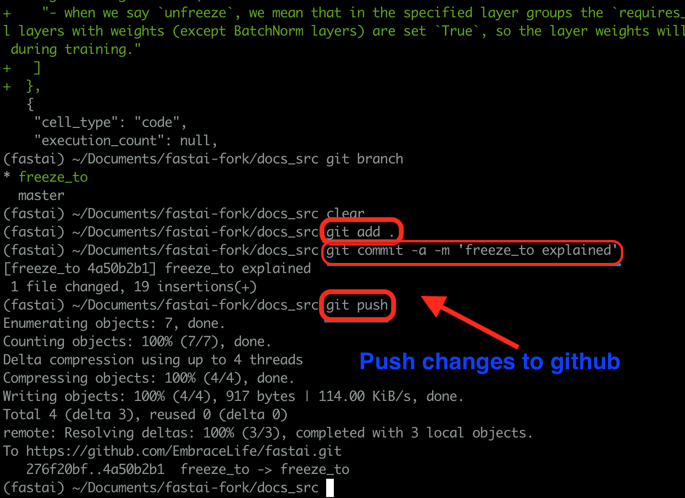
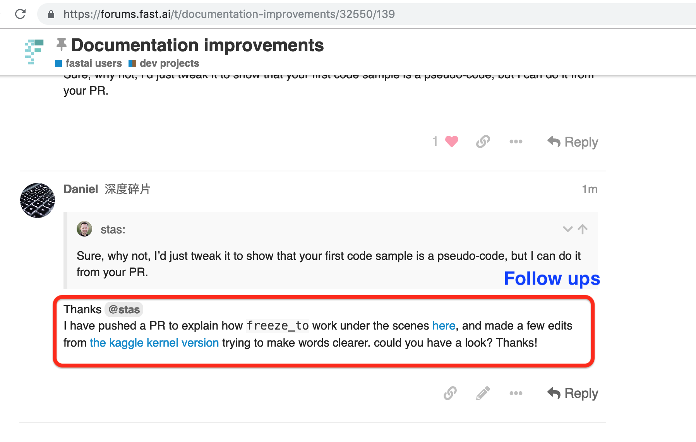

<h1>Table of Contents</h1>

<ul class="toc-item"><li><a href="#How-to-do-PR-for-Docs-Source" data-toc-modified-id="How-to-do-PR-for-Docs-Source-1">1&nbsp;&nbsp;How to do PR for Docs Source</a><ul class="toc-item"><li><a href="#Step-1-Get-idea-support-from-the-forum" data-toc-modified-id="Step-1-Get-idea-support-from-the-forum-1.1">1.1&nbsp;&nbsp;Step 1 Get idea support from the forum</a></li><li><a href="#Step-2-Fork-and-download-repo" data-toc-modified-id="Step-2-Fork-and-download-repo-1.2">1.2&nbsp;&nbsp;Step 2 Fork and download repo</a></li><li><a href="#Step-3-Sync-your-fork-and-local-repo-with-official-repo" data-toc-modified-id="Step-3-Sync-your-fork-and-local-repo-with-official-repo-1.3">1.3&nbsp;&nbsp;Step 3 Sync your fork and local repo with official repo</a></li><li><a href="#Step-4-delete-and-create-branches" data-toc-modified-id="Step-4-delete-and-create-branches-1.4">1.4&nbsp;&nbsp;Step 4 delete and create branches</a></li><li><a href="#Step-5-Make-your-edits" data-toc-modified-id="Step-5-Make-your-edits-1.5">1.5&nbsp;&nbsp;Step 5 Make your edits</a></li><li><a href="#Step-6-Push-the-changes" data-toc-modified-id="Step-6-Push-the-changes-1.6">1.6&nbsp;&nbsp;Step 6 Push the changes</a></li><li><a href="#Step-7-Make-a-PR" data-toc-modified-id="Step-7-Make-a-PR-1.7">1.7&nbsp;&nbsp;Step 7 Make a PR</a></li><li><a href="#Step-8-Coming-back-to-Documentation-improvements" data-toc-modified-id="Step-8-Coming-back-to-Documentation-improvements-1.8">1.8&nbsp;&nbsp;Step 8 Coming back to Documentation improvements</a></li></ul></li></ul>

# How to do PR for Docs Source

This is a visual guide to do a pull request (PR) on fastai library document source files (ipybn), which will walk you through every step of pushing a PR. 

I learnt to do PR from [fastai PR guides](https://github.com/fastai/fastai/blob/49fa956b2370a0711e85795a10ba2536aaf7a2db/docs/gen_doc_main.md), but more importantly I can't get here without tons of help and support from @stas Stas Bekman on [Documentation improvements](https://github.com/fastai/fastai/blob/49fa956b2370a0711e85795a10ba2536aaf7a2db/docs/gen_doc_main.md). Thanks @stas and this visual guide is one of my little contributions back to fast.ai community.

Before you start, you should know the very basics of git. You can learn it from [the terminal guide](https://course.fast.ai/terminal_tutorial.html) on fastai course site.

## Step 1 Get idea support from the forum

When you have an idea on PR, please go to [Documentation improvements](https://forums.fast.ai/t/documentation-improvements/32550) to share your thought and get support.

## Step 2 Fork and download repo

Please fork the official repo and clone your fork by following the visual guide [here](https://course.fast.ai/terminal_tutorial.html#cloning-fastai-repository-download-the-fastai-files).

## Step 3 Sync your fork and local repo with official repo

First, go to your fork on github to check whether it is updated. If not (seen image below), then you need to sync.

Then you can go to your terminal and step into your local repo directory (fastai-fork, in this visual example), and sync your local repo and official repo by following the steps in the image below.

Then you can go to your fork to see whether the sync is a success or not.

## Step 4 delete and create branches

If you have done PR before, you may want to delete your previous branch locally and on github. In this example, I have a branch called update-freeze-docsrc (see the blue box in the image below).

You can delete this branch locally and on github by following the first four steps in the image below.     

Then you can proceed with the remaining steps in the image, to create a new branch for your PR, called 'freeze_to' in this example.

If you refresh the previous branch page on github, it won't be found.

Also you will find a new branch created on your fork, see the box below.

## Step 5 Make your edits

You can make your edits of documentation and make it public with Kaggle kernels, so that people on Documentation improvement thread can see and give suggestions.

If you finally decided to make it a PR, then you can proceed to copy the changes onto the original ipynb file in your local repo.

## Step 6 Push the changes

You can check the changes you made to the original doc source ipynb by running the two lines of codes below.

Then if the changes seem ok, you can run the following three lines of codes to push the changes to your fork.

## Step 7 Make a PR

On your fork in github, you can see your push and click the blue box on the right to make a PR.

You can also add some notes to your PR.

## Step 8 Coming back to Documentation improvements

Finally, you can come back to the thread for follow-ups, as you may encounter some errors before your PR merged.

