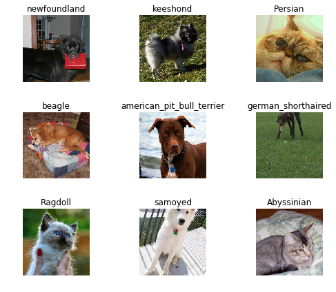
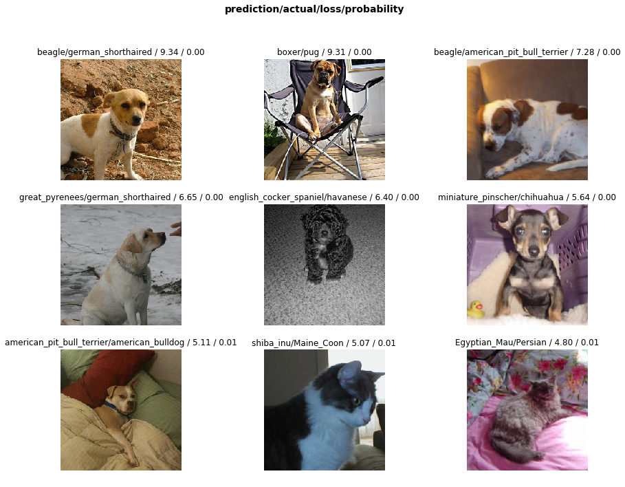
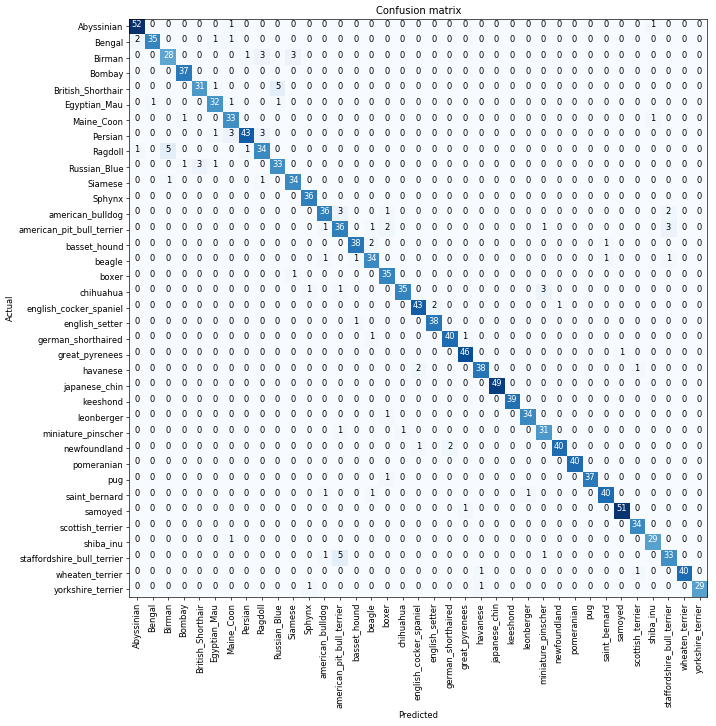
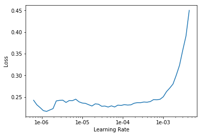
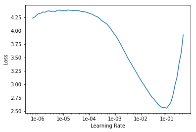
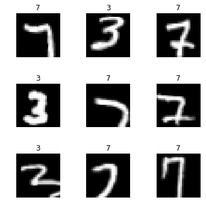
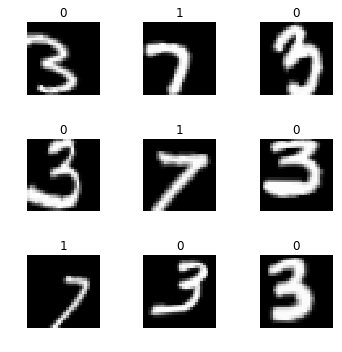

<h1>Table of Contents<span class="tocSkip"></span></h1>
<div class="toc"><ul class="toc-item"><li><span><a href="#Lesson-1---What's-your-pet" data-toc-modified-id="Lesson-1---What's-your-pet-1"><span class="toc-item-num">1&nbsp;&nbsp;</span>Lesson 1 - What's your pet</a></span><ul class="toc-item"><li><ul class="toc-item"><li><ul class="toc-item"><li><span><a href="#three-lines-of-magics" data-toc-modified-id="three-lines-of-magics-1.0.0.1"><span class="toc-item-num">1.0.0.1&nbsp;&nbsp;</span>three lines of magics</a></span></li><li><span><a href="#how-fastai-designs-import" data-toc-modified-id="how-fastai-designs-import-1.0.0.2"><span class="toc-item-num">1.0.0.2&nbsp;&nbsp;</span>how fastai designs import</a></span></li><li><span><a href="#import-everything-we-need" data-toc-modified-id="import-everything-we-need-1.0.0.3"><span class="toc-item-num">1.0.0.3&nbsp;&nbsp;</span>import everything we need</a></span></li><li><span><a href="#how-to-handle-out-of-memory-problem?" data-toc-modified-id="how-to-handle-out-of-memory-problem?-1.0.0.4"><span class="toc-item-num">1.0.0.4&nbsp;&nbsp;</span>how to handle out of memory problem?</a></span></li><li><span><a href="#set-batch_size" data-toc-modified-id="set-batch_size-1.0.0.5"><span class="toc-item-num">1.0.0.5&nbsp;&nbsp;</span>set batch_size</a></span></li></ul></li></ul></li><li><span><a href="#Looking-at-the-data" data-toc-modified-id="Looking-at-the-data-1.1"><span class="toc-item-num">1.1&nbsp;&nbsp;</span>Looking at the data</a></span><ul class="toc-item"><li><ul class="toc-item"><li><span><a href="#What-Pets-dataset-is-about?" data-toc-modified-id="What-Pets-dataset-is-about?-1.1.0.1"><span class="toc-item-num">1.1.0.1&nbsp;&nbsp;</span>What Pets dataset is about?</a></span></li><li><span><a href="#How-to-get-docs" data-toc-modified-id="How-to-get-docs-1.1.0.2"><span class="toc-item-num">1.1.0.2&nbsp;&nbsp;</span>How to get docs</a></span></li><li><span><a href="#how-fastai-get-dataset" data-toc-modified-id="how-fastai-get-dataset-1.1.0.3"><span class="toc-item-num">1.1.0.3&nbsp;&nbsp;</span>how fastai get dataset</a></span></li><li><span><a href="#how-to-see-inside-a-folder" data-toc-modified-id="how-to-see-inside-a-folder-1.1.0.4"><span class="toc-item-num">1.1.0.4&nbsp;&nbsp;</span>how to see inside a folder</a></span></li><li><span><a href="#how-to-build-path-to-sub-folders" data-toc-modified-id="how-to-build-path-to-sub-folders-1.1.0.5"><span class="toc-item-num">1.1.0.5&nbsp;&nbsp;</span>how to build path to sub-folders</a></span></li><li><span><a href="#what-does-it-mean-to-look-at-the-data" data-toc-modified-id="what-does-it-mean-to-look-at-the-data-1.1.0.6"><span class="toc-item-num">1.1.0.6&nbsp;&nbsp;</span>what does it mean to look at the data</a></span></li><li><span><a href="#getting-labels-is-the-key-of-handling-dataset" data-toc-modified-id="getting-labels-is-the-key-of-handling-dataset-1.1.0.7"><span class="toc-item-num">1.1.0.7&nbsp;&nbsp;</span>getting labels is the key of handling dataset</a></span></li><li><span><a href="#turn-files-inside-a-folder-into-a-list-of-path-objects" data-toc-modified-id="turn-files-inside-a-folder-into-a-list-of-path-objects-1.1.0.8"><span class="toc-item-num">1.1.0.8&nbsp;&nbsp;</span>turn files inside a folder into a list of path objects</a></span></li><li><span><a href="#how-to-make-sure-the-same-validation-set?" data-toc-modified-id="how-to-make-sure-the-same-validation-set?-1.1.0.9"><span class="toc-item-num">1.1.0.9&nbsp;&nbsp;</span>how to make sure the same validation set?</a></span></li><li><span><a href="#how-to-create-an-ImageDataBunch-from-re" data-toc-modified-id="how-to-create-an-ImageDataBunch-from-re-1.1.0.10"><span class="toc-item-num">1.1.0.10&nbsp;&nbsp;</span>how to create an ImageDataBunch from re</a></span></li><li><span><a href="#print-out-images-with-labels" data-toc-modified-id="print-out-images-with-labels-1.1.0.11"><span class="toc-item-num">1.1.0.11&nbsp;&nbsp;</span>print out images with labels</a></span></li><li><span><a href="#print-out-all-classes-and-c" data-toc-modified-id="print-out-all-classes-and-c-1.1.0.12"><span class="toc-item-num">1.1.0.12&nbsp;&nbsp;</span>print out all classes and c</a></span></li></ul></li></ul></li><li><span><a href="#Training:-resnet34" data-toc-modified-id="Training:-resnet34-1.2"><span class="toc-item-num">1.2&nbsp;&nbsp;</span>Training: resnet34</a></span><ul class="toc-item"><li><ul class="toc-item"><li><span><a href="#what-is-transfer-learning-like?" data-toc-modified-id="what-is-transfer-learning-like?-1.2.0.1"><span class="toc-item-num">1.2.0.1&nbsp;&nbsp;</span>what is transfer learning like?</a></span></li><li><span><a href="#how-to-create-a-CNN-model-as-transfer-learning" data-toc-modified-id="how-to-create-a-CNN-model-as-transfer-learning-1.2.0.2"><span class="toc-item-num">1.2.0.2&nbsp;&nbsp;</span>how to create a CNN model as transfer learning</a></span></li><li><span><a href="#how-to-see-the-structure-of-model" data-toc-modified-id="how-to-see-the-structure-of-model-1.2.0.3"><span class="toc-item-num">1.2.0.3&nbsp;&nbsp;</span>how to see the structure of model</a></span></li><li><span><a href="#how-to-fit-the-model-with-the-best-default-setting" data-toc-modified-id="how-to-fit-the-model-with-the-best-default-setting-1.2.0.4"><span class="toc-item-num">1.2.0.4&nbsp;&nbsp;</span>how to fit the model with the best default setting</a></span></li><li><span><a href="#how-to-save-a-model" data-toc-modified-id="how-to-save-a-model-1.2.0.5"><span class="toc-item-num">1.2.0.5&nbsp;&nbsp;</span>how to save a model</a></span></li></ul></li></ul></li><li><span><a href="#Results" data-toc-modified-id="Results-1.3"><span class="toc-item-num">1.3&nbsp;&nbsp;</span>Results</a></span><ul class="toc-item"><li><ul class="toc-item"><li><span><a href="#how-do-we-know-our-model-is-working-correctly-or-reasonably-or-not?" data-toc-modified-id="how-do-we-know-our-model-is-working-correctly-or-reasonably-or-not?-1.3.0.1"><span class="toc-item-num">1.3.0.1&nbsp;&nbsp;</span>how do we know our model is working correctly or reasonably or not?</a></span></li><li><span><a href="#what-can-confusion-matrix-tell-us?" data-toc-modified-id="what-can-confusion-matrix-tell-us?-1.3.0.2"><span class="toc-item-num">1.3.0.2&nbsp;&nbsp;</span>what can confusion matrix tell us?</a></span></li><li><span><a href="#how-to-access-the-idx-and-losses-of-the-images-with-the-top-losses" data-toc-modified-id="how-to-access-the-idx-and-losses-of-the-images-with-the-top-losses-1.3.0.3"><span class="toc-item-num">1.3.0.3&nbsp;&nbsp;</span>how to access the idx and losses of the images with the top losses</a></span></li><li><span><a href="#how-to-plot-the-top-loss-images" data-toc-modified-id="how-to-plot-the-top-loss-images-1.3.0.4"><span class="toc-item-num">1.3.0.4&nbsp;&nbsp;</span>how to plot the top loss images</a></span></li><li><span><a href="#how-to-print-out-docs-nicely" data-toc-modified-id="how-to-print-out-docs-nicely-1.3.0.5"><span class="toc-item-num">1.3.0.5&nbsp;&nbsp;</span>how to print out docs nicely</a></span></li><li><span><a href="#how-to-plot-confusion-matrix" data-toc-modified-id="how-to-plot-confusion-matrix-1.3.0.6"><span class="toc-item-num">1.3.0.6&nbsp;&nbsp;</span>how to plot confusion matrix</a></span></li><li><span><a href="#how-to-print-out-the-most-confused-categories-and-count-errors" data-toc-modified-id="how-to-print-out-the-most-confused-categories-and-count-errors-1.3.0.7"><span class="toc-item-num">1.3.0.7&nbsp;&nbsp;</span>how to print out the most confused categories and count errors</a></span></li></ul></li></ul></li><li><span><a href="#Unfreezing,-fine-tuning,-and-learning-rates" data-toc-modified-id="Unfreezing,-fine-tuning,-and-learning-rates-1.4"><span class="toc-item-num">1.4&nbsp;&nbsp;</span>Unfreezing, fine-tuning, and learning rates</a></span><ul class="toc-item"><li><ul class="toc-item"><li><span><a href="#when-to-unfreeze-the-model?" data-toc-modified-id="when-to-unfreeze-the-model?-1.4.0.1"><span class="toc-item-num">1.4.0.1&nbsp;&nbsp;</span>when to unfreeze the model?</a></span></li><li><span><a href="#how-to-unfreeze-the-model?" data-toc-modified-id="how-to-unfreeze-the-model?-1.4.0.2"><span class="toc-item-num">1.4.0.2&nbsp;&nbsp;</span>how to unfreeze the model?</a></span></li><li><span><a href="#how-to-fit-for-one-epoch" data-toc-modified-id="how-to-fit-for-one-epoch-1.4.0.3"><span class="toc-item-num">1.4.0.3&nbsp;&nbsp;</span>how to fit for one epoch</a></span></li><li><span><a href="#how-to-save-the-model" data-toc-modified-id="how-to-save-the-model-1.4.0.4"><span class="toc-item-num">1.4.0.4&nbsp;&nbsp;</span>how to save the model</a></span></li><li><span><a href="#how-to-explore-lr-within-a-range-for-lower-loss?" data-toc-modified-id="how-to-explore-lr-within-a-range-for-lower-loss?-1.4.0.5"><span class="toc-item-num">1.4.0.5&nbsp;&nbsp;</span>how to explore lr within a range for lower loss?</a></span></li><li><span><a href="#how-to-plot-the-loss-lr-graph-and-read-the-best-range?" data-toc-modified-id="how-to-plot-the-loss-lr-graph-and-read-the-best-range?-1.4.0.6"><span class="toc-item-num">1.4.0.6&nbsp;&nbsp;</span>how to plot the loss-lr graph and read the best range?</a></span></li><li><span><a href="#how-to-unfreeze-model-and-fit-with-a-specific-range-of-lr-with-epochs" data-toc-modified-id="how-to-unfreeze-model-and-fit-with-a-specific-range-of-lr-with-epochs-1.4.0.7"><span class="toc-item-num">1.4.0.7&nbsp;&nbsp;</span>how to unfreeze model and fit with a specific range of lr with epochs</a></span></li></ul></li></ul></li><li><span><a href="#Training:-resnet50" data-toc-modified-id="Training:-resnet50-1.5"><span class="toc-item-num">1.5&nbsp;&nbsp;</span>Training: resnet50</a></span><ul class="toc-item"><li><ul class="toc-item"><li><span><a href="#what-is-the-difference-between-resnet34-and-resnet50" data-toc-modified-id="what-is-the-difference-between-resnet34-and-resnet50-1.5.0.1"><span class="toc-item-num">1.5.0.1&nbsp;&nbsp;</span>what is the difference between resnet34 and resnet50</a></span></li><li><span><a href="#why-use-larger-model-and-image-to-train-with-smaller-batch-size?" data-toc-modified-id="why-use-larger-model-and-image-to-train-with-smaller-batch-size?-1.5.0.2"><span class="toc-item-num">1.5.0.2&nbsp;&nbsp;</span>why use larger model and image to train with smaller batch size?</a></span></li><li><span><a href="#how-to-create-an-ImageDatabunch-with-re-and-setting-image-size-and-batch-size?" data-toc-modified-id="how-to-create-an-ImageDatabunch-with-re-and-setting-image-size-and-batch-size?-1.5.0.3"><span class="toc-item-num">1.5.0.3&nbsp;&nbsp;</span>how to create an ImageDatabunch with re and setting image size and batch size?</a></span></li><li><span><a href="#how-to-create-an-CNN-model-with-this-data?" data-toc-modified-id="how-to-create-an-CNN-model-with-this-data?-1.5.0.4"><span class="toc-item-num">1.5.0.4&nbsp;&nbsp;</span>how to create an CNN model with this data?</a></span></li><li><span><a href="#find-and-plot-the-loss-lr-relation" data-toc-modified-id="find-and-plot-the-loss-lr-relation-1.5.0.5"><span class="toc-item-num">1.5.0.5&nbsp;&nbsp;</span>find and plot the loss-lr relation</a></span></li><li><span><a href="#how-to-fit-the-model-8-epochs" data-toc-modified-id="how-to-fit-the-model-8-epochs-1.5.0.6"><span class="toc-item-num">1.5.0.6&nbsp;&nbsp;</span>how to fit the model 8 epochs</a></span></li><li><span><a href="#how-to-save-the-model-with-a-different-name" data-toc-modified-id="how-to-save-the-model-with-a-different-name-1.5.0.7"><span class="toc-item-num">1.5.0.7&nbsp;&nbsp;</span>how to save the model with a different name</a></span></li><li><span><a href="#how-to-unfreeze-and-fit-with-a-specific-range-for-3-epochs" data-toc-modified-id="how-to-unfreeze-and-fit-with-a-specific-range-for-3-epochs-1.5.0.8"><span class="toc-item-num">1.5.0.8&nbsp;&nbsp;</span>how to unfreeze and fit with a specific range for 3 epochs</a></span></li><li><span><a href="#how-to-go-back-to-previous-model" data-toc-modified-id="how-to-go-back-to-previous-model-1.5.0.9"><span class="toc-item-num">1.5.0.9&nbsp;&nbsp;</span>how to go back to previous model</a></span></li><li><span><a href="#how-to-get-classification-model-interpretor" data-toc-modified-id="how-to-get-classification-model-interpretor-1.5.0.10"><span class="toc-item-num">1.5.0.10&nbsp;&nbsp;</span>how to get classification model interpretor</a></span></li><li><span><a href="#how-to-print-out-the-most-confused-categories-with-minimum-count" data-toc-modified-id="how-to-print-out-the-most-confused-categories-with-minimum-count-1.5.0.11"><span class="toc-item-num">1.5.0.11&nbsp;&nbsp;</span>how to print out the most confused categories with minimum count</a></span></li></ul></li></ul></li><li><span><a href="#Other-data-formats" data-toc-modified-id="Other-data-formats-1.6"><span class="toc-item-num">1.6&nbsp;&nbsp;</span>Other data formats</a></span><ul class="toc-item"><li><ul class="toc-item"><li><span><a href="#how-to-get-MNIST_SAMPLE-dataset" data-toc-modified-id="how-to-get-MNIST_SAMPLE-dataset-1.6.0.1"><span class="toc-item-num">1.6.0.1&nbsp;&nbsp;</span>how to get MNIST_SAMPLE dataset</a></span></li><li><span><a href="#how-to-set-flip-false-for-transformation" data-toc-modified-id="how-to-set-flip-false-for-transformation-1.6.0.2"><span class="toc-item-num">1.6.0.2&nbsp;&nbsp;</span>how to set flip false for transformation</a></span></li><li><span><a href="#how-to-create-ImageDataBunch-from-folders" data-toc-modified-id="how-to-create-ImageDataBunch-from-folders-1.6.0.3"><span class="toc-item-num">1.6.0.3&nbsp;&nbsp;</span>how to create ImageDataBunch from folders</a></span></li><li><span><a href="#how-to-print-out-image-examples-from-a-batch" data-toc-modified-id="how-to-print-out-image-examples-from-a-batch-1.6.0.4"><span class="toc-item-num">1.6.0.4&nbsp;&nbsp;</span>how to print out image examples from a batch</a></span></li><li><span><a href="#how-to-create-a-cnn-with-resnet18-and-accuracy-as-metrics" data-toc-modified-id="how-to-create-a-cnn-with-resnet18-and-accuracy-as-metrics-1.6.0.5"><span class="toc-item-num">1.6.0.5&nbsp;&nbsp;</span>how to create a cnn with resnet18 and accuracy as metrics</a></span></li><li><span><a href="#how-to-fit-2-epocs" data-toc-modified-id="how-to-fit-2-epocs-1.6.0.6"><span class="toc-item-num">1.6.0.6&nbsp;&nbsp;</span>how to fit 2 epocs</a></span></li><li><span><a href="#how-to-read-a-csv-with-pd" data-toc-modified-id="how-to-read-a-csv-with-pd-1.6.0.7"><span class="toc-item-num">1.6.0.7&nbsp;&nbsp;</span>how to read a csv with pd</a></span></li><li><span><a href="#how-to-read-first-5-lines" data-toc-modified-id="how-to-read-first-5-lines-1.6.0.8"><span class="toc-item-num">1.6.0.8&nbsp;&nbsp;</span>how to read first 5 lines</a></span></li><li><span><a href="#how-to-create-ImageDataBunch-with-csv" data-toc-modified-id="how-to-create-ImageDataBunch-with-csv-1.6.0.9"><span class="toc-item-num">1.6.0.9&nbsp;&nbsp;</span>how to create ImageDataBunch with csv</a></span></li><li><span><a href="#how-to-print-out-images-from-a-batch-and-classes" data-toc-modified-id="how-to-print-out-images-from-a-batch-and-classes-1.6.0.10"><span class="toc-item-num">1.6.0.10&nbsp;&nbsp;</span>how to print out images from a batch and classes</a></span></li><li><span><a href="#how-to-create-ImageDataBunch-from-df" data-toc-modified-id="how-to-create-ImageDataBunch-from-df-1.6.0.11"><span class="toc-item-num">1.6.0.11&nbsp;&nbsp;</span>how to create ImageDataBunch from df</a></span></li><li><span><a href="#how-to-create-file-path-object-into-a-list-from-df" data-toc-modified-id="how-to-create-file-path-object-into-a-list-from-df-1.6.0.12"><span class="toc-item-num">1.6.0.12&nbsp;&nbsp;</span>how to create file path object into a list from df</a></span></li><li><span><a href="#how-to-create-ImageDataBunch-from-re" data-toc-modified-id="how-to-create-ImageDataBunch-from-re-1.6.0.13"><span class="toc-item-num">1.6.0.13&nbsp;&nbsp;</span>how to create ImageDataBunch from re</a></span></li><li><span><a href="#how-to-create-ImageDataBunch-from-name-function-with-file-path-list" data-toc-modified-id="how-to-create-ImageDataBunch-from-name-function-with-file-path-list-1.6.0.14"><span class="toc-item-num">1.6.0.14&nbsp;&nbsp;</span>how to create ImageDataBunch from name function with file path list</a></span></li><li><span><a href="#how-to-create-a-list-of-labels-from-list-of-file-path" data-toc-modified-id="how-to-create-a-list-of-labels-from-list-of-file-path-1.6.0.15"><span class="toc-item-num">1.6.0.15&nbsp;&nbsp;</span>how to create a list of labels from list of file path</a></span></li><li><span><a href="#how-to-create-an-ImageDataBunch-from-list" data-toc-modified-id="how-to-create-an-ImageDataBunch-from-list-1.6.0.16"><span class="toc-item-num">1.6.0.16&nbsp;&nbsp;</span>how to create an ImageDataBunch from list</a></span></li></ul></li></ul></li></ul></li></ul></div>

# Lesson 1 - What's your pet

Welcome to lesson 1! For those of you who are using a Jupyter Notebook for the first time, you can learn about this useful tool in a tutorial we prepared specially for you; click `File`->`Open` now and click `00_notebook_tutorial.ipynb`. 

In this lesson we will build our first image classifier from scratch, and see if we can achieve world-class results. Let's dive in!

Every notebook starts with the following three lines; they ensure that any edits to libraries you make are reloaded here automatically, and also that any charts or images displayed are shown in this notebook.

#### three lines of magics


```python
%reload_ext autoreload
%autoreload 2
%matplotlib inline
```

#### how fastai designs import

We import all the necessary packages. We are going to work with the [fastai V1 library](http://www.fast.ai/2018/10/02/fastai-ai/) which sits on top of [Pytorch 1.0](https://hackernoon.com/pytorch-1-0-468332ba5163). The fastai library provides many useful functions that enable us to quickly and easily build neural networks and train our models.

#### import everything we need


```python
from fastai.vision import *
from fastai.metrics import error_rate
```

#### how to handle out of memory problem?

If you're using a computer with an unusually small GPU, you may get an out of memory error when running this notebook. If this happens, click Kernel->Restart, uncomment the 2nd line below to use a smaller *batch size* (you'll learn all about what this means during the course), and try again.

#### set batch_size


```python
bs = 64
# bs = 16   # uncomment this line if you run out of memory even after clicking Kernel->Restart
```

## Looking at the data

#### What Pets dataset is about?

We are going to use the [Oxford-IIIT Pet Dataset](http://www.robots.ox.ac.uk/~vgg/data/pets/) by [O. M. Parkhi et al., 2012](http://www.robots.ox.ac.uk/~vgg/publications/2012/parkhi12a/parkhi12a.pdf) which features 12 cat breeds and 25 dogs breeds. Our model will need to learn to differentiate between these 37 distinct categories. According to their paper, the best accuracy they could get in 2012 was 59.21%, using a complex model that was specific to pet detection, with separate "Image", "Head", and "Body" models for the pet photos. Let's see how accurate we can be using deep learning!

We are going to use the `untar_data` function to which we must pass a URL as an argument and which will download and extract the data.

#### How to get docs


```python
help(untar_data)
```

    Help on function untar_data in module fastai.datasets:
    
    untar_data(url: str, fname: Union[pathlib.Path, str] = None, dest: Union[pathlib.Path, str] = None, data=True, force_download=False) -> pathlib.Path
        Download `url` to `fname` if it doesn't exist, and un-tgz to folder `dest`.
    


#### how fastai get dataset


```python
path = untar_data(URLs.PETS); path
```


    PosixPath('/home/ubuntu/.fastai/data/oxford-iiit-pet')


#### how to see inside a folder


```python
path.ls()
```


    [PosixPath('/home/ubuntu/.fastai/data/oxford-iiit-pet/images'),
     PosixPath('/home/ubuntu/.fastai/data/oxford-iiit-pet/annotations')]


#### how to build path to sub-folders


```python
path_anno = path/'annotations'
path_img = path/'images'
```

#### what does it mean to look at the data

The first thing we do when we approach a problem is to take a look at the data. We _always_ need to understand very well what the problem is and what the data looks like before we can figure out how to solve it. Taking a look at the data means understanding how the data directories are structured, what the labels are and what some sample images look like.

#### getting labels is the key of handling dataset

The main difference between the handling of image classification datasets is the way labels are stored. In this particular dataset, labels are stored in the filenames themselves. We will need to extract them to be able to classify the images into the correct categories. Fortunately, the fastai library has a handy function made exactly for this, `ImageDataBunch.from_name_re` gets the labels from the filenames using a [regular expression](https://docs.python.org/3.6/library/re.html).

#### turn files inside a folder into a list of path objects


```python
fnames = get_image_files(path_img)
fnames[:5]
```


    [PosixPath('/home/ubuntu/.fastai/data/oxford-iiit-pet/images/saint_bernard_188.jpg'),
     PosixPath('/home/ubuntu/.fastai/data/oxford-iiit-pet/images/staffordshire_bull_terrier_114.jpg'),
     PosixPath('/home/ubuntu/.fastai/data/oxford-iiit-pet/images/Persian_144.jpg'),
     PosixPath('/home/ubuntu/.fastai/data/oxford-iiit-pet/images/Maine_Coon_268.jpg'),
     PosixPath('/home/ubuntu/.fastai/data/oxford-iiit-pet/images/newfoundland_95.jpg')]


#### how to make sure the same validation set?


```python
np.random.seed(2)
pat = r'/([^/]+)_\d+.jpg$'
```

#### how to create an ImageDataBunch from re


```python
data = ImageDataBunch.from_name_re(path_img, 
                                   fnames, 
                                   pat, 
                                   ds_tfms=get_transforms(), 
                                   size=224, 
                                   bs=bs
                                  ).normalize(imagenet_stats)
```

#### print out images with labels


```python
data.show_batch(rows=3, figsize=(7,6))
```





#### print out all classes and c


```python
print(data.classes)
len(data.classes),data.c
```

    ['Abyssinian', 'Bengal', 'Birman', 'Bombay', 'British_Shorthair', 'Egyptian_Mau', 'Maine_Coon', 'Persian', 'Ragdoll', 'Russian_Blue', 'Siamese', 'Sphynx', 'american_bulldog', 'american_pit_bull_terrier', 'basset_hound', 'beagle', 'boxer', 'chihuahua', 'english_cocker_spaniel', 'english_setter', 'german_shorthaired', 'great_pyrenees', 'havanese', 'japanese_chin', 'keeshond', 'leonberger', 'miniature_pinscher', 'newfoundland', 'pomeranian', 'pug', 'saint_bernard', 'samoyed', 'scottish_terrier', 'shiba_inu', 'staffordshire_bull_terrier', 'wheaten_terrier', 'yorkshire_terrier']


    (37, 37)


## Training: resnet34

#### what is transfer learning like?

Now we will start training our model. We will use a [convolutional neural network](http://cs231n.github.io/convolutional-networks/) backbone and a fully connected head with a single hidden layer as a classifier. Don't know what these things mean? Not to worry, we will dive deeper in the coming lessons. For the moment you need to know that we are building a model which will take images as input and will output the predicted probability for each of the categories (in this case, it will have 37 outputs).

We will train for 4 epochs (4 cycles through all our data).

#### how to create a CNN model as transfer learning


```python
learn = create_cnn(data, models.resnet34, metrics=error_rate)
```

#### how to see the structure of model


```python
learn.model
```


    Sequential(
      (0): Sequential(
        (0): Conv2d(3, 64, kernel_size=(7, 7), stride=(2, 2), padding=(3, 3), bias=False)
        (1): BatchNorm2d(64, eps=1e-05, momentum=0.1, affine=True, track_running_stats=True)
        (2): ReLU(inplace)
        (3): MaxPool2d(kernel_size=3, stride=2, padding=1, dilation=1, ceil_mode=False)
        (4): Sequential(
          (0): BasicBlock(
            (conv1): Conv2d(64, 64, kernel_size=(3, 3), stride=(1, 1), padding=(1, 1), bias=False)
            (bn1): BatchNorm2d(64, eps=1e-05, momentum=0.1, affine=True, track_running_stats=True)
            (relu): ReLU(inplace)
            (conv2): Conv2d(64, 64, kernel_size=(3, 3), stride=(1, 1), padding=(1, 1), bias=False)
            (bn2): BatchNorm2d(64, eps=1e-05, momentum=0.1, affine=True, track_running_stats=True)
          )
          (1): BasicBlock(
            (conv1): Conv2d(64, 64, kernel_size=(3, 3), stride=(1, 1), padding=(1, 1), bias=False)
            (bn1): BatchNorm2d(64, eps=1e-05, momentum=0.1, affine=True, track_running_stats=True)
            (relu): ReLU(inplace)
            (conv2): Conv2d(64, 64, kernel_size=(3, 3), stride=(1, 1), padding=(1, 1), bias=False)
            (bn2): BatchNorm2d(64, eps=1e-05, momentum=0.1, affine=True, track_running_stats=True)
          )
          (2): BasicBlock(
            (conv1): Conv2d(64, 64, kernel_size=(3, 3), stride=(1, 1), padding=(1, 1), bias=False)
            (bn1): BatchNorm2d(64, eps=1e-05, momentum=0.1, affine=True, track_running_stats=True)
            (relu): ReLU(inplace)
            (conv2): Conv2d(64, 64, kernel_size=(3, 3), stride=(1, 1), padding=(1, 1), bias=False)
            (bn2): BatchNorm2d(64, eps=1e-05, momentum=0.1, affine=True, track_running_stats=True)
          )
        )
        (5): Sequential(
          (0): BasicBlock(
            (conv1): Conv2d(64, 128, kernel_size=(3, 3), stride=(2, 2), padding=(1, 1), bias=False)
            (bn1): BatchNorm2d(128, eps=1e-05, momentum=0.1, affine=True, track_running_stats=True)
            (relu): ReLU(inplace)
            (conv2): Conv2d(128, 128, kernel_size=(3, 3), stride=(1, 1), padding=(1, 1), bias=False)
            (bn2): BatchNorm2d(128, eps=1e-05, momentum=0.1, affine=True, track_running_stats=True)
            (downsample): Sequential(
              (0): Conv2d(64, 128, kernel_size=(1, 1), stride=(2, 2), bias=False)
              (1): BatchNorm2d(128, eps=1e-05, momentum=0.1, affine=True, track_running_stats=True)
            )
          )
          (1): BasicBlock(
            (conv1): Conv2d(128, 128, kernel_size=(3, 3), stride=(1, 1), padding=(1, 1), bias=False)
            (bn1): BatchNorm2d(128, eps=1e-05, momentum=0.1, affine=True, track_running_stats=True)
            (relu): ReLU(inplace)
            (conv2): Conv2d(128, 128, kernel_size=(3, 3), stride=(1, 1), padding=(1, 1), bias=False)
            (bn2): BatchNorm2d(128, eps=1e-05, momentum=0.1, affine=True, track_running_stats=True)
          )
          (2): BasicBlock(
            (conv1): Conv2d(128, 128, kernel_size=(3, 3), stride=(1, 1), padding=(1, 1), bias=False)
            (bn1): BatchNorm2d(128, eps=1e-05, momentum=0.1, affine=True, track_running_stats=True)
            (relu): ReLU(inplace)
            (conv2): Conv2d(128, 128, kernel_size=(3, 3), stride=(1, 1), padding=(1, 1), bias=False)
            (bn2): BatchNorm2d(128, eps=1e-05, momentum=0.1, affine=True, track_running_stats=True)
          )
          (3): BasicBlock(
            (conv1): Conv2d(128, 128, kernel_size=(3, 3), stride=(1, 1), padding=(1, 1), bias=False)
            (bn1): BatchNorm2d(128, eps=1e-05, momentum=0.1, affine=True, track_running_stats=True)
            (relu): ReLU(inplace)
            (conv2): Conv2d(128, 128, kernel_size=(3, 3), stride=(1, 1), padding=(1, 1), bias=False)
            (bn2): BatchNorm2d(128, eps=1e-05, momentum=0.1, affine=True, track_running_stats=True)
          )
        )
        (6): Sequential(
          (0): BasicBlock(
            (conv1): Conv2d(128, 256, kernel_size=(3, 3), stride=(2, 2), padding=(1, 1), bias=False)
            (bn1): BatchNorm2d(256, eps=1e-05, momentum=0.1, affine=True, track_running_stats=True)
            (relu): ReLU(inplace)
            (conv2): Conv2d(256, 256, kernel_size=(3, 3), stride=(1, 1), padding=(1, 1), bias=False)
            (bn2): BatchNorm2d(256, eps=1e-05, momentum=0.1, affine=True, track_running_stats=True)
            (downsample): Sequential(
              (0): Conv2d(128, 256, kernel_size=(1, 1), stride=(2, 2), bias=False)
              (1): BatchNorm2d(256, eps=1e-05, momentum=0.1, affine=True, track_running_stats=True)
            )
          )
          (1): BasicBlock(
            (conv1): Conv2d(256, 256, kernel_size=(3, 3), stride=(1, 1), padding=(1, 1), bias=False)
            (bn1): BatchNorm2d(256, eps=1e-05, momentum=0.1, affine=True, track_running_stats=True)
            (relu): ReLU(inplace)
            (conv2): Conv2d(256, 256, kernel_size=(3, 3), stride=(1, 1), padding=(1, 1), bias=False)
            (bn2): BatchNorm2d(256, eps=1e-05, momentum=0.1, affine=True, track_running_stats=True)
          )
          (2): BasicBlock(
            (conv1): Conv2d(256, 256, kernel_size=(3, 3), stride=(1, 1), padding=(1, 1), bias=False)
            (bn1): BatchNorm2d(256, eps=1e-05, momentum=0.1, affine=True, track_running_stats=True)
            (relu): ReLU(inplace)
            (conv2): Conv2d(256, 256, kernel_size=(3, 3), stride=(1, 1), padding=(1, 1), bias=False)
            (bn2): BatchNorm2d(256, eps=1e-05, momentum=0.1, affine=True, track_running_stats=True)
          )
          (3): BasicBlock(
            (conv1): Conv2d(256, 256, kernel_size=(3, 3), stride=(1, 1), padding=(1, 1), bias=False)
            (bn1): BatchNorm2d(256, eps=1e-05, momentum=0.1, affine=True, track_running_stats=True)
            (relu): ReLU(inplace)
            (conv2): Conv2d(256, 256, kernel_size=(3, 3), stride=(1, 1), padding=(1, 1), bias=False)
            (bn2): BatchNorm2d(256, eps=1e-05, momentum=0.1, affine=True, track_running_stats=True)
          )
          (4): BasicBlock(
            (conv1): Conv2d(256, 256, kernel_size=(3, 3), stride=(1, 1), padding=(1, 1), bias=False)
            (bn1): BatchNorm2d(256, eps=1e-05, momentum=0.1, affine=True, track_running_stats=True)
            (relu): ReLU(inplace)
            (conv2): Conv2d(256, 256, kernel_size=(3, 3), stride=(1, 1), padding=(1, 1), bias=False)
            (bn2): BatchNorm2d(256, eps=1e-05, momentum=0.1, affine=True, track_running_stats=True)
          )
          (5): BasicBlock(
            (conv1): Conv2d(256, 256, kernel_size=(3, 3), stride=(1, 1), padding=(1, 1), bias=False)
            (bn1): BatchNorm2d(256, eps=1e-05, momentum=0.1, affine=True, track_running_stats=True)
            (relu): ReLU(inplace)
            (conv2): Conv2d(256, 256, kernel_size=(3, 3), stride=(1, 1), padding=(1, 1), bias=False)
            (bn2): BatchNorm2d(256, eps=1e-05, momentum=0.1, affine=True, track_running_stats=True)
          )
        )
        (7): Sequential(
          (0): BasicBlock(
            (conv1): Conv2d(256, 512, kernel_size=(3, 3), stride=(2, 2), padding=(1, 1), bias=False)
            (bn1): BatchNorm2d(512, eps=1e-05, momentum=0.1, affine=True, track_running_stats=True)
            (relu): ReLU(inplace)
            (conv2): Conv2d(512, 512, kernel_size=(3, 3), stride=(1, 1), padding=(1, 1), bias=False)
            (bn2): BatchNorm2d(512, eps=1e-05, momentum=0.1, affine=True, track_running_stats=True)
            (downsample): Sequential(
              (0): Conv2d(256, 512, kernel_size=(1, 1), stride=(2, 2), bias=False)
              (1): BatchNorm2d(512, eps=1e-05, momentum=0.1, affine=True, track_running_stats=True)
            )
          )
          (1): BasicBlock(
            (conv1): Conv2d(512, 512, kernel_size=(3, 3), stride=(1, 1), padding=(1, 1), bias=False)
            (bn1): BatchNorm2d(512, eps=1e-05, momentum=0.1, affine=True, track_running_stats=True)
            (relu): ReLU(inplace)
            (conv2): Conv2d(512, 512, kernel_size=(3, 3), stride=(1, 1), padding=(1, 1), bias=False)
            (bn2): BatchNorm2d(512, eps=1e-05, momentum=0.1, affine=True, track_running_stats=True)
          )
          (2): BasicBlock(
            (conv1): Conv2d(512, 512, kernel_size=(3, 3), stride=(1, 1), padding=(1, 1), bias=False)
            (bn1): BatchNorm2d(512, eps=1e-05, momentum=0.1, affine=True, track_running_stats=True)
            (relu): ReLU(inplace)
            (conv2): Conv2d(512, 512, kernel_size=(3, 3), stride=(1, 1), padding=(1, 1), bias=False)
            (bn2): BatchNorm2d(512, eps=1e-05, momentum=0.1, affine=True, track_running_stats=True)
          )
        )
      )
      (1): Sequential(
        (0): AdaptiveConcatPool2d(
          (ap): AdaptiveAvgPool2d(output_size=1)
          (mp): AdaptiveMaxPool2d(output_size=1)
        )
        (1): Flatten()
        (2): BatchNorm1d(1024, eps=1e-05, momentum=0.1, affine=True, track_running_stats=True)
        (3): Dropout(p=0.25)
        (4): Linear(in_features=1024, out_features=512, bias=True)
        (5): ReLU(inplace)
        (6): BatchNorm1d(512, eps=1e-05, momentum=0.1, affine=True, track_running_stats=True)
        (7): Dropout(p=0.5)
        (8): Linear(in_features=512, out_features=37, bias=True)
      )
    )


#### how to fit the model with the best default setting


```python
learn.fit_one_cycle(4)
```


Total time: 01:46 <p><table style='width:300px; margin-bottom:10px'>
  <tr>
    <th>epoch</th>
    <th>train_loss</th>
    <th>valid_loss</th>
    <th>error_rate</th>
  </tr>
  <tr>
    <th>1</th>
    <th>1.409939</th>
    <th>0.357608</th>
    <th>0.102165</th>
  </tr>
  <tr>
    <th>2</th>
    <th>0.539408</th>
    <th>0.242496</th>
    <th>0.073072</th>
  </tr>
  <tr>
    <th>3</th>
    <th>0.340212</th>
    <th>0.221338</th>
    <th>0.066306</th>
  </tr>
  <tr>
    <th>4</th>
    <th>0.261859</th>
    <th>0.216619</th>
    <th>0.071042</th>
  </tr>
</table>


#### how to save a model


```python
learn.save('stage-1')
```

## Results

#### how do we know our model is working correctly or reasonably or not?

Let's see what results we have got. 

We will first see which were the categories that the model most confused with one another. We will try to see if what the model predicted was reasonable or not. In this case the mistakes look reasonable (none of the mistakes seems obviously naive). This is an indicator that our classifier is working correctly. 

#### what can confusion matrix tell us?

Furthermore, when we plot the confusion matrix, we can see that the distribution is heavily skewed: the model makes the same mistakes over and over again but it rarely confuses other categories. This suggests that it just finds it difficult to distinguish some specific categories between each other; this is normal behaviour.

#### how to access the idx and losses of the images with the top losses


```python
interp = ClassificationInterpretation.from_learner(learn)

losses,idxs = interp.top_losses()

len(data.valid_ds)==len(losses)==len(idxs)
```


    True


#### how to plot the top loss images


```python
interp.plot_top_losses(9, figsize=(15,11))
```





#### how to print out docs nicely


```python
doc(interp.plot_top_losses)
```

#### how to plot confusion matrix


```python
interp.plot_confusion_matrix(figsize=(12,12), dpi=60)
```





#### how to print out the most confused categories and count errors


```python
interp.most_confused(min_val=2)
```


    [('British_Shorthair', 'Russian_Blue', 5),
     ('Ragdoll', 'Birman', 5),
     ('staffordshire_bull_terrier', 'american_pit_bull_terrier', 5),
     ('Birman', 'Ragdoll', 3),
     ('Birman', 'Siamese', 3),
     ('Persian', 'Maine_Coon', 3),
     ('Persian', 'Ragdoll', 3),
     ('Russian_Blue', 'British_Shorthair', 3),
     ('american_bulldog', 'american_pit_bull_terrier', 3),
     ('american_pit_bull_terrier', 'staffordshire_bull_terrier', 3),
     ('chihuahua', 'miniature_pinscher', 3)]


## Unfreezing, fine-tuning, and learning rates

#### when to unfreeze the model?

Since our model is working as we expect it to, we will *unfreeze* our model and train some more.

#### how to unfreeze the model?


```python
learn.unfreeze()
```

#### how to fit for one epoch


```python
learn.fit_one_cycle(1)
```


Total time: 00:26 <p><table style='width:300px; margin-bottom:10px'>
  <tr>
    <th>epoch</th>
    <th>train_loss</th>
    <th>valid_loss</th>
    <th>error_rate</th>
  </tr>
  <tr>
    <th>1</th>
    <th>0.558166</th>
    <th>0.314579</th>
    <th>0.101489</th>
  </tr>
</table>


#### how to save the model


```python
learn.load('stage-1');
```

#### how to explore lr within a range for lower loss?


```python
learn.lr_find()
```


    LR Finder is complete, type {learner_name}.recorder.plot() to see the graph.


#### how to plot the loss-lr graph and read the best range?


```python
learn.recorder.plot()
```





#### how to unfreeze model and fit with a specific range of lr with epochs


```python
learn.unfreeze()
learn.fit_one_cycle(2, max_lr=slice(1e-6,1e-4))
```


Total time: 00:53 <p><table style='width:300px; margin-bottom:10px'>
  <tr>
    <th>epoch</th>
    <th>train_loss</th>
    <th>valid_loss</th>
    <th>error_rate</th>
  </tr>
  <tr>
    <th>1</th>
    <th>0.242544</th>
    <th>0.208489</th>
    <th>0.067659</th>
  </tr>
  <tr>
    <th>2</th>
    <th>0.206940</th>
    <th>0.204482</th>
    <th>0.062246</th>
  </tr>
</table>


That's a pretty accurate model!

## Training: resnet50

#### what is the difference between resnet34 and resnet50

Now we will train in the same way as before but with one caveat: instead of using resnet34 as our backbone we will use resnet50 (resnet34 is a 34 layer residual network while resnet50 has 50 layers. It will be explained later in the course and you can learn the details in the [resnet paper](https://arxiv.org/pdf/1512.03385.pdf)).

#### why use larger model and image to train with smaller batch size?

Basically, resnet50 usually performs better because it is a deeper network with more parameters. Let's see if we can achieve a higher performance here. To help it along, let's us use larger images too, since that way the network can see more detail. We reduce the batch size a bit since otherwise this larger network will require more GPU memory.

#### how to create an ImageDatabunch with re and setting image size and batch size?


```python
data = ImageDataBunch.from_name_re(path_img, 
                                   fnames, 
                                   pat, 
                                   ds_tfms=get_transforms(),
                                   size=299, 
                                   bs=bs//2).normalize(imagenet_stats)
```

#### how to create an CNN model with this data?


```python
learn = create_cnn(data, models.resnet50, metrics=error_rate)
```

#### find and plot the loss-lr relation


```python
learn.lr_find()
learn.recorder.plot()
```

    LR Finder complete, type {learner_name}.recorder.plot() to see the graph.





#### how to fit the model 8 epochs


```python
learn.fit_one_cycle(8)
```

    Total time: 06:59
    epoch  train_loss  valid_loss  error_rate
    1      0.548006    0.268912    0.076455    (00:57)
    2      0.365533    0.193667    0.064953    (00:51)
    3      0.336032    0.211020    0.073072    (00:51)
    4      0.263173    0.212025    0.060893    (00:51)
    5      0.217016    0.183195    0.063599    (00:51)
    6      0.161002    0.167274    0.048038    (00:51)
    7      0.086668    0.143490    0.044655    (00:51)
    8      0.082288    0.154927    0.046008    (00:51)
    


#### how to save the model with a different name


```python
learn.save('stage-1-50')
```

It's astonishing that it's possible to recognize pet breeds so accurately! Let's see if full fine-tuning helps:

#### how to unfreeze and fit with a specific range for 3 epochs


```python
learn.unfreeze()
learn.fit_one_cycle(3, max_lr=slice(1e-6,1e-4))
```

    Total time: 03:27
    epoch  train_loss  valid_loss  error_rate
    1      0.097319    0.155017    0.048038    (01:10)
    2      0.074885    0.144853    0.044655    (01:08)
    3      0.063509    0.144917    0.043978    (01:08)
    


#### how to go back to previous model


```python
learn.load('stage-1-50');
```

#### how to get classification model interpretor


```python
interp = ClassificationInterpretation.from_learner(learn)
```

#### how to print out the most confused categories with minimum count


```python
interp.most_confused(min_val=2)
```


    [('american_pit_bull_terrier', 'staffordshire_bull_terrier', 6),
     ('Bengal', 'Egyptian_Mau', 5),
     ('Bengal', 'Abyssinian', 4),
     ('boxer', 'american_bulldog', 4),
     ('Ragdoll', 'Birman', 4),
     ('Egyptian_Mau', 'Bengal', 3)]


## Other data formats

#### how to get MNIST_SAMPLE dataset


```python
path = untar_data(URLs.MNIST_SAMPLE); path
```


    PosixPath('/home/ubuntu/course-v3/nbs/dl1/data/mnist_sample')


#### how to set flip false for transformation


```python
tfms = get_transforms(do_flip=False)
```

#### how to create ImageDataBunch from folders


```python
data = ImageDataBunch.from_folder(path, ds_tfms=tfms, size=26)
```

#### how to print out image examples from a batch


```python
data.show_batch(rows=3, figsize=(5,5))
```





#### how to create a cnn with resnet18 and accuracy as metrics


```python
learn = create_cnn(data, models.resnet18, metrics=accuracy)
```

#### how to fit 2 epocs


```python
learn.fit(2)
```

    Total time: 00:23
    epoch  train_loss  valid_loss  accuracy
    1      0.116117    0.029745    0.991168  (00:12)
    2      0.056860    0.015974    0.994603  (00:10)
    


#### how to read a csv with pd


```python
df = pd.read_csv(path/'labels.csv')
```

#### how to read first 5 lines


```python
df.head()
```


<div>
<style scoped>
    .dataframe tbody tr th:only-of-type {
        vertical-align: middle;
    }

    .dataframe tbody tr th {
        vertical-align: top;
    }

    .dataframe thead th {
        text-align: right;
    }
</style>
<table border="1" class="dataframe">
  <thead>
    <tr style="text-align: right;">
      <th></th>
      <th>name</th>
      <th>label</th>
    </tr>
  </thead>
  <tbody>
    <tr>
      <th>0</th>
      <td>train/3/7463.png</td>
      <td>0</td>
    </tr>
    <tr>
      <th>1</th>
      <td>train/3/21102.png</td>
      <td>0</td>
    </tr>
    <tr>
      <th>2</th>
      <td>train/3/31559.png</td>
      <td>0</td>
    </tr>
    <tr>
      <th>3</th>
      <td>train/3/46882.png</td>
      <td>0</td>
    </tr>
    <tr>
      <th>4</th>
      <td>train/3/26209.png</td>
      <td>0</td>
    </tr>
  </tbody>
</table>
</div>


#### how to create ImageDataBunch with csv


```python
data = ImageDataBunch.from_csv(path, ds_tfms=tfms, size=28)
```

#### how to print out images from a batch and classes


```python
data.show_batch(rows=3, figsize=(5,5))
data.classes
```


    [0, 1]





#### how to create ImageDataBunch from df


```python
data = ImageDataBunch.from_df(path, df, ds_tfms=tfms, size=24)
data.classes
```


    [0, 1]


#### how to create file path object into a list from df


```python
fn_paths = [path/name for name in df['name']]; fn_paths[:2]
```


    [PosixPath('/home/ubuntu/course-v3/nbs/dl1/data/mnist_sample/train/3/7463.png'),
     PosixPath('/home/ubuntu/course-v3/nbs/dl1/data/mnist_sample/train/3/21102.png')]


#### how to create ImageDataBunch from re


```python
pat = r"/(\d)/\d+\.png$"
data = ImageDataBunch.from_name_re(path, fn_paths, pat=pat, ds_tfms=tfms, size=24)
data.classes
```


    ['3', '7']


#### how to create ImageDataBunch from name function with file path list


```python
data = ImageDataBunch.from_name_func(path, fn_paths, ds_tfms=tfms, size=24,
        label_func = lambda x: '3' if '/3/' in str(x) else '7')
data.classes
```


    ['3', '7']


#### how to create a list of labels from list of file path 


```python
labels = [('3' if '/3/' in str(x) else '7') for x in fn_paths]
labels[:5]
```


    ['3', '3', '3', '3', '3']


#### how to create an ImageDataBunch from list


```python
data = ImageDataBunch.from_lists(path, fn_paths, labels=labels, ds_tfms=tfms, size=24)
data.classes
```


    ['3', '7']


