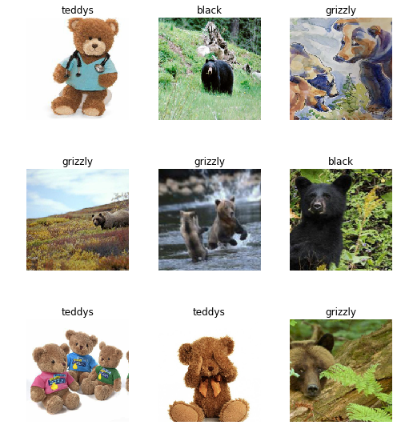
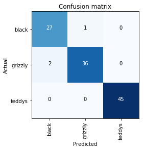
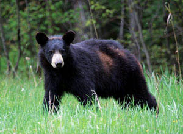
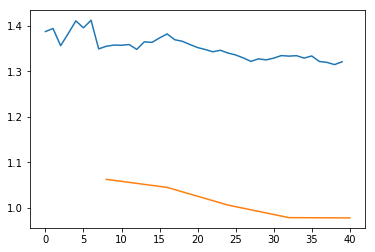

<h1>Table of Contents<span class="tocSkip"></span></h1>
<div class="toc"><ul class="toc-item"><li><span><a href="#Creating-your-own-dataset-from-Google-Images" data-toc-modified-id="Creating-your-own-dataset-from-Google-Images-1"><span class="toc-item-num">1&nbsp;&nbsp;</span>Creating your own dataset from Google Images</a></span><ul class="toc-item"><li><ul class="toc-item"><li><ul class="toc-item"><li><span><a href="#Nb的目的" data-toc-modified-id="Nb的目的-1.0.0.1"><span class="toc-item-num">1.0.0.1&nbsp;&nbsp;</span>Nb的目的</a></span></li><li><span><a href="#仅需的library" data-toc-modified-id="仅需的library-1.0.0.2"><span class="toc-item-num">1.0.0.2&nbsp;&nbsp;</span>仅需的library</a></span></li></ul></li></ul></li><li><span><a href="#Get-a-list-of-URLs" data-toc-modified-id="Get-a-list-of-URLs-1.1"><span class="toc-item-num">1.1&nbsp;&nbsp;</span>Get a list of URLs</a></span><ul class="toc-item"><li><span><a href="#Search-and-scroll" data-toc-modified-id="Search-and-scroll-1.1.1"><span class="toc-item-num">1.1.1&nbsp;&nbsp;</span>Search and scroll</a></span><ul class="toc-item"><li><span><a href="#如何精确搜索" data-toc-modified-id="如何精确搜索-1.1.1.1"><span class="toc-item-num">1.1.1.1&nbsp;&nbsp;</span>如何精确搜索</a></span></li></ul></li><li><span><a href="#Download-into-file" data-toc-modified-id="Download-into-file-1.1.2"><span class="toc-item-num">1.1.2&nbsp;&nbsp;</span>Download into file</a></span><ul class="toc-item"><li><span><a href="#如何下载图片的链接" data-toc-modified-id="如何下载图片的链接-1.1.2.1"><span class="toc-item-num">1.1.2.1&nbsp;&nbsp;</span>如何下载图片的链接</a></span></li></ul></li><li><span><a href="#Create-directory-and-upload-urls-file-into-your-server" data-toc-modified-id="Create-directory-and-upload-urls-file-into-your-server-1.1.3"><span class="toc-item-num">1.1.3&nbsp;&nbsp;</span>Create directory and upload urls file into your server</a></span><ul class="toc-item"><li><span><a href="#创建文件夹并上传链接文本到云端" data-toc-modified-id="创建文件夹并上传链接文本到云端-1.1.3.1"><span class="toc-item-num">1.1.3.1&nbsp;&nbsp;</span>创建文件夹并上传链接文本到云端</a></span></li><li><span><a href="#创建子文件夹" data-toc-modified-id="创建子文件夹-1.1.3.2"><span class="toc-item-num">1.1.3.2&nbsp;&nbsp;</span>创建子文件夹</a></span></li><li><span><a href="#查看文件夹内部" data-toc-modified-id="查看文件夹内部-1.1.3.3"><span class="toc-item-num">1.1.3.3&nbsp;&nbsp;</span>查看文件夹内部</a></span></li></ul></li></ul></li><li><span><a href="#Download-images" data-toc-modified-id="Download-images-1.2"><span class="toc-item-num">1.2&nbsp;&nbsp;</span>Download images</a></span><ul class="toc-item"><li><ul class="toc-item"><li><span><a href="#如何下载图片并设置下载数量上限" data-toc-modified-id="如何下载图片并设置下载数量上限-1.2.0.1"><span class="toc-item-num">1.2.0.1&nbsp;&nbsp;</span>如何下载图片并设置下载数量上限</a></span></li><li><span><a href="#下载出问题的处理方法" data-toc-modified-id="下载出问题的处理方法-1.2.0.2"><span class="toc-item-num">1.2.0.2&nbsp;&nbsp;</span>下载出问题的处理方法</a></span></li><li><span><a href="#如何删除无法打开的图片" data-toc-modified-id="如何删除无法打开的图片-1.2.0.3"><span class="toc-item-num">1.2.0.3&nbsp;&nbsp;</span>如何删除无法打开的图片</a></span></li></ul></li></ul></li><li><span><a href="#View-data" data-toc-modified-id="View-data-1.3"><span class="toc-item-num">1.3&nbsp;&nbsp;</span>View data</a></span><ul class="toc-item"><li><ul class="toc-item"><li><span><a href="#从但一个文件夹生成DataBunch" data-toc-modified-id="从但一个文件夹生成DataBunch-1.3.0.1"><span class="toc-item-num">1.3.0.1&nbsp;&nbsp;</span>从但一个文件夹生成DataBunch</a></span></li><li><span><a href="#用CSV文件协助生成DataBunch" data-toc-modified-id="用CSV文件协助生成DataBunch-1.3.0.2"><span class="toc-item-num">1.3.0.2&nbsp;&nbsp;</span>用CSV文件协助生成DataBunch</a></span></li><li><span><a href="#查看类别" data-toc-modified-id="查看类别-1.3.0.3"><span class="toc-item-num">1.3.0.3&nbsp;&nbsp;</span>查看类别</a></span></li><li><span><a href="#查看batch中的图片" data-toc-modified-id="查看batch中的图片-1.3.0.4"><span class="toc-item-num">1.3.0.4&nbsp;&nbsp;</span>查看batch中的图片</a></span></li><li><span><a href="#查看类别，训练集和验证集的数量" data-toc-modified-id="查看类别，训练集和验证集的数量-1.3.0.5"><span class="toc-item-num">1.3.0.5&nbsp;&nbsp;</span>查看类别，训练集和验证集的数量</a></span></li></ul></li></ul></li><li><span><a href="#Train-model" data-toc-modified-id="Train-model-1.4"><span class="toc-item-num">1.4&nbsp;&nbsp;</span>Train model</a></span><ul class="toc-item"><li><ul class="toc-item"><li><span><a href="#创建基于Resnet34的CNN模型" data-toc-modified-id="创建基于Resnet34的CNN模型-1.4.0.1"><span class="toc-item-num">1.4.0.1&nbsp;&nbsp;</span>创建基于Resnet34的CNN模型</a></span></li><li><span><a href="#用默认参数训练4次" data-toc-modified-id="用默认参数训练4次-1.4.0.2"><span class="toc-item-num">1.4.0.2&nbsp;&nbsp;</span>用默认参数训练4次</a></span></li><li><span><a href="#保存模型" data-toc-modified-id="保存模型-1.4.0.3"><span class="toc-item-num">1.4.0.3&nbsp;&nbsp;</span>保存模型</a></span></li><li><span><a href="#解冻模型" data-toc-modified-id="解冻模型-1.4.0.4"><span class="toc-item-num">1.4.0.4&nbsp;&nbsp;</span>解冻模型</a></span></li><li><span><a href="#当前寻找最优学习率" data-toc-modified-id="当前寻找最优学习率-1.4.0.5"><span class="toc-item-num">1.4.0.5&nbsp;&nbsp;</span>当前寻找最优学习率</a></span></li><li><span><a href="#对学习率和损失值作图" data-toc-modified-id="对学习率和损失值作图-1.4.0.6"><span class="toc-item-num">1.4.0.6&nbsp;&nbsp;</span>对学习率和损失值作图</a></span></li><li><span><a href="#用学习率区间训练2次" data-toc-modified-id="用学习率区间训练2次-1.4.0.7"><span class="toc-item-num">1.4.0.7&nbsp;&nbsp;</span>用学习率区间训练2次</a></span></li><li><span><a href="#保存模型" data-toc-modified-id="保存模型-1.4.0.8"><span class="toc-item-num">1.4.0.8&nbsp;&nbsp;</span>保存模型</a></span></li></ul></li></ul></li><li><span><a href="#Interpretation-解读" data-toc-modified-id="Interpretation-解读-1.5"><span class="toc-item-num">1.5&nbsp;&nbsp;</span>Interpretation 解读</a></span><ul class="toc-item"><li><ul class="toc-item"><li><span><a href="#加载模型" data-toc-modified-id="加载模型-1.5.0.1"><span class="toc-item-num">1.5.0.1&nbsp;&nbsp;</span>加载模型</a></span></li><li><span><a href="#生成分类器解读器" data-toc-modified-id="生成分类器解读器-1.5.0.2"><span class="toc-item-num">1.5.0.2&nbsp;&nbsp;</span>生成分类器解读器</a></span></li><li><span><a href="#对confusion-matrix-作图" data-toc-modified-id="对confusion-matrix-作图-1.5.0.3"><span class="toc-item-num">1.5.0.3&nbsp;&nbsp;</span>对confusion matrix 作图</a></span></li></ul></li></ul></li><li><span><a href="#Cleaning-Up" data-toc-modified-id="Cleaning-Up-1.6"><span class="toc-item-num">1.6&nbsp;&nbsp;</span>Cleaning Up</a></span><ul class="toc-item"><li><ul class="toc-item"><li><span><a href="#调用widget" data-toc-modified-id="调用widget-1.6.0.1"><span class="toc-item-num">1.6.0.1&nbsp;&nbsp;</span>调用widget</a></span></li><li><span><a href="#如何获取高损失值图片的图片数据和序号" data-toc-modified-id="如何获取高损失值图片的图片数据和序号-1.6.0.2"><span class="toc-item-num">1.6.0.2&nbsp;&nbsp;</span>如何获取高损失值图片的图片数据和序号</a></span></li><li><span><a href="#用ImageCleaner生成这些图片以便清除" data-toc-modified-id="用ImageCleaner生成这些图片以便清除-1.6.0.3"><span class="toc-item-num">1.6.0.3&nbsp;&nbsp;</span>用<code>ImageCleaner</code>生成这些图片以便清除</a></span></li><li><span><a href="#找出相似图片的图片数据和序号" data-toc-modified-id="找出相似图片的图片数据和序号-1.6.0.4"><span class="toc-item-num">1.6.0.4&nbsp;&nbsp;</span>找出相似图片的图片数据和序号</a></span></li><li><span><a href="#清除相似图片" data-toc-modified-id="清除相似图片-1.6.0.5"><span class="toc-item-num">1.6.0.5&nbsp;&nbsp;</span>清除相似图片</a></span></li><li><span><a href="#记住用新生成的CSV来生成DataBunch（不含清除的图片）" data-toc-modified-id="记住用新生成的CSV来生成DataBunch（不含清除的图片）-1.6.0.6"><span class="toc-item-num">1.6.0.6&nbsp;&nbsp;</span>记住用新生成的CSV来生成DataBunch（不含清除的图片）</a></span></li></ul></li></ul></li><li><span><a href="#Putting-your-model-in-production-创建网页-APP" data-toc-modified-id="Putting-your-model-in-production-创建网页-APP-1.7"><span class="toc-item-num">1.7&nbsp;&nbsp;</span>Putting your model in production 创建网页 APP</a></span><ul class="toc-item"><li><ul class="toc-item"><li><span><a href="#为量产生成模型包" data-toc-modified-id="为量产生成模型包-1.7.0.1"><span class="toc-item-num">1.7.0.1&nbsp;&nbsp;</span>为量产生成模型包</a></span></li><li><span><a href="#使用CPU来运行模型" data-toc-modified-id="使用CPU来运行模型-1.7.0.2"><span class="toc-item-num">1.7.0.2&nbsp;&nbsp;</span>使用CPU来运行模型</a></span></li><li><span><a href="#打开一张图片" data-toc-modified-id="打开一张图片-1.7.0.3"><span class="toc-item-num">1.7.0.3&nbsp;&nbsp;</span>打开一张图片</a></span></li><li><span><a href="#如何将export.pkl生成模型" data-toc-modified-id="如何将export.pkl生成模型-1.7.0.4"><span class="toc-item-num">1.7.0.4&nbsp;&nbsp;</span>如何将export.pkl生成模型</a></span></li><li><span><a href="#如何用模型来预测（生成预测类别，类别序号，预测值)" data-toc-modified-id="如何用模型来预测（生成预测类别，类别序号，预测值)-1.7.0.5"><span class="toc-item-num">1.7.0.5&nbsp;&nbsp;</span>如何用模型来预测（生成预测类别，类别序号，预测值)</a></span></li><li><span><a href="#Starlette核心代码" data-toc-modified-id="Starlette核心代码-1.7.0.6"><span class="toc-item-num">1.7.0.6&nbsp;&nbsp;</span>Starlette核心代码</a></span></li></ul></li></ul></li><li><span><a href="#Things-that-can-go-wrong" data-toc-modified-id="Things-that-can-go-wrong-1.8"><span class="toc-item-num">1.8&nbsp;&nbsp;</span>Things that can go wrong</a></span><ul class="toc-item"><li><ul class="toc-item"><li><span><a href="#多数时候我们仅需要调试epochs和学习率" data-toc-modified-id="多数时候我们仅需要调试epochs和学习率-1.8.0.1"><span class="toc-item-num">1.8.0.1&nbsp;&nbsp;</span>多数时候我们仅需要调试epochs和学习率</a></span></li><li><span><a href="#学习率过高会怎样" data-toc-modified-id="学习率过高会怎样-1.8.0.2"><span class="toc-item-num">1.8.0.2&nbsp;&nbsp;</span>学习率过高会怎样</a></span></li></ul></li><li><span><a href="#Learning-rate-(LR)-too-high" data-toc-modified-id="Learning-rate-(LR)-too-high-1.8.1"><span class="toc-item-num">1.8.1&nbsp;&nbsp;</span>Learning rate (LR) too high</a></span><ul class="toc-item"><li><span><a href="#学习率过低会怎样" data-toc-modified-id="学习率过低会怎样-1.8.1.1"><span class="toc-item-num">1.8.1.1&nbsp;&nbsp;</span>学习率过低会怎样</a></span></li></ul></li><li><span><a href="#Learning-rate-(LR)-too-low" data-toc-modified-id="Learning-rate-(LR)-too-low-1.8.2"><span class="toc-item-num">1.8.2&nbsp;&nbsp;</span>Learning rate (LR) too low</a></span><ul class="toc-item"><li><span><a href="#训练太少会怎样" data-toc-modified-id="训练太少会怎样-1.8.2.1"><span class="toc-item-num">1.8.2.1&nbsp;&nbsp;</span>训练太少会怎样</a></span></li></ul></li><li><span><a href="#Too-few-epochs" data-toc-modified-id="Too-few-epochs-1.8.3"><span class="toc-item-num">1.8.3&nbsp;&nbsp;</span>Too few epochs</a></span><ul class="toc-item"><li><span><a href="#训练太多会怎样" data-toc-modified-id="训练太多会怎样-1.8.3.1"><span class="toc-item-num">1.8.3.1&nbsp;&nbsp;</span>训练太多会怎样</a></span></li></ul></li><li><span><a href="#Too-many-epochs" data-toc-modified-id="Too-many-epochs-1.8.4"><span class="toc-item-num">1.8.4&nbsp;&nbsp;</span>Too many epochs</a></span></li></ul></li></ul></li></ul></div>

# Creating your own dataset from Google Images

*by: Francisco Ingham and Jeremy Howard. Inspired by [Adrian Rosebrock](https://www.pyimagesearch.com/2017/12/04/how-to-create-a-deep-learning-dataset-using-google-images/)*

#### Nb的目的

In this tutorial we will see how to easily create an image dataset through Google Images. **Note**: You will have to repeat these steps for any new category you want to Google (e.g once for dogs and once for cats).

#### 仅需的library


```python
from fastai.vision import *
```

## Get a list of URLs

### Search and scroll

#### 如何精确搜索

Go to [Google Images](http://images.google.com) and search for the images you are interested in. The more specific you are in your Google Search, the better the results and the less manual pruning you will have to do.

Scroll down until you've seen all the images you want to download, or until you see a button that says 'Show more results'. All the images you scrolled past are now available to download. To get more, click on the button, and continue scrolling. The maximum number of images Google Images shows is 700.

It is a good idea to put things you want to exclude into the search query, for instance if you are searching for the Eurasian wolf, "canis lupus lupus", it might be a good idea to exclude other variants:

    "canis lupus lupus" -dog -arctos -familiaris -baileyi -occidentalis

You can also limit your results to show only photos by clicking on Tools and selecting Photos from the Type dropdown.

### Download into file

#### 如何下载图片的链接

Now you must run some Javascript code in your browser which will save the URLs of all the images you want for you dataset.

Press <kbd>Ctrl</kbd><kbd>Shift</kbd><kbd>J</kbd> in Windows/Linux and <kbd>Cmd</kbd><kbd>Opt</kbd><kbd>J</kbd> in Mac, and a small window the javascript 'Console' will appear. That is where you will paste the JavaScript commands.

You will need to get the urls of each of the images. You can do this by running the following commands:

```javascript
urls = Array.from(document.querySelectorAll('.rg_di .rg_meta')).map(el=>JSON.parse(el.textContent).ou);
window.open('data:text/csv;charset=utf-8,' + escape(urls.join('\n')));
```

### Create directory and upload urls file into your server

#### 创建文件夹并上传链接文本到云端

Choose an appropriate name for your labeled images. You can run these steps multiple times to create different labels.
一个类别，一个文件夹，一个链接文本


```python
folder = 'black'
file = 'urls_black.txt'
```


```python
folder = 'teddys'
file = 'urls_teddys.txt'
```


```python
folder = 'grizzly'
file = 'urls_grizzly.txt'
```

You will need to run this cell once per each category.    
下面这个Cell，每个类别运行一次

#### 创建子文件夹


```python
path = Path('data/bears')
dest = path/folder
dest.mkdir(parents=True, exist_ok=True)
```

#### 查看文件夹内部


```python
path.ls()
```


    [PosixPath('data/bears/urls_teddy.txt'),
     PosixPath('data/bears/black'),
     PosixPath('data/bears/urls_grizzly.txt'),
     PosixPath('data/bears/urls_black.txt')]


Finally, upload your urls file. You just need to press 'Upload' in your working directory and select your file, then click 'Upload' for each of the displayed files.
通过云端的Nb'upload'来上传


## Download images

#### 如何下载图片并设置下载数量上限

Now you will need to download your images from their respective urls.

fast.ai has a function that allows you to do just that. You just have to specify the urls filename as well as the destination folder and this function will download and save all images that can be opened. If they have some problem in being opened, they will not be saved.

Let's download our images! Notice you can choose a maximum number of images to be downloaded. In this case we will not download all the urls.

You will need to run this line once for every category.


```python
classes = ['teddys','grizzly','black']
```


```python
download_images(path/file, dest, max_pics=200)
```


    <div>
        <style>
            /* Turns off some styling */
            progress {
                /* gets rid of default border in Firefox and Opera. */
                border: none;
                /* Needs to be in here for Safari polyfill so background images work as expected. */
                background-size: auto;
            }
            .progress-bar-interrupted, .progress-bar-interrupted::-webkit-progress-bar {
                background: #F44336;
            }
        </style>
      <progress value='200' class='' max='200', style='width:300px; height:20px; vertical-align: middle;'></progress>
      100.00% [200/200 00:12<00:00]
    </div>
    


    Error https://npn-ndfapda.netdna-ssl.com/original/2X/9/973877494e28bd274c535610ffa8e262f7dcd0f2.jpeg HTTPSConnectionPool(host='npn-ndfapda.netdna-ssl.com', port=443): Max retries exceeded with url: /original/2X/9/973877494e28bd274c535610ffa8e262f7dcd0f2.jpeg (Caused by NewConnectionError('<urllib3.connection.VerifiedHTTPSConnection object at 0x7f2f7c168f60>: Failed to establish a new connection: [Errno -2] Name or service not known'))


#### 下载出问题的处理方法


```python
# If you have problems download, try with `max_workers=0` to see exceptions:
download_images(path/file, dest, max_pics=20, max_workers=0)
```


    ---------------------------------------------------------------------------

    TypeError                                 Traceback (most recent call last)

    ~/anaconda3/lib/python3.7/site-packages/urllib3/connectionpool.py in _make_request(self, conn, method, url, timeout, chunked, **httplib_request_kw)
        376             try:  # Python 2.7, use buffering of HTTP responses
    --> 377                 httplib_response = conn.getresponse(buffering=True)
        378             except TypeError:  # Python 3


    TypeError: getresponse() got an unexpected keyword argument 'buffering'

    
    During handling of the above exception, another exception occurred:


    WantReadError                             Traceback (most recent call last)

    ~/anaconda3/lib/python3.7/site-packages/urllib3/contrib/pyopenssl.py in recv_into(self, *args, **kwargs)
        293         try:
    --> 294             return self.connection.recv_into(*args, **kwargs)
        295         except OpenSSL.SSL.SysCallError as e:


    ~/anaconda3/lib/python3.7/site-packages/OpenSSL/SSL.py in recv_into(self, buffer, nbytes, flags)
       1813             result = _lib.SSL_read(self._ssl, buf, nbytes)
    -> 1814         self._raise_ssl_error(self._ssl, result)
       1815 


    ~/anaconda3/lib/python3.7/site-packages/OpenSSL/SSL.py in _raise_ssl_error(self, ssl, result)
       1613         if error == _lib.SSL_ERROR_WANT_READ:
    -> 1614             raise WantReadError()
       1615         elif error == _lib.SSL_ERROR_WANT_WRITE:


    WantReadError: 

    
    During handling of the above exception, another exception occurred:


    KeyboardInterrupt                         Traceback (most recent call last)

    <ipython-input-29-90f92a041deb> in <module>
          1 # If you have problems download, try with `max_workers=0` to see exceptions:
    ----> 2 download_images(path/file, dest, max_pics=20, max_workers=0)
    

    ~/fastai/fastai/vision/data.py in download_images(urls, dest, max_pics, max_workers, timeout)
        194     dest = Path(dest)
        195     dest.mkdir(exist_ok=True)
    --> 196     parallel(partial(_download_image_inner, dest, timeout=timeout), urls, max_workers=max_workers)
        197 
        198 def resize_to(img, targ_sz:int, use_min:bool=False):


    ~/fastai/fastai/core.py in parallel(func, arr, max_workers)
        299     "Call `func` on every element of `arr` in parallel using `max_workers`."
        300     max_workers = ifnone(max_workers, defaults.cpus)
    --> 301     if max_workers<2: _ = [func(o,i) for i,o in enumerate(arr)]
        302     else:
        303         with ProcessPoolExecutor(max_workers=max_workers) as ex:


    ~/fastai/fastai/core.py in <listcomp>(.0)
        299     "Call `func` on every element of `arr` in parallel using `max_workers`."
        300     max_workers = ifnone(max_workers, defaults.cpus)
    --> 301     if max_workers<2: _ = [func(o,i) for i,o in enumerate(arr)]
        302     else:
        303         with ProcessPoolExecutor(max_workers=max_workers) as ex:


    ~/fastai/fastai/vision/data.py in _download_image_inner(dest, url, i, timeout)
        187     suffix = re.findall(r'\.\w+?(?=(?:\?|$))', url)
        188     suffix = suffix[0] if len(suffix)>0  else '.jpg'
    --> 189     download_image(url, dest/f"{i:08d}{suffix}", timeout=timeout)
        190 
        191 def download_images(urls:Collection[str], dest:PathOrStr, max_pics:int=1000, max_workers:int=8, timeout=4):


    ~/fastai/fastai/vision/data.py in download_image(url, dest, timeout)
        181 
        182 def download_image(url,dest, timeout=4):
    --> 183     try: r = download_url(url, dest, overwrite=True, show_progress=False, timeout=timeout)
        184     except Exception as e: print(f"Error {url} {e}")
        185 


    ~/fastai/fastai/core.py in download_url(url, dest, overwrite, pbar, show_progress, chunk_size, timeout, retries)
        164     s = requests.Session()
        165     s.mount('http://',requests.adapters.HTTPAdapter(max_retries=retries))
    --> 166     u = s.get(url, stream=True, timeout=timeout)
        167     try: file_size = int(u.headers["Content-Length"])
        168     except: show_progress = False


    ~/anaconda3/lib/python3.7/site-packages/requests/sessions.py in get(self, url, **kwargs)
        544 
        545         kwargs.setdefault('allow_redirects', True)
    --> 546         return self.request('GET', url, **kwargs)
        547 
        548     def options(self, url, **kwargs):


    ~/anaconda3/lib/python3.7/site-packages/requests/sessions.py in request(self, method, url, params, data, headers, cookies, files, auth, timeout, allow_redirects, proxies, hooks, stream, verify, cert, json)
        531         }
        532         send_kwargs.update(settings)
    --> 533         resp = self.send(prep, **send_kwargs)
        534 
        535         return resp


    ~/anaconda3/lib/python3.7/site-packages/requests/sessions.py in send(self, request, **kwargs)
        666 
        667         # Resolve redirects if allowed.
    --> 668         history = [resp for resp in gen] if allow_redirects else []
        669 
        670         # Shuffle things around if there's history.


    ~/anaconda3/lib/python3.7/site-packages/requests/sessions.py in <listcomp>(.0)
        666 
        667         # Resolve redirects if allowed.
    --> 668         history = [resp for resp in gen] if allow_redirects else []
        669 
        670         # Shuffle things around if there's history.


    ~/anaconda3/lib/python3.7/site-packages/requests/sessions.py in resolve_redirects(self, resp, req, stream, timeout, verify, cert, proxies, yield_requests, **adapter_kwargs)
        245                     proxies=proxies,
        246                     allow_redirects=False,
    --> 247                     **adapter_kwargs
        248                 )
        249 


    ~/anaconda3/lib/python3.7/site-packages/requests/sessions.py in send(self, request, **kwargs)
        644 
        645         # Send the request
    --> 646         r = adapter.send(request, **kwargs)
        647 
        648         # Total elapsed time of the request (approximately)


    ~/anaconda3/lib/python3.7/site-packages/requests/adapters.py in send(self, request, stream, timeout, verify, cert, proxies)
        447                     decode_content=False,
        448                     retries=self.max_retries,
    --> 449                     timeout=timeout
        450                 )
        451 


    ~/anaconda3/lib/python3.7/site-packages/urllib3/connectionpool.py in urlopen(self, method, url, body, headers, retries, redirect, assert_same_host, timeout, pool_timeout, release_conn, chunked, body_pos, **response_kw)
        598                                                   timeout=timeout_obj,
        599                                                   body=body, headers=headers,
    --> 600                                                   chunked=chunked)
        601 
        602             # If we're going to release the connection in ``finally:``, then


    ~/anaconda3/lib/python3.7/site-packages/urllib3/connectionpool.py in _make_request(self, conn, method, url, timeout, chunked, **httplib_request_kw)
        378             except TypeError:  # Python 3
        379                 try:
    --> 380                     httplib_response = conn.getresponse()
        381                 except Exception as e:
        382                     # Remove the TypeError from the exception chain in Python 3;


    ~/anaconda3/lib/python3.7/http/client.py in getresponse(self)
       1319         try:
       1320             try:
    -> 1321                 response.begin()
       1322             except ConnectionError:
       1323                 self.close()


    ~/anaconda3/lib/python3.7/http/client.py in begin(self)
        294         # read until we get a non-100 response
        295         while True:
    --> 296             version, status, reason = self._read_status()
        297             if status != CONTINUE:
        298                 break


    ~/anaconda3/lib/python3.7/http/client.py in _read_status(self)
        255 
        256     def _read_status(self):
    --> 257         line = str(self.fp.readline(_MAXLINE + 1), "iso-8859-1")
        258         if len(line) > _MAXLINE:
        259             raise LineTooLong("status line")


    ~/anaconda3/lib/python3.7/socket.py in readinto(self, b)
        587         while True:
        588             try:
    --> 589                 return self._sock.recv_into(b)
        590             except timeout:
        591                 self._timeout_occurred = True


    ~/anaconda3/lib/python3.7/site-packages/urllib3/contrib/pyopenssl.py in recv_into(self, *args, **kwargs)
        304                 raise
        305         except OpenSSL.SSL.WantReadError:
    --> 306             if not util.wait_for_read(self.socket, self.socket.gettimeout()):
        307                 raise timeout('The read operation timed out')
        308             else:


    ~/anaconda3/lib/python3.7/site-packages/urllib3/util/wait.py in wait_for_read(sock, timeout)
        141     Returns True if the socket is readable, or False if the timeout expired.
        142     """
    --> 143     return wait_for_socket(sock, read=True, timeout=timeout)
        144 
        145 


    ~/anaconda3/lib/python3.7/site-packages/urllib3/util/wait.py in poll_wait_for_socket(sock, read, write, timeout)
        102         return poll_obj.poll(t)
        103 
    --> 104     return bool(_retry_on_intr(do_poll, timeout))
        105 
        106 


    ~/anaconda3/lib/python3.7/site-packages/urllib3/util/wait.py in _retry_on_intr(fn, timeout)
         40     # Modern Python, that retries syscalls by default
         41     def _retry_on_intr(fn, timeout):
    ---> 42         return fn(timeout)
         43 else:
         44     # Old and broken Pythons.


    ~/anaconda3/lib/python3.7/site-packages/urllib3/util/wait.py in do_poll(t)
        100         if t is not None:
        101             t *= 1000
    --> 102         return poll_obj.poll(t)
        103 
        104     return bool(_retry_on_intr(do_poll, timeout))


    KeyboardInterrupt: 


#### 如何删除无法打开的图片

Then we can remove any images that can't be opened:


```python
for c in classes:
    print(c)
    verify_images(path/c, delete=True, max_size=500)
```

    teddys


    <div>
        <style>
            /* Turns off some styling */
            progress {
                /* gets rid of default border in Firefox and Opera. */
                border: none;
                /* Needs to be in here for Safari polyfill so background images work as expected. */
                background-size: auto;
            }
            .progress-bar-interrupted, .progress-bar-interrupted::-webkit-progress-bar {
                background: #F44336;
            }
        </style>
      <progress value='199' class='' max='199', style='width:300px; height:20px; vertical-align: middle;'></progress>
      100.00% [199/199 00:02<00:00]
    </div>
    


    cannot identify image file <_io.BufferedReader name='data/bears/teddys/00000073.jpg'>
    Image data/bears/teddys/00000106.gif has 1 instead of 3 channels
    Image data/bears/teddys/00000067.png has 4 instead of 3 channels
    Image data/bears/teddys/00000109.png has 4 instead of 3 channels
    cannot identify image file <_io.BufferedReader name='data/bears/teddys/00000179.png'>
    Image data/bears/teddys/00000125.jpg has 1 instead of 3 channels
    Image data/bears/teddys/00000127.gif has 1 instead of 3 channels
    cannot identify image file <_io.BufferedReader name='data/bears/teddys/00000012.jpg'>
    cannot identify image file <_io.BufferedReader name='data/bears/teddys/00000145.jpg'>
    cannot identify image file <_io.BufferedReader name='data/bears/teddys/00000165.jpg'>
    Image data/bears/teddys/00000193.gif has 1 instead of 3 channels
    cannot identify image file <_io.BufferedReader name='data/bears/teddys/00000059.jpg'>
    cannot identify image file <_io.BufferedReader name='data/bears/teddys/00000075.jpg'>
    Image data/bears/teddys/00000035.png has 4 instead of 3 channels
    Image data/bears/teddys/00000086.png has 4 instead of 3 channels
    cannot identify image file <_io.BufferedReader name='data/bears/teddys/00000177.jpg'>
    Image data/bears/teddys/00000110.png has 4 instead of 3 channels
    Image data/bears/teddys/00000099.gif has 1 instead of 3 channels
    Image data/bears/teddys/00000010.png has 4 instead of 3 channels
    grizzly


    <div>
        <style>
            /* Turns off some styling */
            progress {
                /* gets rid of default border in Firefox and Opera. */
                border: none;
                /* Needs to be in here for Safari polyfill so background images work as expected. */
                background-size: auto;
            }
            .progress-bar-interrupted, .progress-bar-interrupted::-webkit-progress-bar {
                background: #F44336;
            }
        </style>
      <progress value='199' class='' max='199', style='width:300px; height:20px; vertical-align: middle;'></progress>
      100.00% [199/199 00:02<00:00]
    </div>
    


    cannot identify image file <_io.BufferedReader name='data/bears/grizzly/00000116.jpg'>
    cannot identify image file <_io.BufferedReader name='data/bears/grizzly/00000178.jpg'>
    cannot identify image file <_io.BufferedReader name='data/bears/grizzly/00000119.jpg'>
    cannot identify image file <_io.BufferedReader name='data/bears/grizzly/00000082.png'>
    cannot identify image file <_io.BufferedReader name='data/bears/grizzly/00000108.jpg'>
    cannot identify image file <_io.BufferedReader name='data/bears/grizzly/00000019.jpg'>
    cannot identify image file <_io.BufferedReader name='data/bears/grizzly/00000132.jpg'>
    Image data/bears/grizzly/00000175.gif has 1 instead of 3 channels
    cannot identify image file <_io.BufferedReader name='data/bears/grizzly/00000122.jpg'>
    black


    <div>
        <style>
            /* Turns off some styling */
            progress {
                /* gets rid of default border in Firefox and Opera. */
                border: none;
                /* Needs to be in here for Safari polyfill so background images work as expected. */
                background-size: auto;
            }
            .progress-bar-interrupted, .progress-bar-interrupted::-webkit-progress-bar {
                background: #F44336;
            }
        </style>
      <progress value='197' class='' max='197', style='width:300px; height:20px; vertical-align: middle;'></progress>
      100.00% [197/197 00:03<00:00]
    </div>
    


    cannot identify image file <_io.BufferedReader name='data/bears/black/00000020.jpg'>
    cannot identify image file <_io.BufferedReader name='data/bears/black/00000095.jpg'>
    cannot identify image file <_io.BufferedReader name='data/bears/black/00000186.jpg'>
    cannot identify image file <_io.BufferedReader name='data/bears/black/00000143.jpg'>
    cannot identify image file <_io.BufferedReader name='data/bears/black/00000176.jpg'>
    cannot identify image file <_io.BufferedReader name='data/bears/black/00000008.jpg'>
    cannot identify image file <_io.BufferedReader name='data/bears/black/00000118.jpg'>
    cannot identify image file <_io.BufferedReader name='data/bears/black/00000135.jpg'>


## View data

#### 从但一个文件夹生成DataBunch


```python
np.random.seed(42)
data = ImageDataBunch.from_folder(path, train=".", valid_pct=0.2,
        ds_tfms=get_transforms(), size=224, num_workers=4).normalize(imagenet_stats)
```

#### 用CSV文件协助生成DataBunch


```python
# If you already cleaned your data, run this cell instead of the one before
# np.random.seed(42)
# data = ImageDataBunch.from_csv(".", folder=".", valid_pct=0.2, csv_labels='cleaned.csv',
#         ds_tfms=get_transforms(), size=224, num_workers=4).normalize(imagenet_stats)
```

Good! Let's take a look at some of our pictures then.

#### 查看类别


```python
data.classes
```


    ['black', 'grizzly', 'teddys']


#### 查看batch中的图片


```python
data.show_batch(rows=3, figsize=(7,8))
```





#### 查看类别，训练集和验证集的数量


```python
data.classes, data.c, len(data.train_ds), len(data.valid_ds)
```


    (['black', 'grizzly', 'teddys'], 3, 448, 111)


## Train model

#### 创建基于Resnet34的CNN模型


```python
learn = create_cnn(data, models.resnet34, metrics=error_rate)
```

#### 用默认参数训练4次


```python
learn.fit_one_cycle(4)
```


Total time: 00:26 <p><table style='width:300px; margin-bottom:10px'>
  <tr>
    <th>epoch</th>
    <th>train_loss</th>
    <th>valid_loss</th>
    <th>error_rate</th>
  </tr>
  <tr>
    <th>1</th>
    <th>0.957604</th>
    <th>0.199212</th>
    <th>0.045045</th>
  </tr>
  <tr>
    <th>2</th>
    <th>0.556265</th>
    <th>0.093994</th>
    <th>0.036036</th>
  </tr>
  <tr>
    <th>3</th>
    <th>0.376028</th>
    <th>0.082099</th>
    <th>0.036036</th>
  </tr>
  <tr>
    <th>4</th>
    <th>0.273781</th>
    <th>0.076548</th>
    <th>0.027027</th>
  </tr>
</table>


#### 保存模型


```python
learn.save('stage-1')
```

#### 解冻模型


```python
learn.unfreeze()
```

#### 当前寻找最优学习率


```python
learn.lr_find()
```

#### 对学习率和损失值作图


```python
learn.recorder.plot()
```

#### 用学习率区间训练2次


```python
learn.fit_one_cycle(2, max_lr=slice(3e-5,3e-4))
```


Total time: 00:11 <p><table style='width:300px; margin-bottom:10px'>
  <tr>
    <th>epoch</th>
    <th>train_loss</th>
    <th>valid_loss</th>
    <th>error_rate</th>
  </tr>
  <tr>
    <th>1</th>
    <th>0.046916</th>
    <th>0.072489</th>
    <th>0.027027</th>
  </tr>
  <tr>
    <th>2</th>
    <th>0.041749</th>
    <th>0.070343</th>
    <th>0.027027</th>
  </tr>
</table>


#### 保存模型


```python
learn.save('stage-2')
```

## Interpretation 解读

#### 加载模型


```python
learn.load('stage-2');
```

#### 生成分类器解读器


```python
interp = ClassificationInterpretation.from_learner(learn)
```

#### 对confusion matrix 作图


```python
interp.plot_confusion_matrix()
```





## Cleaning Up

Some of our top losses aren't due to bad performance by our model. There are images in our data set that shouldn't be.     
有些高损失值是因为错误标注造成的。      

Using the `ImageCleaner` widget from `fastai.widgets` we can prune our top losses, removing photos that don't belong.     
`ImageCleaner`可以帮助找出和清除这些图片


#### 调用widget


```python
from fastai.widgets import *
```

#### 如何获取高损失值图片的图片数据和序号

First we need to get the file paths from our top_losses. We can do this with `.from_toplosses`. We then feed the top losses indexes and corresponding dataset to `ImageCleaner`.

Notice that the widget will not delete images directly from disk but it will create a new csv file `cleaned.csv` from where you can create a new ImageDataBunch with the corrected labels to continue training your model.


```python
ds, idxs = DatasetFormatter().from_toplosses(learn, ds_type=DatasetType.Valid)
```

#### 用`ImageCleaner`生成这些图片以便清除


```python
ImageCleaner(ds, idxs, path)
```


    'No images to show :)'


Flag photos for deletion by clicking 'Delete'. Then click 'Next Batch' to delete flagged photos and keep the rest in that row. `ImageCleaner` will show you a new row of images until there are no more to show. In this case, the widget will show you images until there are none left from `top_losses.ImageCleaner(ds, idxs)`

#### 找出相似图片的图片数据和序号

You can also find duplicates in your dataset and delete them! To do this, you need to run `.from_similars` to get the potential duplicates' ids and then run `ImageCleaner` with `duplicates=True`. The API works in a similar way as with misclassified images: just choose the ones you want to delete and click 'Next Batch' until there are no more images left.


```python
ds, idxs = DatasetFormatter().from_similars(learn, ds_type=DatasetType.Valid)
```

    Getting activations...


    <div>
        <style>
        	/* Turns off some styling */
        	progress {

            	/* gets rid of default border in Firefox and Opera. */
            	border: none;

            	/* Needs to be in here for Safari polyfill so background images work as expected. */
            	background-size: auto;
            }

            .progress-bar-interrupted, .progress-bar-interrupted::-webkit-progress-bar {
                background: #F44336;
            }
        </style>
      <progress value='1' class='' max='1', style='width:300px; height:20px; vertical-align: middle;'></progress>
      100.00% [1/1 00:01<00:00]
    </div>
    


    Computing similarities...


    <div>
        <style>
        	/* Turns off some styling */
        	progress {

            	/* gets rid of default border in Firefox and Opera. */
            	border: none;

            	/* Needs to be in here for Safari polyfill so background images work as expected. */
            	background-size: auto;
            }

            .progress-bar-interrupted, .progress-bar-interrupted::-webkit-progress-bar {
                background: #F44336;
            }
        </style>
      <progress value='55' class='' max='55', style='width:300px; height:20px; vertical-align: middle;'></progress>
      100.00% [55/55 00:00<00:00]
    </div>
    


#### 清除相似图片


```python
ImageCleaner(ds, idxs, path, duplicates=True)
```


    'No images to show :)'


#### 记住用新生成的CSV来生成DataBunch（不含清除的图片）

Remember to recreate your ImageDataBunch from your `cleaned.csv` to include the changes you made in your data!

## Putting your model in production 创建网页 APP

#### 为量产生成模型包

First thing first, let's export the content of our `Learner` object for production:


```python
learn.export()
```

This will create a file named 'export.pkl' in the directory where we were working that contains everything we need to deploy our model (the model, the weights but also some metadata like the classes or the transforms/normalization used).

#### 使用CPU来运行模型

You probably want to use CPU for inference, except at massive scale (and you almost certainly don't need to train in real-time). If you don't have a GPU that happens automatically. You can test your model on CPU like so:


```python
defaults.device = torch.device('cpu')
```

#### 打开一张图片


```python
img = open_image(path/'black'/'00000021.jpg')
img
```





#### 如何将export.pkl生成模型

We create our `Learner` in production enviromnent like this, jsut make sure that `path` contains the file 'export.pkl' from before.


```python
learn = load_learner(path)
```

#### 如何用模型来预测（生成预测类别，类别序号，预测值)


```python
pred_class,pred_idx,outputs = learn.predict(img)
pred_class
```


    Category black


#### Starlette核心代码

So you might create a route something like this ([thanks](https://github.com/simonw/cougar-or-not) to Simon Willison for the structure of this code):

```python
@app.route("/classify-url", methods=["GET"])
async def classify_url(request):
    bytes = await get_bytes(request.query_params["url"])
    img = open_image(BytesIO(bytes))
    _,_,losses = learner.predict(img)
    return JSONResponse({
        "predictions": sorted(
            zip(cat_learner.data.classes, map(float, losses)),
            key=lambda p: p[1],
            reverse=True
        )
    })
```

(This example is for the [Starlette](https://www.starlette.io/) web app toolkit.)

## Things that can go wrong

#### 多数时候我们仅需要调试epochs和学习率

- Most of the time things will train fine with the defaults
- There's not much you really need to tune (despite what you've heard!)
- Most likely are
  - Learning rate
  - Number of epochs

#### 学习率过高会怎样

### Learning rate (LR) too high


```python
learn = create_cnn(data, models.resnet34, metrics=error_rate)
```


```python
learn.fit_one_cycle(1, max_lr=0.5)
```

    Total time: 00:13
    epoch  train_loss  valid_loss  error_rate       
    1      12.220007   1144188288.000000  0.765957    (00:13)
    


#### 学习率过低会怎样

### Learning rate (LR) too low


```python
learn = create_cnn(data, models.resnet34, metrics=error_rate)
```

Previously we had this result:

```
Total time: 00:57
epoch  train_loss  valid_loss  error_rate
1      1.030236    0.179226    0.028369    (00:14)
2      0.561508    0.055464    0.014184    (00:13)
3      0.396103    0.053801    0.014184    (00:13)
4      0.316883    0.050197    0.021277    (00:15)
```


```python
learn.fit_one_cycle(5, max_lr=1e-5)
```

    Total time: 01:07
    epoch  train_loss  valid_loss  error_rate
    1      1.349151    1.062807    0.609929    (00:13)
    2      1.373262    1.045115    0.546099    (00:13)
    3      1.346169    1.006288    0.468085    (00:13)
    4      1.334486    0.978713    0.453901    (00:13)
    5      1.320978    0.978108    0.446809    (00:13)
    


```python
learn.recorder.plot_losses()
```





As well as taking a really long time, it's getting too many looks at each image, so may overfit.

#### 训练太少会怎样

### Too few epochs


```python
learn = create_cnn(data, models.resnet34, metrics=error_rate, pretrained=False)
```


```python
learn.fit_one_cycle(1)
```

    Total time: 00:14
    epoch  train_loss  valid_loss  error_rate
    1      0.602823    0.119616    0.049645    (00:14)
    


#### 训练太多会怎样

### Too many epochs


```python
np.random.seed(42)
data = ImageDataBunch.from_folder(path, train=".", valid_pct=0.9, bs=32, 
        ds_tfms=get_transforms(do_flip=False, max_rotate=0, max_zoom=1, max_lighting=0, max_warp=0
                              ),size=224, num_workers=4).normalize(imagenet_stats)
```


```python
learn = create_cnn(data, models.resnet50, metrics=error_rate, ps=0, wd=0)
learn.unfreeze()
```


```python
learn.fit_one_cycle(40, slice(1e-6,1e-4))
```

    Total time: 06:39
    epoch  train_loss  valid_loss  error_rate
    1      1.513021    1.041628    0.507326    (00:13)
    2      1.290093    0.994758    0.443223    (00:09)
    3      1.185764    0.936145    0.410256    (00:09)
    4      1.117229    0.838402    0.322344    (00:09)
    5      1.022635    0.734872    0.252747    (00:09)
    6      0.951374    0.627288    0.192308    (00:10)
    7      0.916111    0.558621    0.184982    (00:09)
    8      0.839068    0.503755    0.177656    (00:09)
    9      0.749610    0.433475    0.144689    (00:09)
    10     0.678583    0.367560    0.124542    (00:09)
    11     0.615280    0.327029    0.100733    (00:10)
    12     0.558776    0.298989    0.095238    (00:09)
    13     0.518109    0.266998    0.084249    (00:09)
    14     0.476290    0.257858    0.084249    (00:09)
    15     0.436865    0.227299    0.067766    (00:09)
    16     0.457189    0.236593    0.078755    (00:10)
    17     0.420905    0.240185    0.080586    (00:10)
    18     0.395686    0.255465    0.082418    (00:09)
    19     0.373232    0.263469    0.080586    (00:09)
    20     0.348988    0.258300    0.080586    (00:10)
    21     0.324616    0.261346    0.080586    (00:09)
    22     0.311310    0.236431    0.071429    (00:09)
    23     0.328342    0.245841    0.069597    (00:10)
    24     0.306411    0.235111    0.064103    (00:10)
    25     0.289134    0.227465    0.069597    (00:09)
    26     0.284814    0.226022    0.064103    (00:09)
    27     0.268398    0.222791    0.067766    (00:09)
    28     0.255431    0.227751    0.073260    (00:10)
    29     0.240742    0.235949    0.071429    (00:09)
    30     0.227140    0.225221    0.075092    (00:09)
    31     0.213877    0.214789    0.069597    (00:09)
    32     0.201631    0.209382    0.062271    (00:10)
    33     0.189988    0.210684    0.065934    (00:09)
    34     0.181293    0.214666    0.073260    (00:09)
    35     0.184095    0.222575    0.073260    (00:09)
    36     0.194615    0.229198    0.076923    (00:10)
    37     0.186165    0.218206    0.075092    (00:09)
    38     0.176623    0.207198    0.062271    (00:10)
    39     0.166854    0.207256    0.065934    (00:10)
    40     0.162692    0.206044    0.062271    (00:09)
    

