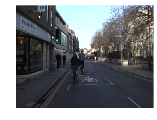
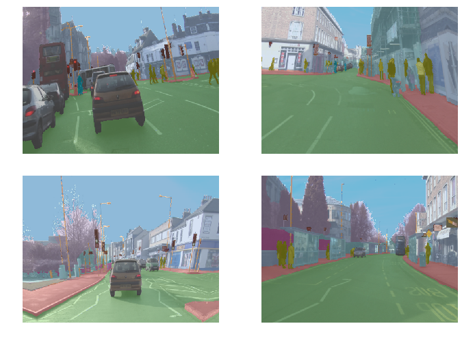
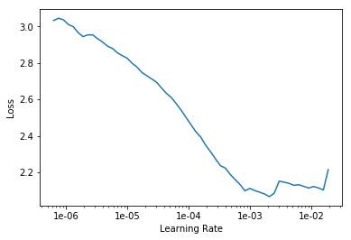
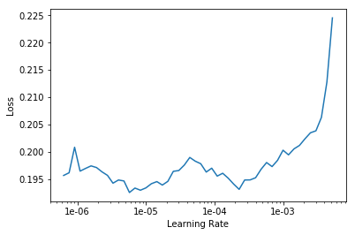
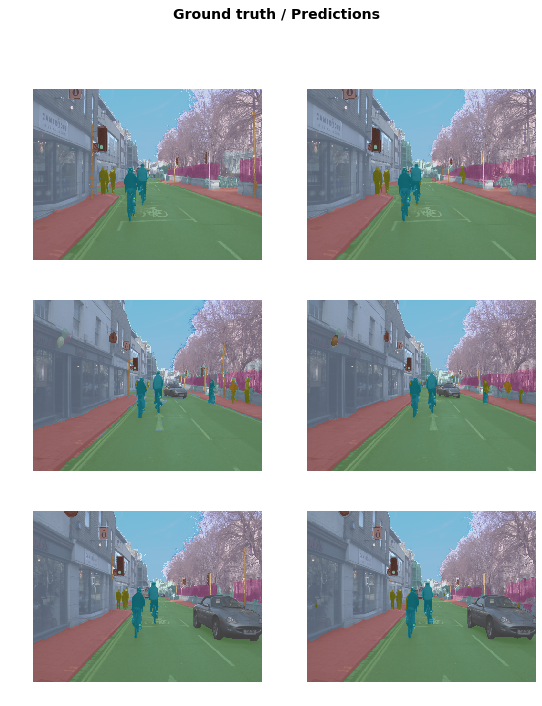

<h1>Table of Contents<span class="tocSkip"></span></h1>
<div class="toc"><ul class="toc-item"><li><span><a href="#Image-segmentation-with-CamVid" data-toc-modified-id="Image-segmentation-with-CamVid-1"><span class="toc-item-num">1&nbsp;&nbsp;</span>Image segmentation with CamVid</a></span><ul class="toc-item"><li><ul class="toc-item"><li><span><a href="#3行魔法代码" data-toc-modified-id="3行魔法代码-1.0.1"><span class="toc-item-num">1.0.1&nbsp;&nbsp;</span>3行魔法代码</a></span></li><li><span><a href="#所需library" data-toc-modified-id="所需library-1.0.2"><span class="toc-item-num">1.0.2&nbsp;&nbsp;</span>所需library</a></span></li><li><span><a href="#下载在GitHub中的数据集" data-toc-modified-id="下载在GitHub中的数据集-1.0.3"><span class="toc-item-num">1.0.3&nbsp;&nbsp;</span>下载在GitHub中的数据集</a></span></li><li><span><a href="#构建path到所需文件夹" data-toc-modified-id="构建path到所需文件夹-1.0.4"><span class="toc-item-num">1.0.4&nbsp;&nbsp;</span>构建path到所需文件夹</a></span></li></ul></li></ul></li><li><span><a href="#Data" data-toc-modified-id="Data-2"><span class="toc-item-num">2&nbsp;&nbsp;</span>Data</a></span><ul class="toc-item"><li><ul class="toc-item"><li><span><a href="#将文件夹中文件转化成path-list" data-toc-modified-id="将文件夹中文件转化成path-list-2.0.1"><span class="toc-item-num">2.0.1&nbsp;&nbsp;</span>将文件夹中文件转化成path list</a></span></li><li><span><a href="#将文件path转化成Image，再展示" data-toc-modified-id="将文件path转化成Image，再展示-2.0.2"><span class="toc-item-num">2.0.2&nbsp;&nbsp;</span>将文件path转化成Image，再展示</a></span></li><li><span><a href="#对应文件图片找到annot图片在转化成mask图片" data-toc-modified-id="对应文件图片找到annot图片在转化成mask图片-2.0.3"><span class="toc-item-num">2.0.3&nbsp;&nbsp;</span>对应文件图片找到annot图片在转化成mask图片</a></span></li><li><span><a href="#查看mask图片的尺寸和数据" data-toc-modified-id="查看mask图片的尺寸和数据-2.0.4"><span class="toc-item-num">2.0.4&nbsp;&nbsp;</span>查看mask图片的尺寸和数据</a></span></li></ul></li></ul></li><li><span><a href="#Datasets" data-toc-modified-id="Datasets-3"><span class="toc-item-num">3&nbsp;&nbsp;</span>Datasets</a></span><ul class="toc-item"><li><ul class="toc-item"><li><span><a href="#设置小批量大小" data-toc-modified-id="设置小批量大小-3.0.1"><span class="toc-item-num">3.0.1&nbsp;&nbsp;</span>设置小批量大小</a></span></li><li><span><a href="#创建segmentation-data-source" data-toc-modified-id="创建segmentation-data-source-3.0.2"><span class="toc-item-num">3.0.2&nbsp;&nbsp;</span>创建segmentation data source</a></span></li><li><span><a href="#从data-source创建databunch" data-toc-modified-id="从data-source创建databunch-3.0.3"><span class="toc-item-num">3.0.3&nbsp;&nbsp;</span>从data source创建databunch</a></span></li><li><span><a href="#show_batch-将原图和annot图进行了融合，好比图片与label一同打印一样" data-toc-modified-id="show_batch-将原图和annot图进行了融合，好比图片与label一同打印一样-3.0.4"><span class="toc-item-num">3.0.4&nbsp;&nbsp;</span>show_batch 将原图和annot图进行了融合，好比图片与label一同打印一样</a></span></li></ul></li></ul></li><li><span><a href="#Model" data-toc-modified-id="Model-4"><span class="toc-item-num">4&nbsp;&nbsp;</span>Model</a></span><ul class="toc-item"><li><ul class="toc-item"><li><span><a href="#找出'void'对应的mask代码" data-toc-modified-id="找出'void'对应的mask代码-4.0.1"><span class="toc-item-num">4.0.1&nbsp;&nbsp;</span>找出'void'对应的mask代码</a></span></li><li><span><a href="#针对camvid的准确率设计" data-toc-modified-id="针对camvid的准确率设计-4.0.2"><span class="toc-item-num">4.0.2&nbsp;&nbsp;</span>针对camvid的准确率设计</a></span></li><li><span><a href="#设置weight-decay" data-toc-modified-id="设置weight-decay-4.0.3"><span class="toc-item-num">4.0.3&nbsp;&nbsp;</span>设置weight decay</a></span></li><li><span><a href="#创建U-net模型" data-toc-modified-id="创建U-net模型-4.0.4"><span class="toc-item-num">4.0.4&nbsp;&nbsp;</span>创建U-net模型</a></span></li><li><span><a href="#寻找并画出学习率-损失值图，并挑选学习率" data-toc-modified-id="寻找并画出学习率-损失值图，并挑选学习率-4.0.5"><span class="toc-item-num">4.0.5&nbsp;&nbsp;</span>寻找并画出学习率-损失值图，并挑选学习率</a></span></li><li><span><a href="#训练10次（设置pct_start)" data-toc-modified-id="训练10次（设置pct_start)-4.0.6"><span class="toc-item-num">4.0.6&nbsp;&nbsp;</span>训练10次（设置pct_start)</a></span></li><li><span><a href="#加载，解冻，设置学习率区间slice,-用pct_start训练12次" data-toc-modified-id="加载，解冻，设置学习率区间slice,-用pct_start训练12次-4.0.7"><span class="toc-item-num">4.0.7&nbsp;&nbsp;</span>加载，解冻，设置学习率区间slice, 用pct_start训练12次</a></span></li></ul></li></ul></li><li><span><a href="#Go-big" data-toc-modified-id="Go-big-5"><span class="toc-item-num">5&nbsp;&nbsp;</span>Go big</a></span><ul class="toc-item"><li><ul class="toc-item"><li><span><a href="#释放空间" data-toc-modified-id="释放空间-5.0.1"><span class="toc-item-num">5.0.1&nbsp;&nbsp;</span>释放空间</a></span></li><li><span><a href="#根据数据大小，调整小批量大小" data-toc-modified-id="根据数据大小，调整小批量大小-5.0.2"><span class="toc-item-num">5.0.2&nbsp;&nbsp;</span>根据数据大小，调整小批量大小</a></span></li><li><span><a href="#准备Databunch" data-toc-modified-id="准备Databunch-5.0.3"><span class="toc-item-num">5.0.3&nbsp;&nbsp;</span>准备Databunch</a></span></li><li><span><a href="#构建U-net并加载之前训练的模型" data-toc-modified-id="构建U-net并加载之前训练的模型-5.0.4"><span class="toc-item-num">5.0.4&nbsp;&nbsp;</span>构建U-net并加载之前训练的模型</a></span></li><li><span><a href="#寻找学习率并作图" data-toc-modified-id="寻找学习率并作图-5.0.5"><span class="toc-item-num">5.0.5&nbsp;&nbsp;</span>寻找学习率并作图</a></span></li><li><span><a href="#挑选学习率并开始训练，采用slice,-pct_start" data-toc-modified-id="挑选学习率并开始训练，采用slice,-pct_start-5.0.6"><span class="toc-item-num">5.0.6&nbsp;&nbsp;</span>挑选学习率并开始训练，采用slice, pct_start</a></span></li><li><span><a href="#加载模型，解冻，设置学习率区间slice,-并训练10次" data-toc-modified-id="加载模型，解冻，设置学习率区间slice,-并训练10次-5.0.7"><span class="toc-item-num">5.0.7&nbsp;&nbsp;</span>加载模型，解冻，设置学习率区间slice, 并训练10次</a></span></li><li><span><a href="#加载训练好的模型，并展示结果" data-toc-modified-id="加载训练好的模型，并展示结果-5.0.8"><span class="toc-item-num">5.0.8&nbsp;&nbsp;</span>加载训练好的模型，并展示结果</a></span></li></ul></li></ul></li><li><span><a href="#fin" data-toc-modified-id="fin-6"><span class="toc-item-num">6&nbsp;&nbsp;</span>fin</a></span><ul class="toc-item"><li><ul class="toc-item"><li><span><a href="#总结模型特点" data-toc-modified-id="总结模型特点-6.0.1"><span class="toc-item-num">6.0.1&nbsp;&nbsp;</span>总结模型特点</a></span></li></ul></li></ul></li></ul></div>

## Image segmentation with CamVid

#### 3行魔法代码


```python
%reload_ext autoreload
%autoreload 2
%matplotlib inline
```

#### 所需library


```python
from fastai import *
from fastai.vision import *
from fastai.callbacks.hooks import *
```

#### 下载在GitHub中的数据集

The One Hundred Layer Tiramisu paper used a modified version of Camvid, with smaller images and few classes. You can get it from the CamVid directory of this repo:

    git clone https://github.com/alexgkendall/SegNet-Tutorial.git

#### 构建path到所需文件夹


```python
path = Path('./data/camvid-tiramisu')
```


```python
path.ls()
```


    [PosixPath('data/camvid-tiramisu/valannot'),
     PosixPath('data/camvid-tiramisu/test'),
     PosixPath('data/camvid-tiramisu/val'),
     PosixPath('data/camvid-tiramisu/val.txt'),
     PosixPath('data/camvid-tiramisu/trainannot'),
     PosixPath('data/camvid-tiramisu/testannot'),
     PosixPath('data/camvid-tiramisu/train'),
     PosixPath('data/camvid-tiramisu/test.txt'),
     PosixPath('data/camvid-tiramisu/train.txt'),
     PosixPath('data/camvid-tiramisu/models')]


## Data

#### 将文件夹中文件转化成path list


```python
fnames = get_image_files(path/'val')
fnames[:3]
```


    [PosixPath('data/camvid-tiramisu/val/0016E5_08065.png'),
     PosixPath('data/camvid-tiramisu/val/0016E5_07989.png'),
     PosixPath('data/camvid-tiramisu/val/0016E5_08041.png')]


```python
lbl_names = get_image_files(path/'valannot')
lbl_names[:3]
```


    [PosixPath('data/camvid-tiramisu/valannot/0016E5_08065.png'),
     PosixPath('data/camvid-tiramisu/valannot/0016E5_07989.png'),
     PosixPath('data/camvid-tiramisu/valannot/0016E5_08041.png')]


#### 将文件path转化成Image，再展示


```python
img_f = fnames[0]
img = open_image(img_f)
img.show(figsize=(5,5))
```





#### 对应文件图片找到annot图片在转化成mask图片


```python
def get_y_fn(x): return Path(str(x.parent)+'annot')/x.name

codes = array(['Sky', 'Building', 'Pole', 'Road', 'Sidewalk', 'Tree',
    'Sign', 'Fence', 'Car', 'Pedestrian', 'Cyclist', 'Void'])
```


```python
mask = open_mask(get_y_fn(img_f))
mask.show(figsize=(5,5), alpha=1)
```


#### 查看mask图片的尺寸和数据


```python
src_size = np.array(mask.shape[1:])
src_size,mask.data
```


    (array([360, 480]), tensor([[[1, 1, 1,  ..., 5, 5, 5],
              [1, 1, 1,  ..., 5, 5, 5],
              [1, 1, 1,  ..., 5, 5, 5],
              ...,
              [4, 4, 4,  ..., 3, 3, 3],
              [4, 4, 4,  ..., 3, 3, 3],
              [4, 4, 4,  ..., 3, 3, 3]]]))


## Datasets

#### 设置小批量大小


```python
bs,size = 8,src_size//2
```

#### 创建segmentation data source


```python
src = (SegmentationItemList.from_folder(path)
       .split_by_folder(valid='val')
       .label_from_func(get_y_fn, classes=codes))
```

#### 从data source创建databunch


```python
data = (src.transform(get_transforms(), tfm_y=True)
        .databunch(bs=bs)
        .normalize(imagenet_stats))
```

#### show_batch 将原图和annot图进行了融合，好比图片与label一同打印一样


```python
data.show_batch(2, figsize=(10,7))
```





## Model

#### 找出'void'对应的mask代码


```python
name2id = {v:k for k,v in enumerate(codes)}
void_code = name2id['Void']
```

#### 针对camvid的准确率设计


```python
def acc_camvid(input, target):
    target = target.squeeze(1)
    mask = target != void_code
    return (input.argmax(dim=1)[mask]==target[mask]).float().mean()
```


```python
metrics=acc_camvid
```

#### 设置weight decay


```python
wd=1e-2
```

#### 创建U-net模型


```python
learn = unet_learner(data, models.resnet34, metrics=metrics, wd=wd, bottle=True)
```

#### 寻找并画出学习率-损失值图，并挑选学习率


```python
lr_find(learn)
learn.recorder.plot()
```

    LR Finder is complete, type {learner_name}.recorder.plot() to see the graph.





```python
lr=2e-3
```

#### 训练10次（设置pct_start)


```python
learn.fit_one_cycle(10, slice(lr), pct_start=0.8)
```


Total time: 04:45 <p><table style='width:300px; margin-bottom:10px'>
  <tr>
    <th>epoch</th>
    <th>train_loss</th>
    <th>valid_loss</th>
    <th>acc_camvid</th>
  </tr>
  <tr>
    <th>1</th>
    <th>1.797555</th>
    <th>1.140855</th>
    <th>0.666712</th>
  </tr>
  <tr>
    <th>2</th>
    <th>1.108703</th>
    <th>0.773872</th>
    <th>0.779746</th>
  </tr>
  <tr>
    <th>3</th>
    <th>0.780712</th>
    <th>0.517655</th>
    <th>0.865303</th>
  </tr>
  <tr>
    <th>4</th>
    <th>0.618028</th>
    <th>0.496499</th>
    <th>0.866009</th>
  </tr>
  <tr>
    <th>5</th>
    <th>0.542120</th>
    <th>0.484854</th>
    <th>0.861792</th>
  </tr>
  <tr>
    <th>6</th>
    <th>0.490998</th>
    <th>0.412183</th>
    <th>0.857062</th>
  </tr>
  <tr>
    <th>7</th>
    <th>0.458476</th>
    <th>0.363839</th>
    <th>0.895877</th>
  </tr>
  <tr>
    <th>8</th>
    <th>0.426327</th>
    <th>0.377631</th>
    <th>0.885415</th>
  </tr>
  <tr>
    <th>9</th>
    <th>0.381760</th>
    <th>0.307907</th>
    <th>0.908467</th>
  </tr>
  <tr>
    <th>10</th>
    <th>0.325531</th>
    <th>0.288052</th>
    <th>0.907133</th>
  </tr>
</table>


```python
learn.save('stage-1')
```

#### 加载，解冻，设置学习率区间slice, 用pct_start训练12次


```python
learn.load('stage-1');
```


```python
learn.unfreeze()
```


```python
lrs = slice(lr/100,lr)
```


```python
learn.fit_one_cycle(12, lrs, pct_start=0.8)
```


Total time: 05:52 <p><table style='width:300px; margin-bottom:10px'>
  <tr>
    <th>epoch</th>
    <th>train_loss</th>
    <th>valid_loss</th>
    <th>acc_camvid</th>
  </tr>
  <tr>
    <th>1</th>
    <th>0.277594</th>
    <th>0.273819</th>
    <th>0.913931</th>
  </tr>
  <tr>
    <th>2</th>
    <th>0.271254</th>
    <th>0.266760</th>
    <th>0.916620</th>
  </tr>
  <tr>
    <th>3</th>
    <th>0.269084</th>
    <th>0.269211</th>
    <th>0.915474</th>
  </tr>
  <tr>
    <th>4</th>
    <th>0.273889</th>
    <th>0.295377</th>
    <th>0.914132</th>
  </tr>
  <tr>
    <th>5</th>
    <th>0.268701</th>
    <th>0.312179</th>
    <th>0.906329</th>
  </tr>
  <tr>
    <th>6</th>
    <th>0.295838</th>
    <th>0.363080</th>
    <th>0.902990</th>
  </tr>
  <tr>
    <th>7</th>
    <th>0.304576</th>
    <th>0.323809</th>
    <th>0.898795</th>
  </tr>
  <tr>
    <th>8</th>
    <th>0.290066</th>
    <th>0.267403</th>
    <th>0.920294</th>
  </tr>
  <tr>
    <th>9</th>
    <th>0.274901</th>
    <th>0.274512</th>
    <th>0.914693</th>
  </tr>
  <tr>
    <th>10</th>
    <th>0.275207</th>
    <th>0.273877</th>
    <th>0.920632</th>
  </tr>
  <tr>
    <th>11</th>
    <th>0.248439</th>
    <th>0.236959</th>
    <th>0.931970</th>
  </tr>
  <tr>
    <th>12</th>
    <th>0.224031</th>
    <th>0.253183</th>
    <th>0.926807</th>
  </tr>
</table>


```python
learn.save('stage-2');
```

## Go big

#### 释放空间


```python
learn=None
gc.collect()
```


    4194


#### 根据数据大小，调整小批量大小

You may have to restart your kernel and come back to this stage if you run out of memory, and may also need to decrease `bs`.


```python
size = src_size
bs=8
```

#### 准备Databunch


```python
data = (src.transform(get_transforms(), size=size, tfm_y=True)
        .databunch(bs=bs)
        .normalize(imagenet_stats))
```

#### 构建U-net并加载之前训练的模型


```python
learn = unet_learner(data, models.resnet34, metrics=metrics, wd=wd, bottle=True).load('stage-2');
```

#### 寻找学习率并作图


```python
lr_find(learn)
learn.recorder.plot()
```

    LR Finder is complete, type {learner_name}.recorder.plot() to see the graph.





#### 挑选学习率并开始训练，采用slice, pct_start


```python
lr=1e-3
```


```python
learn.fit_one_cycle(10, slice(lr), pct_start=0.8)
```


Total time: 04:38 <p><table style='width:300px; margin-bottom:10px'>
  <tr>
    <th>epoch</th>
    <th>train_loss</th>
    <th>valid_loss</th>
    <th>acc_camvid</th>
  </tr>
  <tr>
    <th>1</th>
    <th>0.197342</th>
    <th>0.242197</th>
    <th>0.929653</th>
  </tr>
  <tr>
    <th>2</th>
    <th>0.195649</th>
    <th>0.237269</th>
    <th>0.930523</th>
  </tr>
  <tr>
    <th>3</th>
    <th>0.192771</th>
    <th>0.253759</th>
    <th>0.926123</th>
  </tr>
  <tr>
    <th>4</th>
    <th>0.197877</th>
    <th>0.244278</th>
    <th>0.931226</th>
  </tr>
  <tr>
    <th>5</th>
    <th>0.197267</th>
    <th>0.255444</th>
    <th>0.927470</th>
  </tr>
  <tr>
    <th>6</th>
    <th>0.206536</th>
    <th>0.371523</th>
    <th>0.913392</th>
  </tr>
  <tr>
    <th>7</th>
    <th>0.210372</th>
    <th>0.267855</th>
    <th>0.927450</th>
  </tr>
  <tr>
    <th>8</th>
    <th>0.210874</th>
    <th>0.278875</th>
    <th>0.915120</th>
  </tr>
  <tr>
    <th>9</th>
    <th>0.205951</th>
    <th>0.256743</th>
    <th>0.929986</th>
  </tr>
  <tr>
    <th>10</th>
    <th>0.184149</th>
    <th>0.227250</th>
    <th>0.939358</th>
  </tr>
</table>


```python
learn.save('stage-1-big')
```

#### 加载模型，解冻，设置学习率区间slice, 并训练10次


```python
learn.load('stage-1-big');
```


```python
learn.unfreeze()
```


```python
lrs = slice(lr/1000,lr/10)
```


```python
learn.fit_one_cycle(10, lrs)
```


Total time: 04:57 <p><table style='width:300px; margin-bottom:10px'>
  <tr>
    <th>epoch</th>
    <th>train_loss</th>
    <th>valid_loss</th>
    <th>acc_camvid</th>
  </tr>
  <tr>
    <th>1</th>
    <th>0.163259</th>
    <th>0.226014</th>
    <th>0.939663</th>
  </tr>
  <tr>
    <th>2</th>
    <th>0.159221</th>
    <th>0.223871</th>
    <th>0.940497</th>
  </tr>
  <tr>
    <th>3</th>
    <th>0.159171</th>
    <th>0.242006</th>
    <th>0.938531</th>
  </tr>
  <tr>
    <th>4</th>
    <th>0.158257</th>
    <th>0.223698</th>
    <th>0.941702</th>
  </tr>
  <tr>
    <th>5</th>
    <th>0.156215</th>
    <th>0.227719</th>
    <th>0.941239</th>
  </tr>
  <tr>
    <th>6</th>
    <th>0.155152</th>
    <th>0.226728</th>
    <th>0.941032</th>
  </tr>
  <tr>
    <th>7</th>
    <th>0.150818</th>
    <th>0.230083</th>
    <th>0.940657</th>
  </tr>
  <tr>
    <th>8</th>
    <th>0.149479</th>
    <th>0.229187</th>
    <th>0.940948</th>
  </tr>
  <tr>
    <th>9</th>
    <th>0.148236</th>
    <th>0.229072</th>
    <th>0.941316</th>
  </tr>
  <tr>
    <th>10</th>
    <th>0.148074</th>
    <th>0.234124</th>
    <th>0.940629</th>
  </tr>
</table>


```python
learn.save('stage-2-big')
```

#### 加载训练好的模型，并展示结果


```python
learn.load('stage-2-big');
```


```python
learn.show_results(rows=3, figsize=(9,11))
```





## fin


```python
# start: 480x360
```

#### 总结模型特点


```python
print(learn.summary())
```

    ======================================================================
    Layer (type)         Output Shape         Param #    Trainable 
    ======================================================================
    Conv2d               [8, 64, 180, 240]    9408       False     
    ______________________________________________________________________
    BatchNorm2d          [8, 64, 180, 240]    128        True      
    ______________________________________________________________________
    ReLU                 [8, 64, 180, 240]    0          False     
    ______________________________________________________________________
    MaxPool2d            [8, 64, 90, 120]     0          False     
    ______________________________________________________________________
    Conv2d               [8, 64, 90, 120]     36864      False     
    ______________________________________________________________________
    BatchNorm2d          [8, 64, 90, 120]     128        True      
    ______________________________________________________________________
    ReLU                 [8, 64, 90, 120]     0          False     
    ______________________________________________________________________
    Conv2d               [8, 64, 90, 120]     36864      False     
    ______________________________________________________________________
    BatchNorm2d          [8, 64, 90, 120]     128        True      
    ______________________________________________________________________
    Conv2d               [8, 64, 90, 120]     36864      False     
    ______________________________________________________________________
    BatchNorm2d          [8, 64, 90, 120]     128        True      
    ______________________________________________________________________
    ReLU                 [8, 64, 90, 120]     0          False     
    ______________________________________________________________________
    Conv2d               [8, 64, 90, 120]     36864      False     
    ______________________________________________________________________
    BatchNorm2d          [8, 64, 90, 120]     128        True      
    ______________________________________________________________________
    Conv2d               [8, 64, 90, 120]     36864      False     
    ______________________________________________________________________
    BatchNorm2d          [8, 64, 90, 120]     128        True      
    ______________________________________________________________________
    ReLU                 [8, 64, 90, 120]     0          False     
    ______________________________________________________________________
    Conv2d               [8, 64, 90, 120]     36864      False     
    ______________________________________________________________________
    BatchNorm2d          [8, 64, 90, 120]     128        True      
    ______________________________________________________________________
    Conv2d               [8, 128, 45, 60]     73728      False     
    ______________________________________________________________________
    BatchNorm2d          [8, 128, 45, 60]     256        True      
    ______________________________________________________________________
    ReLU                 [8, 128, 45, 60]     0          False     
    ______________________________________________________________________
    Conv2d               [8, 128, 45, 60]     147456     False     
    ______________________________________________________________________
    BatchNorm2d          [8, 128, 45, 60]     256        True      
    ______________________________________________________________________
    Conv2d               [8, 128, 45, 60]     8192       False     
    ______________________________________________________________________
    BatchNorm2d          [8, 128, 45, 60]     256        True      
    ______________________________________________________________________
    Conv2d               [8, 128, 45, 60]     147456     False     
    ______________________________________________________________________
    BatchNorm2d          [8, 128, 45, 60]     256        True      
    ______________________________________________________________________
    ReLU                 [8, 128, 45, 60]     0          False     
    ______________________________________________________________________
    Conv2d               [8, 128, 45, 60]     147456     False     
    ______________________________________________________________________
    BatchNorm2d          [8, 128, 45, 60]     256        True      
    ______________________________________________________________________
    Conv2d               [8, 128, 45, 60]     147456     False     
    ______________________________________________________________________
    BatchNorm2d          [8, 128, 45, 60]     256        True      
    ______________________________________________________________________
    ReLU                 [8, 128, 45, 60]     0          False     
    ______________________________________________________________________
    Conv2d               [8, 128, 45, 60]     147456     False     
    ______________________________________________________________________
    BatchNorm2d          [8, 128, 45, 60]     256        True      
    ______________________________________________________________________
    Conv2d               [8, 128, 45, 60]     147456     False     
    ______________________________________________________________________
    BatchNorm2d          [8, 128, 45, 60]     256        True      
    ______________________________________________________________________
    ReLU                 [8, 128, 45, 60]     0          False     
    ______________________________________________________________________
    Conv2d               [8, 128, 45, 60]     147456     False     
    ______________________________________________________________________
    BatchNorm2d          [8, 128, 45, 60]     256        True      
    ______________________________________________________________________
    Conv2d               [8, 256, 23, 30]     294912     False     
    ______________________________________________________________________
    BatchNorm2d          [8, 256, 23, 30]     512        True      
    ______________________________________________________________________
    ReLU                 [8, 256, 23, 30]     0          False     
    ______________________________________________________________________
    Conv2d               [8, 256, 23, 30]     589824     False     
    ______________________________________________________________________
    BatchNorm2d          [8, 256, 23, 30]     512        True      
    ______________________________________________________________________
    Conv2d               [8, 256, 23, 30]     32768      False     
    ______________________________________________________________________
    BatchNorm2d          [8, 256, 23, 30]     512        True      
    ______________________________________________________________________
    Conv2d               [8, 256, 23, 30]     589824     False     
    ______________________________________________________________________
    BatchNorm2d          [8, 256, 23, 30]     512        True      
    ______________________________________________________________________
    ReLU                 [8, 256, 23, 30]     0          False     
    ______________________________________________________________________
    Conv2d               [8, 256, 23, 30]     589824     False     
    ______________________________________________________________________
    BatchNorm2d          [8, 256, 23, 30]     512        True      
    ______________________________________________________________________
    Conv2d               [8, 256, 23, 30]     589824     False     
    ______________________________________________________________________
    BatchNorm2d          [8, 256, 23, 30]     512        True      
    ______________________________________________________________________
    ReLU                 [8, 256, 23, 30]     0          False     
    ______________________________________________________________________
    Conv2d               [8, 256, 23, 30]     589824     False     
    ______________________________________________________________________
    BatchNorm2d          [8, 256, 23, 30]     512        True      
    ______________________________________________________________________
    Conv2d               [8, 256, 23, 30]     589824     False     
    ______________________________________________________________________
    BatchNorm2d          [8, 256, 23, 30]     512        True      
    ______________________________________________________________________
    ReLU                 [8, 256, 23, 30]     0          False     
    ______________________________________________________________________
    Conv2d               [8, 256, 23, 30]     589824     False     
    ______________________________________________________________________
    BatchNorm2d          [8, 256, 23, 30]     512        True      
    ______________________________________________________________________
    Conv2d               [8, 256, 23, 30]     589824     False     
    ______________________________________________________________________
    BatchNorm2d          [8, 256, 23, 30]     512        True      
    ______________________________________________________________________
    ReLU                 [8, 256, 23, 30]     0          False     
    ______________________________________________________________________
    Conv2d               [8, 256, 23, 30]     589824     False     
    ______________________________________________________________________
    BatchNorm2d          [8, 256, 23, 30]     512        True      
    ______________________________________________________________________
    Conv2d               [8, 256, 23, 30]     589824     False     
    ______________________________________________________________________
    BatchNorm2d          [8, 256, 23, 30]     512        True      
    ______________________________________________________________________
    ReLU                 [8, 256, 23, 30]     0          False     
    ______________________________________________________________________
    Conv2d               [8, 256, 23, 30]     589824     False     
    ______________________________________________________________________
    BatchNorm2d          [8, 256, 23, 30]     512        True      
    ______________________________________________________________________
    Conv2d               [8, 512, 12, 15]     1179648    False     
    ______________________________________________________________________
    BatchNorm2d          [8, 512, 12, 15]     1024       True      
    ______________________________________________________________________
    ReLU                 [8, 512, 12, 15]     0          False     
    ______________________________________________________________________
    Conv2d               [8, 512, 12, 15]     2359296    False     
    ______________________________________________________________________
    BatchNorm2d          [8, 512, 12, 15]     1024       True      
    ______________________________________________________________________
    Conv2d               [8, 512, 12, 15]     131072     False     
    ______________________________________________________________________
    BatchNorm2d          [8, 512, 12, 15]     1024       True      
    ______________________________________________________________________
    Conv2d               [8, 512, 12, 15]     2359296    False     
    ______________________________________________________________________
    BatchNorm2d          [8, 512, 12, 15]     1024       True      
    ______________________________________________________________________
    ReLU                 [8, 512, 12, 15]     0          False     
    ______________________________________________________________________
    Conv2d               [8, 512, 12, 15]     2359296    False     
    ______________________________________________________________________
    BatchNorm2d          [8, 512, 12, 15]     1024       True      
    ______________________________________________________________________
    Conv2d               [8, 512, 12, 15]     2359296    False     
    ______________________________________________________________________
    BatchNorm2d          [8, 512, 12, 15]     1024       True      
    ______________________________________________________________________
    ReLU                 [8, 512, 12, 15]     0          False     
    ______________________________________________________________________
    Conv2d               [8, 512, 12, 15]     2359296    False     
    ______________________________________________________________________
    BatchNorm2d          [8, 512, 12, 15]     1024       True      
    ______________________________________________________________________
    BatchNorm2d          [8, 512, 12, 15]     1024       True      
    ______________________________________________________________________
    ReLU                 [8, 512, 12, 15]     0          False     
    ______________________________________________________________________
    Conv2d               [8, 1024, 12, 15]    4719616    True      
    ______________________________________________________________________
    ReLU                 [8, 1024, 12, 15]    0          False     
    ______________________________________________________________________
    Conv2d               [8, 512, 12, 15]     4719104    True      
    ______________________________________________________________________
    ReLU                 [8, 512, 12, 15]     0          False     
    ______________________________________________________________________
    Conv2d               [8, 1024, 12, 15]    525312     True      
    ______________________________________________________________________
    PixelShuffle         [8, 256, 24, 30]     0          False     
    ______________________________________________________________________
    ReplicationPad2d     [8, 256, 25, 31]     0          False     
    ______________________________________________________________________
    AvgPool2d            [8, 256, 24, 30]     0          False     
    ______________________________________________________________________
    ReLU                 [8, 1024, 12, 15]    0          False     
    ______________________________________________________________________
    BatchNorm2d          [8, 256, 23, 30]     512        True      
    ______________________________________________________________________
    Conv2d               [8, 512, 23, 30]     2359808    True      
    ______________________________________________________________________
    ReLU                 [8, 512, 23, 30]     0          False     
    ______________________________________________________________________
    Conv2d               [8, 512, 23, 30]     2359808    True      
    ______________________________________________________________________
    ReLU                 [8, 512, 23, 30]     0          False     
    ______________________________________________________________________
    ReLU                 [8, 512, 23, 30]     0          False     
    ______________________________________________________________________
    Conv2d               [8, 1024, 23, 30]    525312     True      
    ______________________________________________________________________
    PixelShuffle         [8, 256, 46, 60]     0          False     
    ______________________________________________________________________
    ReplicationPad2d     [8, 256, 47, 61]     0          False     
    ______________________________________________________________________
    AvgPool2d            [8, 256, 46, 60]     0          False     
    ______________________________________________________________________
    ReLU                 [8, 1024, 23, 30]    0          False     
    ______________________________________________________________________
    BatchNorm2d          [8, 128, 45, 60]     256        True      
    ______________________________________________________________________
    Conv2d               [8, 384, 45, 60]     1327488    True      
    ______________________________________________________________________
    ReLU                 [8, 384, 45, 60]     0          False     
    ______________________________________________________________________
    Conv2d               [8, 384, 45, 60]     1327488    True      
    ______________________________________________________________________
    ReLU                 [8, 384, 45, 60]     0          False     
    ______________________________________________________________________
    ReLU                 [8, 384, 45, 60]     0          False     
    ______________________________________________________________________
    Conv2d               [8, 768, 45, 60]     295680     True      
    ______________________________________________________________________
    PixelShuffle         [8, 192, 90, 120]    0          False     
    ______________________________________________________________________
    ReplicationPad2d     [8, 192, 91, 121]    0          False     
    ______________________________________________________________________
    AvgPool2d            [8, 192, 90, 120]    0          False     
    ______________________________________________________________________
    ReLU                 [8, 768, 45, 60]     0          False     
    ______________________________________________________________________
    BatchNorm2d          [8, 64, 90, 120]     128        True      
    ______________________________________________________________________
    Conv2d               [8, 256, 90, 120]    590080     True      
    ______________________________________________________________________
    ReLU                 [8, 256, 90, 120]    0          False     
    ______________________________________________________________________
    Conv2d               [8, 256, 90, 120]    590080     True      
    ______________________________________________________________________
    ReLU                 [8, 256, 90, 120]    0          False     
    ______________________________________________________________________
    ReLU                 [8, 256, 90, 120]    0          False     
    ______________________________________________________________________
    Conv2d               [8, 512, 90, 120]    131584     True      
    ______________________________________________________________________
    PixelShuffle         [8, 128, 180, 240]   0          False     
    ______________________________________________________________________
    ReplicationPad2d     [8, 128, 181, 241]   0          False     
    ______________________________________________________________________
    AvgPool2d            [8, 128, 180, 240]   0          False     
    ______________________________________________________________________
    ReLU                 [8, 512, 90, 120]    0          False     
    ______________________________________________________________________
    BatchNorm2d          [8, 64, 180, 240]    128        True      
    ______________________________________________________________________
    Conv2d               [8, 96, 180, 240]    165984     True      
    ______________________________________________________________________
    ReLU                 [8, 96, 180, 240]    0          False     
    ______________________________________________________________________
    Conv2d               [8, 96, 180, 240]    83040      True      
    ______________________________________________________________________
    ReLU                 [8, 96, 180, 240]    0          False     
    ______________________________________________________________________
    ReLU                 [8, 192, 180, 240]   0          False     
    ______________________________________________________________________
    Conv2d               [8, 384, 180, 240]   37248      True      
    ______________________________________________________________________
    PixelShuffle         [8, 96, 360, 480]    0          False     
    ______________________________________________________________________
    ReplicationPad2d     [8, 96, 361, 481]    0          False     
    ______________________________________________________________________
    AvgPool2d            [8, 96, 360, 480]    0          False     
    ______________________________________________________________________
    ReLU                 [8, 384, 180, 240]   0          False     
    ______________________________________________________________________
    MergeLayer           [8, 99, 360, 480]    0          False     
    ______________________________________________________________________
    Conv2d               [8, 49, 360, 480]    43708      True      
    ______________________________________________________________________
    ReLU                 [8, 49, 360, 480]    0          False     
    ______________________________________________________________________
    Conv2d               [8, 99, 360, 480]    43758      True      
    ______________________________________________________________________
    ReLU                 [8, 99, 360, 480]    0          False     
    ______________________________________________________________________
    MergeLayer           [8, 99, 360, 480]    0          False     
    ______________________________________________________________________
    Conv2d               [8, 12, 360, 480]    1200       True      
    ______________________________________________________________________
    
    Total params:  41133018
    Total trainable params:  19865370
    Total non-trainable params:  21267648

