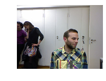
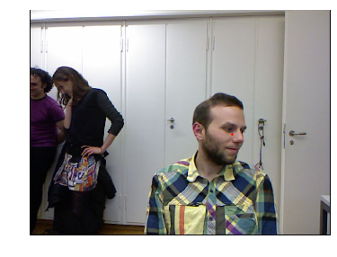
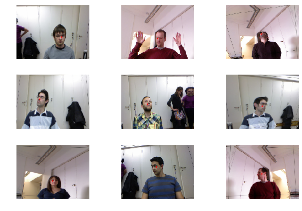
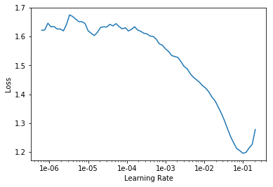
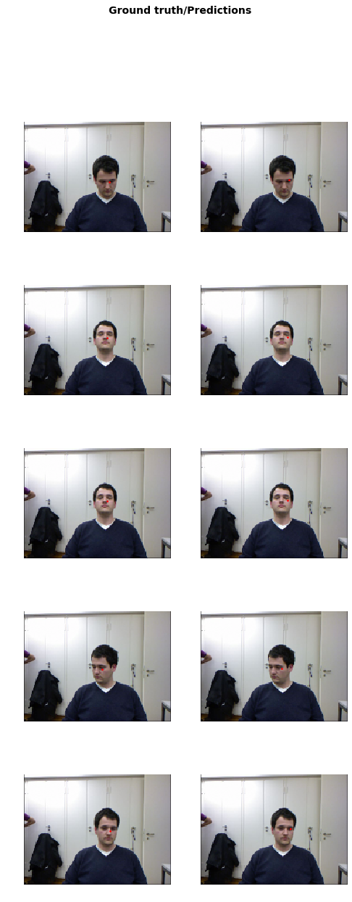
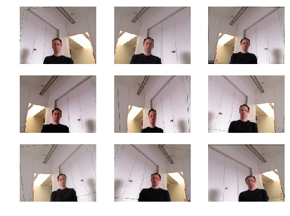

<h1>Table of Contents<span class="tocSkip"></span></h1>
<div class="toc"><ul class="toc-item"><li><span><a href="#Regression-with-BIWI-head-pose-dataset" data-toc-modified-id="Regression-with-BIWI-head-pose-dataset-1"><span class="toc-item-num">1&nbsp;&nbsp;</span>Regression with BIWI head pose dataset</a></span><ul class="toc-item"><li><ul class="toc-item"><li><span><a href="#BIWI-head-pose数据集要处理什么问题" data-toc-modified-id="BIWI-head-pose数据集要处理什么问题-1.0.1"><span class="toc-item-num">1.0.1&nbsp;&nbsp;</span>BIWI head pose数据集要处理什么问题</a></span></li><li><span><a href="#三行魔法代码" data-toc-modified-id="三行魔法代码-1.0.2"><span class="toc-item-num">1.0.2&nbsp;&nbsp;</span>三行魔法代码</a></span></li><li><span><a href="#所需library" data-toc-modified-id="所需library-1.0.3"><span class="toc-item-num">1.0.3&nbsp;&nbsp;</span>所需library</a></span></li></ul></li></ul></li><li><span><a href="#Getting-and-converting-the-data" data-toc-modified-id="Getting-and-converting-the-data-2"><span class="toc-item-num">2&nbsp;&nbsp;</span>Getting and converting the data</a></span><ul class="toc-item"><li><ul class="toc-item"><li><span><a href="#下载数据" data-toc-modified-id="下载数据-2.0.1"><span class="toc-item-num">2.0.1&nbsp;&nbsp;</span>下载数据</a></span></li><li><span><a href="#从文件path打开图片" data-toc-modified-id="从文件path打开图片-2.0.2"><span class="toc-item-num">2.0.2&nbsp;&nbsp;</span>从文件path打开图片</a></span></li><li><span><a href="#从文件图片path提取对应的头部位置坐标" data-toc-modified-id="从文件图片path提取对应的头部位置坐标-2.0.3"><span class="toc-item-num">2.0.3&nbsp;&nbsp;</span>从文件图片path提取对应的头部位置坐标</a></span></li><li><span><a href="#将图片和坐标同时画出来" data-toc-modified-id="将图片和坐标同时画出来-2.0.4"><span class="toc-item-num">2.0.4&nbsp;&nbsp;</span>将图片和坐标同时画出来</a></span></li></ul></li></ul></li><li><span><a href="#Creating-a-dataset" data-toc-modified-id="Creating-a-dataset-3"><span class="toc-item-num">3&nbsp;&nbsp;</span>Creating a dataset</a></span><ul class="toc-item"><li><ul class="toc-item"><li><span><a href="#从pointsItemList-创建Databunch" data-toc-modified-id="从pointsItemList-创建Databunch-3.0.1"><span class="toc-item-num">3.0.1&nbsp;&nbsp;</span>从pointsItemList 创建Databunch</a></span></li><li><span><a href="#展示小批量中的数据（图同标注）" data-toc-modified-id="展示小批量中的数据（图同标注）-3.0.2"><span class="toc-item-num">3.0.2&nbsp;&nbsp;</span>展示小批量中的数据（图同标注）</a></span></li></ul></li></ul></li><li><span><a href="#Train-model" data-toc-modified-id="Train-model-4"><span class="toc-item-num">4&nbsp;&nbsp;</span>Train model</a></span><ul class="toc-item"><li><ul class="toc-item"><li><span><a href="#创建模型" data-toc-modified-id="创建模型-4.0.1"><span class="toc-item-num">4.0.1&nbsp;&nbsp;</span>创建模型</a></span></li><li><span><a href="#寻找学习率作图，并选择" data-toc-modified-id="寻找学习率作图，并选择-4.0.2"><span class="toc-item-num">4.0.2&nbsp;&nbsp;</span>寻找学习率作图，并选择</a></span></li><li><span><a href="#slice学习率训练5次" data-toc-modified-id="slice学习率训练5次-4.0.3"><span class="toc-item-num">4.0.3&nbsp;&nbsp;</span>slice学习率训练5次</a></span></li><li><span><a href="#加载模型，展示效果" data-toc-modified-id="加载模型，展示效果-4.0.4"><span class="toc-item-num">4.0.4&nbsp;&nbsp;</span>加载模型，展示效果</a></span></li></ul></li></ul></li><li><span><a href="#Data-augmentation" data-toc-modified-id="Data-augmentation-5"><span class="toc-item-num">5&nbsp;&nbsp;</span>Data augmentation</a></span><ul class="toc-item"><li><ul class="toc-item"><li><span><a href="#调整transformation设置" data-toc-modified-id="调整transformation设置-5.0.1"><span class="toc-item-num">5.0.1&nbsp;&nbsp;</span>调整transformation设置</a></span></li><li><span><a href="#从PointsItemList-构建DataBunch" data-toc-modified-id="从PointsItemList-构建DataBunch-5.0.2"><span class="toc-item-num">5.0.2&nbsp;&nbsp;</span>从PointsItemList 构建DataBunch</a></span></li><li><span><a href="#对一张图做多边形作图" data-toc-modified-id="对一张图做多边形作图-5.0.3"><span class="toc-item-num">5.0.3&nbsp;&nbsp;</span>对一张图做多边形作图</a></span></li></ul></li></ul></li></ul></div>

## Regression with BIWI head pose dataset

#### BIWI head pose数据集要处理什么问题

This is a more advanced example to show how to create custom datasets and do regression with images. Our task is to find the center of the head in each image. The data comes from the [BIWI head pose dataset](https://data.vision.ee.ethz.ch/cvl/gfanelli/head_pose/head_forest.html#db), thanks to Gabriele Fanelli et al. We have converted the images to jpeg format, so you should download the converted dataset from [this link](https://s3.amazonaws.com/fast-ai-imagelocal/biwi_head_pose.tgz).

#### 三行魔法代码


```python
%reload_ext autoreload
%autoreload 2
%matplotlib inline
```

#### 所需library


```python
from fastai.vision import *
```

## Getting and converting the data

#### 下载数据


```python
path = untar_data(URLs.BIWI_HEAD_POSE)
```


```python
cal = np.genfromtxt(path/'01'/'rgb.cal', skip_footer=6); cal
```


    array([[517.679,   0.   , 320.   ],
           [  0.   , 517.679, 240.5  ],
           [  0.   ,   0.   ,   1.   ]])


#### 从文件path打开图片


```python
fname = '09/frame_00667_rgb.jpg'
```


```python
def img2txt_name(f): return path/f'{str(f)[:-7]}pose.txt'
```


```python
img = open_image(path/fname)
img.show()
```





#### 从文件图片path提取对应的头部位置坐标


```python
ctr = np.genfromtxt(img2txt_name(fname), skip_header=3); ctr
```


    array([187.332 ,  40.3892, 893.135 ])


```python
def convert_biwi(coords):
    c1 = coords[0] * cal[0][0]/coords[2] + cal[0][2]
    c2 = coords[1] * cal[1][1]/coords[2] + cal[1][2]
    return tensor([c2,c1])

def get_ctr(f):
    ctr = np.genfromtxt(img2txt_name(f), skip_header=3)
    return convert_biwi(ctr)

def get_ip(img,pts): return ImagePoints(FlowField(img.size, pts), scale=True)
```


```python
get_ctr(fname)
```


    tensor([263.9104, 428.5814])


#### 将图片和坐标同时画出来


```python
ctr = get_ctr(fname)
img.show(y=get_ip(img, ctr), figsize=(6, 6))
```





## Creating a dataset

#### 从pointsItemList 创建Databunch


```python
data = (PointsItemList.from_folder(path)
        .split_by_valid_func(lambda o: o.parent.name=='13')
        .label_from_func(get_ctr)
        .transform(get_transforms(), tfm_y=True, size=(120,160))
        .databunch().normalize(imagenet_stats)
       )
```

#### 展示小批量中的数据（图同标注）


```python
data.show_batch(3, figsize=(9,6))
```





## Train model

#### 创建模型


```python
learn = create_cnn(data, models.resnet34)
```

#### 寻找学习率作图，并选择


```python
learn.lr_find()
learn.recorder.plot()
```


    LR Finder is complete, type {learner_name}.recorder.plot() to see the graph.





```python
lr = 2e-2
```

#### slice学习率训练5次


```python
learn.fit_one_cycle(5, slice(lr))
```


Total time: 04:09 <p><table style='width:300px; margin-bottom:10px'>
  <tr>
    <th>epoch</th>
    <th>train_loss</th>
    <th>valid_loss</th>
  </tr>
  <tr>
    <th>1</th>
    <th>0.052076</th>
    <th>0.003733</th>
  </tr>
  <tr>
    <th>2</th>
    <th>0.018467</th>
    <th>0.002182</th>
  </tr>
  <tr>
    <th>3</th>
    <th>0.009045</th>
    <th>0.011063</th>
  </tr>
  <tr>
    <th>4</th>
    <th>0.005409</th>
    <th>0.002293</th>
  </tr>
  <tr>
    <th>5</th>
    <th>0.004046</th>
    <th>0.002766</th>
  </tr>
</table>


```python
learn.save('stage-1')
```

#### 加载模型，展示效果


```python
learn.load('stage-1');
```


```python
learn.show_results()
```





## Data augmentation

#### 调整transformation设置


```python
tfms = get_transforms(max_rotate=20, max_zoom=1.5, max_lighting=0.5, max_warp=0.4, p_affine=1., p_lighting=1.)
```

#### 从PointsItemList 构建DataBunch


```python
data = (PointsItemList.from_folder(path)
        .split_by_valid_func(lambda o: o.parent.name=='13')
        .label_from_func(get_ctr)
        .transform(get_transforms(), tfm_y=True, size=(120,160))
        .databunch().normalize(imagenet_stats)
       )
```

#### 对一张图做多边形作图


```python
def _plot(i,j,ax):
    x,y = data.train_ds[0]
    x.show(ax, y=y)

plot_multi(_plot, 3, 3, figsize=(8,6))
```




