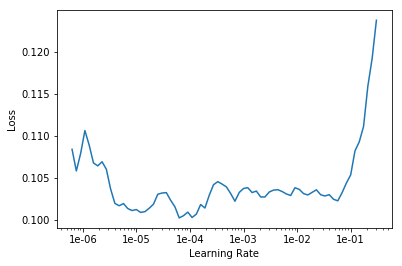

<h1>Table of Contents<span class="tocSkip"></span></h1>
<div class="toc"><ul class="toc-item"><li><ul class="toc-item"><li><span><a href="#Multi-label-prediction-with-Planet-Amazon-dataset" data-toc-modified-id="Multi-label-prediction-with-Planet-Amazon-dataset-0.1"><span class="toc-item-num">0.1&nbsp;&nbsp;</span>Multi-label prediction with Planet Amazon dataset</a></span><ul class="toc-item"><li><ul class="toc-item"><li><span><a href="#三行魔法代码" data-toc-modified-id="三行魔法代码-0.1.0.1"><span class="toc-item-num">0.1.0.1&nbsp;&nbsp;</span>三行魔法代码</a></span></li><li><span><a href="#所需library" data-toc-modified-id="所需library-0.1.0.2"><span class="toc-item-num">0.1.0.2&nbsp;&nbsp;</span>所需library</a></span></li></ul></li></ul></li><li><span><a href="#Getting-the-data" data-toc-modified-id="Getting-the-data-0.2"><span class="toc-item-num">0.2&nbsp;&nbsp;</span>Getting the data</a></span><ul class="toc-item"><li><ul class="toc-item"><li><span><a href="#如何从Kaggle下载数据" data-toc-modified-id="如何从Kaggle下载数据-0.2.0.1"><span class="toc-item-num">0.2.0.1&nbsp;&nbsp;</span>如何从Kaggle下载数据</a></span></li></ul></li></ul></li><li><span><a href="#Multiclassification" data-toc-modified-id="Multiclassification-0.3"><span class="toc-item-num">0.3&nbsp;&nbsp;</span>Multiclassification</a></span><ul class="toc-item"><li><ul class="toc-item"><li><span><a href="#查看CSV，一图多标注" data-toc-modified-id="查看CSV，一图多标注-0.3.0.1"><span class="toc-item-num">0.3.0.1&nbsp;&nbsp;</span>查看CSV，一图多标注</a></span></li><li><span><a href="#为什么用ImageList而非ImageDataBunch" data-toc-modified-id="为什么用ImageList而非ImageDataBunch-0.3.0.2"><span class="toc-item-num">0.3.0.2&nbsp;&nbsp;</span>为什么用ImageList而非ImageDataBunch</a></span></li><li><span><a href="#设置变形细节" data-toc-modified-id="设置变形细节-0.3.0.3"><span class="toc-item-num">0.3.0.3&nbsp;&nbsp;</span>设置变形细节</a></span></li><li><span><a href="#用ImageList构建数据src，然后再建DataBunch" data-toc-modified-id="用ImageList构建数据src，然后再建DataBunch-0.3.0.4"><span class="toc-item-num">0.3.0.4&nbsp;&nbsp;</span>用ImageList构建数据src，然后再建DataBunch</a></span></li><li><span><a href="#查看数据" data-toc-modified-id="查看数据-0.3.0.5"><span class="toc-item-num">0.3.0.5&nbsp;&nbsp;</span>查看数据</a></span></li><li><span><a href="#如何设计thresh_accuracy" data-toc-modified-id="如何设计thresh_accuracy-0.3.0.6"><span class="toc-item-num">0.3.0.6&nbsp;&nbsp;</span>如何设计thresh_accuracy</a></span></li><li><span><a href="#挑选模型结构" data-toc-modified-id="挑选模型结构-0.3.0.7"><span class="toc-item-num">0.3.0.7&nbsp;&nbsp;</span>挑选模型结构</a></span></li><li><span><a href="#设计含threshold的accuracy和F-score" data-toc-modified-id="设计含threshold的accuracy和F-score-0.3.0.8"><span class="toc-item-num">0.3.0.8&nbsp;&nbsp;</span>设计含threshold的accuracy和F-score</a></span></li><li><span><a href="#构建模型" data-toc-modified-id="构建模型-0.3.0.9"><span class="toc-item-num">0.3.0.9&nbsp;&nbsp;</span>构建模型</a></span></li><li><span><a href="#寻找学习率，作图，挑选最优值" data-toc-modified-id="寻找学习率，作图，挑选最优值-0.3.0.10"><span class="toc-item-num">0.3.0.10&nbsp;&nbsp;</span>寻找学习率，作图，挑选最优值</a></span></li><li><span><a href="#训练模型" data-toc-modified-id="训练模型-0.3.0.11"><span class="toc-item-num">0.3.0.11&nbsp;&nbsp;</span>训练模型</a></span></li><li><span><a href="#解冻，再次寻找学习率，再训练" data-toc-modified-id="解冻，再次寻找学习率，再训练-0.3.0.12"><span class="toc-item-num">0.3.0.12&nbsp;&nbsp;</span>解冻，再次寻找学习率，再训练</a></span></li><li><span><a href="#放大图片，生成新的Databunch" data-toc-modified-id="放大图片，生成新的Databunch-0.3.0.13"><span class="toc-item-num">0.3.0.13&nbsp;&nbsp;</span>放大图片，生成新的Databunch</a></span></li><li><span><a href="#封冻模型，只训练最后一层" data-toc-modified-id="封冻模型，只训练最后一层-0.3.0.14"><span class="toc-item-num">0.3.0.14&nbsp;&nbsp;</span>封冻模型，只训练最后一层</a></span></li><li><span><a href="#寻找学习率，作图，选择最优值" data-toc-modified-id="寻找学习率，作图，选择最优值-0.3.0.15"><span class="toc-item-num">0.3.0.15&nbsp;&nbsp;</span>寻找学习率，作图，选择最优值</a></span></li><li><span><a href="#训练，保存" data-toc-modified-id="训练，保存-0.3.0.16"><span class="toc-item-num">0.3.0.16&nbsp;&nbsp;</span>训练，保存</a></span></li><li><span><a href="#解冻，调节学习效率，再训练" data-toc-modified-id="解冻，调节学习效率，再训练-0.3.0.17"><span class="toc-item-num">0.3.0.17&nbsp;&nbsp;</span>解冻，调节学习效率，再训练</a></span></li><li><span><a href="#画出训练中的损失值变化图" data-toc-modified-id="画出训练中的损失值变化图-0.3.0.18"><span class="toc-item-num">0.3.0.18&nbsp;&nbsp;</span>画出训练中的损失值变化图</a></span></li></ul></li></ul></li></ul></li><li><span><a href="#Finish" data-toc-modified-id="Finish-1"><span class="toc-item-num">1&nbsp;&nbsp;</span>Finish</a></span><ul class="toc-item"><li><ul class="toc-item"><li><ul class="toc-item"><li><span><a href="#生成预测值，上传Kaggle" data-toc-modified-id="生成预测值，上传Kaggle-1.0.0.1"><span class="toc-item-num">1.0.0.1&nbsp;&nbsp;</span>生成预测值，上传Kaggle</a></span></li></ul></li></ul></li></ul></li></ul></div>

## Multi-label prediction with Planet Amazon dataset

#### 三行魔法代码


```python
%reload_ext autoreload
%autoreload 2
%matplotlib inline
```

#### 所需library


```python
from fastai.vision import *
```

## Getting the data

#### 如何从Kaggle下载数据

The planet dataset isn't available on the [fastai dataset page](https://course.fast.ai/datasets) due to copyright restrictions. You can download it from Kaggle however. Let's see how to do this by using the [Kaggle API](https://github.com/Kaggle/kaggle-api) as it's going to be pretty useful to you if you want to join a competition or use other Kaggle datasets later on.

First, install the Kaggle API by uncommenting the following line and executing it, or by executing it in your terminal (depending on your platform you may need to modify this slightly to either add `source activate fastai` or similar, or prefix `pip` with a path. Have a look at how `conda install` is called for your platform in the appropriate *Returning to work* section of https://course.fast.ai/. (Depending on your environment, you may also need to append "--user" to the command.)


```python
# ! pip install kaggle --upgrade
```

Then you need to upload your credentials from Kaggle on your instance. Login to kaggle and click on your profile picture on the top left corner, then 'My account'. Scroll down until you find a button named 'Create New API Token' and click on it. This will trigger the download of a file named 'kaggle.json'.

Upload this file to the directory this notebook is running in, by clicking "Upload" on your main Jupyter page, then uncomment and execute the next two commands (or run them in a terminal). For Windows, uncomment the last two commands.


```python
# ! mkdir -p ~/.kaggle/
# ! mv kaggle.json ~/.kaggle/

# For Windows, uncomment these two commands
# ! mkdir %userprofile%\.kaggle
# ! move kaggle.json %userprofile%\.kaggle
```

You're all set to download the data from [planet competition](https://www.kaggle.com/c/planet-understanding-the-amazon-from-space). You **first need to go to its main page and accept its rules**, and run the two cells below (uncomment the shell commands to download and unzip the data). If you get a `403 forbidden` error it means you haven't accepted the competition rules yet (you have to go to the competition page, click on *Rules* tab, and then scroll to the bottom to find the *accept* button).


```python
path = Config.data_path()/'planet'
path.mkdir(parents=True, exist_ok=True)
path
```


    PosixPath('/home/ubuntu/.fastai/data/planet')


```python
# ! kaggle competitions download -c planet-understanding-the-amazon-from-space -f train-jpg.tar.7z -p {path}  
# ! kaggle competitions download -c planet-understanding-the-amazon-from-space -f train_v2.csv -p {path}  
# ! unzip -q -n {path}/train_v2.csv.zip -d {path}
```

To extract the content of this file, we'll need 7zip, so uncomment the following line if you need to install it (or run `sudo apt install p7zip-full` in your terminal).


```python
# ! conda install -y -c haasad eidl7zip
```

And now we can unpack the data (uncomment to run - this might take a few minutes to complete).


```python
# ! 7za -bd -y -so x {path}/train-jpg.tar.7z | tar xf - -C {path.as_posix()}
```

## Multiclassification

#### 查看CSV，一图多标注

Contrary to the pets dataset studied in last lesson, here each picture can have multiple labels. If we take a look at the csv file containing the labels (in 'train_v2.csv' here) we see that each 'image_name' is associated to several tags separated by spaces.


```python
df = pd.read_csv(path/'train_v2.csv')
df.head()
```


<div>
<style scoped>
    .dataframe tbody tr th:only-of-type {
        vertical-align: middle;
    }

    .dataframe tbody tr th {
        vertical-align: top;
    }

    .dataframe thead th {
        text-align: right;
    }
</style>
<table border="1" class="dataframe">
  <thead>
    <tr style="text-align: right;">
      <th></th>
      <th>image_name</th>
      <th>tags</th>
    </tr>
  </thead>
  <tbody>
    <tr>
      <th>0</th>
      <td>train_0</td>
      <td>haze primary</td>
    </tr>
    <tr>
      <th>1</th>
      <td>train_1</td>
      <td>agriculture clear primary water</td>
    </tr>
    <tr>
      <th>2</th>
      <td>train_2</td>
      <td>clear primary</td>
    </tr>
    <tr>
      <th>3</th>
      <td>train_3</td>
      <td>clear primary</td>
    </tr>
    <tr>
      <th>4</th>
      <td>train_4</td>
      <td>agriculture clear habitation primary road</td>
    </tr>
  </tbody>
</table>
</div>


#### 为什么用ImageList而非ImageDataBunch

To put this in a `DataBunch` while using the [data block API](https://docs.fast.ai/data_block.html), we then need to using `ImageList` (and not `ImageDataBunch`). This will make sure the model created has the proper loss function to deal with the multiple classes.

#### 设置变形细节


```python
tfms = get_transforms(flip_vert=True, max_lighting=0.1, max_zoom=1.05, max_warp=0.)
```

We use parentheses around the data block pipeline below, so that we can use a multiline statement without needing to add '\\'.

#### 用ImageList构建数据src，然后再建DataBunch


```python
np.random.seed(42)
src = (ImageList.from_csv(path, 'train_v2.csv', folder='train-jpg', suffix='.jpg')
       .random_split_by_pct(0.2)
       .label_from_df(label_delim=' '))
```


```python
data = (src.transform(tfms, size=128)
        .databunch().normalize(imagenet_stats))
```

#### 查看数据

`show_batch` still works, and show us the different labels separated by `;`.


```python
data.show_batch(rows=3, figsize=(12,9))
```


#### 如何设计thresh_accuracy

To create a `Learner` we use the same function as in lesson 1. Our base architecture is resnet34 again, but the metrics are a little bit differeent: we use `accuracy_thresh` instead of `accuracy`. In lesson 1, we determined the predicition for a given class by picking the final activation that was the biggest, but here, each activation can be 0. or 1. `accuracy_thresh` selects the ones that are above a certain threshold (0.5 by default) and compares them to the ground truth.

As for Fbeta, it's the metric that was used by Kaggle on this competition. See [here](https://en.wikipedia.org/wiki/F1_score) for more details.

#### 挑选模型结构


```python
arch = models.resnet50
```

#### 设计含threshold的accuracy和F-score


```python
acc_02 = partial(accuracy_thresh, thresh=0.2)
f_score = partial(fbeta, thresh=0.2)
```

#### 构建模型


```python
learn = create_cnn(data, arch, metrics=[acc_02, f_score])
```

    Downloading: "https://download.pytorch.org/models/resnet50-19c8e357.pth" to /home/ubuntu/.torch/models/resnet50-19c8e357.pth
    100%|██████████| 102502400/102502400 [00:01<00:00, 100859665.66it/s]


#### 寻找学习率，作图，挑选最优值

We use the LR Finder to pick a good learning rate.


```python
learn.lr_find()
```

    LR Finder is complete, type {learner_name}.recorder.plot() to see the graph.


```python
learn.recorder.plot()
```


Then we can fit the head of our network.


```python
lr = 0.01
```

#### 训练模型


```python
learn.fit_one_cycle(5, slice(lr))
```


Total time: 03:30 <p><table style='width:375px; margin-bottom:10px'>
  <tr>
    <th>epoch</th>
    <th>train_loss</th>
    <th>valid_loss</th>
    <th>accuracy_thresh</th>
    <th>fbeta</th>
  </tr>
  <tr>
    <th>1</th>
    <th>0.125128</th>
    <th>0.110038</th>
    <th>0.944010</th>
    <th>0.904893</th>
  </tr>
  <tr>
    <th>2</th>
    <th>0.112533</th>
    <th>0.101303</th>
    <th>0.955964</th>
    <th>0.910774</th>
  </tr>
  <tr>
    <th>3</th>
    <th>0.100574</th>
    <th>0.093255</th>
    <th>0.955187</th>
    <th>0.918653</th>
  </tr>
  <tr>
    <th>4</th>
    <th>0.096056</th>
    <th>0.087997</th>
    <th>0.954983</th>
    <th>0.924016</th>
  </tr>
  <tr>
    <th>5</th>
    <th>0.092320</th>
    <th>0.086761</th>
    <th>0.956400</th>
    <th>0.925110</th>
  </tr>
</table>


```python
learn.save('stage-1-rn50')
```

#### 解冻，再次寻找学习率，再训练

...And fine-tune the whole model:


```python
learn.unfreeze()
```


```python
learn.lr_find()
learn.recorder.plot()
```

    LR Finder complete, type {learner_name}.recorder.plot() to see the graph.


```python
learn.fit_one_cycle(5, slice(1e-5, lr/5))
```


Total time: 04:00 <p><table style='width:375px; margin-bottom:10px'>
  <tr>
    <th>epoch</th>
    <th>train_loss</th>
    <th>valid_loss</th>
    <th>accuracy_thresh</th>
    <th>fbeta</th>
  </tr>
  <tr>
    <th>1</th>
    <th>0.097016</th>
    <th>0.094868</th>
    <th>0.952004</th>
    <th>0.916215</th>
  </tr>
  <tr>
    <th>2</th>
    <th>0.095774</th>
    <th>0.088899</th>
    <th>0.954540</th>
    <th>0.922340</th>
  </tr>
  <tr>
    <th>3</th>
    <th>0.090646</th>
    <th>0.085958</th>
    <th>0.959249</th>
    <th>0.924921</th>
  </tr>
  <tr>
    <th>4</th>
    <th>0.085097</th>
    <th>0.083291</th>
    <th>0.958849</th>
    <th>0.928195</th>
  </tr>
  <tr>
    <th>5</th>
    <th>0.079197</th>
    <th>0.082855</th>
    <th>0.958602</th>
    <th>0.928259</th>
  </tr>
</table>


```python
learn.save('stage-2-rn50')
```

#### 放大图片，生成新的Databunch


```python
data = (src.transform(tfms, size=256)
        .databunch().normalize(imagenet_stats))

learn.data = data
data.train_ds[0][0].shape
```


    torch.Size([3, 256, 256])


#### 封冻模型，只训练最后一层


```python
learn.freeze()
```

#### 寻找学习率，作图，选择最优值


```python
learn.lr_find()
learn.recorder.plot()
```

    LR Finder complete, type {learner_name}.recorder.plot() to see the graph.





```python
lr=1e-2/2
```

#### 训练，保存


```python
learn.fit_one_cycle(5, slice(lr))
```


Total time: 09:01 <p><table style='width:375px; margin-bottom:10px'>
  <tr>
    <th>epoch</th>
    <th>train_loss</th>
    <th>valid_loss</th>
    <th>accuracy_thresh</th>
    <th>fbeta</th>
  </tr>
  <tr>
    <th>1</th>
    <th>0.087761</th>
    <th>0.085013</th>
    <th>0.958006</th>
    <th>0.926066</th>
  </tr>
  <tr>
    <th>2</th>
    <th>0.087641</th>
    <th>0.083732</th>
    <th>0.958260</th>
    <th>0.927459</th>
  </tr>
  <tr>
    <th>3</th>
    <th>0.084250</th>
    <th>0.082856</th>
    <th>0.958485</th>
    <th>0.928200</th>
  </tr>
  <tr>
    <th>4</th>
    <th>0.082347</th>
    <th>0.081470</th>
    <th>0.960091</th>
    <th>0.929166</th>
  </tr>
  <tr>
    <th>5</th>
    <th>0.078463</th>
    <th>0.080984</th>
    <th>0.959249</th>
    <th>0.930089</th>
  </tr>
</table>


```python
learn.save('stage-1-256-rn50')
```

#### 解冻，调节学习效率，再训练


```python
learn.unfreeze()
```


```python
learn.fit_one_cycle(5, slice(1e-5, lr/5))
```


Total time: 11:25 <p><table style='width:375px; margin-bottom:10px'>
  <tr>
    <th>epoch</th>
    <th>train_loss</th>
    <th>valid_loss</th>
    <th>accuracy_thresh</th>
    <th>fbeta</th>
  </tr>
  <tr>
    <th>1</th>
    <th>0.082938</th>
    <th>0.083548</th>
    <th>0.957846</th>
    <th>0.927756</th>
  </tr>
  <tr>
    <th>2</th>
    <th>0.086312</th>
    <th>0.084802</th>
    <th>0.958718</th>
    <th>0.925416</th>
  </tr>
  <tr>
    <th>3</th>
    <th>0.084824</th>
    <th>0.082339</th>
    <th>0.959975</th>
    <th>0.930054</th>
  </tr>
  <tr>
    <th>4</th>
    <th>0.078784</th>
    <th>0.081425</th>
    <th>0.959983</th>
    <th>0.929634</th>
  </tr>
  <tr>
    <th>5</th>
    <th>0.074530</th>
    <th>0.080791</th>
    <th>0.960426</th>
    <th>0.931257</th>
  </tr>
</table>


#### 画出训练中的损失值变化图


```python
learn.recorder.plot_losses()
```


```python
learn.save('stage-2-256-rn50')
```

# Finish

#### 生成预测值，上传Kaggle

You won't really know how you're going until you submit to Kaggle, since the leaderboard isn't using the same subset as we have for training. But as a guide, 50th place (out of 938 teams) on the private leaderboard was a score of `0.930`.


```python
learn.export()
```

(This section will be covered in part 2 - please don't ask about it just yet! :) )


```python
#! kaggle competitions download -c planet-understanding-the-amazon-from-space -f test-jpg.tar.7z -p {path}  
#! 7za -bd -y -so x {path}/test-jpg.tar.7z | tar xf - -C {path}
#! kaggle competitions download -c planet-understanding-the-amazon-from-space -f test-jpg-additional.tar.7z -p {path}  
#! 7za -bd -y -so x {path}/test-jpg-additional.tar.7z | tar xf - -C {path}
```


```python
test = ImageList.from_folder(path/'test-jpg').add(ImageList.from_folder(path/'test-jpg-additional'))
len(test)
```


    61191


```python
learn = load_learner(path, test=test)
preds, _ = learn.get_preds(ds_type=DatasetType.Test)
```


```python
thresh = 0.2
labelled_preds = [' '.join([learn.data.classes[i] for i,p in enumerate(pred) if p > thresh]) for pred in preds]
```


```python
labelled_preds[:5]
```


    ['agriculture cultivation partly_cloudy primary road',
     'clear haze primary water',
     'agriculture clear cultivation primary',
     'clear primary',
     'partly_cloudy primary']


```python
fnames = [f.name[:-4] for f in learn.data.test_ds.items]
```


```python
df = pd.DataFrame({'image_name':fnames, 'tags':labelled_preds}, columns=['image_name', 'tags'])
```


```python
df.to_csv(path/'submission.csv', index=False)
```


```python
! kaggle competitions submit planet-understanding-the-amazon-from-space -f {path/'submission.csv'} -m "My submission"
```

    Warning: Your Kaggle API key is readable by other users on this system! To fix this, you can run 'chmod 600 /home/ubuntu/.kaggle/kaggle.json'
    100%|██████████████████████████████████████| 2.18M/2.18M [00:02<00:00, 1.05MB/s]
    Successfully submitted to Planet: Understanding the Amazon from Space

Private Leaderboard score: 0.9296 (around 80th)
