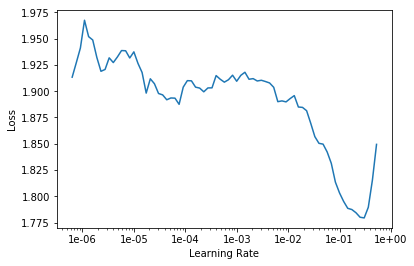
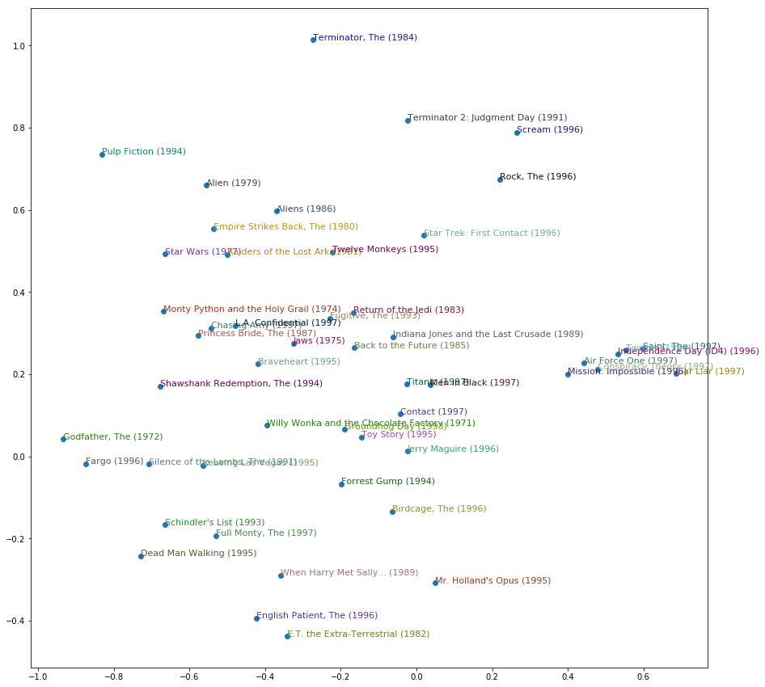

<h1>Table of Contents<span class="tocSkip"></span></h1>
<div class="toc"><ul class="toc-item"><li><ul class="toc-item"><li><ul class="toc-item"><li><span><a href="#所需library" data-toc-modified-id="所需library-0.0.1"><span class="toc-item-num">0.0.1&nbsp;&nbsp;</span>所需library</a></span></li></ul></li></ul></li><li><span><a href="#Collaborative-filtering-example" data-toc-modified-id="Collaborative-filtering-example-1"><span class="toc-item-num">1&nbsp;&nbsp;</span>Collaborative filtering example</a></span><ul class="toc-item"><li><ul class="toc-item"><li><span><a href="#核心数据名称" data-toc-modified-id="核心数据名称-1.0.1"><span class="toc-item-num">1.0.1&nbsp;&nbsp;</span>核心数据名称</a></span></li><li><span><a href="#下载数据" data-toc-modified-id="下载数据-1.0.2"><span class="toc-item-num">1.0.2&nbsp;&nbsp;</span>下载数据</a></span></li><li><span><a href="#查看CSV" data-toc-modified-id="查看CSV-1.0.3"><span class="toc-item-num">1.0.3&nbsp;&nbsp;</span>查看CSV</a></span></li><li><span><a href="#生成CollabDataBunch" data-toc-modified-id="生成CollabDataBunch-1.0.4"><span class="toc-item-num">1.0.4&nbsp;&nbsp;</span>生成CollabDataBunch</a></span></li><li><span><a href="#设置y的区间，创建collab-learner" data-toc-modified-id="设置y的区间，创建collab-learner-1.0.5"><span class="toc-item-num">1.0.5&nbsp;&nbsp;</span>设置y的区间，创建collab learner</a></span></li><li><span><a href="#用lr=5e-3训练" data-toc-modified-id="用lr=5e-3训练-1.0.6"><span class="toc-item-num">1.0.6&nbsp;&nbsp;</span>用lr=5e-3训练</a></span></li></ul></li></ul></li><li><span><a href="#Movielens-100k" data-toc-modified-id="Movielens-100k-2"><span class="toc-item-num">2&nbsp;&nbsp;</span>Movielens 100k</a></span><ul class="toc-item"><li><ul class="toc-item"><li><span><a href="#下载完整Movielens-100k数据集" data-toc-modified-id="下载完整Movielens-100k数据集-2.0.1"><span class="toc-item-num">2.0.1&nbsp;&nbsp;</span>下载完整Movielens 100k数据集</a></span></li><li><span><a href="#调取数据，查看CSV" data-toc-modified-id="调取数据，查看CSV-2.0.2"><span class="toc-item-num">2.0.2&nbsp;&nbsp;</span>调取数据，查看CSV</a></span></li><li><span><a href="#调取rating数据" data-toc-modified-id="调取rating数据-2.0.3"><span class="toc-item-num">2.0.3&nbsp;&nbsp;</span>调取rating数据</a></span></li><li><span><a href="#调取电影数据" data-toc-modified-id="调取电影数据-2.0.4"><span class="toc-item-num">2.0.4&nbsp;&nbsp;</span>调取电影数据</a></span></li><li><span><a href="#将rating和电影数据合并" data-toc-modified-id="将rating和电影数据合并-2.0.5"><span class="toc-item-num">2.0.5&nbsp;&nbsp;</span>将rating和电影数据合并</a></span></li><li><span><a href="#从合并的df中创建CollabDataBunch" data-toc-modified-id="从合并的df中创建CollabDataBunch-2.0.6"><span class="toc-item-num">2.0.6&nbsp;&nbsp;</span>从合并的df中创建CollabDataBunch</a></span></li><li><span><a href="#构建collab_learner" data-toc-modified-id="构建collab_learner-2.0.7"><span class="toc-item-num">2.0.7&nbsp;&nbsp;</span>构建collab_learner</a></span></li><li><span><a href="#寻找学习率，作图，选择最优值" data-toc-modified-id="寻找学习率，作图，选择最优值-2.0.8"><span class="toc-item-num">2.0.8&nbsp;&nbsp;</span>寻找学习率，作图，选择最优值</a></span></li><li><span><a href="#训练，保存" data-toc-modified-id="训练，保存-2.0.9"><span class="toc-item-num">2.0.9&nbsp;&nbsp;</span>训练，保存</a></span></li></ul></li></ul></li><li><span><a href="#Interpretation-解读模型效果" data-toc-modified-id="Interpretation-解读模型效果-3"><span class="toc-item-num">3&nbsp;&nbsp;</span>Interpretation 解读模型效果</a></span><ul class="toc-item"><li><span><a href="#Setup" data-toc-modified-id="Setup-3.1"><span class="toc-item-num">3.1&nbsp;&nbsp;</span>Setup</a></span><ul class="toc-item"><li><span><a href="#加载模型" data-toc-modified-id="加载模型-3.1.1"><span class="toc-item-num">3.1.1&nbsp;&nbsp;</span>加载模型</a></span></li><li><span><a href="#获取每部影片的点评数量" data-toc-modified-id="获取每部影片的点评数量-3.1.2"><span class="toc-item-num">3.1.2&nbsp;&nbsp;</span>获取每部影片的点评数量</a></span></li><li><span><a href="#从多到少排列前1000部电影，展示最高的10部" data-toc-modified-id="从多到少排列前1000部电影，展示最高的10部-3.1.3"><span class="toc-item-num">3.1.3&nbsp;&nbsp;</span>从多到少排列前1000部电影，展示最高的10部</a></span></li></ul></li><li><span><a href="#Movie-bias" data-toc-modified-id="Movie-bias-3.2"><span class="toc-item-num">3.2&nbsp;&nbsp;</span>Movie bias</a></span><ul class="toc-item"><li><span><a href="#如何获取movie-bias" data-toc-modified-id="如何获取movie-bias-3.2.1"><span class="toc-item-num">3.2.1&nbsp;&nbsp;</span>如何获取movie bias</a></span></li><li><span><a href="#对每部电影评分取均值" data-toc-modified-id="对每部电影评分取均值-3.2.2"><span class="toc-item-num">3.2.2&nbsp;&nbsp;</span>对每部电影评分取均值</a></span></li><li><span><a href="#将movie_bias,-title,-和评分均值排在一起" data-toc-modified-id="将movie_bias,-title,-和评分均值排在一起-3.2.3"><span class="toc-item-num">3.2.3&nbsp;&nbsp;</span>将movie_bias, title, 和评分均值排在一起</a></span></li><li><span><a href="#将电影按movie_bias高低排列，从高到低，从低到高" data-toc-modified-id="将电影按movie_bias高低排列，从高到低，从低到高-3.2.4"><span class="toc-item-num">3.2.4&nbsp;&nbsp;</span>将电影按movie_bias高低排列，从高到低，从低到高</a></span></li></ul></li><li><span><a href="#Movie-weights" data-toc-modified-id="Movie-weights-3.3"><span class="toc-item-num">3.3&nbsp;&nbsp;</span>Movie weights</a></span><ul class="toc-item"><li><span><a href="#获取电影权重参数" data-toc-modified-id="获取电影权重参数-3.3.1"><span class="toc-item-num">3.3.1&nbsp;&nbsp;</span>获取电影权重参数</a></span></li><li><span><a href="#对电影参数matrix取PCA前3个特征值" data-toc-modified-id="对电影参数matrix取PCA前3个特征值-3.3.2"><span class="toc-item-num">3.3.2&nbsp;&nbsp;</span>对电影参数matrix取PCA前3个特征值</a></span></li><li><span><a href="#将每部电影和它的第一特征值排在一起" data-toc-modified-id="将每部电影和它的第一特征值排在一起-3.3.3"><span class="toc-item-num">3.3.3&nbsp;&nbsp;</span>将每部电影和它的第一特征值排在一起</a></span></li><li><span><a href="#按第一特征值高低排序，从高到低，从低到高" data-toc-modified-id="按第一特征值高低排序，从高到低，从低到高-3.3.4"><span class="toc-item-num">3.3.4&nbsp;&nbsp;</span>按第一特征值高低排序，从高到低，从低到高</a></span></li><li><span><a href="#同样方法，套用第二特征" data-toc-modified-id="同样方法，套用第二特征-3.3.5"><span class="toc-item-num">3.3.5&nbsp;&nbsp;</span>同样方法，套用第二特征</a></span></li><li><span><a href="#根据第一第三特征值的高低，将电影在平面上排列出来" data-toc-modified-id="根据第一第三特征值的高低，将电影在平面上排列出来-3.3.6"><span class="toc-item-num">3.3.6&nbsp;&nbsp;</span>根据第一第三特征值的高低，将电影在平面上排列出来</a></span></li></ul></li></ul></li></ul></div>

#### 所需library


```python
from fastai.collab import *
from fastai.tabular import *
```

## Collaborative filtering example

#### 核心数据名称

`collab` models use data in a `DataFrame` of user, items, and ratings.


```python
user,item,title = 'userId','movieId','title'
```

#### 下载数据


```python
path = untar_data(URLs.ML_SAMPLE)
path
```


    PosixPath('/home/ubuntu/.fastai/data/movie_lens_sample')


#### 查看CSV


```python
ratings = pd.read_csv(path/'ratings.csv')
ratings.head()
```


<div>
<style scoped>
    .dataframe tbody tr th:only-of-type {
        vertical-align: middle;
    }

    .dataframe tbody tr th {
        vertical-align: top;
    }

    .dataframe thead th {
        text-align: right;
    }
</style>
<table border="1" class="dataframe">
  <thead>
    <tr style="text-align: right;">
      <th></th>
      <th>userId</th>
      <th>movieId</th>
      <th>rating</th>
      <th>timestamp</th>
    </tr>
  </thead>
  <tbody>
    <tr>
      <th>0</th>
      <td>73</td>
      <td>1097</td>
      <td>4.0</td>
      <td>1255504951</td>
    </tr>
    <tr>
      <th>1</th>
      <td>561</td>
      <td>924</td>
      <td>3.5</td>
      <td>1172695223</td>
    </tr>
    <tr>
      <th>2</th>
      <td>157</td>
      <td>260</td>
      <td>3.5</td>
      <td>1291598691</td>
    </tr>
    <tr>
      <th>3</th>
      <td>358</td>
      <td>1210</td>
      <td>5.0</td>
      <td>957481884</td>
    </tr>
    <tr>
      <th>4</th>
      <td>130</td>
      <td>316</td>
      <td>2.0</td>
      <td>1138999234</td>
    </tr>
  </tbody>
</table>
</div>


#### 生成CollabDataBunch

That's all we need to create and train a model:


```python
data = CollabDataBunch.from_df(ratings, seed=42)
```

#### 设置y的区间，创建collab learner


```python
y_range = [0,5.5]
```


```python
learn = collab_learner(data, n_factors=50, y_range=y_range)
```

#### 用lr=5e-3训练


```python
learn.fit_one_cycle(3, 5e-3)
```


Total time: 00:03 <p><table style='width:300px; margin-bottom:10px'>
  <tr>
    <th>epoch</th>
    <th>train_loss</th>
    <th>valid_loss</th>
  </tr>
  <tr>
    <th>1</th>
    <th>1.629454</th>
    <th>0.982241</th>
  </tr>
  <tr>
    <th>2</th>
    <th>0.856353</th>
    <th>0.678751</th>
  </tr>
  <tr>
    <th>3</th>
    <th>0.655987</th>
    <th>0.669647</th>
  </tr>
</table>


## Movielens 100k

#### 下载完整Movielens 100k数据集

Let's try with the full Movielens 100k data dataset, available from http://files.grouplens.org/datasets/movielens/ml-100k.zip

#### 调取数据，查看CSV


```python
path=Config.data_path()/'ml-100k'
```

#### 调取rating数据


```python
ratings = pd.read_csv(path/'u.data', delimiter='\t', header=None,
                      names=[user,item,'rating','timestamp'])
ratings.head()
```


<div>
<style scoped>
    .dataframe tbody tr th:only-of-type {
        vertical-align: middle;
    }

    .dataframe tbody tr th {
        vertical-align: top;
    }

    .dataframe thead th {
        text-align: right;
    }
</style>
<table border="1" class="dataframe">
  <thead>
    <tr style="text-align: right;">
      <th></th>
      <th>userId</th>
      <th>movieId</th>
      <th>rating</th>
      <th>timestamp</th>
    </tr>
  </thead>
  <tbody>
    <tr>
      <th>0</th>
      <td>196</td>
      <td>242</td>
      <td>3</td>
      <td>881250949</td>
    </tr>
    <tr>
      <th>1</th>
      <td>186</td>
      <td>302</td>
      <td>3</td>
      <td>891717742</td>
    </tr>
    <tr>
      <th>2</th>
      <td>22</td>
      <td>377</td>
      <td>1</td>
      <td>878887116</td>
    </tr>
    <tr>
      <th>3</th>
      <td>244</td>
      <td>51</td>
      <td>2</td>
      <td>880606923</td>
    </tr>
    <tr>
      <th>4</th>
      <td>166</td>
      <td>346</td>
      <td>1</td>
      <td>886397596</td>
    </tr>
  </tbody>
</table>
</div>


#### 调取电影数据


```python
movies = pd.read_csv(path/'u.item',  delimiter='|', encoding='latin-1', header=None,
                    names=[item, 'title', 'date', 'N', 'url', *[f'g{i}' for i in range(19)]])
movies.head()
```


<div>
<style scoped>
    .dataframe tbody tr th:only-of-type {
        vertical-align: middle;
    }

    .dataframe tbody tr th {
        vertical-align: top;
    }

    .dataframe thead th {
        text-align: right;
    }
</style>
<table border="1" class="dataframe">
  <thead>
    <tr style="text-align: right;">
      <th></th>
      <th>movieId</th>
      <th>title</th>
      <th>date</th>
      <th>N</th>
      <th>url</th>
      <th>g0</th>
      <th>g1</th>
      <th>g2</th>
      <th>g3</th>
      <th>g4</th>
      <th>...</th>
      <th>g9</th>
      <th>g10</th>
      <th>g11</th>
      <th>g12</th>
      <th>g13</th>
      <th>g14</th>
      <th>g15</th>
      <th>g16</th>
      <th>g17</th>
      <th>g18</th>
    </tr>
  </thead>
  <tbody>
    <tr>
      <th>0</th>
      <td>1</td>
      <td>Toy Story (1995)</td>
      <td>01-Jan-1995</td>
      <td>NaN</td>
      <td>http://us.imdb.com/M/title-exact?Toy%20Story%2...</td>
      <td>0</td>
      <td>0</td>
      <td>0</td>
      <td>1</td>
      <td>1</td>
      <td>...</td>
      <td>0</td>
      <td>0</td>
      <td>0</td>
      <td>0</td>
      <td>0</td>
      <td>0</td>
      <td>0</td>
      <td>0</td>
      <td>0</td>
      <td>0</td>
    </tr>
    <tr>
      <th>1</th>
      <td>2</td>
      <td>GoldenEye (1995)</td>
      <td>01-Jan-1995</td>
      <td>NaN</td>
      <td>http://us.imdb.com/M/title-exact?GoldenEye%20(...</td>
      <td>0</td>
      <td>1</td>
      <td>1</td>
      <td>0</td>
      <td>0</td>
      <td>...</td>
      <td>0</td>
      <td>0</td>
      <td>0</td>
      <td>0</td>
      <td>0</td>
      <td>0</td>
      <td>0</td>
      <td>1</td>
      <td>0</td>
      <td>0</td>
    </tr>
    <tr>
      <th>2</th>
      <td>3</td>
      <td>Four Rooms (1995)</td>
      <td>01-Jan-1995</td>
      <td>NaN</td>
      <td>http://us.imdb.com/M/title-exact?Four%20Rooms%...</td>
      <td>0</td>
      <td>0</td>
      <td>0</td>
      <td>0</td>
      <td>0</td>
      <td>...</td>
      <td>0</td>
      <td>0</td>
      <td>0</td>
      <td>0</td>
      <td>0</td>
      <td>0</td>
      <td>0</td>
      <td>1</td>
      <td>0</td>
      <td>0</td>
    </tr>
    <tr>
      <th>3</th>
      <td>4</td>
      <td>Get Shorty (1995)</td>
      <td>01-Jan-1995</td>
      <td>NaN</td>
      <td>http://us.imdb.com/M/title-exact?Get%20Shorty%...</td>
      <td>0</td>
      <td>1</td>
      <td>0</td>
      <td>0</td>
      <td>0</td>
      <td>...</td>
      <td>0</td>
      <td>0</td>
      <td>0</td>
      <td>0</td>
      <td>0</td>
      <td>0</td>
      <td>0</td>
      <td>0</td>
      <td>0</td>
      <td>0</td>
    </tr>
    <tr>
      <th>4</th>
      <td>5</td>
      <td>Copycat (1995)</td>
      <td>01-Jan-1995</td>
      <td>NaN</td>
      <td>http://us.imdb.com/M/title-exact?Copycat%20(1995)</td>
      <td>0</td>
      <td>0</td>
      <td>0</td>
      <td>0</td>
      <td>0</td>
      <td>...</td>
      <td>0</td>
      <td>0</td>
      <td>0</td>
      <td>0</td>
      <td>0</td>
      <td>0</td>
      <td>0</td>
      <td>1</td>
      <td>0</td>
      <td>0</td>
    </tr>
  </tbody>
</table>
<p>5 rows × 24 columns</p>
</div>


```python
len(ratings)
```


    100000


#### 将rating和电影数据合并


```python
rating_movie = ratings.merge(movies[[item, title]])
rating_movie.head()
```


<div>
<style scoped>
    .dataframe tbody tr th:only-of-type {
        vertical-align: middle;
    }

    .dataframe tbody tr th {
        vertical-align: top;
    }

    .dataframe thead th {
        text-align: right;
    }
</style>
<table border="1" class="dataframe">
  <thead>
    <tr style="text-align: right;">
      <th></th>
      <th>userId</th>
      <th>movieId</th>
      <th>rating</th>
      <th>timestamp</th>
      <th>title</th>
    </tr>
  </thead>
  <tbody>
    <tr>
      <th>0</th>
      <td>196</td>
      <td>242</td>
      <td>3</td>
      <td>881250949</td>
      <td>Kolya (1996)</td>
    </tr>
    <tr>
      <th>1</th>
      <td>63</td>
      <td>242</td>
      <td>3</td>
      <td>875747190</td>
      <td>Kolya (1996)</td>
    </tr>
    <tr>
      <th>2</th>
      <td>226</td>
      <td>242</td>
      <td>5</td>
      <td>883888671</td>
      <td>Kolya (1996)</td>
    </tr>
    <tr>
      <th>3</th>
      <td>154</td>
      <td>242</td>
      <td>3</td>
      <td>879138235</td>
      <td>Kolya (1996)</td>
    </tr>
    <tr>
      <th>4</th>
      <td>306</td>
      <td>242</td>
      <td>5</td>
      <td>876503793</td>
      <td>Kolya (1996)</td>
    </tr>
  </tbody>
</table>
</div>


#### 从合并的df中创建CollabDataBunch


```python
data = CollabDataBunch.from_df(rating_movie, seed=42, valid_pct=0.1, item_name=title)
```


```python
data.show_batch()
```


<table>  <col width='10%'>  <col width='10%'>  <col width='10%'>  <tr>
    <th>userId</th>
    <th>title</th>
    <th>target</th>
  </tr>
  <tr>
    <th>126</th>
    <th>Event Horizon (1997)</th>
    <th>1.0</th>
  </tr>
  <tr>
    <th>44</th>
    <th>Young Frankenstein (1974)</th>
    <th>4.0</th>
  </tr>
  <tr>
    <th>718</th>
    <th>Star Trek: First Contact (1996)</th>
    <th>4.0</th>
  </tr>
  <tr>
    <th>506</th>
    <th>Magnificent Seven, The (1954)</th>
    <th>5.0</th>
  </tr>
  <tr>
    <th>373</th>
    <th>Good, The Bad and The Ugly, The (1966)</th>
    <th>3.0</th>
  </tr>
</table>


#### 构建collab_learner


```python
y_range = [0,5.5]
```


```python
learn = collab_learner(data, n_factors=40, y_range=y_range, wd=1e-1)
```

#### 寻找学习率，作图，选择最优值


```python
learn.lr_find()
learn.recorder.plot(skip_end=15)
```

    LR Finder is complete, type {learner_name}.recorder.plot() to see the graph.





#### 训练，保存


```python
learn.fit_one_cycle(5, 5e-3)
```


Total time: 00:30 <p><table style='width:300px; margin-bottom:10px'>
  <tr>
    <th>epoch</th>
    <th>train_loss</th>
    <th>valid_loss</th>
  </tr>
  <tr>
    <th>1</th>
    <th>0.923900</th>
    <th>0.946068</th>
  </tr>
  <tr>
    <th>2</th>
    <th>0.865458</th>
    <th>0.890646</th>
  </tr>
  <tr>
    <th>3</th>
    <th>0.783896</th>
    <th>0.836753</th>
  </tr>
  <tr>
    <th>4</th>
    <th>0.638374</th>
    <th>0.815428</th>
  </tr>
  <tr>
    <th>5</th>
    <th>0.561979</th>
    <th>0.814652</th>
  </tr>
</table>


```python
learn.save('dotprod')
```

Here's [some benchmarks](https://www.librec.net/release/v1.3/example.html) on the same dataset for the popular Librec system for collaborative filtering. They show best results based on RMSE of 0.91, which corresponds to an MSE of `0.91**2 = 0.83`.

## Interpretation 解读模型效果

### Setup

#### 加载模型


```python
learn.load('dotprod');
```


```python
learn.model
```


    EmbeddingDotBias(
      (u_weight): Embedding(944, 40)
      (i_weight): Embedding(1654, 40)
      (u_bias): Embedding(944, 1)
      (i_bias): Embedding(1654, 1)
    )


#### 获取每部影片的点评数量


```python
g = rating_movie.groupby(title)['rating'].count()
```

#### 从多到少排列前1000部电影，展示最高的10部


```python
top_movies = g.sort_values(ascending=False).index.values[:1000]
top_movies[:10]
```


    array(['Star Wars (1977)', 'Contact (1997)', 'Fargo (1996)', 'Return of the Jedi (1983)', 'Liar Liar (1997)',
           'English Patient, The (1996)', 'Scream (1996)', 'Toy Story (1995)', 'Air Force One (1997)',
           'Independence Day (ID4) (1996)'], dtype=object)


### Movie bias

#### 如何获取movie bias


```python
movie_bias = learn.bias(top_movies, is_item=True)
movie_bias.shape
```


    torch.Size([1000])


#### 对每部电影评分取均值


```python
mean_ratings = rating_movie.groupby(title)['rating'].mean()
```

#### 将movie_bias, title, 和评分均值排在一起


```python
movie_ratings = [(b, i, mean_ratings.loc[i]) for i,b in zip(top_movies,movie_bias)]
```

#### 将电影按movie_bias高低排列，从高到低，从低到高


```python
item0 = lambda o:o[0]
```


```python
sorted(movie_ratings, key=item0)[:15]
```


    [(tensor(-0.3667),
      'Children of the Corn: The Gathering (1996)',
      1.3157894736842106),
     (tensor(-0.3142),
      'Lawnmower Man 2: Beyond Cyberspace (1996)',
      1.7142857142857142),
     (tensor(-0.2926), 'Mortal Kombat: Annihilation (1997)', 1.9534883720930232),
     (tensor(-0.2708), 'Cable Guy, The (1996)', 2.339622641509434),
     (tensor(-0.2669), 'Striptease (1996)', 2.2388059701492535),
     (tensor(-0.2641), 'Free Willy 3: The Rescue (1997)', 1.7407407407407407),
     (tensor(-0.2511), 'Beautician and the Beast, The (1997)', 2.313953488372093),
     (tensor(-0.2418), 'Bio-Dome (1996)', 1.903225806451613),
     (tensor(-0.2345), "Joe's Apartment (1996)", 2.2444444444444445),
     (tensor(-0.2324), 'Island of Dr. Moreau, The (1996)', 2.1578947368421053),
     (tensor(-0.2266), 'Barb Wire (1996)', 1.9333333333333333),
     (tensor(-0.2219), 'Crow: City of Angels, The (1996)', 1.9487179487179487),
     (tensor(-0.2208), 'Grease 2 (1982)', 2.0),
     (tensor(-0.2151), 'Home Alone 3 (1997)', 1.894736842105263),
     (tensor(-0.2089), "McHale's Navy (1997)", 2.1884057971014492)]


```python
sorted(movie_ratings, key=lambda o: o[0], reverse=True)[:15]
```


    [(tensor(0.5913), "Schindler's List (1993)", 4.466442953020135),
     (tensor(0.5700), 'Titanic (1997)', 4.2457142857142856),
     (tensor(0.5623), 'Shawshank Redemption, The (1994)', 4.445229681978798),
     (tensor(0.5412), 'L.A. Confidential (1997)', 4.161616161616162),
     (tensor(0.5368), 'Rear Window (1954)', 4.3875598086124405),
     (tensor(0.5193), 'Star Wars (1977)', 4.3584905660377355),
     (tensor(0.5149), 'As Good As It Gets (1997)', 4.196428571428571),
     (tensor(0.5114), 'Silence of the Lambs, The (1991)', 4.28974358974359),
     (tensor(0.5097), 'Good Will Hunting (1997)', 4.262626262626263),
     (tensor(0.4946), 'Vertigo (1958)', 4.251396648044692),
     (tensor(0.4899), 'Godfather, The (1972)', 4.283292978208232),
     (tensor(0.4855), 'Boot, Das (1981)', 4.203980099502488),
     (tensor(0.4769), 'Usual Suspects, The (1995)', 4.385767790262173),
     (tensor(0.4743), 'Casablanca (1942)', 4.45679012345679),
     (tensor(0.4665), 'Close Shave, A (1995)', 4.491071428571429)]


### Movie weights

#### 获取电影权重参数


```python
movie_w = learn.weight(top_movies, is_item=True)
movie_w.shape
```


    torch.Size([1000, 40])


#### 对电影参数matrix取PCA前3个特征值


```python
movie_pca = movie_w.pca(3)
movie_pca.shape
```


    torch.Size([1000, 3])


#### 将每部电影和它的第一特征值排在一起


```python
fac0,fac1,fac2 = movie_pca.t()
movie_comp = [(f, i) for f,i in zip(fac0, top_movies)]
```

#### 按第一特征值高低排序，从高到低，从低到高


```python
sorted(movie_comp, key=itemgetter(0), reverse=True)[:10]
```


    [(tensor(1.2412), 'Home Alone 3 (1997)'),
     (tensor(1.2072), 'Jungle2Jungle (1997)'),
     (tensor(1.2000), 'Bio-Dome (1996)'),
     (tensor(1.1883), 'Leave It to Beaver (1997)'),
     (tensor(1.1570), 'Children of the Corn: The Gathering (1996)'),
     (tensor(1.1309), "McHale's Navy (1997)"),
     (tensor(1.1187), 'D3: The Mighty Ducks (1996)'),
     (tensor(1.0956), 'Congo (1995)'),
     (tensor(1.0950), 'Free Willy 3: The Rescue (1997)'),
     (tensor(1.0524), 'Cutthroat Island (1995)')]


```python
sorted(movie_comp, key=itemgetter(0))[:10]
```


    [(tensor(-1.0692), 'Casablanca (1942)'),
     (tensor(-1.0523), 'Close Shave, A (1995)'),
     (tensor(-1.0142), 'When We Were Kings (1996)'),
     (tensor(-1.0075), 'Lawrence of Arabia (1962)'),
     (tensor(-1.0034), 'Wrong Trousers, The (1993)'),
     (tensor(-0.9905), 'Chinatown (1974)'),
     (tensor(-0.9692), 'Ran (1985)'),
     (tensor(-0.9541), 'Apocalypse Now (1979)'),
     (tensor(-0.9523), 'Wallace & Gromit: The Best of Aardman Animation (1996)'),
     (tensor(-0.9369), 'Some Folks Call It a Sling Blade (1993)')]


#### 同样方法，套用第二特征


```python
movie_comp = [(f, i) for f,i in zip(fac1, top_movies)]
```


```python
sorted(movie_comp, key=itemgetter(0), reverse=True)[:10]
```


    [(tensor(0.8788), 'Ready to Wear (Pret-A-Porter) (1994)'),
     (tensor(0.8263), 'Keys to Tulsa (1997)'),
     (tensor(0.8066), 'Nosferatu (Nosferatu, eine Symphonie des Grauens) (1922)'),
     (tensor(0.7730), 'Dead Man (1995)'),
     (tensor(0.7513), 'Three Colors: Blue (1993)'),
     (tensor(0.7492), 'Trainspotting (1996)'),
     (tensor(0.7414), 'Cable Guy, The (1996)'),
     (tensor(0.7330), 'Jude (1996)'),
     (tensor(0.7246), 'Clockwork Orange, A (1971)'),
     (tensor(0.7195), 'Stupids, The (1996)')]


```python
sorted(movie_comp, key=itemgetter(0))[:10]
```


    [(tensor(-1.2148), 'Braveheart (1995)'),
     (tensor(-1.1153), 'Titanic (1997)'),
     (tensor(-1.1148), 'Raiders of the Lost Ark (1981)'),
     (tensor(-0.8795), "It's a Wonderful Life (1946)"),
     (tensor(-0.8644), "Mr. Holland's Opus (1995)"),
     (tensor(-0.8619), 'Star Wars (1977)'),
     (tensor(-0.8558), 'Return of the Jedi (1983)'),
     (tensor(-0.8526), 'Pretty Woman (1990)'),
     (tensor(-0.8453), 'Independence Day (ID4) (1996)'),
     (tensor(-0.8450), 'Forrest Gump (1994)')]


#### 根据第一第三特征值的高低，将电影在平面上排列出来


```python
idxs = np.random.choice(len(top_movies), 50, replace=False)
idxs = list(range(50))
X = fac0[idxs]
Y = fac2[idxs]
plt.figure(figsize=(15,15))
plt.scatter(X, Y)
for i, x, y in zip(top_movies[idxs], X, Y):
    plt.text(x,y,i, color=np.random.rand(3)*0.7, fontsize=11)
plt.show()
```




