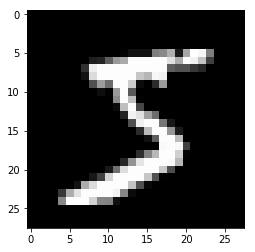
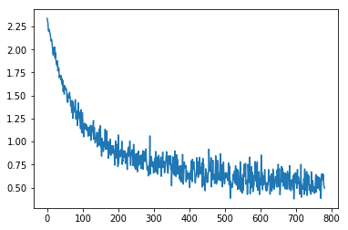
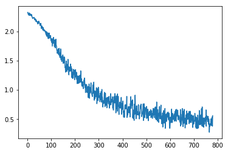
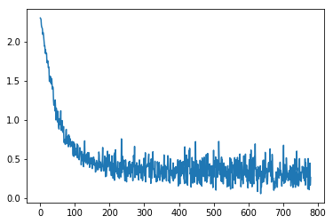
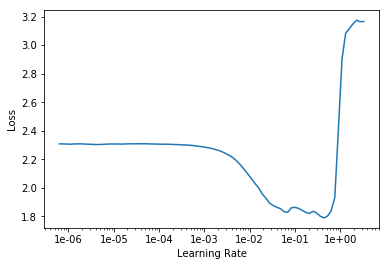
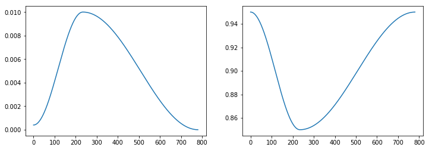
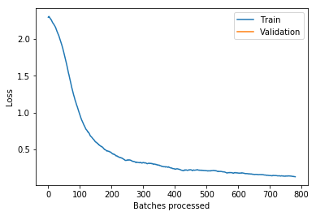

<h1>Table of Contents<span class="tocSkip"></span></h1>
<div class="toc"><ul class="toc-item"><li><ul class="toc-item"><li><ul class="toc-item"><li><span><a href="#所需library" data-toc-modified-id="所需library-0.0.1"><span class="toc-item-num">0.0.1&nbsp;&nbsp;</span>所需library</a></span></li></ul></li></ul></li><li><span><a href="#MNIST-SGD" data-toc-modified-id="MNIST-SGD-1"><span class="toc-item-num">1&nbsp;&nbsp;</span>MNIST SGD</a></span><ul class="toc-item"><li><ul class="toc-item"><li><span><a href="#点击下载数据集" data-toc-modified-id="点击下载数据集-1.0.1"><span class="toc-item-num">1.0.1&nbsp;&nbsp;</span>点击下载数据集</a></span></li><li><span><a href="#查看数据文件夹" data-toc-modified-id="查看数据文件夹-1.0.2"><span class="toc-item-num">1.0.2&nbsp;&nbsp;</span>查看数据文件夹</a></span></li><li><span><a href="#解压pkl数据包" data-toc-modified-id="解压pkl数据包-1.0.3"><span class="toc-item-num">1.0.3&nbsp;&nbsp;</span>解压pkl数据包</a></span></li><li><span><a href="#展示图片和训练数据shape" data-toc-modified-id="展示图片和训练数据shape-1.0.4"><span class="toc-item-num">1.0.4&nbsp;&nbsp;</span>展示图片和训练数据shape</a></span></li><li><span><a href="#将训练和验证数据转化为torch.tensor" data-toc-modified-id="将训练和验证数据转化为torch.tensor-1.0.5"><span class="toc-item-num">1.0.5&nbsp;&nbsp;</span>将训练和验证数据转化为torch.tensor</a></span></li><li><span><a href="#将X与Y(torch.tensor)整合成TensorDataset" data-toc-modified-id="将X与Y(torch.tensor)整合成TensorDataset-1.0.6"><span class="toc-item-num">1.0.6&nbsp;&nbsp;</span>将X与Y(torch.tensor)整合成TensorDataset</a></span></li><li><span><a href="#将训练和验证集的TensorDataset-整合成DataBunch" data-toc-modified-id="将训练和验证集的TensorDataset-整合成DataBunch-1.0.7"><span class="toc-item-num">1.0.7&nbsp;&nbsp;</span>将训练和验证集的TensorDataset 整合成DataBunch</a></span></li><li><span><a href="#从训练集DataBunch中一个一个提取数据点" data-toc-modified-id="从训练集DataBunch中一个一个提取数据点-1.0.8"><span class="toc-item-num">1.0.8&nbsp;&nbsp;</span>从训练集DataBunch中一个一个提取数据点</a></span></li><li><span><a href="#创建模型的正向传递部分" data-toc-modified-id="创建模型的正向传递部分-1.0.9"><span class="toc-item-num">1.0.9&nbsp;&nbsp;</span>创建模型的正向传递部分</a></span></li><li><span><a href="#启用GPU机制" data-toc-modified-id="启用GPU机制-1.0.10"><span class="toc-item-num">1.0.10&nbsp;&nbsp;</span>启用GPU机制</a></span></li><li><span><a href="#查看模型" data-toc-modified-id="查看模型-1.0.11"><span class="toc-item-num">1.0.11&nbsp;&nbsp;</span>查看模型</a></span></li><li><span><a href="#调用模型中的lin层" data-toc-modified-id="调用模型中的lin层-1.0.12"><span class="toc-item-num">1.0.12&nbsp;&nbsp;</span>调用模型中的lin层</a></span></li><li><span><a href="#模型输出值的shape" data-toc-modified-id="模型输出值的shape-1.0.13"><span class="toc-item-num">1.0.13&nbsp;&nbsp;</span>模型输出值的shape</a></span></li><li><span><a href="#调取模型每一层的参数，查看shape" data-toc-modified-id="调取模型每一层的参数，查看shape-1.0.14"><span class="toc-item-num">1.0.14&nbsp;&nbsp;</span>调取模型每一层的参数，查看shape</a></span></li><li><span><a href="#设置学习率" data-toc-modified-id="设置学习率-1.0.15"><span class="toc-item-num">1.0.15&nbsp;&nbsp;</span>设置学习率</a></span></li><li><span><a href="#调用分类问题损失函数" data-toc-modified-id="调用分类问题损失函数-1.0.16"><span class="toc-item-num">1.0.16&nbsp;&nbsp;</span>调用分类问题损失函数</a></span></li><li><span><a href="#一次正向反向传递计算函数详解" data-toc-modified-id="一次正向反向传递计算函数详解-1.0.17"><span class="toc-item-num">1.0.17&nbsp;&nbsp;</span>一次正向反向传递计算函数详解</a></span></li><li><span><a href="#对训练集中每一个数据点做一次正反向传递（即SGD），收集损失值" data-toc-modified-id="对训练集中每一个数据点做一次正反向传递（即SGD），收集损失值-1.0.18"><span class="toc-item-num">1.0.18&nbsp;&nbsp;</span>对训练集中每一个数据点做一次正反向传递（即SGD），收集损失值</a></span></li><li><span><a href="#将损失值作图" data-toc-modified-id="将损失值作图-1.0.19"><span class="toc-item-num">1.0.19&nbsp;&nbsp;</span>将损失值作图</a></span></li><li><span><a href="#构建一个2层模型，第一层含非线性激活函数ReLU" data-toc-modified-id="构建一个2层模型，第一层含非线性激活函数ReLU-1.0.20"><span class="toc-item-num">1.0.20&nbsp;&nbsp;</span>构建一个2层模型，第一层含非线性激活函数ReLU</a></span></li><li><span><a href="#开启GPU设置" data-toc-modified-id="开启GPU设置-1.0.21"><span class="toc-item-num">1.0.21&nbsp;&nbsp;</span>开启GPU设置</a></span></li><li><span><a href="#用SGD计算获取训练集的损失值，并作图" data-toc-modified-id="用SGD计算获取训练集的损失值，并作图-1.0.22"><span class="toc-item-num">1.0.22&nbsp;&nbsp;</span>用SGD计算获取训练集的损失值，并作图</a></span></li><li><span><a href="#再次开启模型的GPU计算模式" data-toc-modified-id="再次开启模型的GPU计算模式-1.0.23"><span class="toc-item-num">1.0.23&nbsp;&nbsp;</span>再次开启模型的GPU计算模式</a></span></li><li><span><a href="#正反向传递中加入Adam优化算法和opt.step()取代手动参数更新公式" data-toc-modified-id="正反向传递中加入Adam优化算法和opt.step()取代手动参数更新公式-1.0.24"><span class="toc-item-num">1.0.24&nbsp;&nbsp;</span>正反向传递中加入Adam优化算法和opt.step()取代手动参数更新公式</a></span></li><li><span><a href="#对训练集做SGD，收集损失值，并作图" data-toc-modified-id="对训练集做SGD，收集损失值，并作图-1.0.25"><span class="toc-item-num">1.0.25&nbsp;&nbsp;</span>对训练集做SGD，收集损失值，并作图</a></span></li><li><span><a href="#采用fastai-Learner方式进行建模" data-toc-modified-id="采用fastai-Learner方式进行建模-1.0.26"><span class="toc-item-num">1.0.26&nbsp;&nbsp;</span>采用fastai Learner方式进行建模</a></span></li><li><span><a href="#作图寻找学习率最优值" data-toc-modified-id="作图寻找学习率最优值-1.0.27"><span class="toc-item-num">1.0.27&nbsp;&nbsp;</span>作图寻找学习率最优值</a></span></li><li><span><a href="#挑选最优值学习率，进行训练" data-toc-modified-id="挑选最优值学习率，进行训练-1.0.28"><span class="toc-item-num">1.0.28&nbsp;&nbsp;</span>挑选最优值学习率，进行训练</a></span></li><li><span><a href="#画出学习率和momentum图" data-toc-modified-id="画出学习率和momentum图-1.0.29"><span class="toc-item-num">1.0.29&nbsp;&nbsp;</span>画出学习率和momentum图</a></span></li><li><span><a href="#画出损失值（训练vs验证）图" data-toc-modified-id="画出损失值（训练vs验证）图-1.0.30"><span class="toc-item-num">1.0.30&nbsp;&nbsp;</span>画出损失值（训练vs验证）图</a></span></li></ul></li></ul></li></ul></div>

#### 所需library


```python
%matplotlib inline
from fastai.basics import *
```

## MNIST SGD

#### 点击下载数据集

Get the 'pickled' MNIST dataset from http://deeplearning.net/data/mnist/mnist.pkl.gz. We're going to treat it as a standard flat dataset with fully connected layers, rather than using a CNN.

#### 查看数据文件夹


```python
path = Config().data_path()/'mnist'
```


```python
path.ls()
```


    [PosixPath('/home/ubuntu/.fastai/data/mnist/mnist.pkl.gz')]


#### 解压pkl数据包


```python
with gzip.open(path/'mnist.pkl.gz', 'rb') as f:
    ((x_train, y_train), (x_valid, y_valid), _) = pickle.load(f, encoding='latin-1')
```

#### 展示图片和训练数据shape


```python
plt.imshow(x_train[0].reshape((28,28)), cmap="gray")
x_train.shape
```


    (50000, 784)





#### 将训练和验证数据转化为torch.tensor


```python
x_train,y_train,x_valid,y_valid = map(torch.tensor, (x_train,y_train,x_valid,y_valid))
n,c = x_train.shape
x_train.shape, y_train.min(), y_train.max()
```


    (torch.Size([50000, 784]), tensor(0), tensor(9))


In lesson2-sgd we did these things ourselves:

```python
x = torch.ones(n,2) 
def mse(y_hat, y): return ((y_hat-y)**2).mean()
y_hat = x@a
```

Now instead we'll use PyTorch's functions to do it for us, and also to handle mini-batches (which we didn't do last time, since our dataset was so small).

#### 将X与Y(torch.tensor)整合成TensorDataset


```python
bs=64
train_ds = TensorDataset(x_train, y_train)
valid_ds = TensorDataset(x_valid, y_valid)
```

#### 将训练和验证集的TensorDataset 整合成DataBunch


```python
data = DataBunch.create(train_ds, valid_ds, bs=bs)
```

#### 从训练集DataBunch中一个一个提取数据点


```python
x,y = next(iter(data.train_dl))
x.shape,y.shape
```


    (torch.Size([64, 784]), torch.Size([64]))


#### 创建模型的正向传递部分


```python
class Mnist_Logistic(nn.Module):
    def __init__(self):
        super().__init__()
        self.lin = nn.Linear(784, 10, bias=True)

    def forward(self, xb): return self.lin(xb)
```

#### 启用GPU机制


```python
model = Mnist_Logistic().cuda()
```

#### 查看模型


```python
model
```


    Mnist_Logistic(
      (lin): Linear(in_features=784, out_features=10, bias=True)
    )


#### 调用模型中的lin层


```python
model.lin
```


    Linear(in_features=784, out_features=10, bias=True)


#### 模型输出值的shape


```python
model(x).shape
```


    torch.Size([64, 10])


#### 调取模型每一层的参数，查看shape


```python
[p.shape for p in model.parameters()]
```


    [torch.Size([10, 784]), torch.Size([10])]


#### 设置学习率


```python
lr=2e-2
```

#### 调用分类问题损失函数


```python
loss_func = nn.CrossEntropyLoss()
```

#### 一次正向反向传递计算函数详解


```python
def update(x,y,lr):
    wd = 1e-5
    y_hat = model(x)
    # 设置 weight decay
    w2 = 0.
    # 计算 weight decay
    for p in model.parameters(): w2 += (p**2).sum()
    # 将 weight decay 添加到 常规损失值公式中
    loss = loss_func(y_hat, y) + w2*wd
    # 求导
    loss.backward()

    # 利用导数更新参数
    with torch.no_grad():
        for p in model.parameters():
            p.sub_(lr * p.grad)
            p.grad.zero_()
    # 输出损失值
    return loss.item()
```

#### 对训练集中每一个数据点做一次正反向传递（即SGD），收集损失值


```python
losses = [update(x,y,lr) for x,y in data.train_dl]
```

#### 将损失值作图


```python
plt.plot(losses);
```





#### 构建一个2层模型，第一层含非线性激活函数ReLU


```python
class Mnist_NN(nn.Module):
    def __init__(self):
        super().__init__()
        self.lin1 = nn.Linear(784, 50, bias=True)
        self.lin2 = nn.Linear(50, 10, bias=True)

    def forward(self, xb):
        x = self.lin1(xb)
        x = F.relu(x)
        return self.lin2(x)
```

#### 开启GPU设置


```python
model = Mnist_NN().cuda()
```

#### 用SGD计算获取训练集的损失值，并作图


```python
losses = [update(x,y,lr) for x,y in data.train_dl]
```


```python
plt.plot(losses);
```





#### 再次开启模型的GPU计算模式


```python
model = Mnist_NN().cuda()
```

#### 正反向传递中加入Adam优化算法和opt.step()取代手动参数更新公式


```python
def update(x,y,lr):
    opt = optim.Adam(model.parameters(), lr)
    y_hat = model(x)
    loss = loss_func(y_hat, y)
    loss.backward()
    opt.step()
    opt.zero_grad()
    return loss.item()
```

#### 对训练集做SGD，收集损失值，并作图


```python
losses = [update(x,y,1e-3) for x,y in data.train_dl]
```


```python
plt.plot(losses);
```





#### 采用fastai Learner方式进行建模


```python
learn = Learner(data, Mnist_NN(), loss_func=loss_func, metrics=accuracy)
```

#### 作图寻找学习率最优值


```python
learn.lr_find()
learn.recorder.plot()
```


    LR Finder is complete, type {learner_name}.recorder.plot() to see the graph.





#### 挑选最优值学习率，进行训练


```python
learn.fit_one_cycle(1, 1e-2)
```


Total time: 00:03 <p><table style='width:300px; margin-bottom:10px'>
  <tr>
    <th>epoch</th>
    <th>train_loss</th>
    <th>valid_loss</th>
    <th>accuracy</th>
  </tr>
  <tr>
    <th>1</th>
    <th>0.129131</th>
    <th>0.125927</th>
    <th>0.963500</th>
  </tr>
</table>


#### 画出学习率和momentum图


```python
learn.recorder.plot_lr(show_moms=True)
```





#### 画出损失值（训练vs验证）图


```python
learn.recorder.plot_losses()
```




