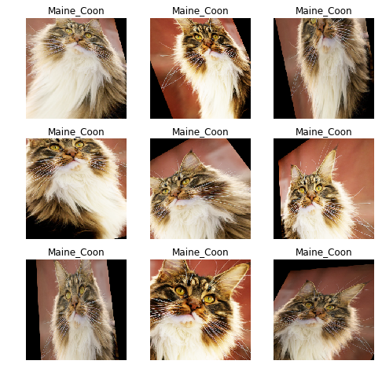
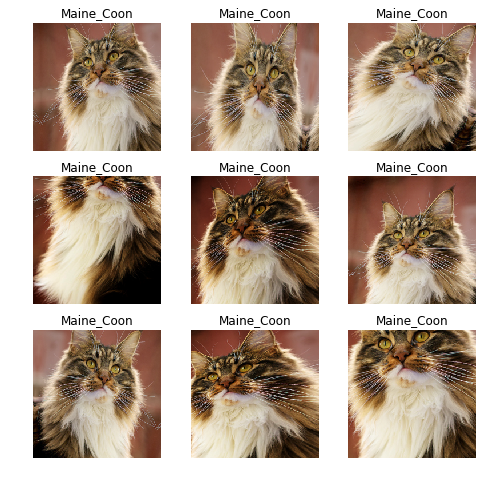
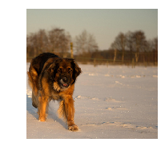
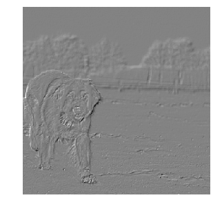
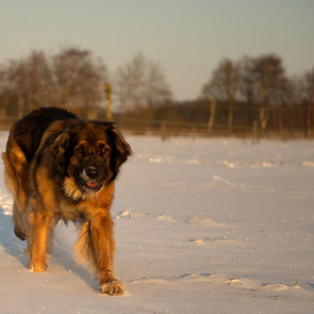
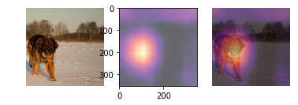

<h1>Table of Contents<span class="tocSkip"></span></h1>
<div class="toc"><ul class="toc-item"><li><span><a href="#Lesson-6:-pets-revisited" data-toc-modified-id="Lesson-6:-pets-revisited-1"><span class="toc-item-num">1&nbsp;&nbsp;</span>Lesson 6: pets revisited</a></span><ul class="toc-item"><li><ul class="toc-item"><li><ul class="toc-item"><li><span><a href="#三行魔法代码" data-toc-modified-id="三行魔法代码-1.0.0.1"><span class="toc-item-num">1.0.0.1&nbsp;&nbsp;</span>三行魔法代码</a></span></li><li><span><a href="#所需library" data-toc-modified-id="所需library-1.0.0.2"><span class="toc-item-num">1.0.0.2&nbsp;&nbsp;</span>所需library</a></span></li><li><span><a href="#一个Cell打印多项内容" data-toc-modified-id="一个Cell打印多项内容-1.0.0.3"><span class="toc-item-num">1.0.0.3&nbsp;&nbsp;</span>一个Cell打印多项内容</a></span></li><li><span><a href="#批量设置,-过大会超出Kaggle-GPU-Disk-容量" data-toc-modified-id="批量设置,-过大会超出Kaggle-GPU-Disk-容量-1.0.0.4"><span class="toc-item-num">1.0.0.4&nbsp;&nbsp;</span>批量设置, 过大会超出Kaggle GPU Disk 容量</a></span></li><li><span><a href="#提供数据，模型，图片文件地址" data-toc-modified-id="提供数据，模型，图片文件地址-1.0.0.5"><span class="toc-item-num">1.0.0.5&nbsp;&nbsp;</span>提供数据，模型，图片文件地址</a></span></li><li><span><a href="#图片变形设计" data-toc-modified-id="图片变形设计-1.0.0.6"><span class="toc-item-num">1.0.0.6&nbsp;&nbsp;</span>图片变形设计</a></span></li><li><span><a href="#将图片夹转化成ImageList" data-toc-modified-id="将图片夹转化成ImageList-1.0.0.7"><span class="toc-item-num">1.0.0.7&nbsp;&nbsp;</span>将图片夹转化成ImageList</a></span></li><li><span><a href="#refactor-DataBunch" data-toc-modified-id="refactor-DataBunch-1.0.0.8"><span class="toc-item-num">1.0.0.8&nbsp;&nbsp;</span>refactor DataBunch</a></span></li><li><span><a href="#对同一张图作画，随机出现不同的变形" data-toc-modified-id="对同一张图作画，随机出现不同的变形-1.0.0.9"><span class="toc-item-num">1.0.0.9&nbsp;&nbsp;</span>对同一张图作画，随机出现不同的变形</a></span></li><li><span><a href="#对比padding='zero'-vs-'reflection'的区别" data-toc-modified-id="对比padding='zero'-vs-'reflection'的区别-1.0.0.10"><span class="toc-item-num">1.0.0.10&nbsp;&nbsp;</span>对比padding='zero' vs 'reflection'的区别</a></span></li><li><span><a href="#如何释放内存" data-toc-modified-id="如何释放内存-1.0.0.11"><span class="toc-item-num">1.0.0.11&nbsp;&nbsp;</span>如何释放内存</a></span></li><li><span><a href="#如何创建模型并给最后一层加BN" data-toc-modified-id="如何创建模型并给最后一层加BN-1.0.0.12"><span class="toc-item-num">1.0.0.12&nbsp;&nbsp;</span>如何创建模型并给最后一层加BN</a></span></li><li><span><a href="#展示何为final-BN" data-toc-modified-id="展示何为final-BN-1.0.0.13"><span class="toc-item-num">1.0.0.13&nbsp;&nbsp;</span>展示何为final BN</a></span></li><li><span><a href="#slice(1e-2),-max_lr=slice(1e-6,1e-3)的实际用途" data-toc-modified-id="slice(1e-2),-max_lr=slice(1e-6,1e-3)的实际用途-1.0.0.14"><span class="toc-item-num">1.0.0.14&nbsp;&nbsp;</span>slice(1e-2), max_lr=slice(1e-6,1e-3)的实际用途</a></span></li><li><span><a href="#pct_start的用意" data-toc-modified-id="pct_start的用意-1.0.0.15"><span class="toc-item-num">1.0.0.15&nbsp;&nbsp;</span>pct_start的用意</a></span></li><li><span><a href="#生成链接，下载模型到本地" data-toc-modified-id="生成链接，下载模型到本地-1.0.0.16"><span class="toc-item-num">1.0.0.16&nbsp;&nbsp;</span><strong>生成链接，下载模型到本地</strong></a></span></li><li><span><a href="#fit_one_cycle-源码" data-toc-modified-id="fit_one_cycle-源码-1.0.0.17"><span class="toc-item-num">1.0.0.17&nbsp;&nbsp;</span>fit_one_cycle 源码</a></span></li><li><span><a href="#快捷调整数据特点" data-toc-modified-id="快捷调整数据特点-1.0.0.18"><span class="toc-item-num">1.0.0.18&nbsp;&nbsp;</span>快捷调整数据特点</a></span></li><li><span><a href="#提取一个验证集中的数据样本并展示" data-toc-modified-id="提取一个验证集中的数据样本并展示-1.0.0.19"><span class="toc-item-num">1.0.0.19&nbsp;&nbsp;</span>提取一个验证集中的数据样本并展示</a></span></li><li><span><a href="#创造一个3x3的matrix作为kernel" data-toc-modified-id="创造一个3x3的matrix作为kernel-1.0.0.20"><span class="toc-item-num">1.0.0.20&nbsp;&nbsp;</span>创造一个3x3的matrix作为kernel</a></span></li><li><span><a href="#从图片中提取数据tensor" data-toc-modified-id="从图片中提取数据tensor-1.0.0.21"><span class="toc-item-num">1.0.0.21&nbsp;&nbsp;</span>从图片中提取数据tensor</a></span></li><li><span><a href="#将图片tensor转化为一个rank-4-tensor" data-toc-modified-id="将图片tensor转化为一个rank-4-tensor-1.0.0.22"><span class="toc-item-num">1.0.0.22&nbsp;&nbsp;</span>将图片tensor转化为一个rank 4 tensor</a></span></li><li><span><a href="#对图片tensor做filter处理，并展示图片" data-toc-modified-id="对图片tensor做filter处理，并展示图片-1.0.0.23"><span class="toc-item-num">1.0.0.23&nbsp;&nbsp;</span>对图片tensor做filter处理，并展示图片</a></span></li><li><span><a href="#查看类别和模型结构" data-toc-modified-id="查看类别和模型结构-1.0.0.24"><span class="toc-item-num">1.0.0.24&nbsp;&nbsp;</span>查看类别和模型结构</a></span></li></ul></li></ul></li><li><span><a href="#Heatmap" data-toc-modified-id="Heatmap-1.1"><span class="toc-item-num">1.1&nbsp;&nbsp;</span>Heatmap</a></span><ul class="toc-item"><li><ul class="toc-item"><li><span><a href="#进入-evaluation-模式" data-toc-modified-id="进入-evaluation-模式-1.1.0.1"><span class="toc-item-num">1.1.0.1&nbsp;&nbsp;</span>进入 evaluation 模式</a></span></li><li><span><a href="#one_item:-将上图的数据x变成一个batch" data-toc-modified-id="one_item:-将上图的数据x变成一个batch-1.1.0.2"><span class="toc-item-num">1.1.0.2&nbsp;&nbsp;</span>one_item: 将上图的数据x变成一个batch</a></span></li><li><span><a href="#denorm:--给予新的mean,-std" data-toc-modified-id="denorm:--给予新的mean,-std-1.1.0.3"><span class="toc-item-num">1.1.0.3&nbsp;&nbsp;</span>denorm:  给予新的mean, std</a></span></li><li><span><a href="#Image:-将tensor转化为图片" data-toc-modified-id="Image:-将tensor转化为图片-1.1.0.4"><span class="toc-item-num">1.1.0.4&nbsp;&nbsp;</span>Image: 将tensor转化为图片</a></span></li><li><span><a href="#调用hooks" data-toc-modified-id="调用hooks-1.1.0.5"><span class="toc-item-num">1.1.0.5&nbsp;&nbsp;</span>调用hooks</a></span></li><li><span><a href="#refactor来调用activation值和对应的grads" data-toc-modified-id="refactor来调用activation值和对应的grads-1.1.0.6"><span class="toc-item-num">1.1.0.6&nbsp;&nbsp;</span>refactor来调用activation值和对应的grads</a></span></li><li><span><a href="#用y来选择某一个类别宠物的grads" data-toc-modified-id="用y来选择某一个类别宠物的grads-1.1.0.7"><span class="toc-item-num">1.1.0.7&nbsp;&nbsp;</span>用y来选择某一个类别宠物的grads</a></span></li><li><span><a href="#提取activation值，调整shape" data-toc-modified-id="提取activation值，调整shape-1.1.0.8"><span class="toc-item-num">1.1.0.8&nbsp;&nbsp;</span>提取activation值，调整shape</a></span></li><li><span><a href="#压缩activation到2D，-11x11" data-toc-modified-id="压缩activation到2D，-11x11-1.1.0.9"><span class="toc-item-num">1.1.0.9&nbsp;&nbsp;</span>压缩activation到2D， 11x11</a></span></li><li><span><a href="#show_heatmap-制作热力图对比" data-toc-modified-id="show_heatmap-制作热力图对比-1.1.0.10"><span class="toc-item-num">1.1.0.10&nbsp;&nbsp;</span>show_heatmap 制作热力图对比</a></span></li></ul></li></ul></li><li><span><a href="#Grad-CAM" data-toc-modified-id="Grad-CAM-1.2"><span class="toc-item-num">1.2&nbsp;&nbsp;</span>Grad-CAM</a></span><ul class="toc-item"><li><ul class="toc-item"><li><span><a href="#调用grads并压缩成1D-tensor" data-toc-modified-id="调用grads并压缩成1D-tensor-1.2.0.1"><span class="toc-item-num">1.2.0.1&nbsp;&nbsp;</span>调用grads并压缩成1D tensor</a></span></li><li><span><a href="#activations-与-grads-共同生成一个kernel" data-toc-modified-id="activations-与-grads-共同生成一个kernel-1.2.0.2"><span class="toc-item-num">1.2.0.2&nbsp;&nbsp;</span>activations 与 grads 共同生成一个kernel</a></span></li><li><span><a href="#采用一张新图片" data-toc-modified-id="采用一张新图片-1.2.0.3"><span class="toc-item-num">1.2.0.3&nbsp;&nbsp;</span>采用一张新图片</a></span></li><li><span><a href="#data.one_item将上图用data设置来处理" data-toc-modified-id="data.one_item将上图用data设置来处理-1.2.0.4"><span class="toc-item-num">1.2.0.4&nbsp;&nbsp;</span>data.one_item将上图用data设置来处理</a></span></li><li><span><a href="#提取activations-and-grads,-用上图但y依旧是序号为25的leonberger" data-toc-modified-id="提取activations-and-grads,-用上图但y依旧是序号为25的leonberger-1.2.0.5"><span class="toc-item-num">1.2.0.5&nbsp;&nbsp;</span>提取activations and grads, 用上图但y依旧是序号为25的leonberger</a></span></li><li><span><a href="#按上述方式生成kernel" data-toc-modified-id="按上述方式生成kernel-1.2.0.6"><span class="toc-item-num">1.2.0.6&nbsp;&nbsp;</span>按上述方式生成kernel</a></span></li><li><span><a href="#热力图识别出：y依旧是序号为25的leonberger" data-toc-modified-id="热力图识别出：y依旧是序号为25的leonberger-1.2.0.7"><span class="toc-item-num">1.2.0.7&nbsp;&nbsp;</span>热力图识别出：y依旧是序号为25的leonberger</a></span></li><li><span><a href="#将y改换成另一个猫类别，重复上述操作，热力图识别猫而不再是狗" data-toc-modified-id="将y改换成另一个猫类别，重复上述操作，热力图识别猫而不再是狗-1.2.0.8"><span class="toc-item-num">1.2.0.8&nbsp;&nbsp;</span>将y改换成另一个猫类别，重复上述操作，热力图识别猫而不再是狗</a></span></li></ul></li></ul></li></ul></li></ul></div>

# Lesson 6: pets revisited

#### 三行魔法代码


```python
%reload_ext autoreload
%autoreload 2
%matplotlib inline
```

#### 所需library


```python
from fastai.vision import *
```

#### 一个Cell打印多项内容


```python
from IPython.core.interactiveshell import InteractiveShell
InteractiveShell.ast_node_interactivity = "all"
```

#### 批量设置, 过大会超出Kaggle GPU Disk 容量 


```python
bs = 8 
```

#### 提供数据，模型，图片文件地址


```python
# path = untar_data(URLs.PETS)/'images' # 从云端下载数据集，图片全部在一个文件夹中
path = Path('/kaggle/input/'); path.ls()
path_data = path/'the-oxfordiiit-pet-dataset'/'images'/'images'; path_data.ls()[:5]
path_model12 = path/'v3lesson6models'; path_model12.ls()
path_model3 = path/'v3lesson6modelsmore'; path_model3.ls()
path_img = path/'catdogtogether'; path_img.ls()
```


    [PosixPath('/kaggle/input/the-oxfordiiit-pet-dataset'),
     PosixPath('/kaggle/input/v3lesson6modelsmore'),
     PosixPath('/kaggle/input/catdogtogether'),
     PosixPath('/kaggle/input/v3lesson6models')]


    [PosixPath('/kaggle/input/the-oxfordiiit-pet-dataset/images/images/shiba_inu_123.jpg'),
     PosixPath('/kaggle/input/the-oxfordiiit-pet-dataset/images/images/wheaten_terrier_114.jpg'),
     PosixPath('/kaggle/input/the-oxfordiiit-pet-dataset/images/images/staffordshire_bull_terrier_111.jpg'),
     PosixPath('/kaggle/input/the-oxfordiiit-pet-dataset/images/images/english_cocker_spaniel_20.jpg'),
     PosixPath('/kaggle/input/the-oxfordiiit-pet-dataset/images/images/yorkshire_terrier_170.jpg')]


    [PosixPath('/kaggle/input/v3lesson6models/3_1e-2_0.8.pth'),
     PosixPath('/kaggle/input/v3lesson6models/2_1e-6_1e-3_0.8.pth')]


    [PosixPath('/kaggle/input/v3lesson6modelsmore/2_1e-6_1e-4.pth')]


    [PosixPath('/kaggle/input/catdogtogether/catdogTogether.png')]


#### 图片变形设计


```python
# 图片变形设计
tfms = get_transforms(max_rotate=20, # 以后逐一尝试
                      max_zoom=1.3, 
                      max_lighting=0.4, 
                      max_warp=0.4,
                      p_affine=1., 
                      p_lighting=1.)
```

#### 将图片夹转化成ImageList


```python
# 将图片夹转化成ImageList
src = ImageList.from_folder(path_data).split_by_rand_pct(0.2, seed=2) # 无需单独做np.random.seed(2)
src
# src.train[0:2] # 查看训练集中图片
# src.valid[0] # 直接看图
# src.train.__class__ # fastai.vision.data.ImageList
# src.__class__ # fastai.data_block.ItemLists
```


    ItemLists;
    
    Train: ImageList (5912 items)
    Image (3, 306, 221),Image (3, 375, 500),Image (3, 376, 500),Image (3, 500, 333),Image (3, 500, 429)
    Path: /kaggle/input/the-oxfordiiit-pet-dataset/images/images;
    
    Valid: ImageList (1477 items)
    Image (3, 455, 500),Image (3, 334, 500),Image (3, 375, 500),Image (3, 201, 250),Image (3, 500, 334)
    Path: /kaggle/input/the-oxfordiiit-pet-dataset/images/images;
    
    Test: None


    ImageList (2 items)
    Image (3, 306, 221),Image (3, 375, 500)
    Path: /kaggle/input/the-oxfordiiit-pet-dataset/images/images


    fastai.vision.data.ImageList


    fastai.data_block.ItemLists


#### refactor DataBunch


```python
# 快捷生成DataBunch
def get_data(size, bs, padding_mode='reflection'): # 提供图片尺寸，批量和 padding模式
    return (src.label_from_re(r'([^/]+)_\d+.jpg$') # 从图片名称中提取label标注
           .transform(tfms, size=size, padding_mode=padding_mode) # 对图片做变形
           .databunch(bs=bs).normalize(imagenet_stats))
```


```python
data = get_data(224, bs, 'zeros') # 图片统一成224的尺寸
# data.train_ds.__class__ # fastai.data_block.LabelList 所以可以像list一样提取数据
# data.train_ds[0]
# data.train_ds[0][0] # 提取图片，且已经变形，Image class
# data.train_ds[0][1] # 提取label， Category class
# data.train_ds[0][1].__class__
# data.train_ds[0][0].__class__
```


    fastai.data_block.LabelList


    (Image (3, 224, 224), Category shiba_inu)


    Category shiba_inu


    fastai.core.Category


    fastai.vision.image.Image


#### 对同一张图作画，随机出现不同的变形


```python
def _plot(i,j,ax):
    x,y = data.train_ds[3] # x 是图片， y是 label
    x.show(ax, y=y) # ax 是plot_multi提供的某一个subplot的位置来画图

plot_multi(_plot, 3, 3, figsize=(8,8)) # （3，3） 3行3列， 整体上8高8宽
```





#### 对比padding='zero' vs 'reflection'的区别


```python
data = get_data(224,bs) # padding mode = reflection 效果更加，无边框黑区
```


```python
plot_multi(_plot, 3, 3, figsize=(8,8))
```





#### 如何释放内存


```python
gc.collect() # 释放GPU内存，但是数据无从查看？？？
```

#### 如何创建模型并给最后一层加BN


```python
learn = cnn_learner(data, 
                    models.resnet34, 
                    metrics=error_rate, 
                    bn_final=True, # bn_final=True， 最后一层加入BatchNorm
                    model_dir='/kaggle/working') # 确保模型可被写入，且方便下载
```


    29353


    Downloading: "https://download.pytorch.org/models/resnet34-333f7ec4.pth" to /tmp/.torch/models/resnet34-333f7ec4.pth
    100%|██████████| 87306240/87306240 [00:02<00:00, 35064929.22it/s]


```python
learn.summary()
```


    ======================================================================
    Layer (type)         Output Shape         Param #    Trainable 
    ======================================================================
    Conv2d               [1, 64, 112, 112]    9,408      False     
    ______________________________________________________________________
    BatchNorm2d          [1, 64, 112, 112]    128        True      
    ______________________________________________________________________
    ReLU                 [1, 64, 112, 112]    0          False     
    ______________________________________________________________________
    MaxPool2d            [1, 64, 56, 56]      0          False     
    ______________________________________________________________________
    Conv2d               [1, 64, 56, 56]      36,864     False     
    ______________________________________________________________________
    BatchNorm2d          [1, 64, 56, 56]      128        True      
    ______________________________________________________________________
    ReLU                 [1, 64, 56, 56]      0          False     
    ______________________________________________________________________
    Conv2d               [1, 64, 56, 56]      36,864     False     
    ______________________________________________________________________
    BatchNorm2d          [1, 64, 56, 56]      128        True      
    ______________________________________________________________________
    Conv2d               [1, 64, 56, 56]      36,864     False     
    ______________________________________________________________________
    BatchNorm2d          [1, 64, 56, 56]      128        True      
    ______________________________________________________________________
    ReLU                 [1, 64, 56, 56]      0          False     
    ______________________________________________________________________
    Conv2d               [1, 64, 56, 56]      36,864     False     
    ______________________________________________________________________
    BatchNorm2d          [1, 64, 56, 56]      128        True      
    ______________________________________________________________________
    Conv2d               [1, 64, 56, 56]      36,864     False     
    ______________________________________________________________________
    BatchNorm2d          [1, 64, 56, 56]      128        True      
    ______________________________________________________________________
    ReLU                 [1, 64, 56, 56]      0          False     
    ______________________________________________________________________
    Conv2d               [1, 64, 56, 56]      36,864     False     
    ______________________________________________________________________
    BatchNorm2d          [1, 64, 56, 56]      128        True      
    ______________________________________________________________________
    Conv2d               [1, 128, 28, 28]     73,728     False     
    ______________________________________________________________________
    BatchNorm2d          [1, 128, 28, 28]     256        True      
    ______________________________________________________________________
    ReLU                 [1, 128, 28, 28]     0          False     
    ______________________________________________________________________
    Conv2d               [1, 128, 28, 28]     147,456    False     
    ______________________________________________________________________
    BatchNorm2d          [1, 128, 28, 28]     256        True      
    ______________________________________________________________________
    Conv2d               [1, 128, 28, 28]     8,192      False     
    ______________________________________________________________________
    BatchNorm2d          [1, 128, 28, 28]     256        True      
    ______________________________________________________________________
    Conv2d               [1, 128, 28, 28]     147,456    False     
    ______________________________________________________________________
    BatchNorm2d          [1, 128, 28, 28]     256        True      
    ______________________________________________________________________
    ReLU                 [1, 128, 28, 28]     0          False     
    ______________________________________________________________________
    Conv2d               [1, 128, 28, 28]     147,456    False     
    ______________________________________________________________________
    BatchNorm2d          [1, 128, 28, 28]     256        True      
    ______________________________________________________________________
    Conv2d               [1, 128, 28, 28]     147,456    False     
    ______________________________________________________________________
    BatchNorm2d          [1, 128, 28, 28]     256        True      
    ______________________________________________________________________
    ReLU                 [1, 128, 28, 28]     0          False     
    ______________________________________________________________________
    Conv2d               [1, 128, 28, 28]     147,456    False     
    ______________________________________________________________________
    BatchNorm2d          [1, 128, 28, 28]     256        True      
    ______________________________________________________________________
    Conv2d               [1, 128, 28, 28]     147,456    False     
    ______________________________________________________________________
    BatchNorm2d          [1, 128, 28, 28]     256        True      
    ______________________________________________________________________
    ReLU                 [1, 128, 28, 28]     0          False     
    ______________________________________________________________________
    Conv2d               [1, 128, 28, 28]     147,456    False     
    ______________________________________________________________________
    BatchNorm2d          [1, 128, 28, 28]     256        True      
    ______________________________________________________________________
    Conv2d               [1, 256, 14, 14]     294,912    False     
    ______________________________________________________________________
    BatchNorm2d          [1, 256, 14, 14]     512        True      
    ______________________________________________________________________
    ReLU                 [1, 256, 14, 14]     0          False     
    ______________________________________________________________________
    Conv2d               [1, 256, 14, 14]     589,824    False     
    ______________________________________________________________________
    BatchNorm2d          [1, 256, 14, 14]     512        True      
    ______________________________________________________________________
    Conv2d               [1, 256, 14, 14]     32,768     False     
    ______________________________________________________________________
    BatchNorm2d          [1, 256, 14, 14]     512        True      
    ______________________________________________________________________
    Conv2d               [1, 256, 14, 14]     589,824    False     
    ______________________________________________________________________
    BatchNorm2d          [1, 256, 14, 14]     512        True      
    ______________________________________________________________________
    ReLU                 [1, 256, 14, 14]     0          False     
    ______________________________________________________________________
    Conv2d               [1, 256, 14, 14]     589,824    False     
    ______________________________________________________________________
    BatchNorm2d          [1, 256, 14, 14]     512        True      
    ______________________________________________________________________
    Conv2d               [1, 256, 14, 14]     589,824    False     
    ______________________________________________________________________
    BatchNorm2d          [1, 256, 14, 14]     512        True      
    ______________________________________________________________________
    ReLU                 [1, 256, 14, 14]     0          False     
    ______________________________________________________________________
    Conv2d               [1, 256, 14, 14]     589,824    False     
    ______________________________________________________________________
    BatchNorm2d          [1, 256, 14, 14]     512        True      
    ______________________________________________________________________
    Conv2d               [1, 256, 14, 14]     589,824    False     
    ______________________________________________________________________
    BatchNorm2d          [1, 256, 14, 14]     512        True      
    ______________________________________________________________________
    ReLU                 [1, 256, 14, 14]     0          False     
    ______________________________________________________________________
    Conv2d               [1, 256, 14, 14]     589,824    False     
    ______________________________________________________________________
    BatchNorm2d          [1, 256, 14, 14]     512        True      
    ______________________________________________________________________
    Conv2d               [1, 256, 14, 14]     589,824    False     
    ______________________________________________________________________
    BatchNorm2d          [1, 256, 14, 14]     512        True      
    ______________________________________________________________________
    ReLU                 [1, 256, 14, 14]     0          False     
    ______________________________________________________________________
    Conv2d               [1, 256, 14, 14]     589,824    False     
    ______________________________________________________________________
    BatchNorm2d          [1, 256, 14, 14]     512        True      
    ______________________________________________________________________
    Conv2d               [1, 256, 14, 14]     589,824    False     
    ______________________________________________________________________
    BatchNorm2d          [1, 256, 14, 14]     512        True      
    ______________________________________________________________________
    ReLU                 [1, 256, 14, 14]     0          False     
    ______________________________________________________________________
    Conv2d               [1, 256, 14, 14]     589,824    False     
    ______________________________________________________________________
    BatchNorm2d          [1, 256, 14, 14]     512        True      
    ______________________________________________________________________
    Conv2d               [1, 512, 7, 7]       1,179,648  False     
    ______________________________________________________________________
    BatchNorm2d          [1, 512, 7, 7]       1,024      True      
    ______________________________________________________________________
    ReLU                 [1, 512, 7, 7]       0          False     
    ______________________________________________________________________
    Conv2d               [1, 512, 7, 7]       2,359,296  False     
    ______________________________________________________________________
    BatchNorm2d          [1, 512, 7, 7]       1,024      True      
    ______________________________________________________________________
    Conv2d               [1, 512, 7, 7]       131,072    False     
    ______________________________________________________________________
    BatchNorm2d          [1, 512, 7, 7]       1,024      True      
    ______________________________________________________________________
    Conv2d               [1, 512, 7, 7]       2,359,296  False     
    ______________________________________________________________________
    BatchNorm2d          [1, 512, 7, 7]       1,024      True      
    ______________________________________________________________________
    ReLU                 [1, 512, 7, 7]       0          False     
    ______________________________________________________________________
    Conv2d               [1, 512, 7, 7]       2,359,296  False     
    ______________________________________________________________________
    BatchNorm2d          [1, 512, 7, 7]       1,024      True      
    ______________________________________________________________________
    Conv2d               [1, 512, 7, 7]       2,359,296  False     
    ______________________________________________________________________
    BatchNorm2d          [1, 512, 7, 7]       1,024      True      
    ______________________________________________________________________
    ReLU                 [1, 512, 7, 7]       0          False     
    ______________________________________________________________________
    Conv2d               [1, 512, 7, 7]       2,359,296  False     
    ______________________________________________________________________
    BatchNorm2d          [1, 512, 7, 7]       1,024      True      
    ______________________________________________________________________
    AdaptiveAvgPool2d    [1, 512, 1, 1]       0          False     
    ______________________________________________________________________
    AdaptiveMaxPool2d    [1, 512, 1, 1]       0          False     
    ______________________________________________________________________
    Flatten              [1, 1024]            0          False     
    ______________________________________________________________________
    BatchNorm1d          [1, 1024]            2,048      True      
    ______________________________________________________________________
    Dropout              [1, 1024]            0          False     
    ______________________________________________________________________
    Linear               [1, 512]             524,800    True      
    ______________________________________________________________________
    ReLU                 [1, 512]             0          False     
    ______________________________________________________________________
    BatchNorm1d          [1, 512]             1,024      True      
    ______________________________________________________________________
    Dropout              [1, 512]             0          False     
    ______________________________________________________________________
    Linear               [1, 37]              18,981     True      
    ______________________________________________________________________
    BatchNorm1d          [1, 37]              74         True      
    ______________________________________________________________________
    
    Total params: 21,831,599
    Total trainable params: 563,951
    Total non-trainable params: 21,267,648


#### 展示何为final BN

```python
learn.summary() # bn_final=True

# Total params: 21,831,599
# Total trainable params: 563,951
# Total non-trainable params: 21,267,648

learn = cnn_learner(data, 
                    models.resnet34, 
                    metrics=error_rate, 
                    bn_final=False, # bn_final=True什么意思？
                    model_dir='/kaggle/working') # 确保模型可被写入，且方便下载

learn.summary() # bn_final=False, 少了不到100个参数weights, 因为没有下面最后一层BN

# Linear               [1, 37]              18,981     True      
# ______________________________________________________________________
# BatchNorm1d          [1, 37]              74         True      
# ______________________________________________________________________

```

#### slice(1e-2), max_lr=slice(1e-6,1e-3)的实际用途

```python
learn.fit_one_cycle(3, slice(1e-2), pct_start=0.8) 
# slice(1e-2), max_lr=slice(1e-6,1e-3) 
# 具体什么用途见 https://docs.fast.ai/basic_train.html#Learner.lr_range
learn.model_dir = '/kaggle/working/'
learn.save('3_1e-2_0.8')

# Total time: 06:19
# epoch	train_loss	valid_loss	error_rate	time
# 0	2.406209	1.178268	0.188769	02:04
# 1	1.676663	0.509336	0.140054	02:06
# 2	1.438834	0.590069	0.139378	02:07
```


```python
learn.load(path_model12/'3_1e-2_0.8')
```


    Learner(data=ImageDataBunch;
    
    Train: LabelList (5912 items)
    x: ImageList
    Image (3, 224, 224),Image (3, 224, 224),Image (3, 224, 224),Image (3, 224, 224),Image (3, 224, 224)
    y: CategoryList
    shiba_inu,wheaten_terrier,staffordshire_bull_terrier,Maine_Coon,chihuahua
    Path: /kaggle/input/the-oxfordiiit-pet-dataset/images/images;
    
    Valid: LabelList (1477 items)
    x: ImageList
    Image (3, 224, 224),Image (3, 224, 224),Image (3, 224, 224),Image (3, 224, 224),Image (3, 224, 224)
    y: CategoryList
    Bengal,Sphynx,japanese_chin,Sphynx,Russian_Blue
    Path: /kaggle/input/the-oxfordiiit-pet-dataset/images/images;
    
    Test: None, model=Sequential(
      (0): Sequential(
        (0): Conv2d(3, 64, kernel_size=(7, 7), stride=(2, 2), padding=(3, 3), bias=False)
        (1): BatchNorm2d(64, eps=1e-05, momentum=0.1, affine=True, track_running_stats=True)
        (2): ReLU(inplace)
        (3): MaxPool2d(kernel_size=3, stride=2, padding=1, dilation=1, ceil_mode=False)
        (4): Sequential(
          (0): BasicBlock(
            (conv1): Conv2d(64, 64, kernel_size=(3, 3), stride=(1, 1), padding=(1, 1), bias=False)
            (bn1): BatchNorm2d(64, eps=1e-05, momentum=0.1, affine=True, track_running_stats=True)
            (relu): ReLU(inplace)
            (conv2): Conv2d(64, 64, kernel_size=(3, 3), stride=(1, 1), padding=(1, 1), bias=False)
            (bn2): BatchNorm2d(64, eps=1e-05, momentum=0.1, affine=True, track_running_stats=True)
          )
          (1): BasicBlock(
            (conv1): Conv2d(64, 64, kernel_size=(3, 3), stride=(1, 1), padding=(1, 1), bias=False)
            (bn1): BatchNorm2d(64, eps=1e-05, momentum=0.1, affine=True, track_running_stats=True)
            (relu): ReLU(inplace)
            (conv2): Conv2d(64, 64, kernel_size=(3, 3), stride=(1, 1), padding=(1, 1), bias=False)
            (bn2): BatchNorm2d(64, eps=1e-05, momentum=0.1, affine=True, track_running_stats=True)
          )
          (2): BasicBlock(
            (conv1): Conv2d(64, 64, kernel_size=(3, 3), stride=(1, 1), padding=(1, 1), bias=False)
            (bn1): BatchNorm2d(64, eps=1e-05, momentum=0.1, affine=True, track_running_stats=True)
            (relu): ReLU(inplace)
            (conv2): Conv2d(64, 64, kernel_size=(3, 3), stride=(1, 1), padding=(1, 1), bias=False)
            (bn2): BatchNorm2d(64, eps=1e-05, momentum=0.1, affine=True, track_running_stats=True)
          )
        )
        (5): Sequential(
          (0): BasicBlock(
            (conv1): Conv2d(64, 128, kernel_size=(3, 3), stride=(2, 2), padding=(1, 1), bias=False)
            (bn1): BatchNorm2d(128, eps=1e-05, momentum=0.1, affine=True, track_running_stats=True)
            (relu): ReLU(inplace)
            (conv2): Conv2d(128, 128, kernel_size=(3, 3), stride=(1, 1), padding=(1, 1), bias=False)
            (bn2): BatchNorm2d(128, eps=1e-05, momentum=0.1, affine=True, track_running_stats=True)
            (downsample): Sequential(
              (0): Conv2d(64, 128, kernel_size=(1, 1), stride=(2, 2), bias=False)
              (1): BatchNorm2d(128, eps=1e-05, momentum=0.1, affine=True, track_running_stats=True)
            )
          )
          (1): BasicBlock(
            (conv1): Conv2d(128, 128, kernel_size=(3, 3), stride=(1, 1), padding=(1, 1), bias=False)
            (bn1): BatchNorm2d(128, eps=1e-05, momentum=0.1, affine=True, track_running_stats=True)
            (relu): ReLU(inplace)
            (conv2): Conv2d(128, 128, kernel_size=(3, 3), stride=(1, 1), padding=(1, 1), bias=False)
            (bn2): BatchNorm2d(128, eps=1e-05, momentum=0.1, affine=True, track_running_stats=True)
          )
          (2): BasicBlock(
            (conv1): Conv2d(128, 128, kernel_size=(3, 3), stride=(1, 1), padding=(1, 1), bias=False)
            (bn1): BatchNorm2d(128, eps=1e-05, momentum=0.1, affine=True, track_running_stats=True)
            (relu): ReLU(inplace)
            (conv2): Conv2d(128, 128, kernel_size=(3, 3), stride=(1, 1), padding=(1, 1), bias=False)
            (bn2): BatchNorm2d(128, eps=1e-05, momentum=0.1, affine=True, track_running_stats=True)
          )
          (3): BasicBlock(
            (conv1): Conv2d(128, 128, kernel_size=(3, 3), stride=(1, 1), padding=(1, 1), bias=False)
            (bn1): BatchNorm2d(128, eps=1e-05, momentum=0.1, affine=True, track_running_stats=True)
            (relu): ReLU(inplace)
            (conv2): Conv2d(128, 128, kernel_size=(3, 3), stride=(1, 1), padding=(1, 1), bias=False)
            (bn2): BatchNorm2d(128, eps=1e-05, momentum=0.1, affine=True, track_running_stats=True)
          )
        )
        (6): Sequential(
          (0): BasicBlock(
            (conv1): Conv2d(128, 256, kernel_size=(3, 3), stride=(2, 2), padding=(1, 1), bias=False)
            (bn1): BatchNorm2d(256, eps=1e-05, momentum=0.1, affine=True, track_running_stats=True)
            (relu): ReLU(inplace)
            (conv2): Conv2d(256, 256, kernel_size=(3, 3), stride=(1, 1), padding=(1, 1), bias=False)
            (bn2): BatchNorm2d(256, eps=1e-05, momentum=0.1, affine=True, track_running_stats=True)
            (downsample): Sequential(
              (0): Conv2d(128, 256, kernel_size=(1, 1), stride=(2, 2), bias=False)
              (1): BatchNorm2d(256, eps=1e-05, momentum=0.1, affine=True, track_running_stats=True)
            )
          )
          (1): BasicBlock(
            (conv1): Conv2d(256, 256, kernel_size=(3, 3), stride=(1, 1), padding=(1, 1), bias=False)
            (bn1): BatchNorm2d(256, eps=1e-05, momentum=0.1, affine=True, track_running_stats=True)
            (relu): ReLU(inplace)
            (conv2): Conv2d(256, 256, kernel_size=(3, 3), stride=(1, 1), padding=(1, 1), bias=False)
            (bn2): BatchNorm2d(256, eps=1e-05, momentum=0.1, affine=True, track_running_stats=True)
          )
          (2): BasicBlock(
            (conv1): Conv2d(256, 256, kernel_size=(3, 3), stride=(1, 1), padding=(1, 1), bias=False)
            (bn1): BatchNorm2d(256, eps=1e-05, momentum=0.1, affine=True, track_running_stats=True)
            (relu): ReLU(inplace)
            (conv2): Conv2d(256, 256, kernel_size=(3, 3), stride=(1, 1), padding=(1, 1), bias=False)
            (bn2): BatchNorm2d(256, eps=1e-05, momentum=0.1, affine=True, track_running_stats=True)
          )
          (3): BasicBlock(
            (conv1): Conv2d(256, 256, kernel_size=(3, 3), stride=(1, 1), padding=(1, 1), bias=False)
            (bn1): BatchNorm2d(256, eps=1e-05, momentum=0.1, affine=True, track_running_stats=True)
            (relu): ReLU(inplace)
            (conv2): Conv2d(256, 256, kernel_size=(3, 3), stride=(1, 1), padding=(1, 1), bias=False)
            (bn2): BatchNorm2d(256, eps=1e-05, momentum=0.1, affine=True, track_running_stats=True)
          )
          (4): BasicBlock(
            (conv1): Conv2d(256, 256, kernel_size=(3, 3), stride=(1, 1), padding=(1, 1), bias=False)
            (bn1): BatchNorm2d(256, eps=1e-05, momentum=0.1, affine=True, track_running_stats=True)
            (relu): ReLU(inplace)
            (conv2): Conv2d(256, 256, kernel_size=(3, 3), stride=(1, 1), padding=(1, 1), bias=False)
            (bn2): BatchNorm2d(256, eps=1e-05, momentum=0.1, affine=True, track_running_stats=True)
          )
          (5): BasicBlock(
            (conv1): Conv2d(256, 256, kernel_size=(3, 3), stride=(1, 1), padding=(1, 1), bias=False)
            (bn1): BatchNorm2d(256, eps=1e-05, momentum=0.1, affine=True, track_running_stats=True)
            (relu): ReLU(inplace)
            (conv2): Conv2d(256, 256, kernel_size=(3, 3), stride=(1, 1), padding=(1, 1), bias=False)
            (bn2): BatchNorm2d(256, eps=1e-05, momentum=0.1, affine=True, track_running_stats=True)
          )
        )
        (7): Sequential(
          (0): BasicBlock(
            (conv1): Conv2d(256, 512, kernel_size=(3, 3), stride=(2, 2), padding=(1, 1), bias=False)
            (bn1): BatchNorm2d(512, eps=1e-05, momentum=0.1, affine=True, track_running_stats=True)
            (relu): ReLU(inplace)
            (conv2): Conv2d(512, 512, kernel_size=(3, 3), stride=(1, 1), padding=(1, 1), bias=False)
            (bn2): BatchNorm2d(512, eps=1e-05, momentum=0.1, affine=True, track_running_stats=True)
            (downsample): Sequential(
              (0): Conv2d(256, 512, kernel_size=(1, 1), stride=(2, 2), bias=False)
              (1): BatchNorm2d(512, eps=1e-05, momentum=0.1, affine=True, track_running_stats=True)
            )
          )
          (1): BasicBlock(
            (conv1): Conv2d(512, 512, kernel_size=(3, 3), stride=(1, 1), padding=(1, 1), bias=False)
            (bn1): BatchNorm2d(512, eps=1e-05, momentum=0.1, affine=True, track_running_stats=True)
            (relu): ReLU(inplace)
            (conv2): Conv2d(512, 512, kernel_size=(3, 3), stride=(1, 1), padding=(1, 1), bias=False)
            (bn2): BatchNorm2d(512, eps=1e-05, momentum=0.1, affine=True, track_running_stats=True)
          )
          (2): BasicBlock(
            (conv1): Conv2d(512, 512, kernel_size=(3, 3), stride=(1, 1), padding=(1, 1), bias=False)
            (bn1): BatchNorm2d(512, eps=1e-05, momentum=0.1, affine=True, track_running_stats=True)
            (relu): ReLU(inplace)
            (conv2): Conv2d(512, 512, kernel_size=(3, 3), stride=(1, 1), padding=(1, 1), bias=False)
            (bn2): BatchNorm2d(512, eps=1e-05, momentum=0.1, affine=True, track_running_stats=True)
          )
        )
      )
      (1): Sequential(
        (0): AdaptiveConcatPool2d(
          (ap): AdaptiveAvgPool2d(output_size=1)
          (mp): AdaptiveMaxPool2d(output_size=1)
        )
        (1): Flatten()
        (2): BatchNorm1d(1024, eps=1e-05, momentum=0.1, affine=True, track_running_stats=True)
        (3): Dropout(p=0.25)
        (4): Linear(in_features=1024, out_features=512, bias=True)
        (5): ReLU(inplace)
        (6): BatchNorm1d(512, eps=1e-05, momentum=0.1, affine=True, track_running_stats=True)
        (7): Dropout(p=0.5)
        (8): Linear(in_features=512, out_features=37, bias=True)
        (9): BatchNorm1d(37, eps=1e-05, momentum=0.01, affine=True, track_running_stats=True)
      )
    ), opt_func=functools.partial(<class 'torch.optim.adam.Adam'>, betas=(0.9, 0.99)), loss_func=FlattenedLoss of CrossEntropyLoss(), metrics=[<function error_rate at 0x7f8f73f06378>], true_wd=True, bn_wd=True, wd=0.01, train_bn=True, path=PosixPath('/kaggle/input/the-oxfordiiit-pet-dataset/images/images'), model_dir='/kaggle/working', callback_fns=[functools.partial(<class 'fastai.basic_train.Recorder'>, add_time=True)], callbacks=[], layer_groups=[Sequential(
      (0): Conv2d(3, 64, kernel_size=(7, 7), stride=(2, 2), padding=(3, 3), bias=False)
      (1): BatchNorm2d(64, eps=1e-05, momentum=0.1, affine=True, track_running_stats=True)
      (2): ReLU(inplace)
      (3): MaxPool2d(kernel_size=3, stride=2, padding=1, dilation=1, ceil_mode=False)
      (4): Conv2d(64, 64, kernel_size=(3, 3), stride=(1, 1), padding=(1, 1), bias=False)
      (5): BatchNorm2d(64, eps=1e-05, momentum=0.1, affine=True, track_running_stats=True)
      (6): ReLU(inplace)
      (7): Conv2d(64, 64, kernel_size=(3, 3), stride=(1, 1), padding=(1, 1), bias=False)
      (8): BatchNorm2d(64, eps=1e-05, momentum=0.1, affine=True, track_running_stats=True)
      (9): Conv2d(64, 64, kernel_size=(3, 3), stride=(1, 1), padding=(1, 1), bias=False)
      (10): BatchNorm2d(64, eps=1e-05, momentum=0.1, affine=True, track_running_stats=True)
      (11): ReLU(inplace)
      (12): Conv2d(64, 64, kernel_size=(3, 3), stride=(1, 1), padding=(1, 1), bias=False)
      (13): BatchNorm2d(64, eps=1e-05, momentum=0.1, affine=True, track_running_stats=True)
      (14): Conv2d(64, 64, kernel_size=(3, 3), stride=(1, 1), padding=(1, 1), bias=False)
      (15): BatchNorm2d(64, eps=1e-05, momentum=0.1, affine=True, track_running_stats=True)
      (16): ReLU(inplace)
      (17): Conv2d(64, 64, kernel_size=(3, 3), stride=(1, 1), padding=(1, 1), bias=False)
      (18): BatchNorm2d(64, eps=1e-05, momentum=0.1, affine=True, track_running_stats=True)
      (19): Conv2d(64, 128, kernel_size=(3, 3), stride=(2, 2), padding=(1, 1), bias=False)
      (20): BatchNorm2d(128, eps=1e-05, momentum=0.1, affine=True, track_running_stats=True)
      (21): ReLU(inplace)
      (22): Conv2d(128, 128, kernel_size=(3, 3), stride=(1, 1), padding=(1, 1), bias=False)
      (23): BatchNorm2d(128, eps=1e-05, momentum=0.1, affine=True, track_running_stats=True)
      (24): Conv2d(64, 128, kernel_size=(1, 1), stride=(2, 2), bias=False)
      (25): BatchNorm2d(128, eps=1e-05, momentum=0.1, affine=True, track_running_stats=True)
      (26): Conv2d(128, 128, kernel_size=(3, 3), stride=(1, 1), padding=(1, 1), bias=False)
      (27): BatchNorm2d(128, eps=1e-05, momentum=0.1, affine=True, track_running_stats=True)
      (28): ReLU(inplace)
      (29): Conv2d(128, 128, kernel_size=(3, 3), stride=(1, 1), padding=(1, 1), bias=False)
      (30): BatchNorm2d(128, eps=1e-05, momentum=0.1, affine=True, track_running_stats=True)
      (31): Conv2d(128, 128, kernel_size=(3, 3), stride=(1, 1), padding=(1, 1), bias=False)
      (32): BatchNorm2d(128, eps=1e-05, momentum=0.1, affine=True, track_running_stats=True)
      (33): ReLU(inplace)
      (34): Conv2d(128, 128, kernel_size=(3, 3), stride=(1, 1), padding=(1, 1), bias=False)
      (35): BatchNorm2d(128, eps=1e-05, momentum=0.1, affine=True, track_running_stats=True)
      (36): Conv2d(128, 128, kernel_size=(3, 3), stride=(1, 1), padding=(1, 1), bias=False)
      (37): BatchNorm2d(128, eps=1e-05, momentum=0.1, affine=True, track_running_stats=True)
      (38): ReLU(inplace)
      (39): Conv2d(128, 128, kernel_size=(3, 3), stride=(1, 1), padding=(1, 1), bias=False)
      (40): BatchNorm2d(128, eps=1e-05, momentum=0.1, affine=True, track_running_stats=True)
    ), Sequential(
      (0): Conv2d(128, 256, kernel_size=(3, 3), stride=(2, 2), padding=(1, 1), bias=False)
      (1): BatchNorm2d(256, eps=1e-05, momentum=0.1, affine=True, track_running_stats=True)
      (2): ReLU(inplace)
      (3): Conv2d(256, 256, kernel_size=(3, 3), stride=(1, 1), padding=(1, 1), bias=False)
      (4): BatchNorm2d(256, eps=1e-05, momentum=0.1, affine=True, track_running_stats=True)
      (5): Conv2d(128, 256, kernel_size=(1, 1), stride=(2, 2), bias=False)
      (6): BatchNorm2d(256, eps=1e-05, momentum=0.1, affine=True, track_running_stats=True)
      (7): Conv2d(256, 256, kernel_size=(3, 3), stride=(1, 1), padding=(1, 1), bias=False)
      (8): BatchNorm2d(256, eps=1e-05, momentum=0.1, affine=True, track_running_stats=True)
      (9): ReLU(inplace)
      (10): Conv2d(256, 256, kernel_size=(3, 3), stride=(1, 1), padding=(1, 1), bias=False)
      (11): BatchNorm2d(256, eps=1e-05, momentum=0.1, affine=True, track_running_stats=True)
      (12): Conv2d(256, 256, kernel_size=(3, 3), stride=(1, 1), padding=(1, 1), bias=False)
      (13): BatchNorm2d(256, eps=1e-05, momentum=0.1, affine=True, track_running_stats=True)
      (14): ReLU(inplace)
      (15): Conv2d(256, 256, kernel_size=(3, 3), stride=(1, 1), padding=(1, 1), bias=False)
      (16): BatchNorm2d(256, eps=1e-05, momentum=0.1, affine=True, track_running_stats=True)
      (17): Conv2d(256, 256, kernel_size=(3, 3), stride=(1, 1), padding=(1, 1), bias=False)
      (18): BatchNorm2d(256, eps=1e-05, momentum=0.1, affine=True, track_running_stats=True)
      (19): ReLU(inplace)
      (20): Conv2d(256, 256, kernel_size=(3, 3), stride=(1, 1), padding=(1, 1), bias=False)
      (21): BatchNorm2d(256, eps=1e-05, momentum=0.1, affine=True, track_running_stats=True)
      (22): Conv2d(256, 256, kernel_size=(3, 3), stride=(1, 1), padding=(1, 1), bias=False)
      (23): BatchNorm2d(256, eps=1e-05, momentum=0.1, affine=True, track_running_stats=True)
      (24): ReLU(inplace)
      (25): Conv2d(256, 256, kernel_size=(3, 3), stride=(1, 1), padding=(1, 1), bias=False)
      (26): BatchNorm2d(256, eps=1e-05, momentum=0.1, affine=True, track_running_stats=True)
      (27): Conv2d(256, 256, kernel_size=(3, 3), stride=(1, 1), padding=(1, 1), bias=False)
      (28): BatchNorm2d(256, eps=1e-05, momentum=0.1, affine=True, track_running_stats=True)
      (29): ReLU(inplace)
      (30): Conv2d(256, 256, kernel_size=(3, 3), stride=(1, 1), padding=(1, 1), bias=False)
      (31): BatchNorm2d(256, eps=1e-05, momentum=0.1, affine=True, track_running_stats=True)
      (32): Conv2d(256, 512, kernel_size=(3, 3), stride=(2, 2), padding=(1, 1), bias=False)
      (33): BatchNorm2d(512, eps=1e-05, momentum=0.1, affine=True, track_running_stats=True)
      (34): ReLU(inplace)
      (35): Conv2d(512, 512, kernel_size=(3, 3), stride=(1, 1), padding=(1, 1), bias=False)
      (36): BatchNorm2d(512, eps=1e-05, momentum=0.1, affine=True, track_running_stats=True)
      (37): Conv2d(256, 512, kernel_size=(1, 1), stride=(2, 2), bias=False)
      (38): BatchNorm2d(512, eps=1e-05, momentum=0.1, affine=True, track_running_stats=True)
      (39): Conv2d(512, 512, kernel_size=(3, 3), stride=(1, 1), padding=(1, 1), bias=False)
      (40): BatchNorm2d(512, eps=1e-05, momentum=0.1, affine=True, track_running_stats=True)
      (41): ReLU(inplace)
      (42): Conv2d(512, 512, kernel_size=(3, 3), stride=(1, 1), padding=(1, 1), bias=False)
      (43): BatchNorm2d(512, eps=1e-05, momentum=0.1, affine=True, track_running_stats=True)
      (44): Conv2d(512, 512, kernel_size=(3, 3), stride=(1, 1), padding=(1, 1), bias=False)
      (45): BatchNorm2d(512, eps=1e-05, momentum=0.1, affine=True, track_running_stats=True)
      (46): ReLU(inplace)
      (47): Conv2d(512, 512, kernel_size=(3, 3), stride=(1, 1), padding=(1, 1), bias=False)
      (48): BatchNorm2d(512, eps=1e-05, momentum=0.1, affine=True, track_running_stats=True)
    ), Sequential(
      (0): AdaptiveAvgPool2d(output_size=1)
      (1): AdaptiveMaxPool2d(output_size=1)
      (2): Flatten()
      (3): BatchNorm1d(1024, eps=1e-05, momentum=0.1, affine=True, track_running_stats=True)
      (4): Dropout(p=0.25)
      (5): Linear(in_features=1024, out_features=512, bias=True)
      (6): ReLU(inplace)
      (7): BatchNorm1d(512, eps=1e-05, momentum=0.1, affine=True, track_running_stats=True)
      (8): Dropout(p=0.5)
      (9): Linear(in_features=512, out_features=37, bias=True)
      (10): BatchNorm1d(37, eps=1e-05, momentum=0.01, affine=True, track_running_stats=True)
    )], add_time=True)


#### pct_start的用意

```python
learn.unfreeze()
learn.fit_one_cycle(2, max_lr=slice(1e-6,1e-3), pct_start=0.8)
# 理解pct_start用途见 https://github.com/fastai/fastai/blob/master/fastai/callbacks/one_cycle.py#L30
# 默认值=0.3，这里设置0.8， 作为annealing的分水岭
learn.save('2_1e-6_1e-3_0.8')

# Total time: 04:21
# epoch	train_loss	valid_loss	error_rate	time
# 0	1.283900	0.470629	0.104195	02:09
# 1	1.200091	0.379310	0.103518	02:11
```


```python
learn.load(path_model12/'2_1e-6_1e-3_0.8')
```


    Learner(data=ImageDataBunch;
    
    Train: LabelList (5912 items)
    x: ImageList
    Image (3, 224, 224),Image (3, 224, 224),Image (3, 224, 224),Image (3, 224, 224),Image (3, 224, 224)
    y: CategoryList
    shiba_inu,wheaten_terrier,staffordshire_bull_terrier,Maine_Coon,chihuahua
    Path: /kaggle/input/the-oxfordiiit-pet-dataset/images/images;
    
    Valid: LabelList (1477 items)
    x: ImageList
    Image (3, 224, 224),Image (3, 224, 224),Image (3, 224, 224),Image (3, 224, 224),Image (3, 224, 224)
    y: CategoryList
    Bengal,Sphynx,japanese_chin,Sphynx,Russian_Blue
    Path: /kaggle/input/the-oxfordiiit-pet-dataset/images/images;
    
    Test: None, model=Sequential(
      (0): Sequential(
        (0): Conv2d(3, 64, kernel_size=(7, 7), stride=(2, 2), padding=(3, 3), bias=False)
        (1): BatchNorm2d(64, eps=1e-05, momentum=0.1, affine=True, track_running_stats=True)
        (2): ReLU(inplace)
        (3): MaxPool2d(kernel_size=3, stride=2, padding=1, dilation=1, ceil_mode=False)
        (4): Sequential(
          (0): BasicBlock(
            (conv1): Conv2d(64, 64, kernel_size=(3, 3), stride=(1, 1), padding=(1, 1), bias=False)
            (bn1): BatchNorm2d(64, eps=1e-05, momentum=0.1, affine=True, track_running_stats=True)
            (relu): ReLU(inplace)
            (conv2): Conv2d(64, 64, kernel_size=(3, 3), stride=(1, 1), padding=(1, 1), bias=False)
            (bn2): BatchNorm2d(64, eps=1e-05, momentum=0.1, affine=True, track_running_stats=True)
          )
          (1): BasicBlock(
            (conv1): Conv2d(64, 64, kernel_size=(3, 3), stride=(1, 1), padding=(1, 1), bias=False)
            (bn1): BatchNorm2d(64, eps=1e-05, momentum=0.1, affine=True, track_running_stats=True)
            (relu): ReLU(inplace)
            (conv2): Conv2d(64, 64, kernel_size=(3, 3), stride=(1, 1), padding=(1, 1), bias=False)
            (bn2): BatchNorm2d(64, eps=1e-05, momentum=0.1, affine=True, track_running_stats=True)
          )
          (2): BasicBlock(
            (conv1): Conv2d(64, 64, kernel_size=(3, 3), stride=(1, 1), padding=(1, 1), bias=False)
            (bn1): BatchNorm2d(64, eps=1e-05, momentum=0.1, affine=True, track_running_stats=True)
            (relu): ReLU(inplace)
            (conv2): Conv2d(64, 64, kernel_size=(3, 3), stride=(1, 1), padding=(1, 1), bias=False)
            (bn2): BatchNorm2d(64, eps=1e-05, momentum=0.1, affine=True, track_running_stats=True)
          )
        )
        (5): Sequential(
          (0): BasicBlock(
            (conv1): Conv2d(64, 128, kernel_size=(3, 3), stride=(2, 2), padding=(1, 1), bias=False)
            (bn1): BatchNorm2d(128, eps=1e-05, momentum=0.1, affine=True, track_running_stats=True)
            (relu): ReLU(inplace)
            (conv2): Conv2d(128, 128, kernel_size=(3, 3), stride=(1, 1), padding=(1, 1), bias=False)
            (bn2): BatchNorm2d(128, eps=1e-05, momentum=0.1, affine=True, track_running_stats=True)
            (downsample): Sequential(
              (0): Conv2d(64, 128, kernel_size=(1, 1), stride=(2, 2), bias=False)
              (1): BatchNorm2d(128, eps=1e-05, momentum=0.1, affine=True, track_running_stats=True)
            )
          )
          (1): BasicBlock(
            (conv1): Conv2d(128, 128, kernel_size=(3, 3), stride=(1, 1), padding=(1, 1), bias=False)
            (bn1): BatchNorm2d(128, eps=1e-05, momentum=0.1, affine=True, track_running_stats=True)
            (relu): ReLU(inplace)
            (conv2): Conv2d(128, 128, kernel_size=(3, 3), stride=(1, 1), padding=(1, 1), bias=False)
            (bn2): BatchNorm2d(128, eps=1e-05, momentum=0.1, affine=True, track_running_stats=True)
          )
          (2): BasicBlock(
            (conv1): Conv2d(128, 128, kernel_size=(3, 3), stride=(1, 1), padding=(1, 1), bias=False)
            (bn1): BatchNorm2d(128, eps=1e-05, momentum=0.1, affine=True, track_running_stats=True)
            (relu): ReLU(inplace)
            (conv2): Conv2d(128, 128, kernel_size=(3, 3), stride=(1, 1), padding=(1, 1), bias=False)
            (bn2): BatchNorm2d(128, eps=1e-05, momentum=0.1, affine=True, track_running_stats=True)
          )
          (3): BasicBlock(
            (conv1): Conv2d(128, 128, kernel_size=(3, 3), stride=(1, 1), padding=(1, 1), bias=False)
            (bn1): BatchNorm2d(128, eps=1e-05, momentum=0.1, affine=True, track_running_stats=True)
            (relu): ReLU(inplace)
            (conv2): Conv2d(128, 128, kernel_size=(3, 3), stride=(1, 1), padding=(1, 1), bias=False)
            (bn2): BatchNorm2d(128, eps=1e-05, momentum=0.1, affine=True, track_running_stats=True)
          )
        )
        (6): Sequential(
          (0): BasicBlock(
            (conv1): Conv2d(128, 256, kernel_size=(3, 3), stride=(2, 2), padding=(1, 1), bias=False)
            (bn1): BatchNorm2d(256, eps=1e-05, momentum=0.1, affine=True, track_running_stats=True)
            (relu): ReLU(inplace)
            (conv2): Conv2d(256, 256, kernel_size=(3, 3), stride=(1, 1), padding=(1, 1), bias=False)
            (bn2): BatchNorm2d(256, eps=1e-05, momentum=0.1, affine=True, track_running_stats=True)
            (downsample): Sequential(
              (0): Conv2d(128, 256, kernel_size=(1, 1), stride=(2, 2), bias=False)
              (1): BatchNorm2d(256, eps=1e-05, momentum=0.1, affine=True, track_running_stats=True)
            )
          )
          (1): BasicBlock(
            (conv1): Conv2d(256, 256, kernel_size=(3, 3), stride=(1, 1), padding=(1, 1), bias=False)
            (bn1): BatchNorm2d(256, eps=1e-05, momentum=0.1, affine=True, track_running_stats=True)
            (relu): ReLU(inplace)
            (conv2): Conv2d(256, 256, kernel_size=(3, 3), stride=(1, 1), padding=(1, 1), bias=False)
            (bn2): BatchNorm2d(256, eps=1e-05, momentum=0.1, affine=True, track_running_stats=True)
          )
          (2): BasicBlock(
            (conv1): Conv2d(256, 256, kernel_size=(3, 3), stride=(1, 1), padding=(1, 1), bias=False)
            (bn1): BatchNorm2d(256, eps=1e-05, momentum=0.1, affine=True, track_running_stats=True)
            (relu): ReLU(inplace)
            (conv2): Conv2d(256, 256, kernel_size=(3, 3), stride=(1, 1), padding=(1, 1), bias=False)
            (bn2): BatchNorm2d(256, eps=1e-05, momentum=0.1, affine=True, track_running_stats=True)
          )
          (3): BasicBlock(
            (conv1): Conv2d(256, 256, kernel_size=(3, 3), stride=(1, 1), padding=(1, 1), bias=False)
            (bn1): BatchNorm2d(256, eps=1e-05, momentum=0.1, affine=True, track_running_stats=True)
            (relu): ReLU(inplace)
            (conv2): Conv2d(256, 256, kernel_size=(3, 3), stride=(1, 1), padding=(1, 1), bias=False)
            (bn2): BatchNorm2d(256, eps=1e-05, momentum=0.1, affine=True, track_running_stats=True)
          )
          (4): BasicBlock(
            (conv1): Conv2d(256, 256, kernel_size=(3, 3), stride=(1, 1), padding=(1, 1), bias=False)
            (bn1): BatchNorm2d(256, eps=1e-05, momentum=0.1, affine=True, track_running_stats=True)
            (relu): ReLU(inplace)
            (conv2): Conv2d(256, 256, kernel_size=(3, 3), stride=(1, 1), padding=(1, 1), bias=False)
            (bn2): BatchNorm2d(256, eps=1e-05, momentum=0.1, affine=True, track_running_stats=True)
          )
          (5): BasicBlock(
            (conv1): Conv2d(256, 256, kernel_size=(3, 3), stride=(1, 1), padding=(1, 1), bias=False)
            (bn1): BatchNorm2d(256, eps=1e-05, momentum=0.1, affine=True, track_running_stats=True)
            (relu): ReLU(inplace)
            (conv2): Conv2d(256, 256, kernel_size=(3, 3), stride=(1, 1), padding=(1, 1), bias=False)
            (bn2): BatchNorm2d(256, eps=1e-05, momentum=0.1, affine=True, track_running_stats=True)
          )
        )
        (7): Sequential(
          (0): BasicBlock(
            (conv1): Conv2d(256, 512, kernel_size=(3, 3), stride=(2, 2), padding=(1, 1), bias=False)
            (bn1): BatchNorm2d(512, eps=1e-05, momentum=0.1, affine=True, track_running_stats=True)
            (relu): ReLU(inplace)
            (conv2): Conv2d(512, 512, kernel_size=(3, 3), stride=(1, 1), padding=(1, 1), bias=False)
            (bn2): BatchNorm2d(512, eps=1e-05, momentum=0.1, affine=True, track_running_stats=True)
            (downsample): Sequential(
              (0): Conv2d(256, 512, kernel_size=(1, 1), stride=(2, 2), bias=False)
              (1): BatchNorm2d(512, eps=1e-05, momentum=0.1, affine=True, track_running_stats=True)
            )
          )
          (1): BasicBlock(
            (conv1): Conv2d(512, 512, kernel_size=(3, 3), stride=(1, 1), padding=(1, 1), bias=False)
            (bn1): BatchNorm2d(512, eps=1e-05, momentum=0.1, affine=True, track_running_stats=True)
            (relu): ReLU(inplace)
            (conv2): Conv2d(512, 512, kernel_size=(3, 3), stride=(1, 1), padding=(1, 1), bias=False)
            (bn2): BatchNorm2d(512, eps=1e-05, momentum=0.1, affine=True, track_running_stats=True)
          )
          (2): BasicBlock(
            (conv1): Conv2d(512, 512, kernel_size=(3, 3), stride=(1, 1), padding=(1, 1), bias=False)
            (bn1): BatchNorm2d(512, eps=1e-05, momentum=0.1, affine=True, track_running_stats=True)
            (relu): ReLU(inplace)
            (conv2): Conv2d(512, 512, kernel_size=(3, 3), stride=(1, 1), padding=(1, 1), bias=False)
            (bn2): BatchNorm2d(512, eps=1e-05, momentum=0.1, affine=True, track_running_stats=True)
          )
        )
      )
      (1): Sequential(
        (0): AdaptiveConcatPool2d(
          (ap): AdaptiveAvgPool2d(output_size=1)
          (mp): AdaptiveMaxPool2d(output_size=1)
        )
        (1): Flatten()
        (2): BatchNorm1d(1024, eps=1e-05, momentum=0.1, affine=True, track_running_stats=True)
        (3): Dropout(p=0.25)
        (4): Linear(in_features=1024, out_features=512, bias=True)
        (5): ReLU(inplace)
        (6): BatchNorm1d(512, eps=1e-05, momentum=0.1, affine=True, track_running_stats=True)
        (7): Dropout(p=0.5)
        (8): Linear(in_features=512, out_features=37, bias=True)
        (9): BatchNorm1d(37, eps=1e-05, momentum=0.01, affine=True, track_running_stats=True)
      )
    ), opt_func=functools.partial(<class 'torch.optim.adam.Adam'>, betas=(0.9, 0.99)), loss_func=FlattenedLoss of CrossEntropyLoss(), metrics=[<function error_rate at 0x7f8f73f06378>], true_wd=True, bn_wd=True, wd=0.01, train_bn=True, path=PosixPath('/kaggle/input/the-oxfordiiit-pet-dataset/images/images'), model_dir='/kaggle/working', callback_fns=[functools.partial(<class 'fastai.basic_train.Recorder'>, add_time=True)], callbacks=[], layer_groups=[Sequential(
      (0): Conv2d(3, 64, kernel_size=(7, 7), stride=(2, 2), padding=(3, 3), bias=False)
      (1): BatchNorm2d(64, eps=1e-05, momentum=0.1, affine=True, track_running_stats=True)
      (2): ReLU(inplace)
      (3): MaxPool2d(kernel_size=3, stride=2, padding=1, dilation=1, ceil_mode=False)
      (4): Conv2d(64, 64, kernel_size=(3, 3), stride=(1, 1), padding=(1, 1), bias=False)
      (5): BatchNorm2d(64, eps=1e-05, momentum=0.1, affine=True, track_running_stats=True)
      (6): ReLU(inplace)
      (7): Conv2d(64, 64, kernel_size=(3, 3), stride=(1, 1), padding=(1, 1), bias=False)
      (8): BatchNorm2d(64, eps=1e-05, momentum=0.1, affine=True, track_running_stats=True)
      (9): Conv2d(64, 64, kernel_size=(3, 3), stride=(1, 1), padding=(1, 1), bias=False)
      (10): BatchNorm2d(64, eps=1e-05, momentum=0.1, affine=True, track_running_stats=True)
      (11): ReLU(inplace)
      (12): Conv2d(64, 64, kernel_size=(3, 3), stride=(1, 1), padding=(1, 1), bias=False)
      (13): BatchNorm2d(64, eps=1e-05, momentum=0.1, affine=True, track_running_stats=True)
      (14): Conv2d(64, 64, kernel_size=(3, 3), stride=(1, 1), padding=(1, 1), bias=False)
      (15): BatchNorm2d(64, eps=1e-05, momentum=0.1, affine=True, track_running_stats=True)
      (16): ReLU(inplace)
      (17): Conv2d(64, 64, kernel_size=(3, 3), stride=(1, 1), padding=(1, 1), bias=False)
      (18): BatchNorm2d(64, eps=1e-05, momentum=0.1, affine=True, track_running_stats=True)
      (19): Conv2d(64, 128, kernel_size=(3, 3), stride=(2, 2), padding=(1, 1), bias=False)
      (20): BatchNorm2d(128, eps=1e-05, momentum=0.1, affine=True, track_running_stats=True)
      (21): ReLU(inplace)
      (22): Conv2d(128, 128, kernel_size=(3, 3), stride=(1, 1), padding=(1, 1), bias=False)
      (23): BatchNorm2d(128, eps=1e-05, momentum=0.1, affine=True, track_running_stats=True)
      (24): Conv2d(64, 128, kernel_size=(1, 1), stride=(2, 2), bias=False)
      (25): BatchNorm2d(128, eps=1e-05, momentum=0.1, affine=True, track_running_stats=True)
      (26): Conv2d(128, 128, kernel_size=(3, 3), stride=(1, 1), padding=(1, 1), bias=False)
      (27): BatchNorm2d(128, eps=1e-05, momentum=0.1, affine=True, track_running_stats=True)
      (28): ReLU(inplace)
      (29): Conv2d(128, 128, kernel_size=(3, 3), stride=(1, 1), padding=(1, 1), bias=False)
      (30): BatchNorm2d(128, eps=1e-05, momentum=0.1, affine=True, track_running_stats=True)
      (31): Conv2d(128, 128, kernel_size=(3, 3), stride=(1, 1), padding=(1, 1), bias=False)
      (32): BatchNorm2d(128, eps=1e-05, momentum=0.1, affine=True, track_running_stats=True)
      (33): ReLU(inplace)
      (34): Conv2d(128, 128, kernel_size=(3, 3), stride=(1, 1), padding=(1, 1), bias=False)
      (35): BatchNorm2d(128, eps=1e-05, momentum=0.1, affine=True, track_running_stats=True)
      (36): Conv2d(128, 128, kernel_size=(3, 3), stride=(1, 1), padding=(1, 1), bias=False)
      (37): BatchNorm2d(128, eps=1e-05, momentum=0.1, affine=True, track_running_stats=True)
      (38): ReLU(inplace)
      (39): Conv2d(128, 128, kernel_size=(3, 3), stride=(1, 1), padding=(1, 1), bias=False)
      (40): BatchNorm2d(128, eps=1e-05, momentum=0.1, affine=True, track_running_stats=True)
    ), Sequential(
      (0): Conv2d(128, 256, kernel_size=(3, 3), stride=(2, 2), padding=(1, 1), bias=False)
      (1): BatchNorm2d(256, eps=1e-05, momentum=0.1, affine=True, track_running_stats=True)
      (2): ReLU(inplace)
      (3): Conv2d(256, 256, kernel_size=(3, 3), stride=(1, 1), padding=(1, 1), bias=False)
      (4): BatchNorm2d(256, eps=1e-05, momentum=0.1, affine=True, track_running_stats=True)
      (5): Conv2d(128, 256, kernel_size=(1, 1), stride=(2, 2), bias=False)
      (6): BatchNorm2d(256, eps=1e-05, momentum=0.1, affine=True, track_running_stats=True)
      (7): Conv2d(256, 256, kernel_size=(3, 3), stride=(1, 1), padding=(1, 1), bias=False)
      (8): BatchNorm2d(256, eps=1e-05, momentum=0.1, affine=True, track_running_stats=True)
      (9): ReLU(inplace)
      (10): Conv2d(256, 256, kernel_size=(3, 3), stride=(1, 1), padding=(1, 1), bias=False)
      (11): BatchNorm2d(256, eps=1e-05, momentum=0.1, affine=True, track_running_stats=True)
      (12): Conv2d(256, 256, kernel_size=(3, 3), stride=(1, 1), padding=(1, 1), bias=False)
      (13): BatchNorm2d(256, eps=1e-05, momentum=0.1, affine=True, track_running_stats=True)
      (14): ReLU(inplace)
      (15): Conv2d(256, 256, kernel_size=(3, 3), stride=(1, 1), padding=(1, 1), bias=False)
      (16): BatchNorm2d(256, eps=1e-05, momentum=0.1, affine=True, track_running_stats=True)
      (17): Conv2d(256, 256, kernel_size=(3, 3), stride=(1, 1), padding=(1, 1), bias=False)
      (18): BatchNorm2d(256, eps=1e-05, momentum=0.1, affine=True, track_running_stats=True)
      (19): ReLU(inplace)
      (20): Conv2d(256, 256, kernel_size=(3, 3), stride=(1, 1), padding=(1, 1), bias=False)
      (21): BatchNorm2d(256, eps=1e-05, momentum=0.1, affine=True, track_running_stats=True)
      (22): Conv2d(256, 256, kernel_size=(3, 3), stride=(1, 1), padding=(1, 1), bias=False)
      (23): BatchNorm2d(256, eps=1e-05, momentum=0.1, affine=True, track_running_stats=True)
      (24): ReLU(inplace)
      (25): Conv2d(256, 256, kernel_size=(3, 3), stride=(1, 1), padding=(1, 1), bias=False)
      (26): BatchNorm2d(256, eps=1e-05, momentum=0.1, affine=True, track_running_stats=True)
      (27): Conv2d(256, 256, kernel_size=(3, 3), stride=(1, 1), padding=(1, 1), bias=False)
      (28): BatchNorm2d(256, eps=1e-05, momentum=0.1, affine=True, track_running_stats=True)
      (29): ReLU(inplace)
      (30): Conv2d(256, 256, kernel_size=(3, 3), stride=(1, 1), padding=(1, 1), bias=False)
      (31): BatchNorm2d(256, eps=1e-05, momentum=0.1, affine=True, track_running_stats=True)
      (32): Conv2d(256, 512, kernel_size=(3, 3), stride=(2, 2), padding=(1, 1), bias=False)
      (33): BatchNorm2d(512, eps=1e-05, momentum=0.1, affine=True, track_running_stats=True)
      (34): ReLU(inplace)
      (35): Conv2d(512, 512, kernel_size=(3, 3), stride=(1, 1), padding=(1, 1), bias=False)
      (36): BatchNorm2d(512, eps=1e-05, momentum=0.1, affine=True, track_running_stats=True)
      (37): Conv2d(256, 512, kernel_size=(1, 1), stride=(2, 2), bias=False)
      (38): BatchNorm2d(512, eps=1e-05, momentum=0.1, affine=True, track_running_stats=True)
      (39): Conv2d(512, 512, kernel_size=(3, 3), stride=(1, 1), padding=(1, 1), bias=False)
      (40): BatchNorm2d(512, eps=1e-05, momentum=0.1, affine=True, track_running_stats=True)
      (41): ReLU(inplace)
      (42): Conv2d(512, 512, kernel_size=(3, 3), stride=(1, 1), padding=(1, 1), bias=False)
      (43): BatchNorm2d(512, eps=1e-05, momentum=0.1, affine=True, track_running_stats=True)
      (44): Conv2d(512, 512, kernel_size=(3, 3), stride=(1, 1), padding=(1, 1), bias=False)
      (45): BatchNorm2d(512, eps=1e-05, momentum=0.1, affine=True, track_running_stats=True)
      (46): ReLU(inplace)
      (47): Conv2d(512, 512, kernel_size=(3, 3), stride=(1, 1), padding=(1, 1), bias=False)
      (48): BatchNorm2d(512, eps=1e-05, momentum=0.1, affine=True, track_running_stats=True)
    ), Sequential(
      (0): AdaptiveAvgPool2d(output_size=1)
      (1): AdaptiveMaxPool2d(output_size=1)
      (2): Flatten()
      (3): BatchNorm1d(1024, eps=1e-05, momentum=0.1, affine=True, track_running_stats=True)
      (4): Dropout(p=0.25)
      (5): Linear(in_features=1024, out_features=512, bias=True)
      (6): ReLU(inplace)
      (7): BatchNorm1d(512, eps=1e-05, momentum=0.1, affine=True, track_running_stats=True)
      (8): Dropout(p=0.5)
      (9): Linear(in_features=512, out_features=37, bias=True)
      (10): BatchNorm1d(37, eps=1e-05, momentum=0.01, affine=True, track_running_stats=True)
    )], add_time=True)


#### **生成链接，下载模型到本地**

```python
from IPython.display import FileLinks
FileLinks('.')
```

#### fit_one_cycle 源码

```python
def fit_one_cycle(learn:Learner, 
                  cyc_len:int, 
                  max_lr:Union[Floats,slice]=defaults.lr,
                  moms:Tuple[float,float]=(0.95,0.85), 
                  div_factor:float=25., 
                  pct_start:float=0.3, 
                  final_div:float=None,
                  wd:float=None, 
                  callbacks:Optional[CallbackList]=None, 
                  tot_epochs:int=None, 
                  start_epoch:int=None)->None:
    
    "Fit a model following the 1cycle policy."
    max_lr = learn.lr_range(max_lr)
    callbacks = listify(callbacks)
    callbacks.append(OneCycleScheduler(learn, 
                                       max_lr, 
                                       moms=moms, 
                                       div_factor=div_factor, 
                                       pct_start=pct_start,
                                       final_div=final_div, 
                                       tot_epochs=tot_epochs, 
                                       start_epoch=start_epoch))
    
    learn.fit(cyc_len, max_lr, wd=wd, callbacks=callbacks)
```

#### 快捷调整数据特点


```python
data = get_data(352,bs) # 放大图片尺寸
learn.data = data
```

```python
learn.fit_one_cycle(2, max_lr=slice(1e-6,1e-4)) # 缩小学习率，以及搜索范围， 但pct_start = 0.3默认值
# Total time: 06:53
# epoch	train_loss	valid_loss	error_rate	time
# 0	1.273031	0.375372	0.092693	03:27
# 1	1.203877	0.460149	0.088633	03:25

learn.model_dir = '/kaggle/working/'
learn.save('2_1e-6_1e-4')


from IPython.display import FileLinks
FileLinks('.') # 点击链接下载models

# ./
#   2_1e-6_1e-4.pth
#   __notebook_source__.ipynb
# ./.ipynb_checkpoints/
#   __notebook_source__-checkpoint.ipynb
```


```python
data = get_data(352,16)
```


```python
learn = cnn_learner(data, 
                    models.resnet34, 
                    metrics=error_rate, 
                    bn_final=True,
                    model_dir='/kaggle/working/').load(path_model3/'2_1e-6_1e-4')
```

#### 提取一个验证集中的数据样本并展示


```python
idx=150
x,y = data.valid_ds[idx] # 验证集图片保持不变（不论运行多少次）
y
y.data
data.valid_ds.y[idx] # 打印label
data.classes[25] # 说明25是leonberger的序号
x.show()
```


    Category leonberger


    25


    Category leonberger


    'leonberger'





#### 创造一个3x3的matrix作为kernel


```python
k = tensor([
    [0.  ,-5/3,1],
    [-5/3,-5/3,1],
    [1.  ,1   ,1],
]).expand(1,3,3,3)/6 # 然后在转化为一个4D，rank4 tensor，在缩小6倍
```


```python
k
```


    tensor([[[[ 0.0000, -0.2778,  0.1667],
              [-0.2778, -0.2778,  0.1667],
              [ 0.1667,  0.1667,  0.1667]],
    
             [[ 0.0000, -0.2778,  0.1667],
              [-0.2778, -0.2778,  0.1667],
              [ 0.1667,  0.1667,  0.1667]],
    
             [[ 0.0000, -0.2778,  0.1667],
              [-0.2778, -0.2778,  0.1667],
              [ 0.1667,  0.1667,  0.1667]]]])


```python
k.shape # 查看尺寸
```


    torch.Size([1, 3, 3, 3])


#### 从图片中提取数据tensor


```python
t = data.valid_ds[idx][0].data # 从图片中提取数据tensor
t.shape # 展示tensor尺寸
```


    torch.Size([3, 352, 352])


#### 将图片tensor转化为一个rank 4 tensor


```python
t[None].shape 
```


    torch.Size([1, 3, 352, 352])


#### 对图片tensor做filter处理，并展示图片


```python
# F.conv2d??
edge = F.conv2d(t[None], k)
```


```python
show_image(edge[0], figsize=(5,5)) # 展示被kernel处理过的图片的样子
```


    <matplotlib.axes._subplots.AxesSubplot at 0x7f8f718fe240>





#### 查看类别和模型结构


```python
data.c # 可以理解成类别数量
```


    37


```python
learn.model # 查看模型结构
```


    Sequential(
      (0): Sequential(
        (0): Conv2d(3, 64, kernel_size=(7, 7), stride=(2, 2), padding=(3, 3), bias=False)
        (1): BatchNorm2d(64, eps=1e-05, momentum=0.1, affine=True, track_running_stats=True)
        (2): ReLU(inplace)
        (3): MaxPool2d(kernel_size=3, stride=2, padding=1, dilation=1, ceil_mode=False)
        (4): Sequential(
          (0): BasicBlock(
            (conv1): Conv2d(64, 64, kernel_size=(3, 3), stride=(1, 1), padding=(1, 1), bias=False)
            (bn1): BatchNorm2d(64, eps=1e-05, momentum=0.1, affine=True, track_running_stats=True)
            (relu): ReLU(inplace)
            (conv2): Conv2d(64, 64, kernel_size=(3, 3), stride=(1, 1), padding=(1, 1), bias=False)
            (bn2): BatchNorm2d(64, eps=1e-05, momentum=0.1, affine=True, track_running_stats=True)
          )
          (1): BasicBlock(
            (conv1): Conv2d(64, 64, kernel_size=(3, 3), stride=(1, 1), padding=(1, 1), bias=False)
            (bn1): BatchNorm2d(64, eps=1e-05, momentum=0.1, affine=True, track_running_stats=True)
            (relu): ReLU(inplace)
            (conv2): Conv2d(64, 64, kernel_size=(3, 3), stride=(1, 1), padding=(1, 1), bias=False)
            (bn2): BatchNorm2d(64, eps=1e-05, momentum=0.1, affine=True, track_running_stats=True)
          )
          (2): BasicBlock(
            (conv1): Conv2d(64, 64, kernel_size=(3, 3), stride=(1, 1), padding=(1, 1), bias=False)
            (bn1): BatchNorm2d(64, eps=1e-05, momentum=0.1, affine=True, track_running_stats=True)
            (relu): ReLU(inplace)
            (conv2): Conv2d(64, 64, kernel_size=(3, 3), stride=(1, 1), padding=(1, 1), bias=False)
            (bn2): BatchNorm2d(64, eps=1e-05, momentum=0.1, affine=True, track_running_stats=True)
          )
        )
        (5): Sequential(
          (0): BasicBlock(
            (conv1): Conv2d(64, 128, kernel_size=(3, 3), stride=(2, 2), padding=(1, 1), bias=False)
            (bn1): BatchNorm2d(128, eps=1e-05, momentum=0.1, affine=True, track_running_stats=True)
            (relu): ReLU(inplace)
            (conv2): Conv2d(128, 128, kernel_size=(3, 3), stride=(1, 1), padding=(1, 1), bias=False)
            (bn2): BatchNorm2d(128, eps=1e-05, momentum=0.1, affine=True, track_running_stats=True)
            (downsample): Sequential(
              (0): Conv2d(64, 128, kernel_size=(1, 1), stride=(2, 2), bias=False)
              (1): BatchNorm2d(128, eps=1e-05, momentum=0.1, affine=True, track_running_stats=True)
            )
          )
          (1): BasicBlock(
            (conv1): Conv2d(128, 128, kernel_size=(3, 3), stride=(1, 1), padding=(1, 1), bias=False)
            (bn1): BatchNorm2d(128, eps=1e-05, momentum=0.1, affine=True, track_running_stats=True)
            (relu): ReLU(inplace)
            (conv2): Conv2d(128, 128, kernel_size=(3, 3), stride=(1, 1), padding=(1, 1), bias=False)
            (bn2): BatchNorm2d(128, eps=1e-05, momentum=0.1, affine=True, track_running_stats=True)
          )
          (2): BasicBlock(
            (conv1): Conv2d(128, 128, kernel_size=(3, 3), stride=(1, 1), padding=(1, 1), bias=False)
            (bn1): BatchNorm2d(128, eps=1e-05, momentum=0.1, affine=True, track_running_stats=True)
            (relu): ReLU(inplace)
            (conv2): Conv2d(128, 128, kernel_size=(3, 3), stride=(1, 1), padding=(1, 1), bias=False)
            (bn2): BatchNorm2d(128, eps=1e-05, momentum=0.1, affine=True, track_running_stats=True)
          )
          (3): BasicBlock(
            (conv1): Conv2d(128, 128, kernel_size=(3, 3), stride=(1, 1), padding=(1, 1), bias=False)
            (bn1): BatchNorm2d(128, eps=1e-05, momentum=0.1, affine=True, track_running_stats=True)
            (relu): ReLU(inplace)
            (conv2): Conv2d(128, 128, kernel_size=(3, 3), stride=(1, 1), padding=(1, 1), bias=False)
            (bn2): BatchNorm2d(128, eps=1e-05, momentum=0.1, affine=True, track_running_stats=True)
          )
        )
        (6): Sequential(
          (0): BasicBlock(
            (conv1): Conv2d(128, 256, kernel_size=(3, 3), stride=(2, 2), padding=(1, 1), bias=False)
            (bn1): BatchNorm2d(256, eps=1e-05, momentum=0.1, affine=True, track_running_stats=True)
            (relu): ReLU(inplace)
            (conv2): Conv2d(256, 256, kernel_size=(3, 3), stride=(1, 1), padding=(1, 1), bias=False)
            (bn2): BatchNorm2d(256, eps=1e-05, momentum=0.1, affine=True, track_running_stats=True)
            (downsample): Sequential(
              (0): Conv2d(128, 256, kernel_size=(1, 1), stride=(2, 2), bias=False)
              (1): BatchNorm2d(256, eps=1e-05, momentum=0.1, affine=True, track_running_stats=True)
            )
          )
          (1): BasicBlock(
            (conv1): Conv2d(256, 256, kernel_size=(3, 3), stride=(1, 1), padding=(1, 1), bias=False)
            (bn1): BatchNorm2d(256, eps=1e-05, momentum=0.1, affine=True, track_running_stats=True)
            (relu): ReLU(inplace)
            (conv2): Conv2d(256, 256, kernel_size=(3, 3), stride=(1, 1), padding=(1, 1), bias=False)
            (bn2): BatchNorm2d(256, eps=1e-05, momentum=0.1, affine=True, track_running_stats=True)
          )
          (2): BasicBlock(
            (conv1): Conv2d(256, 256, kernel_size=(3, 3), stride=(1, 1), padding=(1, 1), bias=False)
            (bn1): BatchNorm2d(256, eps=1e-05, momentum=0.1, affine=True, track_running_stats=True)
            (relu): ReLU(inplace)
            (conv2): Conv2d(256, 256, kernel_size=(3, 3), stride=(1, 1), padding=(1, 1), bias=False)
            (bn2): BatchNorm2d(256, eps=1e-05, momentum=0.1, affine=True, track_running_stats=True)
          )
          (3): BasicBlock(
            (conv1): Conv2d(256, 256, kernel_size=(3, 3), stride=(1, 1), padding=(1, 1), bias=False)
            (bn1): BatchNorm2d(256, eps=1e-05, momentum=0.1, affine=True, track_running_stats=True)
            (relu): ReLU(inplace)
            (conv2): Conv2d(256, 256, kernel_size=(3, 3), stride=(1, 1), padding=(1, 1), bias=False)
            (bn2): BatchNorm2d(256, eps=1e-05, momentum=0.1, affine=True, track_running_stats=True)
          )
          (4): BasicBlock(
            (conv1): Conv2d(256, 256, kernel_size=(3, 3), stride=(1, 1), padding=(1, 1), bias=False)
            (bn1): BatchNorm2d(256, eps=1e-05, momentum=0.1, affine=True, track_running_stats=True)
            (relu): ReLU(inplace)
            (conv2): Conv2d(256, 256, kernel_size=(3, 3), stride=(1, 1), padding=(1, 1), bias=False)
            (bn2): BatchNorm2d(256, eps=1e-05, momentum=0.1, affine=True, track_running_stats=True)
          )
          (5): BasicBlock(
            (conv1): Conv2d(256, 256, kernel_size=(3, 3), stride=(1, 1), padding=(1, 1), bias=False)
            (bn1): BatchNorm2d(256, eps=1e-05, momentum=0.1, affine=True, track_running_stats=True)
            (relu): ReLU(inplace)
            (conv2): Conv2d(256, 256, kernel_size=(3, 3), stride=(1, 1), padding=(1, 1), bias=False)
            (bn2): BatchNorm2d(256, eps=1e-05, momentum=0.1, affine=True, track_running_stats=True)
          )
        )
        (7): Sequential(
          (0): BasicBlock(
            (conv1): Conv2d(256, 512, kernel_size=(3, 3), stride=(2, 2), padding=(1, 1), bias=False)
            (bn1): BatchNorm2d(512, eps=1e-05, momentum=0.1, affine=True, track_running_stats=True)
            (relu): ReLU(inplace)
            (conv2): Conv2d(512, 512, kernel_size=(3, 3), stride=(1, 1), padding=(1, 1), bias=False)
            (bn2): BatchNorm2d(512, eps=1e-05, momentum=0.1, affine=True, track_running_stats=True)
            (downsample): Sequential(
              (0): Conv2d(256, 512, kernel_size=(1, 1), stride=(2, 2), bias=False)
              (1): BatchNorm2d(512, eps=1e-05, momentum=0.1, affine=True, track_running_stats=True)
            )
          )
          (1): BasicBlock(
            (conv1): Conv2d(512, 512, kernel_size=(3, 3), stride=(1, 1), padding=(1, 1), bias=False)
            (bn1): BatchNorm2d(512, eps=1e-05, momentum=0.1, affine=True, track_running_stats=True)
            (relu): ReLU(inplace)
            (conv2): Conv2d(512, 512, kernel_size=(3, 3), stride=(1, 1), padding=(1, 1), bias=False)
            (bn2): BatchNorm2d(512, eps=1e-05, momentum=0.1, affine=True, track_running_stats=True)
          )
          (2): BasicBlock(
            (conv1): Conv2d(512, 512, kernel_size=(3, 3), stride=(1, 1), padding=(1, 1), bias=False)
            (bn1): BatchNorm2d(512, eps=1e-05, momentum=0.1, affine=True, track_running_stats=True)
            (relu): ReLU(inplace)
            (conv2): Conv2d(512, 512, kernel_size=(3, 3), stride=(1, 1), padding=(1, 1), bias=False)
            (bn2): BatchNorm2d(512, eps=1e-05, momentum=0.1, affine=True, track_running_stats=True)
          )
        )
      )
      (1): Sequential(
        (0): AdaptiveConcatPool2d(
          (ap): AdaptiveAvgPool2d(output_size=1)
          (mp): AdaptiveMaxPool2d(output_size=1)
        )
        (1): Flatten()
        (2): BatchNorm1d(1024, eps=1e-05, momentum=0.1, affine=True, track_running_stats=True)
        (3): Dropout(p=0.25)
        (4): Linear(in_features=1024, out_features=512, bias=True)
        (5): ReLU(inplace)
        (6): BatchNorm1d(512, eps=1e-05, momentum=0.1, affine=True, track_running_stats=True)
        (7): Dropout(p=0.5)
        (8): Linear(in_features=512, out_features=37, bias=True)
        (9): BatchNorm1d(37, eps=1e-05, momentum=0.01, affine=True, track_running_stats=True)
      )
    )


```python
print(learn.summary()) # 查看layer tensor尺寸和训练参数数量
```

    ======================================================================
    Layer (type)         Output Shape         Param #    Trainable 
    ======================================================================
    Conv2d               [1, 64, 176, 176]    9,408      False     
    ______________________________________________________________________
    BatchNorm2d          [1, 64, 176, 176]    128        True      
    ______________________________________________________________________
    ReLU                 [1, 64, 176, 176]    0          False     
    ______________________________________________________________________
    MaxPool2d            [1, 64, 88, 88]      0          False     
    ______________________________________________________________________
    Conv2d               [1, 64, 88, 88]      36,864     False     
    ______________________________________________________________________
    BatchNorm2d          [1, 64, 88, 88]      128        True      
    ______________________________________________________________________
    ReLU                 [1, 64, 88, 88]      0          False     
    ______________________________________________________________________
    Conv2d               [1, 64, 88, 88]      36,864     False     
    ______________________________________________________________________
    BatchNorm2d          [1, 64, 88, 88]      128        True      
    ______________________________________________________________________
    Conv2d               [1, 64, 88, 88]      36,864     False     
    ______________________________________________________________________
    BatchNorm2d          [1, 64, 88, 88]      128        True      
    ______________________________________________________________________
    ReLU                 [1, 64, 88, 88]      0          False     
    ______________________________________________________________________
    Conv2d               [1, 64, 88, 88]      36,864     False     
    ______________________________________________________________________
    BatchNorm2d          [1, 64, 88, 88]      128        True      
    ______________________________________________________________________
    Conv2d               [1, 64, 88, 88]      36,864     False     
    ______________________________________________________________________
    BatchNorm2d          [1, 64, 88, 88]      128        True      
    ______________________________________________________________________
    ReLU                 [1, 64, 88, 88]      0          False     
    ______________________________________________________________________
    Conv2d               [1, 64, 88, 88]      36,864     False     
    ______________________________________________________________________
    BatchNorm2d          [1, 64, 88, 88]      128        True      
    ______________________________________________________________________
    Conv2d               [1, 128, 44, 44]     73,728     False     
    ______________________________________________________________________
    BatchNorm2d          [1, 128, 44, 44]     256        True      
    ______________________________________________________________________
    ReLU                 [1, 128, 44, 44]     0          False     
    ______________________________________________________________________
    Conv2d               [1, 128, 44, 44]     147,456    False     
    ______________________________________________________________________
    BatchNorm2d          [1, 128, 44, 44]     256        True      
    ______________________________________________________________________
    Conv2d               [1, 128, 44, 44]     8,192      False     
    ______________________________________________________________________
    BatchNorm2d          [1, 128, 44, 44]     256        True      
    ______________________________________________________________________
    Conv2d               [1, 128, 44, 44]     147,456    False     
    ______________________________________________________________________
    BatchNorm2d          [1, 128, 44, 44]     256        True      
    ______________________________________________________________________
    ReLU                 [1, 128, 44, 44]     0          False     
    ______________________________________________________________________
    Conv2d               [1, 128, 44, 44]     147,456    False     
    ______________________________________________________________________
    BatchNorm2d          [1, 128, 44, 44]     256        True      
    ______________________________________________________________________
    Conv2d               [1, 128, 44, 44]     147,456    False     
    ______________________________________________________________________
    BatchNorm2d          [1, 128, 44, 44]     256        True      
    ______________________________________________________________________
    ReLU                 [1, 128, 44, 44]     0          False     
    ______________________________________________________________________
    Conv2d               [1, 128, 44, 44]     147,456    False     
    ______________________________________________________________________
    BatchNorm2d          [1, 128, 44, 44]     256        True      
    ______________________________________________________________________
    Conv2d               [1, 128, 44, 44]     147,456    False     
    ______________________________________________________________________
    BatchNorm2d          [1, 128, 44, 44]     256        True      
    ______________________________________________________________________
    ReLU                 [1, 128, 44, 44]     0          False     
    ______________________________________________________________________
    Conv2d               [1, 128, 44, 44]     147,456    False     
    ______________________________________________________________________
    BatchNorm2d          [1, 128, 44, 44]     256        True      
    ______________________________________________________________________
    Conv2d               [1, 256, 22, 22]     294,912    False     
    ______________________________________________________________________
    BatchNorm2d          [1, 256, 22, 22]     512        True      
    ______________________________________________________________________
    ReLU                 [1, 256, 22, 22]     0          False     
    ______________________________________________________________________
    Conv2d               [1, 256, 22, 22]     589,824    False     
    ______________________________________________________________________
    BatchNorm2d          [1, 256, 22, 22]     512        True      
    ______________________________________________________________________
    Conv2d               [1, 256, 22, 22]     32,768     False     
    ______________________________________________________________________
    BatchNorm2d          [1, 256, 22, 22]     512        True      
    ______________________________________________________________________
    Conv2d               [1, 256, 22, 22]     589,824    False     
    ______________________________________________________________________
    BatchNorm2d          [1, 256, 22, 22]     512        True      
    ______________________________________________________________________
    ReLU                 [1, 256, 22, 22]     0          False     
    ______________________________________________________________________
    Conv2d               [1, 256, 22, 22]     589,824    False     
    ______________________________________________________________________
    BatchNorm2d          [1, 256, 22, 22]     512        True      
    ______________________________________________________________________
    Conv2d               [1, 256, 22, 22]     589,824    False     
    ______________________________________________________________________
    BatchNorm2d          [1, 256, 22, 22]     512        True      
    ______________________________________________________________________
    ReLU                 [1, 256, 22, 22]     0          False     
    ______________________________________________________________________
    Conv2d               [1, 256, 22, 22]     589,824    False     
    ______________________________________________________________________
    BatchNorm2d          [1, 256, 22, 22]     512        True      
    ______________________________________________________________________
    Conv2d               [1, 256, 22, 22]     589,824    False     
    ______________________________________________________________________
    BatchNorm2d          [1, 256, 22, 22]     512        True      
    ______________________________________________________________________
    ReLU                 [1, 256, 22, 22]     0          False     
    ______________________________________________________________________
    Conv2d               [1, 256, 22, 22]     589,824    False     
    ______________________________________________________________________
    BatchNorm2d          [1, 256, 22, 22]     512        True      
    ______________________________________________________________________
    Conv2d               [1, 256, 22, 22]     589,824    False     
    ______________________________________________________________________
    BatchNorm2d          [1, 256, 22, 22]     512        True      
    ______________________________________________________________________
    ReLU                 [1, 256, 22, 22]     0          False     
    ______________________________________________________________________
    Conv2d               [1, 256, 22, 22]     589,824    False     
    ______________________________________________________________________
    BatchNorm2d          [1, 256, 22, 22]     512        True      
    ______________________________________________________________________
    Conv2d               [1, 256, 22, 22]     589,824    False     
    ______________________________________________________________________
    BatchNorm2d          [1, 256, 22, 22]     512        True      
    ______________________________________________________________________
    ReLU                 [1, 256, 22, 22]     0          False     
    ______________________________________________________________________
    Conv2d               [1, 256, 22, 22]     589,824    False     
    ______________________________________________________________________
    BatchNorm2d          [1, 256, 22, 22]     512        True      
    ______________________________________________________________________
    Conv2d               [1, 512, 11, 11]     1,179,648  False     
    ______________________________________________________________________
    BatchNorm2d          [1, 512, 11, 11]     1,024      True      
    ______________________________________________________________________
    ReLU                 [1, 512, 11, 11]     0          False     
    ______________________________________________________________________
    Conv2d               [1, 512, 11, 11]     2,359,296  False     
    ______________________________________________________________________
    BatchNorm2d          [1, 512, 11, 11]     1,024      True      
    ______________________________________________________________________
    Conv2d               [1, 512, 11, 11]     131,072    False     
    ______________________________________________________________________
    BatchNorm2d          [1, 512, 11, 11]     1,024      True      
    ______________________________________________________________________
    Conv2d               [1, 512, 11, 11]     2,359,296  False     
    ______________________________________________________________________
    BatchNorm2d          [1, 512, 11, 11]     1,024      True      
    ______________________________________________________________________
    ReLU                 [1, 512, 11, 11]     0          False     
    ______________________________________________________________________
    Conv2d               [1, 512, 11, 11]     2,359,296  False     
    ______________________________________________________________________
    BatchNorm2d          [1, 512, 11, 11]     1,024      True      
    ______________________________________________________________________
    Conv2d               [1, 512, 11, 11]     2,359,296  False     
    ______________________________________________________________________
    BatchNorm2d          [1, 512, 11, 11]     1,024      True      
    ______________________________________________________________________
    ReLU                 [1, 512, 11, 11]     0          False     
    ______________________________________________________________________
    Conv2d               [1, 512, 11, 11]     2,359,296  False     
    ______________________________________________________________________
    BatchNorm2d          [1, 512, 11, 11]     1,024      True      
    ______________________________________________________________________
    AdaptiveAvgPool2d    [1, 512, 1, 1]       0          False     
    ______________________________________________________________________
    AdaptiveMaxPool2d    [1, 512, 1, 1]       0          False     
    ______________________________________________________________________
    Flatten              [1, 1024]            0          False     
    ______________________________________________________________________
    BatchNorm1d          [1, 1024]            2,048      True      
    ______________________________________________________________________
    Dropout              [1, 1024]            0          False     
    ______________________________________________________________________
    Linear               [1, 512]             524,800    True      
    ______________________________________________________________________
    ReLU                 [1, 512]             0          False     
    ______________________________________________________________________
    BatchNorm1d          [1, 512]             1,024      True      
    ______________________________________________________________________
    Dropout              [1, 512]             0          False     
    ______________________________________________________________________
    Linear               [1, 37]              18,981     True      
    ______________________________________________________________________
    BatchNorm1d          [1, 37]              74         True      
    ______________________________________________________________________
    
    Total params: 21,831,599
    Total trainable params: 563,951
    Total non-trainable params: 21,267,648
    


## Heatmap

#### 进入 evaluation 模式


```python
# learn.model.eval?
m = learn.model.eval(); 
```

#### one_item: 将上图的数据x变成一个batch


```python
xb,_ = data.one_item(x); xb.shape; # 获取一个图片tensor, 应该是变形过后的，
xb # xb tensor长什么样子
# Image(xb) # 是rank 4 tensor, dim 过多，无法作图
# data.denorm? 
```

#### denorm:  给予新的mean, std


```python
data.denorm(xb) # 给予一个新的mean, std转化xb，展示新tensor
data.denorm(xb)[0].shape # 4D 转化为 3D
```

#### Image: 将tensor转化为图片


```python
xb_im = Image(data.denorm(xb)[0]); xb_im # denorm之后就能作图了
xb = xb.cuda(); xb # tensor 后面带上了cuda
```


    torch.Size([1, 3, 352, 352])


    tensor([[[[0.8961, 0.8951, 0.8790,  ..., 0.3319, 0.3157, 0.3138],
              [0.8655, 0.8798, 0.8790,  ..., 0.3328, 0.3301, 0.3165],
              [0.9095, 0.9247, 0.9248,  ..., 0.3023, 0.3140, 0.3523],
              ...,
              [1.1673, 1.1432, 1.1060,  ..., 0.4234, 0.4285, 0.4219],
              [1.1567, 1.0827, 1.0074,  ..., 0.4222, 0.4070, 0.4433],
              [1.0902, 1.1368, 1.1531,  ..., 0.4014, 0.5059, 0.4622]],
    
             [[1.1116, 1.0795, 1.0630,  ..., 0.5738, 0.5573, 0.5845],
              [1.0804, 1.0639, 1.0630,  ..., 0.5748, 0.5720, 0.5597],
              [1.1254, 1.1099, 1.1099,  ..., 0.5436, 0.5555, 0.5947],
              ...,
              [0.9607, 0.9342, 0.8925,  ..., 0.2860, 0.2912, 0.2844],
              [0.9957, 0.9016, 0.7907,  ..., 0.3179, 0.3024, 0.3395],
              [0.9424, 0.9560, 0.9231,  ..., 0.3297, 0.4366, 0.3919]],
    
             [[1.0694, 1.0530, 1.0365,  ..., 0.6192, 0.6027, 0.6153],
              [1.0383, 1.0374, 1.0365,  ..., 0.6201, 0.6174, 0.6043],
              [1.0831, 1.0831, 1.0831,  ..., 0.5891, 0.6009, 0.6400],
              ...,
              [0.8151, 0.7938, 0.7524,  ..., 0.2805, 0.2855, 0.2820],
              [0.8724, 0.8237, 0.7159,  ..., 0.3149, 0.2976, 0.3620],
              [0.8487, 0.8806, 0.8972,  ..., 0.3413, 0.4477, 0.4033]]]],
           device='cuda:0')


    tensor([[[[0.6902, 0.6900, 0.6863,  ..., 0.5610, 0.5573, 0.5569],
              [0.6832, 0.6865, 0.6863,  ..., 0.5612, 0.5606, 0.5575],
              [0.6933, 0.6968, 0.6968,  ..., 0.5542, 0.5569, 0.5657],
              ...,
              [0.7523, 0.7468, 0.7383,  ..., 0.5820, 0.5831, 0.5816],
              [0.7499, 0.7329, 0.7157,  ..., 0.5817, 0.5782, 0.5865],
              [0.7346, 0.7453, 0.7490,  ..., 0.5769, 0.6009, 0.5908]],
    
             [[0.7050, 0.6978, 0.6941,  ..., 0.5845, 0.5808, 0.5869],
              [0.6980, 0.6943, 0.6941,  ..., 0.5847, 0.5841, 0.5814],
              [0.7081, 0.7046, 0.7046,  ..., 0.5778, 0.5804, 0.5892],
              ...,
              [0.6712, 0.6653, 0.6559,  ..., 0.5201, 0.5212, 0.5197],
              [0.6790, 0.6580, 0.6331,  ..., 0.5272, 0.5237, 0.5320],
              [0.6671, 0.6701, 0.6628,  ..., 0.5299, 0.5538, 0.5438]],
    
             [[0.6466, 0.6429, 0.6392,  ..., 0.5453, 0.5416, 0.5444],
              [0.6396, 0.6394, 0.6392,  ..., 0.5455, 0.5449, 0.5420],
              [0.6497, 0.6497, 0.6497,  ..., 0.5385, 0.5412, 0.5500],
              ...,
              [0.5894, 0.5846, 0.5753,  ..., 0.4691, 0.4702, 0.4694],
              [0.6023, 0.5913, 0.5671,  ..., 0.4769, 0.4730, 0.4875],
              [0.5970, 0.6041, 0.6079,  ..., 0.4828, 0.5067, 0.4967]]]])


    torch.Size([3, 352, 352])





    tensor([[[[0.8961, 0.8951, 0.8790,  ..., 0.3319, 0.3157, 0.3138],
              [0.8655, 0.8798, 0.8790,  ..., 0.3328, 0.3301, 0.3165],
              [0.9095, 0.9247, 0.9248,  ..., 0.3023, 0.3140, 0.3523],
              ...,
              [1.1673, 1.1432, 1.1060,  ..., 0.4234, 0.4285, 0.4219],
              [1.1567, 1.0827, 1.0074,  ..., 0.4222, 0.4070, 0.4433],
              [1.0902, 1.1368, 1.1531,  ..., 0.4014, 0.5059, 0.4622]],
    
             [[1.1116, 1.0795, 1.0630,  ..., 0.5738, 0.5573, 0.5845],
              [1.0804, 1.0639, 1.0630,  ..., 0.5748, 0.5720, 0.5597],
              [1.1254, 1.1099, 1.1099,  ..., 0.5436, 0.5555, 0.5947],
              ...,
              [0.9607, 0.9342, 0.8925,  ..., 0.2860, 0.2912, 0.2844],
              [0.9957, 0.9016, 0.7907,  ..., 0.3179, 0.3024, 0.3395],
              [0.9424, 0.9560, 0.9231,  ..., 0.3297, 0.4366, 0.3919]],
    
             [[1.0694, 1.0530, 1.0365,  ..., 0.6192, 0.6027, 0.6153],
              [1.0383, 1.0374, 1.0365,  ..., 0.6201, 0.6174, 0.6043],
              [1.0831, 1.0831, 1.0831,  ..., 0.5891, 0.6009, 0.6400],
              ...,
              [0.8151, 0.7938, 0.7524,  ..., 0.2805, 0.2855, 0.2820],
              [0.8724, 0.8237, 0.7159,  ..., 0.3149, 0.2976, 0.3620],
              [0.8487, 0.8806, 0.8972,  ..., 0.3413, 0.4477, 0.4033]]]],
           device='cuda:0')


#### 调用hooks


```python
from fastai.callbacks.hooks import * # import hooks functions
```

#### refactor来调用activation值和对应的grads


```python
def hooked_backward(cat=y): # y = leonberger label
    with hook_output(m[0]) as hook_a: 
        with hook_output(m[0], grad=True) as hook_g:
            preds = m(xb) # xb  = leonberger tensor
            print(preds.shape)
            print(int(cat))
            print(preds[0, int(cat)])
            print(preds)
            preds[0,int(cat)].backward() # 返回 leonberger对应的grad给到hook_g
    return hook_a,hook_g
```

#### 用y来选择某一个类别宠物的grads


```python
y
int(y) # 获取类别对应的序号
hook_a,hook_g = hooked_backward()
```


    Category leonberger


    25


    torch.Size([1, 37])
    25
    tensor(4.0113, device='cuda:0', grad_fn=<SelectBackward>)
    tensor([[-1.7866, -1.7982, -1.7469, -2.7751, -2.0945, -2.2714, -1.8462, -2.7926,
             -1.8879, -1.4872, -1.3824, -1.9029, -2.7254, -2.2443, -2.2777, -2.5630,
             -1.6129, -2.0326, -2.1197, -1.7727, -2.7254, -0.8984, -2.0933, -2.4925,
             -0.9572,  4.0113, -1.7384, -0.6208, -1.2898, -2.0548, -0.7799, -2.2127,
             -2.8315, -2.2126, -2.0787, -1.4111, -1.6095]], device='cuda:0',
           grad_fn=<CudnnBatchNormBackward>)


#### 提取activation值，调整shape


```python
# hook_a -> <fastai.callbacks.hooks.Hook at 0x7f8b78205278>
# hook_g -> <fastai.callbacks.hooks.Hook at 0x7f8b78205208>
# hook_a.stored.shape # 4D tensor, torch.Size([1, 512, 11, 11])
# hook_a.stored[0].shape # from 4D to 3D 
acts  = hook_a.stored[0].cpu() # 从gpu模式到cpu模式
acts.shape
```


    torch.Size([512, 11, 11])


#### 压缩activation到2D， 11x11


```python
avg_acts = acts.mean(0) # 压缩512个值，来获取他们的均值
avg_acts.shape
```


    torch.Size([11, 11])


#### show_heatmap 制作热力图对比


```python
def show_heatmap(hm): # 用activation的压缩tensor来做热力图
    _,ax = plt.subplots(1,3)
    xb_im.show(ax[0]) # 画出原图
    ax[1].imshow(hm, alpha=0.6, extent=(0,352,352,0),
              interpolation='bilinear', cmap='magma');
    xb_im.show(ax[2]) # 两图合并
    ax[2].imshow(hm, alpha=0.6, extent=(0,352,352,0),
              interpolation='bilinear', cmap='magma');
```


```python
show_heatmap(avg_acts)
```





## Grad-CAM

Paper: [Grad-CAM: Visual Explanations from Deep Networks via Gradient-based Localization](https://arxiv.org/abs/1610.02391)

#### 调用grads并压缩成1D tensor


```python
# hook_g.stored.__class__ # is a list
# len(hook_g.stored) # just 1
# hook_g.stored[0].__class__ # is a tensor
# hook_g.stored[0].shape # 4D tensor
# hook_g.stored[0][0].shape # 3D tensor
grad = hook_g.stored[0][0].cpu()
# grad.mean(1).shape # 对中间的11取均值
# grad.mean(1).mean(1).shape # 对中间的两个11取均值
grad_chan = grad.mean(1).mean(1)
grad.shape,grad_chan.shape
```


    (torch.Size([512, 11, 11]), torch.Size([512]))


#### activations 与 grads 共同生成一个kernel


```python
# grad_chan[...,None,None].shape # 将压缩后的grad从1D变3D
mult = (acts*grad_chan[...,None,None]).mean(0) # activation 与 grad 的相乘，再取一个维度的均值，变成一个kernel
# 最后一层的activation * 最后一层压缩的grad 再求和，并压缩512层取均值
mult.shape
```


    torch.Size([11, 11])


```python
show_heatmap(mult)
```


#### 采用一张新图片


```python
# fn = get_image_files(path_img); fn
path_img/'catdogTogether.png'
```


    PosixPath('/kaggle/input/catdogtogether/catdogTogether.png')


```python
# x = open_image(fn[0]); x
x = open_image(path_img/'catdogTogether.png'); x
```


#### data.one_item将上图用data设置来处理


```python
xb,_ = data.one_item(x)
xb_im = Image(data.denorm(xb)[0]) # 生成图片
xb = xb.cuda()
xb_im
```


#### 提取activations and grads, 用上图但y依旧是序号为25的leonberger


```python
hook_a,hook_g = hooked_backward() # y依旧是序号为25的leonberger
```

    torch.Size([1, 37])
    25
    tensor(-1.1971, device='cuda:0', grad_fn=<SelectBackward>)
    tensor([[-0.8193, -1.4613, -0.6137,  0.1928,  0.4691, -0.9221,  0.1603, -0.7036,
             -0.1686, -0.7140, -0.9200, -1.8551, -1.0651, -0.0114, -0.5084,  0.5980,
             -0.9214, -0.8087, -0.8323, -1.9692, -1.4863,  0.0782, -0.2809, -1.0330,
             -1.8064, -1.1971, -1.6896, -1.1700, -0.0138, -0.3851, -0.9035, -1.2556,
             -1.5972, -0.6435, -0.7848, -1.0125, -1.2785]], device='cuda:0',
           grad_fn=<CudnnBatchNormBackward>)


#### 按上述方式生成kernel


```python
acts = hook_a.stored[0].cpu() # 本图片 最后一层activation 
grad = hook_g.stored[0][0].cpu() # 本图片 最后一层 grad, 并且是基于leonberger类别去提取的grad！！！！！！！！

grad_chan = grad.mean(1).mean(1) # 对 11x11 取均值， 512 长的vector
mult = (acts*grad_chan[...,None,None]).mean(0); mult.shape # 生成11x11 tensor
```


    torch.Size([11, 11])


#### 热力图识别出：y依旧是序号为25的leonberger


```python
show_heatmap(mult)
```


#### 将y改换成另一个猫类别，重复上述操作，热力图识别猫而不再是狗


```python
data.classes[0]
```


    'Abyssinian'


```python
hook_a,hook_g = hooked_backward(0)
```

    torch.Size([1, 37])
    0
    tensor(-0.8193, device='cuda:0', grad_fn=<SelectBackward>)
    tensor([[-0.8193, -1.4613, -0.6137,  0.1928,  0.4691, -0.9221,  0.1603, -0.7036,
             -0.1686, -0.7140, -0.9200, -1.8551, -1.0651, -0.0114, -0.5084,  0.5980,
             -0.9214, -0.8087, -0.8323, -1.9692, -1.4863,  0.0782, -0.2809, -1.0330,
             -1.8064, -1.1971, -1.6896, -1.1700, -0.0138, -0.3851, -0.9035, -1.2556,
             -1.5972, -0.6435, -0.7848, -1.0125, -1.2785]], device='cuda:0',
           grad_fn=<CudnnBatchNormBackward>)


```python
acts = hook_a.stored[0].cpu()
grad = hook_g.stored[0][0].cpu()

grad_chan = grad.mean(1).mean(1)
mult = (acts*grad_chan[...,None,None]).mean(0)
```


```python
show_heatmap(mult)
```


