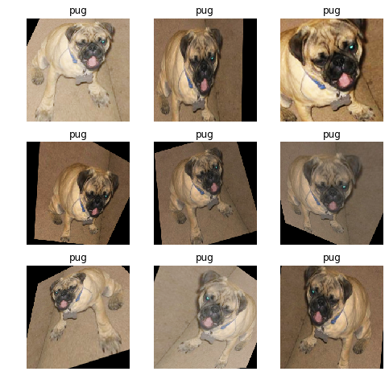
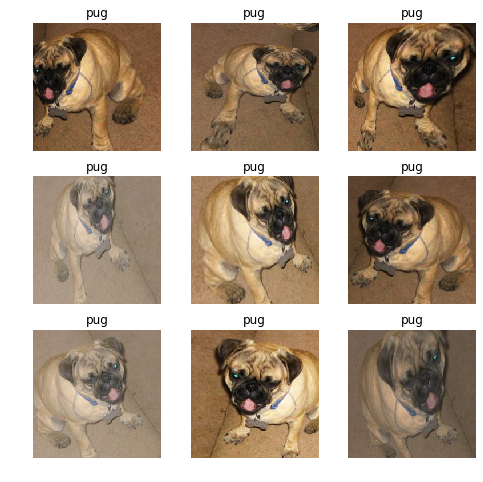
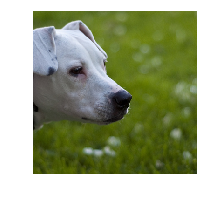
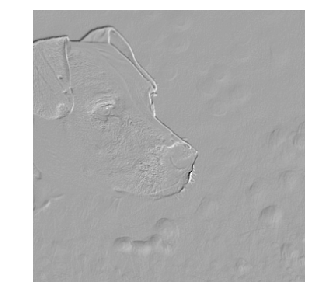
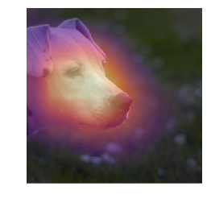
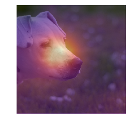

<h1>Table of Contents<span class="tocSkip"></span></h1>
<div class="toc"><ul class="toc-item"><li><span><a href="#Lesson-6:-pets-revisited" data-toc-modified-id="Lesson-6:-pets-revisited-1"><span class="toc-item-num">1&nbsp;&nbsp;</span>Lesson 6: pets revisited</a></span><ul class="toc-item"><li><ul class="toc-item"><li><ul class="toc-item"><li><span><a href="#三行魔法代码和所需library" data-toc-modified-id="三行魔法代码和所需library-1.0.0.1"><span class="toc-item-num">1.0.0.1&nbsp;&nbsp;</span>三行魔法代码和所需library</a></span></li><li><span><a href="#设置批量大小" data-toc-modified-id="设置批量大小-1.0.0.2"><span class="toc-item-num">1.0.0.2&nbsp;&nbsp;</span>设置批量大小</a></span></li><li><span><a href="#下载数据，获取图片文件夹地址" data-toc-modified-id="下载数据，获取图片文件夹地址-1.0.0.3"><span class="toc-item-num">1.0.0.3&nbsp;&nbsp;</span>下载数据，获取图片文件夹地址</a></span></li></ul></li></ul></li><li><span><a href="#Data-augmentation" data-toc-modified-id="Data-augmentation-1.1"><span class="toc-item-num">1.1&nbsp;&nbsp;</span>Data augmentation</a></span><ul class="toc-item"><li><ul class="toc-item"><li><span><a href="#对图片做特定处理" data-toc-modified-id="对图片做特定处理-1.1.0.1"><span class="toc-item-num">1.1.0.1&nbsp;&nbsp;</span>对图片做特定处理</a></span></li><li><span><a href="#查看get_transforms文档" data-toc-modified-id="查看get_transforms文档-1.1.0.2"><span class="toc-item-num">1.1.0.2&nbsp;&nbsp;</span>查看get_transforms文档</a></span></li><li><span><a href="#构建数据src" data-toc-modified-id="构建数据src-1.1.0.3"><span class="toc-item-num">1.1.0.3&nbsp;&nbsp;</span>构建数据src</a></span></li><li><span><a href="#创建一个定制函数来构建DataBunch" data-toc-modified-id="创建一个定制函数来构建DataBunch-1.1.0.4"><span class="toc-item-num">1.1.0.4&nbsp;&nbsp;</span>创建一个定制函数来构建DataBunch</a></span></li><li><span><a href="#展示同一张图片的各种变形效果（padding=0）" data-toc-modified-id="展示同一张图片的各种变形效果（padding=0）-1.1.0.5"><span class="toc-item-num">1.1.0.5&nbsp;&nbsp;</span>展示同一张图片的各种变形效果（padding=0）</a></span></li><li><span><a href="#展示同一张图片的各种变形效果（padding=reflection）" data-toc-modified-id="展示同一张图片的各种变形效果（padding=reflection）-1.1.0.6"><span class="toc-item-num">1.1.0.6&nbsp;&nbsp;</span>展示同一张图片的各种变形效果（padding=reflection）</a></span></li></ul></li></ul></li><li><span><a href="#Train-a-model" data-toc-modified-id="Train-a-model-1.2"><span class="toc-item-num">1.2&nbsp;&nbsp;</span>Train a model</a></span><ul class="toc-item"><li><ul class="toc-item"><li><span><a href="#释放内存空间" data-toc-modified-id="释放内存空间-1.2.0.1"><span class="toc-item-num">1.2.0.1&nbsp;&nbsp;</span>释放内存空间</a></span></li><li><span><a href="#用迁移学习构建模型-(bn_final=True)" data-toc-modified-id="用迁移学习构建模型-(bn_final=True)-1.2.0.2"><span class="toc-item-num">1.2.0.2&nbsp;&nbsp;</span>用迁移学习构建模型 (bn_final=True)</a></span></li><li><span><a href="#训练模型-(pct_start=0.8)" data-toc-modified-id="训练模型-(pct_start=0.8)-1.2.0.3"><span class="toc-item-num">1.2.0.3&nbsp;&nbsp;</span>训练模型 (pct_start=0.8)</a></span></li><li><span><a href="#解冻，再训练-max_lr=slice(1e-6,1e-3)" data-toc-modified-id="解冻，再训练-max_lr=slice(1e-6,1e-3)-1.2.0.4"><span class="toc-item-num">1.2.0.4&nbsp;&nbsp;</span>解冻，再训练 max_lr=slice(1e-6,1e-3)</a></span></li><li><span><a href="#改变数据的图片大小" data-toc-modified-id="改变数据的图片大小-1.2.0.5"><span class="toc-item-num">1.2.0.5&nbsp;&nbsp;</span>改变数据的图片大小</a></span></li><li><span><a href="#再训练-max_lr=slice(1e-6,1e-4)" data-toc-modified-id="再训练-max_lr=slice(1e-6,1e-4)-1.2.0.6"><span class="toc-item-num">1.2.0.6&nbsp;&nbsp;</span>再训练 max_lr=slice(1e-6,1e-4)</a></span></li><li><span><a href="#保存模型" data-toc-modified-id="保存模型-1.2.0.7"><span class="toc-item-num">1.2.0.7&nbsp;&nbsp;</span>保存模型</a></span></li></ul></li></ul></li><li><span><a href="#Convolution-kernel" data-toc-modified-id="Convolution-kernel-1.3"><span class="toc-item-num">1.3&nbsp;&nbsp;</span>Convolution kernel</a></span><ul class="toc-item"><li><ul class="toc-item"><li><span><a href="#改变数据批量大小-（缩小）" data-toc-modified-id="改变数据批量大小-（缩小）-1.3.0.1"><span class="toc-item-num">1.3.0.1&nbsp;&nbsp;</span>改变数据批量大小 （缩小）</a></span></li><li><span><a href="#加载上次训练的模型" data-toc-modified-id="加载上次训练的模型-1.3.0.2"><span class="toc-item-num">1.3.0.2&nbsp;&nbsp;</span>加载上次训练的模型</a></span></li><li><span><a href="#展示验证集中的第一个数据点（图和label）" data-toc-modified-id="展示验证集中的第一个数据点（图和label）-1.3.0.3"><span class="toc-item-num">1.3.0.3&nbsp;&nbsp;</span>展示验证集中的第一个数据点（图和label）</a></span></li><li><span><a href="#创建一个kernel-or-filter" data-toc-modified-id="创建一个kernel-or-filter-1.3.0.4"><span class="toc-item-num">1.3.0.4&nbsp;&nbsp;</span>创建一个kernel or filter</a></span></li><li><span><a href="#从验证数据中提起一个数据点的图片tensor" data-toc-modified-id="从验证数据中提起一个数据点的图片tensor-1.3.0.5"><span class="toc-item-num">1.3.0.5&nbsp;&nbsp;</span>从验证数据中提起一个数据点的图片tensor</a></span></li><li><span><a href="#将3D-tensor变成4D" data-toc-modified-id="将3D-tensor变成4D-1.3.0.6"><span class="toc-item-num">1.3.0.6&nbsp;&nbsp;</span>将3D tensor变成4D</a></span></li><li><span><a href="#对这个4D-tensor做filter处理" data-toc-modified-id="对这个4D-tensor做filter处理-1.3.0.7"><span class="toc-item-num">1.3.0.7&nbsp;&nbsp;</span>对这个4D tensor做filter处理</a></span></li><li><span><a href="#显示filter处理结构" data-toc-modified-id="显示filter处理结构-1.3.0.8"><span class="toc-item-num">1.3.0.8&nbsp;&nbsp;</span>显示filter处理结构</a></span></li><li><span><a href="#查看data.c" data-toc-modified-id="查看data.c-1.3.0.9"><span class="toc-item-num">1.3.0.9&nbsp;&nbsp;</span>查看data.c</a></span></li><li><span><a href="#查看模型结构" data-toc-modified-id="查看模型结构-1.3.0.10"><span class="toc-item-num">1.3.0.10&nbsp;&nbsp;</span>查看模型结构</a></span></li><li><span><a href="#打印模型总结" data-toc-modified-id="打印模型总结-1.3.0.11"><span class="toc-item-num">1.3.0.11&nbsp;&nbsp;</span>打印模型总结</a></span></li></ul></li></ul></li><li><span><a href="#Heatmap" data-toc-modified-id="Heatmap-1.4"><span class="toc-item-num">1.4&nbsp;&nbsp;</span>Heatmap</a></span><ul class="toc-item"><li><ul class="toc-item"><li><span><a href="#提取模型正向传递计算" data-toc-modified-id="提取模型正向传递计算-1.4.0.1"><span class="toc-item-num">1.4.0.1&nbsp;&nbsp;</span>提取模型正向传递计算</a></span></li><li><span><a href="#提取一个数据点-（只用X部分）" data-toc-modified-id="提取一个数据点-（只用X部分）-1.4.0.2"><span class="toc-item-num">1.4.0.2&nbsp;&nbsp;</span>提取一个数据点 （只用X部分）</a></span></li><li><span><a href="#对数据点X部分做denormalization处理，在转化为图片格式" data-toc-modified-id="对数据点X部分做denormalization处理，在转化为图片格式-1.4.0.3"><span class="toc-item-num">1.4.0.3&nbsp;&nbsp;</span>对数据点X部分做denormalization处理，在转化为图片格式</a></span></li><li><span><a href="#对数据点X部分做GPU计算设置" data-toc-modified-id="对数据点X部分做GPU计算设置-1.4.0.4"><span class="toc-item-num">1.4.0.4&nbsp;&nbsp;</span>对数据点X部分做GPU计算设置</a></span></li><li><span><a href="#调用callbacks.hooks全部功能" data-toc-modified-id="调用callbacks.hooks全部功能-1.4.0.5"><span class="toc-item-num">1.4.0.5&nbsp;&nbsp;</span>调用callbacks.hooks全部功能</a></span></li><li><span><a href="#构建函数提取模型激活层数据" data-toc-modified-id="构建函数提取模型激活层数据-1.4.0.6"><span class="toc-item-num">1.4.0.6&nbsp;&nbsp;</span>构建函数提取模型激活层数据</a></span></li><li><span><a href="#提取激活层数据，纵向做均值处理" data-toc-modified-id="提取激活层数据，纵向做均值处理-1.4.0.7"><span class="toc-item-num">1.4.0.7&nbsp;&nbsp;</span>提取激活层数据，纵向做均值处理</a></span></li><li><span><a href="#构建heatmap作图函数" data-toc-modified-id="构建heatmap作图函数-1.4.0.8"><span class="toc-item-num">1.4.0.8&nbsp;&nbsp;</span>构建heatmap作图函数</a></span></li></ul></li></ul></li><li><span><a href="#Grad-CAM" data-toc-modified-id="Grad-CAM-1.5"><span class="toc-item-num">1.5&nbsp;&nbsp;</span>Grad-CAM</a></span><ul class="toc-item"><li><ul class="toc-item"><li><span><a href="#论文提出的制作heatmap方法" data-toc-modified-id="论文提出的制作heatmap方法-1.5.0.1"><span class="toc-item-num">1.5.0.1&nbsp;&nbsp;</span>论文提出的制作heatmap方法</a></span></li><li><span><a href="#案例1" data-toc-modified-id="案例1-1.5.0.2"><span class="toc-item-num">1.5.0.2&nbsp;&nbsp;</span>案例1</a></span></li><li><span><a href="#案例2" data-toc-modified-id="案例2-1.5.0.3"><span class="toc-item-num">1.5.0.3&nbsp;&nbsp;</span>案例2</a></span></li><li><span><a href="#案例3:-通过处理数据类别，heatmap从聚焦猫到了狗" data-toc-modified-id="案例3:-通过处理数据类别，heatmap从聚焦猫到了狗-1.5.0.4"><span class="toc-item-num">1.5.0.4&nbsp;&nbsp;</span>案例3: 通过处理数据类别，heatmap从聚焦猫到了狗</a></span></li></ul></li></ul></li></ul></li></ul></div>

# Lesson 6: pets revisited

#### 三行魔法代码和所需library


```python
%reload_ext autoreload
%autoreload 2
%matplotlib inline

from fastai.vision import *
```

#### 设置批量大小


```python
bs = 64
```

#### 下载数据，获取图片文件夹地址


```python
path = untar_data(URLs.PETS)/'images'
```

## Data augmentation

#### 对图片做特定处理


```python
tfms = get_transforms(max_rotate=20, max_zoom=1.3, max_lighting=0.4, max_warp=0.4,
                      p_affine=1., p_lighting=1.)
```

#### 查看get_transforms文档


```python
doc(get_transforms)
```

#### 构建数据src


```python
src = ImageList.from_folder(path).random_split_by_pct(0.2, seed=2)
```

#### 创建一个定制函数来构建DataBunch


```python
def get_data(size, bs, padding_mode='reflection'):
    return (src.label_from_re(r'([^/]+)_\d+.jpg$')
           .transform(tfms, size=size, padding_mode=padding_mode)
           .databunch(bs=bs).normalize(imagenet_stats))
```

#### 展示同一张图片的各种变形效果（padding=0）


```python
data = get_data(224, bs, 'zeros')
```


```python
def _plot(i,j,ax):
    x,y = data.train_ds[3]
    x.show(ax, y=y)

plot_multi(_plot, 3, 3, figsize=(8,8))
```





#### 展示同一张图片的各种变形效果（padding=reflection）


```python
data = get_data(224,bs)
```


```python
plot_multi(_plot, 3, 3, figsize=(8,8))
```





## Train a model

#### 释放内存空间


```python
gc.collect()
```

#### 用迁移学习构建模型 (bn_final=True)


```python
learn = create_cnn(data, models.resnet34, metrics=error_rate, bn_final=True)
```

#### 训练模型 (pct_start=0.8)


```python
learn.fit_one_cycle(3, slice(1e-2), pct_start=0.8)
```


Total time: 01:22 <p><table style='width:300px; margin-bottom:10px'>
  <tr>
    <th>epoch</th>
    <th>train_loss</th>
    <th>valid_loss</th>
    <th>error_rate</th>
  </tr>
  <tr>
    <th>1</th>
    <th>2.573282</th>
    <th>1.364505</th>
    <th>0.271989</th>
  </tr>
  <tr>
    <th>2</th>
    <th>1.545074</th>
    <th>0.377077</th>
    <th>0.094046</th>
  </tr>
  <tr>
    <th>3</th>
    <th>0.937992</th>
    <th>0.270508</th>
    <th>0.068336</th>
  </tr>
</table>


#### 解冻，再训练 max_lr=slice(1e-6,1e-3)


```python
learn.unfreeze()
learn.fit_one_cycle(2, max_lr=slice(1e-6,1e-3), pct_start=0.8)
```


Total time: 00:55 <p><table style='width:300px; margin-bottom:10px'>
  <tr>
    <th>epoch</th>
    <th>train_loss</th>
    <th>valid_loss</th>
    <th>error_rate</th>
  </tr>
  <tr>
    <th>1</th>
    <th>0.721187</th>
    <th>0.294177</th>
    <th>0.058187</th>
  </tr>
  <tr>
    <th>2</th>
    <th>0.675999</th>
    <th>0.285875</th>
    <th>0.050744</th>
  </tr>
</table>


#### 改变数据的图片大小


```python
data = get_data(352,bs)
learn.data = data
```

#### 再训练 max_lr=slice(1e-6,1e-4)


```python
learn.fit_one_cycle(2, max_lr=slice(1e-6,1e-4))
```


Total time: 01:37 <p><table style='width:300px; margin-bottom:10px'>
  <tr>
    <th>epoch</th>
    <th>train_loss</th>
    <th>valid_loss</th>
    <th>error_rate</th>
  </tr>
  <tr>
    <th>1</th>
    <th>0.627055</th>
    <th>0.286791</th>
    <th>0.058863</th>
  </tr>
  <tr>
    <th>2</th>
    <th>0.602765</th>
    <th>0.286951</th>
    <th>0.058863</th>
  </tr>
</table>


#### 保存模型


```python
learn.save('352')
```

## Convolution kernel

#### 改变数据批量大小 （缩小）


```python
data = get_data(352,16)
```

#### 加载上次训练的模型


```python
learn = create_cnn(data, models.resnet34, metrics=error_rate, bn_final=True).load('352')
```

#### 展示验证集中的第一个数据点（图和label）


```python
idx=0
x,y = data.valid_ds[idx]
x.show()
data.valid_ds.y[idx]
```


    Category american_pit_bull_terrier





#### 创建一个kernel or filter


```python
k = tensor([
    [0.  ,-5/3,1],
    [-5/3,-5/3,1],
    [1.  ,1   ,1],
]).expand(1,3,3,3)/6
```


```python
k
```


    tensor([[[[ 0.0000, -0.2778,  0.1667],
              [-0.2778, -0.2778,  0.1667],
              [ 0.1667,  0.1667,  0.1667]],
    
             [[ 0.0000, -0.2778,  0.1667],
              [-0.2778, -0.2778,  0.1667],
              [ 0.1667,  0.1667,  0.1667]],
    
             [[ 0.0000, -0.2778,  0.1667],
              [-0.2778, -0.2778,  0.1667],
              [ 0.1667,  0.1667,  0.1667]]]])


```python
k.shape
```


    torch.Size([1, 3, 3, 3])


#### 从验证数据中提起一个数据点的图片tensor


```python
t = data.valid_ds[0][0].data; t.shape
```


    torch.Size([3, 352, 352])


#### 将3D tensor变成4D


```python
t[None].shape
```


    torch.Size([1, 3, 352, 352])


#### 对这个4D tensor做filter处理


```python
edge = F.conv2d(t[None], k)
```

#### 显示filter处理结构


```python
show_image(edge[0], figsize=(5,5));
```





#### 查看data.c


```python
data.c
```


    37


#### 查看模型结构


```python
learn.model
```


    Sequential(
      (0): Sequential(
        (0): Conv2d(3, 64, kernel_size=(7, 7), stride=(2, 2), padding=(3, 3), bias=False)
        (1): BatchNorm2d(64, eps=1e-05, momentum=0.1, affine=True, track_running_stats=True)
        (2): ReLU(inplace)
        (3): MaxPool2d(kernel_size=3, stride=2, padding=1, dilation=1, ceil_mode=False)
        (4): Sequential(
          (0): BasicBlock(
            (conv1): Conv2d(64, 64, kernel_size=(3, 3), stride=(1, 1), padding=(1, 1), bias=False)
            (bn1): BatchNorm2d(64, eps=1e-05, momentum=0.1, affine=True, track_running_stats=True)
            (relu): ReLU(inplace)
            (conv2): Conv2d(64, 64, kernel_size=(3, 3), stride=(1, 1), padding=(1, 1), bias=False)
            (bn2): BatchNorm2d(64, eps=1e-05, momentum=0.1, affine=True, track_running_stats=True)
          )
          (1): BasicBlock(
            (conv1): Conv2d(64, 64, kernel_size=(3, 3), stride=(1, 1), padding=(1, 1), bias=False)
            (bn1): BatchNorm2d(64, eps=1e-05, momentum=0.1, affine=True, track_running_stats=True)
            (relu): ReLU(inplace)
            (conv2): Conv2d(64, 64, kernel_size=(3, 3), stride=(1, 1), padding=(1, 1), bias=False)
            (bn2): BatchNorm2d(64, eps=1e-05, momentum=0.1, affine=True, track_running_stats=True)
          )
          (2): BasicBlock(
            (conv1): Conv2d(64, 64, kernel_size=(3, 3), stride=(1, 1), padding=(1, 1), bias=False)
            (bn1): BatchNorm2d(64, eps=1e-05, momentum=0.1, affine=True, track_running_stats=True)
            (relu): ReLU(inplace)
            (conv2): Conv2d(64, 64, kernel_size=(3, 3), stride=(1, 1), padding=(1, 1), bias=False)
            (bn2): BatchNorm2d(64, eps=1e-05, momentum=0.1, affine=True, track_running_stats=True)
          )
        )
        (5): Sequential(
          (0): BasicBlock(
            (conv1): Conv2d(64, 128, kernel_size=(3, 3), stride=(2, 2), padding=(1, 1), bias=False)
            (bn1): BatchNorm2d(128, eps=1e-05, momentum=0.1, affine=True, track_running_stats=True)
            (relu): ReLU(inplace)
            (conv2): Conv2d(128, 128, kernel_size=(3, 3), stride=(1, 1), padding=(1, 1), bias=False)
            (bn2): BatchNorm2d(128, eps=1e-05, momentum=0.1, affine=True, track_running_stats=True)
            (downsample): Sequential(
              (0): Conv2d(64, 128, kernel_size=(1, 1), stride=(2, 2), bias=False)
              (1): BatchNorm2d(128, eps=1e-05, momentum=0.1, affine=True, track_running_stats=True)
            )
          )
          (1): BasicBlock(
            (conv1): Conv2d(128, 128, kernel_size=(3, 3), stride=(1, 1), padding=(1, 1), bias=False)
            (bn1): BatchNorm2d(128, eps=1e-05, momentum=0.1, affine=True, track_running_stats=True)
            (relu): ReLU(inplace)
            (conv2): Conv2d(128, 128, kernel_size=(3, 3), stride=(1, 1), padding=(1, 1), bias=False)
            (bn2): BatchNorm2d(128, eps=1e-05, momentum=0.1, affine=True, track_running_stats=True)
          )
          (2): BasicBlock(
            (conv1): Conv2d(128, 128, kernel_size=(3, 3), stride=(1, 1), padding=(1, 1), bias=False)
            (bn1): BatchNorm2d(128, eps=1e-05, momentum=0.1, affine=True, track_running_stats=True)
            (relu): ReLU(inplace)
            (conv2): Conv2d(128, 128, kernel_size=(3, 3), stride=(1, 1), padding=(1, 1), bias=False)
            (bn2): BatchNorm2d(128, eps=1e-05, momentum=0.1, affine=True, track_running_stats=True)
          )
          (3): BasicBlock(
            (conv1): Conv2d(128, 128, kernel_size=(3, 3), stride=(1, 1), padding=(1, 1), bias=False)
            (bn1): BatchNorm2d(128, eps=1e-05, momentum=0.1, affine=True, track_running_stats=True)
            (relu): ReLU(inplace)
            (conv2): Conv2d(128, 128, kernel_size=(3, 3), stride=(1, 1), padding=(1, 1), bias=False)
            (bn2): BatchNorm2d(128, eps=1e-05, momentum=0.1, affine=True, track_running_stats=True)
          )
        )
        (6): Sequential(
          (0): BasicBlock(
            (conv1): Conv2d(128, 256, kernel_size=(3, 3), stride=(2, 2), padding=(1, 1), bias=False)
            (bn1): BatchNorm2d(256, eps=1e-05, momentum=0.1, affine=True, track_running_stats=True)
            (relu): ReLU(inplace)
            (conv2): Conv2d(256, 256, kernel_size=(3, 3), stride=(1, 1), padding=(1, 1), bias=False)
            (bn2): BatchNorm2d(256, eps=1e-05, momentum=0.1, affine=True, track_running_stats=True)
            (downsample): Sequential(
              (0): Conv2d(128, 256, kernel_size=(1, 1), stride=(2, 2), bias=False)
              (1): BatchNorm2d(256, eps=1e-05, momentum=0.1, affine=True, track_running_stats=True)
            )
          )
          (1): BasicBlock(
            (conv1): Conv2d(256, 256, kernel_size=(3, 3), stride=(1, 1), padding=(1, 1), bias=False)
            (bn1): BatchNorm2d(256, eps=1e-05, momentum=0.1, affine=True, track_running_stats=True)
            (relu): ReLU(inplace)
            (conv2): Conv2d(256, 256, kernel_size=(3, 3), stride=(1, 1), padding=(1, 1), bias=False)
            (bn2): BatchNorm2d(256, eps=1e-05, momentum=0.1, affine=True, track_running_stats=True)
          )
          (2): BasicBlock(
            (conv1): Conv2d(256, 256, kernel_size=(3, 3), stride=(1, 1), padding=(1, 1), bias=False)
            (bn1): BatchNorm2d(256, eps=1e-05, momentum=0.1, affine=True, track_running_stats=True)
            (relu): ReLU(inplace)
            (conv2): Conv2d(256, 256, kernel_size=(3, 3), stride=(1, 1), padding=(1, 1), bias=False)
            (bn2): BatchNorm2d(256, eps=1e-05, momentum=0.1, affine=True, track_running_stats=True)
          )
          (3): BasicBlock(
            (conv1): Conv2d(256, 256, kernel_size=(3, 3), stride=(1, 1), padding=(1, 1), bias=False)
            (bn1): BatchNorm2d(256, eps=1e-05, momentum=0.1, affine=True, track_running_stats=True)
            (relu): ReLU(inplace)
            (conv2): Conv2d(256, 256, kernel_size=(3, 3), stride=(1, 1), padding=(1, 1), bias=False)
            (bn2): BatchNorm2d(256, eps=1e-05, momentum=0.1, affine=True, track_running_stats=True)
          )
          (4): BasicBlock(
            (conv1): Conv2d(256, 256, kernel_size=(3, 3), stride=(1, 1), padding=(1, 1), bias=False)
            (bn1): BatchNorm2d(256, eps=1e-05, momentum=0.1, affine=True, track_running_stats=True)
            (relu): ReLU(inplace)
            (conv2): Conv2d(256, 256, kernel_size=(3, 3), stride=(1, 1), padding=(1, 1), bias=False)
            (bn2): BatchNorm2d(256, eps=1e-05, momentum=0.1, affine=True, track_running_stats=True)
          )
          (5): BasicBlock(
            (conv1): Conv2d(256, 256, kernel_size=(3, 3), stride=(1, 1), padding=(1, 1), bias=False)
            (bn1): BatchNorm2d(256, eps=1e-05, momentum=0.1, affine=True, track_running_stats=True)
            (relu): ReLU(inplace)
            (conv2): Conv2d(256, 256, kernel_size=(3, 3), stride=(1, 1), padding=(1, 1), bias=False)
            (bn2): BatchNorm2d(256, eps=1e-05, momentum=0.1, affine=True, track_running_stats=True)
          )
        )
        (7): Sequential(
          (0): BasicBlock(
            (conv1): Conv2d(256, 512, kernel_size=(3, 3), stride=(2, 2), padding=(1, 1), bias=False)
            (bn1): BatchNorm2d(512, eps=1e-05, momentum=0.1, affine=True, track_running_stats=True)
            (relu): ReLU(inplace)
            (conv2): Conv2d(512, 512, kernel_size=(3, 3), stride=(1, 1), padding=(1, 1), bias=False)
            (bn2): BatchNorm2d(512, eps=1e-05, momentum=0.1, affine=True, track_running_stats=True)
            (downsample): Sequential(
              (0): Conv2d(256, 512, kernel_size=(1, 1), stride=(2, 2), bias=False)
              (1): BatchNorm2d(512, eps=1e-05, momentum=0.1, affine=True, track_running_stats=True)
            )
          )
          (1): BasicBlock(
            (conv1): Conv2d(512, 512, kernel_size=(3, 3), stride=(1, 1), padding=(1, 1), bias=False)
            (bn1): BatchNorm2d(512, eps=1e-05, momentum=0.1, affine=True, track_running_stats=True)
            (relu): ReLU(inplace)
            (conv2): Conv2d(512, 512, kernel_size=(3, 3), stride=(1, 1), padding=(1, 1), bias=False)
            (bn2): BatchNorm2d(512, eps=1e-05, momentum=0.1, affine=True, track_running_stats=True)
          )
          (2): BasicBlock(
            (conv1): Conv2d(512, 512, kernel_size=(3, 3), stride=(1, 1), padding=(1, 1), bias=False)
            (bn1): BatchNorm2d(512, eps=1e-05, momentum=0.1, affine=True, track_running_stats=True)
            (relu): ReLU(inplace)
            (conv2): Conv2d(512, 512, kernel_size=(3, 3), stride=(1, 1), padding=(1, 1), bias=False)
            (bn2): BatchNorm2d(512, eps=1e-05, momentum=0.1, affine=True, track_running_stats=True)
          )
        )
      )
      (1): Sequential(
        (0): AdaptiveConcatPool2d(
          (ap): AdaptiveAvgPool2d(output_size=1)
          (mp): AdaptiveMaxPool2d(output_size=1)
        )
        (1): Flatten()
        (2): BatchNorm1d(1024, eps=1e-05, momentum=0.1, affine=True, track_running_stats=True)
        (3): Dropout(p=0.25)
        (4): Linear(in_features=1024, out_features=512, bias=True)
        (5): ReLU(inplace)
        (6): BatchNorm1d(512, eps=1e-05, momentum=0.1, affine=True, track_running_stats=True)
        (7): Dropout(p=0.5)
        (8): Linear(in_features=512, out_features=37, bias=True)
        (9): BatchNorm1d(37, eps=1e-05, momentum=0.01, affine=True, track_running_stats=True)
      )
    )


#### 打印模型总结


```python
print(learn.summary())
```


    '======================================================================\nLayer (type)         Output Shape         Param #    Trainable \n======================================================================\nConv2d               [16, 64, 176, 176]   9408       False     \n______________________________________________________________________\nBatchNorm2d          [16, 64, 176, 176]   128        True      \n______________________________________________________________________\nReLU                 [16, 64, 176, 176]   0          False     \n______________________________________________________________________\nMaxPool2d            [16, 64, 88, 88]     0          False     \n______________________________________________________________________\nConv2d               [16, 64, 88, 88]     36864      False     \n______________________________________________________________________\nBatchNorm2d          [16, 64, 88, 88]     128        True      \n______________________________________________________________________\nReLU                 [16, 64, 88, 88]     0          False     \n______________________________________________________________________\nConv2d               [16, 64, 88, 88]     36864      False     \n______________________________________________________________________\nBatchNorm2d          [16, 64, 88, 88]     128        True      \n______________________________________________________________________\nConv2d               [16, 64, 88, 88]     36864      False     \n______________________________________________________________________\nBatchNorm2d          [16, 64, 88, 88]     128        True      \n______________________________________________________________________\nReLU                 [16, 64, 88, 88]     0          False     \n______________________________________________________________________\nConv2d               [16, 64, 88, 88]     36864      False     \n______________________________________________________________________\nBatchNorm2d          [16, 64, 88, 88]     128        True      \n______________________________________________________________________\nConv2d               [16, 64, 88, 88]     36864      False     \n______________________________________________________________________\nBatchNorm2d          [16, 64, 88, 88]     128        True      \n______________________________________________________________________\nReLU                 [16, 64, 88, 88]     0          False     \n______________________________________________________________________\nConv2d               [16, 64, 88, 88]     36864      False     \n______________________________________________________________________\nBatchNorm2d          [16, 64, 88, 88]     128        True      \n______________________________________________________________________\nConv2d               [16, 128, 44, 44]    73728      False     \n______________________________________________________________________\nBatchNorm2d          [16, 128, 44, 44]    256        True      \n______________________________________________________________________\nReLU                 [16, 128, 44, 44]    0          False     \n______________________________________________________________________\nConv2d               [16, 128, 44, 44]    147456     False     \n______________________________________________________________________\nBatchNorm2d          [16, 128, 44, 44]    256        True      \n______________________________________________________________________\nConv2d               [16, 128, 44, 44]    8192       False     \n______________________________________________________________________\nBatchNorm2d          [16, 128, 44, 44]    256        True      \n______________________________________________________________________\nConv2d               [16, 128, 44, 44]    147456     False     \n______________________________________________________________________\nBatchNorm2d          [16, 128, 44, 44]    256        True      \n______________________________________________________________________\nReLU                 [16, 128, 44, 44]    0          False     \n______________________________________________________________________\nConv2d               [16, 128, 44, 44]    147456     False     \n______________________________________________________________________\nBatchNorm2d          [16, 128, 44, 44]    256        True      \n______________________________________________________________________\nConv2d               [16, 128, 44, 44]    147456     False     \n______________________________________________________________________\nBatchNorm2d          [16, 128, 44, 44]    256        True      \n______________________________________________________________________\nReLU                 [16, 128, 44, 44]    0          False     \n______________________________________________________________________\nConv2d               [16, 128, 44, 44]    147456     False     \n______________________________________________________________________\nBatchNorm2d          [16, 128, 44, 44]    256        True      \n______________________________________________________________________\nConv2d               [16, 128, 44, 44]    147456     False     \n______________________________________________________________________\nBatchNorm2d          [16, 128, 44, 44]    256        True      \n______________________________________________________________________\nReLU                 [16, 128, 44, 44]    0          False     \n______________________________________________________________________\nConv2d               [16, 128, 44, 44]    147456     False     \n______________________________________________________________________\nBatchNorm2d          [16, 128, 44, 44]    256        True      \n______________________________________________________________________\nConv2d               [16, 256, 22, 22]    294912     False     \n______________________________________________________________________\nBatchNorm2d          [16, 256, 22, 22]    512        True      \n______________________________________________________________________\nReLU                 [16, 256, 22, 22]    0          False     \n______________________________________________________________________\nConv2d               [16, 256, 22, 22]    589824     False     \n______________________________________________________________________\nBatchNorm2d          [16, 256, 22, 22]    512        True      \n______________________________________________________________________\nConv2d               [16, 256, 22, 22]    32768      False     \n______________________________________________________________________\nBatchNorm2d          [16, 256, 22, 22]    512        True      \n______________________________________________________________________\nConv2d               [16, 256, 22, 22]    589824     False     \n______________________________________________________________________\nBatchNorm2d          [16, 256, 22, 22]    512        True      \n______________________________________________________________________\nReLU                 [16, 256, 22, 22]    0          False     \n______________________________________________________________________\nConv2d               [16, 256, 22, 22]    589824     False     \n______________________________________________________________________\nBatchNorm2d          [16, 256, 22, 22]    512        True      \n______________________________________________________________________\nConv2d               [16, 256, 22, 22]    589824     False     \n______________________________________________________________________\nBatchNorm2d          [16, 256, 22, 22]    512        True      \n______________________________________________________________________\nReLU                 [16, 256, 22, 22]    0          False     \n______________________________________________________________________\nConv2d               [16, 256, 22, 22]    589824     False     \n______________________________________________________________________\nBatchNorm2d          [16, 256, 22, 22]    512        True      \n______________________________________________________________________\nConv2d               [16, 256, 22, 22]    589824     False     \n______________________________________________________________________\nBatchNorm2d          [16, 256, 22, 22]    512        True      \n______________________________________________________________________\nReLU                 [16, 256, 22, 22]    0          False     \n______________________________________________________________________\nConv2d               [16, 256, 22, 22]    589824     False     \n______________________________________________________________________\nBatchNorm2d          [16, 256, 22, 22]    512        True      \n______________________________________________________________________\nConv2d               [16, 256, 22, 22]    589824     False     \n______________________________________________________________________\nBatchNorm2d          [16, 256, 22, 22]    512        True      \n______________________________________________________________________\nReLU                 [16, 256, 22, 22]    0          False     \n______________________________________________________________________\nConv2d               [16, 256, 22, 22]    589824     False     \n______________________________________________________________________\nBatchNorm2d          [16, 256, 22, 22]    512        True      \n______________________________________________________________________\nConv2d               [16, 256, 22, 22]    589824     False     \n______________________________________________________________________\nBatchNorm2d          [16, 256, 22, 22]    512        True      \n______________________________________________________________________\nReLU                 [16, 256, 22, 22]    0          False     \n______________________________________________________________________\nConv2d               [16, 256, 22, 22]    589824     False     \n______________________________________________________________________\nBatchNorm2d          [16, 256, 22, 22]    512        True      \n______________________________________________________________________\nConv2d               [16, 512, 11, 11]    1179648    False     \n______________________________________________________________________\nBatchNorm2d          [16, 512, 11, 11]    1024       True      \n______________________________________________________________________\nReLU                 [16, 512, 11, 11]    0          False     \n______________________________________________________________________\nConv2d               [16, 512, 11, 11]    2359296    False     \n______________________________________________________________________\nBatchNorm2d          [16, 512, 11, 11]    1024       True      \n______________________________________________________________________\nConv2d               [16, 512, 11, 11]    131072     False     \n______________________________________________________________________\nBatchNorm2d          [16, 512, 11, 11]    1024       True      \n______________________________________________________________________\nConv2d               [16, 512, 11, 11]    2359296    False     \n______________________________________________________________________\nBatchNorm2d          [16, 512, 11, 11]    1024       True      \n______________________________________________________________________\nReLU                 [16, 512, 11, 11]    0          False     \n______________________________________________________________________\nConv2d               [16, 512, 11, 11]    2359296    False     \n______________________________________________________________________\nBatchNorm2d          [16, 512, 11, 11]    1024       True      \n______________________________________________________________________\nConv2d               [16, 512, 11, 11]    2359296    False     \n______________________________________________________________________\nBatchNorm2d          [16, 512, 11, 11]    1024       True      \n______________________________________________________________________\nReLU                 [16, 512, 11, 11]    0          False     \n______________________________________________________________________\nConv2d               [16, 512, 11, 11]    2359296    False     \n______________________________________________________________________\nBatchNorm2d          [16, 512, 11, 11]    1024       True      \n______________________________________________________________________\nAdaptiveAvgPool2d    [16, 512, 1, 1]      0          False     \n______________________________________________________________________\nAdaptiveMaxPool2d    [16, 512, 1, 1]      0          False     \n______________________________________________________________________\nFlatten              [16, 1024]           0          False     \n______________________________________________________________________\nBatchNorm1d          [16, 1024]           2048       True      \n______________________________________________________________________\nDropout              [16, 1024]           0          False     \n______________________________________________________________________\nLinear               [16, 512]            524800     True      \n______________________________________________________________________\nReLU                 [16, 512]            0          False     \n______________________________________________________________________\nBatchNorm1d          [16, 512]            1024       True      \n______________________________________________________________________\nDropout              [16, 512]            0          False     \n______________________________________________________________________\nLinear               [16, 37]             18981      True      \n______________________________________________________________________\nBatchNorm1d          [16, 37]             74         True      \n______________________________________________________________________\n\nTotal params: 21831599\nTotal trainable params: 563951\nTotal non-trainable params: 21267648\n'


## Heatmap

#### 提取模型正向传递计算


```python
m = learn.model.eval();
```

#### 提取一个数据点 （只用X部分）


```python
xb,_ = data.one_item(x)
```

#### 对数据点X部分做denormalization处理，在转化为图片格式


```python
xb_im = Image(data.denorm(xb)[0])
```

#### 对数据点X部分做GPU计算设置


```python
xb = xb.cuda()
```

#### 调用callbacks.hooks全部功能


```python
from fastai.callbacks.hooks import *
```

#### 构建函数提取模型激活层数据


```python
def hooked_backward(cat=y):
    with hook_output(m[0]) as hook_a: 
        with hook_output(m[0], grad=True) as hook_g:
            preds = m(xb)
            preds[0,int(cat)].backward()
    return hook_a,hook_g
```


```python
hook_a,hook_g = hooked_backward()
```

#### 提取激活层数据，纵向做均值处理


```python
acts  = hook_a.stored[0].cpu()
acts.shape
```


    torch.Size([512, 11, 11])


```python
avg_acts = acts.mean(0)
avg_acts.shape
```


    torch.Size([11, 11])


#### 构建heatmap作图函数


```python
def show_heatmap(hm):
    _,ax = plt.subplots()
    xb_im.show(ax)
    ax.imshow(hm, alpha=0.6, extent=(0,352,352,0),
              interpolation='bilinear', cmap='magma');
```


```python
show_heatmap(avg_acts)
```





## Grad-CAM

#### 论文提出的制作heatmap方法

Paper: [Grad-CAM: Visual Explanations from Deep Networks via Gradient-based Localization](https://arxiv.org/abs/1610.02391)

#### 案例1


```python
grad = hook_g.stored[0][0].cpu()
grad_chan = grad.mean(1).mean(1)
grad.shape,grad_chan.shape
```


    (torch.Size([512, 11, 11]), torch.Size([512]))


```python
mult = (acts*grad_chan[...,None,None]).mean(0)
```


```python
show_heatmap(mult)
```





#### 案例2


```python
fn = path/'../other/bulldog_maine.jpg' #Replace with your own image
```


```python
x = open_image(fn); x
```


```python
xb,_ = data.one_item(x)
xb_im = Image(data.denorm(xb)[0])
xb = xb.cuda()
```


```python
hook_a,hook_g = hooked_backward()
```


```python
acts = hook_a.stored[0].cpu()
grad = hook_g.stored[0][0].cpu()

grad_chan = grad.mean(1).mean(1)
mult = (acts*grad_chan[...,None,None]).mean(0)
```


```python
show_heatmap(mult)
```


#### 案例3: 通过处理数据类别，heatmap从聚焦猫到了狗


```python
data.classes[0]
```


    'american_bulldog'


```python
hook_a,hook_g = hooked_backward(0)
```


```python
acts = hook_a.stored[0].cpu()
grad = hook_g.stored[0][0].cpu()

grad_chan = grad.mean(1).mean(1)
mult = (acts*grad_chan[...,None,None]).mean(0)
```


```python
show_heatmap(mult)
```


