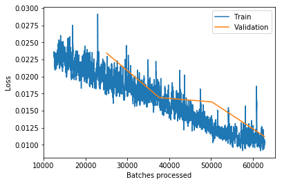

<h1>Table of Contents<span class="tocSkip"></span></h1>
<div class="toc"><ul class="toc-item"><li><ul class="toc-item"><li><ul class="toc-item"><li><ul class="toc-item"><li><span><a href="#2行魔法代码" data-toc-modified-id="2行魔法代码-0.0.0.1"><span class="toc-item-num">0.0.0.1&nbsp;&nbsp;</span>2行魔法代码</a></span></li><li><span><a href="#所需library" data-toc-modified-id="所需library-0.0.0.2"><span class="toc-item-num">0.0.0.2&nbsp;&nbsp;</span>所需library</a></span></li></ul></li></ul></li></ul></li><li><span><a href="#Rossmann" data-toc-modified-id="Rossmann-1"><span class="toc-item-num">1&nbsp;&nbsp;</span>Rossmann</a></span><ul class="toc-item"><li><span><a href="#Data-preparation" data-toc-modified-id="Data-preparation-1.1"><span class="toc-item-num">1.1&nbsp;&nbsp;</span>Data preparation</a></span><ul class="toc-item"><li><ul class="toc-item"><li><span><a href="#feature-engineering" data-toc-modified-id="feature-engineering-1.1.0.1"><span class="toc-item-num">1.1.0.1&nbsp;&nbsp;</span>feature engineering</a></span></li><li><span><a href="#调取feature-engineering-之后数据" data-toc-modified-id="调取feature-engineering-之后数据-1.1.0.2"><span class="toc-item-num">1.1.0.2&nbsp;&nbsp;</span>调取feature engineering 之后数据</a></span></li><li><span><a href="#查看数据" data-toc-modified-id="查看数据-1.1.0.3"><span class="toc-item-num">1.1.0.3&nbsp;&nbsp;</span>查看数据</a></span></li></ul></li><li><span><a href="#Experimenting-with-a-sample" data-toc-modified-id="Experimenting-with-a-sample-1.1.1"><span class="toc-item-num">1.1.1&nbsp;&nbsp;</span>Experimenting with a sample</a></span><ul class="toc-item"><li><span><a href="#构建一个小数据集样本" data-toc-modified-id="构建一个小数据集样本-1.1.1.1"><span class="toc-item-num">1.1.1.1&nbsp;&nbsp;</span>构建一个小数据集样本</a></span></li><li><span><a href="#对cat_vars,-cont_vars做categorify处理" data-toc-modified-id="对cat_vars,-cont_vars做categorify处理-1.1.1.2"><span class="toc-item-num">1.1.1.2&nbsp;&nbsp;</span>对cat_vars, cont_vars做categorify处理</a></span></li><li><span><a href="#查看数据categories文字与数字形式" data-toc-modified-id="查看数据categories文字与数字形式-1.1.1.3"><span class="toc-item-num">1.1.1.3&nbsp;&nbsp;</span>查看数据categories文字与数字形式</a></span></li><li><span><a href="#处理数据缺失" data-toc-modified-id="处理数据缺失-1.1.1.4"><span class="toc-item-num">1.1.1.4&nbsp;&nbsp;</span>处理数据缺失</a></span></li></ul></li><li><span><a href="#Preparing-full-data-set" data-toc-modified-id="Preparing-full-data-set-1.1.2"><span class="toc-item-num">1.1.2&nbsp;&nbsp;</span>Preparing full data set</a></span><ul class="toc-item"><li><span><a href="#从pickle文件里提取全部训练和测试数据" data-toc-modified-id="从pickle文件里提取全部训练和测试数据-1.1.2.1"><span class="toc-item-num">1.1.2.1&nbsp;&nbsp;</span>从pickle文件里提取全部训练和测试数据</a></span></li><li><span><a href="#设置预处理，和全部的cat_vars,-cont_vars" data-toc-modified-id="设置预处理，和全部的cat_vars,-cont_vars-1.1.2.2"><span class="toc-item-num">1.1.2.2&nbsp;&nbsp;</span>设置预处理，和全部的cat_vars, cont_vars</a></span></li><li><span><a href="#设置训练数据成分" data-toc-modified-id="设置训练数据成分-1.1.2.3"><span class="toc-item-num">1.1.2.3&nbsp;&nbsp;</span>设置训练数据成分</a></span></li><li><span><a href="#找出测试数据长度" data-toc-modified-id="找出测试数据长度-1.1.2.4"><span class="toc-item-num">1.1.2.4&nbsp;&nbsp;</span>找出测试数据长度</a></span></li><li><span><a href="#根据测试数据两计算需要多少验证数据" data-toc-modified-id="根据测试数据两计算需要多少验证数据-1.1.2.5"><span class="toc-item-num">1.1.2.5&nbsp;&nbsp;</span>根据测试数据两计算需要多少验证数据</a></span></li><li><span><a href="#用TabluarList和df构建databunch" data-toc-modified-id="用TabluarList和df构建databunch-1.1.2.6"><span class="toc-item-num">1.1.2.6&nbsp;&nbsp;</span>用TabluarList和df构建databunch</a></span></li><li><span><a href="#查看FloatList-与-log的使用" data-toc-modified-id="查看FloatList-与-log的使用-1.1.2.7"><span class="toc-item-num">1.1.2.7&nbsp;&nbsp;</span>查看FloatList 与 log的使用</a></span></li></ul></li></ul></li><li><span><a href="#Model" data-toc-modified-id="Model-1.2"><span class="toc-item-num">1.2&nbsp;&nbsp;</span>Model</a></span><ul class="toc-item"><li><ul class="toc-item"><li><span><a href="#计算y-range" data-toc-modified-id="计算y-range-1.2.0.1"><span class="toc-item-num">1.2.0.1&nbsp;&nbsp;</span>计算y range</a></span></li><li><span><a href="#构建tabular-learner" data-toc-modified-id="构建tabular-learner-1.2.0.2"><span class="toc-item-num">1.2.0.2&nbsp;&nbsp;</span>构建tabular learner</a></span></li><li><span><a href="#查看模型" data-toc-modified-id="查看模型-1.2.0.3"><span class="toc-item-num">1.2.0.3&nbsp;&nbsp;</span>查看模型</a></span></li><li><span><a href="#查看数据内细节" data-toc-modified-id="查看数据内细节-1.2.0.4"><span class="toc-item-num">1.2.0.4&nbsp;&nbsp;</span>查看数据内细节</a></span></li><li><span><a href="#作图，寻找学习率最优值" data-toc-modified-id="作图，寻找学习率最优值-1.2.0.5"><span class="toc-item-num">1.2.0.5&nbsp;&nbsp;</span>作图，寻找学习率最优值</a></span></li><li><span><a href="#训练模型-1e-3,-wd=0.2" data-toc-modified-id="训练模型-1e-3,-wd=0.2-1.2.0.6"><span class="toc-item-num">1.2.0.6&nbsp;&nbsp;</span>训练模型 1e-3, wd=0.2</a></span></li><li><span><a href="#画出损失值走势" data-toc-modified-id="画出损失值走势-1.2.0.7"><span class="toc-item-num">1.2.0.7&nbsp;&nbsp;</span>画出损失值走势</a></span></li><li><span><a href="#连续训练两次，每次5epochs，lr=3e-4" data-toc-modified-id="连续训练两次，每次5epochs，lr=3e-4-1.2.0.8"><span class="toc-item-num">1.2.0.8&nbsp;&nbsp;</span>连续训练两次，每次5epochs，lr=3e-4</a></span></li><li><span><a href="#预测，生成submission" data-toc-modified-id="预测，生成submission-1.2.0.9"><span class="toc-item-num">1.2.0.9&nbsp;&nbsp;</span>预测，生成submission</a></span></li></ul></li></ul></li></ul></li></ul></div>

#### 2行魔法代码


```python
%reload_ext autoreload
%autoreload 2
```

#### 所需library


```python
from fastai.tabular import *
```

# Rossmann

## Data preparation

#### feature engineering 

To create the feature-engineered train_clean and test_clean from the Kaggle competition data, run `rossman_data_clean.ipynb`. One important step that deals with time series is this:

```python
add_datepart(train, "Date", drop=False)
add_datepart(test, "Date", drop=False)
```

#### 调取feature engineering 之后数据


```python
path = Config().data_path()/'rossmann'
train_df = pd.read_pickle(path/'train_clean')
```

#### 查看数据


```python
train_df.head().T
```


<div>
<style scoped>
    .dataframe tbody tr th:only-of-type {
        vertical-align: middle;
    }

    .dataframe tbody tr th {
        vertical-align: top;
    }

    .dataframe thead th {
        text-align: right;
    }
</style>
<table border="1" class="dataframe">
  <thead>
    <tr style="text-align: right;">
      <th></th>
      <th>0</th>
      <th>1</th>
      <th>2</th>
      <th>3</th>
      <th>4</th>
    </tr>
  </thead>
  <tbody>
    <tr>
      <th>index</th>
      <td>0</td>
      <td>1</td>
      <td>2</td>
      <td>3</td>
      <td>4</td>
    </tr>
    <tr>
      <th>Store</th>
      <td>1</td>
      <td>2</td>
      <td>3</td>
      <td>4</td>
      <td>5</td>
    </tr>
    <tr>
      <th>DayOfWeek</th>
      <td>5</td>
      <td>5</td>
      <td>5</td>
      <td>5</td>
      <td>5</td>
    </tr>
    <tr>
      <th>Date</th>
      <td>2015-07-31</td>
      <td>2015-07-31</td>
      <td>2015-07-31</td>
      <td>2015-07-31</td>
      <td>2015-07-31</td>
    </tr>
    <tr>
      <th>Sales</th>
      <td>5263</td>
      <td>6064</td>
      <td>8314</td>
      <td>13995</td>
      <td>4822</td>
    </tr>
    <tr>
      <th>Customers</th>
      <td>555</td>
      <td>625</td>
      <td>821</td>
      <td>1498</td>
      <td>559</td>
    </tr>
    <tr>
      <th>Open</th>
      <td>1</td>
      <td>1</td>
      <td>1</td>
      <td>1</td>
      <td>1</td>
    </tr>
    <tr>
      <th>Promo</th>
      <td>1</td>
      <td>1</td>
      <td>1</td>
      <td>1</td>
      <td>1</td>
    </tr>
    <tr>
      <th>StateHoliday</th>
      <td>False</td>
      <td>False</td>
      <td>False</td>
      <td>False</td>
      <td>False</td>
    </tr>
    <tr>
      <th>SchoolHoliday</th>
      <td>1</td>
      <td>1</td>
      <td>1</td>
      <td>1</td>
      <td>1</td>
    </tr>
    <tr>
      <th>Year</th>
      <td>2015</td>
      <td>2015</td>
      <td>2015</td>
      <td>2015</td>
      <td>2015</td>
    </tr>
    <tr>
      <th>Month</th>
      <td>7</td>
      <td>7</td>
      <td>7</td>
      <td>7</td>
      <td>7</td>
    </tr>
    <tr>
      <th>Week</th>
      <td>31</td>
      <td>31</td>
      <td>31</td>
      <td>31</td>
      <td>31</td>
    </tr>
    <tr>
      <th>Day</th>
      <td>31</td>
      <td>31</td>
      <td>31</td>
      <td>31</td>
      <td>31</td>
    </tr>
    <tr>
      <th>Dayofweek</th>
      <td>4</td>
      <td>4</td>
      <td>4</td>
      <td>4</td>
      <td>4</td>
    </tr>
    <tr>
      <th>Dayofyear</th>
      <td>212</td>
      <td>212</td>
      <td>212</td>
      <td>212</td>
      <td>212</td>
    </tr>
    <tr>
      <th>Is_month_end</th>
      <td>True</td>
      <td>True</td>
      <td>True</td>
      <td>True</td>
      <td>True</td>
    </tr>
    <tr>
      <th>Is_month_start</th>
      <td>False</td>
      <td>False</td>
      <td>False</td>
      <td>False</td>
      <td>False</td>
    </tr>
    <tr>
      <th>Is_quarter_end</th>
      <td>False</td>
      <td>False</td>
      <td>False</td>
      <td>False</td>
      <td>False</td>
    </tr>
    <tr>
      <th>Is_quarter_start</th>
      <td>False</td>
      <td>False</td>
      <td>False</td>
      <td>False</td>
      <td>False</td>
    </tr>
    <tr>
      <th>Is_year_end</th>
      <td>False</td>
      <td>False</td>
      <td>False</td>
      <td>False</td>
      <td>False</td>
    </tr>
    <tr>
      <th>Is_year_start</th>
      <td>False</td>
      <td>False</td>
      <td>False</td>
      <td>False</td>
      <td>False</td>
    </tr>
    <tr>
      <th>Elapsed</th>
      <td>1438300800</td>
      <td>1438300800</td>
      <td>1438300800</td>
      <td>1438300800</td>
      <td>1438300800</td>
    </tr>
    <tr>
      <th>StoreType</th>
      <td>c</td>
      <td>a</td>
      <td>a</td>
      <td>c</td>
      <td>a</td>
    </tr>
    <tr>
      <th>Assortment</th>
      <td>a</td>
      <td>a</td>
      <td>a</td>
      <td>c</td>
      <td>a</td>
    </tr>
    <tr>
      <th>CompetitionDistance</th>
      <td>1270</td>
      <td>570</td>
      <td>14130</td>
      <td>620</td>
      <td>29910</td>
    </tr>
    <tr>
      <th>CompetitionOpenSinceMonth</th>
      <td>9</td>
      <td>11</td>
      <td>12</td>
      <td>9</td>
      <td>4</td>
    </tr>
    <tr>
      <th>CompetitionOpenSinceYear</th>
      <td>2008</td>
      <td>2007</td>
      <td>2006</td>
      <td>2009</td>
      <td>2015</td>
    </tr>
    <tr>
      <th>Promo2</th>
      <td>0</td>
      <td>1</td>
      <td>1</td>
      <td>0</td>
      <td>0</td>
    </tr>
    <tr>
      <th>Promo2SinceWeek</th>
      <td>1</td>
      <td>13</td>
      <td>14</td>
      <td>1</td>
      <td>1</td>
    </tr>
    <tr>
      <th>...</th>
      <td>...</td>
      <td>...</td>
      <td>...</td>
      <td>...</td>
      <td>...</td>
    </tr>
    <tr>
      <th>Min_Sea_Level_PressurehPa</th>
      <td>1015</td>
      <td>1017</td>
      <td>1017</td>
      <td>1014</td>
      <td>1016</td>
    </tr>
    <tr>
      <th>Max_VisibilityKm</th>
      <td>31</td>
      <td>10</td>
      <td>31</td>
      <td>10</td>
      <td>10</td>
    </tr>
    <tr>
      <th>Mean_VisibilityKm</th>
      <td>15</td>
      <td>10</td>
      <td>14</td>
      <td>10</td>
      <td>10</td>
    </tr>
    <tr>
      <th>Min_VisibilitykM</th>
      <td>10</td>
      <td>10</td>
      <td>10</td>
      <td>10</td>
      <td>10</td>
    </tr>
    <tr>
      <th>Max_Wind_SpeedKm_h</th>
      <td>24</td>
      <td>14</td>
      <td>14</td>
      <td>23</td>
      <td>14</td>
    </tr>
    <tr>
      <th>Mean_Wind_SpeedKm_h</th>
      <td>11</td>
      <td>11</td>
      <td>5</td>
      <td>16</td>
      <td>11</td>
    </tr>
    <tr>
      <th>Max_Gust_SpeedKm_h</th>
      <td>NaN</td>
      <td>NaN</td>
      <td>NaN</td>
      <td>NaN</td>
      <td>NaN</td>
    </tr>
    <tr>
      <th>Precipitationmm</th>
      <td>0</td>
      <td>0</td>
      <td>0</td>
      <td>0</td>
      <td>0</td>
    </tr>
    <tr>
      <th>CloudCover</th>
      <td>1</td>
      <td>4</td>
      <td>2</td>
      <td>6</td>
      <td>4</td>
    </tr>
    <tr>
      <th>Events</th>
      <td>Fog</td>
      <td>Fog</td>
      <td>Fog</td>
      <td>NaN</td>
      <td>NaN</td>
    </tr>
    <tr>
      <th>WindDirDegrees</th>
      <td>13</td>
      <td>309</td>
      <td>354</td>
      <td>282</td>
      <td>290</td>
    </tr>
    <tr>
      <th>StateName</th>
      <td>Hessen</td>
      <td>Thueringen</td>
      <td>NordrheinWestfalen</td>
      <td>Berlin</td>
      <td>Sachsen</td>
    </tr>
    <tr>
      <th>CompetitionOpenSince</th>
      <td>2008-09-15</td>
      <td>2007-11-15</td>
      <td>2006-12-15</td>
      <td>2009-09-15</td>
      <td>2015-04-15</td>
    </tr>
    <tr>
      <th>CompetitionDaysOpen</th>
      <td>2510</td>
      <td>2815</td>
      <td>3150</td>
      <td>2145</td>
      <td>107</td>
    </tr>
    <tr>
      <th>CompetitionMonthsOpen</th>
      <td>24</td>
      <td>24</td>
      <td>24</td>
      <td>24</td>
      <td>3</td>
    </tr>
    <tr>
      <th>Promo2Since</th>
      <td>1900-01-01</td>
      <td>2010-03-29</td>
      <td>2011-04-04</td>
      <td>1900-01-01</td>
      <td>1900-01-01</td>
    </tr>
    <tr>
      <th>Promo2Days</th>
      <td>0</td>
      <td>1950</td>
      <td>1579</td>
      <td>0</td>
      <td>0</td>
    </tr>
    <tr>
      <th>Promo2Weeks</th>
      <td>0</td>
      <td>25</td>
      <td>25</td>
      <td>0</td>
      <td>0</td>
    </tr>
    <tr>
      <th>AfterSchoolHoliday</th>
      <td>0</td>
      <td>0</td>
      <td>0</td>
      <td>0</td>
      <td>0</td>
    </tr>
    <tr>
      <th>BeforeSchoolHoliday</th>
      <td>0</td>
      <td>0</td>
      <td>0</td>
      <td>0</td>
      <td>0</td>
    </tr>
    <tr>
      <th>AfterStateHoliday</th>
      <td>57</td>
      <td>67</td>
      <td>57</td>
      <td>67</td>
      <td>57</td>
    </tr>
    <tr>
      <th>BeforeStateHoliday</th>
      <td>0</td>
      <td>0</td>
      <td>0</td>
      <td>0</td>
      <td>0</td>
    </tr>
    <tr>
      <th>AfterPromo</th>
      <td>0</td>
      <td>0</td>
      <td>0</td>
      <td>0</td>
      <td>0</td>
    </tr>
    <tr>
      <th>BeforePromo</th>
      <td>0</td>
      <td>0</td>
      <td>0</td>
      <td>0</td>
      <td>0</td>
    </tr>
    <tr>
      <th>SchoolHoliday_bw</th>
      <td>5</td>
      <td>5</td>
      <td>5</td>
      <td>5</td>
      <td>5</td>
    </tr>
    <tr>
      <th>StateHoliday_bw</th>
      <td>0</td>
      <td>0</td>
      <td>0</td>
      <td>0</td>
      <td>0</td>
    </tr>
    <tr>
      <th>Promo_bw</th>
      <td>5</td>
      <td>5</td>
      <td>5</td>
      <td>5</td>
      <td>5</td>
    </tr>
    <tr>
      <th>SchoolHoliday_fw</th>
      <td>7</td>
      <td>1</td>
      <td>5</td>
      <td>1</td>
      <td>1</td>
    </tr>
    <tr>
      <th>StateHoliday_fw</th>
      <td>0</td>
      <td>0</td>
      <td>0</td>
      <td>0</td>
      <td>0</td>
    </tr>
    <tr>
      <th>Promo_fw</th>
      <td>5</td>
      <td>1</td>
      <td>5</td>
      <td>1</td>
      <td>1</td>
    </tr>
  </tbody>
</table>
<p>93 rows × 5 columns</p>
</div>


```python
n = len(train_df); n
```


    844338


### Experimenting with a sample

#### 构建一个小数据集样本


```python
idx = np.random.permutation(range(n))[:2000]
idx.sort()
small_train_df = train_df.iloc[idx[:1000]]
small_test_df = train_df.iloc[idx[1000:]]
small_cont_vars = ['CompetitionDistance', 'Mean_Humidity']
small_cat_vars =  ['Store', 'DayOfWeek', 'PromoInterval']
small_train_df = small_train_df[small_cat_vars + small_cont_vars + ['Sales']]
small_test_df = small_test_df[small_cat_vars + small_cont_vars + ['Sales']]
```


```python
small_train_df.head()
```


<div>
<style scoped>
    .dataframe tbody tr th:only-of-type {
        vertical-align: middle;
    }

    .dataframe tbody tr th {
        vertical-align: top;
    }

    .dataframe thead th {
        text-align: right;
    }
</style>
<table border="1" class="dataframe">
  <thead>
    <tr style="text-align: right;">
      <th></th>
      <th>Store</th>
      <th>DayOfWeek</th>
      <th>PromoInterval</th>
      <th>CompetitionDistance</th>
      <th>Mean_Humidity</th>
      <th>Sales</th>
    </tr>
  </thead>
  <tbody>
    <tr>
      <th>267</th>
      <td>268</td>
      <td>5</td>
      <td>NaN</td>
      <td>4520.0</td>
      <td>67</td>
      <td>7492</td>
    </tr>
    <tr>
      <th>604</th>
      <td>606</td>
      <td>5</td>
      <td>NaN</td>
      <td>2260.0</td>
      <td>61</td>
      <td>7187</td>
    </tr>
    <tr>
      <th>983</th>
      <td>986</td>
      <td>5</td>
      <td>Feb,May,Aug,Nov</td>
      <td>620.0</td>
      <td>61</td>
      <td>7051</td>
    </tr>
    <tr>
      <th>1636</th>
      <td>525</td>
      <td>4</td>
      <td>NaN</td>
      <td>1870.0</td>
      <td>55</td>
      <td>9673</td>
    </tr>
    <tr>
      <th>2348</th>
      <td>123</td>
      <td>3</td>
      <td>NaN</td>
      <td>16760.0</td>
      <td>50</td>
      <td>10007</td>
    </tr>
  </tbody>
</table>
</div>


```python
small_test_df.head()
```


<div>
<style scoped>
    .dataframe tbody tr th:only-of-type {
        vertical-align: middle;
    }

    .dataframe tbody tr th {
        vertical-align: top;
    }

    .dataframe thead th {
        text-align: right;
    }
</style>
<table border="1" class="dataframe">
  <thead>
    <tr style="text-align: right;">
      <th></th>
      <th>Store</th>
      <th>DayOfWeek</th>
      <th>PromoInterval</th>
      <th>CompetitionDistance</th>
      <th>Mean_Humidity</th>
      <th>Sales</th>
    </tr>
  </thead>
  <tbody>
    <tr>
      <th>420510</th>
      <td>829</td>
      <td>3</td>
      <td>NaN</td>
      <td>110.0</td>
      <td>55</td>
      <td>6802</td>
    </tr>
    <tr>
      <th>420654</th>
      <td>973</td>
      <td>3</td>
      <td>Jan,Apr,Jul,Oct</td>
      <td>330.0</td>
      <td>59</td>
      <td>6644</td>
    </tr>
    <tr>
      <th>420990</th>
      <td>194</td>
      <td>2</td>
      <td>Feb,May,Aug,Nov</td>
      <td>16970.0</td>
      <td>55</td>
      <td>4720</td>
    </tr>
    <tr>
      <th>421308</th>
      <td>512</td>
      <td>2</td>
      <td>Mar,Jun,Sept,Dec</td>
      <td>590.0</td>
      <td>72</td>
      <td>6248</td>
    </tr>
    <tr>
      <th>421824</th>
      <td>1029</td>
      <td>2</td>
      <td>NaN</td>
      <td>1590.0</td>
      <td>64</td>
      <td>8004</td>
    </tr>
  </tbody>
</table>
</div>


#### 对cat_vars, cont_vars做categorify处理


```python
categorify = Categorify(small_cat_vars, small_cont_vars)
categorify(small_train_df)
categorify(small_test_df, test=True)
```


```python
small_test_df.head()
```


<div>
<style scoped>
    .dataframe tbody tr th:only-of-type {
        vertical-align: middle;
    }

    .dataframe tbody tr th {
        vertical-align: top;
    }

    .dataframe thead th {
        text-align: right;
    }
</style>
<table border="1" class="dataframe">
  <thead>
    <tr style="text-align: right;">
      <th></th>
      <th>Store</th>
      <th>DayOfWeek</th>
      <th>PromoInterval</th>
      <th>CompetitionDistance</th>
      <th>Mean_Humidity</th>
      <th>Sales</th>
    </tr>
  </thead>
  <tbody>
    <tr>
      <th>420510</th>
      <td>NaN</td>
      <td>3</td>
      <td>NaN</td>
      <td>110.0</td>
      <td>55</td>
      <td>6802</td>
    </tr>
    <tr>
      <th>420654</th>
      <td>973.0</td>
      <td>3</td>
      <td>Jan,Apr,Jul,Oct</td>
      <td>330.0</td>
      <td>59</td>
      <td>6644</td>
    </tr>
    <tr>
      <th>420990</th>
      <td>NaN</td>
      <td>2</td>
      <td>Feb,May,Aug,Nov</td>
      <td>16970.0</td>
      <td>55</td>
      <td>4720</td>
    </tr>
    <tr>
      <th>421308</th>
      <td>512.0</td>
      <td>2</td>
      <td>Mar,Jun,Sept,Dec</td>
      <td>590.0</td>
      <td>72</td>
      <td>6248</td>
    </tr>
    <tr>
      <th>421824</th>
      <td>1029.0</td>
      <td>2</td>
      <td>NaN</td>
      <td>1590.0</td>
      <td>64</td>
      <td>8004</td>
    </tr>
  </tbody>
</table>
</div>


#### 查看数据categories文字与数字形式


```python
small_train_df.PromoInterval.cat.categories
```


    Index(['Feb,May,Aug,Nov', 'Jan,Apr,Jul,Oct', 'Mar,Jun,Sept,Dec'], dtype='object')


```python
small_train_df['PromoInterval'].cat.codes[:5]
```


    267    -1
    604    -1
    983     0
    1636   -1
    2348   -1
    dtype: int8


#### 处理数据缺失


```python
fill_missing = FillMissing(small_cat_vars, small_cont_vars)
fill_missing(small_train_df)
fill_missing(small_test_df, test=True)
```


```python
small_train_df[small_train_df['CompetitionDistance_na'] == True]
```


<div>
<style scoped>
    .dataframe tbody tr th:only-of-type {
        vertical-align: middle;
    }

    .dataframe tbody tr th {
        vertical-align: top;
    }

    .dataframe thead th {
        text-align: right;
    }
</style>
<table border="1" class="dataframe">
  <thead>
    <tr style="text-align: right;">
      <th></th>
      <th>Store</th>
      <th>DayOfWeek</th>
      <th>PromoInterval</th>
      <th>CompetitionDistance</th>
      <th>Mean_Humidity</th>
      <th>Sales</th>
      <th>CompetitionDistance_na</th>
    </tr>
  </thead>
  <tbody>
    <tr>
      <th>185749</th>
      <td>622</td>
      <td>2</td>
      <td>NaN</td>
      <td>2300.0</td>
      <td>93</td>
      <td>4508</td>
      <td>True</td>
    </tr>
  </tbody>
</table>
</div>


### Preparing full data set

#### 从pickle文件里提取全部训练和测试数据


```python
train_df = pd.read_pickle(path/'train_clean')
test_df = pd.read_pickle(path/'test_clean')
```


```python
len(train_df),len(test_df)
```


    (844338, 41088)


#### 设置预处理，和全部的cat_vars, cont_vars


```python
procs=[FillMissing, Categorify, Normalize]
```


```python
cat_vars = ['Store', 'DayOfWeek', 'Year', 'Month', 'Day', 'StateHoliday', 'CompetitionMonthsOpen',
    'Promo2Weeks', 'StoreType', 'Assortment', 'PromoInterval', 'CompetitionOpenSinceYear', 'Promo2SinceYear',
    'State', 'Week', 'Events', 'Promo_fw', 'Promo_bw', 'StateHoliday_fw', 'StateHoliday_bw',
    'SchoolHoliday_fw', 'SchoolHoliday_bw']

cont_vars = ['CompetitionDistance', 'Max_TemperatureC', 'Mean_TemperatureC', 'Min_TemperatureC',
   'Max_Humidity', 'Mean_Humidity', 'Min_Humidity', 'Max_Wind_SpeedKm_h', 
   'Mean_Wind_SpeedKm_h', 'CloudCover', 'trend', 'trend_DE',
   'AfterStateHoliday', 'BeforeStateHoliday', 'Promo', 'SchoolHoliday']
```

#### 设置训练数据成分


```python
dep_var = 'Sales'
df = train_df[cat_vars + cont_vars + [dep_var,'Date']].copy()
```

#### 找出测试数据长度


```python
test_df['Date'].min(), test_df['Date'].max()
```


    ('2015-08-01', '2015-09-17')


#### 根据测试数据两计算需要多少验证数据


```python
cut = train_df['Date'][(train_df['Date'] == train_df['Date'][len(test_df)])].index.max()
cut
```


    41395


```python
valid_idx = range(cut)
```


```python
df[dep_var].head()
```


    0     5263
    1     6064
    2     8314
    3    13995
    4     4822
    Name: Sales, dtype: int64


#### 用TabluarList和df构建databunch


```python
data = (TabularList.from_df(df, path=path, cat_names=cat_vars, cont_names=cont_vars, procs=procs,)
                .split_by_idx(valid_idx)
                .label_from_df(cols=dep_var, label_cls=FloatList, log=True)
                .add_test(TabularList.from_df(test_df, path=path, cat_names=cat_vars, cont_names=cont_vars))
                .databunch())
```

#### 查看FloatList 与 log的使用


```python
doc(FloatList)
```

## Model

#### 计算y range


```python
max_log_y = np.log(np.max(train_df['Sales'])*1.2)
y_range = torch.tensor([0, max_log_y], device=defaults.device)
```

#### 构建tabular learner


```python
learn = tabular_learner(data, layers=[1000,500], ps=[0.001,0.01], emb_drop=0.04, 
                        y_range=y_range, metrics=exp_rmspe)
```

#### 查看模型


```python
learn.model
```


    TabularModel(
      (embeds): ModuleList(
        (0): Embedding(1116, 81)
        (1): Embedding(8, 5)
        (2): Embedding(4, 3)
        (3): Embedding(13, 7)
        (4): Embedding(32, 11)
        (5): Embedding(3, 3)
        (6): Embedding(26, 10)
        (7): Embedding(27, 10)
        (8): Embedding(5, 4)
        (9): Embedding(4, 3)
        (10): Embedding(4, 3)
        (11): Embedding(24, 9)
        (12): Embedding(9, 5)
        (13): Embedding(13, 7)
        (14): Embedding(53, 15)
        (15): Embedding(22, 9)
        (16): Embedding(7, 5)
        (17): Embedding(7, 5)
        (18): Embedding(4, 3)
        (19): Embedding(4, 3)
        (20): Embedding(9, 5)
        (21): Embedding(9, 5)
        (22): Embedding(3, 3)
        (23): Embedding(3, 3)
      )
      (emb_drop): Dropout(p=0.04)
      (bn_cont): BatchNorm1d(16, eps=1e-05, momentum=0.1, affine=True, track_running_stats=True)
      (layers): Sequential(
        (0): Linear(in_features=233, out_features=1000, bias=True)
        (1): ReLU(inplace)
        (2): BatchNorm1d(1000, eps=1e-05, momentum=0.1, affine=True, track_running_stats=True)
        (3): Dropout(p=0.001)
        (4): Linear(in_features=1000, out_features=500, bias=True)
        (5): ReLU(inplace)
        (6): BatchNorm1d(500, eps=1e-05, momentum=0.1, affine=True, track_running_stats=True)
        (7): Dropout(p=0.01)
        (8): Linear(in_features=500, out_features=1, bias=True)
      )
    )


#### 查看数据内细节


```python
len(data.train_ds.cont_names)
```


    16


#### 作图，寻找学习率最优值


```python
learn.lr_find()
```

    LR Finder is complete, type {learner_name}.recorder.plot() to see the graph.


```python
learn.recorder.plot()
```


#### 训练模型 1e-3, wd=0.2


```python
learn.fit_one_cycle(5, 1e-3, wd=0.2)
```


Total time: 11:27 <p><table style='width:300px; margin-bottom:10px'>
  <tr>
    <th>epoch</th>
    <th>train_loss</th>
    <th>valid_loss</th>
    <th>exp_rmspe</th>
  </tr>
  <tr>
    <th>1</th>
    <th>0.023587</th>
    <th>0.020941</th>
    <th>0.140551</th>
  </tr>
  <tr>
    <th>2</th>
    <th>0.017678</th>
    <th>0.023431</th>
    <th>0.132211</th>
  </tr>
  <tr>
    <th>3</th>
    <th>0.017453</th>
    <th>0.016929</th>
    <th>0.120169</th>
  </tr>
  <tr>
    <th>4</th>
    <th>0.012608</th>
    <th>0.016296</th>
    <th>0.109245</th>
  </tr>
  <tr>
    <th>5</th>
    <th>0.010222</th>
    <th>0.011238</th>
    <th>0.105433</th>
  </tr>
</table>


```python
learn.save('1')
```

#### 画出损失值走势


```python
learn.recorder.plot_losses(last=-1)
```





```python
learn.load('1');
```

#### 连续训练两次，每次5epochs，lr=3e-4


```python
learn.fit_one_cycle(5, 3e-4)
```


Total time: 11:32 <p><table style='width:300px; margin-bottom:10px'>
  <tr>
    <th>epoch</th>
    <th>train_loss</th>
    <th>valid_loss</th>
    <th>exp_rmspe</th>
  </tr>
  <tr>
    <th>1</th>
    <th>0.012223</th>
    <th>0.014312</th>
    <th>0.116988</th>
  </tr>
  <tr>
    <th>2</th>
    <th>0.012001</th>
    <th>0.017789</th>
    <th>0.117619</th>
  </tr>
  <tr>
    <th>3</th>
    <th>0.011402</th>
    <th>0.035596</th>
    <th>0.114396</th>
  </tr>
  <tr>
    <th>4</th>
    <th>0.010067</th>
    <th>0.015125</th>
    <th>0.113652</th>
  </tr>
  <tr>
    <th>5</th>
    <th>0.009148</th>
    <th>0.031326</th>
    <th>0.116344</th>
  </tr>
</table>


```python
learn.fit_one_cycle(5, 3e-4)
```


Total time: 11:31 <p><table style='width:300px; margin-bottom:10px'>
  <tr>
    <th>epoch</th>
    <th>train_loss</th>
    <th>valid_loss</th>
    <th>exp_rmspe</th>
  </tr>
  <tr>
    <th>1</th>
    <th>0.011840</th>
    <th>0.013236</th>
    <th>0.110483</th>
  </tr>
  <tr>
    <th>2</th>
    <th>0.010765</th>
    <th>0.057664</th>
    <th>0.129586</th>
  </tr>
  <tr>
    <th>3</th>
    <th>0.010101</th>
    <th>0.042744</th>
    <th>0.111584</th>
  </tr>
  <tr>
    <th>4</th>
    <th>0.008820</th>
    <th>0.116893</th>
    <th>0.135458</th>
  </tr>
  <tr>
    <th>5</th>
    <th>0.009144</th>
    <th>0.017969</th>
    <th>0.126323</th>
  </tr>
</table>


#### 预测，生成submission

(10th place in the competition was 0.108)


```python
test_preds=learn.get_preds(DatasetType.Test)
test_df["Sales"]=np.exp(test_preds[0].data).numpy().T[0]
test_df[["Id","Sales"]]=test_df[["Id","Sales"]].astype("int")
test_df[["Id","Sales"]].to_csv("rossmann_submission.csv",index=False)
```
