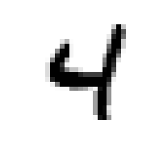
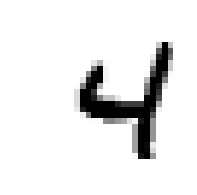
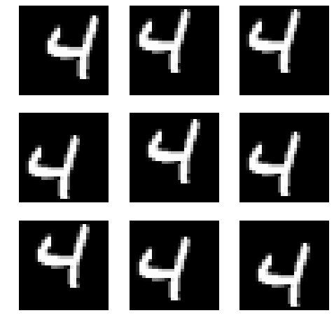
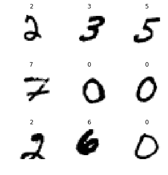
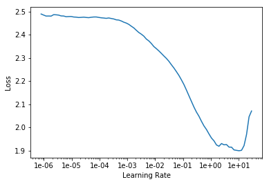
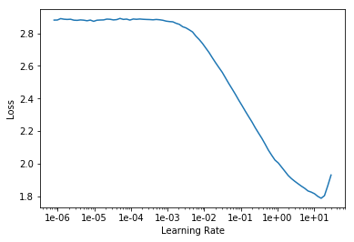

<h1>Table of Contents<span class="tocSkip"></span></h1>
<div class="toc"><ul class="toc-item"><li><span><a href="#MNIST-CNN" data-toc-modified-id="MNIST-CNN-1"><span class="toc-item-num">1&nbsp;&nbsp;</span>MNIST CNN</a></span><ul class="toc-item"><li><span><a href="#Data" data-toc-modified-id="Data-1.1"><span class="toc-item-num">1.1&nbsp;&nbsp;</span>Data</a></span><ul class="toc-item"><li><span><a href="#下载完整MNIST" data-toc-modified-id="下载完整MNIST-1.1.1"><span class="toc-item-num">1.1.1&nbsp;&nbsp;</span>下载完整MNIST</a></span></li><li><span><a href="#利用data-block-api-分布实现DataBunch构建" data-toc-modified-id="利用data-block-api-分布实现DataBunch构建-1.1.2"><span class="toc-item-num">1.1.2&nbsp;&nbsp;</span>利用data block api 分布实现DataBunch构建</a></span></li><li><span><a href="#ImageList-的内容可以通过items查看" data-toc-modified-id="ImageList-的内容可以通过items查看-1.1.3"><span class="toc-item-num">1.1.3&nbsp;&nbsp;</span>ImageList 的内容可以通过items查看</a></span></li><li><span><a href="#将fastai的图片颜色设置为二元" data-toc-modified-id="将fastai的图片颜色设置为二元-1.1.4"><span class="toc-item-num">1.1.4&nbsp;&nbsp;</span>将fastai的图片颜色设置为二元</a></span></li><li><span><a href="#展示ImageList的内容" data-toc-modified-id="展示ImageList的内容-1.1.5"><span class="toc-item-num">1.1.5&nbsp;&nbsp;</span>展示ImageList的内容</a></span></li><li><span><a href="#展示ImageList的第一个内容（图片）" data-toc-modified-id="展示ImageList的第一个内容（图片）-1.1.6"><span class="toc-item-num">1.1.6&nbsp;&nbsp;</span>展示ImageList的第一个内容（图片）</a></span></li><li><span><a href="#如何查分数据集成训练，验证和测试集" data-toc-modified-id="如何查分数据集成训练，验证和测试集-1.1.7"><span class="toc-item-num">1.1.7&nbsp;&nbsp;</span>如何查分数据集成训练，验证和测试集</a></span></li><li><span><a href="#查看分割后的ImageList" data-toc-modified-id="查看分割后的ImageList-1.1.8"><span class="toc-item-num">1.1.8&nbsp;&nbsp;</span>查看分割后的ImageList</a></span></li><li><span><a href="#查看‘training’文件夹内容" data-toc-modified-id="查看‘training’文件夹内容-1.1.9"><span class="toc-item-num">1.1.9&nbsp;&nbsp;</span>查看‘training’文件夹内容</a></span></li><li><span><a href="#如何基于文件夹提取标注" data-toc-modified-id="如何基于文件夹提取标注-1.1.10"><span class="toc-item-num">1.1.10&nbsp;&nbsp;</span>如何基于文件夹提取标注</a></span></li><li><span><a href="#如何提取一个training-样本来查看" data-toc-modified-id="如何提取一个training-样本来查看-1.1.11"><span class="toc-item-num">1.1.11&nbsp;&nbsp;</span>如何提取一个training 样本来查看</a></span></li><li><span><a href="#如何为训练和验证集图片做变形设置" data-toc-modified-id="如何为训练和验证集图片做变形设置-1.1.12"><span class="toc-item-num">1.1.12&nbsp;&nbsp;</span>如何为训练和验证集图片做变形设置</a></span></li><li><span><a href="#构建DataBunch时，在什么情况下不用Imagenet.stats" data-toc-modified-id="构建DataBunch时，在什么情况下不用Imagenet.stats-1.1.13"><span class="toc-item-num">1.1.13&nbsp;&nbsp;</span>构建DataBunch时，在什么情况下不用Imagenet.stats</a></span></li><li><span><a href="#如何展示一个DataBunch的训练样本" data-toc-modified-id="如何展示一个DataBunch的训练样本-1.1.14"><span class="toc-item-num">1.1.14&nbsp;&nbsp;</span>如何展示一个DataBunch的训练样本</a></span></li><li><span><a href="#如何展示训练样本的变形效果" data-toc-modified-id="如何展示训练样本的变形效果-1.1.15"><span class="toc-item-num">1.1.15&nbsp;&nbsp;</span>如何展示训练样本的变形效果</a></span></li><li><span><a href="#如何获取一个批量的训练样本？" data-toc-modified-id="如何获取一个批量的训练样本？-1.1.16"><span class="toc-item-num">1.1.16&nbsp;&nbsp;</span>如何获取一个批量的训练样本？</a></span></li><li><span><a href="#如何展示一个批量中的图片和标注" data-toc-modified-id="如何展示一个批量中的图片和标注-1.1.17"><span class="toc-item-num">1.1.17&nbsp;&nbsp;</span>如何展示一个批量中的图片和标注</a></span></li><li><span><a href="#如何手动打造CNN" data-toc-modified-id="如何手动打造CNN-1.1.18"><span class="toc-item-num">1.1.18&nbsp;&nbsp;</span>如何手动打造CNN</a></span></li></ul></li><li><span><a href="#Basic-CNN-with-batchnorm" data-toc-modified-id="Basic-CNN-with-batchnorm-1.2"><span class="toc-item-num">1.2&nbsp;&nbsp;</span>Basic CNN with batchnorm</a></span><ul class="toc-item"><li><span><a href="#特制conv层（特定kernel大小，stride，padding大小）" data-toc-modified-id="特制conv层（特定kernel大小，stride，padding大小）-1.2.1"><span class="toc-item-num">1.2.1&nbsp;&nbsp;</span>特制conv层（特定kernel大小，stride，padding大小）</a></span></li><li><span><a href="#手动构建模型" data-toc-modified-id="手动构建模型-1.2.2"><span class="toc-item-num">1.2.2&nbsp;&nbsp;</span>手动构建模型</a></span></li><li><span><a href="#如何从模型结构变为Learner" data-toc-modified-id="如何从模型结构变为Learner-1.2.3"><span class="toc-item-num">1.2.3&nbsp;&nbsp;</span>如何从模型结构变为Learner</a></span></li><li><span><a href="#如何打印出Learner的内部细节" data-toc-modified-id="如何打印出Learner的内部细节-1.2.4"><span class="toc-item-num">1.2.4&nbsp;&nbsp;</span>如何打印出Learner的内部细节</a></span></li><li><span><a href="#如何启用模型生成预测值" data-toc-modified-id="如何启用模型生成预测值-1.2.5"><span class="toc-item-num">1.2.5&nbsp;&nbsp;</span>如何启用模型生成预测值</a></span></li><li><span><a href="#寻找学习率并作图" data-toc-modified-id="寻找学习率并作图-1.2.6"><span class="toc-item-num">1.2.6&nbsp;&nbsp;</span>寻找学习率并作图</a></span></li><li><span><a href="#训练模型-（挑选最优学习率）" data-toc-modified-id="训练模型-（挑选最优学习率）-1.2.7"><span class="toc-item-num">1.2.7&nbsp;&nbsp;</span>训练模型 （挑选最优学习率）</a></span></li></ul></li><li><span><a href="#Refactor" data-toc-modified-id="Refactor-1.3"><span class="toc-item-num">1.3&nbsp;&nbsp;</span>Refactor</a></span><ul class="toc-item"><li><span><a href="#如何将BatchNorm,-ReLU-也融入到一个conv创建函数里？" data-toc-modified-id="如何将BatchNorm,-ReLU-也融入到一个conv创建函数里？-1.3.1"><span class="toc-item-num">1.3.1&nbsp;&nbsp;</span>如何将BatchNorm, ReLU 也融入到一个conv创建函数里？</a></span></li><li><span><a href="#refactor后，建模变得更简练" data-toc-modified-id="refactor后，建模变得更简练-1.3.2"><span class="toc-item-num">1.3.2&nbsp;&nbsp;</span>refactor后，建模变得更简练</a></span></li><li><span><a href="#训练10次后，效果很好，虽然中间准确率有波动，但损失值一直在下降" data-toc-modified-id="训练10次后，效果很好，虽然中间准确率有波动，但损失值一直在下降-1.3.3"><span class="toc-item-num">1.3.3&nbsp;&nbsp;</span>训练10次后，效果很好，虽然中间准确率有波动，但损失值一直在下降</a></span></li></ul></li></ul></li><li><span><a href="#如何手写Resnet" data-toc-modified-id="如何手写Resnet-2"><span class="toc-item-num">2&nbsp;&nbsp;</span>如何手写Resnet</a></span><ul class="toc-item"><li><ul class="toc-item"><li><span><a href="#简易增大模型方法" data-toc-modified-id="简易增大模型方法-2.0.1"><span class="toc-item-num">2.0.1&nbsp;&nbsp;</span>简易增大模型方法</a></span></li><li><span><a href="#简易增大模型的弊端" data-toc-modified-id="简易增大模型的弊端-2.0.2"><span class="toc-item-num">2.0.2&nbsp;&nbsp;</span>简易增大模型的弊端</a></span></li><li><span><a href="#Kaiming-He的解决方案" data-toc-modified-id="Kaiming-He的解决方案-2.0.3"><span class="toc-item-num">2.0.3&nbsp;&nbsp;</span>Kaiming He的解决方案</a></span></li><li><span><a href="#为什么res-block有奇效？" data-toc-modified-id="为什么res-block有奇效？-2.0.4"><span class="toc-item-num">2.0.4&nbsp;&nbsp;</span>为什么res-block有奇效？</a></span></li></ul></li><li><span><a href="#Resnet-ish" data-toc-modified-id="Resnet-ish-2.1"><span class="toc-item-num">2.1&nbsp;&nbsp;</span>Resnet-ish</a></span><ul class="toc-item"><li><span><a href="#手写ResBlock" data-toc-modified-id="手写ResBlock-2.1.1"><span class="toc-item-num">2.1.1&nbsp;&nbsp;</span>手写ResBlock</a></span></li><li><span><a href="#fastai-res_block函数只需填入filter-数量即可" data-toc-modified-id="fastai-res_block函数只需填入filter-数量即可-2.1.2"><span class="toc-item-num">2.1.2&nbsp;&nbsp;</span>fastai res_block函数只需填入filter 数量即可</a></span></li><li><span><a href="#用resblock将模型层数提升到原来的3倍" data-toc-modified-id="用resblock将模型层数提升到原来的3倍-2.1.3"><span class="toc-item-num">2.1.3&nbsp;&nbsp;</span>用resblock将模型层数提升到原来的3倍</a></span></li><li><span><a href="#为什么要经常做refactor?" data-toc-modified-id="为什么要经常做refactor?-2.1.4"><span class="toc-item-num">2.1.4&nbsp;&nbsp;</span>为什么要经常做refactor?</a></span></li><li><span><a href="#如何将conv2-layer-与resblock合二为一" data-toc-modified-id="如何将conv2-layer-与resblock合二为一-2.1.5"><span class="toc-item-num">2.1.5&nbsp;&nbsp;</span>如何将conv2 layer 与resblock合二为一</a></span></li><li><span><a href="#其他流程不变" data-toc-modified-id="其他流程不变-2.1.6"><span class="toc-item-num">2.1.6&nbsp;&nbsp;</span>其他流程不变</a></span></li><li><span><a href="#ResNet在MNIST中的效果比较" data-toc-modified-id="ResNet在MNIST中的效果比较-2.1.7"><span class="toc-item-num">2.1.7&nbsp;&nbsp;</span>ResNet在MNIST中的效果比较</a></span></li><li><span><a href="#如何融合DenseBlock-and-Resblock?" data-toc-modified-id="如何融合DenseBlock-and-Resblock?-2.1.8"><span class="toc-item-num">2.1.8&nbsp;&nbsp;</span>如何融合DenseBlock and Resblock?</a></span></li><li><span><a href="#如何理解Dense-net工作原理和特点？" data-toc-modified-id="如何理解Dense-net工作原理和特点？-2.1.9"><span class="toc-item-num">2.1.9&nbsp;&nbsp;</span>如何理解Dense net工作原理和特点？</a></span></li></ul></li></ul></li><li><span><a href="#fin" data-toc-modified-id="fin-3"><span class="toc-item-num">3&nbsp;&nbsp;</span>fin</a></span></li></ul></div>

[Jeremy的视频解读1:59-11:02](https://ytcropper.com/cropped/9s5c88ff61b47c5)

## MNIST CNN


```python
%reload_ext autoreload
%autoreload 2
%matplotlib inline
```


```python
from fastai.vision import *
```

### Data

#### 下载完整MNIST


```python
path = untar_data(URLs.MNIST)
```


```python
path.ls()
```


    [PosixPath('/home/ubuntu/.fastai/data/mnist_png/training'),
     PosixPath('/home/ubuntu/.fastai/data/mnist_png/testing')]


#### 利用data block api 分布实现DataBunch构建


```python
il = ImageList.from_folder(path, # recursively 提取文件夹中图片和label信息
                           convert_mode='L' # 图片按照黑白取色)
```

#### ImageList 的内容可以通过items查看


```python
il.items[0] 
```


    PosixPath('/home/ubuntu/.fastai/data/mnist_png/training/4/44688.png')


#### 将fastai的图片颜色设置为二元


```python
defaults.cmap='binary' # 通常是RGB
```

#### 展示ImageList的内容


```python
il 
```


    ImageList (70000 items)
    [Image (1, 28, 28), Image (1, 28, 28), Image (1, 28, 28), Image (1, 28, 28), Image (1, 28, 28)]...
    Path: /home/ubuntu/.fastai/data/mnist_png


#### 展示ImageList的第一个内容（图片）


```python
il[0].show()
```





#### 如何查分数据集成训练，验证和测试集


```python
sd = il.split_by_folder(train='training', valid='testing')
# 这里的'testing' 文件夹里是含有标注的数据（也就是验证集），不是真正意义上的无标注测试集
```

#### 查看分割后的ImageList


```python
sd
```


    ItemLists;
    
    Train: ImageList (60000 items)
    [Image (1, 28, 28), Image (1, 28, 28), Image (1, 28, 28), Image (1, 28, 28), Image (1, 28, 28)]...
    Path: /home/ubuntu/.fastai/data/mnist_png;
    
    Valid: ImageList (10000 items)
    [Image (1, 28, 28), Image (1, 28, 28), Image (1, 28, 28), Image (1, 28, 28), Image (1, 28, 28)]...
    Path: /home/ubuntu/.fastai/data/mnist_png;
    
    Test: None


#### 查看‘training’文件夹内容


```python
(path/'training').ls() # 一个类别一个子文件夹
```


    [PosixPath('/home/ubuntu/.fastai/data/mnist_png/training/4'),
     PosixPath('/home/ubuntu/.fastai/data/mnist_png/training/6'),
     PosixPath('/home/ubuntu/.fastai/data/mnist_png/training/8'),
     PosixPath('/home/ubuntu/.fastai/data/mnist_png/training/0'),
     PosixPath('/home/ubuntu/.fastai/data/mnist_png/training/9'),
     PosixPath('/home/ubuntu/.fastai/data/mnist_png/training/1'),
     PosixPath('/home/ubuntu/.fastai/data/mnist_png/training/3'),
     PosixPath('/home/ubuntu/.fastai/data/mnist_png/training/2'),
     PosixPath('/home/ubuntu/.fastai/data/mnist_png/training/5'),
     PosixPath('/home/ubuntu/.fastai/data/mnist_png/training/7')]


#### 如何基于文件夹提取标注


```python
ll = sd.label_from_folder() 
```


```python
ll # 注意查看 哪些是LabelLists, CategoryList, ImageList
```


    LabelLists;
    
    Train: LabelList
    y: CategoryList (60000 items)
    [Category 4, Category 4, Category 4, Category 4, Category 4]...
    Path: /home/ubuntu/.fastai/data/mnist_png
    x: ImageList (60000 items)
    [Image (1, 28, 28), Image (1, 28, 28), Image (1, 28, 28), Image (1, 28, 28), Image (1, 28, 28)]...
    Path: /home/ubuntu/.fastai/data/mnist_png;
    
    Valid: LabelList
    y: CategoryList (10000 items)
    [Category 4, Category 4, Category 4, Category 4, Category 4]...
    Path: /home/ubuntu/.fastai/data/mnist_png
    x: ImageList (10000 items)
    [Image (1, 28, 28), Image (1, 28, 28), Image (1, 28, 28), Image (1, 28, 28), Image (1, 28, 28)]...
    Path: /home/ubuntu/.fastai/data/mnist_png;
    
    Test: None


#### 如何提取一个training 样本来查看


```python
x,y = ll.train[0]
```


```python
x.show()
print(y,x.shape)
```

    4 torch.Size([1, 28, 28])


#### 如何为训练和验证集图片做变形设置


```python
tfms = ([*rand_pad(padding=3, size=28, mode='zeros')], [])
# rand_pad = 做random padding， 注意args
# * 代表接受多个输出值
# 第一个[]针对训练集图片，第二个 []针对验证集图片
```


```python
ll = ll.transform(tfms)
```

#### 构建DataBunch时，在什么情况下不用Imagenet.stats


```python
bs = 128
```


```python
# 在不使用pre-trained model时，不用Imagenet.stats
data = ll.databunch(bs=bs).normalize()
```

#### 如何展示一个DataBunch的训练样本


```python
x,y = data.train_ds[0]
```


```python
x.show()
print(y)
```

    4





#### 如何展示训练样本的变形效果
- 从LL到DataBunch，图片被加入了形变，批量和normalization
- 因为是随机padding,每次变形都不太一样


```python
def _plot(i,j,ax): data.train_ds[0][0].show(ax, cmap='gray')
plot_multi(_plot, 3, 3, figsize=(8,8))
```





#### 如何获取一个批量的训练样本？


```python
xb,yb = data.one_batch()
xb.shape,yb.shape
```


    (torch.Size([128, 1, 28, 28]), torch.Size([128]))


#### 如何展示一个批量中的图片和标注


```python
data.show_batch(rows=3, figsize=(5,5))
```





#### 如何手动打造CNN
- [视频 11：00-16：56](https://ytcropper.com/cropped/9s5c8a5d05974fd)

### Basic CNN with batchnorm

#### 特制conv层（特定kernel大小，stride，padding大小）


```python
def conv(ni,nf): return nn.Conv2d(ni, nf, kernel_size=3, stride=2, padding=1)
```

#### 手动构建模型


```python
model = nn.Sequential(
    conv(1, 8), # num_input = 1 channel, num_filters = 8 (channels out), feature_map_size = 14
    nn.BatchNorm2d(8),
    nn.ReLU(),
    conv(8, 16), # num_filter自主选择，fm_size = 7, 因为stride=2， 14/2=7
    nn.BatchNorm2d(16),
    nn.ReLU(),
    conv(16, 32), # 4 = 7/2 = 3.5 四舍五入，得到4； 选择filter数量为32
    nn.BatchNorm2d(32),
    nn.ReLU(),
    conv(32, 16), # 2 = 4/2 = fm_size; 选择性降低filter的数量到16
    nn.BatchNorm2d(16),
    nn.ReLU(),
    conv(16, 10), # 1， 在下降到10，因为我们要分出10个类别， 获得（10，1，1），但损失函数只接受vector
    nn.BatchNorm2d(10),
    Flatten()     # remove (1,1) grid， 生成含有10个值的vector向量
)
```

#### 如何从模型结构变为Learner


```python
learn = Learner(data, model, loss_func = nn.CrossEntropyLoss(), metrics=accuracy)
```

#### 如何打印出Learner的内部细节


```python
print(learn.summary())
# 注意shape，param数量，注意哪些层是可训练的
```

    ======================================================================
    Layer (type)         Output Shape         Param #    Trainable 
    ======================================================================
    Conv2d               [128, 8, 14, 14]     80         True      
    ______________________________________________________________________
    BatchNorm2d          [128, 8, 14, 14]     16         True      
    ______________________________________________________________________
    ReLU                 [128, 8, 14, 14]     0          False     
    ______________________________________________________________________
    Conv2d               [128, 16, 7, 7]      1168       True      
    ______________________________________________________________________
    BatchNorm2d          [128, 16, 7, 7]      32         True      
    ______________________________________________________________________
    ReLU                 [128, 16, 7, 7]      0          False     
    ______________________________________________________________________
    Conv2d               [128, 32, 4, 4]      4640       True      
    ______________________________________________________________________
    BatchNorm2d          [128, 32, 4, 4]      64         True      
    ______________________________________________________________________
    ReLU                 [128, 32, 4, 4]      0          False     
    ______________________________________________________________________
    Conv2d               [128, 16, 2, 2]      4624       True      
    ______________________________________________________________________
    BatchNorm2d          [128, 16, 2, 2]      32         True      
    ______________________________________________________________________
    ReLU                 [128, 16, 2, 2]      0          False     
    ______________________________________________________________________
    Conv2d               [128, 10, 1, 1]      1450       True      
    ______________________________________________________________________
    BatchNorm2d          [128, 10, 1, 1]      20         True      
    ______________________________________________________________________
    Flatten              [128, 10]            0          False     
    ______________________________________________________________________
    
    Total params: 12126
    Total trainable params: 12126
    Total non-trainable params: 0
    


#### 如何启用模型生成预测值


```python
xb = xb.cuda() # 让数据在GPU上运行
```


```python
model(xb).shape # 生成预测值
```


    torch.Size([128, 10])


#### 寻找学习率并作图


```python
learn.lr_find(end_lr=100)
```


    LR Finder is complete, type {learner_name}.recorder.plot() to see the graph.


```python
learn.recorder.plot()
```





#### 训练模型 （挑选最优学习率）


```python
learn.fit_one_cycle(3, max_lr=0.1)
```


Total time: 00:30 <p><table style='width:300px; margin-bottom:10px'>
  <tr>
    <th>epoch</th>
    <th>train_loss</th>
    <th>valid_loss</th>
    <th>accuracy</th>
  </tr>
  <tr>
    <th>1</th>
    <th>0.223167</th>
    <th>0.217859</th>
    <th>0.930500</th>
  </tr>
  <tr>
    <th>2</th>
    <th>0.136179</th>
    <th>0.078651</th>
    <th>0.976400</th>
  </tr>
  <tr>
    <th>3</th>
    <th>0.072080</th>
    <th>0.038664</th>
    <th>0.988600</th>
  </tr>
</table>


### Refactor

#### 如何将BatchNorm, ReLU 也融入到一个conv创建函数里？


```python
def conv2(ni,nf): return conv_layer(ni,nf,stride=2) # fastai提供了conv_layer
```

#### refactor后，建模变得更简练


```python
model = nn.Sequential(
    conv2(1, 8),   # 14, 非常便捷，只用在意输入输出channel数量即可
    conv2(8, 16),  # 7
    conv2(16, 32), # 4
    conv2(32, 16), # 2
    conv2(16, 10), # 1
    Flatten()      # remove (1,1) grid
)
```


```python
learn = Learner(data, model, loss_func = nn.CrossEntropyLoss(), metrics=accuracy)
```

#### 训练10次后，效果很好，虽然中间准确率有波动，但损失值一直在下降


```python
learn.fit_one_cycle(10, max_lr=0.1)
```


Total time: 01:12 <p><table style='width:300px; margin-bottom:10px'>
  <tr>
    <th>epoch</th>
    <th>train_loss</th>
    <th>valid_loss</th>
    <th>accuracy</th>
  </tr>
  <tr>
    <th>1</th>
    <th>0.228332</th>
    <th>0.206325</th>
    <th>0.937500</th>
  </tr>
  <tr>
    <th>2</th>
    <th>0.189966</th>
    <th>0.192558</th>
    <th>0.940800</th>
  </tr>
  <tr>
    <th>3</th>
    <th>0.156765</th>
    <th>0.092810</th>
    <th>0.969100</th>
  </tr>
  <tr>
    <th>4</th>
    <th>0.135871</th>
    <th>0.083914</th>
    <th>0.973300</th>
  </tr>
  <tr>
    <th>5</th>
    <th>0.108844</th>
    <th>0.071582</th>
    <th>0.978000</th>
  </tr>
  <tr>
    <th>6</th>
    <th>0.105887</th>
    <th>0.128586</th>
    <th>0.960200</th>
  </tr>
  <tr>
    <th>7</th>
    <th>0.080699</th>
    <th>0.052754</th>
    <th>0.983200</th>
  </tr>
  <tr>
    <th>8</th>
    <th>0.066007</th>
    <th>0.037588</th>
    <th>0.988600</th>
  </tr>
  <tr>
    <th>9</th>
    <th>0.047513</th>
    <th>0.030255</th>
    <th>0.990200</th>
  </tr>
  <tr>
    <th>10</th>
    <th>0.044705</th>
    <th>0.028373</th>
    <th>0.991600</th>
  </tr>
</table>


## 如何手写Resnet
- [视频剪切16:25-31:05](https://ytcropper.com/cropped/9s5c8ae39a0501c)

#### 简易增大模型方法
- 每个conv2 layer后面加一个conv1 layer,这样不会改变feature map的大小，可以模型层数可以无限扩大

#### 简易增大模型的弊端
- 
- 对比plain 20 vs 45 层模型，居然浅层模型损失值降得更低，很反常，为什么？

#### Kaiming He的解决方案
- 
- 新设计让56层模型效果至少应该和20层模型一样
- 所有人都应该尝试将Resnet之前有趣的论文，尝试套入Res-block设计，看看有多少增效

#### 为什么res-block有奇效？
- 

### Resnet-ish

#### 手写ResBlock


```python
class ResBlock(nn.Module):
    def __init__(self, nf):
        super().__init__()
        self.conv1 = conv_layer(nf,nf)
        self.conv2 = conv_layer(nf,nf)
        
    def forward(self, x): return x + self.conv2(self.conv1(x))
```

#### fastai res_block函数只需填入filter 数量即可


```python
help(res_block)
```

    Help on function res_block in module fastai.layers:
    
    res_block(nf, dense:bool=False, norm_type:Union[fastai.layers.NormType, NoneType]=<NormType.Batch: 1>, bottle:bool=False, **kwargs)
        Resnet block of `nf` features.
    


#### 用resblock将模型层数提升到原来的3倍


```python
model = nn.Sequential(
    conv2(1, 8),
    res_block(8), # 不改变原feature mapd饿大小
    conv2(8, 16),
    res_block(16),
    conv2(16, 32),
    res_block(32),
    conv2(32, 16),
    res_block(16),
    conv2(16, 10),
    Flatten()
)
```

#### 为什么要经常做refactor?
- 减少出错可能
- 代码更精炼简洁

#### 如何将conv2 layer 与resblock合二为一


```python
def conv_and_res(ni,nf): return nn.Sequential(conv2(ni, nf), res_block(nf))
```

#### 其他流程不变


```python
model = nn.Sequential(
    conv_and_res(1, 8),
    conv_and_res(8, 16),
    conv_and_res(16, 32),
    conv_and_res(32, 16),
    conv2(16, 10),
    Flatten()
)
```


```python
learn = Learner(data, model, loss_func = nn.CrossEntropyLoss(), metrics=accuracy)
```


```python
learn.lr_find(end_lr=100)
learn.recorder.plot()
```

    LR Finder is complete, type {learner_name}.recorder.plot() to see the graph.





```python
learn.fit_one_cycle(12, max_lr=0.05)
```


Total time: 02:00 <p><table style='width:300px; margin-bottom:10px'>
  <tr>
    <th>epoch</th>
    <th>train_loss</th>
    <th>valid_loss</th>
    <th>accuracy</th>
  </tr>
  <tr>
    <th>1</th>
    <th>0.248807</th>
    <th>0.121582</th>
    <th>0.972800</th>
  </tr>
  <tr>
    <th>2</th>
    <th>0.120927</th>
    <th>0.360583</th>
    <th>0.890300</th>
  </tr>
  <tr>
    <th>3</th>
    <th>0.104013</th>
    <th>0.074916</th>
    <th>0.977800</th>
  </tr>
  <tr>
    <th>4</th>
    <th>0.081181</th>
    <th>0.065717</th>
    <th>0.980000</th>
  </tr>
  <tr>
    <th>5</th>
    <th>0.068514</th>
    <th>0.096448</th>
    <th>0.967200</th>
  </tr>
  <tr>
    <th>6</th>
    <th>0.061274</th>
    <th>0.087955</th>
    <th>0.971800</th>
  </tr>
  <tr>
    <th>7</th>
    <th>0.051673</th>
    <th>0.033911</th>
    <th>0.989400</th>
  </tr>
  <tr>
    <th>8</th>
    <th>0.048090</th>
    <th>0.033234</th>
    <th>0.988800</th>
  </tr>
  <tr>
    <th>9</th>
    <th>0.039095</th>
    <th>0.024638</th>
    <th>0.992400</th>
  </tr>
  <tr>
    <th>10</th>
    <th>0.023670</th>
    <th>0.021215</th>
    <th>0.993400</th>
  </tr>
  <tr>
    <th>11</th>
    <th>0.019128</th>
    <th>0.016159</th>
    <th>0.994500</th>
  </tr>
  <tr>
    <th>12</th>
    <th>0.021365</th>
    <th>0.016120</th>
    <th>0.995200</th>
  </tr>
</table>


#### ResNet在MNIST中的效果比较
- 
- 12次训练就打到数年前的顶级水平
- 因为resent的简易和奇效，得到偏爱，主流library花费大量时间优化Resnet，让其速度更快；而新出炉的设计往往训练较慢

#### 如何融合DenseBlock and Resblock?
- 
- 什么是x.orig? -> original input
- 什么是fastai的Resblock 设计

#### 如何理解Dense net工作原理和特点？
- 
- 占用很多内存
- 但参数很少，需要较少图片
- 适用于image segmentation


```python
print(learn.summary())
```

    ======================================================================
    Layer (type)         Output Shape         Param #    Trainable 
    ======================================================================
    Conv2d               [128, 8, 14, 14]     72         True      
    ______________________________________________________________________
    ReLU                 [128, 8, 14, 14]     0          False     
    ______________________________________________________________________
    BatchNorm2d          [128, 8, 14, 14]     16         True      
    ______________________________________________________________________
    Conv2d               [128, 8, 14, 14]     576        True      
    ______________________________________________________________________
    ReLU                 [128, 8, 14, 14]     0          False     
    ______________________________________________________________________
    BatchNorm2d          [128, 8, 14, 14]     16         True      
    ______________________________________________________________________
    Conv2d               [128, 8, 14, 14]     576        True      
    ______________________________________________________________________
    ReLU                 [128, 8, 14, 14]     0          False     
    ______________________________________________________________________
    BatchNorm2d          [128, 8, 14, 14]     16         True      
    ______________________________________________________________________
    MergeLayer           [128, 8, 14, 14]     0          False     
    ______________________________________________________________________
    Conv2d               [128, 16, 7, 7]      1152       True      
    ______________________________________________________________________
    ReLU                 [128, 16, 7, 7]      0          False     
    ______________________________________________________________________
    BatchNorm2d          [128, 16, 7, 7]      32         True      
    ______________________________________________________________________
    Conv2d               [128, 16, 7, 7]      2304       True      
    ______________________________________________________________________
    ReLU                 [128, 16, 7, 7]      0          False     
    ______________________________________________________________________
    BatchNorm2d          [128, 16, 7, 7]      32         True      
    ______________________________________________________________________
    Conv2d               [128, 16, 7, 7]      2304       True      
    ______________________________________________________________________
    ReLU                 [128, 16, 7, 7]      0          False     
    ______________________________________________________________________
    BatchNorm2d          [128, 16, 7, 7]      32         True      
    ______________________________________________________________________
    MergeLayer           [128, 16, 7, 7]      0          False     
    ______________________________________________________________________
    Conv2d               [128, 32, 4, 4]      4608       True      
    ______________________________________________________________________
    ReLU                 [128, 32, 4, 4]      0          False     
    ______________________________________________________________________
    BatchNorm2d          [128, 32, 4, 4]      64         True      
    ______________________________________________________________________
    Conv2d               [128, 32, 4, 4]      9216       True      
    ______________________________________________________________________
    ReLU                 [128, 32, 4, 4]      0          False     
    ______________________________________________________________________
    BatchNorm2d          [128, 32, 4, 4]      64         True      
    ______________________________________________________________________
    Conv2d               [128, 32, 4, 4]      9216       True      
    ______________________________________________________________________
    ReLU                 [128, 32, 4, 4]      0          False     
    ______________________________________________________________________
    BatchNorm2d          [128, 32, 4, 4]      64         True      
    ______________________________________________________________________
    MergeLayer           [128, 32, 4, 4]      0          False     
    ______________________________________________________________________
    Conv2d               [128, 16, 2, 2]      4608       True      
    ______________________________________________________________________
    ReLU                 [128, 16, 2, 2]      0          False     
    ______________________________________________________________________
    BatchNorm2d          [128, 16, 2, 2]      32         True      
    ______________________________________________________________________
    Conv2d               [128, 16, 2, 2]      2304       True      
    ______________________________________________________________________
    ReLU                 [128, 16, 2, 2]      0          False     
    ______________________________________________________________________
    BatchNorm2d          [128, 16, 2, 2]      32         True      
    ______________________________________________________________________
    Conv2d               [128, 16, 2, 2]      2304       True      
    ______________________________________________________________________
    ReLU                 [128, 16, 2, 2]      0          False     
    ______________________________________________________________________
    BatchNorm2d          [128, 16, 2, 2]      32         True      
    ______________________________________________________________________
    MergeLayer           [128, 16, 2, 2]      0          False     
    ______________________________________________________________________
    Conv2d               [128, 10, 1, 1]      1440       True      
    ______________________________________________________________________
    ReLU                 [128, 10, 1, 1]      0          False     
    ______________________________________________________________________
    BatchNorm2d          [128, 10, 1, 1]      20         True      
    ______________________________________________________________________
    Flatten              [128, 10]            0          False     
    ______________________________________________________________________
    
    Total params: 41132
    Total trainable params: 41132
    Total non-trainable params: 0
    


## fin

<h1>Table of Contents<span class="tocSkip"></span></h1>
<div class="toc"><ul class="toc-item"><li><span><a href="#MNIST-CNN" data-toc-modified-id="MNIST-CNN-1"><span class="toc-item-num">1&nbsp;&nbsp;</span>MNIST CNN</a></span><ul class="toc-item"><li><span><a href="#Data" data-toc-modified-id="Data-1.1"><span class="toc-item-num">1.1&nbsp;&nbsp;</span>Data</a></span><ul class="toc-item"><li><span><a href="#下载完整MNIST" data-toc-modified-id="下载完整MNIST-1.1.1"><span class="toc-item-num">1.1.1&nbsp;&nbsp;</span>下载完整MNIST</a></span></li><li><span><a href="#利用data-block-api-分布实现DataBunch构建" data-toc-modified-id="利用data-block-api-分布实现DataBunch构建-1.1.2"><span class="toc-item-num">1.1.2&nbsp;&nbsp;</span>利用data block api 分布实现DataBunch构建</a></span></li><li><span><a href="#ImageList-的内容可以通过items查看" data-toc-modified-id="ImageList-的内容可以通过items查看-1.1.3"><span class="toc-item-num">1.1.3&nbsp;&nbsp;</span>ImageList 的内容可以通过items查看</a></span></li><li><span><a href="#将fastai的图片颜色设置为二元" data-toc-modified-id="将fastai的图片颜色设置为二元-1.1.4"><span class="toc-item-num">1.1.4&nbsp;&nbsp;</span>将fastai的图片颜色设置为二元</a></span></li></ul></li><li><span><a href="#Basic-CNN-with-batchnorm" data-toc-modified-id="Basic-CNN-with-batchnorm-1.2"><span class="toc-item-num">1.2&nbsp;&nbsp;</span>Basic CNN with batchnorm</a></span></li><li><span><a href="#Refactor" data-toc-modified-id="Refactor-1.3"><span class="toc-item-num">1.3&nbsp;&nbsp;</span>Refactor</a></span></li><li><span><a href="#Resnet-ish" data-toc-modified-id="Resnet-ish-1.4"><span class="toc-item-num">1.4&nbsp;&nbsp;</span>Resnet-ish</a></span></li></ul></li><li><span><a href="#fin" data-toc-modified-id="fin-2"><span class="toc-item-num">2&nbsp;&nbsp;</span>fin</a></span></li></ul></div>
