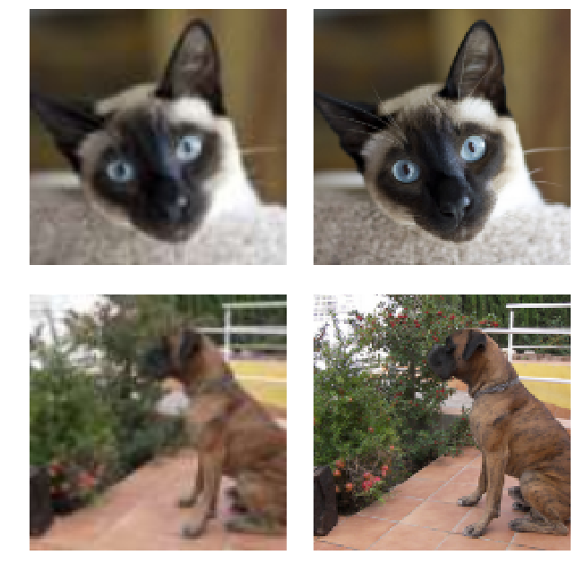
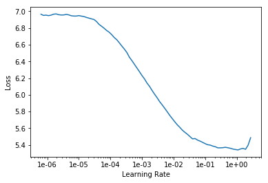
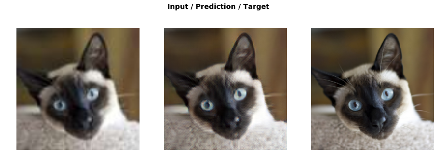
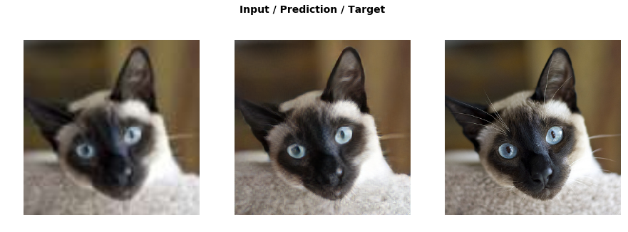
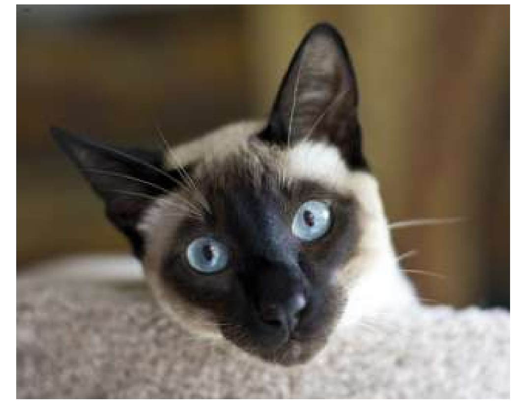
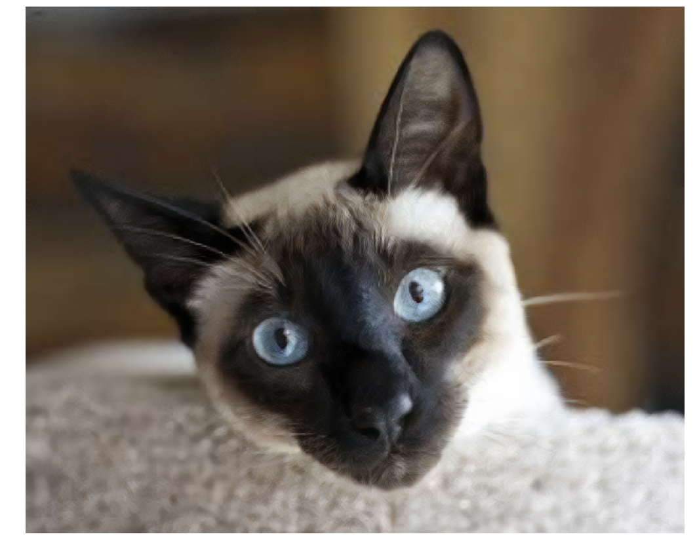

<h1>Table of Contents<span class="tocSkip"></span></h1>
<div class="toc"><ul class="toc-item"><li><span><a href="#Super-resolution" data-toc-modified-id="Super-resolution-1"><span class="toc-item-num">1&nbsp;&nbsp;</span>Super resolution</a></span><ul class="toc-item"><li><ul class="toc-item"><li><span><a href="#所需library" data-toc-modified-id="所需library-1.0.1"><span class="toc-item-num">1.0.1&nbsp;&nbsp;</span>所需library</a></span></li><li><span><a href="#下载数据，准备文件夹路径" data-toc-modified-id="下载数据，准备文件夹路径-1.0.2"><span class="toc-item-num">1.0.2&nbsp;&nbsp;</span>下载数据，准备文件夹路径</a></span></li><li><span><a href="#从原图中生成Image-List-il" data-toc-modified-id="从原图中生成Image-List-il-1.0.3"><span class="toc-item-num">1.0.3&nbsp;&nbsp;</span>从原图中生成Image List il</a></span></li><li><span><a href="#设计crappify函数" data-toc-modified-id="设计crappify函数-1.0.4"><span class="toc-item-num">1.0.4&nbsp;&nbsp;</span>设计crappify函数</a></span></li><li><span><a href="#生成low和medium两个文件夹图片（parallel）" data-toc-modified-id="生成low和medium两个文件夹图片（parallel）-1.0.5"><span class="toc-item-num">1.0.5&nbsp;&nbsp;</span>生成low和medium两个文件夹图片（parallel）</a></span></li><li><span><a href="#构建src,-采用ImageImageList,-采用low-images作为训练Xfeatures-图" data-toc-modified-id="构建src,-采用ImageImageList,-采用low-images作为训练Xfeatures-图-1.0.6"><span class="toc-item-num">1.0.6&nbsp;&nbsp;</span>构建src, 采用ImageImageList, 采用low images作为训练Xfeatures 图</a></span></li><li><span><a href="#设置生成DataBunch函数，将high-image-作为label,-只对y做变形和normalize" data-toc-modified-id="设置生成DataBunch函数，将high-image-作为label,-只对y做变形和normalize-1.0.7"><span class="toc-item-num">1.0.7&nbsp;&nbsp;</span>设置生成DataBunch函数，将high image 作为label, 只对y做变形和normalize</a></span></li></ul></li></ul></li><li><span><a href="#Feature-loss" data-toc-modified-id="Feature-loss-2"><span class="toc-item-num">2&nbsp;&nbsp;</span>Feature loss</a></span><ul class="toc-item"><li><ul class="toc-item"><li><span><a href="#gram_matrix" data-toc-modified-id="gram_matrix-2.0.1"><span class="toc-item-num">2.0.1&nbsp;&nbsp;</span>gram_matrix</a></span></li><li><span><a href="#base-loss-L1" data-toc-modified-id="base-loss-L1-2.0.2"><span class="toc-item-num">2.0.2&nbsp;&nbsp;</span>base loss L1</a></span></li><li><span><a href="#调用pretrained-model-vgg" data-toc-modified-id="调用pretrained-model-vgg-2.0.3"><span class="toc-item-num">2.0.3&nbsp;&nbsp;</span>调用pretrained model vgg</a></span></li><li><span><a href="#get-all-layers-before-grid-size-changes" data-toc-modified-id="get-all-layers-before-grid-size-changes-2.0.4"><span class="toc-item-num">2.0.4&nbsp;&nbsp;</span>get all layers before grid size changes</a></span></li><li><span><a href="#设计Feature-loss" data-toc-modified-id="设计Feature-loss-2.0.5"><span class="toc-item-num">2.0.5&nbsp;&nbsp;</span>设计Feature loss</a></span></li></ul></li></ul></li><li><span><a href="#Train" data-toc-modified-id="Train-3"><span class="toc-item-num">3&nbsp;&nbsp;</span>Train</a></span><ul class="toc-item"><li><ul class="toc-item"><li><span><a href="#构建含有feature-loss的Unet" data-toc-modified-id="构建含有feature-loss的Unet-3.0.1"><span class="toc-item-num">3.0.1&nbsp;&nbsp;</span>构建含有feature loss的Unet</a></span></li><li><span><a href="#封冻训练" data-toc-modified-id="封冻训练-3.0.2"><span class="toc-item-num">3.0.2&nbsp;&nbsp;</span>封冻训练</a></span></li><li><span><a href="#解冻训练" data-toc-modified-id="解冻训练-3.0.3"><span class="toc-item-num">3.0.3&nbsp;&nbsp;</span>解冻训练</a></span></li><li><span><a href="#选择更大数据图片尺寸，再训练" data-toc-modified-id="选择更大数据图片尺寸，再训练-3.0.4"><span class="toc-item-num">3.0.4&nbsp;&nbsp;</span>选择更大数据图片尺寸，再训练</a></span></li><li><span><a href="#验证模型的好坏，采用medium-input-image来提升像素，看效果" data-toc-modified-id="验证模型的好坏，采用medium-input-image来提升像素，看效果-3.0.5"><span class="toc-item-num">3.0.5&nbsp;&nbsp;</span>验证模型的好坏，采用medium input image来提升像素，看效果</a></span></li></ul></li></ul></li><li><span><a href="#Test" data-toc-modified-id="Test-4"><span class="toc-item-num">4&nbsp;&nbsp;</span>Test</a></span><ul class="toc-item"><li><ul class="toc-item"><li><span><a href="#我们能用这个模型做什么？" data-toc-modified-id="我们能用这个模型做什么？-4.0.1"><span class="toc-item-num">4.0.1&nbsp;&nbsp;</span>我们能用这个模型做什么？</a></span></li></ul></li></ul></li></ul></div>

[perceptual loss paper](https://ytcropper.com/cropped/9s5c8d849be4a94)    
[demo and brilliant outcome](https://ytcropper.com/cropped/9s5c8d8929bb35e)


## Super resolution

#### 所需library


```python
import fastai
from fastai.vision import *
from fastai.callbacks import *
from fastai.utils.mem import *

from torchvision.models import vgg16_bn
```

#### 下载数据，准备文件夹路径


```python
path = untar_data(URLs.PETS)
path_hr = path/'images' # high
path_lr = path/'small-96' # low
path_mr = path/'small-256' # medium
```

#### 从原图中生成Image List il


```python
il = ImageList.from_folder(path_hr)
```

#### 设计crappify函数


```python
def resize_one(fn, i, path, size):
    dest = path/fn.relative_to(path_hr)
    dest.parent.mkdir(parents=True, exist_ok=True)
    img = PIL.Image.open(fn)
    targ_sz = resize_to(img, size, use_min=True)
    img = img.resize(targ_sz, resample=PIL.Image.BILINEAR).convert('RGB')
    img.save(dest, quality=60)
```

#### 生成low和medium两个文件夹图片（parallel）


```python
# create smaller image sets the first time this nb is run
sets = [(path_lr, 96), (path_mr, 256)]
for p,size in sets:
    if not p.exists(): 
        print(f"resizing to {size} into {p}")
        parallel(partial(resize_one, path=p, size=size), il.items)
```

#### 构建src, 采用ImageImageList, 采用low images作为训练Xfeatures 图


```python
bs,size=32,128
arch = models.resnet34

src = ImageImageList.from_folder(path_lr).random_split_by_pct(0.1, seed=42)
```

#### 设置生成DataBunch函数，将high image 作为label, 只对y做变形和normalize


```python
def get_data(bs,size):
    data = (src.label_from_func(lambda x: path_hr/x.name)
           .transform(get_transforms(max_zoom=2.), size=size, tfm_y=True)
           .databunch(bs=bs).normalize(imagenet_stats, do_y=True))

    data.c = 3
    return data
```


```python
data = get_data(bs,size)
```


```python
data.show_batch(ds_type=DatasetType.Valid, rows=2, figsize=(9,9))
```





## Feature loss

#### gram_matrix


```python
t = data.valid_ds[0][1].data
t = torch.stack([t,t])
```


```python
def gram_matrix(x):
    n,c,h,w = x.size()
    x = x.view(n, c, -1)
    return (x @ x.transpose(1,2))/(c*h*w)
```


```python
gram_matrix(t)
```


    tensor([[[0.0759, 0.0711, 0.0643],
             [0.0711, 0.0672, 0.0614],
             [0.0643, 0.0614, 0.0573]],
    
            [[0.0759, 0.0711, 0.0643],
             [0.0711, 0.0672, 0.0614],
             [0.0643, 0.0614, 0.0573]]])


#### base loss L1


```python
base_loss = F.l1_loss # MSE and L1 没有本质区别，但Jeremy喜欢L1
```

#### 调用pretrained model vgg 


```python
vgg_m = vgg16_bn(True).features.cuda().eval() # 提取中间层特征，不取heads
requires_grad(vgg_m, False) # 不更新中间层的参数值
```

#### get all layers before grid size changes


```python
blocks = [i-1 for i,o in enumerate(children(vgg_m)) if isinstance(o,nn.MaxPool2d)]
blocks, [vgg_m[i] for i in blocks]
```


    ([5, 12, 22, 32, 42],
     [ReLU(inplace), ReLU(inplace), ReLU(inplace), ReLU(inplace), ReLU(inplace)])


#### 设计Feature loss


```python
class FeatureLoss(nn.Module):
    def __init__(self, m_feat, layer_ids, layer_wgts):
        super().__init__()
        self.m_feat = m_feat
        # get features of all the layers
        self.loss_features = [self.m_feat[i] for i in layer_ids] 
        # 通过hooks来获取哪些layers的features
        self.hooks = hook_outputs(self.loss_features, detach=False)
        self.wgts = layer_wgts
        self.metric_names = ['pixel',] + [f'feat_{i}' for i in range(len(layer_ids))
              ] + [f'gram_{i}' for i in range(len(layer_ids))]

    def make_features(self, x, clone=False):
        self.m_feat(x)
        return [(o.clone() if clone else o) for o in self.hooks.stored]
    
    def forward(self, input, target):
        out_feat = self.make_features(target, clone=True)
        in_feat = self.make_features(input)
        self.feat_losses = [base_loss(input,target)] # 计算L1
        # 计算每一个挑选出来中间层的L1
        self.feat_losses += [base_loss(f_in, f_out)*w
                             for f_in, f_out, w in zip(in_feat, out_feat, self.wgts)]
        self.feat_losses += [base_loss(gram_matrix(f_in), gram_matrix(f_out))*w**2 * 5e3
                             for f_in, f_out, w in zip(in_feat, out_feat, self.wgts)]
        # 这个callbacks可以方便打印出每一个中间层的loss
        self.metrics = dict(zip(self.metric_names, self.feat_losses))
        return sum(self.feat_losses)
    
    def __del__(self): self.hooks.remove()
```


```python
feat_loss = FeatureLoss(vgg_m, blocks[2:5], [5,15,2])
```

## Train

#### 构建含有feature loss的Unet


```python
wd = 1e-3
learn = unet_learner(data, arch, wd=wd, loss_func=feat_loss, callback_fns=LossMetrics,
                     blur=True, norm_type=NormType.Weight)
gc.collect();
```


```python
learn.lr_find()
learn.recorder.plot()
```

    LR Finder is complete, type {learner_name}.recorder.plot() to see the graph.





```python
lr = 1e-3
```

#### 封冻训练


```python
def do_fit(save_name, lrs=slice(lr), pct_start=0.9):
    learn.fit_one_cycle(10, lrs, pct_start=pct_start)
    learn.save(save_name)
    learn.show_results(rows=1, imgsize=5)
```


```python
do_fit('1a', slice(lr*10))
```


Total time: 11:16 <p><table style='width:750px; margin-bottom:10px'>
  <tr>
    <th>epoch</th>
    <th>train_loss</th>
    <th>valid_loss</th>
    <th>pixel</th>
    <th>feat_0</th>
    <th>feat_1</th>
    <th>feat_2</th>
    <th>gram_0</th>
    <th>gram_1</th>
    <th>gram_2</th>
  </tr>
  <tr>
    <th>1</th>
    <th>3.873667</th>
    <th>3.759143</th>
    <th>0.144560</th>
    <th>0.229806</th>
    <th>0.314573</th>
    <th>0.226204</th>
    <th>0.552578</th>
    <th>1.201812</th>
    <th>1.089610</th>
  </tr>
  <tr>
    <th>2</th>
    <th>3.756051</th>
    <th>3.650393</th>
    <th>0.145068</th>
    <th>0.228509</th>
    <th>0.308807</th>
    <th>0.218000</th>
    <th>0.534508</th>
    <th>1.164112</th>
    <th>1.051389</th>
  </tr>
  <tr>
    <th>3</th>
    <th>3.688726</th>
    <th>3.628370</th>
    <th>0.157359</th>
    <th>0.226753</th>
    <th>0.304955</th>
    <th>0.215417</th>
    <th>0.522482</th>
    <th>1.157941</th>
    <th>1.043464</th>
  </tr>
  <tr>
    <th>4</th>
    <th>3.628276</th>
    <th>3.524132</th>
    <th>0.145285</th>
    <th>0.225455</th>
    <th>0.300169</th>
    <th>0.211110</th>
    <th>0.497361</th>
    <th>1.124274</th>
    <th>1.020478</th>
  </tr>
  <tr>
    <th>5</th>
    <th>3.586930</th>
    <th>3.422895</th>
    <th>0.145161</th>
    <th>0.224946</th>
    <th>0.294471</th>
    <th>0.205117</th>
    <th>0.472445</th>
    <th>1.089540</th>
    <th>0.991215</th>
  </tr>
  <tr>
    <th>6</th>
    <th>3.528042</th>
    <th>3.394804</th>
    <th>0.142262</th>
    <th>0.220709</th>
    <th>0.289961</th>
    <th>0.201980</th>
    <th>0.478097</th>
    <th>1.083557</th>
    <th>0.978238</th>
  </tr>
  <tr>
    <th>7</th>
    <th>3.522416</th>
    <th>3.361185</th>
    <th>0.139654</th>
    <th>0.220379</th>
    <th>0.288046</th>
    <th>0.200114</th>
    <th>0.471151</th>
    <th>1.069787</th>
    <th>0.972054</th>
  </tr>
  <tr>
    <th>8</th>
    <th>3.469142</th>
    <th>3.338554</th>
    <th>0.142112</th>
    <th>0.219271</th>
    <th>0.287442</th>
    <th>0.199255</th>
    <th>0.462878</th>
    <th>1.059909</th>
    <th>0.967688</th>
  </tr>
  <tr>
    <th>9</th>
    <th>3.418641</th>
    <th>3.318710</th>
    <th>0.146493</th>
    <th>0.219915</th>
    <th>0.284979</th>
    <th>0.197340</th>
    <th>0.455503</th>
    <th>1.055662</th>
    <th>0.958817</th>
  </tr>
  <tr>
    <th>10</th>
    <th>3.356641</th>
    <th>3.187186</th>
    <th>0.135588</th>
    <th>0.215685</th>
    <th>0.277398</th>
    <th>0.189562</th>
    <th>0.432491</th>
    <th>1.018626</th>
    <th>0.917836</th>
  </tr>
</table>


#### 解冻训练


```python
learn.unfreeze()
```


```python
do_fit('1b', slice(1e-5,lr))
```


Total time: 11:39 <p><table style='width:750px; margin-bottom:10px'>
  <tr>
    <th>epoch</th>
    <th>train_loss</th>
    <th>valid_loss</th>
    <th>pixel</th>
    <th>feat_0</th>
    <th>feat_1</th>
    <th>feat_2</th>
    <th>gram_0</th>
    <th>gram_1</th>
    <th>gram_2</th>
  </tr>
  <tr>
    <th>1</th>
    <th>3.303951</th>
    <th>3.179916</th>
    <th>0.135630</th>
    <th>0.216009</th>
    <th>0.277359</th>
    <th>0.189097</th>
    <th>0.430012</th>
    <th>1.016279</th>
    <th>0.915531</th>
  </tr>
  <tr>
    <th>2</th>
    <th>3.308164</th>
    <th>3.174482</th>
    <th>0.135740</th>
    <th>0.215970</th>
    <th>0.277178</th>
    <th>0.188737</th>
    <th>0.428630</th>
    <th>1.015094</th>
    <th>0.913132</th>
  </tr>
  <tr>
    <th>3</th>
    <th>3.294504</th>
    <th>3.169184</th>
    <th>0.135216</th>
    <th>0.215401</th>
    <th>0.276744</th>
    <th>0.188395</th>
    <th>0.428544</th>
    <th>1.013393</th>
    <th>0.911491</th>
  </tr>
  <tr>
    <th>4</th>
    <th>3.282376</th>
    <th>3.160698</th>
    <th>0.134830</th>
    <th>0.215049</th>
    <th>0.275767</th>
    <th>0.187716</th>
    <th>0.427314</th>
    <th>1.010877</th>
    <th>0.909144</th>
  </tr>
  <tr>
    <th>5</th>
    <th>3.301212</th>
    <th>3.168623</th>
    <th>0.135134</th>
    <th>0.215388</th>
    <th>0.276196</th>
    <th>0.188382</th>
    <th>0.427277</th>
    <th>1.013294</th>
    <th>0.912951</th>
  </tr>
  <tr>
    <th>6</th>
    <th>3.299340</th>
    <th>3.159537</th>
    <th>0.135039</th>
    <th>0.214692</th>
    <th>0.275285</th>
    <th>0.187554</th>
    <th>0.427840</th>
    <th>1.011199</th>
    <th>0.907929</th>
  </tr>
  <tr>
    <th>7</th>
    <th>3.291041</th>
    <th>3.159207</th>
    <th>0.134602</th>
    <th>0.214618</th>
    <th>0.275053</th>
    <th>0.187660</th>
    <th>0.428083</th>
    <th>1.011112</th>
    <th>0.908080</th>
  </tr>
  <tr>
    <th>8</th>
    <th>3.285271</th>
    <th>3.147745</th>
    <th>0.134923</th>
    <th>0.214514</th>
    <th>0.274702</th>
    <th>0.187147</th>
    <th>0.423032</th>
    <th>1.007289</th>
    <th>0.906138</th>
  </tr>
  <tr>
    <th>9</th>
    <th>3.279353</th>
    <th>3.138624</th>
    <th>0.136035</th>
    <th>0.213191</th>
    <th>0.273899</th>
    <th>0.186854</th>
    <th>0.420070</th>
    <th>1.002823</th>
    <th>0.905753</th>
  </tr>
  <tr>
    <th>10</th>
    <th>3.261495</th>
    <th>3.124737</th>
    <th>0.135016</th>
    <th>0.213681</th>
    <th>0.273402</th>
    <th>0.185922</th>
    <th>0.416460</th>
    <th>0.999504</th>
    <th>0.900752</th>
  </tr>
</table>





#### 选择更大数据图片尺寸，再训练


```python
data = get_data(12,size*2)
```


```python
learn.data = data
learn.freeze()
gc.collect()
```


    0


```python
learn.load('1b');
```


```python
do_fit('2a')
```


Total time: 43:44 <p><table style='width:750px; margin-bottom:10px'>
  <tr>
    <th>epoch</th>
    <th>train_loss</th>
    <th>valid_loss</th>
    <th>pixel</th>
    <th>feat_0</th>
    <th>feat_1</th>
    <th>feat_2</th>
    <th>gram_0</th>
    <th>gram_1</th>
    <th>gram_2</th>
  </tr>
  <tr>
    <th>1</th>
    <th>2.249253</th>
    <th>2.214517</th>
    <th>0.164514</th>
    <th>0.260366</th>
    <th>0.294164</th>
    <th>0.155227</th>
    <th>0.385168</th>
    <th>0.579109</th>
    <th>0.375967</th>
  </tr>
  <tr>
    <th>2</th>
    <th>2.205854</th>
    <th>2.194439</th>
    <th>0.165290</th>
    <th>0.260485</th>
    <th>0.293195</th>
    <th>0.154746</th>
    <th>0.374004</th>
    <th>0.573164</th>
    <th>0.373555</th>
  </tr>
  <tr>
    <th>3</th>
    <th>2.184805</th>
    <th>2.165699</th>
    <th>0.165945</th>
    <th>0.260999</th>
    <th>0.291515</th>
    <th>0.153438</th>
    <th>0.361207</th>
    <th>0.562997</th>
    <th>0.369598</th>
  </tr>
  <tr>
    <th>4</th>
    <th>2.145655</th>
    <th>2.159977</th>
    <th>0.167295</th>
    <th>0.260605</th>
    <th>0.290226</th>
    <th>0.152415</th>
    <th>0.359476</th>
    <th>0.563301</th>
    <th>0.366659</th>
  </tr>
  <tr>
    <th>5</th>
    <th>2.141847</th>
    <th>2.134954</th>
    <th>0.168590</th>
    <th>0.260219</th>
    <th>0.288206</th>
    <th>0.151237</th>
    <th>0.348900</th>
    <th>0.554701</th>
    <th>0.363101</th>
  </tr>
  <tr>
    <th>6</th>
    <th>2.145108</th>
    <th>2.128984</th>
    <th>0.164906</th>
    <th>0.259023</th>
    <th>0.286386</th>
    <th>0.150245</th>
    <th>0.352594</th>
    <th>0.555004</th>
    <th>0.360826</th>
  </tr>
  <tr>
    <th>7</th>
    <th>2.115003</th>
    <th>2.125632</th>
    <th>0.169696</th>
    <th>0.259949</th>
    <th>0.286435</th>
    <th>0.150898</th>
    <th>0.344849</th>
    <th>0.552517</th>
    <th>0.361287</th>
  </tr>
  <tr>
    <th>8</th>
    <th>2.109859</th>
    <th>2.111335</th>
    <th>0.166503</th>
    <th>0.258512</th>
    <th>0.283750</th>
    <th>0.148191</th>
    <th>0.347635</th>
    <th>0.549907</th>
    <th>0.356835</th>
  </tr>
  <tr>
    <th>9</th>
    <th>2.092685</th>
    <th>2.097898</th>
    <th>0.169842</th>
    <th>0.259169</th>
    <th>0.284757</th>
    <th>0.148156</th>
    <th>0.333462</th>
    <th>0.546337</th>
    <th>0.356175</th>
  </tr>
  <tr>
    <th>10</th>
    <th>2.061421</th>
    <th>2.080940</th>
    <th>0.167636</th>
    <th>0.257998</th>
    <th>0.282682</th>
    <th>0.147471</th>
    <th>0.330893</th>
    <th>0.540319</th>
    <th>0.353941</th>
  </tr>
</table>





```python
learn.unfreeze()
```


```python
do_fit('2b', slice(1e-6,1e-4), pct_start=0.3)
```


Total time: 45:19 <p><table style='width:750px; margin-bottom:10px'>
  <tr>
    <th>epoch</th>
    <th>train_loss</th>
    <th>valid_loss</th>
    <th>pixel</th>
    <th>feat_0</th>
    <th>feat_1</th>
    <th>feat_2</th>
    <th>gram_0</th>
    <th>gram_1</th>
    <th>gram_2</th>
  </tr>
  <tr>
    <th>1</th>
    <th>2.061799</th>
    <th>2.078714</th>
    <th>0.167578</th>
    <th>0.257674</th>
    <th>0.282523</th>
    <th>0.147208</th>
    <th>0.330824</th>
    <th>0.539797</th>
    <th>0.353109</th>
  </tr>
  <tr>
    <th>2</th>
    <th>2.063589</th>
    <th>2.077507</th>
    <th>0.167022</th>
    <th>0.257501</th>
    <th>0.282275</th>
    <th>0.146879</th>
    <th>0.331494</th>
    <th>0.539560</th>
    <th>0.352776</th>
  </tr>
  <tr>
    <th>3</th>
    <th>2.057191</th>
    <th>2.074605</th>
    <th>0.167656</th>
    <th>0.257041</th>
    <th>0.282204</th>
    <th>0.146925</th>
    <th>0.330117</th>
    <th>0.538417</th>
    <th>0.352247</th>
  </tr>
  <tr>
    <th>4</th>
    <th>2.050781</th>
    <th>2.073395</th>
    <th>0.166610</th>
    <th>0.256625</th>
    <th>0.281680</th>
    <th>0.146585</th>
    <th>0.331580</th>
    <th>0.538651</th>
    <th>0.351665</th>
  </tr>
  <tr>
    <th>5</th>
    <th>2.054705</th>
    <th>2.068747</th>
    <th>0.167527</th>
    <th>0.257295</th>
    <th>0.281612</th>
    <th>0.146392</th>
    <th>0.327932</th>
    <th>0.536814</th>
    <th>0.351174</th>
  </tr>
  <tr>
    <th>6</th>
    <th>2.052745</th>
    <th>2.067573</th>
    <th>0.167166</th>
    <th>0.256741</th>
    <th>0.281354</th>
    <th>0.146101</th>
    <th>0.328510</th>
    <th>0.537147</th>
    <th>0.350554</th>
  </tr>
  <tr>
    <th>7</th>
    <th>2.051863</th>
    <th>2.067076</th>
    <th>0.167222</th>
    <th>0.257276</th>
    <th>0.281607</th>
    <th>0.146188</th>
    <th>0.327575</th>
    <th>0.536701</th>
    <th>0.350506</th>
  </tr>
  <tr>
    <th>8</th>
    <th>2.046788</th>
    <th>2.064326</th>
    <th>0.167110</th>
    <th>0.257002</th>
    <th>0.281313</th>
    <th>0.146055</th>
    <th>0.326947</th>
    <th>0.535760</th>
    <th>0.350139</th>
  </tr>
  <tr>
    <th>9</th>
    <th>2.054460</th>
    <th>2.065581</th>
    <th>0.167222</th>
    <th>0.257077</th>
    <th>0.281246</th>
    <th>0.146016</th>
    <th>0.327586</th>
    <th>0.536377</th>
    <th>0.350057</th>
  </tr>
  <tr>
    <th>10</th>
    <th>2.052605</th>
    <th>2.064459</th>
    <th>0.166879</th>
    <th>0.256835</th>
    <th>0.281252</th>
    <th>0.146135</th>
    <th>0.327505</th>
    <th>0.535734</th>
    <th>0.350118</th>
  </tr>
</table>


#### 验证模型的好坏，采用medium input image来提升像素，看效果

## Test


```python
learn = None
gc.collect();
```


```python
256/320*1024
```


    819.2


```python
256/320*1600
```


    1280.0


```python
free = gpu_mem_get_free_no_cache()
# the max size of the test image depends on the available GPU RAM 
if free > 8000: size=(1280, 1600) # >  8GB RAM
else:           size=( 820, 1024) # <= 8GB RAM
print(f"using size={size}, have {free}MB of GPU RAM free")
```

    using size=(820, 1024), have 7552MB of RAM free


```python
learn = unet_learner(data, arch, loss_func=F.l1_loss, blur=True, norm_type=NormType.Weight)
```


```python
data_mr = (ImageImageList.from_folder(path_mr).random_split_by_pct(0.1, seed=42)
          .label_from_func(lambda x: path_hr/x.name)
          .transform(get_transforms(), size=size, tfm_y=True)
          .databunch(bs=1).normalize(imagenet_stats, do_y=True))
data_mr.c = 3
```


```python
learn.load('2b');
```


```python
learn.data = data_mr
```


```python
fn = data_mr.valid_ds.x.items[0]; fn
```


    PosixPath('/data1/jhoward/git/course-v3/nbs/dl1/data/oxford-iiit-pet/small-256/Siamese_178.jpg')


```python
img = open_image(fn); img.shape
```


    torch.Size([3, 256, 320])


```python
p,img_hr,b = learn.predict(img)
```


```python
show_image(img, figsize=(18,15), interpolation='nearest');
```





```python
Image(img_hr).show(figsize=(18,15))
```

    Clipping input data to the valid range for imshow with RGB data ([0..1] for floats or [0..255] for integers).





#### 我们能用这个模型做什么？


