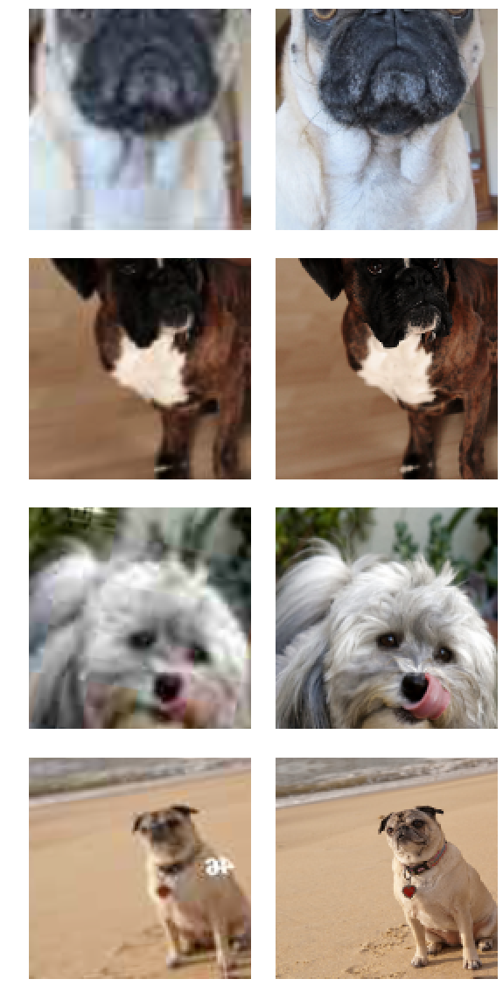
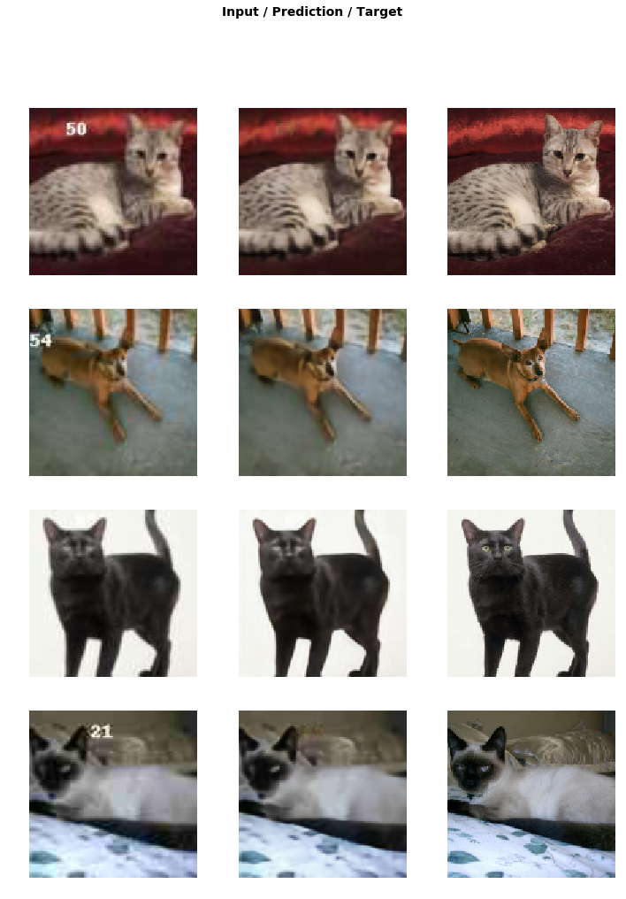
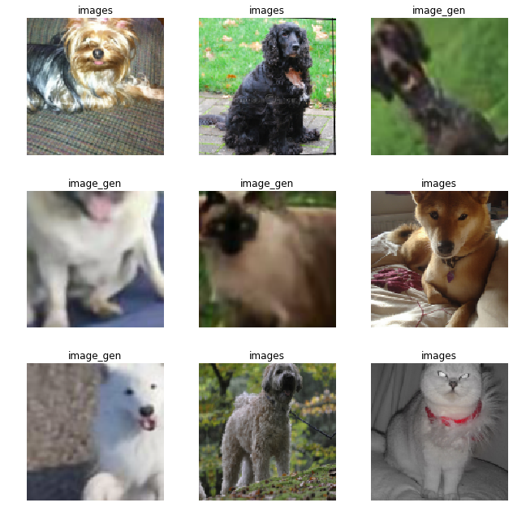
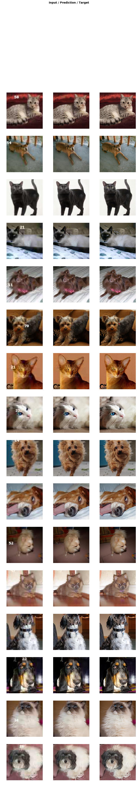

<h1>Table of Contents<span class="tocSkip"></span></h1>
<div class="toc"><ul class="toc-item"><li><span><a href="#Pretrained-GAN" data-toc-modified-id="Pretrained-GAN-1"><span class="toc-item-num">1&nbsp;&nbsp;</span>Pretrained GAN</a></span><ul class="toc-item"><li><ul class="toc-item"><li><span><a href="#image-to-image-generation-task-有哪些用途" data-toc-modified-id="image-to-image-generation-task-有哪些用途-1.0.1"><span class="toc-item-num">1.0.1&nbsp;&nbsp;</span>image to image generation task 有哪些用途</a></span></li><li><span><a href="#所需library" data-toc-modified-id="所需library-1.0.2"><span class="toc-item-num">1.0.2&nbsp;&nbsp;</span>所需library</a></span></li><li><span><a href="#下载数据，准备文件夹路径" data-toc-modified-id="下载数据，准备文件夹路径-1.0.3"><span class="toc-item-num">1.0.3&nbsp;&nbsp;</span>下载数据，准备文件夹路径</a></span></li></ul></li></ul></li><li><span><a href="#Crappified-data" data-toc-modified-id="Crappified-data-2"><span class="toc-item-num">2&nbsp;&nbsp;</span>Crappified data</a></span><ul class="toc-item"><li><ul class="toc-item"><li><span><a href="#引入crappify函数" data-toc-modified-id="引入crappify函数-2.0.1"><span class="toc-item-num">2.0.1&nbsp;&nbsp;</span>引入crappify函数</a></span></li><li><span><a href="#穿插问题：-为什么concat在2个conv-layer之前进行" data-toc-modified-id="穿插问题：-为什么concat在2个conv-layer之前进行-2.0.2"><span class="toc-item-num">2.0.2&nbsp;&nbsp;</span>穿插问题： 为什么concat在2个conv-layer之前进行</a></span></li><li><span><a href="#穿插问题：-downsampling-和-upsampling是如何能做到concat大小不变？" data-toc-modified-id="穿插问题：-downsampling-和-upsampling是如何能做到concat大小不变？-2.0.3"><span class="toc-item-num">2.0.3&nbsp;&nbsp;</span>穿插问题： downsampling 和 upsampling是如何能做到concat大小不变？</a></span></li><li><span><a href="#如何加速crappify图片" data-toc-modified-id="如何加速crappify图片-2.0.4"><span class="toc-item-num">2.0.4&nbsp;&nbsp;</span>如何加速crappify图片</a></span></li></ul></li></ul></li><li><span><a href="#Pre-train-generator" data-toc-modified-id="Pre-train-generator-3"><span class="toc-item-num">3&nbsp;&nbsp;</span>Pre-train generator</a></span><ul class="toc-item"><li><ul class="toc-item"><li><span><a href="#创建DataBunch" data-toc-modified-id="创建DataBunch-3.0.1"><span class="toc-item-num">3.0.1&nbsp;&nbsp;</span>创建DataBunch</a></span></li><li><span><a href="#展示图片（crappy和原图）" data-toc-modified-id="展示图片（crappy和原图）-3.0.2"><span class="toc-item-num">3.0.2&nbsp;&nbsp;</span>展示图片（crappy和原图）</a></span></li><li><span><a href="#为什么要用pretrained-models" data-toc-modified-id="为什么要用pretrained-models-3.0.3"><span class="toc-item-num">3.0.3&nbsp;&nbsp;</span>为什么要用pretrained models</a></span></li><li><span><a href="#part-2将讲解的内容" data-toc-modified-id="part-2将讲解的内容-3.0.4"><span class="toc-item-num">3.0.4&nbsp;&nbsp;</span>part 2将讲解的内容</a></span></li><li><span><a href="#如何创建模型和训练" data-toc-modified-id="如何创建模型和训练-3.0.5"><span class="toc-item-num">3.0.5&nbsp;&nbsp;</span>如何创建模型和训练</a></span></li><li><span><a href="#如何做全模型训练" data-toc-modified-id="如何做全模型训练-3.0.6"><span class="toc-item-num">3.0.6&nbsp;&nbsp;</span>如何做全模型训练</a></span></li><li><span><a href="#看看模型训练效果" data-toc-modified-id="看看模型训练效果-3.0.7"><span class="toc-item-num">3.0.7&nbsp;&nbsp;</span>看看模型训练效果</a></span></li><li><span><a href="#为什么提升像素不成功？" data-toc-modified-id="为什么提升像素不成功？-3.0.8"><span class="toc-item-num">3.0.8&nbsp;&nbsp;</span>为什么提升像素不成功？</a></span></li><li><span><a href="#GAN如何帮助提升生成图的像素？" data-toc-modified-id="GAN如何帮助提升生成图的像素？-3.0.9"><span class="toc-item-num">3.0.9&nbsp;&nbsp;</span>GAN如何帮助提升生成图的像素？</a></span></li><li><span><a href="#为什么GAN-训练很痛苦？" data-toc-modified-id="为什么GAN-训练很痛苦？-3.0.10"><span class="toc-item-num">3.0.10&nbsp;&nbsp;</span>为什么GAN 训练很痛苦？</a></span></li><li><span><a href="#fastai-版本的GAN如何解决这个问题？" data-toc-modified-id="fastai-版本的GAN如何解决这个问题？-3.0.11"><span class="toc-item-num">3.0.11&nbsp;&nbsp;</span>fastai 版本的GAN如何解决这个问题？</a></span></li><li><span><a href="#保存生成图到新文件夹" data-toc-modified-id="保存生成图到新文件夹-3.0.12"><span class="toc-item-num">3.0.12&nbsp;&nbsp;</span>保存生成图到新文件夹</a></span></li></ul></li></ul></li><li><span><a href="#Train-critic" data-toc-modified-id="Train-critic-4"><span class="toc-item-num">4&nbsp;&nbsp;</span>Train critic</a></span><ul class="toc-item"><li><ul class="toc-item"><li><span><a href="#如何释放空间，无需重启kernel？" data-toc-modified-id="如何释放空间，无需重启kernel？-4.0.1"><span class="toc-item-num">4.0.1&nbsp;&nbsp;</span>如何释放空间，无需重启kernel？</a></span></li><li><span><a href="#如何生成critic-DataBunch" data-toc-modified-id="如何生成critic-DataBunch-4.0.2"><span class="toc-item-num">4.0.2&nbsp;&nbsp;</span>如何生成critic DataBunch</a></span></li><li><span><a href="#BCE-loss-+-AdaptiveLoss-??" data-toc-modified-id="BCE-loss-+-AdaptiveLoss-??-4.0.3"><span class="toc-item-num">4.0.3&nbsp;&nbsp;</span>BCE loss + AdaptiveLoss ??</a></span></li><li><span><a href="#如何创建critic模型Learner？" data-toc-modified-id="如何创建critic模型Learner？-4.0.4"><span class="toc-item-num">4.0.4&nbsp;&nbsp;</span>如何创建critic模型Learner？</a></span></li></ul></li></ul></li><li><span><a href="#GAN" data-toc-modified-id="GAN-5"><span class="toc-item-num">5&nbsp;&nbsp;</span>GAN</a></span><ul class="toc-item"><li><ul class="toc-item"><li><span><a href="#再度释放内容" data-toc-modified-id="再度释放内容-5.0.1"><span class="toc-item-num">5.0.1&nbsp;&nbsp;</span>再度释放内容</a></span></li><li><span><a href="#创建databunch,-critic和generator" data-toc-modified-id="创建databunch,-critic和generator-5.0.2"><span class="toc-item-num">5.0.2&nbsp;&nbsp;</span>创建databunch, critic和generator</a></span></li><li><span><a href="#fastai-如何简化GAN建模流程" data-toc-modified-id="fastai-如何简化GAN建模流程-5.0.3"><span class="toc-item-num">5.0.3&nbsp;&nbsp;</span>fastai 如何简化GAN建模流程</a></span></li></ul></li></ul></li></ul></div>

## Pretrained GAN

[46:00-76:00](https://ytcropper.com/cropped/9s5c8ba2c1394a1)

#### image to image generation task 有哪些用途

- 低像素转高像素
- 黑白转彩色
- 缺失转完整
- 简单线条转名师作画

#### 所需library


```python
import fastai
from fastai.vision import *
from fastai.callbacks import *
from fastai.vision.gan import *
```

#### 下载数据，准备文件夹路径


```python
path = untar_data(URLs.PETS)
path_hr = path/'images'
path_lr = path/'crappy'
```

## Crappified data

#### 引入crappify函数

- 打开图片
- 缩小图片像素至 96x96 （低像素图片）
- 通过bilinear方式缩小图片，保留RGB
- 加入文字jpeg到图片中，文字清晰度随机在10-70间取值（很差，很清晰）
- 文字jpeg位置也是随机

这里是展示创造力的地方
- 从黑白到彩色
- 老照片换新照片

Prepare the input data by crappifying images.


```python
from crappify import *
```


#### 穿插问题： 为什么concat在2个conv-layer之前进行

- 为了更多的interaction between downsampling and upsampling

#### 穿插问题： downsampling 和 upsampling是如何能做到concat大小不变？

- concat只限制在同一个block之中，进入下一个block时，新的concat将重头开始

#### 如何加速crappify图片

Uncomment the first time you run this notebook.


```python
#il = ImageList.from_folder(path_hr)
#parallel(crappifier(path_lr, path_hr), il.items)
```

For gradual resizing we can change the commented line here.


```python
bs,size=32, 128
# bs,size = 24,160
#bs,size = 8,256
arch = models.resnet34
```

## Pre-train generator

Now let's pretrain the generator.

#### 创建DataBunch
- 先在src中用crappy文件夹中图片，在分割成训练和验证集
- 在data中用原图来做标注图
- 再变形和转化为DataBunch


```python
arch = models.resnet34
src = ImageImageList.from_folder(path_lr).random_split_by_pct(0.1, seed=42)
```


```python
def get_data(bs,size):
    data = (src.label_from_func(lambda x: path_hr/x.name)
           .transform(get_transforms(max_zoom=2.), size=size, tfm_y=True)
           .databunch(bs=bs).normalize(imagenet_stats, do_y=True))

    data.c = 3
    return data
```


```python
data_gen = get_data(bs,size)
```

#### 展示图片（crappy和原图）


```python
data_gen.show_batch(4)
```





```python
wd = 1e-3
```


```python
y_range = (-3.,3.)
```


```python
loss_gen = MSELossFlat()
```

#### 为什么要用pretrained models

- 输入值：低像素，有杂质图片
- label：高像素，无杂质
- 目标：学会去除杂志，提升清晰度
- 所以需要模型本身就知道图片中的所有物品包括杂志


```python
arch = models.resnet34
```

#### part 2将讲解的内容

- `norm_type, self_attention, y_range?`


```python
def create_gen_learner():
    return unet_learner(data_gen, arch, wd=wd, blur=True, norm_type=NormType.Weight,
                         self_attention=True, y_range=y_range, loss_func=loss_gen)
```

#### 如何创建模型和训练


```python
learn_gen = create_gen_learner()
```


```python
learn_gen.fit_one_cycle(2, pct_start=0.8)
```


Total time: 01:35 <p><table style='width:300px; margin-bottom:10px'>
  <tr>
    <th>epoch</th>
    <th>train_loss</th>
    <th>valid_loss</th>
  </tr>
  <tr>
    <th>1</th>
    <th>0.061653</th>
    <th>0.053493</th>
  </tr>
  <tr>
    <th>2</th>
    <th>0.051248</th>
    <th>0.047272</th>
  </tr>
</table>


#### 如何做全模型训练


```python
learn_gen.unfreeze()
```


```python
learn_gen.fit_one_cycle(3, slice(1e-6,1e-3))
```


Total time: 02:24 <p><table style='width:300px; margin-bottom:10px'>
  <tr>
    <th>epoch</th>
    <th>train_loss</th>
    <th>valid_loss</th>
  </tr>
  <tr>
    <th>1</th>
    <th>0.050429</th>
    <th>0.046088</th>
  </tr>
  <tr>
    <th>2</th>
    <th>0.049056</th>
    <th>0.043954</th>
  </tr>
  <tr>
    <th>3</th>
    <th>0.045437</th>
    <th>0.043146</th>
  </tr>
</table>


#### 看看模型训练效果

- 去除水印目标实现了
- 但提升像素并不成功


```python
learn_gen.show_results(rows=4)
```





```python
learn_gen.save('gen-pre2')
```

#### 为什么提升像素不成功？

- MSE loss： 无法体现低像素图（消除了水印）与原图的差异
- 高清和纹路的差异，无法在MSE的差异中体现
- 我们需要更新的损失函数 
- GAN是一种解决方案

#### GAN如何帮助提升生成图的像素？

- 
- 两个模型交叉训练，相互促进

#### 为什么GAN 训练很痛苦？

- 痛苦在起步，成功起步后就比较快了
- 为什么起步痛苦？
    - 因为起步时生成器和分辨器都很无知，无法相互帮助促进
    - 好比两个刚刚失明的人要帮助对方行走一样无助

#### fastai 版本的GAN如何解决这个问题？

- 提供预先训练好的生成器和辨别器，直接给出优秀的起步状态
- 这是fast.ai首创（极可能）

#### 保存生成图到新文件夹

- 要训练critic （二元分类），需要原图和生成图对比
- 原图已有，生成图需要新生成


```python
learn_gen.load('gen-pre2'); # 准备生成器模型
```


```python
name_gen = 'image_gen'
path_gen = path/name_gen # 准备路径
```


```python
# shutil.rmtree(path_gen)
```


```python
path_gen.mkdir(exist_ok=True) # 创建文件夹
```

part2 会有更多自己写源代码的机会（如下）


```python
def save_preds(dl):
    i=0
    names = dl.dataset.items # 提取文件路径
    
    for b in dl: # 提取一个一个的批量
        preds = learn_gen.pred_batch(batch=b, reconstruct=True) # 生成图
        for o in preds:
            o.save(path_gen/names[i].name) # 提成和保存到指定文件名
            i += 1
```


```python
save_preds(data_gen.fix_dl) # fix_dl ????
```

查看新生成文件夹中图片


```python
PIL.Image.open(path_gen.ls()[0])
```


## Train critic

#### 如何释放空间，无需重启kernel？


```python
learn_gen=None
gc.collect() # 能行，只是NVDIA msi 无法展示实际情况，因为Pytorch的设置
```


    3755


Pretrain the critic on crappy vs not crappy.

#### 如何生成critic DataBunch


```python
def get_crit_data(classes, bs, size):
    src = ImageList.from_folder(path, include=classes).random_split_by_pct(0.1, seed=42)
    # path = PETS 总path, include=classes, subfolders 就是classes
    ll = src.label_from_folder(classes=classes) # classes = subfolders (images, image_gen)
    data = (ll.transform(get_transforms(max_zoom=2.), size=size)
           .databunch(bs=bs).normalize(imagenet_stats))
    data.c = 3
    return data
```


```python
data_crit = get_crit_data([name_gen, 'images'], bs=bs, size=size)
```


```python
data_crit.show_batch(rows=3, ds_type=DatasetType.Train, imgsize=3) # 注意 imgsize=3
```





#### BCE loss + AdaptiveLoss ??


```python
loss_critic = AdaptiveLoss(nn.BCEWithLogitsLoss())
```

#### 如何创建critic模型Learner？

- 模型框架需要spectral norm
- Resnet 内无此设置，未来可能会植入
- 目前采用gan_critic()模型框架, 内置了spectral norm


```python
def create_critic_learner(data, metrics):
    return Learner(data, gan_critic(), metrics=metrics, loss_func=loss_critic, wd=wd)
```


```python
learn_critic = create_critic_learner(data_crit, accuracy_thresh_expand)
# accuracy_thresh_expand = 为GAN critic定制的accuracy
```


```python
learn_critic.fit_one_cycle(6, 1e-3) 
```


Total time: 09:40 <p><table style='width:300px; margin-bottom:10px'>
  <tr>
    <th>epoch</th>
    <th>train_loss</th>
    <th>valid_loss</th>
    <th>accuracy_thresh_expand</th>
  </tr>
  <tr>
    <th>1</th>
    <th>0.678256</th>
    <th>0.687312</th>
    <th>0.531083</th>
  </tr>
  <tr>
    <th>2</th>
    <th>0.434768</th>
    <th>0.366180</th>
    <th>0.851823</th>
  </tr>
  <tr>
    <th>3</th>
    <th>0.186435</th>
    <th>0.128874</th>
    <th>0.955214</th>
  </tr>
  <tr>
    <th>4</th>
    <th>0.120681</th>
    <th>0.072901</th>
    <th>0.980228</th>
  </tr>
  <tr>
    <th>5</th>
    <th>0.099568</th>
    <th>0.107304</th>
    <th>0.962564</th>
  </tr>
  <tr>
    <th>6</th>
    <th>0.071958</th>
    <th>0.078094</th>
    <th>0.976239</th>
  </tr>
</table>


```python
learn_critic.save('critic-pre2')
```

## GAN

Now we'll combine those pretrained model in a GAN.

#### 再度释放内容


```python
learn_crit=None
learn_gen=None
gc.collect()
```


    15794


#### 创建databunch, critic和generator


```python
data_crit = get_crit_data(['crappy', 'images'], bs=bs, size=size)
```


```python
learn_crit = create_critic_learner(data_crit, metrics=None).load('critic-pre2')
```


```python
learn_gen = create_gen_learner().load('gen-pre2')
```

#### fastai 如何简化GAN建模流程

To define a GAN Learner, we just have to specify the learner objects for the generator and the critic. The switcher is a callback that decides when to switch from discriminator to generator and vice versa. Here we do as many iterations of the discriminator as needed to get its loss back < 0.5 then one iteration of the generator.

The loss of the critic is given by `learn_crit.loss_func`. We take the average of this loss function on the batch of real predictions (target 1) and the batch of fake predicitions (target 0). 

The loss of the generator is weighted sum (weights in `weights_gen`) of `learn_crit.loss_func` on the batch of fake (passed throught the critic to become predictions) with a target of 1, and the `learn_gen.loss_func` applied to the output (batch of fake) and the target (corresponding batch of superres images).


```python
switcher = partial(AdaptiveGANSwitcher, critic_thresh=0.65)
learn = GANLearner.from_learners(learn_gen, learn_crit, 
                                 weights_gen=(1.,50.), # MSEpixel loss set 50x larger, 
                                 # critic loss set just 1 scale
                                 show_img=False, switcher=switcher,
                                 # set momentum to 0 in betas, 因为GAN不喜欢momentum
                                 opt_func=partial(optim.Adam, betas=(0.,0.99)), wd=wd)
learn.callback_fns.append(partial(GANDiscriminativeLR, mult_lr=5.))
```


```python
lr = 1e-4
```


```python
learn.fit(40,lr)
```


Total time: 1:05:41 <p><table style='width:300px; margin-bottom:10px'>
  <tr>
    <th>epoch</th>
    <th>train_loss</th>
    <th>gen_loss</th>
    <th>disc_loss</th>
  </tr>
  <tr>
    <th>1</th>
    <th>2.071352</th>
    <th>2.025429</th>
    <th>4.047686</th>
  </tr>
  <tr>
    <th>2</th>
    <th>1.996251</th>
    <th>1.850199</th>
    <th>3.652173</th>
  </tr>
  <tr>
    <th>3</th>
    <th>2.001999</th>
    <th>2.035176</th>
    <th>3.612669</th>
  </tr>
  <tr>
    <th>4</th>
    <th>1.921844</th>
    <th>1.931835</th>
    <th>3.600355</th>
  </tr>
  <tr>
    <th>5</th>
    <th>1.987216</th>
    <th>1.961323</th>
    <th>3.606629</th>
  </tr>
  <tr>
    <th>6</th>
    <th>2.022372</th>
    <th>2.102732</th>
    <th>3.609494</th>
  </tr>
  <tr>
    <th>7</th>
    <th>1.900056</th>
    <th>2.059208</th>
    <th>3.581742</th>
  </tr>
  <tr>
    <th>8</th>
    <th>1.942305</th>
    <th>1.965547</th>
    <th>3.538015</th>
  </tr>
  <tr>
    <th>9</th>
    <th>1.954079</th>
    <th>2.006257</th>
    <th>3.593008</th>
  </tr>
  <tr>
    <th>10</th>
    <th>1.984677</th>
    <th>1.771790</th>
    <th>3.617556</th>
  </tr>
  <tr>
    <th>11</th>
    <th>2.040979</th>
    <th>2.079904</th>
    <th>3.575464</th>
  </tr>
  <tr>
    <th>12</th>
    <th>2.009052</th>
    <th>1.739175</th>
    <th>3.626755</th>
  </tr>
  <tr>
    <th>13</th>
    <th>2.014115</th>
    <th>1.204614</th>
    <th>3.582353</th>
  </tr>
  <tr>
    <th>14</th>
    <th>2.042148</th>
    <th>1.747239</th>
    <th>3.608723</th>
  </tr>
  <tr>
    <th>15</th>
    <th>2.113957</th>
    <th>1.831483</th>
    <th>3.684338</th>
  </tr>
  <tr>
    <th>16</th>
    <th>1.979398</th>
    <th>1.923163</th>
    <th>3.600483</th>
  </tr>
  <tr>
    <th>17</th>
    <th>1.996756</th>
    <th>1.760739</th>
    <th>3.635300</th>
  </tr>
  <tr>
    <th>18</th>
    <th>1.976695</th>
    <th>1.982629</th>
    <th>3.575843</th>
  </tr>
  <tr>
    <th>19</th>
    <th>2.088960</th>
    <th>1.822936</th>
    <th>3.617471</th>
  </tr>
  <tr>
    <th>20</th>
    <th>1.949941</th>
    <th>1.996513</th>
    <th>3.594223</th>
  </tr>
  <tr>
    <th>21</th>
    <th>2.079416</th>
    <th>1.918284</th>
    <th>3.588732</th>
  </tr>
  <tr>
    <th>22</th>
    <th>2.055047</th>
    <th>1.869254</th>
    <th>3.602390</th>
  </tr>
  <tr>
    <th>23</th>
    <th>1.860164</th>
    <th>1.917518</th>
    <th>3.557776</th>
  </tr>
  <tr>
    <th>24</th>
    <th>1.945440</th>
    <th>2.033273</th>
    <th>3.535242</th>
  </tr>
  <tr>
    <th>25</th>
    <th>2.026493</th>
    <th>1.804196</th>
    <th>3.558001</th>
  </tr>
  <tr>
    <th>26</th>
    <th>1.875208</th>
    <th>1.797288</th>
    <th>3.511697</th>
  </tr>
  <tr>
    <th>27</th>
    <th>1.972286</th>
    <th>1.798044</th>
    <th>3.570746</th>
  </tr>
  <tr>
    <th>28</th>
    <th>1.950635</th>
    <th>1.951106</th>
    <th>3.525849</th>
  </tr>
  <tr>
    <th>29</th>
    <th>2.013820</th>
    <th>1.937439</th>
    <th>3.592216</th>
  </tr>
  <tr>
    <th>30</th>
    <th>1.959477</th>
    <th>1.959566</th>
    <th>3.561970</th>
  </tr>
  <tr>
    <th>31</th>
    <th>2.012466</th>
    <th>2.110288</th>
    <th>3.539897</th>
  </tr>
  <tr>
    <th>32</th>
    <th>1.982466</th>
    <th>1.905378</th>
    <th>3.559940</th>
  </tr>
  <tr>
    <th>33</th>
    <th>1.957023</th>
    <th>2.207354</th>
    <th>3.540873</th>
  </tr>
  <tr>
    <th>34</th>
    <th>2.049188</th>
    <th>1.942845</th>
    <th>3.638360</th>
  </tr>
  <tr>
    <th>35</th>
    <th>1.913136</th>
    <th>1.891638</th>
    <th>3.581291</th>
  </tr>
  <tr>
    <th>36</th>
    <th>2.037127</th>
    <th>1.808180</th>
    <th>3.572567</th>
  </tr>
  <tr>
    <th>37</th>
    <th>2.006383</th>
    <th>2.048738</th>
    <th>3.553226</th>
  </tr>
  <tr>
    <th>38</th>
    <th>2.000312</th>
    <th>1.657985</th>
    <th>3.594805</th>
  </tr>
  <tr>
    <th>39</th>
    <th>1.973937</th>
    <th>1.891186</th>
    <th>3.533843</th>
  </tr>
  <tr>
    <th>40</th>
    <th>2.002513</th>
    <th>1.853988</th>
    <th>3.554688</th>
  </tr>
</table>


```python
learn.save('gan-1c')
```


```python
learn.data=get_data(16,192)
```


```python
learn.fit(10,lr/2)
```


Total time: 43:07 <p><table style='width:300px; margin-bottom:10px'>
  <tr>
    <th>epoch</th>
    <th>train_loss</th>
    <th>gen_loss</th>
    <th>disc_loss</th>
  </tr>
  <tr>
    <th>1</th>
    <th>2.578580</th>
    <th>2.415008</th>
    <th>4.716179</th>
  </tr>
  <tr>
    <th>2</th>
    <th>2.620808</th>
    <th>2.487282</th>
    <th>4.729377</th>
  </tr>
  <tr>
    <th>3</th>
    <th>2.596190</th>
    <th>2.579693</th>
    <th>4.796489</th>
  </tr>
  <tr>
    <th>4</th>
    <th>2.701113</th>
    <th>2.522197</th>
    <th>4.821410</th>
  </tr>
  <tr>
    <th>5</th>
    <th>2.545030</th>
    <th>2.401921</th>
    <th>4.710739</th>
  </tr>
  <tr>
    <th>6</th>
    <th>2.638539</th>
    <th>2.548171</th>
    <th>4.776103</th>
  </tr>
  <tr>
    <th>7</th>
    <th>2.551988</th>
    <th>2.513859</th>
    <th>4.644952</th>
  </tr>
  <tr>
    <th>8</th>
    <th>2.629724</th>
    <th>2.490307</th>
    <th>4.701890</th>
  </tr>
  <tr>
    <th>9</th>
    <th>2.552170</th>
    <th>2.487726</th>
    <th>4.728183</th>
  </tr>
  <tr>
    <th>10</th>
    <th>2.597136</th>
    <th>2.478334</th>
    <th>4.649708</th>
  </tr>
</table>


```python
learn.show_results(rows=16)
```





```python
learn.save('gan-1c')
```
