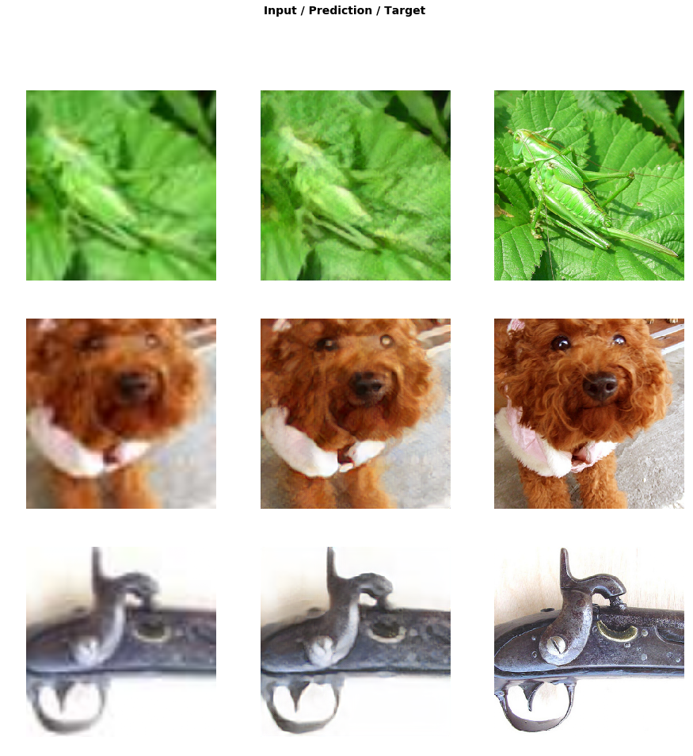
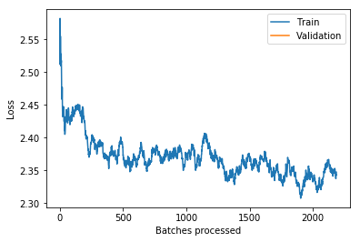
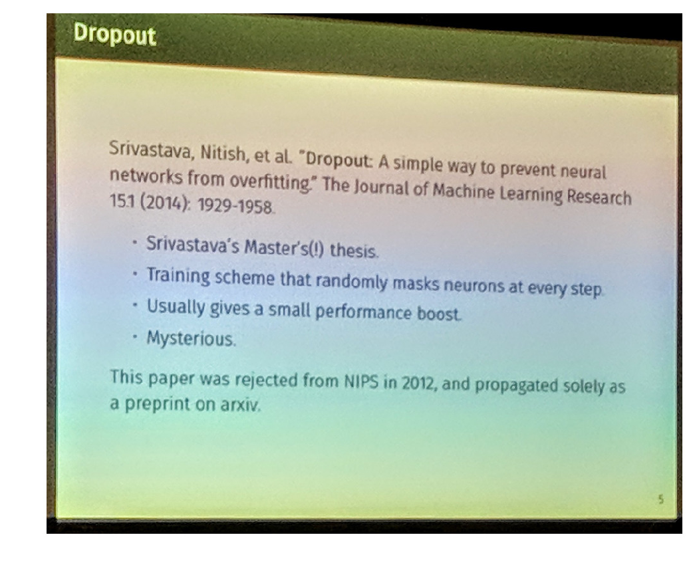
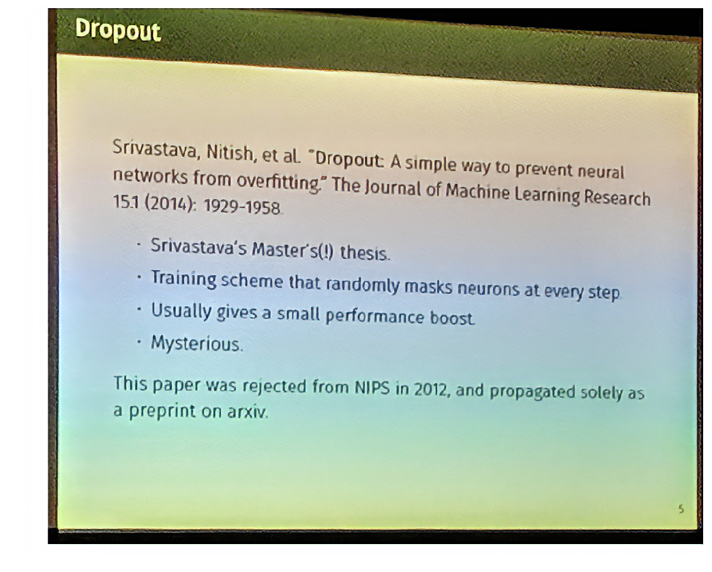

<h1>Table of Contents<span class="tocSkip"></span></h1>
<div class="toc"><ul class="toc-item"><li><span><a href="#Super-resolution-on-Imagenet" data-toc-modified-id="Super-resolution-on-Imagenet-1"><span class="toc-item-num">1&nbsp;&nbsp;</span>Super resolution on Imagenet</a></span></li><li><span><a href="#Feature-loss" data-toc-modified-id="Feature-loss-2"><span class="toc-item-num">2&nbsp;&nbsp;</span>Feature loss</a></span></li><li><span><a href="#Train" data-toc-modified-id="Train-3"><span class="toc-item-num">3&nbsp;&nbsp;</span>Train</a></span></li><li><span><a href="#Test" data-toc-modified-id="Test-4"><span class="toc-item-num">4&nbsp;&nbsp;</span>Test</a></span></li></ul></div>

## Super resolution on Imagenet


```python
import fastai
from fastai.vision import *
from fastai.callbacks import *
from fastai.utils.mem import *
```


```python
from torchvision.models import vgg16_bn
```


```python
torch.cuda.set_device(0)
```


```python
path = Path('data/imagenet')
path_hr = path/'train'
path_lr = path/'small-64/train'
path_mr = path/'small-256/train'

# note: this notebook relies on models created by lesson7-superres.ipynb
path_pets = untar_data(URLs.PETS)
```


```python
il = ImageList.from_folder(path_hr)
```


```python
def resize_one(fn, i, path, size):
    dest = path/fn.relative_to(path_hr)
    dest.parent.mkdir(parents=True, exist_ok=True)
    img = PIL.Image.open(fn)
    targ_sz = resize_to(img, size, use_min=True)
    img = img.resize(targ_sz, resample=PIL.Image.BILINEAR).convert('RGB')
    img.save(dest, quality=60)
```


```python
from fastai.vision import *
from PIL import Image, ImageDraw, ImageFont

class crappifier(object):
    def __init__(self, path_lr, path_hr):
        self.path_lr = path_lr
        self.path_hr = path_hr              
        
    def __call__(self, fn, i):       
        dest = self.path_lr/fn.relative_to(self.path_hr)    
        dest.parent.mkdir(parents=True, exist_ok=True)
        img = PIL.Image.open(fn)
        targ_sz = resize_to(img, 96, use_min=True)
        img = img.resize(targ_sz, resample=PIL.Image.BILINEAR).convert('RGB')
        w,h = img.size
        q = random.randint(10,70)
        ImageDraw.Draw(img).text((random.randint(0,w//2),random.randint(0,h//2)), 
                                 str(q), fill=(255,255,255))
        img.save(dest, quality=q)
```


```python
assert path.exists(), f"need imagenet dataset @ {path}"
# create smaller image sets the first time this nb is run
sets = [(path_lr, 64), (path_mr, 256)]
for p,size in sets:
    if not p.exists(): 
        print(f"resizing to {size} into {p}")
        parallel(partial(resize_one, path=p, size=size), il.items)
```


```python
free = gpu_mem_get_free_no_cache()
# the max size of the test image depends on the available GPU RAM 
if free > 8200: bs,size=16,256  
else:           bs,size=8,256
print(f"using bs={bs}, size={size}, have {free}MB of GPU RAM free")

arch = models.resnet34
# sample = 0.1
sample = False

tfms = get_transforms()
```

    using bs=8, size=256, have 8109MB of GPU RAM free


```python
src = ImageImageList.from_folder(path_lr)
```


```python
if sample: src = src.filter_by_rand(sample, seed=42)
```


```python
src = src.random_split_by_pct(0.1, seed=42)
```


```python
def get_data(bs,size):
    data = (src.label_from_func(lambda x: path_hr/x.relative_to(path_lr))
           .transform(get_transforms(max_zoom=2.), size=size, tfm_y=True)
           .databunch(bs=bs).normalize(imagenet_stats, do_y=True))

    data.c = 3
    return data
```


```python
data = get_data(bs,size)
```

## Feature loss


```python
def gram_matrix(x):
    n,c,h,w = x.size()
    x = x.view(n, c, -1)
    return (x @ x.transpose(1,2))/(c*h*w)
```


```python
vgg_m = vgg16_bn(True).features.cuda().eval()
requires_grad(vgg_m, False)
blocks = [i-1 for i,o in enumerate(children(vgg_m)) if isinstance(o,nn.MaxPool2d)]
```


```python
base_loss = F.l1_loss

class FeatureLoss(nn.Module):
    def __init__(self, m_feat, layer_ids, layer_wgts):
        super().__init__()
        self.m_feat = m_feat
        self.loss_features = [self.m_feat[i] for i in layer_ids]
        self.hooks = hook_outputs(self.loss_features, detach=False)
        self.wgts = layer_wgts
        self.metric_names = ['pixel',] + [f'feat_{i}' for i in range(len(layer_ids))
              ] + [f'gram_{i}' for i in range(len(layer_ids))]

    def make_features(self, x, clone=False):
        self.m_feat(x)
        return [(o.clone() if clone else o) for o in self.hooks.stored]
    
    def forward(self, input, target):
        out_feat = self.make_features(target, clone=True)
        in_feat = self.make_features(input)
        self.feat_losses = [base_loss(input,target)]
        self.feat_losses += [base_loss(f_in, f_out)*w
                             for f_in, f_out, w in zip(in_feat, out_feat, self.wgts)]
        self.feat_losses += [base_loss(gram_matrix(f_in), gram_matrix(f_out))*w**2 * 5e3
                             for f_in, f_out, w in zip(in_feat, out_feat, self.wgts)]
        self.metrics = dict(zip(self.metric_names, self.feat_losses))
        return sum(self.feat_losses)
    
    def __del__(self): self.hooks.remove()
```


```python
feat_loss = FeatureLoss(vgg_m, blocks[2:5], [5,15,2])
```

## Train


```python
wd = 1e-3
learn = unet_learner(data, arch, wd=wd, loss_func=feat_loss, callback_fns=LossMetrics, blur=True, norm_type=NormType.Weight)
gc.collect();
```


```python
learn.unfreeze()
```


```python
# relies on first running lesson7-superres.ipynb which created the following model
learn.load((path_pets/'small-96'/'models'/'2b').absolute());
```


```python
learn.fit_one_cycle(1, slice(1e-6,1e-4))
```


Total time: 17:52 <p><table style='width:750px; margin-bottom:10px'>
  <tr>
    <th>epoch</th>
    <th>train_loss</th>
    <th>valid_loss</th>
    <th>pixel</th>
    <th>feat_0</th>
    <th>feat_1</th>
    <th>feat_2</th>
    <th>gram_0</th>
    <th>gram_1</th>
    <th>gram_2</th>
  </tr>
  <tr>
    <th>1</th>
    <th>2.347123</th>
    <th>2.385141</th>
    <th>0.229566</th>
    <th>0.293816</th>
    <th>0.322328</th>
    <th>0.146045</th>
    <th>0.460049</th>
    <th>0.638133</th>
    <th>0.295204</th>
  </tr>
</table>


```python
learn.save('imagenet')
```


```python
learn.show_results(rows=3, imgsize=5)
```





```python
learn.recorder.plot_losses()
```





## Test


```python
_=learn.load('imagenet')
```


```python
data_mr = (ImageImageList.from_folder(path_mr).random_split_by_pct(0.1, seed=42)
          .label_from_func(lambda x: path_hr/x.relative_to(path_mr))
          .transform(get_transforms(), size=(820,1024), tfm_y=True)
          .databunch(bs=2).normalize(imagenet_stats, do_y=True))
```


```python
learn.data = data_mr
```


```python
# here put some image you want to enhance, e.g. the original notebook uses a single video frame from a powerpoint presentation on dropout paper
fn = path_pets/'other'/'dropout.jpg'
```


```python
img = open_image(fn); img.shape
```


    torch.Size([3, 850, 1042])


```python
_,img_hr,b = learn.predict(img)
```


```python
show_image(img, figsize=(18,15), interpolation='nearest');
```





```python
Image(img_hr).show(figsize=(18,15))
```

    Clipping input data to the valid range for imshow with RGB data ([0..1] for floats or [0..255] for integers).




