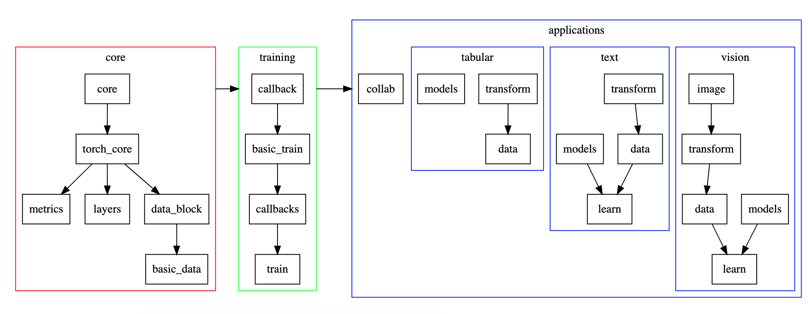

[details="modules如何相互依赖和搭建整个系统"]

library 内各个modules之间的依赖关系 [官方文档](https://docs.fast.ai/index.html#Dependencies)


[/details][details="library结构图"]

由多个submodule组合而成
- transform
- data (DataBunch)
- models
- learn (optionally, such as Learner)



[/details]

[details="fastai调用哪些基础依赖库的具体内容"]

`fastai/imports/core`

[/details]

[details="fastai从torch中调用了哪些内容"]

`fastai/imports/torch`

[/details]

[details="fastai.core的目的功能"]

`fastai.core` 从 `fastai.imports.core` 中调用工具建设关键功能性函数来 format and split data

[/details]

[details="fastai.torch_core的目的功能"]
为fastai定制的处理tensor的功能函数集    
调用了 `imports.torch`, `core`, `collections.OrderedDict`, `torch.nn.parallel.DistributedDataParallel`

[/details]

[details="{application}.data的目的功能"]

```python
"""
Manages data input pipeline - folderstransformbatch input. 
Includes support for classification, segmentation and bounding boxes
"""
from ..torch_core import *
from .image import *
from .transform import *
from ..data_block import *
from ..basic_data import *
from ..layers import *
from .learner import *
from torchvision import transforms as tvt

   __all__ = ['get_image_files', 'denormalize', 'get_annotations', 'ImageDataB   unch',
--            'ImageList', 'normalize', 'normalize_funcs', 'resize_to',
||            'channel_view', 'mnist_stats', 'cifar_stats', 'imagenet_stats', || 'download_images',
||            'verify_images', 'bb_pad_collate', 'ImageImageList', 'PointsLabe|| lList',
||            'ObjectCategoryList', 'ObjectItemList', 'SegmentationLabelList',||  'SegmentationItemList', 'PointsItemList']
```
[/details]

[details="text.data的功能目的"]

```python
"NLP data loading pipeline. Supports csv, folders, and preprocessed data."
from ..torch_core import *
from .transform import *
from ..basic_data import *
from ..data_block import *
from ..layers import *
from ..callback import Callback

__all__ = ['LanguageModelPreLoader', 'SortSampler', 'SortishSampler', 'Text   List', 'pad_collate', 'TextDataBunch',
--            'TextLMDataBunch', 'TextClasDataBunch', 'Text', 'open_text', 'To-- kenizeProcessor', 'NumericalizeProcessor',
||            'OpenFileProcessor', 'LMLabelList']

```


[/details]

[details="tabular.data功能目的"]
```python
"Data loading pipeline for structured data support. Loads from pandas DataFrame"
from ..torch_core import *
from .transform import *
from ..basic_data import *
from ..data_block import *
from ..basic_train import *
from .models import *
from pandas.api.types import is_numeric_dtype, is_categorical_dtype

__all__ = ['TabularDataBunch', 'TabularLine', 'TabularList', 
           'TabularProces   sor', 'tabular_learner']
```


[/details]


```python

```
