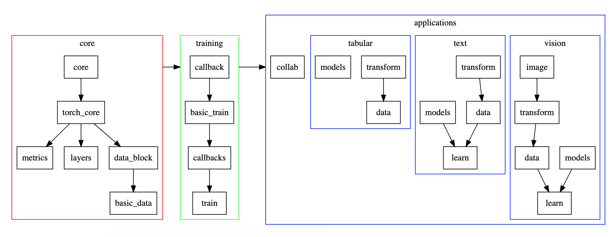

# Welcome to fastai library

[details="library 简介"]

[官方文档](https://docs.fast.ai/index.html)
- 4 applications links
- small examples repo
- a simple demo

[/details]
[details="Install and update fastai"]

[官方文档](https://docs.fast.ai/index.html#Installation-and-updating)
```python
conda install -c pytorch -c fastai fastai
```

[/details]
[details="如何读函数signiture"]

[官方文档](https://docs.fast.ai/index.html#rotate)
`rotate(degrees:uniform) → Image :: TfmAffine`

[/details]
[details="如何使用import *"]

[官方文档](https://docs.fast.ai/index.html#Imports)
- 所有必须的都已备齐 `from fastai.vision import *`
- 可以直接调用`np`, `pd`, `plt`
- 直接运行 `Learner`, 可以现实从属关系

[/details]
[details="modules如何相互依赖和搭建整个系统"]

[官方文档](https://docs.fast.ai/index.html#Dependencies)
- `fastai.core` (依赖general modules), `fastai.torch_core` (依赖pytorch) 是所有modules的基础
- `data`, `layers`, and `metrics` 依赖 `torch_core`
- `callback` (`CallbackHandler`) 依赖 `data`
- `basic_train` (`Learner` and `Recorder`) 依赖 `callback`
    - `Learner` = model + data
-  `callbacks` 依赖 `basic_train`
-  `learn`依赖 `callbacks`

[/details]
[details="4 applications的结构"]

由多个submodule组合而成
- transform
- data (DataBunch)
- models
- learn (optionally, such as Learner)



[/details]