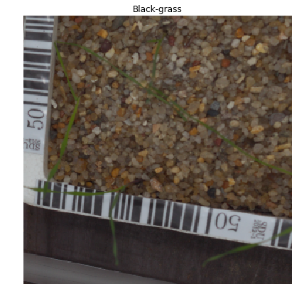
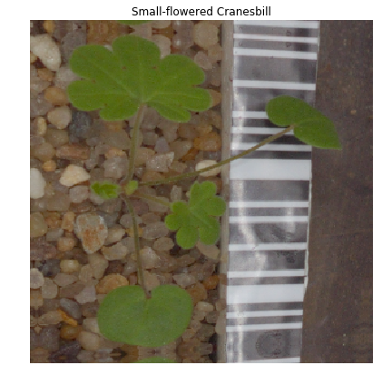
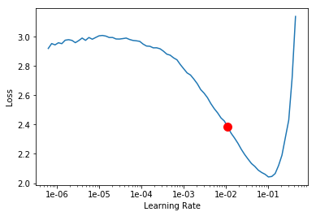
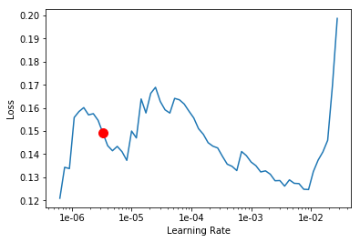
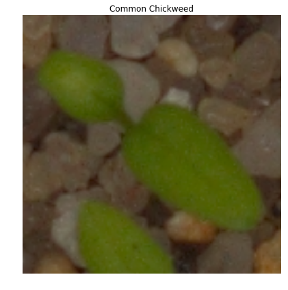
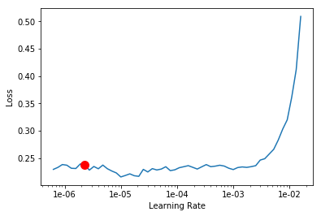

<h1>Table of Contents<span class="tocSkip"></span></h1>
<div class="toc"><ul class="toc-item"><li><span><a href="#数据收纳-Dataset-well-placed" data-toc-modified-id="数据收纳-Dataset-well-placed-1"><span class="toc-item-num">1&nbsp;&nbsp;</span>数据收纳 Dataset well-placed</a></span><ul class="toc-item"><li><ul class="toc-item"><li><ul class="toc-item"><li><span><a href="#用as-fv的好处" data-toc-modified-id="用as-fv的好处-1.0.0.1"><span class="toc-item-num">1.0.0.1&nbsp;&nbsp;</span>用<code>as fv</code>的好处</a></span></li><li><span><a href="#提取常用地址" data-toc-modified-id="提取常用地址-1.0.0.2"><span class="toc-item-num">1.0.0.2&nbsp;&nbsp;</span>提取常用地址</a></span></li><li><span><a href="#洞察文件夹" data-toc-modified-id="洞察文件夹-1.0.0.3"><span class="toc-item-num">1.0.0.3&nbsp;&nbsp;</span>洞察文件夹</a></span></li><li><span><a href="#当前地址" data-toc-modified-id="当前地址-1.0.0.4"><span class="toc-item-num">1.0.0.4&nbsp;&nbsp;</span>当前地址</a></span></li><li><span><a href="#清空当前地址/input下所有内容" data-toc-modified-id="清空当前地址/input下所有内容-1.0.0.5"><span class="toc-item-num">1.0.0.5&nbsp;&nbsp;</span>清空当前地址/input下所有内容</a></span></li><li><span><a href="#复制-/kaggle/input-到-/kaggle/working/input/" data-toc-modified-id="复制-/kaggle/input-到-/kaggle/working/input/-1.0.0.6"><span class="toc-item-num">1.0.0.6&nbsp;&nbsp;</span>复制 /kaggle/input 到 /kaggle/working/input/</a></span></li><li><span><a href="#洞察数据地址中内容" data-toc-modified-id="洞察数据地址中内容-1.0.0.7"><span class="toc-item-num">1.0.0.7&nbsp;&nbsp;</span>洞察数据地址中内容</a></span></li></ul></li></ul></li></ul></li><li><span><a href="#创建DataBunch" data-toc-modified-id="创建DataBunch-2"><span class="toc-item-num">2&nbsp;&nbsp;</span>创建<code>DataBunch</code></a></span><ul class="toc-item"><li><ul class="toc-item"><li><ul class="toc-item"><li><span><a href="#洞察train-文件夹地址" data-toc-modified-id="洞察train-文件夹地址-2.0.0.1"><span class="toc-item-num">2.0.0.1&nbsp;&nbsp;</span>洞察train 文件夹地址</a></span></li><li><span><a href="#如何固定validation集" data-toc-modified-id="如何固定validation集-2.0.0.2"><span class="toc-item-num">2.0.0.2&nbsp;&nbsp;</span>如何固定validation集</a></span></li><li><span><a href="#用train,-test文件夹构建DataBunch" data-toc-modified-id="用train,-test文件夹构建DataBunch-2.0.0.3"><span class="toc-item-num">2.0.0.3&nbsp;&nbsp;</span>用train, test文件夹构建DataBunch</a></span></li><li><span><a href="#了解data的构造" data-toc-modified-id="了解data的构造-2.0.0.4"><span class="toc-item-num">2.0.0.4&nbsp;&nbsp;</span>了解data的构造</a></span></li><li><span><a href="#查看图片" data-toc-modified-id="查看图片-2.0.0.5"><span class="toc-item-num">2.0.0.5&nbsp;&nbsp;</span>查看图片</a></span></li></ul></li></ul></li></ul></li><li><span><a href="#创建模型-Build-model" data-toc-modified-id="创建模型-Build-model-3"><span class="toc-item-num">3&nbsp;&nbsp;</span>创建模型 Build model</a></span><ul class="toc-item"><li><ul class="toc-item"><li><ul class="toc-item"><li><span><a href="#创建CNN" data-toc-modified-id="创建CNN-3.0.0.1"><span class="toc-item-num">3.0.0.1&nbsp;&nbsp;</span>创建CNN</a></span></li><li><span><a href="#learn.lr_find具体工作原理是什么？" data-toc-modified-id="learn.lr_find具体工作原理是什么？-3.0.0.2"><span class="toc-item-num">3.0.0.2&nbsp;&nbsp;</span><code>learn.lr_find</code>具体工作原理是什么？</a></span></li><li><span><a href="#fit_one_cycle的学习率该怎么设置？" data-toc-modified-id="fit_one_cycle的学习率该怎么设置？-3.0.0.3"><span class="toc-item-num">3.0.0.3&nbsp;&nbsp;</span><code>fit_one_cycle</code>的学习率该怎么设置？</a></span></li><li><span><a href="#改变模型保存地址" data-toc-modified-id="改变模型保存地址-3.0.0.4"><span class="toc-item-num">3.0.0.4&nbsp;&nbsp;</span>改变模型保存地址</a></span></li><li><span><a href="#解冻模型封冻层" data-toc-modified-id="解冻模型封冻层-3.0.0.5"><span class="toc-item-num">3.0.0.5&nbsp;&nbsp;</span>解冻模型封冻层</a></span></li><li><span><a href="#学习率范围是如何被使用的" data-toc-modified-id="学习率范围是如何被使用的-3.0.0.6"><span class="toc-item-num">3.0.0.6&nbsp;&nbsp;</span>学习率范围是如何被使用的</a></span></li><li><span><a href="#实验另一组学习率的效果" data-toc-modified-id="实验另一组学习率的效果-3.0.0.7"><span class="toc-item-num">3.0.0.7&nbsp;&nbsp;</span>实验另一组学习率的效果</a></span></li><li><span><a href="#加载模型后，数据怎样了呢？" data-toc-modified-id="加载模型后，数据怎样了呢？-3.0.0.8"><span class="toc-item-num">3.0.0.8&nbsp;&nbsp;</span>加载模型后，数据怎样了呢？</a></span></li></ul></li></ul></li></ul></li><li><span><a href="#用更大图训练" data-toc-modified-id="用更大图训练-4"><span class="toc-item-num">4&nbsp;&nbsp;</span>用更大图训练</a></span><ul class="toc-item"><li><ul class="toc-item"><li><ul class="toc-item"><li><span><a href="#查看valid-集中的图片，以确认valid集保持不变" data-toc-modified-id="查看valid-集中的图片，以确认valid集保持不变-4.0.0.1"><span class="toc-item-num">4.0.0.1&nbsp;&nbsp;</span>查看valid 集中的图片，以确认valid集保持不变</a></span></li><li><span><a href="#重新生成DataBunch,-变形后图片更大，但valid集数据一致性不变" data-toc-modified-id="重新生成DataBunch,-变形后图片更大，但valid集数据一致性不变-4.0.0.2"><span class="toc-item-num">4.0.0.2&nbsp;&nbsp;</span>重新生成DataBunch, 变形后图片更大，但valid集数据一致性不变</a></span></li><li><span><a href="#让图片尺寸更大" data-toc-modified-id="让图片尺寸更大-4.0.0.3"><span class="toc-item-num">4.0.0.3&nbsp;&nbsp;</span>让图片尺寸更大</a></span></li><li><span><a href="#模型解读功能到底怎么用呢？" data-toc-modified-id="模型解读功能到底怎么用呢？-4.0.0.4"><span class="toc-item-num">4.0.0.4&nbsp;&nbsp;</span>模型解读功能到底怎么用呢？</a></span></li><li><span><a href="#链接新的数据，还是置换新数据？需要检验" data-toc-modified-id="链接新的数据，还是置换新数据？需要检验-4.0.0.5"><span class="toc-item-num">4.0.0.5&nbsp;&nbsp;</span>链接新的数据，还是置换新数据？需要检验</a></span></li><li><span><a href="#这里的学习率该怎么读？" data-toc-modified-id="这里的学习率该怎么读？-4.0.0.6"><span class="toc-item-num">4.0.0.6&nbsp;&nbsp;</span>这里的学习率该怎么读？</a></span></li><li><span><a href="#学习率变小，效果更差了" data-toc-modified-id="学习率变小，效果更差了-4.0.0.7"><span class="toc-item-num">4.0.0.7&nbsp;&nbsp;</span>学习率变小，效果更差了</a></span></li><li><span><a href="#学习率更小了点后，效果更差了" data-toc-modified-id="学习率更小了点后，效果更差了-4.0.0.8"><span class="toc-item-num">4.0.0.8&nbsp;&nbsp;</span>学习率更小了点后，效果更差了</a></span></li><li><span><a href="#下次，用学习率-1e-4,-1e-3试试" data-toc-modified-id="下次，用学习率-1e-4,-1e-3试试-4.0.0.9"><span class="toc-item-num">4.0.0.9&nbsp;&nbsp;</span>下次，用学习率 <code>1e-4, 1e-3</code>试试</a></span></li><li><span><a href="#生成预测结果" data-toc-modified-id="生成预测结果-4.0.0.10"><span class="toc-item-num">4.0.0.10&nbsp;&nbsp;</span>生成预测结果</a></span></li><li><span><a href="#每张图片提取最优结果，对应提取类别名称" data-toc-modified-id="每张图片提取最优结果，对应提取类别名称-4.0.0.11"><span class="toc-item-num">4.0.0.11&nbsp;&nbsp;</span>每张图片提取最优结果，对应提取类别名称</a></span></li><li><span><a href="#生成Kaggle格式" data-toc-modified-id="生成Kaggle格式-4.0.0.12"><span class="toc-item-num">4.0.0.12&nbsp;&nbsp;</span>生成Kaggle格式</a></span></li><li><span><a href="#确保所有打印内容能复制粘贴" data-toc-modified-id="确保所有打印内容能复制粘贴-4.0.0.13"><span class="toc-item-num">4.0.0.13&nbsp;&nbsp;</span>确保所有打印内容能复制粘贴</a></span></li><li><span><a href="#自动上传submission" data-toc-modified-id="自动上传submission-4.0.0.14"><span class="toc-item-num">4.0.0.14&nbsp;&nbsp;</span>自动上传submission</a></span></li></ul></li></ul></li></ul></li></ul></div>

# 数据收纳 Dataset well-placed

#### 用`as fv`的好处


```python
import fastai.vision as fv # why use fv? fv的好处
```

#### 提取常用地址


```python
path_input = fv.Path('/kaggle/input') # most used path address 常用地址
path_working = fv.Path('/kaggle/working')
```

#### 洞察文件夹


```python
path_input.ls() # # check inside 洞察
```


    [PosixPath('/kaggle/input/sample_submission.csv'),
     PosixPath('/kaggle/input/train'),
     PosixPath('/kaggle/input/test')]


```python
path_working.ls()
```


    [PosixPath('/kaggle/working/__notebook_source__.ipynb'),
     PosixPath('/kaggle/working/input'),
     PosixPath('/kaggle/working/.ipynb_checkpoints')]


#### 当前地址


```python
!pwd # current directory 当前地址
```

    /kaggle/working


#### 清空当前地址/input下所有内容


```python
!rm -rf input  #  remove（清空） everything on /kaggle/working/input/ 
```

#### 复制 /kaggle/input 到 /kaggle/working/input/ 


```python
!cp -r ../input . # copy (复制) /kaggle/input to (到) /kaggle/working/input/ 
# /kaggle/working
```

#### 洞察数据地址中内容


```python
path_data = fv.Path('/kaggle/working/input') # 数据地址
```


```python
path_data.ls() # no validation set, but has test set 发现有test集没有valid 集
```


    [PosixPath('/kaggle/working/input/train'),
     PosixPath('/kaggle/working/input/sample_submission.csv'),
     PosixPath('/kaggle/working/input/test')]


# 创建`DataBunch`

#### 洞察train 文件夹地址


```python
path_train = fv.Path('/kaggle/working/input/train') # need train folder
```


```python
path_train.ls() # 洞察， 每个子folder就是一个类别
```


    [PosixPath('/kaggle/working/input/train/Shepherds Purse'),
     PosixPath('/kaggle/working/input/train/Maize'),
     PosixPath('/kaggle/working/input/train/Loose Silky-bent'),
     PosixPath('/kaggle/working/input/train/Sugar beet'),
     PosixPath('/kaggle/working/input/train/Small-flowered Cranesbill'),
     PosixPath('/kaggle/working/input/train/Cleavers'),
     PosixPath('/kaggle/working/input/train/Black-grass'),
     PosixPath('/kaggle/working/input/train/Charlock'),
     PosixPath('/kaggle/working/input/train/Scentless Mayweed'),
     PosixPath('/kaggle/working/input/train/Common wheat'),
     PosixPath('/kaggle/working/input/train/Common Chickweed'),
     PosixPath('/kaggle/working/input/train/Fat Hen')]


#### 如何固定validation集


```python
fv.np.random.seed(42) # 确保valid集的不变
```

#### 用train, test文件夹构建DataBunch
* 注意探索内部结构


```python
data = fv.ImageDataBunch.from_folder(path_train, # 只有train，没有valid folder
                                     test='../test', # 有test folder
                                     ds_tfms=fv.get_transforms(), # 变形图片
                                     valid_pct=0.25, # 25% validation 75% training
                                     size=299, # 图片变形后大小
                                     bs=32, # 小批量的大小
                                     num_workers=0) # 确保内存够跑
data.normalize(fv.imagenet_stats) # 对图片做均值方差处理
```


    ImageDataBunch;
    
    Train: LabelList (3563 items)
    x: ImageItemList
    Image (3, 299, 299),Image (3, 299, 299),Image (3, 299, 299),Image (3, 299, 299),Image (3, 299, 299)
    y: CategoryList
    Shepherds Purse,Shepherds Purse,Shepherds Purse,Shepherds Purse,Shepherds Purse
    Path: /kaggle/working/input/train;
    
    Valid: LabelList (1187 items)
    x: ImageItemList
    Image (3, 299, 299),Image (3, 299, 299),Image (3, 299, 299),Image (3, 299, 299),Image (3, 299, 299)
    y: CategoryList
    Common Chickweed,Loose Silky-bent,Maize,Cleavers,Small-flowered Cranesbill
    Path: /kaggle/working/input/train;
    
    Test: LabelList (794 items)
    x: ImageItemList
    Image (3, 299, 299),Image (3, 299, 299),Image (3, 299, 299),Image (3, 299, 299),Image (3, 299, 299)
    y: EmptyLabelList
    ,,,,
    Path: /kaggle/working/input/train


#### 了解data的构造


```python
data.batch_size # data 有很多函数和属性
```


    32


```python
data.__class__
```


    fastai.vision.data.ImageDataBunch


```python
data.path # data 所在地址
```


    PosixPath('/kaggle/working/input/train')


```python
print(data.classes) # 查看类别及数量
len(data.classes),data.c
```

    ['Black-grass', 'Charlock', 'Cleavers', 'Common Chickweed', 'Common wheat', 'Fat Hen', 'Loose Silky-bent', 'Maize', 'Scentless Mayweed', 'Shepherds Purse', 'Small-flowered Cranesbill', 'Sugar beet']


    (12, 12)


#### 查看图片


```python
data.show_batch(rows=1,figsize=(7,6)) # 这是模型要处理的图片状态吗？
```





```python
data.show_batch(rows=1,figsize=(7,6))
```





# 创建模型 Build model

#### 创建CNN


```python
learn = fv.create_cnn(data,
                      fv.models.resnet50, # 选择模型框架
                      metrics=fv.error_rate)
```

#### `learn.lr_find`具体工作原理是什么？


```python
learn.lr_find() # 具体工作原理是什么？
```


    LR Finder is complete, type {learner_name}.recorder.plot() to see the graph.


```python
learn.recorder.plot() # x, y 分别对应什么？
```

    Min numerical gradient: 1.10E-02





#### `fit_one_cycle`的学习率该怎么设置？


```python
learn.fit_one_cycle(6,slice(1e-2))
```


Total time: 24:46 <p><table style='width:300px; margin-bottom:10px'>
  <tr>
    <th>epoch</th>
    <th>train_loss</th>
    <th>valid_loss</th>
    <th>error_rate</th>
  </tr>
  <tr>
    <th>1</th>
    <th>0.973067</th>
    <th>0.467283</th>
    <th>0.171862</th>
  </tr>
  <tr>
    <th>2</th>
    <th>0.570360</th>
    <th>0.370193</th>
    <th>0.117944</th>
  </tr>
  <tr>
    <th>3</th>
    <th>0.378780</th>
    <th>0.243143</th>
    <th>0.091828</th>
  </tr>
  <tr>
    <th>4</th>
    <th>0.252556</th>
    <th>0.187130</th>
    <th>0.069082</th>
  </tr>
  <tr>
    <th>5</th>
    <th>0.154272</th>
    <th>0.166763</th>
    <th>0.058972</th>
  </tr>
  <tr>
    <th>6</th>
    <th>0.123297</th>
    <th>0.144995</th>
    <th>0.053917</th>
  </tr>
</table>


#### 改变模型保存地址


```python
learn.model_dir = path_working # 设置生成保存模型所在地
learn.save('stg-1', return_path=True) # not into path_data/models/
```


    PosixPath('/kaggle/working/stg-1.pth')


```python
learn.lr_find() # 这个函数到底在做什么？
```


    LR Finder is complete, type {learner_name}.recorder.plot() to see the graph.


```python
learn.recorder.plot() # 这张图到底想说明什么？如何读图？
```

    Min numerical gradient: 3.31E-06





#### 解冻模型封冻层


```python
learn.unfreeze() # 解冻所有封冻层
```

#### 学习率范围是如何被使用的


```python
learn.fit_one_cycle(4,max_lr=slice(1e-4,1e-3)) # 学习率范围是如何被使用的？
```


Total time: 19:07 <p><table style='width:300px; margin-bottom:10px'>
  <tr>
    <th>epoch</th>
    <th>train_loss</th>
    <th>valid_loss</th>
    <th>error_rate</th>
  </tr>
  <tr>
    <th>1</th>
    <th>0.396303</th>
    <th>0.705895</th>
    <th>0.165122</th>
  </tr>
  <tr>
    <th>2</th>
    <th>0.345362</th>
    <th>0.287820</th>
    <th>0.075821</th>
  </tr>
  <tr>
    <th>3</th>
    <th>0.199652</th>
    <th>0.098514</th>
    <th>0.037068</th>
  </tr>
  <tr>
    <th>4</th>
    <th>0.098705</th>
    <th>0.091632</th>
    <th>0.034541</th>
  </tr>
</table>


```python
learn.save('stg-2', return_path=True) # 保存且输出地址
```

#### 实验另一组学习率的效果

#### 加载模型后，数据怎样了呢？


```python
learn.load('stg-1') 
learn.data
```


```python
learn.unfreeze()
learn.fit_one_cycle(4,max_lr=slice(1e-3,1e-2))
```


Total time: 19:09 <p><table style='width:300px; margin-bottom:10px'>
  <tr>
    <th>epoch</th>
    <th>train_loss</th>
    <th>valid_loss</th>
    <th>error_rate</th>
  </tr>
  <tr>
    <th>1</th>
    <th>0.971487</th>
    <th>2.095707</th>
    <th>0.449031</th>
  </tr>
  <tr>
    <th>2</th>
    <th>0.776474</th>
    <th>1.200329</th>
    <th>0.352991</th>
  </tr>
  <tr>
    <th>3</th>
    <th>0.431656</th>
    <th>0.306185</th>
    <th>0.116259</th>
  </tr>
  <tr>
    <th>4</th>
    <th>0.245872</th>
    <th>0.168925</th>
    <th>0.060657</th>
  </tr>
</table>


```python
learn.save('stg-3', return_path=True) 
```


    PosixPath('/kaggle/working/stg-3.pth')


# 用更大图训练

#### 查看valid 集中的图片，以确认valid集保持不变


```python
data.show_batch(rows=1,ds_type=fv.DatasetType.Valid, figsize=(7,6))
```


#### 重新生成DataBunch, 变形后图片更大，但valid集数据一致性不变


```python
fv.np.random.seed(42) # 重新生成DataBunch, 变形后图片更大，但valid集数据一致性不变
```

#### 让图片尺寸更大


```python
data = fv.ImageDataBunch.from_folder(path_train,
                                  test='../test', 
                                  ds_tfms=fv.get_transforms(),
                                  valid_pct=0.25,
                                  size=350, # 更大了，但这些数字是如何选择的呢？
                                  bs=32,
                                  num_workers=0)
data.normalize(fv.imagenet_stats)
```


    ImageDataBunch;
    
    Train: LabelList (3563 items)
    x: ImageItemList
    Image (3, 350, 350),Image (3, 350, 350),Image (3, 350, 350),Image (3, 350, 350),Image (3, 350, 350)
    y: CategoryList
    Shepherds Purse,Shepherds Purse,Shepherds Purse,Shepherds Purse,Shepherds Purse
    Path: /kaggle/working/input/train;
    
    Valid: LabelList (1187 items)
    x: ImageItemList
    Image (3, 350, 350),Image (3, 350, 350),Image (3, 350, 350),Image (3, 350, 350),Image (3, 350, 350)
    y: CategoryList
    Common Chickweed,Loose Silky-bent,Maize,Cleavers,Small-flowered Cranesbill
    Path: /kaggle/working/input/train;
    
    Test: LabelList (794 items)
    x: ImageItemList
    Image (3, 350, 350),Image (3, 350, 350),Image (3, 350, 350),Image (3, 350, 350),Image (3, 350, 350)
    y: EmptyLabelList
    ,,,,
    Path: /kaggle/working/input/train


```python
data.show_batch(rows=1,ds_type=fv.DatasetType.Valid, figsize=(7,6)) # 一致
```





#### 模型解读功能到底怎么用呢？


```python
interp = ClassificationInterpretation.from_learner(learn)
from sklearn import metrics
print(metrics.classification_report(interp.y_true.numpy(), interp.pred_class.numpy(),target_names =data.classes))
```


```python
# learn.save('stg-2') # 手误，应该是learn.load('stg-2'), 极可能影响后面的效果！！！！！
learn.load('stg-2') # 这里是下次跑时要用的正确代码
```

#### 链接新的数据，还是置换新数据？需要检验


```python
learn.data=data # 链接新的数据，还是置换新数据？需要检验
```

#### 这里的学习率该怎么读？


```python
learn.lr_find()
learn.recorder.plot() # 这里的学习率该怎么读？
```


    LR Finder is complete, type {learner_name}.recorder.plot() to see the graph.
    Min numerical gradient: 2.29E-06





#### 学习率变小，效果更差了


```python
learn.unfreeze() # 从 原 stg-2模型中解冻
learn.fit_one_cycle(4,max_lr=slice(1e-5,1e-4)) # 用更小学习率区间训练
```


Total time: 22:25 <p><table style='width:300px; margin-bottom:10px'>
  <tr>
    <th>epoch</th>
    <th>train_loss</th>
    <th>valid_loss</th>
    <th>error_rate</th>
  </tr>
  <tr>
    <th>1</th>
    <th>0.224927</th>
    <th>0.162306</th>
    <th>0.050548</th>
  </tr>
  <tr>
    <th>2</th>
    <th>0.196294</th>
    <th>0.151002</th>
    <th>0.049705</th>
  </tr>
  <tr>
    <th>3</th>
    <th>0.189331</th>
    <th>0.141648</th>
    <th>0.042123</th>
  </tr>
  <tr>
    <th>4</th>
    <th>0.196377</th>
    <th>0.139163</th>
    <th>0.043808</th>
  </tr>
</table>


```python
learn.save('stg-4', return_path=True) # not into path_data/models/
```


    PosixPath('/kaggle/working/stg-4.pth')


#### 学习率更小了点后，效果更差了


```python
learn.load('stg-2') # 这里没有出错
learn.data = data
learn.unfreeze()
learn.fit_one_cycle(4,max_lr=slice(1e-6,1e-5)) # 用更小的学习率区间，但效果不好
```


Total time: 22:17 <p><table style='width:300px; margin-bottom:10px'>
  <tr>
    <th>epoch</th>
    <th>train_loss</th>
    <th>valid_loss</th>
    <th>error_rate</th>
  </tr>
  <tr>
    <th>1</th>
    <th>0.219467</th>
    <th>0.171578</th>
    <th>0.058130</th>
  </tr>
  <tr>
    <th>2</th>
    <th>0.211182</th>
    <th>0.167363</th>
    <th>0.058972</th>
  </tr>
  <tr>
    <th>3</th>
    <th>0.216549</th>
    <th>0.164363</th>
    <th>0.051390</th>
  </tr>
  <tr>
    <th>4</th>
    <th>0.208305</th>
    <th>0.165928</th>
    <th>0.053917</th>
  </tr>
</table>


```python
learn.save('stg-4', return_path=True) # not into path_data/models/
```

#### 下次，用学习率 `1e-4, 1e-3`试试

#### 生成预测结果


```python
preds,y=learn.get_preds(ds_type=fv.DatasetType.Test)
```

#### 每张图片提取最优结果，对应提取类别名称


```python
preds = np.argmax(preds, axis = 1)
preds_classes = [data.classes[i] for i in preds]
```

#### 生成Kaggle格式


```python
submission = pd.DataFrame({ 'file': os.listdir('input/test'), 'species': preds_classes })
submission.to_csv('test_classification_results.csv', index=False)
```

#### 确保所有打印内容能复制粘贴


```python
with pd.option_context('display.max_rows', None, 'display.max_columns', None):
#     print(df)
    display(submission) # 确保所有打印内容能复制粘贴
```


<div>
<style scoped>
    .dataframe tbody tr th:only-of-type {
        vertical-align: middle;
    }

    .dataframe tbody tr th {
        vertical-align: top;
    }

    .dataframe thead th {
        text-align: right;
    }
</style>
<table border="1" class="dataframe">
  <thead>
    <tr style="text-align: right;">
      <th></th>
      <th>file</th>
      <th>species</th>
    </tr>
  </thead>
  <tbody>
    <tr>
      <th>0</th>
      <td>1c680883c.png</td>
      <td>Loose Silky-bent</td>
    </tr>
    <tr>
      <th>1</th>
      <td>39b740f7e.png</td>
      <td>Loose Silky-bent</td>
    </tr>
    <tr>
      <th>2</th>
      <td>835dc5447.png</td>
      <td>Small-flowered Cranesbill</td>
    </tr>
    <tr>
      <th>3</th>
      <td>2a667e099.png</td>
      <td>Fat Hen</td>
    </tr>
    <tr>
      <th>4</th>
      <td>e88bf0db9.png</td>
      <td>Small-flowered Cranesbill</td>
    </tr>
    <tr>
      <th>5</th>
      <td>8e6ec1ca6.png</td>
      <td>Small-flowered Cranesbill</td>
    </tr>
    <tr>
      <th>6</th>
      <td>4392d93cf.png</td>
      <td>Fat Hen</td>
    </tr>
    <tr>
      <th>7</th>
      <td>e921021a8.png</td>
      <td>Fat Hen</td>
    </tr>
    <tr>
      <th>8</th>
      <td>eef131644.png</td>
      <td>Loose Silky-bent</td>
    </tr>
    <tr>
      <th>9</th>
      <td>f8318faf1.png</td>
      <td>Scentless Mayweed</td>
    </tr>
    <tr>
      <th>10</th>
      <td>e7077322d.png</td>
      <td>Scentless Mayweed</td>
    </tr>
    <tr>
      <th>11</th>
      <td>86f08e6d1.png</td>
      <td>Fat Hen</td>
    </tr>
    <tr>
      <th>12</th>
      <td>77ccb8b2a.png</td>
      <td>Small-flowered Cranesbill</td>
    </tr>
    <tr>
      <th>13</th>
      <td>48ef6a2ff.png</td>
      <td>Common wheat</td>
    </tr>
    <tr>
      <th>14</th>
      <td>f351ce097.png</td>
      <td>Loose Silky-bent</td>
    </tr>
    <tr>
      <th>15</th>
      <td>fa9f3a8f9.png</td>
      <td>Cleavers</td>
    </tr>
    <tr>
      <th>16</th>
      <td>71334c634.png</td>
      <td>Maize</td>
    </tr>
    <tr>
      <th>17</th>
      <td>d488a4fe1.png</td>
      <td>Common wheat</td>
    </tr>
    <tr>
      <th>18</th>
      <td>c0f5d9ac8.png</td>
      <td>Small-flowered Cranesbill</td>
    </tr>
    <tr>
      <th>19</th>
      <td>b47691c08.png</td>
      <td>Scentless Mayweed</td>
    </tr>
    <tr>
      <th>20</th>
      <td>e84464f5a.png</td>
      <td>Cleavers</td>
    </tr>
    <tr>
      <th>21</th>
      <td>1f290e016.png</td>
      <td>Scentless Mayweed</td>
    </tr>
    <tr>
      <th>22</th>
      <td>3827436f3.png</td>
      <td>Common Chickweed</td>
    </tr>
    <tr>
      <th>23</th>
      <td>b130a0632.png</td>
      <td>Cleavers</td>
    </tr>
    <tr>
      <th>24</th>
      <td>241e6935a.png</td>
      <td>Sugar beet</td>
    </tr>
    <tr>
      <th>25</th>
      <td>7f31c7f42.png</td>
      <td>Loose Silky-bent</td>
    </tr>
    <tr>
      <th>26</th>
      <td>0751c0bbc.png</td>
      <td>Sugar beet</td>
    </tr>
    <tr>
      <th>27</th>
      <td>47f9e5d91.png</td>
      <td>Common Chickweed</td>
    </tr>
    <tr>
      <th>28</th>
      <td>187668bde.png</td>
      <td>Scentless Mayweed</td>
    </tr>
    <tr>
      <th>29</th>
      <td>756dd5070.png</td>
      <td>Common Chickweed</td>
    </tr>
    <tr>
      <th>30</th>
      <td>675ec1b0b.png</td>
      <td>Small-flowered Cranesbill</td>
    </tr>
    <tr>
      <th>31</th>
      <td>bf66b9cd2.png</td>
      <td>Maize</td>
    </tr>
    <tr>
      <th>32</th>
      <td>dabe3e5be.png</td>
      <td>Small-flowered Cranesbill</td>
    </tr>
    <tr>
      <th>33</th>
      <td>8a8d6c712.png</td>
      <td>Cleavers</td>
    </tr>
    <tr>
      <th>34</th>
      <td>618de3d7a.png</td>
      <td>Charlock</td>
    </tr>
    <tr>
      <th>35</th>
      <td>f4caf74f9.png</td>
      <td>Charlock</td>
    </tr>
    <tr>
      <th>36</th>
      <td>93d76fd5d.png</td>
      <td>Small-flowered Cranesbill</td>
    </tr>
    <tr>
      <th>37</th>
      <td>0d31e6602.png</td>
      <td>Small-flowered Cranesbill</td>
    </tr>
    <tr>
      <th>38</th>
      <td>5779fe8b4.png</td>
      <td>Fat Hen</td>
    </tr>
    <tr>
      <th>39</th>
      <td>0bf7bfb05.png</td>
      <td>Loose Silky-bent</td>
    </tr>
    <tr>
      <th>40</th>
      <td>e1a0e3202.png</td>
      <td>Loose Silky-bent</td>
    </tr>
    <tr>
      <th>41</th>
      <td>071cb3ece.png</td>
      <td>Sugar beet</td>
    </tr>
    <tr>
      <th>42</th>
      <td>0c51bf229.png</td>
      <td>Maize</td>
    </tr>
    <tr>
      <th>43</th>
      <td>d668409ff.png</td>
      <td>Black-grass</td>
    </tr>
    <tr>
      <th>44</th>
      <td>fdea6b119.png</td>
      <td>Black-grass</td>
    </tr>
    <tr>
      <th>45</th>
      <td>4c8005bbc.png</td>
      <td>Black-grass</td>
    </tr>
    <tr>
      <th>46</th>
      <td>60fea2ef6.png</td>
      <td>Sugar beet</td>
    </tr>
    <tr>
      <th>47</th>
      <td>1be0713da.png</td>
      <td>Cleavers</td>
    </tr>
    <tr>
      <th>48</th>
      <td>6b721f68e.png</td>
      <td>Black-grass</td>
    </tr>
    <tr>
      <th>49</th>
      <td>19fdf19fb.png</td>
      <td>Common wheat</td>
    </tr>
    <tr>
      <th>50</th>
      <td>a9d2eab61.png</td>
      <td>Black-grass</td>
    </tr>
    <tr>
      <th>51</th>
      <td>35cf9fa01.png</td>
      <td>Shepherds Purse</td>
    </tr>
    <tr>
      <th>52</th>
      <td>003d61042.png</td>
      <td>Fat Hen</td>
    </tr>
    <tr>
      <th>53</th>
      <td>a4b61a4ea.png</td>
      <td>Loose Silky-bent</td>
    </tr>
    <tr>
      <th>54</th>
      <td>a85fc8c9a.png</td>
      <td>Small-flowered Cranesbill</td>
    </tr>
    <tr>
      <th>55</th>
      <td>827279bad.png</td>
      <td>Scentless Mayweed</td>
    </tr>
    <tr>
      <th>56</th>
      <td>948cdb277.png</td>
      <td>Cleavers</td>
    </tr>
    <tr>
      <th>57</th>
      <td>0c27cf05f.png</td>
      <td>Loose Silky-bent</td>
    </tr>
    <tr>
      <th>58</th>
      <td>f593c9cf0.png</td>
      <td>Sugar beet</td>
    </tr>
    <tr>
      <th>59</th>
      <td>a35fd6fbb.png</td>
      <td>Common Chickweed</td>
    </tr>
    <tr>
      <th>60</th>
      <td>fef2ade8c.png</td>
      <td>Sugar beet</td>
    </tr>
    <tr>
      <th>61</th>
      <td>c5e88cd42.png</td>
      <td>Common Chickweed</td>
    </tr>
    <tr>
      <th>62</th>
      <td>5a38ac566.png</td>
      <td>Loose Silky-bent</td>
    </tr>
    <tr>
      <th>63</th>
      <td>1312065a5.png</td>
      <td>Small-flowered Cranesbill</td>
    </tr>
    <tr>
      <th>64</th>
      <td>599c82eea.png</td>
      <td>Scentless Mayweed</td>
    </tr>
    <tr>
      <th>65</th>
      <td>37e545a60.png</td>
      <td>Common Chickweed</td>
    </tr>
    <tr>
      <th>66</th>
      <td>37c3108d6.png</td>
      <td>Shepherds Purse</td>
    </tr>
    <tr>
      <th>67</th>
      <td>fc6f686fb.png</td>
      <td>Sugar beet</td>
    </tr>
    <tr>
      <th>68</th>
      <td>41f1c3cdb.png</td>
      <td>Fat Hen</td>
    </tr>
    <tr>
      <th>69</th>
      <td>64fe8beb9.png</td>
      <td>Scentless Mayweed</td>
    </tr>
    <tr>
      <th>70</th>
      <td>8c9953903.png</td>
      <td>Fat Hen</td>
    </tr>
    <tr>
      <th>71</th>
      <td>1459e96a0.png</td>
      <td>Cleavers</td>
    </tr>
    <tr>
      <th>72</th>
      <td>65489944f.png</td>
      <td>Shepherds Purse</td>
    </tr>
    <tr>
      <th>73</th>
      <td>6a47821f9.png</td>
      <td>Loose Silky-bent</td>
    </tr>
    <tr>
      <th>74</th>
      <td>9baf94467.png</td>
      <td>Sugar beet</td>
    </tr>
    <tr>
      <th>75</th>
      <td>bd72d4d8a.png</td>
      <td>Scentless Mayweed</td>
    </tr>
    <tr>
      <th>76</th>
      <td>6b9d6f8c9.png</td>
      <td>Sugar beet</td>
    </tr>
    <tr>
      <th>77</th>
      <td>126a71ce0.png</td>
      <td>Charlock</td>
    </tr>
    <tr>
      <th>78</th>
      <td>8a4d3a1b1.png</td>
      <td>Loose Silky-bent</td>
    </tr>
    <tr>
      <th>79</th>
      <td>aecfaed64.png</td>
      <td>Shepherds Purse</td>
    </tr>
    <tr>
      <th>80</th>
      <td>9c8b08a24.png</td>
      <td>Loose Silky-bent</td>
    </tr>
    <tr>
      <th>81</th>
      <td>122913909.png</td>
      <td>Maize</td>
    </tr>
    <tr>
      <th>82</th>
      <td>5e6a237f2.png</td>
      <td>Sugar beet</td>
    </tr>
    <tr>
      <th>83</th>
      <td>04814f36d.png</td>
      <td>Scentless Mayweed</td>
    </tr>
    <tr>
      <th>84</th>
      <td>1926e82fd.png</td>
      <td>Loose Silky-bent</td>
    </tr>
    <tr>
      <th>85</th>
      <td>ede6b84b4.png</td>
      <td>Cleavers</td>
    </tr>
    <tr>
      <th>86</th>
      <td>05341a8a6.png</td>
      <td>Scentless Mayweed</td>
    </tr>
    <tr>
      <th>87</th>
      <td>7cabd68cc.png</td>
      <td>Loose Silky-bent</td>
    </tr>
    <tr>
      <th>88</th>
      <td>3b73c3b61.png</td>
      <td>Black-grass</td>
    </tr>
    <tr>
      <th>89</th>
      <td>8585f9718.png</td>
      <td>Black-grass</td>
    </tr>
    <tr>
      <th>90</th>
      <td>54c8bb900.png</td>
      <td>Charlock</td>
    </tr>
    <tr>
      <th>91</th>
      <td>7506c0c02.png</td>
      <td>Scentless Mayweed</td>
    </tr>
    <tr>
      <th>92</th>
      <td>f25996db8.png</td>
      <td>Small-flowered Cranesbill</td>
    </tr>
    <tr>
      <th>93</th>
      <td>fd253a74e.png</td>
      <td>Cleavers</td>
    </tr>
    <tr>
      <th>94</th>
      <td>3abb502fb.png</td>
      <td>Loose Silky-bent</td>
    </tr>
    <tr>
      <th>95</th>
      <td>785a73ab8.png</td>
      <td>Common Chickweed</td>
    </tr>
    <tr>
      <th>96</th>
      <td>23e480e64.png</td>
      <td>Shepherds Purse</td>
    </tr>
    <tr>
      <th>97</th>
      <td>205df1df3.png</td>
      <td>Fat Hen</td>
    </tr>
    <tr>
      <th>98</th>
      <td>3a909ead8.png</td>
      <td>Small-flowered Cranesbill</td>
    </tr>
    <tr>
      <th>99</th>
      <td>86c309150.png</td>
      <td>Sugar beet</td>
    </tr>
    <tr>
      <th>100</th>
      <td>377283a21.png</td>
      <td>Maize</td>
    </tr>
    <tr>
      <th>101</th>
      <td>8f523520c.png</td>
      <td>Shepherds Purse</td>
    </tr>
    <tr>
      <th>102</th>
      <td>d17f48d3b.png</td>
      <td>Scentless Mayweed</td>
    </tr>
    <tr>
      <th>103</th>
      <td>8a30b2de3.png</td>
      <td>Sugar beet</td>
    </tr>
    <tr>
      <th>104</th>
      <td>07e62f903.png</td>
      <td>Maize</td>
    </tr>
    <tr>
      <th>105</th>
      <td>6a41bf95b.png</td>
      <td>Scentless Mayweed</td>
    </tr>
    <tr>
      <th>106</th>
      <td>780bd2a2c.png</td>
      <td>Sugar beet</td>
    </tr>
    <tr>
      <th>107</th>
      <td>03e322a29.png</td>
      <td>Sugar beet</td>
    </tr>
    <tr>
      <th>108</th>
      <td>780defa2e.png</td>
      <td>Common Chickweed</td>
    </tr>
    <tr>
      <th>109</th>
      <td>fea3da57c.png</td>
      <td>Sugar beet</td>
    </tr>
    <tr>
      <th>110</th>
      <td>490c4f9c8.png</td>
      <td>Fat Hen</td>
    </tr>
    <tr>
      <th>111</th>
      <td>2406d6c99.png</td>
      <td>Shepherds Purse</td>
    </tr>
    <tr>
      <th>112</th>
      <td>c10db7ae2.png</td>
      <td>Maize</td>
    </tr>
    <tr>
      <th>113</th>
      <td>59358cd44.png</td>
      <td>Small-flowered Cranesbill</td>
    </tr>
    <tr>
      <th>114</th>
      <td>cfd8165e9.png</td>
      <td>Charlock</td>
    </tr>
    <tr>
      <th>115</th>
      <td>da5255450.png</td>
      <td>Common Chickweed</td>
    </tr>
    <tr>
      <th>116</th>
      <td>5b63dcc21.png</td>
      <td>Common Chickweed</td>
    </tr>
    <tr>
      <th>117</th>
      <td>ef02b4ee7.png</td>
      <td>Sugar beet</td>
    </tr>
    <tr>
      <th>118</th>
      <td>8cfd98117.png</td>
      <td>Scentless Mayweed</td>
    </tr>
    <tr>
      <th>119</th>
      <td>da9ef7858.png</td>
      <td>Charlock</td>
    </tr>
    <tr>
      <th>120</th>
      <td>4e9d3765f.png</td>
      <td>Charlock</td>
    </tr>
    <tr>
      <th>121</th>
      <td>37714071b.png</td>
      <td>Shepherds Purse</td>
    </tr>
    <tr>
      <th>122</th>
      <td>01291174f.png</td>
      <td>Fat Hen</td>
    </tr>
    <tr>
      <th>123</th>
      <td>55fed435f.png</td>
      <td>Maize</td>
    </tr>
    <tr>
      <th>124</th>
      <td>2693e5c65.png</td>
      <td>Maize</td>
    </tr>
    <tr>
      <th>125</th>
      <td>cec5bf198.png</td>
      <td>Cleavers</td>
    </tr>
    <tr>
      <th>126</th>
      <td>bd789d151.png</td>
      <td>Common Chickweed</td>
    </tr>
    <tr>
      <th>127</th>
      <td>97b2f0a10.png</td>
      <td>Small-flowered Cranesbill</td>
    </tr>
    <tr>
      <th>128</th>
      <td>177d7e2a4.png</td>
      <td>Common Chickweed</td>
    </tr>
    <tr>
      <th>129</th>
      <td>406162ef9.png</td>
      <td>Charlock</td>
    </tr>
    <tr>
      <th>130</th>
      <td>c8f50f0c3.png</td>
      <td>Common wheat</td>
    </tr>
    <tr>
      <th>131</th>
      <td>647689543.png</td>
      <td>Loose Silky-bent</td>
    </tr>
    <tr>
      <th>132</th>
      <td>a83820a2c.png</td>
      <td>Sugar beet</td>
    </tr>
    <tr>
      <th>133</th>
      <td>24a058589.png</td>
      <td>Charlock</td>
    </tr>
    <tr>
      <th>134</th>
      <td>a544fc46d.png</td>
      <td>Scentless Mayweed</td>
    </tr>
    <tr>
      <th>135</th>
      <td>25a4c427e.png</td>
      <td>Loose Silky-bent</td>
    </tr>
    <tr>
      <th>136</th>
      <td>5817b766d.png</td>
      <td>Shepherds Purse</td>
    </tr>
    <tr>
      <th>137</th>
      <td>f4021df6c.png</td>
      <td>Fat Hen</td>
    </tr>
    <tr>
      <th>138</th>
      <td>b687160f5.png</td>
      <td>Small-flowered Cranesbill</td>
    </tr>
    <tr>
      <th>139</th>
      <td>caa2fbd79.png</td>
      <td>Common Chickweed</td>
    </tr>
    <tr>
      <th>140</th>
      <td>5b3beec58.png</td>
      <td>Loose Silky-bent</td>
    </tr>
    <tr>
      <th>141</th>
      <td>b145ba9d4.png</td>
      <td>Scentless Mayweed</td>
    </tr>
    <tr>
      <th>142</th>
      <td>3f64c2c1b.png</td>
      <td>Common wheat</td>
    </tr>
    <tr>
      <th>143</th>
      <td>3d38a87bc.png</td>
      <td>Loose Silky-bent</td>
    </tr>
    <tr>
      <th>144</th>
      <td>4e1190d78.png</td>
      <td>Black-grass</td>
    </tr>
    <tr>
      <th>145</th>
      <td>3f92d8039.png</td>
      <td>Loose Silky-bent</td>
    </tr>
    <tr>
      <th>146</th>
      <td>69d1669f8.png</td>
      <td>Charlock</td>
    </tr>
    <tr>
      <th>147</th>
      <td>3efa1f66c.png</td>
      <td>Loose Silky-bent</td>
    </tr>
    <tr>
      <th>148</th>
      <td>0ebf8f2f4.png</td>
      <td>Maize</td>
    </tr>
    <tr>
      <th>149</th>
      <td>4ea7493d5.png</td>
      <td>Sugar beet</td>
    </tr>
    <tr>
      <th>150</th>
      <td>e98e5d1d5.png</td>
      <td>Black-grass</td>
    </tr>
    <tr>
      <th>151</th>
      <td>0437393b1.png</td>
      <td>Fat Hen</td>
    </tr>
    <tr>
      <th>152</th>
      <td>bebcaab66.png</td>
      <td>Scentless Mayweed</td>
    </tr>
    <tr>
      <th>153</th>
      <td>0fb233ad6.png</td>
      <td>Small-flowered Cranesbill</td>
    </tr>
    <tr>
      <th>154</th>
      <td>9fab816f2.png</td>
      <td>Fat Hen</td>
    </tr>
    <tr>
      <th>155</th>
      <td>897e5a8de.png</td>
      <td>Cleavers</td>
    </tr>
    <tr>
      <th>156</th>
      <td>824f5d4e5.png</td>
      <td>Sugar beet</td>
    </tr>
    <tr>
      <th>157</th>
      <td>7615e52d3.png</td>
      <td>Cleavers</td>
    </tr>
    <tr>
      <th>158</th>
      <td>4049a6ea6.png</td>
      <td>Loose Silky-bent</td>
    </tr>
    <tr>
      <th>159</th>
      <td>026716f9b.png</td>
      <td>Loose Silky-bent</td>
    </tr>
    <tr>
      <th>160</th>
      <td>e6f1211a2.png</td>
      <td>Sugar beet</td>
    </tr>
    <tr>
      <th>161</th>
      <td>cadab6616.png</td>
      <td>Shepherds Purse</td>
    </tr>
    <tr>
      <th>162</th>
      <td>0c45ace27.png</td>
      <td>Common Chickweed</td>
    </tr>
    <tr>
      <th>163</th>
      <td>770a265f5.png</td>
      <td>Small-flowered Cranesbill</td>
    </tr>
    <tr>
      <th>164</th>
      <td>1541bdb2e.png</td>
      <td>Maize</td>
    </tr>
    <tr>
      <th>165</th>
      <td>8311740de.png</td>
      <td>Fat Hen</td>
    </tr>
    <tr>
      <th>166</th>
      <td>b1cd2a91e.png</td>
      <td>Charlock</td>
    </tr>
    <tr>
      <th>167</th>
      <td>3e9f41817.png</td>
      <td>Loose Silky-bent</td>
    </tr>
    <tr>
      <th>168</th>
      <td>dce2f6612.png</td>
      <td>Common Chickweed</td>
    </tr>
    <tr>
      <th>169</th>
      <td>728eabae1.png</td>
      <td>Charlock</td>
    </tr>
    <tr>
      <th>170</th>
      <td>ab0f67743.png</td>
      <td>Black-grass</td>
    </tr>
    <tr>
      <th>171</th>
      <td>bb1d1bfd3.png</td>
      <td>Cleavers</td>
    </tr>
    <tr>
      <th>172</th>
      <td>20ea96bcc.png</td>
      <td>Fat Hen</td>
    </tr>
    <tr>
      <th>173</th>
      <td>523e5505c.png</td>
      <td>Fat Hen</td>
    </tr>
    <tr>
      <th>174</th>
      <td>e5064f6be.png</td>
      <td>Sugar beet</td>
    </tr>
    <tr>
      <th>175</th>
      <td>b31292706.png</td>
      <td>Common Chickweed</td>
    </tr>
    <tr>
      <th>176</th>
      <td>592473c83.png</td>
      <td>Loose Silky-bent</td>
    </tr>
    <tr>
      <th>177</th>
      <td>1623fb9e1.png</td>
      <td>Fat Hen</td>
    </tr>
    <tr>
      <th>178</th>
      <td>93079d970.png</td>
      <td>Sugar beet</td>
    </tr>
    <tr>
      <th>179</th>
      <td>c6c8d4ba0.png</td>
      <td>Loose Silky-bent</td>
    </tr>
    <tr>
      <th>180</th>
      <td>7691014a1.png</td>
      <td>Charlock</td>
    </tr>
    <tr>
      <th>181</th>
      <td>d41d87796.png</td>
      <td>Scentless Mayweed</td>
    </tr>
    <tr>
      <th>182</th>
      <td>78b1bf91a.png</td>
      <td>Sugar beet</td>
    </tr>
    <tr>
      <th>183</th>
      <td>acdb75e00.png</td>
      <td>Loose Silky-bent</td>
    </tr>
    <tr>
      <th>184</th>
      <td>ad12382d4.png</td>
      <td>Loose Silky-bent</td>
    </tr>
    <tr>
      <th>185</th>
      <td>f4e7733d4.png</td>
      <td>Small-flowered Cranesbill</td>
    </tr>
    <tr>
      <th>186</th>
      <td>6908fb540.png</td>
      <td>Sugar beet</td>
    </tr>
    <tr>
      <th>187</th>
      <td>32c86784b.png</td>
      <td>Common Chickweed</td>
    </tr>
    <tr>
      <th>188</th>
      <td>31fcdc161.png</td>
      <td>Maize</td>
    </tr>
    <tr>
      <th>189</th>
      <td>9326bda1b.png</td>
      <td>Common Chickweed</td>
    </tr>
    <tr>
      <th>190</th>
      <td>5ee9d0a5b.png</td>
      <td>Loose Silky-bent</td>
    </tr>
    <tr>
      <th>191</th>
      <td>f445fe6fb.png</td>
      <td>Charlock</td>
    </tr>
    <tr>
      <th>192</th>
      <td>721be0a4a.png</td>
      <td>Loose Silky-bent</td>
    </tr>
    <tr>
      <th>193</th>
      <td>aa7d098d1.png</td>
      <td>Common Chickweed</td>
    </tr>
    <tr>
      <th>194</th>
      <td>219fd68d5.png</td>
      <td>Scentless Mayweed</td>
    </tr>
    <tr>
      <th>195</th>
      <td>0c5f6c493.png</td>
      <td>Loose Silky-bent</td>
    </tr>
    <tr>
      <th>196</th>
      <td>7b52585da.png</td>
      <td>Loose Silky-bent</td>
    </tr>
    <tr>
      <th>197</th>
      <td>55920f07f.png</td>
      <td>Maize</td>
    </tr>
    <tr>
      <th>198</th>
      <td>e82017baa.png</td>
      <td>Loose Silky-bent</td>
    </tr>
    <tr>
      <th>199</th>
      <td>2b55a2da2.png</td>
      <td>Charlock</td>
    </tr>
    <tr>
      <th>200</th>
      <td>e15fce4f2.png</td>
      <td>Scentless Mayweed</td>
    </tr>
    <tr>
      <th>201</th>
      <td>96f14d90c.png</td>
      <td>Sugar beet</td>
    </tr>
    <tr>
      <th>202</th>
      <td>78750e0ff.png</td>
      <td>Charlock</td>
    </tr>
    <tr>
      <th>203</th>
      <td>8cf2e3e6c.png</td>
      <td>Common Chickweed</td>
    </tr>
    <tr>
      <th>204</th>
      <td>dcd7ff249.png</td>
      <td>Scentless Mayweed</td>
    </tr>
    <tr>
      <th>205</th>
      <td>8b9144917.png</td>
      <td>Small-flowered Cranesbill</td>
    </tr>
    <tr>
      <th>206</th>
      <td>5c3cd7ea2.png</td>
      <td>Scentless Mayweed</td>
    </tr>
    <tr>
      <th>207</th>
      <td>c35efa095.png</td>
      <td>Scentless Mayweed</td>
    </tr>
    <tr>
      <th>208</th>
      <td>5f04aed97.png</td>
      <td>Small-flowered Cranesbill</td>
    </tr>
    <tr>
      <th>209</th>
      <td>239bdf640.png</td>
      <td>Charlock</td>
    </tr>
    <tr>
      <th>210</th>
      <td>9c32a797e.png</td>
      <td>Common wheat</td>
    </tr>
    <tr>
      <th>211</th>
      <td>3185294c8.png</td>
      <td>Scentless Mayweed</td>
    </tr>
    <tr>
      <th>212</th>
      <td>c06e7c748.png</td>
      <td>Scentless Mayweed</td>
    </tr>
    <tr>
      <th>213</th>
      <td>558aa7deb.png</td>
      <td>Loose Silky-bent</td>
    </tr>
    <tr>
      <th>214</th>
      <td>456d507c0.png</td>
      <td>Cleavers</td>
    </tr>
    <tr>
      <th>215</th>
      <td>1bf9b94a6.png</td>
      <td>Scentless Mayweed</td>
    </tr>
    <tr>
      <th>216</th>
      <td>8bc0261c9.png</td>
      <td>Loose Silky-bent</td>
    </tr>
    <tr>
      <th>217</th>
      <td>5296835a0.png</td>
      <td>Small-flowered Cranesbill</td>
    </tr>
    <tr>
      <th>218</th>
      <td>c88ebfb47.png</td>
      <td>Small-flowered Cranesbill</td>
    </tr>
    <tr>
      <th>219</th>
      <td>36d62bf36.png</td>
      <td>Common wheat</td>
    </tr>
    <tr>
      <th>220</th>
      <td>279df95f2.png</td>
      <td>Sugar beet</td>
    </tr>
    <tr>
      <th>221</th>
      <td>8ca6140ca.png</td>
      <td>Loose Silky-bent</td>
    </tr>
    <tr>
      <th>222</th>
      <td>9516e56c4.png</td>
      <td>Loose Silky-bent</td>
    </tr>
    <tr>
      <th>223</th>
      <td>c5e419015.png</td>
      <td>Scentless Mayweed</td>
    </tr>
    <tr>
      <th>224</th>
      <td>c64370a72.png</td>
      <td>Sugar beet</td>
    </tr>
    <tr>
      <th>225</th>
      <td>0c4199daa.png</td>
      <td>Loose Silky-bent</td>
    </tr>
    <tr>
      <th>226</th>
      <td>86676d627.png</td>
      <td>Fat Hen</td>
    </tr>
    <tr>
      <th>227</th>
      <td>afa446484.png</td>
      <td>Small-flowered Cranesbill</td>
    </tr>
    <tr>
      <th>228</th>
      <td>ef7a5651d.png</td>
      <td>Scentless Mayweed</td>
    </tr>
    <tr>
      <th>229</th>
      <td>7d4cd07ad.png</td>
      <td>Common Chickweed</td>
    </tr>
    <tr>
      <th>230</th>
      <td>53e6e9000.png</td>
      <td>Common wheat</td>
    </tr>
    <tr>
      <th>231</th>
      <td>a800caead.png</td>
      <td>Sugar beet</td>
    </tr>
    <tr>
      <th>232</th>
      <td>2ea664465.png</td>
      <td>Sugar beet</td>
    </tr>
    <tr>
      <th>233</th>
      <td>d0152bd7c.png</td>
      <td>Fat Hen</td>
    </tr>
    <tr>
      <th>234</th>
      <td>3d65168c2.png</td>
      <td>Common Chickweed</td>
    </tr>
    <tr>
      <th>235</th>
      <td>6bce55e05.png</td>
      <td>Cleavers</td>
    </tr>
    <tr>
      <th>236</th>
      <td>cd5f0db1c.png</td>
      <td>Small-flowered Cranesbill</td>
    </tr>
    <tr>
      <th>237</th>
      <td>0e8492cb1.png</td>
      <td>Sugar beet</td>
    </tr>
    <tr>
      <th>238</th>
      <td>b03397525.png</td>
      <td>Loose Silky-bent</td>
    </tr>
    <tr>
      <th>239</th>
      <td>5eb9c26a6.png</td>
      <td>Loose Silky-bent</td>
    </tr>
    <tr>
      <th>240</th>
      <td>fe29629fb.png</td>
      <td>Scentless Mayweed</td>
    </tr>
    <tr>
      <th>241</th>
      <td>a0f37c726.png</td>
      <td>Small-flowered Cranesbill</td>
    </tr>
    <tr>
      <th>242</th>
      <td>060450d79.png</td>
      <td>Common Chickweed</td>
    </tr>
    <tr>
      <th>243</th>
      <td>b62dca166.png</td>
      <td>Fat Hen</td>
    </tr>
    <tr>
      <th>244</th>
      <td>a276c65f7.png</td>
      <td>Loose Silky-bent</td>
    </tr>
    <tr>
      <th>245</th>
      <td>c069fc3fa.png</td>
      <td>Fat Hen</td>
    </tr>
    <tr>
      <th>246</th>
      <td>963544aa0.png</td>
      <td>Loose Silky-bent</td>
    </tr>
    <tr>
      <th>247</th>
      <td>20e562fd5.png</td>
      <td>Sugar beet</td>
    </tr>
    <tr>
      <th>248</th>
      <td>b0acaff4a.png</td>
      <td>Black-grass</td>
    </tr>
    <tr>
      <th>249</th>
      <td>bb64660b7.png</td>
      <td>Sugar beet</td>
    </tr>
    <tr>
      <th>250</th>
      <td>c0461776c.png</td>
      <td>Common Chickweed</td>
    </tr>
    <tr>
      <th>251</th>
      <td>35ebe165c.png</td>
      <td>Black-grass</td>
    </tr>
    <tr>
      <th>252</th>
      <td>3fbf1a417.png</td>
      <td>Cleavers</td>
    </tr>
    <tr>
      <th>253</th>
      <td>65e97117e.png</td>
      <td>Loose Silky-bent</td>
    </tr>
    <tr>
      <th>254</th>
      <td>a1da8be3c.png</td>
      <td>Maize</td>
    </tr>
    <tr>
      <th>255</th>
      <td>c832e4302.png</td>
      <td>Fat Hen</td>
    </tr>
    <tr>
      <th>256</th>
      <td>653193c1a.png</td>
      <td>Common wheat</td>
    </tr>
    <tr>
      <th>257</th>
      <td>79dafec17.png</td>
      <td>Loose Silky-bent</td>
    </tr>
    <tr>
      <th>258</th>
      <td>c60e91e07.png</td>
      <td>Loose Silky-bent</td>
    </tr>
    <tr>
      <th>259</th>
      <td>d689256be.png</td>
      <td>Common wheat</td>
    </tr>
    <tr>
      <th>260</th>
      <td>b573b7a56.png</td>
      <td>Loose Silky-bent</td>
    </tr>
    <tr>
      <th>261</th>
      <td>5315c2dca.png</td>
      <td>Loose Silky-bent</td>
    </tr>
    <tr>
      <th>262</th>
      <td>fda0b5c38.png</td>
      <td>Common wheat</td>
    </tr>
    <tr>
      <th>263</th>
      <td>f2dc546ca.png</td>
      <td>Cleavers</td>
    </tr>
    <tr>
      <th>264</th>
      <td>56a01b835.png</td>
      <td>Cleavers</td>
    </tr>
    <tr>
      <th>265</th>
      <td>0ad9e7dfb.png</td>
      <td>Sugar beet</td>
    </tr>
    <tr>
      <th>266</th>
      <td>5b3000b9a.png</td>
      <td>Maize</td>
    </tr>
    <tr>
      <th>267</th>
      <td>52a87abe5.png</td>
      <td>Fat Hen</td>
    </tr>
    <tr>
      <th>268</th>
      <td>dc55449b2.png</td>
      <td>Sugar beet</td>
    </tr>
    <tr>
      <th>269</th>
      <td>a2c89c367.png</td>
      <td>Charlock</td>
    </tr>
    <tr>
      <th>270</th>
      <td>e1abb4ff9.png</td>
      <td>Sugar beet</td>
    </tr>
    <tr>
      <th>271</th>
      <td>4a337a4a9.png</td>
      <td>Fat Hen</td>
    </tr>
    <tr>
      <th>272</th>
      <td>2bd74d2da.png</td>
      <td>Loose Silky-bent</td>
    </tr>
    <tr>
      <th>273</th>
      <td>b30ab4659.png</td>
      <td>Cleavers</td>
    </tr>
    <tr>
      <th>274</th>
      <td>2ff5cb348.png</td>
      <td>Sugar beet</td>
    </tr>
    <tr>
      <th>275</th>
      <td>59e1cea8d.png</td>
      <td>Cleavers</td>
    </tr>
    <tr>
      <th>276</th>
      <td>7696badea.png</td>
      <td>Loose Silky-bent</td>
    </tr>
    <tr>
      <th>277</th>
      <td>65e262a6d.png</td>
      <td>Charlock</td>
    </tr>
    <tr>
      <th>278</th>
      <td>446f7da01.png</td>
      <td>Loose Silky-bent</td>
    </tr>
    <tr>
      <th>279</th>
      <td>a8b431a3e.png</td>
      <td>Sugar beet</td>
    </tr>
    <tr>
      <th>280</th>
      <td>82b5f4d33.png</td>
      <td>Shepherds Purse</td>
    </tr>
    <tr>
      <th>281</th>
      <td>e5881dd33.png</td>
      <td>Fat Hen</td>
    </tr>
    <tr>
      <th>282</th>
      <td>4f44ca525.png</td>
      <td>Common Chickweed</td>
    </tr>
    <tr>
      <th>283</th>
      <td>c7eb96871.png</td>
      <td>Common wheat</td>
    </tr>
    <tr>
      <th>284</th>
      <td>02cfeb38d.png</td>
      <td>Loose Silky-bent</td>
    </tr>
    <tr>
      <th>285</th>
      <td>ff65bc002.png</td>
      <td>Charlock</td>
    </tr>
    <tr>
      <th>286</th>
      <td>1dc7c45df.png</td>
      <td>Loose Silky-bent</td>
    </tr>
    <tr>
      <th>287</th>
      <td>fd87b36ae.png</td>
      <td>Loose Silky-bent</td>
    </tr>
    <tr>
      <th>288</th>
      <td>8b27bfd2b.png</td>
      <td>Small-flowered Cranesbill</td>
    </tr>
    <tr>
      <th>289</th>
      <td>abf8b0772.png</td>
      <td>Scentless Mayweed</td>
    </tr>
    <tr>
      <th>290</th>
      <td>953496deb.png</td>
      <td>Fat Hen</td>
    </tr>
    <tr>
      <th>291</th>
      <td>19618ad6a.png</td>
      <td>Sugar beet</td>
    </tr>
    <tr>
      <th>292</th>
      <td>b215531dd.png</td>
      <td>Cleavers</td>
    </tr>
    <tr>
      <th>293</th>
      <td>606647f64.png</td>
      <td>Common Chickweed</td>
    </tr>
    <tr>
      <th>294</th>
      <td>85431c075.png</td>
      <td>Loose Silky-bent</td>
    </tr>
    <tr>
      <th>295</th>
      <td>9a3f20121.png</td>
      <td>Loose Silky-bent</td>
    </tr>
    <tr>
      <th>296</th>
      <td>eaf0815e2.png</td>
      <td>Small-flowered Cranesbill</td>
    </tr>
    <tr>
      <th>297</th>
      <td>0021e90e4.png</td>
      <td>Small-flowered Cranesbill</td>
    </tr>
    <tr>
      <th>298</th>
      <td>bb1c84bbc.png</td>
      <td>Loose Silky-bent</td>
    </tr>
    <tr>
      <th>299</th>
      <td>c1ecff98b.png</td>
      <td>Loose Silky-bent</td>
    </tr>
    <tr>
      <th>300</th>
      <td>98da6ef4e.png</td>
      <td>Scentless Mayweed</td>
    </tr>
    <tr>
      <th>301</th>
      <td>b6a3f7876.png</td>
      <td>Black-grass</td>
    </tr>
    <tr>
      <th>302</th>
      <td>a93f940d6.png</td>
      <td>Scentless Mayweed</td>
    </tr>
    <tr>
      <th>303</th>
      <td>e1809cef2.png</td>
      <td>Scentless Mayweed</td>
    </tr>
    <tr>
      <th>304</th>
      <td>41e07778c.png</td>
      <td>Cleavers</td>
    </tr>
    <tr>
      <th>305</th>
      <td>4e69d100a.png</td>
      <td>Small-flowered Cranesbill</td>
    </tr>
    <tr>
      <th>306</th>
      <td>4c7838de4.png</td>
      <td>Common Chickweed</td>
    </tr>
    <tr>
      <th>307</th>
      <td>fea355851.png</td>
      <td>Loose Silky-bent</td>
    </tr>
    <tr>
      <th>308</th>
      <td>00d090cde.png</td>
      <td>Loose Silky-bent</td>
    </tr>
    <tr>
      <th>309</th>
      <td>67ce3eaa6.png</td>
      <td>Small-flowered Cranesbill</td>
    </tr>
    <tr>
      <th>310</th>
      <td>b828443ff.png</td>
      <td>Maize</td>
    </tr>
    <tr>
      <th>311</th>
      <td>c0d9e170b.png</td>
      <td>Small-flowered Cranesbill</td>
    </tr>
    <tr>
      <th>312</th>
      <td>a254d71f6.png</td>
      <td>Loose Silky-bent</td>
    </tr>
    <tr>
      <th>313</th>
      <td>73260a4ee.png</td>
      <td>Fat Hen</td>
    </tr>
    <tr>
      <th>314</th>
      <td>958bb9e96.png</td>
      <td>Charlock</td>
    </tr>
    <tr>
      <th>315</th>
      <td>2dd5cfba9.png</td>
      <td>Shepherds Purse</td>
    </tr>
    <tr>
      <th>316</th>
      <td>20817c846.png</td>
      <td>Scentless Mayweed</td>
    </tr>
    <tr>
      <th>317</th>
      <td>d84d37a61.png</td>
      <td>Common Chickweed</td>
    </tr>
    <tr>
      <th>318</th>
      <td>1d321253f.png</td>
      <td>Fat Hen</td>
    </tr>
    <tr>
      <th>319</th>
      <td>efe19dc32.png</td>
      <td>Charlock</td>
    </tr>
    <tr>
      <th>320</th>
      <td>1821eb11a.png</td>
      <td>Scentless Mayweed</td>
    </tr>
    <tr>
      <th>321</th>
      <td>1fefb54b7.png</td>
      <td>Fat Hen</td>
    </tr>
    <tr>
      <th>322</th>
      <td>550a8b7e6.png</td>
      <td>Small-flowered Cranesbill</td>
    </tr>
    <tr>
      <th>323</th>
      <td>a3b375b34.png</td>
      <td>Loose Silky-bent</td>
    </tr>
    <tr>
      <th>324</th>
      <td>5bdcfa329.png</td>
      <td>Loose Silky-bent</td>
    </tr>
    <tr>
      <th>325</th>
      <td>c7b07431e.png</td>
      <td>Scentless Mayweed</td>
    </tr>
    <tr>
      <th>326</th>
      <td>d8f4923f8.png</td>
      <td>Common Chickweed</td>
    </tr>
    <tr>
      <th>327</th>
      <td>98062cd87.png</td>
      <td>Shepherds Purse</td>
    </tr>
    <tr>
      <th>328</th>
      <td>862b8e7a0.png</td>
      <td>Sugar beet</td>
    </tr>
    <tr>
      <th>329</th>
      <td>dabea05f4.png</td>
      <td>Loose Silky-bent</td>
    </tr>
    <tr>
      <th>330</th>
      <td>6982a9d30.png</td>
      <td>Small-flowered Cranesbill</td>
    </tr>
    <tr>
      <th>331</th>
      <td>dc4cd56a3.png</td>
      <td>Loose Silky-bent</td>
    </tr>
    <tr>
      <th>332</th>
      <td>6ba4ef411.png</td>
      <td>Cleavers</td>
    </tr>
    <tr>
      <th>333</th>
      <td>d5f7dd60a.png</td>
      <td>Scentless Mayweed</td>
    </tr>
    <tr>
      <th>334</th>
      <td>99569b224.png</td>
      <td>Common wheat</td>
    </tr>
    <tr>
      <th>335</th>
      <td>b7192c70f.png</td>
      <td>Common wheat</td>
    </tr>
    <tr>
      <th>336</th>
      <td>29ce426a1.png</td>
      <td>Common Chickweed</td>
    </tr>
    <tr>
      <th>337</th>
      <td>1e095a7e1.png</td>
      <td>Small-flowered Cranesbill</td>
    </tr>
    <tr>
      <th>338</th>
      <td>d350a25fa.png</td>
      <td>Common Chickweed</td>
    </tr>
    <tr>
      <th>339</th>
      <td>7a38416be.png</td>
      <td>Charlock</td>
    </tr>
    <tr>
      <th>340</th>
      <td>f9f35cbd4.png</td>
      <td>Common Chickweed</td>
    </tr>
    <tr>
      <th>341</th>
      <td>7f9e9565d.png</td>
      <td>Scentless Mayweed</td>
    </tr>
    <tr>
      <th>342</th>
      <td>8a32d0bfa.png</td>
      <td>Small-flowered Cranesbill</td>
    </tr>
    <tr>
      <th>343</th>
      <td>edfdb4aeb.png</td>
      <td>Scentless Mayweed</td>
    </tr>
    <tr>
      <th>344</th>
      <td>0086a6340.png</td>
      <td>Common Chickweed</td>
    </tr>
    <tr>
      <th>345</th>
      <td>34dd57ca9.png</td>
      <td>Loose Silky-bent</td>
    </tr>
    <tr>
      <th>346</th>
      <td>d0cdc768f.png</td>
      <td>Common wheat</td>
    </tr>
    <tr>
      <th>347</th>
      <td>a85b48a95.png</td>
      <td>Scentless Mayweed</td>
    </tr>
    <tr>
      <th>348</th>
      <td>16467a950.png</td>
      <td>Loose Silky-bent</td>
    </tr>
    <tr>
      <th>349</th>
      <td>e3f50adfc.png</td>
      <td>Cleavers</td>
    </tr>
    <tr>
      <th>350</th>
      <td>f66ae4070.png</td>
      <td>Maize</td>
    </tr>
    <tr>
      <th>351</th>
      <td>b3d6fdb80.png</td>
      <td>Shepherds Purse</td>
    </tr>
    <tr>
      <th>352</th>
      <td>d09275360.png</td>
      <td>Sugar beet</td>
    </tr>
    <tr>
      <th>353</th>
      <td>5ca2687a4.png</td>
      <td>Maize</td>
    </tr>
    <tr>
      <th>354</th>
      <td>2f246d688.png</td>
      <td>Small-flowered Cranesbill</td>
    </tr>
    <tr>
      <th>355</th>
      <td>48231e475.png</td>
      <td>Scentless Mayweed</td>
    </tr>
    <tr>
      <th>356</th>
      <td>71b232519.png</td>
      <td>Loose Silky-bent</td>
    </tr>
    <tr>
      <th>357</th>
      <td>699d3c707.png</td>
      <td>Sugar beet</td>
    </tr>
    <tr>
      <th>358</th>
      <td>410e6f702.png</td>
      <td>Small-flowered Cranesbill</td>
    </tr>
    <tr>
      <th>359</th>
      <td>61b044411.png</td>
      <td>Loose Silky-bent</td>
    </tr>
    <tr>
      <th>360</th>
      <td>4287d810c.png</td>
      <td>Common Chickweed</td>
    </tr>
    <tr>
      <th>361</th>
      <td>7f46a71db.png</td>
      <td>Sugar beet</td>
    </tr>
    <tr>
      <th>362</th>
      <td>adb7a032c.png</td>
      <td>Loose Silky-bent</td>
    </tr>
    <tr>
      <th>363</th>
      <td>9df3275da.png</td>
      <td>Small-flowered Cranesbill</td>
    </tr>
    <tr>
      <th>364</th>
      <td>16fd2e01a.png</td>
      <td>Small-flowered Cranesbill</td>
    </tr>
    <tr>
      <th>365</th>
      <td>1cfd91582.png</td>
      <td>Charlock</td>
    </tr>
    <tr>
      <th>366</th>
      <td>0ae6668fa.png</td>
      <td>Loose Silky-bent</td>
    </tr>
    <tr>
      <th>367</th>
      <td>1d56351b2.png</td>
      <td>Common Chickweed</td>
    </tr>
    <tr>
      <th>368</th>
      <td>3eda9cbb6.png</td>
      <td>Scentless Mayweed</td>
    </tr>
    <tr>
      <th>369</th>
      <td>e73e308be.png</td>
      <td>Fat Hen</td>
    </tr>
    <tr>
      <th>370</th>
      <td>429211ee6.png</td>
      <td>Fat Hen</td>
    </tr>
    <tr>
      <th>371</th>
      <td>a3d0031fd.png</td>
      <td>Loose Silky-bent</td>
    </tr>
    <tr>
      <th>372</th>
      <td>3281183f9.png</td>
      <td>Scentless Mayweed</td>
    </tr>
    <tr>
      <th>373</th>
      <td>3526b05cc.png</td>
      <td>Scentless Mayweed</td>
    </tr>
    <tr>
      <th>374</th>
      <td>76dbd1054.png</td>
      <td>Scentless Mayweed</td>
    </tr>
    <tr>
      <th>375</th>
      <td>74d810f87.png</td>
      <td>Loose Silky-bent</td>
    </tr>
    <tr>
      <th>376</th>
      <td>59f62ad1d.png</td>
      <td>Loose Silky-bent</td>
    </tr>
    <tr>
      <th>377</th>
      <td>98d819587.png</td>
      <td>Shepherds Purse</td>
    </tr>
    <tr>
      <th>378</th>
      <td>e4a76885b.png</td>
      <td>Maize</td>
    </tr>
    <tr>
      <th>379</th>
      <td>55a852f40.png</td>
      <td>Common Chickweed</td>
    </tr>
    <tr>
      <th>380</th>
      <td>8104422bb.png</td>
      <td>Common Chickweed</td>
    </tr>
    <tr>
      <th>381</th>
      <td>a8da9c08d.png</td>
      <td>Charlock</td>
    </tr>
    <tr>
      <th>382</th>
      <td>258b1183c.png</td>
      <td>Cleavers</td>
    </tr>
    <tr>
      <th>383</th>
      <td>391dcd7fd.png</td>
      <td>Loose Silky-bent</td>
    </tr>
    <tr>
      <th>384</th>
      <td>8916793ce.png</td>
      <td>Small-flowered Cranesbill</td>
    </tr>
    <tr>
      <th>385</th>
      <td>5bd71f445.png</td>
      <td>Common Chickweed</td>
    </tr>
    <tr>
      <th>386</th>
      <td>25cf6eb73.png</td>
      <td>Maize</td>
    </tr>
    <tr>
      <th>387</th>
      <td>1376f3b63.png</td>
      <td>Loose Silky-bent</td>
    </tr>
    <tr>
      <th>388</th>
      <td>3bbef3ecb.png</td>
      <td>Scentless Mayweed</td>
    </tr>
    <tr>
      <th>389</th>
      <td>80e299ae9.png</td>
      <td>Small-flowered Cranesbill</td>
    </tr>
    <tr>
      <th>390</th>
      <td>d01873fdd.png</td>
      <td>Loose Silky-bent</td>
    </tr>
    <tr>
      <th>391</th>
      <td>a2b703e21.png</td>
      <td>Small-flowered Cranesbill</td>
    </tr>
    <tr>
      <th>392</th>
      <td>dfb1d9012.png</td>
      <td>Loose Silky-bent</td>
    </tr>
    <tr>
      <th>393</th>
      <td>c0bc3997b.png</td>
      <td>Scentless Mayweed</td>
    </tr>
    <tr>
      <th>394</th>
      <td>116b136de.png</td>
      <td>Sugar beet</td>
    </tr>
    <tr>
      <th>395</th>
      <td>6df8e31ea.png</td>
      <td>Charlock</td>
    </tr>
    <tr>
      <th>396</th>
      <td>172f9b10b.png</td>
      <td>Common Chickweed</td>
    </tr>
    <tr>
      <th>397</th>
      <td>8e29abce1.png</td>
      <td>Shepherds Purse</td>
    </tr>
    <tr>
      <th>398</th>
      <td>17d5e5ac4.png</td>
      <td>Loose Silky-bent</td>
    </tr>
    <tr>
      <th>399</th>
      <td>502dff972.png</td>
      <td>Small-flowered Cranesbill</td>
    </tr>
    <tr>
      <th>400</th>
      <td>78c5fba1d.png</td>
      <td>Sugar beet</td>
    </tr>
    <tr>
      <th>401</th>
      <td>1758a1baf.png</td>
      <td>Common Chickweed</td>
    </tr>
    <tr>
      <th>402</th>
      <td>a890ac088.png</td>
      <td>Charlock</td>
    </tr>
    <tr>
      <th>403</th>
      <td>a19c3faca.png</td>
      <td>Shepherds Purse</td>
    </tr>
    <tr>
      <th>404</th>
      <td>30ad31220.png</td>
      <td>Charlock</td>
    </tr>
    <tr>
      <th>405</th>
      <td>e471f1d3a.png</td>
      <td>Charlock</td>
    </tr>
    <tr>
      <th>406</th>
      <td>cc74feadc.png</td>
      <td>Loose Silky-bent</td>
    </tr>
    <tr>
      <th>407</th>
      <td>96ecad7a1.png</td>
      <td>Small-flowered Cranesbill</td>
    </tr>
    <tr>
      <th>408</th>
      <td>d09d24c58.png</td>
      <td>Loose Silky-bent</td>
    </tr>
    <tr>
      <th>409</th>
      <td>2f0004a7f.png</td>
      <td>Common wheat</td>
    </tr>
    <tr>
      <th>410</th>
      <td>cf3a8b2fd.png</td>
      <td>Loose Silky-bent</td>
    </tr>
    <tr>
      <th>411</th>
      <td>a5db42f7d.png</td>
      <td>Maize</td>
    </tr>
    <tr>
      <th>412</th>
      <td>d9c50616e.png</td>
      <td>Sugar beet</td>
    </tr>
    <tr>
      <th>413</th>
      <td>beebe5f4e.png</td>
      <td>Scentless Mayweed</td>
    </tr>
    <tr>
      <th>414</th>
      <td>4b032563b.png</td>
      <td>Common Chickweed</td>
    </tr>
    <tr>
      <th>415</th>
      <td>5883b423d.png</td>
      <td>Scentless Mayweed</td>
    </tr>
    <tr>
      <th>416</th>
      <td>79e5ea8fa.png</td>
      <td>Common wheat</td>
    </tr>
    <tr>
      <th>417</th>
      <td>e19ad6ac9.png</td>
      <td>Charlock</td>
    </tr>
    <tr>
      <th>418</th>
      <td>270b939cf.png</td>
      <td>Common Chickweed</td>
    </tr>
    <tr>
      <th>419</th>
      <td>809eb0b82.png</td>
      <td>Charlock</td>
    </tr>
    <tr>
      <th>420</th>
      <td>46c14fde2.png</td>
      <td>Loose Silky-bent</td>
    </tr>
    <tr>
      <th>421</th>
      <td>bea23d9f8.png</td>
      <td>Scentless Mayweed</td>
    </tr>
    <tr>
      <th>422</th>
      <td>3ebbe9ca4.png</td>
      <td>Charlock</td>
    </tr>
    <tr>
      <th>423</th>
      <td>2d5058a59.png</td>
      <td>Common Chickweed</td>
    </tr>
    <tr>
      <th>424</th>
      <td>dd5ec63d9.png</td>
      <td>Sugar beet</td>
    </tr>
    <tr>
      <th>425</th>
      <td>632156793.png</td>
      <td>Cleavers</td>
    </tr>
    <tr>
      <th>426</th>
      <td>ef3e232ad.png</td>
      <td>Common Chickweed</td>
    </tr>
    <tr>
      <th>427</th>
      <td>f9ea23fb5.png</td>
      <td>Fat Hen</td>
    </tr>
    <tr>
      <th>428</th>
      <td>a74d475c2.png</td>
      <td>Common Chickweed</td>
    </tr>
    <tr>
      <th>429</th>
      <td>fd925f542.png</td>
      <td>Common Chickweed</td>
    </tr>
    <tr>
      <th>430</th>
      <td>cae684f8f.png</td>
      <td>Charlock</td>
    </tr>
    <tr>
      <th>431</th>
      <td>ffc6f8527.png</td>
      <td>Common wheat</td>
    </tr>
    <tr>
      <th>432</th>
      <td>e15472085.png</td>
      <td>Common Chickweed</td>
    </tr>
    <tr>
      <th>433</th>
      <td>a2d25b4f3.png</td>
      <td>Small-flowered Cranesbill</td>
    </tr>
    <tr>
      <th>434</th>
      <td>eec1079a1.png</td>
      <td>Charlock</td>
    </tr>
    <tr>
      <th>435</th>
      <td>165681fd9.png</td>
      <td>Shepherds Purse</td>
    </tr>
    <tr>
      <th>436</th>
      <td>bf3924a57.png</td>
      <td>Common Chickweed</td>
    </tr>
    <tr>
      <th>437</th>
      <td>8301b0547.png</td>
      <td>Charlock</td>
    </tr>
    <tr>
      <th>438</th>
      <td>a1e0a6c02.png</td>
      <td>Cleavers</td>
    </tr>
    <tr>
      <th>439</th>
      <td>5ca0205f9.png</td>
      <td>Charlock</td>
    </tr>
    <tr>
      <th>440</th>
      <td>8c98a6e9b.png</td>
      <td>Black-grass</td>
    </tr>
    <tr>
      <th>441</th>
      <td>55251925f.png</td>
      <td>Common Chickweed</td>
    </tr>
    <tr>
      <th>442</th>
      <td>a935ca110.png</td>
      <td>Loose Silky-bent</td>
    </tr>
    <tr>
      <th>443</th>
      <td>3f826b318.png</td>
      <td>Common Chickweed</td>
    </tr>
    <tr>
      <th>444</th>
      <td>c2de6020a.png</td>
      <td>Small-flowered Cranesbill</td>
    </tr>
    <tr>
      <th>445</th>
      <td>0dba99002.png</td>
      <td>Sugar beet</td>
    </tr>
    <tr>
      <th>446</th>
      <td>6c874918c.png</td>
      <td>Loose Silky-bent</td>
    </tr>
    <tr>
      <th>447</th>
      <td>8ece6efec.png</td>
      <td>Scentless Mayweed</td>
    </tr>
    <tr>
      <th>448</th>
      <td>e5368474f.png</td>
      <td>Scentless Mayweed</td>
    </tr>
    <tr>
      <th>449</th>
      <td>5dcad9a53.png</td>
      <td>Small-flowered Cranesbill</td>
    </tr>
    <tr>
      <th>450</th>
      <td>3dd52bd2a.png</td>
      <td>Small-flowered Cranesbill</td>
    </tr>
    <tr>
      <th>451</th>
      <td>25fa8d109.png</td>
      <td>Common wheat</td>
    </tr>
    <tr>
      <th>452</th>
      <td>8ab8a958b.png</td>
      <td>Fat Hen</td>
    </tr>
    <tr>
      <th>453</th>
      <td>f3fcfff1b.png</td>
      <td>Cleavers</td>
    </tr>
    <tr>
      <th>454</th>
      <td>c4ed8ed38.png</td>
      <td>Charlock</td>
    </tr>
    <tr>
      <th>455</th>
      <td>976e4e079.png</td>
      <td>Common Chickweed</td>
    </tr>
    <tr>
      <th>456</th>
      <td>506347cfe.png</td>
      <td>Shepherds Purse</td>
    </tr>
    <tr>
      <th>457</th>
      <td>ab35453cb.png</td>
      <td>Cleavers</td>
    </tr>
    <tr>
      <th>458</th>
      <td>8303b27ed.png</td>
      <td>Loose Silky-bent</td>
    </tr>
    <tr>
      <th>459</th>
      <td>31f3dd81f.png</td>
      <td>Loose Silky-bent</td>
    </tr>
    <tr>
      <th>460</th>
      <td>ac75d3326.png</td>
      <td>Loose Silky-bent</td>
    </tr>
    <tr>
      <th>461</th>
      <td>16357b436.png</td>
      <td>Loose Silky-bent</td>
    </tr>
    <tr>
      <th>462</th>
      <td>43ede9de9.png</td>
      <td>Charlock</td>
    </tr>
    <tr>
      <th>463</th>
      <td>66ab0e8d0.png</td>
      <td>Charlock</td>
    </tr>
    <tr>
      <th>464</th>
      <td>b29339405.png</td>
      <td>Loose Silky-bent</td>
    </tr>
    <tr>
      <th>465</th>
      <td>148bbda66.png</td>
      <td>Charlock</td>
    </tr>
    <tr>
      <th>466</th>
      <td>466bb6d3b.png</td>
      <td>Maize</td>
    </tr>
    <tr>
      <th>467</th>
      <td>e19673dc9.png</td>
      <td>Charlock</td>
    </tr>
    <tr>
      <th>468</th>
      <td>6dd095129.png</td>
      <td>Common Chickweed</td>
    </tr>
    <tr>
      <th>469</th>
      <td>668c1007c.png</td>
      <td>Charlock</td>
    </tr>
    <tr>
      <th>470</th>
      <td>df11d56a7.png</td>
      <td>Sugar beet</td>
    </tr>
    <tr>
      <th>471</th>
      <td>a8de7c1b7.png</td>
      <td>Loose Silky-bent</td>
    </tr>
    <tr>
      <th>472</th>
      <td>bb7621cb3.png</td>
      <td>Fat Hen</td>
    </tr>
    <tr>
      <th>473</th>
      <td>c7ae30f3a.png</td>
      <td>Scentless Mayweed</td>
    </tr>
    <tr>
      <th>474</th>
      <td>fe9e87b78.png</td>
      <td>Scentless Mayweed</td>
    </tr>
    <tr>
      <th>475</th>
      <td>dd9f36df7.png</td>
      <td>Small-flowered Cranesbill</td>
    </tr>
    <tr>
      <th>476</th>
      <td>f1f7c833f.png</td>
      <td>Shepherds Purse</td>
    </tr>
    <tr>
      <th>477</th>
      <td>59b2c6f2b.png</td>
      <td>Common Chickweed</td>
    </tr>
    <tr>
      <th>478</th>
      <td>00ef713a8.png</td>
      <td>Common Chickweed</td>
    </tr>
    <tr>
      <th>479</th>
      <td>cfb18d262.png</td>
      <td>Scentless Mayweed</td>
    </tr>
    <tr>
      <th>480</th>
      <td>b5c7fd009.png</td>
      <td>Black-grass</td>
    </tr>
    <tr>
      <th>481</th>
      <td>0885e7690.png</td>
      <td>Scentless Mayweed</td>
    </tr>
    <tr>
      <th>482</th>
      <td>47b7d8e17.png</td>
      <td>Small-flowered Cranesbill</td>
    </tr>
    <tr>
      <th>483</th>
      <td>60ee66ddd.png</td>
      <td>Cleavers</td>
    </tr>
    <tr>
      <th>484</th>
      <td>fa5fd1384.png</td>
      <td>Shepherds Purse</td>
    </tr>
    <tr>
      <th>485</th>
      <td>f4234cf4f.png</td>
      <td>Fat Hen</td>
    </tr>
    <tr>
      <th>486</th>
      <td>aad8375e0.png</td>
      <td>Shepherds Purse</td>
    </tr>
    <tr>
      <th>487</th>
      <td>03ef36742.png</td>
      <td>Scentless Mayweed</td>
    </tr>
    <tr>
      <th>488</th>
      <td>9643fc5f4.png</td>
      <td>Charlock</td>
    </tr>
    <tr>
      <th>489</th>
      <td>92292055d.png</td>
      <td>Common Chickweed</td>
    </tr>
    <tr>
      <th>490</th>
      <td>da231c97f.png</td>
      <td>Scentless Mayweed</td>
    </tr>
    <tr>
      <th>491</th>
      <td>22e79540f.png</td>
      <td>Cleavers</td>
    </tr>
    <tr>
      <th>492</th>
      <td>5af1d74ee.png</td>
      <td>Sugar beet</td>
    </tr>
    <tr>
      <th>493</th>
      <td>d6d31dcbe.png</td>
      <td>Scentless Mayweed</td>
    </tr>
    <tr>
      <th>494</th>
      <td>d6d80a321.png</td>
      <td>Shepherds Purse</td>
    </tr>
    <tr>
      <th>495</th>
      <td>fba8fc78a.png</td>
      <td>Loose Silky-bent</td>
    </tr>
    <tr>
      <th>496</th>
      <td>d14aa43f3.png</td>
      <td>Small-flowered Cranesbill</td>
    </tr>
    <tr>
      <th>497</th>
      <td>043449b0b.png</td>
      <td>Sugar beet</td>
    </tr>
    <tr>
      <th>498</th>
      <td>4bcdaa5e2.png</td>
      <td>Cleavers</td>
    </tr>
    <tr>
      <th>499</th>
      <td>592cc5b89.png</td>
      <td>Loose Silky-bent</td>
    </tr>
    <tr>
      <th>500</th>
      <td>0911d3dee.png</td>
      <td>Common Chickweed</td>
    </tr>
    <tr>
      <th>501</th>
      <td>063363305.png</td>
      <td>Small-flowered Cranesbill</td>
    </tr>
    <tr>
      <th>502</th>
      <td>d2f422ccb.png</td>
      <td>Common Chickweed</td>
    </tr>
    <tr>
      <th>503</th>
      <td>8dbb8e1b9.png</td>
      <td>Charlock</td>
    </tr>
    <tr>
      <th>504</th>
      <td>e14afa235.png</td>
      <td>Loose Silky-bent</td>
    </tr>
    <tr>
      <th>505</th>
      <td>bfab3e3d0.png</td>
      <td>Sugar beet</td>
    </tr>
    <tr>
      <th>506</th>
      <td>521b27a17.png</td>
      <td>Loose Silky-bent</td>
    </tr>
    <tr>
      <th>507</th>
      <td>1d48b7564.png</td>
      <td>Loose Silky-bent</td>
    </tr>
    <tr>
      <th>508</th>
      <td>9aa5587fe.png</td>
      <td>Loose Silky-bent</td>
    </tr>
    <tr>
      <th>509</th>
      <td>24c94a6ca.png</td>
      <td>Sugar beet</td>
    </tr>
    <tr>
      <th>510</th>
      <td>1f5e5554e.png</td>
      <td>Small-flowered Cranesbill</td>
    </tr>
    <tr>
      <th>511</th>
      <td>e783f5a4f.png</td>
      <td>Sugar beet</td>
    </tr>
    <tr>
      <th>512</th>
      <td>b341d0aab.png</td>
      <td>Common Chickweed</td>
    </tr>
    <tr>
      <th>513</th>
      <td>754b1adf8.png</td>
      <td>Small-flowered Cranesbill</td>
    </tr>
    <tr>
      <th>514</th>
      <td>b39c71707.png</td>
      <td>Maize</td>
    </tr>
    <tr>
      <th>515</th>
      <td>1694a70e4.png</td>
      <td>Scentless Mayweed</td>
    </tr>
    <tr>
      <th>516</th>
      <td>cd6adba97.png</td>
      <td>Small-flowered Cranesbill</td>
    </tr>
    <tr>
      <th>517</th>
      <td>cc3d2a59a.png</td>
      <td>Sugar beet</td>
    </tr>
    <tr>
      <th>518</th>
      <td>e0ec5b6a1.png</td>
      <td>Sugar beet</td>
    </tr>
    <tr>
      <th>519</th>
      <td>26e7ae885.png</td>
      <td>Fat Hen</td>
    </tr>
    <tr>
      <th>520</th>
      <td>406ecb5c5.png</td>
      <td>Charlock</td>
    </tr>
    <tr>
      <th>521</th>
      <td>d563be369.png</td>
      <td>Fat Hen</td>
    </tr>
    <tr>
      <th>522</th>
      <td>36839d5e9.png</td>
      <td>Scentless Mayweed</td>
    </tr>
    <tr>
      <th>523</th>
      <td>4f83143e1.png</td>
      <td>Maize</td>
    </tr>
    <tr>
      <th>524</th>
      <td>486e59179.png</td>
      <td>Common Chickweed</td>
    </tr>
    <tr>
      <th>525</th>
      <td>e478c452c.png</td>
      <td>Sugar beet</td>
    </tr>
    <tr>
      <th>526</th>
      <td>1b490196c.png</td>
      <td>Shepherds Purse</td>
    </tr>
    <tr>
      <th>527</th>
      <td>79fba50db.png</td>
      <td>Common Chickweed</td>
    </tr>
    <tr>
      <th>528</th>
      <td>cbe761896.png</td>
      <td>Charlock</td>
    </tr>
    <tr>
      <th>529</th>
      <td>35a90f8d0.png</td>
      <td>Scentless Mayweed</td>
    </tr>
    <tr>
      <th>530</th>
      <td>ace8761dd.png</td>
      <td>Common Chickweed</td>
    </tr>
    <tr>
      <th>531</th>
      <td>e52493d0b.png</td>
      <td>Black-grass</td>
    </tr>
    <tr>
      <th>532</th>
      <td>cf90fc52d.png</td>
      <td>Maize</td>
    </tr>
    <tr>
      <th>533</th>
      <td>e5297b675.png</td>
      <td>Loose Silky-bent</td>
    </tr>
    <tr>
      <th>534</th>
      <td>d515398fd.png</td>
      <td>Loose Silky-bent</td>
    </tr>
    <tr>
      <th>535</th>
      <td>33748968f.png</td>
      <td>Cleavers</td>
    </tr>
    <tr>
      <th>536</th>
      <td>60f0bc617.png</td>
      <td>Small-flowered Cranesbill</td>
    </tr>
    <tr>
      <th>537</th>
      <td>8b043093d.png</td>
      <td>Small-flowered Cranesbill</td>
    </tr>
    <tr>
      <th>538</th>
      <td>fb022edf9.png</td>
      <td>Sugar beet</td>
    </tr>
    <tr>
      <th>539</th>
      <td>288564c76.png</td>
      <td>Sugar beet</td>
    </tr>
    <tr>
      <th>540</th>
      <td>11d3f68ff.png</td>
      <td>Loose Silky-bent</td>
    </tr>
    <tr>
      <th>541</th>
      <td>ae90f2827.png</td>
      <td>Common Chickweed</td>
    </tr>
    <tr>
      <th>542</th>
      <td>53ceb4657.png</td>
      <td>Common Chickweed</td>
    </tr>
    <tr>
      <th>543</th>
      <td>8874bba69.png</td>
      <td>Loose Silky-bent</td>
    </tr>
    <tr>
      <th>544</th>
      <td>37297a64c.png</td>
      <td>Common Chickweed</td>
    </tr>
    <tr>
      <th>545</th>
      <td>32a8c8a1d.png</td>
      <td>Loose Silky-bent</td>
    </tr>
    <tr>
      <th>546</th>
      <td>0a64e3e6c.png</td>
      <td>Loose Silky-bent</td>
    </tr>
    <tr>
      <th>547</th>
      <td>b7ad92859.png</td>
      <td>Shepherds Purse</td>
    </tr>
    <tr>
      <th>548</th>
      <td>90b595f12.png</td>
      <td>Common Chickweed</td>
    </tr>
    <tr>
      <th>549</th>
      <td>56112b92c.png</td>
      <td>Small-flowered Cranesbill</td>
    </tr>
    <tr>
      <th>550</th>
      <td>b98327bf4.png</td>
      <td>Scentless Mayweed</td>
    </tr>
    <tr>
      <th>551</th>
      <td>a38b8a581.png</td>
      <td>Small-flowered Cranesbill</td>
    </tr>
    <tr>
      <th>552</th>
      <td>da4ed3a28.png</td>
      <td>Charlock</td>
    </tr>
    <tr>
      <th>553</th>
      <td>6edc76e7c.png</td>
      <td>Fat Hen</td>
    </tr>
    <tr>
      <th>554</th>
      <td>2e86f1085.png</td>
      <td>Fat Hen</td>
    </tr>
    <tr>
      <th>555</th>
      <td>4823c3ffa.png</td>
      <td>Scentless Mayweed</td>
    </tr>
    <tr>
      <th>556</th>
      <td>2df78338c.png</td>
      <td>Common Chickweed</td>
    </tr>
    <tr>
      <th>557</th>
      <td>20f983a71.png</td>
      <td>Fat Hen</td>
    </tr>
    <tr>
      <th>558</th>
      <td>29bab7cad.png</td>
      <td>Common Chickweed</td>
    </tr>
    <tr>
      <th>559</th>
      <td>e721c6ac8.png</td>
      <td>Loose Silky-bent</td>
    </tr>
    <tr>
      <th>560</th>
      <td>995c7ab1e.png</td>
      <td>Fat Hen</td>
    </tr>
    <tr>
      <th>561</th>
      <td>4bbf1f6ea.png</td>
      <td>Small-flowered Cranesbill</td>
    </tr>
    <tr>
      <th>562</th>
      <td>fadc6adbc.png</td>
      <td>Charlock</td>
    </tr>
    <tr>
      <th>563</th>
      <td>866be78b0.png</td>
      <td>Common Chickweed</td>
    </tr>
    <tr>
      <th>564</th>
      <td>33317fc2a.png</td>
      <td>Fat Hen</td>
    </tr>
    <tr>
      <th>565</th>
      <td>0ee4ad224.png</td>
      <td>Scentless Mayweed</td>
    </tr>
    <tr>
      <th>566</th>
      <td>a8388a37f.png</td>
      <td>Fat Hen</td>
    </tr>
    <tr>
      <th>567</th>
      <td>76555b064.png</td>
      <td>Loose Silky-bent</td>
    </tr>
    <tr>
      <th>568</th>
      <td>29f49cd0b.png</td>
      <td>Fat Hen</td>
    </tr>
    <tr>
      <th>569</th>
      <td>4bbfd1e05.png</td>
      <td>Cleavers</td>
    </tr>
    <tr>
      <th>570</th>
      <td>24dbc3b21.png</td>
      <td>Sugar beet</td>
    </tr>
    <tr>
      <th>571</th>
      <td>33448fe39.png</td>
      <td>Loose Silky-bent</td>
    </tr>
    <tr>
      <th>572</th>
      <td>61dd2cdc5.png</td>
      <td>Common wheat</td>
    </tr>
    <tr>
      <th>573</th>
      <td>bdde957ec.png</td>
      <td>Scentless Mayweed</td>
    </tr>
    <tr>
      <th>574</th>
      <td>837ac0270.png</td>
      <td>Scentless Mayweed</td>
    </tr>
    <tr>
      <th>575</th>
      <td>060f1dc84.png</td>
      <td>Cleavers</td>
    </tr>
    <tr>
      <th>576</th>
      <td>39858776a.png</td>
      <td>Cleavers</td>
    </tr>
    <tr>
      <th>577</th>
      <td>604dd663f.png</td>
      <td>Shepherds Purse</td>
    </tr>
    <tr>
      <th>578</th>
      <td>90d119d25.png</td>
      <td>Scentless Mayweed</td>
    </tr>
    <tr>
      <th>579</th>
      <td>590f5aea6.png</td>
      <td>Charlock</td>
    </tr>
    <tr>
      <th>580</th>
      <td>88d8a4508.png</td>
      <td>Fat Hen</td>
    </tr>
    <tr>
      <th>581</th>
      <td>39c8fde99.png</td>
      <td>Loose Silky-bent</td>
    </tr>
    <tr>
      <th>582</th>
      <td>f33e9d918.png</td>
      <td>Shepherds Purse</td>
    </tr>
    <tr>
      <th>583</th>
      <td>f23faf9c1.png</td>
      <td>Loose Silky-bent</td>
    </tr>
    <tr>
      <th>584</th>
      <td>2d9c798f9.png</td>
      <td>Small-flowered Cranesbill</td>
    </tr>
    <tr>
      <th>585</th>
      <td>b2706e2b3.png</td>
      <td>Common wheat</td>
    </tr>
    <tr>
      <th>586</th>
      <td>248436078.png</td>
      <td>Cleavers</td>
    </tr>
    <tr>
      <th>587</th>
      <td>87608f7aa.png</td>
      <td>Charlock</td>
    </tr>
    <tr>
      <th>588</th>
      <td>711b46fba.png</td>
      <td>Shepherds Purse</td>
    </tr>
    <tr>
      <th>589</th>
      <td>ce15eee52.png</td>
      <td>Charlock</td>
    </tr>
    <tr>
      <th>590</th>
      <td>4c5ab9b68.png</td>
      <td>Cleavers</td>
    </tr>
    <tr>
      <th>591</th>
      <td>de0b79659.png</td>
      <td>Fat Hen</td>
    </tr>
    <tr>
      <th>592</th>
      <td>f48916a8c.png</td>
      <td>Scentless Mayweed</td>
    </tr>
    <tr>
      <th>593</th>
      <td>f0ffa00bd.png</td>
      <td>Sugar beet</td>
    </tr>
    <tr>
      <th>594</th>
      <td>7beb2766f.png</td>
      <td>Scentless Mayweed</td>
    </tr>
    <tr>
      <th>595</th>
      <td>13b9fa92d.png</td>
      <td>Sugar beet</td>
    </tr>
    <tr>
      <th>596</th>
      <td>659412b1a.png</td>
      <td>Loose Silky-bent</td>
    </tr>
    <tr>
      <th>597</th>
      <td>5bbc0a255.png</td>
      <td>Common Chickweed</td>
    </tr>
    <tr>
      <th>598</th>
      <td>589e643b8.png</td>
      <td>Shepherds Purse</td>
    </tr>
    <tr>
      <th>599</th>
      <td>a74bf916d.png</td>
      <td>Shepherds Purse</td>
    </tr>
    <tr>
      <th>600</th>
      <td>03566743d.png</td>
      <td>Fat Hen</td>
    </tr>
    <tr>
      <th>601</th>
      <td>0d117d910.png</td>
      <td>Common Chickweed</td>
    </tr>
    <tr>
      <th>602</th>
      <td>6da892be6.png</td>
      <td>Small-flowered Cranesbill</td>
    </tr>
    <tr>
      <th>603</th>
      <td>c10ccbd82.png</td>
      <td>Scentless Mayweed</td>
    </tr>
    <tr>
      <th>604</th>
      <td>fda39e16f.png</td>
      <td>Loose Silky-bent</td>
    </tr>
    <tr>
      <th>605</th>
      <td>ac3193f78.png</td>
      <td>Common Chickweed</td>
    </tr>
    <tr>
      <th>606</th>
      <td>808578ed5.png</td>
      <td>Charlock</td>
    </tr>
    <tr>
      <th>607</th>
      <td>c5078bac5.png</td>
      <td>Loose Silky-bent</td>
    </tr>
    <tr>
      <th>608</th>
      <td>599691cd9.png</td>
      <td>Small-flowered Cranesbill</td>
    </tr>
    <tr>
      <th>609</th>
      <td>63c07d340.png</td>
      <td>Sugar beet</td>
    </tr>
    <tr>
      <th>610</th>
      <td>df7cb5f87.png</td>
      <td>Common Chickweed</td>
    </tr>
    <tr>
      <th>611</th>
      <td>e5e3dccff.png</td>
      <td>Common wheat</td>
    </tr>
    <tr>
      <th>612</th>
      <td>8e3ed0a25.png</td>
      <td>Small-flowered Cranesbill</td>
    </tr>
    <tr>
      <th>613</th>
      <td>71f5323c5.png</td>
      <td>Loose Silky-bent</td>
    </tr>
    <tr>
      <th>614</th>
      <td>d102e1a15.png</td>
      <td>Cleavers</td>
    </tr>
    <tr>
      <th>615</th>
      <td>c50335991.png</td>
      <td>Fat Hen</td>
    </tr>
    <tr>
      <th>616</th>
      <td>cb76a7766.png</td>
      <td>Fat Hen</td>
    </tr>
    <tr>
      <th>617</th>
      <td>2d992d1fb.png</td>
      <td>Loose Silky-bent</td>
    </tr>
    <tr>
      <th>618</th>
      <td>74068643d.png</td>
      <td>Loose Silky-bent</td>
    </tr>
    <tr>
      <th>619</th>
      <td>c74c5b7fc.png</td>
      <td>Shepherds Purse</td>
    </tr>
    <tr>
      <th>620</th>
      <td>8faadb6a8.png</td>
      <td>Sugar beet</td>
    </tr>
    <tr>
      <th>621</th>
      <td>71e73a8a0.png</td>
      <td>Sugar beet</td>
    </tr>
    <tr>
      <th>622</th>
      <td>9d3cb4745.png</td>
      <td>Common wheat</td>
    </tr>
    <tr>
      <th>623</th>
      <td>d7017f701.png</td>
      <td>Fat Hen</td>
    </tr>
    <tr>
      <th>624</th>
      <td>974959ec1.png</td>
      <td>Common wheat</td>
    </tr>
    <tr>
      <th>625</th>
      <td>fea1d13d6.png</td>
      <td>Shepherds Purse</td>
    </tr>
    <tr>
      <th>626</th>
      <td>8455169fe.png</td>
      <td>Common wheat</td>
    </tr>
    <tr>
      <th>627</th>
      <td>0caeda5df.png</td>
      <td>Common wheat</td>
    </tr>
    <tr>
      <th>628</th>
      <td>b6f3d8b5d.png</td>
      <td>Scentless Mayweed</td>
    </tr>
    <tr>
      <th>629</th>
      <td>17a78fb44.png</td>
      <td>Common wheat</td>
    </tr>
    <tr>
      <th>630</th>
      <td>c75a82234.png</td>
      <td>Scentless Mayweed</td>
    </tr>
    <tr>
      <th>631</th>
      <td>36ed4f215.png</td>
      <td>Common Chickweed</td>
    </tr>
    <tr>
      <th>632</th>
      <td>115f93ecc.png</td>
      <td>Loose Silky-bent</td>
    </tr>
    <tr>
      <th>633</th>
      <td>42e7ed442.png</td>
      <td>Shepherds Purse</td>
    </tr>
    <tr>
      <th>634</th>
      <td>338c7e907.png</td>
      <td>Charlock</td>
    </tr>
    <tr>
      <th>635</th>
      <td>8170d33c1.png</td>
      <td>Maize</td>
    </tr>
    <tr>
      <th>636</th>
      <td>91e469b4a.png</td>
      <td>Charlock</td>
    </tr>
    <tr>
      <th>637</th>
      <td>7e9cf1c46.png</td>
      <td>Common Chickweed</td>
    </tr>
    <tr>
      <th>638</th>
      <td>0625f063b.png</td>
      <td>Common Chickweed</td>
    </tr>
    <tr>
      <th>639</th>
      <td>9cce7328c.png</td>
      <td>Loose Silky-bent</td>
    </tr>
    <tr>
      <th>640</th>
      <td>a169b71e7.png</td>
      <td>Charlock</td>
    </tr>
    <tr>
      <th>641</th>
      <td>df521c0c0.png</td>
      <td>Loose Silky-bent</td>
    </tr>
    <tr>
      <th>642</th>
      <td>686dc7ec8.png</td>
      <td>Common wheat</td>
    </tr>
    <tr>
      <th>643</th>
      <td>87f627bf9.png</td>
      <td>Common Chickweed</td>
    </tr>
    <tr>
      <th>644</th>
      <td>e9cd91682.png</td>
      <td>Common Chickweed</td>
    </tr>
    <tr>
      <th>645</th>
      <td>892e9d6c6.png</td>
      <td>Scentless Mayweed</td>
    </tr>
    <tr>
      <th>646</th>
      <td>8d6acbe9b.png</td>
      <td>Common Chickweed</td>
    </tr>
    <tr>
      <th>647</th>
      <td>966ae5ad9.png</td>
      <td>Loose Silky-bent</td>
    </tr>
    <tr>
      <th>648</th>
      <td>be341dbdc.png</td>
      <td>Loose Silky-bent</td>
    </tr>
    <tr>
      <th>649</th>
      <td>b3e08b037.png</td>
      <td>Fat Hen</td>
    </tr>
    <tr>
      <th>650</th>
      <td>6049234e6.png</td>
      <td>Fat Hen</td>
    </tr>
    <tr>
      <th>651</th>
      <td>abc331628.png</td>
      <td>Common wheat</td>
    </tr>
    <tr>
      <th>652</th>
      <td>615d2b0a9.png</td>
      <td>Sugar beet</td>
    </tr>
    <tr>
      <th>653</th>
      <td>cb496f36e.png</td>
      <td>Loose Silky-bent</td>
    </tr>
    <tr>
      <th>654</th>
      <td>085974290.png</td>
      <td>Scentless Mayweed</td>
    </tr>
    <tr>
      <th>655</th>
      <td>3edf5e9ef.png</td>
      <td>Sugar beet</td>
    </tr>
    <tr>
      <th>656</th>
      <td>06d12f6fa.png</td>
      <td>Shepherds Purse</td>
    </tr>
    <tr>
      <th>657</th>
      <td>d2f0f326e.png</td>
      <td>Charlock</td>
    </tr>
    <tr>
      <th>658</th>
      <td>f85ed9b6d.png</td>
      <td>Shepherds Purse</td>
    </tr>
    <tr>
      <th>659</th>
      <td>a060c1cf8.png</td>
      <td>Maize</td>
    </tr>
    <tr>
      <th>660</th>
      <td>808cf55c6.png</td>
      <td>Shepherds Purse</td>
    </tr>
    <tr>
      <th>661</th>
      <td>48d97c645.png</td>
      <td>Small-flowered Cranesbill</td>
    </tr>
    <tr>
      <th>662</th>
      <td>ce3d280eb.png</td>
      <td>Common Chickweed</td>
    </tr>
    <tr>
      <th>663</th>
      <td>f4ad9d950.png</td>
      <td>Sugar beet</td>
    </tr>
    <tr>
      <th>664</th>
      <td>d2fd9df40.png</td>
      <td>Loose Silky-bent</td>
    </tr>
    <tr>
      <th>665</th>
      <td>be2499cf4.png</td>
      <td>Loose Silky-bent</td>
    </tr>
    <tr>
      <th>666</th>
      <td>1191ba346.png</td>
      <td>Cleavers</td>
    </tr>
    <tr>
      <th>667</th>
      <td>7d22abf91.png</td>
      <td>Scentless Mayweed</td>
    </tr>
    <tr>
      <th>668</th>
      <td>6be169e41.png</td>
      <td>Shepherds Purse</td>
    </tr>
    <tr>
      <th>669</th>
      <td>26852751a.png</td>
      <td>Charlock</td>
    </tr>
    <tr>
      <th>670</th>
      <td>223e4af09.png</td>
      <td>Cleavers</td>
    </tr>
    <tr>
      <th>671</th>
      <td>14bb43eee.png</td>
      <td>Common wheat</td>
    </tr>
    <tr>
      <th>672</th>
      <td>4ac29bbf0.png</td>
      <td>Common Chickweed</td>
    </tr>
    <tr>
      <th>673</th>
      <td>e9d48d664.png</td>
      <td>Shepherds Purse</td>
    </tr>
    <tr>
      <th>674</th>
      <td>59c6a9f95.png</td>
      <td>Fat Hen</td>
    </tr>
    <tr>
      <th>675</th>
      <td>a8c8a1db0.png</td>
      <td>Shepherds Purse</td>
    </tr>
    <tr>
      <th>676</th>
      <td>752101fdf.png</td>
      <td>Small-flowered Cranesbill</td>
    </tr>
    <tr>
      <th>677</th>
      <td>9d79a1f0c.png</td>
      <td>Small-flowered Cranesbill</td>
    </tr>
    <tr>
      <th>678</th>
      <td>88ac6df54.png</td>
      <td>Loose Silky-bent</td>
    </tr>
    <tr>
      <th>679</th>
      <td>444473900.png</td>
      <td>Fat Hen</td>
    </tr>
    <tr>
      <th>680</th>
      <td>9b9911f20.png</td>
      <td>Scentless Mayweed</td>
    </tr>
    <tr>
      <th>681</th>
      <td>2a5064f19.png</td>
      <td>Common wheat</td>
    </tr>
    <tr>
      <th>682</th>
      <td>da713c465.png</td>
      <td>Loose Silky-bent</td>
    </tr>
    <tr>
      <th>683</th>
      <td>67e185673.png</td>
      <td>Small-flowered Cranesbill</td>
    </tr>
    <tr>
      <th>684</th>
      <td>7b21ba6ba.png</td>
      <td>Sugar beet</td>
    </tr>
    <tr>
      <th>685</th>
      <td>b026bf8ca.png</td>
      <td>Loose Silky-bent</td>
    </tr>
    <tr>
      <th>686</th>
      <td>8e2e5604e.png</td>
      <td>Sugar beet</td>
    </tr>
    <tr>
      <th>687</th>
      <td>851c90831.png</td>
      <td>Loose Silky-bent</td>
    </tr>
    <tr>
      <th>688</th>
      <td>ce42adffb.png</td>
      <td>Loose Silky-bent</td>
    </tr>
    <tr>
      <th>689</th>
      <td>1f3f44563.png</td>
      <td>Maize</td>
    </tr>
    <tr>
      <th>690</th>
      <td>856f2910a.png</td>
      <td>Small-flowered Cranesbill</td>
    </tr>
    <tr>
      <th>691</th>
      <td>1b6a6494d.png</td>
      <td>Sugar beet</td>
    </tr>
    <tr>
      <th>692</th>
      <td>d93c7ab6d.png</td>
      <td>Loose Silky-bent</td>
    </tr>
    <tr>
      <th>693</th>
      <td>ec08a5d56.png</td>
      <td>Small-flowered Cranesbill</td>
    </tr>
    <tr>
      <th>694</th>
      <td>534e74d83.png</td>
      <td>Maize</td>
    </tr>
    <tr>
      <th>695</th>
      <td>593896f83.png</td>
      <td>Common Chickweed</td>
    </tr>
    <tr>
      <th>696</th>
      <td>fbf88b6be.png</td>
      <td>Charlock</td>
    </tr>
    <tr>
      <th>697</th>
      <td>6edb96d45.png</td>
      <td>Cleavers</td>
    </tr>
    <tr>
      <th>698</th>
      <td>cbba27d89.png</td>
      <td>Maize</td>
    </tr>
    <tr>
      <th>699</th>
      <td>a006a475c.png</td>
      <td>Shepherds Purse</td>
    </tr>
    <tr>
      <th>700</th>
      <td>8db450ce3.png</td>
      <td>Common Chickweed</td>
    </tr>
    <tr>
      <th>701</th>
      <td>74fd477eb.png</td>
      <td>Common Chickweed</td>
    </tr>
    <tr>
      <th>702</th>
      <td>c63da993b.png</td>
      <td>Sugar beet</td>
    </tr>
    <tr>
      <th>703</th>
      <td>97844bfd5.png</td>
      <td>Shepherds Purse</td>
    </tr>
    <tr>
      <th>704</th>
      <td>6680836dd.png</td>
      <td>Sugar beet</td>
    </tr>
    <tr>
      <th>705</th>
      <td>bb20fce02.png</td>
      <td>Scentless Mayweed</td>
    </tr>
    <tr>
      <th>706</th>
      <td>a55d26a4c.png</td>
      <td>Common Chickweed</td>
    </tr>
    <tr>
      <th>707</th>
      <td>e901b0f28.png</td>
      <td>Fat Hen</td>
    </tr>
    <tr>
      <th>708</th>
      <td>0f6cbe5e8.png</td>
      <td>Maize</td>
    </tr>
    <tr>
      <th>709</th>
      <td>b7a7f6390.png</td>
      <td>Fat Hen</td>
    </tr>
    <tr>
      <th>710</th>
      <td>7c85b0265.png</td>
      <td>Loose Silky-bent</td>
    </tr>
    <tr>
      <th>711</th>
      <td>099b961ec.png</td>
      <td>Shepherds Purse</td>
    </tr>
    <tr>
      <th>712</th>
      <td>4b155fb07.png</td>
      <td>Maize</td>
    </tr>
    <tr>
      <th>713</th>
      <td>32b42c120.png</td>
      <td>Small-flowered Cranesbill</td>
    </tr>
    <tr>
      <th>714</th>
      <td>9b4800b42.png</td>
      <td>Charlock</td>
    </tr>
    <tr>
      <th>715</th>
      <td>24d78df74.png</td>
      <td>Common Chickweed</td>
    </tr>
    <tr>
      <th>716</th>
      <td>8d6991365.png</td>
      <td>Black-grass</td>
    </tr>
    <tr>
      <th>717</th>
      <td>99036c51d.png</td>
      <td>Loose Silky-bent</td>
    </tr>
    <tr>
      <th>718</th>
      <td>d89db156f.png</td>
      <td>Small-flowered Cranesbill</td>
    </tr>
    <tr>
      <th>719</th>
      <td>e80a259c5.png</td>
      <td>Small-flowered Cranesbill</td>
    </tr>
    <tr>
      <th>720</th>
      <td>b4c3df835.png</td>
      <td>Maize</td>
    </tr>
    <tr>
      <th>721</th>
      <td>c7051c902.png</td>
      <td>Common Chickweed</td>
    </tr>
    <tr>
      <th>722</th>
      <td>d3331e071.png</td>
      <td>Fat Hen</td>
    </tr>
    <tr>
      <th>723</th>
      <td>19e58cc5e.png</td>
      <td>Common Chickweed</td>
    </tr>
    <tr>
      <th>724</th>
      <td>65d08b894.png</td>
      <td>Sugar beet</td>
    </tr>
    <tr>
      <th>725</th>
      <td>00c47e980.png</td>
      <td>Sugar beet</td>
    </tr>
    <tr>
      <th>726</th>
      <td>19b51843a.png</td>
      <td>Common Chickweed</td>
    </tr>
    <tr>
      <th>727</th>
      <td>03a2ee656.png</td>
      <td>Small-flowered Cranesbill</td>
    </tr>
    <tr>
      <th>728</th>
      <td>c6b76307d.png</td>
      <td>Cleavers</td>
    </tr>
    <tr>
      <th>729</th>
      <td>08d591441.png</td>
      <td>Sugar beet</td>
    </tr>
    <tr>
      <th>730</th>
      <td>969a851be.png</td>
      <td>Scentless Mayweed</td>
    </tr>
    <tr>
      <th>731</th>
      <td>5a6bf96f6.png</td>
      <td>Maize</td>
    </tr>
    <tr>
      <th>732</th>
      <td>ef65533d5.png</td>
      <td>Loose Silky-bent</td>
    </tr>
    <tr>
      <th>733</th>
      <td>e96e57a90.png</td>
      <td>Shepherds Purse</td>
    </tr>
    <tr>
      <th>734</th>
      <td>75cb95e91.png</td>
      <td>Charlock</td>
    </tr>
    <tr>
      <th>735</th>
      <td>c26ccf73c.png</td>
      <td>Common Chickweed</td>
    </tr>
    <tr>
      <th>736</th>
      <td>539961189.png</td>
      <td>Common Chickweed</td>
    </tr>
    <tr>
      <th>737</th>
      <td>fc3e58836.png</td>
      <td>Scentless Mayweed</td>
    </tr>
    <tr>
      <th>738</th>
      <td>bffc08672.png</td>
      <td>Scentless Mayweed</td>
    </tr>
    <tr>
      <th>739</th>
      <td>38c054379.png</td>
      <td>Small-flowered Cranesbill</td>
    </tr>
    <tr>
      <th>740</th>
      <td>b9062c1c8.png</td>
      <td>Sugar beet</td>
    </tr>
    <tr>
      <th>741</th>
      <td>a0b393945.png</td>
      <td>Small-flowered Cranesbill</td>
    </tr>
    <tr>
      <th>742</th>
      <td>7fdb7202d.png</td>
      <td>Scentless Mayweed</td>
    </tr>
    <tr>
      <th>743</th>
      <td>8cf909eb3.png</td>
      <td>Charlock</td>
    </tr>
    <tr>
      <th>744</th>
      <td>52dc7a4d6.png</td>
      <td>Common Chickweed</td>
    </tr>
    <tr>
      <th>745</th>
      <td>39d569be4.png</td>
      <td>Loose Silky-bent</td>
    </tr>
    <tr>
      <th>746</th>
      <td>664194d19.png</td>
      <td>Small-flowered Cranesbill</td>
    </tr>
    <tr>
      <th>747</th>
      <td>f9b6bfb00.png</td>
      <td>Cleavers</td>
    </tr>
    <tr>
      <th>748</th>
      <td>089ad62a7.png</td>
      <td>Common Chickweed</td>
    </tr>
    <tr>
      <th>749</th>
      <td>721b2c47a.png</td>
      <td>Fat Hen</td>
    </tr>
    <tr>
      <th>750</th>
      <td>af45e222a.png</td>
      <td>Scentless Mayweed</td>
    </tr>
    <tr>
      <th>751</th>
      <td>afcf6abd5.png</td>
      <td>Small-flowered Cranesbill</td>
    </tr>
    <tr>
      <th>752</th>
      <td>1d0cbd819.png</td>
      <td>Loose Silky-bent</td>
    </tr>
    <tr>
      <th>753</th>
      <td>ef74dbcad.png</td>
      <td>Scentless Mayweed</td>
    </tr>
    <tr>
      <th>754</th>
      <td>9c0c5b731.png</td>
      <td>Loose Silky-bent</td>
    </tr>
    <tr>
      <th>755</th>
      <td>3eebd36c6.png</td>
      <td>Charlock</td>
    </tr>
    <tr>
      <th>756</th>
      <td>5bc6595f6.png</td>
      <td>Maize</td>
    </tr>
    <tr>
      <th>757</th>
      <td>4e18ab737.png</td>
      <td>Cleavers</td>
    </tr>
    <tr>
      <th>758</th>
      <td>50de8a115.png</td>
      <td>Shepherds Purse</td>
    </tr>
    <tr>
      <th>759</th>
      <td>f1e87cba7.png</td>
      <td>Loose Silky-bent</td>
    </tr>
    <tr>
      <th>760</th>
      <td>aaf4da98f.png</td>
      <td>Sugar beet</td>
    </tr>
    <tr>
      <th>761</th>
      <td>9c777333d.png</td>
      <td>Common Chickweed</td>
    </tr>
    <tr>
      <th>762</th>
      <td>12625488b.png</td>
      <td>Fat Hen</td>
    </tr>
    <tr>
      <th>763</th>
      <td>aee6fa3df.png</td>
      <td>Loose Silky-bent</td>
    </tr>
    <tr>
      <th>764</th>
      <td>b944a49ca.png</td>
      <td>Loose Silky-bent</td>
    </tr>
    <tr>
      <th>765</th>
      <td>54b3afd58.png</td>
      <td>Cleavers</td>
    </tr>
    <tr>
      <th>766</th>
      <td>c85ef220d.png</td>
      <td>Common Chickweed</td>
    </tr>
    <tr>
      <th>767</th>
      <td>855955aaf.png</td>
      <td>Small-flowered Cranesbill</td>
    </tr>
    <tr>
      <th>768</th>
      <td>22fbf13d6.png</td>
      <td>Loose Silky-bent</td>
    </tr>
    <tr>
      <th>769</th>
      <td>007b3da8b.png</td>
      <td>Sugar beet</td>
    </tr>
    <tr>
      <th>770</th>
      <td>23bc8ec4f.png</td>
      <td>Common Chickweed</td>
    </tr>
    <tr>
      <th>771</th>
      <td>2126dc71b.png</td>
      <td>Common Chickweed</td>
    </tr>
    <tr>
      <th>772</th>
      <td>44e8b8833.png</td>
      <td>Small-flowered Cranesbill</td>
    </tr>
    <tr>
      <th>773</th>
      <td>6db684fff.png</td>
      <td>Scentless Mayweed</td>
    </tr>
    <tr>
      <th>774</th>
      <td>24d36c52c.png</td>
      <td>Common Chickweed</td>
    </tr>
    <tr>
      <th>775</th>
      <td>ef9676433.png</td>
      <td>Charlock</td>
    </tr>
    <tr>
      <th>776</th>
      <td>1364b297a.png</td>
      <td>Cleavers</td>
    </tr>
    <tr>
      <th>777</th>
      <td>7d3045fc3.png</td>
      <td>Sugar beet</td>
    </tr>
    <tr>
      <th>778</th>
      <td>6d6eb3830.png</td>
      <td>Shepherds Purse</td>
    </tr>
    <tr>
      <th>779</th>
      <td>79d93bc96.png</td>
      <td>Loose Silky-bent</td>
    </tr>
    <tr>
      <th>780</th>
      <td>3d67c434b.png</td>
      <td>Fat Hen</td>
    </tr>
    <tr>
      <th>781</th>
      <td>cf46d09c5.png</td>
      <td>Common Chickweed</td>
    </tr>
    <tr>
      <th>782</th>
      <td>a7bd7cadb.png</td>
      <td>Fat Hen</td>
    </tr>
    <tr>
      <th>783</th>
      <td>d6c8c3c48.png</td>
      <td>Small-flowered Cranesbill</td>
    </tr>
    <tr>
      <th>784</th>
      <td>1c52ea820.png</td>
      <td>Fat Hen</td>
    </tr>
    <tr>
      <th>785</th>
      <td>b4f7c9214.png</td>
      <td>Black-grass</td>
    </tr>
    <tr>
      <th>786</th>
      <td>17529c555.png</td>
      <td>Scentless Mayweed</td>
    </tr>
    <tr>
      <th>787</th>
      <td>ba3ce6b3e.png</td>
      <td>Scentless Mayweed</td>
    </tr>
    <tr>
      <th>788</th>
      <td>f6d250856.png</td>
      <td>Shepherds Purse</td>
    </tr>
    <tr>
      <th>789</th>
      <td>3da774107.png</td>
      <td>Fat Hen</td>
    </tr>
    <tr>
      <th>790</th>
      <td>3fbd0fc6a.png</td>
      <td>Common Chickweed</td>
    </tr>
    <tr>
      <th>791</th>
      <td>800a8c17e.png</td>
      <td>Fat Hen</td>
    </tr>
    <tr>
      <th>792</th>
      <td>8e4eaeec0.png</td>
      <td>Common Chickweed</td>
    </tr>
    <tr>
      <th>793</th>
      <td>e4d5ec761.png</td>
      <td>Loose Silky-bent</td>
    </tr>
  </tbody>
</table>
</div>


#### 清空/kaggle/working/input/


```python
!rm -rf input 
```

#### 自动上传submission


```python
kaggle competitions submit -c plant-seedlings-classification -f submission.csv -m "Message"
```
