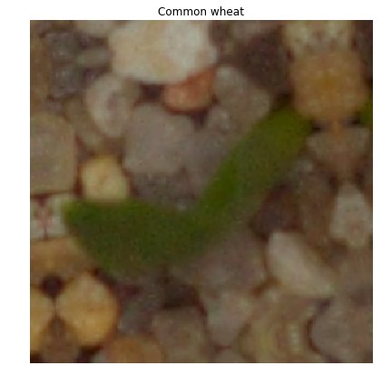
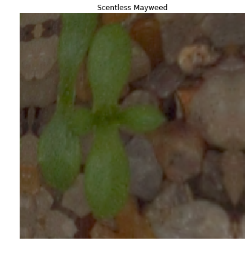

<h1>Table of Contents<span class="tocSkip"></span></h1>
<div class="toc"><ul class="toc-item"><li><span><a href="#Getting-dataset-into-working-directory" data-toc-modified-id="Getting-dataset-into-working-directory-1"><span class="toc-item-num">1&nbsp;&nbsp;</span>Getting dataset into working directory</a></span></li><li><span><a href="#Getting-Started" data-toc-modified-id="Getting-Started-2"><span class="toc-item-num">2&nbsp;&nbsp;</span>Getting Started</a></span></li></ul></div>

# Getting dataset into working directory


```python
import fastai.vision as fv
```


```python
path_input = fv.Path('/kaggle/input')
path_working = fv.Path('/kaggle/working')
```


```python
path_input.ls()
```


    [PosixPath('/kaggle/input/sample_submission.csv'),
     PosixPath('/kaggle/input/train'),
     PosixPath('/kaggle/input/test')]


```python
path_working.ls()
```


    [PosixPath('/kaggle/working/__notebook_source__.ipynb'),
     PosixPath('/kaggle/working/input'),
     PosixPath('/kaggle/working/.ipynb_checkpoints')]


```python
!pwd
```

    /kaggle/working


```python
!rm -rf input  # remove everything inside /kaggle/working/input/ including the folder itself
```


```python
!cp -r ../input . # copy everything inside /kaggle/input/ into current directory 
# /kaggle/working
```


```python
path_data = fv.Path('/kaggle/working/input')
```


```python
path_data.ls()
```


    [PosixPath('/kaggle/working/input/train'),
     PosixPath('/kaggle/working/input/sample_submission.csv'),
     PosixPath('/kaggle/working/input/test')]


# Getting Started


```python
path_train = fv.Path('/kaggle/working/input/train')
```


```python
path_train.ls()
```


    [PosixPath('/kaggle/working/input/train/Shepherds Purse'),
     PosixPath('/kaggle/working/input/train/Maize'),
     PosixPath('/kaggle/working/input/train/Loose Silky-bent'),
     PosixPath('/kaggle/working/input/train/Sugar beet'),
     PosixPath('/kaggle/working/input/train/Small-flowered Cranesbill'),
     PosixPath('/kaggle/working/input/train/Cleavers'),
     PosixPath('/kaggle/working/input/train/Black-grass'),
     PosixPath('/kaggle/working/input/train/Charlock'),
     PosixPath('/kaggle/working/input/train/Scentless Mayweed'),
     PosixPath('/kaggle/working/input/train/Common wheat'),
     PosixPath('/kaggle/working/input/train/Common Chickweed'),
     PosixPath('/kaggle/working/input/train/Fat Hen')]


```python
np.random.seed(42)
data = fv.ImageDataBunch.from_folder(path_train,test='../test', 
                                  ds_tfms=fv.get_transforms(),
                                  valid_pct=0.25,
                                  size=299,
                                  bs=32,
                                  num_workers=0)
data.normalize(fv.imagenet_stats)
```


    ImageDataBunch;
    
    Train: LabelList (3563 items)
    x: ImageItemList
    Image (3, 299, 299),Image (3, 299, 299),Image (3, 299, 299),Image (3, 299, 299),Image (3, 299, 299)
    y: CategoryList
    Shepherds Purse,Shepherds Purse,Shepherds Purse,Shepherds Purse,Shepherds Purse
    Path: /kaggle/working/input/train;
    
    Valid: LabelList (1187 items)
    x: ImageItemList
    Image (3, 299, 299),Image (3, 299, 299),Image (3, 299, 299),Image (3, 299, 299),Image (3, 299, 299)
    y: CategoryList
    Common Chickweed,Loose Silky-bent,Maize,Cleavers,Small-flowered Cranesbill
    Path: /kaggle/working/input/train;
    
    Test: LabelList (794 items)
    x: ImageItemList
    Image (3, 299, 299),Image (3, 299, 299),Image (3, 299, 299),Image (3, 299, 299),Image (3, 299, 299)
    y: EmptyLabelList
    ,,,,
    Path: /kaggle/working/input/train


```python
data.path
```


    PosixPath('/kaggle/working/input/train')


```python
print(data.classes)
len(data.classes),data.c
```

    ['Black-grass', 'Charlock', 'Cleavers', 'Common Chickweed', 'Common wheat', 'Fat Hen', 'Loose Silky-bent', 'Maize', 'Scentless Mayweed', 'Shepherds Purse', 'Small-flowered Cranesbill', 'Sugar beet']


    (12, 12)


```python
data.show_batch(rows=1,figsize=(7,6))
```





```python
data.show_batch(rows=1,figsize=(7,6))
```





```python
learn = fv.create_cnn(data,fv.models.resnet50,metrics=fv.error_rate)
```

    Downloading: "https://download.pytorch.org/models/resnet50-19c8e357.pth" to /tmp/.torch/models/resnet50-19c8e357.pth
    100%|██████████| 102502400/102502400 [00:01<00:00, 92177924.13it/s]


```python
learn.lr_find()
```


```python
learn.recorder.plot()
```


```python
learn.fit_one_cycle(6,slice(1e-2))
```


```python
learn.save('stg-1')
```


```python
learn.lr_find()
```


```python
learn.recorder.plot()
```


```python
#learn.load('stg-1')
```


```python
learn.unfreeze()
learn.fit_one_cycle(4,max_lr=slice(1e-4,1e-3))
```


```python
data = ImageDataBunch.from_folder(path,test='../test', ds_tfms=get_transforms(),valid_pct=0.25,size=350,bs=32,num_workers=0)
data.normalize(imagenet_stats)
```


```python
interp = ClassificationInterpretation.from_learner(learn)
from sklearn import metrics
print(metrics.classification_report(interp.y_true.numpy(), interp.pred_class.numpy(),target_names =data.classes))
```


```python
learn.save('stg-2')
```


```python
learn.data=data
```


```python
learn.unfreeze()
learn.fit_one_cycle(4,max_lr=slice(1e-5,1e-4))
```


```python
preds,y=learn.get_preds(ds_type=DatasetType.Test)
```


```python
preds = np.argmax(preds, axis = 1)
preds_classes = [data.classes[i] for i in preds]
```


```python
submission = pd.DataFrame({ 'file': os.listdir('input/test'), 'species': preds_classes })
submission.to_csv('test_classification_results.csv', index=False)
```


```python
submission
```


```python
!rm -rf input
```
